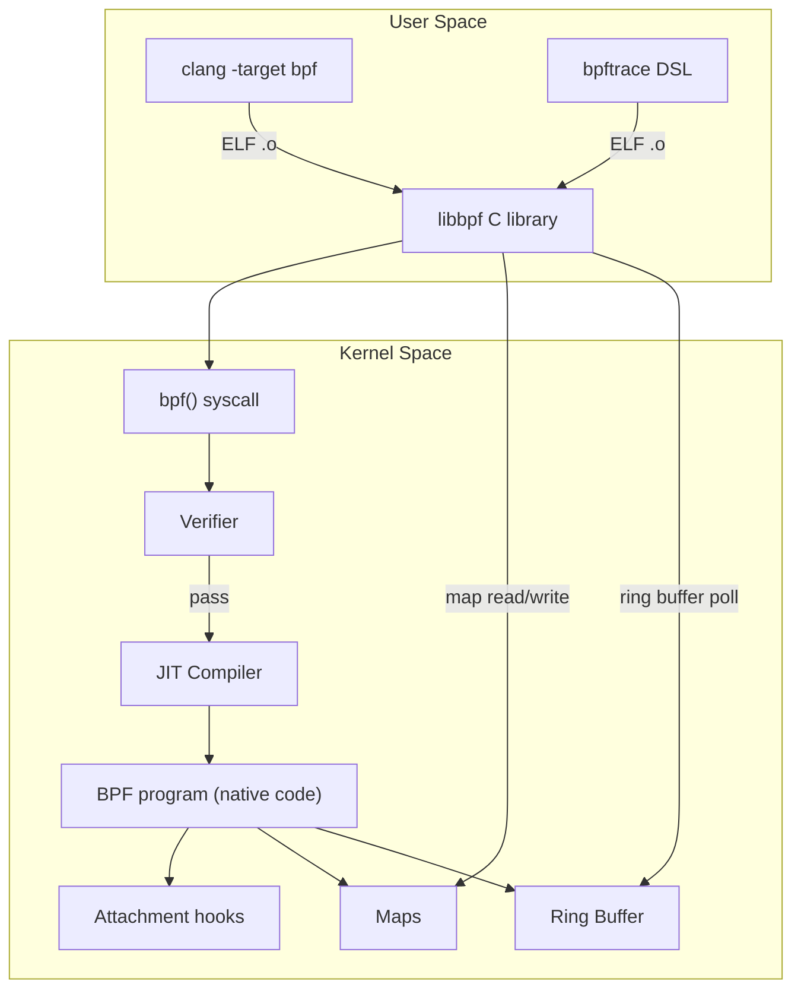

# eBPF Deep Dive — Verifier, JIT, Maps, and Subsystems

## Overview

The [eBPF overview](../kernel/ebpf.md) covers the hook types and use cases. This chapter dissects the **kernel internals**: the verifier algorithm, JIT compilation backends, map implementations, ring buffer mechanics, CO-RE/BTF, and each eBPF subsystem (XDP, AF_XDP, tc-BPF, cgroup BPF, LSM BPF).



## The Verifier — Ensuring Safety

### Overview

The verifier (`kernel/bpf/verifier.c`) is the heart of eBPF safety. It performs **static analysis** on the BPF bytecode before any execution. If the verifier rejects a program, the `bpf(BPF_PROG_LOAD)` syscall fails with `EINVAL`.

### Verification Algorithm

The verifier uses **abstract interpretation** — it simulates all possible execution paths through the program, tracking the **state of every register** at each instruction:

```c
// Simplified verifier state (kernel/bpf/verifier.c)
struct bpf_reg_state {
    enum bpf_reg_type type;    // SCALAR_VALUE, PTR_TO_CTX, PTR_TO_MAP_VALUE, ...
    s64 imm;                   // immediate value
    s64 off;                   // offset from pointer base
    u32 id;                    // identification for reference tracking
    struct bpf_range precise;  // known value range [umin, umax]
    // For scalars: track smin, smax, umin, umax, u32_min, u32_max
    // This enables bounds checking
};

struct bpf_verifier_state {
    struct bpf_reg_state regs[MAX_BPF_REG]; // 11 registers: R0-R10
    struct bpf_stack_state *stack;          // 512 bytes of stack, 8 bytes per slot
};

// Main loop: do_check()
for each instruction:
    1. Classify instruction (ALU64, ALU32, JMP, MEM, HELPER_CALL)
    2. Check register types are compatible with the operation
    3. For memory access: verify pointer type, check bounds (off + size within object)
    4. For JMP: simulate both branches, push new state onto verification stack
    5. For helper call: check helper ID is allowed for this program type,
     verify argument types match helper signature
    6. Track scalars: update min/max bounds after each ALU operation
```

### Key Safety Guarantees

| Property | How Verified |
|----------|-------------|
| **Bounded execution** | Backward jumps tracked; total instruction count capped at 1M (`BPF_COMPLEXITY_LIMIT_INSNS`). Loops bounded via scalar tracking — if a loop variable's range doesn't converge, rejected. |
| **Memory safety** | Every load/store checked: pointer type must be `PTR_TO_*`, offset + access size must be within the object's known size. |
| **No arbitrary pointers** | Pointers can only be obtained from: context (ctx), map lookups, stack, helper return values. Cannot construct a pointer from a scalar. |
| **No kernel memory writes** | Only `bpf_probe_read_kernel()` helper can read kernel memory; no write helper exists for arbitrary kernel memory. |
| **Type safety** | Registers have types; mixing incompatible types (e.g., adding two pointers) is rejected. |
| **Stack safety** | Stack reads before writes detected; 8-byte slot granularity enforced. |

### Dead Code Elimination and Path Pruning

The verifier tracks explored paths and prunes states that are **more permissive** than an already-explored state at the same instruction (dominance pruning). This prevents exponential blowup on programs with many branches. Since Linux 5.2, the verifier also does **dead code elimination** — unreachable instructions after `return` are removed.

> **Interview Angle**: "How does the verifier prevent infinite loops?" It tracks every backward jump. For each potential loop, it checks that the loop variable (a scalar register) has a strictly decreasing range across iterations. If the range doesn't converge (e.g., `for (;;) { if (cond) break; }` with no counter), the verifier rejects the program. This is why BPF programs must have bounded loops with a provable upper bound.

## JIT Compilation

After the verifier approves the program, the JIT compiler (`arch/x86/net/bpf_jit_comp.c` for x86_64) translates BPF bytecode to native machine code:

```c
// kernel/bpf/core.c
// bpf_int_jit_compile() dispatches to arch-specific JIT:
// x86_64: arch/x86/net/bpf_jit_comp.c
// arm64: arch/arm64/net/bpf_jit_comp.c
// riscv64: arch/riscv/net/bpf_jit_comp.c

// JIT produces native code pages (RWX → RX after write)
// The JIT'd function pointer is stored in prog->bpf_func
// When the hook fires, the kernel calls prog->bpf_func(ctx)
```

JIT optimizations:
- **Register mapping** — BPF R0-R10 map directly to x86_64 registers (R0→RAX, R1→RCX, R2→RDX, ...).
- **Constant blinding** — `CONFIG_BPF_JIT_ALWAYS_ON` with constant blinding prevents JIT spraying attacks by XORing immediate constants with a random key.
- **Tail calls** — `bpf_tail_call()` replaces the current program's stack frame with the target program's (no function call overhead).

| JIT Backend | Status | Key Feature |
|-------------|--------|-------------|
| x86_64 | Production | Direct register mapping, constant blinding |
| arm64 | Production | BPF callee-saved register mapping |
| riscv64 | Production (6.8+) | Growing support |
| s390x | Production | Enterprise support |

## Maps — Kernel Data Structures

### Map Types

| Type | Implementation | Use Case |
|------|---------------|----------|
| `BPF_MAP_TYPE_HASH` | `kernel/bpf/hashtab.c` — resizable hash table with preallocated or kmalloc buckets | General key→value |
| `BPF_MAP_TYPE_ARRAY` | `kernel/bpf/arraymap.c` — contiguous memory, O(1) lookup by index | Per-CPU counters, config |
| `BPF_MAP_TYPE_PERCPU_HASH` | Per-CPU copy of hash map | Lock-free per-CPU aggregation |
| `BPF_MAP_TYPE_LRU_HASH` | `kernel/bpf/lru_list.c` — LRU eviction | Connection tracking, caches |
| `BPF_MAP_TYPE_RINGBUF` | `kernel/bpf/ringbuf.c` — lock-free SPSC ring buffer | High-throughput event streaming |
| `BPF_MAP_TYPE_PERF_EVENT_ARRAY` | `kernel/trace/bpf_trace.c` — per-CPU perf buffers | Legacy perf output |
| `BPF_MAP_TYPE_STACK_TRACE` | `kernel/bpf/stackmap.c` — deduped stack traces | Flame graph data |
| `BPF_MAP_TYPE_LPM_TRIE` | `kernel/bpf/lpm_trie.c` — longest prefix match | IP routing, CIDR matching |
| `BPF_MAP_TYPE_CGROUP_STORAGE` | Per-cgroup key→value | Cgroup-level policy data |
| `BPF_MAP_TYPE_SK_STORAGE` | Per-socket key→value | Socket-level metadata |

### Ring Buffer (`BPF_MAP_TYPE_RINGBUF`)

The ring buffer (`kernel/bpf/ringbuf.c`, Linux 5.8+) is the modern replacement for `perf_event_array` for BPF→user-space data streaming:

```c
// Kernel-side: bpf_ringbuf_output() or bpf_ringbuf_reserve() + bpf_ringbuf_submit()
void *data = bpf_ringbuf_reserve(&ringbuf, sizeof(struct event), 0);
if (data) {
    struct event *e = data;
    e->pid = bpf_get_current_pid_tgid() >> 32;
    e->timestamp = bpf_ktime_get_ns();
    bpf_ringbuf_submit(data, 0);  // commit to ring buffer
}

// User-side (libbpf):
// ring_buffer__new() → ring_buffer__poll(fd, timeout_ms)
// Callback receives pointer to record, zero-copy (no memcpy from kernel)
```

The ring buffer uses a **lock-free SPSC (single-producer, single-consumer) per-CPU** design:
- Producer (kernel BPF program): reserves space with `ringbuf->producer_pos` (atomic increment), writes data, then commits by advancing `ringbuf->consumer_pos` in a commit record.
- Consumer (user space): reads from `consumer_pos`, processes records, advances.
- No `memcpy` — data is directly readable from the mmap'd ring page.

## CO-RE (Compile Once — Run Everywhere)

### The Problem

BPF programs access kernel data structures (e.g., `struct task_struct`). These structures change between kernel versions — fields are added, removed, or reordered. Pre-CO-RE, every BPF program was compiled per kernel version.

### BTF (BPF Type Format)

BTF encodes the **type information** of the kernel — struct layouts, enum definitions, function prototypes — in a compact binary format (`.BTF` ELF section):

```c
// Generated by pahole from DWARF debuginfo:
// pahole -J vmlinux → generates vmlinux.BTF
// Installed at /sys/kernel/btf/vmlinux

// btf_type:
// BTF_KIND_STRUCT: name, size, member[0..n] (name, offset, type_id)
// BTF_KIND_INT: name, size, encoding (signed/unsigned/char)
// BTF_KIND_FUNC_PROTO: return_type, param[0..n] (name, type_id)
```

### CO-RE Relocations

```c
// BPF program (with CO-RE):
struct task_struct *task = (struct task_struct *)bpf_get_current_task();
u64 start_time = BPF_CORE_READ(task, start_boottime);

// clang generates a CO-RE relocation in the .BTF.ext ELF section:
// { .type = BPF_CORE_FIELD, .off = offsetof relocation,
//   .spec = { struct_name = "task_struct", field = "start_boottime" } }

// libbpf at load time:
// 1. Load /sys/kernel/btf/vmlinux
// 2. For each CO-RE relocation, search BTF for the field
// 3. If field exists: patch the offset into the BPF instruction
// 4. If field doesn't exist or changed type: fail with clear error
```

> **Interview Angle**: "How does CO-RE actually work?" The compiler emits relocations (field name + struct name) instead of hardcoded offsets. At load time, libbpf reads the target kernel's BTF, resolves each relocation to the current offset, and patches the BPF instructions. This means one compiled binary works across kernel versions as long as the field names haven't changed — even if the layout shifted.

## XDP (eXpress Data Path)

### The XDP Hook Point

XDP runs at the **earliest possible point** in the receive path — directly in the NIC driver's `napi_poll()` routine, before `skb` allocation:

```text
NIC receives packet
  → Driver's NAPI poll (e.g., mlx5e_napi_poll)
    → XDP program runs on raw packet in driver's receive buffer
      → XDP_PASS: continue to normal skb allocation + network stack
      → XDP_DROP: free buffer, no further processing (~50ns decision)
      → XDP_TX: bounce back out the same NIC (L2 forwarding)
      → XDP_REDIRECT: forward to another NIC or socket (AF_XDP)
      → XDP_ABORTED: drop + tracepoint
```

### XDP vs Kernel Network Stack

| Aspect | XDP | Kernel Network Stack |
|--------|-----|---------------------|
| Processing point | Driver NAPI poll, before skb | After skb allocation, netif_receive_skb() |
| Packet representation | `xdp_buff` (raw buffer, no metadata) | `sk_buff` (shared, with headers, cloned) |
| Overhead per packet | ~50-100 ns | ~500-2000 ns |
| TCP/IP features | None (raw frame) | Full (conntrack, TCP state, sockets) |
| Typical PPS | 10-40 Mpps (single core) | 1-5 Mpps |

### AF_XDP

AF_XDP (`socket(AF_XDP, ...)`) allows user-space to receive packets **directly from the XDP layer** without going through the kernel network stack:

```text
XDP program returns XDP_REDIRECT to AF_XDP socket
  → Packet placed in UMEM (user-registered memory region)
  → Fill ring: kernel tells user which buffers are available
  → Rx ring: kernel fills with received packet descriptors
  → Tx ring: user submits packets to transmit
  → Completion ring: kernel confirms transmitted packets

// User space polls Rx ring via syscall or busy-wait
// No skb allocation, no copying — zero-copy from NIC to user space
```

AF_XDP is the kernel's answer to DPDK: it provides kernel-bypass networking **without** requiring a dedicated CPU core, custom drivers, or root-owned DPDK processes. The kernel retains control (via BPF programs) while user space gets raw packet access.

## tc-BPF (Traffic Control BPF)

tc-BPF attaches BPF programs to the **traffic control (tc)** layer, which sits after the NIC but before routing:

```text
NIC → XDP → tc ingress → routing decision → tc egress → NIC

// Attach BPF to tc:
tc qdisc add dev eth0 clsact
tc filter add dev eth0 ingress bpf da obj prog.o sec tc/ingress
tc filter add dev eth0 egress  bpf da obj prog.o sec tc/egress

// BPF program can read/write packet, set skb->mark, redirect, drop
```

tc-BPF has access to the full `sk_buff` (unlike XDP which sees raw frames), enabling:
- Packet classification and marking (for QoS)
- NAT, policy routing
- Container network policy (Cilium uses this for pod connectivity)

## cgroup BPF

BPF programs can attach to **cgroups** to enforce policy on all processes in the cgroup:

| Attach Type | Hook Point | Use Case |
|-------------|-----------|----------|
| `BPF_CGROUP_INET_INGRESS` | Packet ingress for socket | Per-cgroup firewall rules |
| `BPF_CGROUP_INET_EGRESS` | Packet egress from socket | Egress policy, bandwidth limits |
| `BPF_CGROUP_SOCK_OPS` | Socket operations (connect, listen) | Connection tracking, service mesh |
| `BPF_CGROUP_DEVICE` | Device access (mknod, open) | Restrict /dev access per cgroup |
| `BPF_CGROUP_SYSCTL` | sysctl writes | Prevent sysctl modifications |
| `BPF_CGROUP_SETSID` | setSID calls | SID enforcement |

## LSM BPF (BPF-LSM)

BPF-LSM (Linux 5.7+) allows BPF programs to implement **Linux Security Module** hooks — the same hooks used by SELinux, AppArmor, and Smack:

```c
// BPF LSM program example (Cilium Tetragon style):
SEC("lsm/file_open")
int BPF_PROG(file_open, struct file *file)
{
    // Check if the process should be allowed to open this file
    // Can read file->f_path, current->comm, etc.
    // Return 0 to allow, -EPERM to deny
    return 0;
}

// Attach:
// bpftool prog load tetragon_lsm.o type lsm
```

LSM BPF programs are **verified** (like all BPF) and run **in addition to** the existing LSM (they are stacked, not replacing). They can implement runtime security policies: detecting container escapes, restricting file access, auditing exec calls.

## libbpf and bpftrace

### libbpf (`tools/lib/bpf/libbpf.c`)

The standard C library for loading BPF programs:

```c
// Simplified libbpf usage:
struct bpf_object *obj = bpf_object__open_file("prog.bpf.o", NULL);
bpf_object__load(obj);  // loads maps, verifies & JITs programs
struct bpf_program *prog = bpf_object__find_program_by_name(obj, "my_prog");
bpf_program__attach(prog);  // auto-attaches based on section name
struct bpf_map *map = bpf_object__find_map_by_name(obj, "events");
int map_fd = bpf_map__fd(map);
// Read from map_fd in a loop
```

libbpf handles: BTF loading, CO-RE relocation, map creation, program loading, auto-attachment based on SEC() names, and ring buffer polling.

### bpftrace

A high-level tracing DSL that compiles to BPF via libbpf:

```bash
# Count syscalls by program:
bpftrace -e 'tracepoint:raw_syscalls:sys_enter { @[comm] = count() }'

# Profile on-CPU time:
bpftrace -e 'profile:hz:99 { @[ustack] = count() }'

# Trace TCP retransmits:
bpftrace -e 'tracepoint:tcp:tcp_retransmit_skb { @retrans[comm, pid] = count() }'
```

## Interview Questions

### Q: Walk me through the BPF verifier's algorithm.

The verifier performs abstract interpretation over all paths. It maintains a state (register types, scalar ranges, stack slots) at each instruction. For each instruction, it checks type compatibility (e.g., can't add two pointers), memory access bounds (pointer + offset must be within the known object size), and helper call signatures. For branches, it simulates both paths. Backward jumps are tracked to ensure loops converge (scalar ranges shrink). The total explored state count is bounded. If any path has an unsafe operation, the entire program is rejected.

### Q: Why does AF_XDP use UMEM instead of regular memory?

UMEM is a **user-registered** memory region that the NIC DMA engine writes directly into (with IOMMU validation). This eliminates the kernel's intermediate copy: the NIC writes packet data directly into the user-mapped buffer, and the user reads it without any syscall or copy. The fill/rx/tx/completion rings are the only shared metadata, and they're also in user-mapped memory.

### Q: LSM BPF vs SELinux — when would you use each?

SELinux is a **compile-time policy** (loaded at boot, static rules). LSM BPF is a **runtime programmable policy** (loaded at any time, can make decisions based on dynamic state like container ID, process tree, network connections). Use SELinux for system-wide mandatory access control (e.g., confining system services). Use LSM BPF for dynamic, context-aware security (e.g., "deny this specific container from opening /etc/shadow").

## References

- `kernel/bpf/verifier.c` — the verifier (~10K lines)
- `kernel/bpf/core.c` — JIT dispatch, BPF interpreter fallback
- `arch/x86/net/bpf_jit_comp.c` — x86_64 JIT
- `kernel/bpf/ringbuf.c` — BPF ring buffer implementation
- `tools/lib/bpf/libbpf.c` — user-space BPF library
- `Documentation/bpf/` — kernel BPF documentation
- [ebpf.io](https://ebpf.io/) — community resources
- [Cilium BPF & XDP Reference](https://docs.cilium.io/en/stable/bpf/)

## Related Topics

- [eBPF Overview](../kernel/ebpf.md) — hooks, maps, use cases
- [Tracing & Probes](./tracing-probes.md) — kprobes, tracepoints, BPF trampolines
- [Network Stack](./network-stack.md) — where XDP/tc-BPF hook in
- [Namespaces & cgroups](./namespaces-cgroups.md) — cgroup BPF attachment points
- [Block Layer](./block-layer.md) — BPF for block I/O observation
