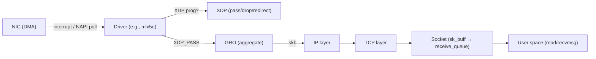

# Linux Network Stack — skb, NAPI, TCP Internals, and Offloads

## Overview

The Linux networking stack processes millions of packets per second. This chapter covers the internal data structures (`sk_buff`), the NAPI polling mechanism, offload technologies (GRO, GSO, TSO, checksum offload), RSS/RPS/RFS, the TCP implementation internals (congestion control: BBR, CUBIC, fq_codel, pacing), and XDP vs DPDK tradeoffs.



## sk_buff — The Packet Buffer

### Structure

```c
// include/linux/skbuff.h (simplified)
struct sk_buff {
    // These two are the most important for understanding layout:
    union {
        struct {
            __u32                                       skb_refcnt; // reference count
        } __cacheline_aligned_in_smp;
    };

    struct sk_buff              *next;    // linked list
    struct sk_buff              *prev;
    struct sock                 *sk;      // owning socket

    ktime_t                             tstamp;   // timestamp (for hardware/software)
    struct net_device           *dev;  // arriving/leaving device

    // Transport layer header pointer
    __be16                                      protocol; // ETH_P_IP, ETH_P_IPV6, etc.
    __u16                                       transport_header; // offset from head to transport hdr
    __u16                                       network_header;   // offset from head to network hdr
    __u16                                       mac_header;       // offset from head to MAC hdr

    // Data area pointers:
    sk_buff_data_t                      transport_header;
    sk_buff_data_t                      network_header;
    sk_buff_data_t                      mac_header;

    // The actual data is stored in a separate allocation (or in the skb itself for small packets):
    // "head" points to the start of the buffer
    // "data" points to the current start of packet data
    // "tail" points to the end of packet data
    // "end" points to the end of the buffer
    unsigned char                       *head;
    unsigned char                       *data;
    unsigned char                       *tail;
    unsigned char                       *end;
};
```

### Linear vs Non-Linear (paged) skbs

```text
Linear skb (small packet, ≤ 256 bytes typically):
┌──────────────────────────────────┐
│ skb struct │ head → [MAC|IP|TCP|payload] │ end
└──────────────────────────────────┘

Paged skb (large packet, e.g., jumbo frame):
┌──────────┐
│ skb struct │ head → [MAC|IP|TCP|...] → tail
└──────────┘
     │
     └── skb_shinfo(skb)->frags[] → page references
         frags[0] → page (4096 bytes, offset 0, size 4096)
         frags[1] → page (4096 bytes, offset 0, size 4096)
```

Paged skbs avoid copying: large payloads stay in the same pages they were DMA'd into from the NIC. This is essential for zero-copy receive.

### skb_shared_info

```c
struct skb_shared_info {
    atomic_t    dataref;   // data buffer reference count
    __u8                        tx_flags;  // checksum offload flags
    unsigned short      gso_size; // for GSO
    unsigned short      gso_segs; // number of GSO segments
    unsigned short      gso_type; // SKB_GSO_TCPV4, SKB_GSO_TCPV6, etc.
    struct sk_buff      *frag_list; // for fragmented skbs
    skb_frag_t          frags[MAX_SKB_FRAGS]; // page fragment array (17 max)
};
// Located at skb->end (after the skb data buffer)
```

## NAPI — New API (Interrupt Mitigation)

### The Problem

At high packet rates, per-packet interrupts cause **interrupt storm** — the CPU spends all its time handling interrupts, never processing the packets.

### NAPI Solution

```text
1. First packet arrives → NIC generates interrupt
   → Driver disables further interrupts (IRQ masking)
   → Schedules NAPI poll on the CPU's napi_struct

2. NAPI poll runs (in softirq context, NET_RX_SOFTIRQ):
   → Calls driver's ndo_start_xmit or napi_poll callback
   → Drives up to budget packets (default: 64) from the NIC's Rx ring
   → For each packet: allocates skb, DMA unmap, passes to network stack
   → If all packets drained: re-enable interrupts, exit poll
   → If budget exhausted: reschedule poll, continue next softirq

3. No more packets → NIC interrupt fires again → goto 1
```

```c
// Driver NAPI setup:
static int mlx5e_napi_poll(struct napi_struct *napi, int budget)
{
    // Process up to `budget` packets from Rx ring
    int work_done = mlx5e_poll_rx_cq(..., budget);
    if (work_done < budget) {
        napi_complete_done(napi, work_done); // re-enable IRQs
    }
    return work_done;
}
```

| Aspect | Interrupt-driven | NAPI | Busy-poll (DPDK style) |
|--------|-----------------|------|----------------------|
| CPU overhead per pkt | High (interrupt + softirq) | Low (bulk poll) | Lowest (no interrupt, no softirq) |
| Latency | Lowest (interrupt fires immediately) | ~µs (wait for poll) | Depends on poll interval |
| Scalability | Poor (interrupt storm) | Good (adaptive) | Best (dedicated cores) |
| Kernel involvement | Full stack | Full stack | Bypassed (DPDK) |

## GRO, GSO, TSO — Packet Aggregation and Offload

### GSO — Generic Segmentation Offload (transmit)

The kernel sends **one large skb** and the NIC splits it into MTU-sized segments:

```text
Application writes 64KB
  → TCP segments into 64KB "super-skb" with skb_shinfo->gso_size = 1460
  → Queued to driver with gso_type = SKB_GSO_TCPV4
  → Driver/HW splits into ~44 × 1460-byte packets
  → Each gets correct IP ID, TCP seq, checksum
```

### TSO — TCP Segmentation Offload (transmit)

TSO is the NIC-specific implementation of GSO for TCP. The NIC hardware does the segmentation.

### GRO — Generic Receive Offload (receive)

GRO aggregates consecutive packets into a single large skb before passing to the network stack:

```c
// net/core/gro.c
// For each incoming packet, GRO checks if it can be merged with the previous:
// - Same flow (src/dst IP, src/dst port, protocol)
// - Consecutive sequence numbers (TCP)
// - Same GSO size (if already a GRO skb)
// If mergeable: attach as a frag to the existing skb (skb_shinfo->frags[])
// If not: flush the existing skb up the stack, start a new GRO flow
```

GRO typically coalesces up to **GRO_MAX_COALESCED_SIZE (65535 bytes)** or **64 segments**. This reduces the number of skbs the TCP layer must process, dramatically improving throughput.

### Checksum Offload

```text
// Transmit: NIC computes IP/TCP/UDP checksum in hardware
// skb->ip_summed = CHECKSUM_PARTIAL:
//   Kernel sets skb->csum = pseudo-header checksum
//   NIC adds data checksum → complete checksum

// Receive: NIC verifies checksum, reports result
// skb->ip_summed = CHECKSUM_UNNECESSARY:
//   Skip software checksum verification
```

## RSS, RPS, RFS — Packet Distribution

### RSS (Receive Side Scaling)

**Hardware** feature: the NIC computes a hash over packet headers (typically Toeplitz hash of src/dst IP + ports) and uses the hash to select a receive queue. Each queue is mapped to a specific CPU.

```bash
# Show RSS configuration:
ethtool -x eth0
# RX flow hash indirection table for eth0 with 8 RX queues:
# 0:  0  1  2  3  4  5  6  7
# RSS hash key:
# 6d:5a:6d:5a:6d:5a:6d:5a:6d:5a:6d:5a:...
```

### RPS (Receive Packet Steering)

**Software** RSS: if the NIC doesn't support RSS (or the driver doesn't expose it), RPS hashes the packet in software and enqueues it on the target CPU's `softnet_data->input_pkt_queue`. A remote CPU's NET_RX_SOFTIRQ processes it.

```bash
# Configure RPS:
echo ffff > /sys/class/net/eth0/queues/rx-0/rps_cpus
# This directs queue 0's packets to any CPU (bitmap 0xffff)
```

### RFS (Receive Flow Steering)

**Application-aware** RPS: instead of hashing to a CPU, RFS looks up which CPU is running the application that owns the socket (via `sock->sk_socket->wq->f_owner.pid`), and steers the packet to that CPU. This improves cache locality — the packet data arrives on the same CPU that will process it in `read()/recvmsg()`.

## TCP Implementation Internals

### struct tcp_sock

```c
// include/linux/tcp.h
struct tcp_sock {
    struct inet_connection_sock inet_conn;  // extends inet_connection_sock
    u16         tcp_header_len;  // TCP header size (including options)
    u16         gso_segs;       // GSO segment count
    u8          dupack_counter;

    // Congestion window:
    u32 snd_cwnd;         // congestion window (in packets, not bytes, legacy)
    u32 snd_ssthresh;     // slow start threshold
    u32 snd_nxt;          // next sequence number to send
    u32 snd_una;          // oldest unacknowledged sequence
    u32 rcv_nxt;          // next expected receive sequence

    // RTT estimation:
    u32 srtt_us;          // smoothed RTT (microseconds)
    u32 rttvar_us;        // RTT variance
    u32 rto_min;          // minimum RTO

    // BBR-specific:
    u32 pacing_rate;      // bytes per second
    u32 delivered;        // total delivered bytes (for BBR)
    // ...
};
```

### Congestion Control Modules

| Module | Algorithm | Kernel Config | Key Insight |
|--------|-----------|--------------|-------------|
| **CUBIC** | W Reno with cubic cwnd growth | `DEFAULT_CUBIC` | Default; cwnd grows as W(t) = C(t-K)³ + Wmax. Handles high bandwidth well. |
| **BBR** (v1/v2) | Model-based: measures BtlBw and RTprop | `TCP_CONG_BBR` | Doesn't use loss as signal. Measures bottleneck bandwidth and min RTT. v2 fixes BBR's unfairness and bufferbloat issues. |
| **DCTCP** | ECN-based, data center | `TCP_CONG_DCTCP` | Uses ECN marks (not loss) to estimate congestion. Keeps queues small. |
| **BBR + fq** | BBR with fair queuing pacing | Recommended combo | `fq` pacer ensures packets are sent at BBR's pacing rate, preventing bursts. |

### BBR State Machine

```text
BBR states:
  STARTUP → DRAIN → PROBE_BW → PROBE_RTT

STARTUP:  cwnd grows exponentially (2× per RTT) until BtlBw stops increasing
DRAIN:    drain the queue built during STARTUP (pacing_rate < BtlBw)
PROBE_BW: cycle through 8 gain phases (1.25×, 0.75×, 1×, 1×, 1×, 1×, 1×, 1×)
PROBE_RTT: periodically (every ~10s) send at 4 packets/RTT to measure true min RTT
```

### SYN Cookies

SYN cookies protect against **SYN flood** DoS attacks without maintaining per-connection state:

```c
// net/ipv4/syncookies.c
// When SYN queue is full (tcp_syncookies=1):
// Instead of allocating a full request_sock, encode state into the ISN:
//
// ISN = H(secret, src_ip, dst_ip, src_port, dst_port, t, MSS_indicator)
//
// On SYN-ACK-ACK (the final ACK of the 3-way handshake):
// 1. Recompute ISN from the incoming ACK's fields
// 2. If ISN - 1 == ACK number: valid cookie → allocate full socket
// 3. Extract MSS from the cookie's low bits
// 4. If mismatch: silently drop
```

SYN cookies sacrifice TCP options (window scaling, SACK, timestamps) encoded in the SYN, so they reduce performance for legitimate connections. They are a **last-resort** defense.

### TCP Fast Open (TFO)

TFO allows data in the **SYN packet**, saving one RTT on connection establishment for repeat connections:

```text
// First connection: normal TCP handshake
// Server sends a cookie in SYN-ACK (Fast Open Cookie)
// Client caches cookie

// Subsequent connections:
// Client sends SYN + Cookie + Data (up to ~16KB)
// Server verifies cookie, delivers data immediately (before handshake completes)
// Saves 1 RTT
```

TFO is enabled via `net.ipv4.tcp_fastopen = 3` (client + server). The cookie is cryptographically signed (HMAC-SHA1 of server secret + client IP).

### MPTCP (Multipath TCP)

MPTCP (`CONFIG_MPTCP`) allows a single TCP connection to use **multiple network paths** simultaneously (e.g., WiFi + 4G):

```text
// MPTCP extends TCP with:
// - MP_CAPABLE option in SYN (capability negotiation)
// - MP_JOIN subflow creation (additional paths)
// - MPTCP-level sequence numbers (mapping to per-subflow seqnos)
// - Path manager (net/mptcp/protocol.c) creates/manages subflows
// - Scheduler decides which subflow sends which data
```

### fq_codel — Fair Queuing with Controlled Delay

`fq_codel` is the default queuing discipline for the **root qdisc** on many distributions. It combines fair queuing (per-flow queues) with CoDel's AQM algorithm:

```text
fq_codel:
  1. Classify packets into flows (hash of 5-tuple)
  2. Each flow gets its own FIFO queue
  3. Round-robin service across flows
  4. For each queue: CoDel tracks sojourn time
     - If queue delay > target (5ms) for > interval (100ms): mark ECN or drop
  5. This prevents any single flow from monopolizing the buffer (no bufferbloat)
```

## XDP vs DPDK

| Aspect | XDP (AF_XDP) | DPDK |
|--------|-------------|------|
| Kernel modification | None (program attaches to hook) | Bypasses kernel entirely |
| Root required | For loading programs | For running DPDK app |
| CPU utilization | Shared with kernel | Dedicated CPU cores |
| Driver support | Native kernel drivers | Specialized PMD drivers (or VFIO) |
| NIC features | Full NIC features available | Limited NIC feature set |
| Memory | UMEM (user-registered) | Hugepages (rte_malloc) |
| Programming | C with libbpf, bpftrace | C with DPDK API |
| Use case | DDoS mitigation, load balancing, filtering | NFV, software routers, L7 proxies |

> **Interview Angle**: "When would you choose XDP over DPDK?" XDP when you need kernel-bypass performance **but** still want the kernel to handle TCP, routing, and socket management. DPDK when you need complete control over all packet processing (L4-L7) and can dedicate CPU cores. For most DDoS mitigation and load balancing, XDP is sufficient and simpler.

## TCP Buffer Autotuning

Linux's TCP buffer autotuning dynamically adjusts socket send and receive buffer sizes based on the connection's congestion window, RTT, and current throughput. This eliminates the need for applications to manually set buffer sizes via `setsockopt(SO_SNDBUF/SO_RCVBUF)` for most workloads.

### Sysctl Parameters

The autotuning bounds are controlled by three-tuple sysctls: `net.ipv4.tcp_rmem` (receive) and `net.ipv4.tcp_wmem` (send), each containing `[min, default, max]` in bytes.

```bash
net.ipv4.tcp_rmem = 4096 131072 6291456  # min 4KB, default 128KB, max 6MB
net.ipv4.tcp_wmem = 4096 16384 4194304   # min 4KB, default 16KB, max 4MB
```

- **min**: Buffer floor — even autotuning won't shrink below this. Also the default if `SO_RCVBUF/SO_SNDBUF` is set explicitly.
- **default**: Initial buffer size before autotuning kicks in.
- **max**: Upper bound for autotuned buffers. The actual maximum is also capped by `net.core.rmem_max` and `net.core.wmem_max`.

### Autotuning Mechanism

`net.ipv4.tcp_moderate_rcvbuf = 1` (default) enables receive buffer autotuning. On the receive side, the kernel estimates the required buffer to hold the **bandwidth-delay product** (BDP) plus some headroom: `buffer_target = 2 × cwnd × MSS` (approximately). The receive window advertised in TCP headers (`sk->sk_rcvbuf`) tracks this target, growing as throughput increases and shrinking when the connection is idle.

For high-throughput flows over high-latency paths (e.g., 10 Gbps across a 50ms RTT WAN link), the BDP alone is ~62 MB. The default `tcp_rmem` max of 6 MB would bottleneck such flows. Production high-throughput systems set `tcp_rmem` and `tcp_wmem` max to 16-32 MB and raise `rmem_max`/`wmem_max` accordingly.

### Interaction with Congestion Control

Autotuning interacts with BBR and CUBIC differently. With **CUBIC**, the congestion window grows until loss occurs, and autotuning scales the receive buffer to match the growing cwnd. With **BBR**, the pacing rate and estimated BtlBw drive the buffer requirements. BBR's `PROBE_BW` cycle can cause the cwnd to fluctuate (1.25× gain phase), and autotuning must track these oscillations without over-allocating. The `tcp_moderate_rcvbuf` logic uses an exponential moving average to smooth buffer adjustments.

### When Autotuning Is Disabled

Autotuning is disabled when: (1) the application explicitly sets `SO_SNDBUF` or `SO_RCVBUF` via `setsockopt` — this locks the buffer size (Linux doubles the requested value and caps it at `wmem_max`/`rmem_max`, then disables autotuning for that socket), (2) `tcp_moderate_rcvbuf = 0`, or (3) the socket uses `MSG_ZEROCOPY` for zero-copy sends (buffer management is application-driven). For high-performance applications (DPDK, custom TCP stacks), autotuning is irrelevant since they bypass the kernel stack entirely.

> **Interview Angle**: "A 10 Gbps flow over a 100ms RTT link is only getting 500 Mbps. What would you investigate?" The BDP is ~125 MB. Check `ss -ti` to see the current `sk_rmem_alloc` and receive buffer. If `rcv_space` is capped at the `tcp_rmem` max (default 6 MB), the receiver is advertising a small window, limiting throughput. Fix: increase `net.ipv4.tcp_rmem` max and `net.core.rmem_max` to at least 2× the BDP.

## Interview Questions

### Q: Walk me through a packet from NIC to user-space recv().

NIC receives frame → DMA into Rx buffer → NAPI poll picks it up → driver creates skb → XDP program (if attached) → GRO aggregates → IP layer → TCP layer (finds socket via hash lookup `__inet_lookup()`) → TCP sequence validation → data added to socket's `sk_receive_queue` → process wakes from `recvmsg()/epoll_wait()` → copies data from skb to user buffer.

### Q: Why does GRO exist?

Without GRO, every packet creates an skb and traverses the full stack. At 10 Gbps with 1460-byte TCP segments, that's ~850K packets/second — each traversing IP → TCP → socket lookup. GRO aggregates (e.g.) 44 TCP segments into one skb, reducing stack traversals by 44×. The TCP layer then sees one large skb and processes it efficiently.

### Q: How does BBR differ from CUBIC in the presence of packet loss?

CUBIC interprets loss as congestion signal and reduces cwnd (multiplicative decrease). BBR does not use loss at all — it measures **delivered bandwidth** and **minimum RTT** to estimate the bottleneck. If loss is from a non-congestive source (e.g., wireless interference), CUBIC unnecessarily reduces throughput while BBR maintains it. However, BBR v1 can be unfair to CUBIC flows (takes more bandwidth); BBR v2 addresses this.

## References

- `include/linux/skbuff.h` — sk_buff, skb_shared_info
- `net/core/dev.c` — NAPI, netif_receive_skb, GRO entry
- `net/core/gro.c` — GRO implementation
- `net/ipv4/tcp.c`, `net/ipv4/tcp_input.c` — TCP implementation
- `net/ipv4/tcp_bbr.c` — BBR congestion control
- `net/ipv4/tcp_cubic.c` — CUBIC congestion control
- `net/sched/sch_fq_codel.c` — fq_codel qdisc
- `net/xdp/` — XDP core

## Related Topics

- [eBPF Deep Dive](./ebpf-deep.md) — XDP, AF_XDP, tc-BPF
- [Tracing & Probes](./tracing-probes.md) — tracing network stack latency
- [Advanced OS: Fast I/O](../advanced/fast-io.md) — DPDK, SPDK, io_uring
- [Computer Networks](../../networks/overview.md) — TCP/IP fundamentals
