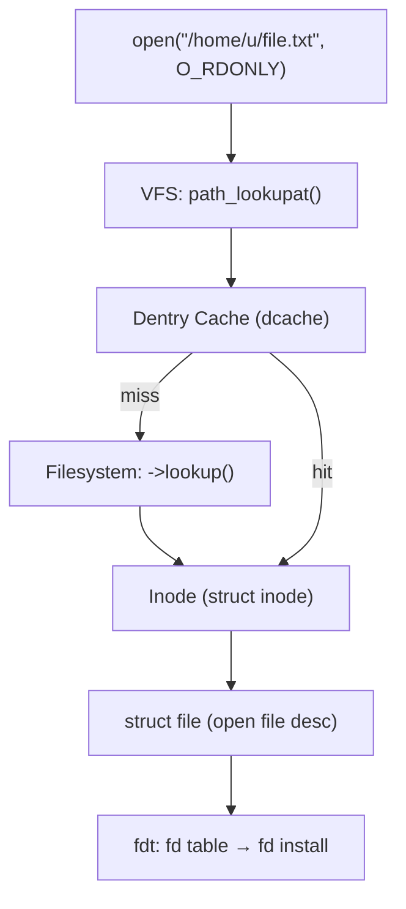

# VFS Internals — Inodes, Dentries, File Descriptors, and IPC

## Overview

The Virtual File System (VFS) is the kernel abstraction layer that unifies all file systems (ext4, xfs, btrfs, tmpfs, procfs, sysfs, etc.) behind a common set of operations. This chapter covers the **kernel data structures and algorithms**: inode lifecycle, dentry cache, pathname lookup, file descriptor tables, fd passing via SCM_RIGHTS, and kernel IPC sockets (AF_UNIX, netlink, rtnetlink).



## Inode Lifecycle

### struct inode

```c
// include/linux/fs.h (simplified)
struct inode {
    umode_t i_mode;           // S_IFREG, S_IFDIR, permissions
    unsigned short i_opflags;
    kuid_t i_uid;             // owner
    kgid_t i_gid;             // group
    loff_t i_size;            // file size in bytes
    struct timespec64 i_atime; // access time
    struct timespec64 i_mtime; // modification time
    struct timespec64 i_ctime; // change time
    const struct inode_operations *i_op;   // directory operations (mkdir, symlink, ...)
    const struct file_operations *i_fop;  // file operations (read, write, mmap, ...)
    struct super_block *i_sb;  // containing filesystem
    void *i_private;          // filesystem-private data
    struct address_space *i_mapping; // page cache for this inode
    unsigned long i_ino;      // inode number
    struct hlist_node i_hash; // inode hash table (sb + ino → inode)
    struct list_head i_lru;   // reclaim LRU list
    atomic_t i_count;         // reference count
    spinlock_t i_lock;
    // ... many more fields ...
};
```

### Lifecycle States

```text
1. ALLOCATED: iget_locked() / new_inode() — zeroed, i_count=1, I_NEW flag set
2. INITIALIZED: filesystem fills in i_op, i_fop, i_size, etc.  clears I_NEW
   → wake_up_bit(&inode->i_state, __I_NEW) wakes waiters in iget_locked()
3. ACTIVE: in use by at least one dentry or open file (i_count > 0)
4. IDLE: no references from dentries or files (i_count == 0), on LRU list
5. RECLAIMED: evicted by shrinker (iput_final → evict())
   → filesystem's ->evict_inode() called to free internal data
   → inode struct freed back to slab cache
```

### Inode Cache

Inodes are cached in two structures:
- **Hash table**: `inode_hashtable` — keyed by `(sb, ino)`, for lookup by inode number.
- **LRU lists**: `inode_lru` — per-superblock LRU for reclaim. The `sb->s_shrink` shrinker (called by kswapd) evicts unused inodes.

## Dentry Cache

### struct dentry

```c
// include/linux/dcache.h
struct dentry {
    atomic_t d_lockref;       // lock + refcount combined
    const struct dentry_operations *d_op;
    struct super_block *d_sb; // filesystem
    unsigned long d_hash;     // hash of name for lookup
    union {
        struct list_head d_lru;     // unused dentry LRU
        struct wait_queue_head *d_wait; // lookup in progress
    } d_u;
    struct hlist_bl_node d_hash;  // dentry hash bucket
    struct dentry *d_parent;      // parent directory
    struct qstr d_name;           // name ("file.txt")
    struct inode *d_inode;        // associated inode (NULL if negative)
    unsigned char d_iname[DNAME_INLINE_LEN]; // short name storage
};
```

### Negative Dentries

A **negative dentry** has `d_inode == NULL` — it remembers that a name **does not exist**. This is critical for performance: without negative caching, every `stat("/nonexistent")` would hit disk.

```bash
# Observe negative dentries:
sudo slabtop -o | rg dentry
# dentry: 12345 objects, 2.1 MB
# Many of these are negative dentries
```

Since Linux 4.19, negative dentries have a **half-life based reclamation** (aging). This prevents an attacker from exhausting dentry cache memory by statting millions of random paths.

### Pathname Lookup — `path_lookupat()`

The core VFS lookup walks the pathname component by component:

```c
// fs/namei.c: path_lookupat() → link_path_walk() → walk_component()

// For each component (e.g., "home", "user", "file.txt"):
// 1. dentry = __d_lookup(parent, &this);  // hash table lookup in dcache
//    if (dentry) {
//        if (dentry->d_inode == NULL) return -ENOENT; // negative dentry
//        goto next_component;
//    }
// 2. Cache miss: inode->i_op->lookup(parent_dir, &this, &dentry);
//    → filesystem reads from disk (directory index in ext4/xfs)
//    → dentry allocated and added to dcache
// 3. Handle symlinks: may recurse (limited by MAXSYMLINKS=40)
// 4. Handle mount points: follow_mount() → cross into mounted filesystem
```

The `RCU-walk` optimization (`fs/namei.c:try_to_unlazy_next()`) allows pathname lookup to proceed **without taking locks** on dentries/inodes. It uses RCU read-side to safely traverse the dcache. If a concurrent rename or unlink is detected, the path falls back to `ref-walk` (with locks). This makes `stat()` on hot paths ~5x faster.

> **Interview Angle**: "What is a dentry cache miss cost versus hit?" Hit: ~20-50 ns (hash lookup + pointer follow). Miss: filesystem `->lookup()` call, which for ext4 may read a directory block from disk or the page cache — microseconds to milliseconds. RCU-walk reduces the hit cost further by avoiding lock acquisition.

## File Descriptor Tables

### Three-Level Structure

```c
// Per-process:
struct files_struct {
    atomic_t count;           // reference count (shared after clone(CLONE_FILES))
    bool resize_in_progress;
    struct fdtable __rcu *fdt;
    struct fdtable fdtab;     // embedded small table
    spinlock_t file_lock ____cacheline_aligned_in_smp;
    unsigned int next_fd;     // cached hint for next available fd
    unsigned long close_on_exec_init[1]; // bitmap of FD_CLOEXEC
    unsigned long open_fds_init[1];      // bitmap of open fds
    // ...
};

// The fdtable:
struct fdtable {
    unsigned int max_fds;     // capacity
    struct file __rcu **fd;   // array of file pointers (indexed by fd number)
    unsigned long *close_on_exec; // bitmap
    unsigned long *open_fds;      // bitmap
    unsigned long *full_fds_bits; // tracking fully-allocated ranges
};
```

```text
Process → task_struct->files → files_struct
    → fdtable (fdt)
        → fd[0] → struct file (stdin)
        → fd[1] → struct file (stdout)
        → fd[3] → struct file (socket)
        → fd[42] → struct file (regular file)
```

### struct file — The Open File Description

```c
// include/linux/fs.h
struct file {
    union {
        struct llist_node fu_llist;   // for fd_install
        struct rcu_head fu_rcuhead;   // for SLAB_TYPESAFE_BY_RCU
    } f_u;
    struct path f_path;         // { .mnt, .dentry } — the path opened
    struct inode *f_inode;      // cached from f_path.dentry->d_inode
    const struct file_operations *f_op;
    spinlock_t f_lock;          // f_ep_links, f_flags
    atomic_long_t f_count;      // reference count
    unsigned int f_flags;       // O_RDONLY, O_NONBLOCK, O_DIRECT, ...
    fmode_t f_mode;             // FMODE_READ, FMODE_WRITE, FMODE_LSEEK
    loff_t f_pos;               // file offset (for non-SEEKABLE, per-file)
    struct address_space *f_mapping; // usually inode->i_mapping
    void *private_data;         // filesystem / driver private data
    // ...
};
```

**Key insight**: `struct file` is shared across `dup()`, `fork()`, and `SCM_RIGHTS` — it's the kernel's representation of an **open file description** (POSIX concept). Multiple file descriptors (even in different processes) can point to the same `struct file`, sharing the file offset (`f_pos`). The `f_pos` is protected by `f_lock` for threaded access (or `flock` for `preadv2`/`pwritev2` with `RWF_NOWAIT`).

## FD Passing — SCM_RIGHTS

FD passing allows a process to send an open file descriptor to another process via Unix domain sockets:

```c
// Sender:
int fds[2] = { fd_to_send };
struct msghdr msg = {0};
struct iovec iov = { .iov_base = "hello", .iov_len = 5 };
msg.msg_iov = &iov;
msg.msg_iovlen = 1;

char cmsgbuf[CMSG_SPACE(sizeof(int))];
msg.msg_control = cmsgbuf;
msg.msg_controllen = sizeof(cmsgbuf);

struct cmsghdr *cmsg = CMSG_FIRSTHDR(&msg);
cmsg->cmsg_level = SOL_SOCKET;
cmsg->cmsg_type = SCM_RIGHTS;
cmsg->cmsg_len = CMSG_LEN(sizeof(int));
memcpy(CMSG_DATA(cmsg), fds, sizeof(int));

sendmsg(unix_sock, &msg, 0);
```

**Kernel implementation** (`net/unix/af_unix.c`):

```c
// On sendmsg with SCM_RIGHTS:
// unix_attach_fds() pins each file (get_file(f) → f_count++)
// Creates scm_fp_list with file pointers
// Queued in the socket's receive buffer as an skb with SCM_RIGHTS

// On recvmsg:
// unix_detach_fds() installs each file into the receiver's fd table
//   → get_unused_fd_flags() → fd_install(fd, file)
// If receiver's fd table is full → close all passed files → return EOVERFLOW
```

> **Interview Angle**: "What happens to the file descriptor after SCM_RIGHTS?" The sender retains their fd — `f_count` is incremented, not transferred. The receiver gets a new fd number pointing to the same `struct file`. Both processes share the file offset. The sender must close their fd to release their reference.

## Unix Domain Sockets (AF_UNIX)

### Stream vs Datagram

| Type | Semantics | Use Case |
|------|-----------|----------|
| `SOCK_STREAM` | Byte-stream, connection-oriented, reliable | Docker API socket, systemd socket activation, PostgreSQL local |
| `SOCK_DGRAM` | Message-oriented, connectionless (but reliable) | syslog, udev events |
| `SOCK_SEQPACKET` | Message-oriented, connection-oriented, reliable | Rare, but exists |

### Internals

```c
// net/unix/af_unix.c
// AF_UNIX sockets use skb's (same as network stack) but for local transport:
// - No checksums, no fragmentation
// - Data stays in kernel memory (no NIC involved)
// - SCM_RIGHTS and SCM_CREDENTIALS are ancillary message types

// Connection: unix_stream_connect()
//   → unix_find_other() — resolves socket pathname to struct sock
//   → unix_state_lock(listener)
//   → Add to listener's accept queue (skb with SSCM_CONNECT type)

// Accept: unix_accept()
//   → Dequeue from accept queue
//   → Create new struct sock (child) paired with peer
```

### Filesystem vs Abstract Sockets

```bash
# Filesystem socket (visible in filesystem)
socat LISTEN:/tmp/my.sock ...
ls -la /tmp/my.sock  # srwxr-xr-x 1 user user 0 ...

# Abstract socket (no filesystem entry, prefixed with \0)
python3 -c "import socket; s=socket.socket(socket.AF_UNIX); s.bind('\0my_abstract')"
ls /proc/$$/fd/  # shows socket:[12345] but no filesystem path
```

Abstract sockets don't require filesystem access, don't need cleanup, and are not visible in mount namespaces. They're used by Android's logd, Chrome's sandbox, and container runtimes for internal communication.

## Netlink — Kernel ↔ User-Space Messaging

### Overview

Netlink is a **socket-based IPC** between the kernel and user space (and between user-space processes):

```c
// Create a netlink socket:
int fd = socket(AF_NETLINK, SOCK_RAW, NETLINK_ROUTE);  // routing messages
int fd2 = socket(AF_NETLINK, SOCK_RAW, NETLINK_KOBJECT_UEVENT);  // udev events
int fd3 = socket(AF_NETLINK, SOCK_RAW, NETLINK_GENERIC);  // generic netlink
```

### rtnetlink — Network Configuration

rtnetlink (`NETLINK_ROUTE`) is the kernel's **network configuration API** — everything `ip` command does uses rtnetlink:

```bash
# These are equivalent:
ip link show eth0
# Internally: send RTM_GETLINK message via NETLINK_ROUTE

ip addr add 10.0.0.1/24 dev eth0
# Internally: send RTM_NEWADDR message

ip route add default via 10.0.0.254
# Internally: send RTM_NEWROUTE message
```

### Generic Netlink

Generic netlink (`NETLINK_GENERIC`) is a **multiplexed** netlink family that allows kernel subsystems to define their own netlink families without reserving netlink protocol numbers:

```text
User space ←→ Generic Netlink Family
                    ├── nl80211 (wireless configuration — wpa_supplicant, hostapd)
                    ├── taskstats (per-task delay accounting)
                    ├── NL802154 (IEEE 802.15.4, Zigbee)
                    ├── ACPI events
                    └── ... any kernel subsystem can register
```

The generic netlink controller (`net/netlink/genetlink.c`) uses a family name (string) to multiplex messages. User space resolves the family name to a numeric ID via `CTRL_CMD_GETFAMILY`.

### Netlink Message Format

```c
struct nlmsghdr {
    __u32 nlmsg_len;     // total length including header
    __u16 nlmsg_type;    // message type (RTM_NEWLINK, NLMSG_ERROR, ...)
    __u16 nlmsg_flags;   // NLM_F_REQUEST, NLM_F_MULTI, NLM_F_ACK, ...
    __u32 nlmsg_seq;     // sequence number (for request/reply matching)
    __u32 nlmsg_pid;     // sender's port ID
};
// Followed by: struct nlattr (netlink attributes, TLV format)
```

## Interview Questions

### Q: What's the difference between an inode and a dentry?

The **inode** represents the file's metadata (permissions, size, timestamps, data block pointers). The **dentry** represents the linkage between a directory and a name — it's the directory entry that maps a name to an inode. One inode can have multiple dentries (hard links: two names pointing to the same inode). The dentry cache speeds up pathname lookup by avoiding filesystem `->lookup()` calls.

### Q: How does fork() share file descriptors?

`fork()` calls `copy_files()` which, by default, shares the parent's `struct files_struct` (increments `files->count`). Both parent and child share the same fd table and the same `struct file` objects (same file offsets). This is copy-on-reference. `clone(CLONE_FILES)` explicitly shares; without it, a full copy is made (`dup_fd()`).

### Q: Why does Docker use Unix domain sockets instead of TCP?

The Docker daemon socket (`/var/run/docker.sock`) uses AF_UNIX because: (1) filesystem permissions control access (no need for TLS), (2) no network stack overhead, (3) SCM_RIGHTS allows passing file descriptors (e.g., for container stdin/stdout), (4) abstract sockets avoid filesystem cleanup issues.

## References

- `fs/namei.c` — pathname lookup, RCU-walk
- `fs/dcache.c` — dentry cache implementation
- `fs/inode.c` — inode cache, iget_locked, iput
- `fs/file.c` — fdtable management, get_unused_fd_flags, fd_install
- `include/linux/fs.h` — `struct inode`, `struct file`, `struct files_struct`
- `net/unix/af_unix.c` — Unix domain socket implementation, SCM_RIGHTS
- `net/netlink/` — netlink core, rtnetlink, generic netlink
- `Documentation/filesystems/vfs.rst` — VFS documentation

## Related Topics

- [File Systems](../filesystems/README.md) — VFS from the filesystem developer's perspective
- [Namespaces & cgroups](./namespaces-cgroups.md) — sysfs, procfs, debugfs
- [Network Stack](./network-stack.md) — where netlink fits in kernel networking
- [eBPF Deep Dive](./ebpf-deep.md) — BPF observability on VFS operations
