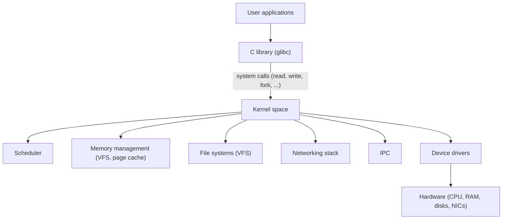

# Linux Kernel Internals

## Overview

The Linux kernel is a **monolithic** kernel: most OS services (scheduling, memory management, VFS, networking, IPC) run in **kernel space** with full hardware access, in one privileged address space. It was created by Linus Torvalds in 1991 and now runs everything from phones (Android) and embedded devices to the majority of cloud servers.

This page is the entry point for kernel-level interview topics. See [OS Overview](../overview.md) for the fundamentals.

## Kernel vs User Space



- **User space**: isolated per-process address space; applications cannot touch hardware directly.
- **Kernel space**: privileged (ring 0 on x86); the only path to hardware is via **system calls** and device drivers.
- **System call** = a controlled entry point (`syscall` instruction) that switches to kernel mode, validates arguments, and executes kernel code on behalf of the process.

## Why Monolithic?

| Property | Monolithic (Linux) | Microkernel (L4, seL4) |
|---|---|---|
| Drivers/subsystems in kernel | Yes | Minimal core; services in user space |
| Performance | Fast (no IPC for every service) | Slower IPC overhead |
| Stability isolation | A driver bug can crash the kernel | Services crash independently |
| Flexibility | Modules (`insmod`) add/remove at runtime | Clean interfaces |

Linux is monolithic **for performance**, mitigated by **loadable kernel modules** (`*.ko`, loaded with `insmod`/`modprobe`) and the hardening that eBPF provides for safe extensions (see [eBPF](./ebpf.md)).

## Key Subsystems

| Subsystem | What it does | Where in this book |
|---|---|---|
| **Scheduler** (CFS/EEVDF) | Decides which thread runs next | [CPU Scheduling](../scheduling/README.md) |
| **Memory management** | Virtual memory, page tables, page cache, swapping | [Memory Management](../memory/README.md), [Virtual Memory](../virtual-memory/README.md) |
| **VFS** | Unified interface over all file systems | [File Systems](../filesystems/README.md) |
| **Process/thread management** | fork/exec, task_struct, context switch | [Processes](../processes/README.md) |
| **IPC** | Pipes, sockets, shared memory, signals | [IPC](../processes/ipc.md) |
| **Networking** | The protocol stack (TCP/IP) | [Computer Networks](../../networks/overview.md) |
| **Block I/O layer** | Disk scheduling, I/O queues, io_uring | [I/O Systems](../io/README.md), [io_uring](./io-uring.md) |

## The syscall path

```text
user:  read(fd, buf, n)
  └─ glibc wrapper → syscall instruction
       └─ entry (kernel): switch to kernel stack, save regs
            └─ sys_call_table[0] → sys_read
                 └─ VFS layer → file system → block layer → driver → hardware
                 └─ return value written to user regs
```

Cost drivers: the syscall itself is fast (~100s of ns), but the work done (locking, page cache, I/O) dominates. **Batching** (e.g., `readv`/`writev`, io_uring) and avoiding syscalls (memory-mapped I/O, userspace networking like DPDK) are how high-performance systems reduce this overhead.

## Observing the Kernel

- **/proc** — process and kernel state as files (`/proc/cpuinfo`, `/proc/meminfo`, `/proc/<pid>/status`).
- **/sys** — device and driver attributes (sysfs).
- **dmesg** — kernel ring buffer (boot messages, driver output).
- **perf** — profiling (hardware counters, tracepoints, sampling).
- **eBPF** — dynamic tracing without kernel changes (see [eBPF](./ebpf.md)).

## Kernel Versioning

- Releases: `major.minor.patch`, e.g., `6.6`, with long-term-support (LTS) lines maintained for years (e.g., 5.15, 6.1, 6.6, 6.12).
- Feature gating: many features land behind config options (`CONFIG_*`) and can be built as modules.
- Interfaces: kernel userspace API (syscalls) is stable; kernel-internal APIs are not — drivers must track kernel changes.

## Interview Questions

### Q: Why does Linux use a monolithic kernel despite the stability argument?

Performance and simplicity of the call path: services run in kernel space with no IPC round-trips, and shared memory access is direct. The downsides (a driver bug crashing the kernel) are mitigated by loadable modules, strict driver APIs, and safer extension mechanisms like eBPF. Alternatives (microkernels) prioritize isolation but pay IPC overhead for every service interaction.

### Q: What happens when a process calls a system call?

The libc wrapper invokes the `syscall` instruction (or `int 0x80` on legacy x86). The CPU switches to kernel mode (ring 0), the kernel saves the user registers and switches to the kernel stack, looks up the syscall number in the syscall table, validates arguments, executes the handler, stores the result, and returns to user mode. If the syscall would block (e.g., disk read), the scheduler may run another process meanwhile.

### Q: What is the difference between a syscall and a context switch?

A syscall is a **mode switch**: the same process continues, but executes in kernel mode (saves/restores user regs, no scheduler involvement unless it blocks). A context switch is a **process switch**: the CPU switches from one thread to another, saving/restoring full CPU state and switching address spaces (TLB flush or ASID). Syscalls are far cheaper (~100 ns vs ~µs for context switch + cache effects).

## Related Topics

- [OS Overview](../overview.md) — kernel/user mode, interrupts, system calls at a high level
- [Processes](../processes/README.md) — task_struct, scheduling entities
- [Memory Management](../memory/README.md) — kernel memory layout
- [eBPF](./ebpf.md) — safe kernel extension for tracing/networking/security
- [io_uring](./io-uring.md) — high-performance async I/O in the kernel
- [Computer Networks](../../networks/overview.md) — the kernel networking stack
