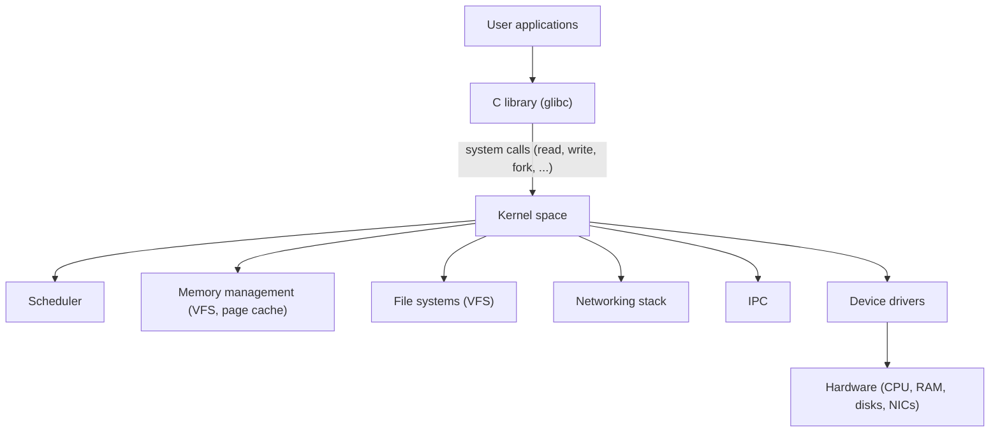
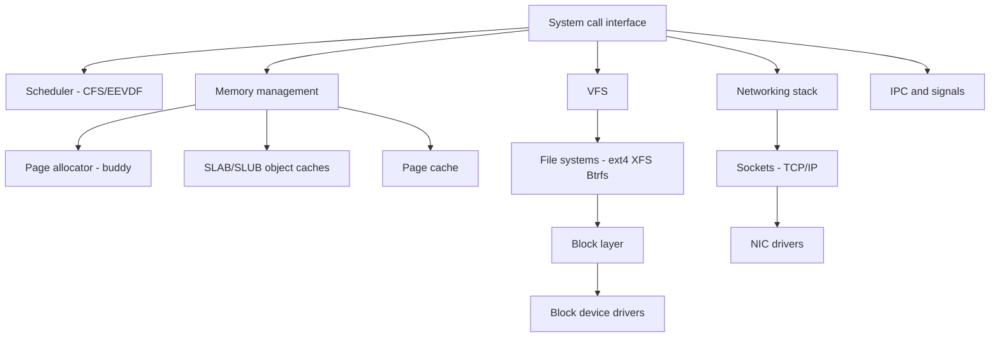

# Linux Kernel Internals

## Overview

The Linux kernel is a **monolithic** kernel: most OS services (scheduling, memory management, VFS, networking, IPC) run in **kernel space** with full hardware access, in one privileged address space. It was created by Linus Torvalds in 1991 and now runs everything from phones (Android) and embedded devices to the majority of cloud servers.

This page is the entry point for kernel-level interview topics. See [OS Overview](../overview.md) for the fundamentals.

## Kernel vs User Space


```mermaid
graph TD
    APP["User applications"] --> LIBC["C library (glibc)"]
    LIBC -->|"system calls (read, write, fork, ...)"| KERN["Kernel space"]
    KERN --> SCHED["Scheduler"]
    KERN --> MM["Memory management (VFS, page cache)"]
    KERN --> FS["File systems (VFS)"]
    KERN --> NET["Networking stack"]
    KERN --> IPC["IPC"]
    KERN --> DRV["Device drivers"]
    DRV --> HW["Hardware (CPU, RAM, disks, NICs)"]
```

- **User space**: isolated per-process address space; applications cannot touch hardware directly.
- **Kernel space**: privileged (ring 0 on x86); the only path to hardware is via **system calls** and device drivers.
- **System call** = a controlled entry point (`syscall` instruction) that switches to kernel mode, validates arguments, and executes kernel code on behalf of the process.

## Kernel Subsystem Map

The five load-bearing subsystems are the **scheduler**, **memory management**, **VFS**, **networking**, and **drivers** — almost every kernel interview question reduces to one of these five or to the block layer beneath them. The map below shows how a syscall fans out into them and where they converge on shared code (page allocator, drivers).


```mermaid
graph TD
    SYSCALL["System call interface"] --> SCHED["Scheduler - CFS/EEVDF"]
    SYSCALL --> MM["Memory management"]
    SYSCALL --> VFS["VFS"]
    SYSCALL --> NET["Networking stack"]
    SYSCALL --> IPC["IPC and signals"]
    MM --> PALLOC["Page allocator - buddy"]
    MM --> SLAB["SLAB/SLUB object caches"]
    MM --> PC["Page cache"]
    VFS --> FS["File systems - ext4 XFS Btrfs"]
    FS --> BLK["Block layer"]
    NET --> SOCK["Sockets - TCP/IP"]
    BLK --> DRV["Block device drivers"]
    SOCK --> NDRV["NIC drivers"]
```

Reading the map bottom-up is the useful direction for interviews: NIC drivers feed the network stack, the block layer feeds file systems, and both fight over the same page allocator. When a system is slow, the question "scheduler, memory, I/O, or network?" is the first fork, and each branch has its own tools (see [Observing the Kernel](#observing-the-kernel) and [tracing](./tracing.md)).

## Why Monolithic?

| Property | Monolithic (Linux) | Microkernel (L4, seL4) |
|---|---|---|
| Drivers/subsystems in kernel | Yes | Minimal core; services in user space |
| Performance | Fast (no IPC for every service) | Slower IPC overhead |
| Stability isolation | A driver bug can crash the kernel | Services crash independently |
| Flexibility | Modules (`insmod`) add/remove at runtime | Clean interfaces |

Linux is monolithic **for performance**, mitigated by **loadable kernel modules** (`*.ko`, loaded with `insmod`/`modprobe`) and the hardening that eBPF provides for safe extensions (see [eBPF](./ebpf.md)).

## Monolithic vs Micro vs Hybrid

The classic three-way comparison — interviewers use it to test whether you understand *where the IPC boundary is drawn*, not just the labels. In practice almost every production kernel is a hybrid somewhere on the spectrum.

| Property | Monolithic (Linux, FreeBSD) | Microkernel (seL4, QNX, MINIX 3) | Hybrid (macOS XNU, Windows NT) |
|---|---|---|---|
| What runs in kernel mode | Everything: sched, VM, VFS, net, drivers | Minimal: IPC, scheduler, basic VM (seL4 ≈ 10k lines, formally verified) | Core VM/IPC in kernel; large parts (drivers, some services) above |
| Cross-service call cost | Direct function call (~ns) | Message passing + context switch (~µs-class) | Mixed; syscalls native, services via IPC |
| Failure isolation | Worst: one bad driver can panic the kernel | Best: crashed driver is restarted by a user-space supervisor | Partial: some drivers isolated (user-mode drivers on Windows) |
| Trusted computing base | Huge (tens of millions of lines) | Small and auditable | Large |
| Real-world bet | Performance and pragmatism (cloud, Android) | Safety/security-critical (aviation, automotive, seL4 microkernels) | Desktop ecosystems with legacy (Apple Mach+BSD blend, NT executive) |

The standard essay answer: microkernels pay a per-operation IPC/context-switch tax that monolithic kernels avoid by direct calls, and they recoup the cost in reliability and verifiability. Linux won the server market on the first axis; seL4-class kernels dominate where a bug costs lives or certifications. Hybrid designs keep a fast core but push what they can (GUI, some drivers, subsystems) out of the privileged path.

## Loadable Modules vs Built-in

Linux gets monolithic performance without a fixed feature set through **loadable kernel modules** — the `CONFIG_FOO=y` (built-in) vs `CONFIG_FOO=m` (module) choice at build time. This is the daily lever kernel engineers pull, so the trade-offs are fair interview material.

| Aspect | Built-in (`CONFIG_X=y`) | Loadable module (`CONFIG_X=m`) |
|---|---|---|
| Availability | Resident from boot; required for the root device/storage chain | Loaded on demand by udev/modprobe or initramfs |
| Kernel image | Larger vmlinux | Small core; drivers live on disk |
| Memory | Occupied even if hardware is absent | `rmmod`/`modprobe -r` frees it when unplugged |
| Development loop | Rebuild kernel + reboot | Rebuild module + reload (no reboot) |
| Security posture | Nothing to swap at runtime; no signing machinery needed | Must be signed (module signing, `CONFIG_MODULE_SIG`, lockdown mode) or root can load arbitrary kernel code |
| Hotplug | Not applicable | Devices discovered at runtime load their driver via modalias |

```bash
lsmod                              # loaded modules, refcounts, dependencies
modprobe nvme                      # load by name (resolves dependencies)
modprobe -r nvme                   # unload in dependency order
grep NVME /boot/config-$(uname -r) # see =y vs =m for your running kernel
```

The rule of thumb: anything needed to mount the root filesystem or to boot reliably is built-in (or lives in the initramfs); everything hotpluggable or rarely used is a module. Modules cannot change exported symbol semantics arbitrarily — only GPL-compatible modules see the full symbol table, which is also how the kernel keeps a lid on proprietary drivers.

## Key Subsystems

| Subsystem | What it does | Where in this book |
|---|---|---|
| **Scheduler** (CFS/EEVDF) | Decides which thread runs next | [CPU Scheduling](../scheduling/README.md) |
| **Memory management** | Virtual memory, page tables, page cache, swapping | [Memory Management](../memory/README.md), [Virtual Memory](../virtual-memory/README.md) |
| **VFS** | Unified interface over all file systems | [File Systems](../filesystems/README.md) |
| **Process/thread management** | fork/exec, task_struct, context switch | [Processes](../processes/README.md) |
| **IPC** | Pipes, sockets, shared memory, signals | [IPC](../processes/ipc.md) |
| **Networking** | The protocol stack (TCP/IP) | [Computer Networks](../../networks/overview.md) |
| **Block I/O layer** | Disk scheduling, I/O queues, io_uring | [I/O Systems](../io/README.md), [io_uring](./io-uring.md) |

## The syscall path

```text
user:  read(fd, buf, n)
  └─ glibc wrapper → syscall instruction
       └─ entry (kernel): switch to kernel stack, save regs
            └─ sys_call_table[0] → sys_read
                 └─ VFS layer → file system → block layer → driver → hardware
                 └─ return value written to user regs
```

Cost drivers: the syscall itself is fast (~100s of ns), but the work done (locking, page cache, I/O) dominates. **Batching** (e.g., `readv`/`writev`, io_uring) and avoiding syscalls (memory-mapped I/O, userspace networking like DPDK) are how high-performance systems reduce this overhead.

## Observing the Kernel

- **/proc** — process and kernel state as files (`/proc/cpuinfo`, `/proc/meminfo`, `/proc/<pid>/status`).
- **/sys** — device and driver attributes (sysfs).
- **dmesg** — kernel ring buffer (boot messages, driver output).
- **perf** — profiling (hardware counters, tracepoints, sampling).
- **eBPF** — dynamic tracing without kernel changes (see [eBPF](./ebpf.md)).

## Kernel Versioning

- Releases: `major.minor.patch`, e.g., `6.6`, with long-term-support (LTS) lines maintained for years (e.g., 5.15, 6.1, 6.6, 6.12).
- Feature gating: many features land behind config options (`CONFIG_*`) and can be built as modules.
- Interfaces: kernel userspace API (syscalls) is stable; kernel-internal APIs are not — drivers must track kernel changes.

## Interview Questions

### Q: Why does Linux use a monolithic kernel despite the stability argument?

Performance and simplicity of the call path: services run in kernel space with no IPC round-trips, and shared memory access is direct. The downsides (a driver bug crashing the kernel) are mitigated by loadable modules, strict driver APIs, and safer extension mechanisms like eBPF. Alternatives (microkernels) prioritize isolation but pay IPC overhead for every service interaction.

### Q: What happens when a process calls a system call?

The libc wrapper invokes the `syscall` instruction (or `int 0x80` on legacy x86). The CPU switches to kernel mode (ring 0), the kernel saves the user registers and switches to the kernel stack, looks up the syscall number in the syscall table, validates arguments, executes the handler, stores the result, and returns to user mode. If the syscall would block (e.g., disk read), the scheduler may run another process meanwhile.

### Q: What is the difference between a syscall and a context switch?

A syscall is a **mode switch**: the same process continues, but executes in kernel mode (saves/restores user regs, no scheduler involvement unless it blocks). A context switch is a **process switch**: the CPU switches from one thread to another, saving/restoring full CPU state and switching address spaces (TLB flush or ASID). Syscalls are far cheaper (~100 ns vs ~µs for context switch + cache effects).

### Q: When would you compile a driver built-in versus as a loadable module?

Built-in when the hardware is needed before userspace and storage exist — the root disk controller, the console/framebuffer, early-boot network for netboot images — or in embedded kernels where the feature set is frozen and image size matters less than determinism. As a module when the hardware is optional or hotpluggable (USB devices, most NICs/GPUs), when you want to reclaim memory on unplug, or when you develop the driver and want a rebuild-and-reload loop instead of a reboot. Always mention the security angle: a modular kernel must enable module signing or an attacker with root can inject ring-0 code with `init_module`.

### Q: What can eBPF do that a kernel module cannot — and vice versa?

eBPF programs are verified for memory safety and termination before loading, attach to stable hooks (tracepoints, kprobes, XDP, LSM), can be updated without rebooting, and cannot corrupt the kernel — that is why observability, networking, and security tooling (bpftrace, Cilium, falco) build on it. Kernel modules run unrestricted in ring 0: they can add whole new subsystems, register new syscalls or file system types, and use any kernel API, but any bug is a kernel panic and the ABI moves under them every release. The interview soundbite: eBPF is a safe, narrow extension point; modules are the powerful, dangerous one — production systems increasingly prefer the former for anything that is not a real device driver.

### Q: Walk through a file read through VFS and the page cache.

`read()` enters VFS, which resolves the path through dentries/inodes to the concrete file system (ext4, XFS). If the pages are already in the page cache, the kernel copies to user memory and never touches the disk — this is why second reads are microseconds. On a miss, the file system maps file offsets to block addresses (extent trees), issues I/O through the block layer (plug/merge/scheduler like mq-deadline or none for NVMe) to the driver, then populates the page cache and completes. Follow-ups to expect: why `mmap` avoids the copy, what readahead does, and how O_DIRECT bypasses the cache for databases.

## Key Takeaways

- Linux is **monolithic for performance**: direct calls between subsystems, mitigated by modules (packaging) and eBPF (safe extension), not by microkernel IPC.
- The five subsystems to know cold are **scheduler, memory management, VFS, network stack, drivers** — plus the block layer that connects storage to VFS.
- Module vs built-in is a packaging and security decision: root-device drivers and frozen embedded kernels go built-in; hotplug and dev-loop ergonomics favor modules; modular kernels need signed modules/lockdown.
- A syscall is a mode switch (~100s of ns); a context switch is a process switch (~µs) — confusing the two is an automatic credibility hit in interviews.
- Kernel userspace ABI (syscalls) is stable forever; in-kernel APIs are not, which is exactly why eBPF's stable-hook + verifier model won for tooling.
- Every performance investigation starts with the same fork: CPU (scheduler), memory (page cache/allocations), I/O (block layer), network (stack) — and each has first-class observability (/proc, /sys, perf, eBPF).
- Microkernels (seL4, QNX) trade per-call IPC cost for a tiny, verifiable trusted computing base; hybrid kernels (XNU, NT) sit between and dominate the desktop.

## Related Topics

- [OS Overview](../overview.md) — kernel/user mode, interrupts, system calls at a high level
- [Processes](../processes/README.md) — task_struct, scheduling entities
- [Memory Management](../memory/README.md) — kernel memory layout
- [eBPF](./ebpf.md) — safe kernel extension for tracing/networking/security
- [io_uring](./io-uring.md) — high-performance async I/O in the kernel
- [Computer Networks](../../networks/overview.md) — the kernel networking stack

## References

- Kernel source and official documentation: <https://www.kernel.org/> and <https://docs.kernel.org/>
- Loadable kernel modules (admin guide): <https://docs.kernel.org/admin-guide/modules.html>
- seL4 microkernel (formally verified): <https://sel4.systems/>
- Bovet & Cesati, *Understanding the Linux Kernel*, 3rd ed., O'Reilly, 2005 (no URL).
- Love, *Linux Kernel Development*, 3rd ed., Addison-Wesley, 2010 (no URL).

## Cross-References

- [Loadable Kernel Modules](./modules.md) — .ko lifecycle, module loading/signature internals behind the trade-off table above
- [eBPF](./ebpf.md) — the safe extension path: verifier, maps, program types
- [io_uring](./io-uring.md) — batching syscalls away in the block I/O subsystem
- [Tracing](./tracing.md) — ftrace/perf tooling for the observability hooks above
- [Kernel Advanced hub](../kernel-advanced/README.md) — deeper follow-ups on every subsystem in the map
- [Boot Process](../kernel-advanced/boot-process.md) — what runs before the scheduler and init (initramfs, built-in vs module ordering)
- [Namespaces & cgroups](../kernel-advanced/namespaces-cgroups.md) — the isolation primitives containers use
- [VFS Internals](../kernel-advanced/vfs-internals.md) — dentry/inode cache internals behind a file read
- [Network Stack](../kernel-advanced/network-stack.md) — the in-kernel packet path from NIC driver to socket
- [Block Layer](../kernel-advanced/block-layer.md) — request queues, schedulers, multi-queue NVMe path
- [Tracing & Probes](../kernel-advanced/tracing-probes.md) — kprobes/uprobes/ftrace deep dive
- [eBPF Deep Dive](../kernel-advanced/ebpf-deep.md) — verifier internals, XDP/TC program types
