# eBPF

## Overview

**eBPF (extended Berkeley Packet Filter)** is a Linux kernel technology that runs **sandboxed, event-driven programs inside the kernel**, attached to hooks such as system calls, network events, and function entry points — with no kernel modules and no application changes. Merged into Linux 3.15 in 2014 (the bpf() syscall that lets user space load programs landed in 3.18), it powers today's observability, networking, and security tooling.

It evolved from the classic BPF packet filter (tcpdump's filter language, 1992) into a general-purpose in-kernel VM with maps, JIT compilation, and a safety verifier.

## How It Works

```mermaid
graph LR
    SRC["C / Rust source"] --> LLVM["clang/LLVM → eBPF bytecode"]
    LLVM --> LOAD["bpf() syscall"]
    LOAD --> VER["Verifier<br/>(safety checks)"]
    VER -->|"pass"| JIT["JIT compile to native code"]
    JIT --> ATTACH["Attach to hook<br/>(kprobe, tracepoint, XDP, ...)"]
    ATTACH --> EV["Event fires"]
    EV --> RUN["Program runs in kernel"]
    RUN --> MAP["Shared data structures (maps)"]
    MAP --> USR["User-space reads maps"]
```

1. **Write** a small program in C/Rust; compile to eBPF bytecode with clang/LLVM.
2. **Load** via the `bpf()` syscall. The kernel **verifier** statically checks the program: bounded loops (guaranteed termination), no arbitrary memory access, no unsafe pointer arithmetic, and correct types.
3. **JIT-compile** to native machine code for the host CPU.
4. **Attach** to a hook; run on every event, writing results into **maps** (hash maps, arrays, ring buffers, LPM tries) that user space reads.

## Hooks (Attachment Points)

| Hook | Fires on | Use case |
|---|---|---|
| **kprobe / kretprobe** | Kernel function entry/exit | Trace any kernel function (e.g., `do_sys_open`) |
| **tracepoint** | Static kernel tracepoints | Stable tracing (scheduler, block I/O, network events) |
| **uprobe / uretprobe** | User-space function entry/exit | Trace app functions (e.g., `SSL_read`) without code changes |
| **fentry / fexit** | BTF-typed kernel functions | Low-overhead function tracing |
| **XDP** | Packet arrival at the NIC driver | Line-rate packet filtering, DDoS mitigation, load balancing |
| **tc** | Traffic-control layer | Packet classification, shaping, policy |
| **socket** | Socket operations | Socket filters, per-connection events |
| **cgroup** | Cgroup events | Container network isolation |
| **LSM** | Linux Security Module hooks | Runtime security policy (Falco, Tetragon) |
| **perf_event** | Hardware/software counters | Continuous profiling (stack sampling) |

## CO-RE and BTF

- **BTF (BPF Type Format)** — kernel and program type metadata shipped with the kernel, enabling type-aware tracing and `fentry`/`fexit`.
- **CO-RE (Compile Once, Run Everywhere)** — programs use **relocations** so one compiled binary adapts to different kernel versions/struct layouts; pairs with **libbpf**. This eliminated the old "compile per kernel" deployment burden.

## Major Use Cases

| Area | Examples | What it enables |
|---|---|---|
| **Observability** | BCC, bpftrace, Pixie, Parca, Cilium Hubble | Zero-code tracing of any language (HTTP/gRPC latency, syscalls, CPU profiling), including compiled Go/Rust binaries |
| **Networking** | Cilium (Kubernetes CNI + service mesh dataplane), XDP DDoS filtering | In-kernel packet processing at line rate (Cloudflare filters 10M+ pps), without kernel stack overhead |
| **Security** | Falco, Tetragon | Runtime detection of execs, file opens, privilege changes, container escapes |

## eBPF vs Kernel Modules

| | eBPF | Kernel module |
|---|---|---|
| Safety | Verifier guarantees memory safety + termination | No such guarantee; any bug can panic the kernel |
| Deployment | Load from user space, no reboot | `insmod`/`modprobe`, kernel API lock-in |
| API surface | Restricted helper set | Full kernel API |
| Use for | Observing/filtering kernel events, fast networking | New drivers, custom file systems, features needing kernel APIs eBPF can't express |

Rule of thumb: **observe or filter → eBPF; extend with new hardware/FS → module**. For cloud-native infra (observability, networking, security), eBPF is the standard choice.

## Interview Questions

### Q: How does the eBPF verifier make programs safe?

It performs static analysis on the bytecode before loading: it walks every path to prove **bounded loops** (termination), verifies memory accesses are within bounds and correctly typed, rejects arbitrary pointer arithmetic, and ensures the program can't write kernel memory it doesn't own. Unsafe programs are rejected at load time — that's what lets untrusted code run in the kernel.

### Q: What are eBPF maps used for?

Maps are shared kernel↔user data structures (hash maps, arrays, ring buffers, LRU maps, LPM tries). The kernel-side program writes events/state into a map; user space reads and processes them (or configures the program by writing to the map). Maps are the communication channel between the event-driven kernel code and the userspace agent.

### Q: How does XDP differ from processing packets in the kernel stack?

XDP runs **before** the kernel networking stack — at the NIC driver, on the raw packet. It can drop/forward/modify packets at line rate with minimal overhead, which makes it ideal for DDoS filtering and load balancing. The trade-off: it works on raw packets (no sockets), so TCP/IP stack features are unavailable at that point.

### Q: Why is eBPF important for observability?

It can trace **any process on the host without code changes or restarts**: syscalls, function calls, HTTP/gRPC request latency, CPU stacks. Because programs run in-kernel and only aggregate into maps, overhead is low, and it works uniformly across languages including compiled binaries. This is why tools like Cilium, Pixie, and Tetragon are built on it.

## References

- eBPF Foundation / documentation — https://ebpf.io/
- Linux kernel documentation: BPF — https://docs.kernel.org/bpf/
- *BPF and XDP Reference Guide* (Cilium) — https://docs.cilium.io/en/stable/bpf/
- Brendan Gregg's BPF resources — https://www.brendangregg.com/ebpf.html
- *The eBPF verifier* (kernel source, kernel/bpf/verifier.c) — https://docs.kernel.org/bpf/verifier.html

## Related Topics

- [Linux Kernel Internals](./README.md) — where eBPF programs run
- [I/O Systems](../io/README.md) — syscall path eBPF observes
- [Network Security](../../networks/security/README.md) — XDP-based filtering
- [Containers](../containers/README.md) — cgroup hooks and Cilium in Kubernetes
- [Observability](../../cloud/observability/README.md) — production tracing/monitoring tools
