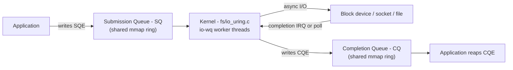
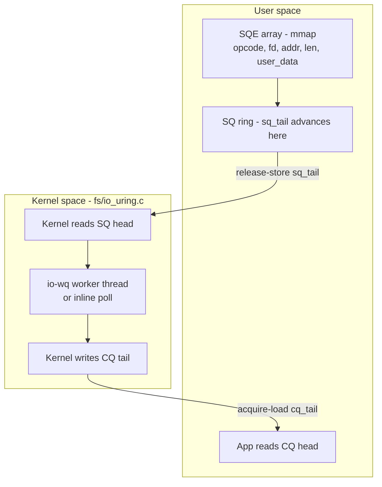
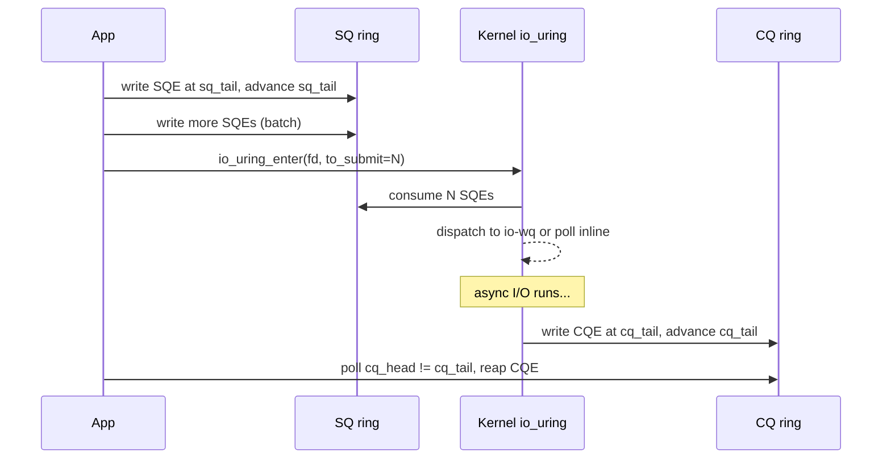
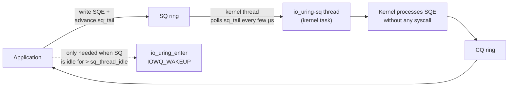

# io_uring

## Overview

**io_uring** is Linux's high-performance asynchronous I/O interface, introduced by Jens Axboe in **Linux 5.1 (2019)**. It replaces the traditional "submit a syscall per operation" model with **shared memory rings**: applications submit I/O requests into a submission queue (SQ) and reap results from a completion queue (CQ), batching many operations with very few system calls. Unlike `epoll` + `read`/`write`, io_uring provides *true* asynchrony for regular files, sockets, timers, and even "control" operations like `openat`, `statx`, `splice`, `rename`, `unlink`, and `fallocate` — all through one unified submission/completion interface.

The implementation lives in `fs/io_uring.c` in the Linux source tree (a ~14k-line file as of kernel 6.x), with the user-facing API exported through `io_uring_setup(2)`, `io_uring_enter(2)`, and `io_uring_register(2)` system calls (documented on `manpages.debian.org`). The reference userspace library is **liburing** ([https://github.com/axboe/liburing](https://github.com/axboe/liburing)), maintained alongside the kernel by the same author.



## Motivation: The Limits of epoll and Linux AIO

Two pre-io_uring async I/O mechanisms dominated Linux:

- **`epoll` + non-blocking `read`/`write`** — works for sockets, pipes, and eventfd, but `read`/`write` on regular files are *always* blocking in the page-cache path. The standard workaround is a thread pool (the classic "one thread per blocking call" pattern), which hides the latency behind context switches and stack memory (default 8 MB virtual, ~ tens of KB resident per thread).
- **Linux AIO** (`io_setup`, `io_submit`, `io_getevents`) — true async, but it requires `O_DIRECT`, behaves poorly on buffered I/O, has a clunky context-handle API, and every `io_submit` still costs a syscall. Many operations (open, stat, fsync) aren't supported at all.

Both share the same fundamental cost model: **every operation costs at least one syscall**. A syscall is roughly 100-300 ns on modern x86_64 — more under Spectre/Meltdown mitigations like KPTI, retpoline, and IBRS — plus 1-2 context switches if it blocks. For a workload doing 1M IOPS, that is \\(10^6 \times 200\,\text{ns} = 200\,\text{ms/sec}\\) of pure syscall overhead, before the I/O even starts.

io_uring attacks this with three orthogonal ideas:

1. **Batched submission** — many SQEs are pushed into the ring and a *single* `io_uring_enter(2)` submits all of them, amortizing the syscall across N operations.
2. **Shared-memory rings** — the SQ and CQ live in memory `mmap`'d from the kernel, so posting an SQE requires no syscall at all — only the eventual `io_uring_enter` to "kick" the kernel (and even that can be skipped under SQPOLL, below).
3. **Completion-based model** — the kernel pushes CQEs into the CQ asynchronously when the I/O finishes, instead of the application blocking in `read()` or polling `io_getevents()`. This matches the completion model of high-performance I/O frameworks like IOCP on Windows and `kqueue` EVFILT_AIO on BSD.

For a deeper treatment of the design rationale, see Jens Axboe's article *Efficient IO with io_uring* ([kernel.dk/io_uring.pdf](https://kernel.dk/io_uring.pdf)) and the LWN.net series *io_uring and asynchronous I/O* ([lwn.net/Articles/810414/](https://lwn.net/Articles/810414/)).

## Architecture: Two Shared Ring Buffers

An io_uring instance is created with `io_uring_setup(entries, params)`, which returns a file descriptor. The application then `mmap`s three regions from that fd:

| Offset constant | Region | Purpose |
|---|---|---|
| `IORING_OFF_SQ_RING` | SQ ring | Head/tail indices + array of SQE *indices* |
| `IORING_OFF_CQ_RING` | CQ ring | Head/tail indices + array of `struct io_uring_cqe` |
| `IORING_OFF_SQES` | SQE array | The actual `struct io_uring_sqe` entries |

The rings are **single-producer / single-consumer** lockless queues: the application is the sole producer of SQEs and consumer of CQEs; the kernel is the sole consumer of SQEs and producer of CQEs. No atomics are needed on the fast path — only **memory-ordering barriers** (`smp_store_release` when publishing a new tail; `smp_load_acquire` when reading the other side's tail). This is the same lockless SPSC ring trick used by DPDK's rte_ring and the kernel's own `kfifo`.



## The Submission Queue Entry (SQE)

Each I/O is described by a `struct io_uring_sqe` (from `include/uapi/linux/io_uring.h`):

```c
struct io_uring_sqe {
    __u8    opcode;      /* IORING_OP_READV, OPENAT, ACCEPT, ...      */
    __u8    flags;       /* IOSQE_IO_LINK, IOSQE_FIXED_FILE, ...      */
    __u16   ioprio;      /* per-op I/O priority (ioprio_set API)      */
    __s32   fd;          /* target fd, or fixed-file index            */
    __u64   off;         /* offset into file                          */
    __u64   addr;        /* pointer to buffer or iovec array          */
    __u32   len;         /* buffer length / number of iovecs          */
    union {              /* opcode-specific flags:
                            rw_flags, fsync_flags, poll_events,
                            msg_flags, timeout_flags, accept_flags,
                            open_flags, splice_flags, ...             */
        __kernel_rwf_t  rw_flags;
        __u32   fsync_flags;
        __u32   msg_flags;
        __u32   timeout_flags;
        /* ... */
    };
    __u64   user_data;   /* opaque tag, returned verbatim in the CQE  */
    union {
        struct { __u16 buf_index; __u16 buf_group; };
        __u64   __pad2[3];
    };
};
```

The most important fields:

- **`opcode`** — the operation. As of kernel 6.x there are roughly 70 opcodes including `IORING_OP_READV`, `WRITEV`, `READ`, `WRITE` (fixed-buffer variants), `OPENAT`, `CLOSE`, `STATX`, `FSYNC`, `ACCEPT`, `RECV`, `SEND`, `RECVMSG`, `SENDMSG`, `TIMEOUT`, `LINK_TIMEOUT`, `CANCEL`, `SPLICE`, `TEE`, `RENAMEAT`, `UNLINKAT`, `MSG_RING`, `URING_CMD`, `FUTEX_WAIT`, `WAITID`, etc.
- **`fd`** — the file descriptor. If `IOSQE_FIXED_FILE` is set in `flags`, this is reinterpreted as an index into the registered file table (see [Fixed Files and Buffers](#fixed-files-and-buffers)).
- **`addr` / `len`** — buffer pointer + length (or iovec array + count for vectored ops).
- **`user_data`** — opaque tag the kernel copies verbatim into the matching CQE. This is how the application correlates completions back to submissions. **Always set this** — `0` is legal but makes every CQE ambiguous.
- **`flags`** — modifiers: `IOSQE_IO_LINK` (chain to next SQE), `IOSQE_IO_HARDLINK` (chain that survives errors), `IOSQE_ASYNC` (force async execution), `IOSQE_BUFFER_SELECT` (use a provided buffer from a registered pool), `IOSQE_FIXED_FILE`, `IOSQE_IO_DRAIN` (serialize against everything in flight).

## The Completion Queue Entry (CQE)

When the operation finishes the kernel writes a `struct io_uring_cqe`:

```c
struct io_uring_cqe {
    __u64   user_data;   /* copied verbatim from the SQE              */
    __s32   res;         /* bytes transferred, 0, or -errno           */
    __u32   flags;       /* e.g. IORING_CQE_F_BUFFER, F_MORE          */
};
```

That's it — 16 bytes per completion. The application reads the CQE, dispatches on `user_data`, and handles `res` (which follows the same convention as the corresponding syscall's return value: positive = bytes transferred, `0` = EOF on read, negative = `-errno`). The CQE `flags` field carries optional metadata, most notably `IORING_CQE_F_BUFFER` (with a buffer ID in the upper bits) when the kernel auto-selected a buffer from a registered pool.

## Submission and Completion Flow



The classic flow (no SQPOLL):

1. Application writes an SQE into the SQE array at index `sq_tail & ring_mask`, then publishes it by advancing the SQ ring's `sq_tail` with a release store.
2. Repeat for as many operations as desired (batch).
3. Application calls `io_uring_enter(fd, to_submit=N, min_complete=0, flags=0)` — the only syscall in the common path. The kernel consumes the N SQEs and starts the I/O asynchronously (via `io-wq` worker threads for blocking paths, or inline polling for fast devices).
4. As operations complete, the kernel writes CQEs to the CQ ring, advancing `cq_tail` (release store).
5. The application reaps CQEs by polling `cq_head != cq_tail` with acquire loads — **no syscall needed to reap results**.

If the application wants to *wait* for completions, it calls `io_uring_enter` with `IORING_ENTER_GETEVENTS` and a `min_complete` count; the kernel blocks until that many CQEs are posted. SQPOLL mode (below) eliminates step 3 entirely.

## Submission Modes: When Does the Kernel Look?

| Mode | Setup flag | Kernel woken how | Submission syscall? | Best for |
|---|---|---|---|---|
| **Default (interrupt)** | (none) | `io_uring_enter(2)` call from app | Yes, one per batch | General-purpose; mixed latency/bandwidth |
| **SQPOLL** | `IORING_SETUP_SQPOLL` | Dedicated kernel task polling the SQ | No (zero syscalls when idle) | High-IOPS storage, very low-latency services |
| **IOPOLL** | `IORING_SETUP_IOPOLL` | App calls `io_uring_enter(GETEVENTS)` to poll | One per reap batch | NVMe / polled block devices, no IRQs |
| **Task work** | (internal) | Deferred to the submitting task's context | Yes | Inline completions on sockets |

In default mode the kernel side registers a wait queue; in IOPOLL mode the device driver busy-polls for completions (similar to `io_uring` block-layer polling). SQPOLL is the most aggressive: it dedicates a kernel thread (`io_uring-sq`/N) to the ring.

## SQ Polling Mode (IORING_SETUP_SQPOLL)



With `IORING_SETUP_SQPOLL` set, `io_uring_setup` spawns a dedicated kernel thread that busy-polls the SQ ring. The thread consumes SQEs as the app pushes them — **no `io_uring_enter` is required for submission**, so a hot application can submit thousands of I/Os per second with *zero* syscalls. The thread auto-parks itself after `sq_thread_idle` milliseconds of inactivity (configurable via `struct io_uring_params.sq_thread_idle`); a wake-up via `io_uring_enter(IORING_ENTER_SQ_WAKEUP)` is then needed to resume it.

This is the mode that delivers the headline io_uring numbers — Axboe's benchmarks show 3-5× throughput improvements vs `epoll` + `read`/`write` for high-IOPS NVMe workloads, and the gap widens as IOPS rise because the syscall cost dominates everything else. The catch: SQPOLL requires `CAP_SYS_NICE` or root to set the kernel thread's priority, and the polling thread burns a CPU. It is a poor fit for latency-insensitive or low-duty-cycle workloads — use it on dedicated storage threads where the I/O rate justifies dedicating a core.

## Fixed Files and Buffers

Two `io_uring_register` features eliminate per-operation kernel work:

- **`IORING_REGISTER_FILES`** — pre-register an array of file descriptors. SQEs that set `IOSQE_FIXED_FILE` reference an fd by *index* rather than by descriptor. The kernel skips the per-op `fdget`/`fdput` (which on a multi-threaded process involves reference-counting the `struct file` under RCU), and can also use a registered file table in the SQPOLL path (SQPOLL *requires* fixed files because the kernel thread does not have access to the submitter's file descriptor table).
- **`IORING_REGISTER_BUFFERS`** — pre-register a set of buffers (iovec array). The kernel pins the user pages once (`pin_user_pages`) and remembers the resulting `struct page*` list. Every subsequent `IORING_OP_READ`/`WRITE`/`READV`/`WRITEV` that uses these buffers skips the expensive `get_user_pages` walk — a major win for NVMe DMA, which needs the pages physically pinned anyway.
- **`IORING_REGISTER_BUFFERS_UPDATE`** (5.13+) — swap individual registered buffers without re-registering the whole set.
- **Provided buffers (`IOSQE_BUFFER_SELECT` + `IORING_REGISTER_PBUF_RING`)** — the app posts a pool of buffers; for each `RECV` the kernel picks one, fills it, and tags the CQE with the buffer ID via `IORING_CQE_F_BUFFER`. This is the idiomatic way to handle variable-length network reads without pre-sizing per-connection buffers.

`IORING_SETUP_REGISTERED_FD_ONLY` (added in 5.18 under the `IORING_SETUP_NO_MMAP` flag set) goes further: the io_uring fd itself is a registered file index, allowing the application to close all of its traditional fds and operate purely through the ring — useful in sandboxed processes that want to minimize their syscall surface.

## Linked SQEs — Chained Operations

Setting `IOSQE_IO_LINK` in an SQE links it to the *next* SQE in the submission batch. The kernel guarantees the linked SQE starts only after the previous one completes successfully. A chain of N SQEs behaves like a tiny dependency DAG submitted atomically:

```text
SQE0 (openat, file=foo, LINK)
  -> SQE1 (readv, off=0, len=4096, LINK)
  -> SQE2 (close)
```

This produces three CQEs (one per SQE), but the kernel orchestrates them without the application round-tripping between each. `IOSQE_IO_HARDLINK` is the variant that continues the chain even if an earlier step fails (useful for "do this, then always close"). The canonical use case is **`IORING_OP_LINK_TIMEOUT`** — a linked SQE that fires as a timeout if the preceding op hasn't completed, and is cancelled automatically if it does. This replaces ad-hoc user-space timer wheels for per-operation deadlines.

## Cancellation and Timeouts

- **`IORING_OP_TIMEOUT`** — submit a single CQE after a specified duration (or after N completions). Used as a "wake me up later" alarm.
- **`IORING_OP_LINK_TIMEOUT`** — as above; attached via `IOSQE_IO_LINK` to cancel a specific op if it exceeds a deadline.
- **`IORING_OP_CANCEL` / `CANCEL64`** — cancel a previously-submitted op identified by its `user_data`. Returns a CQE with `-ECANCELED` for the cancelled op, and a CQE for the cancel op itself reporting the result. Useful for "I submitted a slow read; the client hung up; please don't waste I/O."
- **`IORING_OP_TIMEOUT_REMOVE`** — cancel a previously armed timeout.

Timeouts accept a `struct __kernel_timespec` and a count in `len`. The `timeout_flags` field selects relative vs absolute time, `IORING_TIMEOUT_BOOTTIME`/`REALTIME`/`MONOTONIC` clocks, and `IORING_TIMEOUT_ETIME_SUCCESS` (treat timeout expiry as success — useful for rate-limit windows).

## Polling vs Interrupt Mode (IORING_SETUP_IOPOLL)

Block devices traditionally notify completion via a hardware interrupt. For ultra-low-latency NVMe workloads the IRQ cost (~1-2 µs) is significant, so `IORING_SETUP_IOPOLL` enables **busy-poll completion** mode: the application calls `io_uring_enter(IORING_ENTER_GETEVENTS)` to actively poll for completions instead of waiting for an IRQ. The block driver exposes a `poll_queue` that the kernel reaps without interrupts.

| Aspect | Interrupt mode (default) | IOPOLL mode |
|---|---|---|
| Completion signal | Hardware IRQ → softirq | App calls `io_uring_enter(GETEVENTS)` |
| CPU usage | Low when idle | Burns CPU polling |
| Latency | IRQ + softirq overhead (~1-2 µs) | sub-µs |
| Requires | Any device | NVMe with `poll_queues` configured |
| Requires `O_DIRECT` | No | Yes |
| Best for | General workloads | Sustained high-IOPS NVMe, databases |

This is the same trade-off as `SO_BUSY_POLL` for sockets — trade CPU for latency. Modern NVMe drivers (e.g., `nvme` with `poll_queues=N` module parameter) carve out a separate set of queues dedicated to polling.

## Comparison: io_uring vs epoll vs AIO vs io_uring_poll

| Aspect | `epoll` + `read`/`write` | Linux AIO | io_uring (default) | io_uring (SQPOLL + IOPOLL) |
|---|---|---|---|---|
| Syscalls per op | 1+ | 1+ (`io_submit`) | ~1 per batch | 0 for submit, ~1 per reap batch |
| True async for files | No (threadpool workaround) | Yes, but `O_DIRECT` only | Yes | Yes |
| Buffered I/O | Yes (blocking) | No | Yes | Yes (but `O_DIRECT` for IOPOLL) |
| Network sockets | Yes | Awkward | Yes (unified API) | Yes |
| Open / stat / fsync | Blocking syscalls | Not supported | Async via opcodes | Async via opcodes |
| Cancellation / timeouts | Roll-your-own | Limited | Built-in opcodes | Built-in opcodes |
| Memory pinning cost | Per syscall | Per `io_submit` | Once (registered buffers) | Once (registered buffers) |
| Throughput on 1M IOPS NVMe | Bottlenecked on syscalls | ~Limited | High | Highest |
| Complexity | Low | Medium | Medium-high | High |

Benchmarks published by Axboe and reproduced independently (Godbolt blog *What is io_uring?* — [godbolt.org/blog/what-is-io-uring](https://godbolt.org/blog/what-is-io-uring)) show 3-5× throughput for io_uring vs `epoll`+`read` on random 4K reads against an NVMe device at ~1M IOPS.

## Evolution of Async I/O on Linux

| Era | Mechanism | Limitation |
|---|---|---|
| 1990s | Blocking threads + `read`/`write` | One thread per op; context-switch cost |
| ~2000s | `select`/`poll` | O(n) scan; replaced by `epoll` |
| 2002 (Linux 2.5) | `epoll` | Network only; regular files still block |
| 2002 (Linux 2.5) | Linux AIO (`io_setup`/`io_submit`) | `O_DIRECT` only; clunky; many ops unsupported |
| 2019 (Linux 5.1) | io_uring (initial) | Basic SQ/CQ; `READV`/`WRITEV`/`FSYNC` |
| 2019-2020 (5.2-5.10) | Fixed files, fixed buffers, SQPOLL, IOPOLL, linked SQEs | Feature-complete for storage |
| 2021 (5.12-5.18) | Multishot accept/recv, provided buffer rings, `URING_CMD`, `NO_MMAP`, registered-fd-only | Networking becomes first-class |
| 2022+ (6.x) | `MSG_RING`, `futex_wait`, `waitid`, `uring_cmd` passthrough, big CQE (64-bit res), kernel-side `register` extensions | Cross-ring messaging, NVMe passthrough, futex fast path |

## Real-World Users

| Project | io_uring usage |
|---|---|
| **ScyllaDB** | Native io_uring seastar pollers for storage; co-designs with shard-per-core architecture |
| **RocksDB** | io_uring backend (behind `ExperimentalIOUringFileSystem` / `IOUringEnv`) for `ReadAsync`/`WriteAsync`/`FSync` |
| **PostgreSQL** | `io_uring` commit pipeline (`aio/io_uring.c`) and AIO refactoring merged in 17/18 cycle for async buffer I/O |
| **QEMU / KVM** | `io_uring`-backed storage for guest disk I/O; `io_uring` cmd passthrough to NVMe |
| **Rust `tokio-uring`** | tokio-uring runtime — single-threaded, ring-per-thread, mirroring the libxev/monoio model |
| **Rust `glommio`** | Thread-per-core async runtime built directly on io_uring; uses SQPOLL for storage |
| **libuv / Node.js** | Experimental io_uring backend exploring replacing the threadpool for file ops |
| **Nginx / Caddy / h2o** | io_uring support (in patches / experimental branches) for file serving and TLS |
| **DPDK / SPDK** | Adjacent user-space stacks; SPDK borrows io_uring concepts but bypasses the kernel entirely |

## Kernel Version Requirements

io_uring is one of the fastest-moving kernel APIs. Production code must feature-detect (liburing's `io_uring_get_probe()` enumerates supported opcodes) and gate on kernel version:

| Feature | Minimum kernel |
|---|---|
| Initial SQ/CQ, basic opcodes (`READV`, `WRITEV`, `FSYNC`) | 5.1 |
| Fixed files, fixed buffers, polling, SQPOLL | 5.1-5.5 |
| Linked SQEs, timeouts, cancel | 5.5-5.6 |
| Stable, broadly usable | **5.11+** (general guidance) |
| `URING_CMD` (NVMe passthrough) | 5.19 |
| Provided buffer rings (`PBUF_RING`) | 5.19 |
| `NO_MMAP`, `REGISTERED_FD_ONLY` | 5.18 / 6.0 |
| Big CQE (64-bit `res`), `MSG_RING`, `futex_wait`, `waitid` | 6.0+ |
| `uring_cmd` passthrough for NVMe zoning, copy-file-range | 6.x |

The LWN.net io_uring article series tracks new features per kernel release; the kernel.org `io_uring` documentation page (`docs.kernel.org/io_uring/`) and the liburing changelog are the authoritative references.

## Security Considerations

io_uring's surface area is large: ~70 opcodes, ring-based shared memory, registered buffers, kernel threads, and a growing set of features per release. This has made it a recurring source of CVEs and a public debate:

- **CVE history** — multiple privilege-escalation and use-after-free bugs through 2021-2023 (e.g., CVE-2021-41073, CVE-2022-29582, CVE-2023-2358) led to scrutiny of the registered-files, registered-buffers, and `URING_CMD` paths.
- **Google's stance** — Google disabled io_uring for unprivileged users in **Android** (since Android 12 / 13) and **ChromeOS**, citing its CVE rate relative to its use in their workloads. The kernel community responded with hardening: `IORING_SETUP_REGISTERED_FD_ONLY`, `NO_MMAP` (no shared mappings with the kernel), `NO_SQARRAY`, and per-task sysctl `kernel.io_uring_disabled` (Linux 6.x) to gate access.
- **Distros** — Debian/Ubuntu leave io_uring enabled by default but some hardened profiles (GRSecurity-derived, or containers with restrictive seccomp filters) block it. Docker's default seccomp profile historically blocked `io_uring_setup`/`io_uring_enter`/`io_uring_register` until recent releases.
- **Mitigations you can apply** — if running untrusted code, gate io_uring behind seccomp (`SECCOMP_RET_ERRNO` on the three syscalls), require `IORING_SETUP_REGISTERED_FD_ONLY` to shrink the fd surface, keep the kernel patched, and prefer the most recent stable kernel (6.x) for the latest hardening.

The security debate is real: io_uring's performance wins are partly a consequence of how much kernel machinery it touches, which is also why it is an attractive attack target. For internal services on trusted hosts running current kernels, the risk is well-managed; for multi-tenant sandboxes running untrusted code, the calculus is different.

## Limitations and Risks

- **Kernel version gating** — features land incrementally; older kernels lack poll mode, fixed buffers, multishot, `URING_CMD`, etc. Production code must feature-detect.
- **Not every operation is async** — some paths still fall back to blocking (certain `fsync` semantics, certain file systems, network filesystems). `IOSQE_ASYNC` forces the op onto an `io-wq` worker thread, which avoids blocking the caller but does not make the operation faster.
- **Memory-ordering bugs are subtle** — the lockless ring requires correct acquire/release discipline; get it wrong and you have rare dropped completions under load. Use `liburing` rather than rolling your own ring handling.
- **`io-wq` worker pool limits** — `IORING_OP_*` that may block (buffered reads on uncached files, fsync, network) offload to `io-wq` kernel threads; the pool size is bounded and contended under heavy blocking workloads.
- **Not available in all sandboxes** — seccomp filters, AppArmor profiles, and some container runtimes block it; check before assuming availability.
- **Learning curve** — ring synchronization, buffer registration, opcode-specific flags, and the SQPOLL/IOPOLL trade-offs add up. For most web apps, `epoll` + thread pools is still sufficient; io_uring pays off for storage-heavy, high-IOPS, or low-latency-file workloads where its complexity is justified.

## Interview Questions

### Q: How does io_uring achieve lower latency than `epoll` + `read`?

Three ways: (1) **batching** — one `io_uring_enter` submits many ops, amortizing the syscall cost across the batch; (2) **true asynchrony for files** — the kernel runs the I/O in the background (`io-wq` workers or poll mode) and completes via the CQ ring, so the app never blocks on disk reads (epoll + read on a regular file always blocks in the page-cache path); (3) **reduced overhead per op** — registered files skip the per-op `fdget`/`fdput` and fixed buffers skip `get_user_pages`, which on NVMe is significant because the device needs pages pinned for DMA anyway.

### Q: What are the SQ and CQ rings, and how are they synchronized?

The SQ is a shared-memory ring where the app writes **SQEs** (submission queue entries describing each I/O: opcode, fd, addr, len, flags, `user_data`). The kernel consumes them and, on completion, posts **CQEs** to the CQ ring the app reads. Both rings are `mmap`'d from the io_uring fd. The rings are **single-producer / single-consumer**: the app is the sole SQ producer and CQ consumer; the kernel is the sole SQ consumer and CQ producer. Synchronization uses no atomics on the fast path — only **memory barriers**: the producer does an `smp_store_release` on the tail index, the consumer does an `smp_load_acquire` on it. This is the standard SPSC lockless queue pattern.

### Q: What does `user_data` in the SQE/CQE do?

It is an opaque `__u64` tag the application sets on the SQE and the kernel copies verbatim into the matching CQE. It is the *only* way to correlate a completion back to its submission — the kernel does not preserve SQE order in the CQ (completions arrive in I/O-finishing order, not submission order). Always set it to something meaningful (a pointer to a per-op context, an index, a sequence number). Leaving it `0` makes every CQE ambiguous.

### Q: What is SQPOLL and when would you use it?

`IORING_SETUP_SQPOLL` spawns a dedicated kernel thread (`io_uring-sq`/N) that busy-polls the SQ ring. The thread consumes SQEs as the app pushes them, so submission requires **no syscalls at all** — the app just writes SQEs and advances `sq_tail`. After `sq_thread_idle` ms of inactivity the thread auto-parks; a wake-up via `io_uring_enter(IORING_ENTER_SQ_WAKEUP)` is then needed. Use it on dedicated storage threads where the I/O rate justifies burning a core (high-IOPS NVMe databases, log ingesters, storage engines). Don't use it for low-duty-cycle workloads — the polling thread wastes CPU. SQPOLL requires fixed files because the kernel thread does not have access to the submitting task's file descriptor table.

### Q: What are fixed files and fixed buffers, and why do they matter?

`IORING_REGISTER_FILES` pre-registers an array of file descriptors; SQEs with `IOSQE_FIXED_FILE` reference an fd by index, skipping the per-op `fdget`/`fdput` (which involves RCU-protected reference counting on the `struct file`). `IORING_REGISTER_BUFFERS` pre-registers a set of buffers; the kernel pins the user pages once via `pin_user_pages` and caches the `struct page*` list, so subsequent reads/writes skip the expensive `get_user_pages` walk. This matters most for high-IOPS NVMe, where the device needs pages physically pinned for DMA anyway — registering the buffers once instead of per-op turns a multi-microsecond cost into a constant.

### Q: How do linked SQEs work and what are they for?

Setting `IOSQE_IO_LINK` on an SQE links it to the next SQE in the submission batch. The kernel guarantees the linked SQE starts only after the previous one completes successfully — the chain forms a tiny dependency DAG submitted atomically. Each SQE still produces its own CQE; the link only constrains ordering. `IOSQE_IO_HARDLINK` is the variant that continues the chain even if an earlier step fails. The canonical use case is **`IORING_OP_LINK_TIMEOUT`** — a linked SQE that fires as a timeout if the preceding op hasn't completed, and is auto-cancelled if it does. This replaces ad-hoc user-space timer wheels for per-operation deadlines.

### Q: When would you NOT use io_uring?

When the workload is latency-insensitive, simple, or must run on old kernels/restricted sandboxes (containers with seccomp filters may block it; Google disabled it for unprivileged users in Android and ChromeOS due to its CVE history). For most web apps doing a few thousand IOPS, `epoll` + thread pools is sufficient and far simpler. io_uring pays off for storage-heavy, high-IOPS, or low-latency-file workloads where its complexity is justified by measurable wins (3-5× throughput on 1M IOPS NVMe, sub-µs completion latency under IOPOLL).

### Q: What's the security debate around io_uring?

io_uring's surface area is large (~70 opcodes, ring-based shared memory, registered buffers, kernel threads, `URING_CMD` passthrough) and it has had several CVEs (CVE-2021-41073, CVE-2022-29582, CVE-2023-2358). Google disabled it for unprivileged users in Android and ChromeOS, citing its CVE rate. The kernel community responded with hardening: `IORING_SETUP_REGISTERED_FD_ONLY`, `NO_MMAP`, `NO_SQARRAY`, and a per-task sysctl `kernel.io_uring_disabled` to gate access. For internal services on trusted hosts running current kernels, the risk is manageable; for multi-tenant sandboxes running untrusted code, the calculus is different — gate behind seccomp, prefer the latest stable kernel, and consider whether the workload actually needs io_uring's perf.

## References

- io_uring man pages — `io_uring_setup(2)`, `io_uring_enter(2)`, `io_uring_register(2)` — [manpages.debian.org](https://manpages.debian.org/)
- Jens Axboe, *Efficient IO with io_uring* — [kernel.dk/io_uring.pdf](https://kernel.dk/io_uring.pdf)
- Linux kernel documentation: io_uring — [docs.kernel.org/io_uring/](https://docs.kernel.org/io_uring/)
- Linux kernel source: `fs/io_uring.c`, `include/uapi/linux/io_uring.h` — [git.kernel.org](https://git.kernel.org/pub/scm/linux/kernel/git/torvalds/linux.git/tree/fs/io_uring.c)
- LWN.net: *io_uring and asynchronous I/O* (Axboe) — [lwn.net/Articles/810414/](https://lwn.net/Articles/810414/) and follow-up LWN articles on 5.x feature additions
- liburing library (reference userspace) — [github.com/axboe/liburing](https://github.com/axboe/liburing)
- Godbolt blog, *What is io_uring?* — [godbolt.org/blog/what-is-io-uring](https://godbolt.org/blog/what-is-io-uring)
- Jens Axboe's io_uring kernel patches and `fio` engine — [git.kernel.org/pub/scm/linux/kernel/git/axboe/linux-block.git](https://git.kernel.org/pub/scm/linux/kernel/git/axboe/linux-block.git/)

## Cross-References

- [eBPF](./ebpf.md) — bpf + io_uring: tracing ring dynamics, profiling `io_uring_enter`
- [Kernel Tracing](./tracing.md) — ftrace/kprobes on `io_*` symbols to debug io_uring latency
- [Kernel Modules](./modules.md) — module API surface io_uring builds on
- [Linux Kernel Internals](./README.md) — where io_uring lives
- [I/O Systems](../io/README.md) — the syscall model io_uring replaces (blocking, epoll, AIO)
- [Advanced I/O](../../network-programming/advanced-io.md) — high-level async I/O patterns and reactors
- [Linux Internals](../../linux/internals.md) — broader Linux internals context
- [NVMe](../../storage/nvme.md) — the storage device class io_uring+IOPOLL is tuned for
- [DMA](../io/dma.md) — how the kernel moves data underneath io_uring
- [Interrupts](../io/interrupts.md) — the completion notification path IOPOLL bypasses
