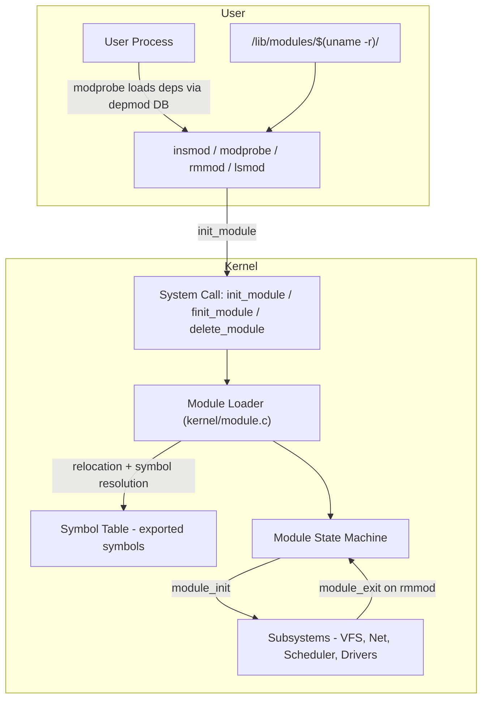
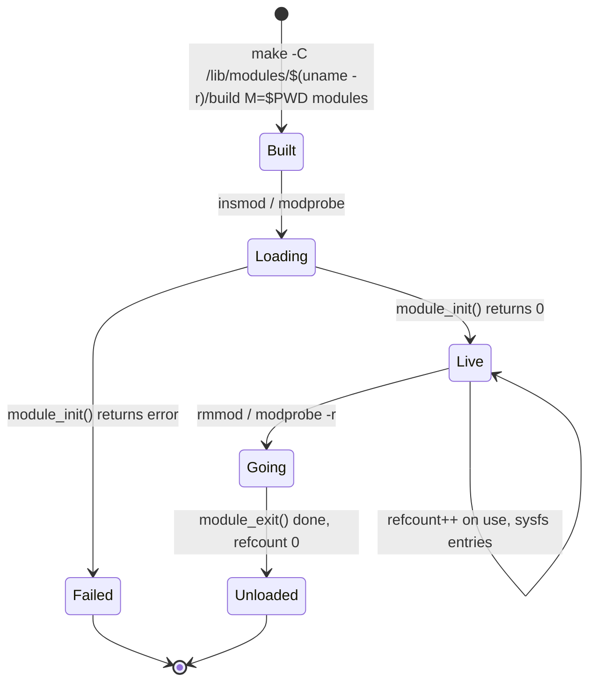
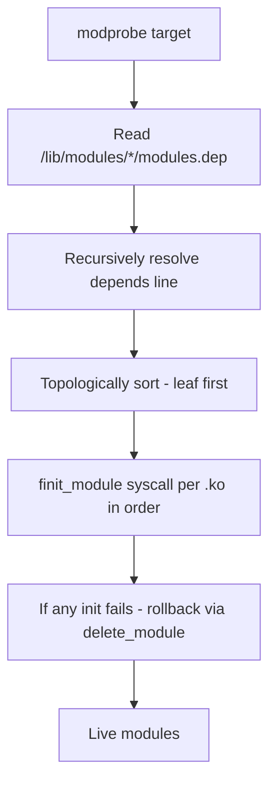

# Linux Kernel Modules

## Overview

**Loadable Kernel Modules (LKMs)** are object files (`.ko` — kernel object) that can be dynamically loaded into the running Linux kernel to extend its functionality without rebooting. They are the mechanism Linux uses to keep a **monolithic** kernel performant yet modular: core subsystems are always resident, while drivers, file systems, and optional features can be loaded on demand.

Think of LKMs as kernel plugins: device drivers, network protocol handlers, file systems (ext4, btrfs, overlayfs), LSMs that can be modular (eBPF-based), and diagnostic tools are typically modules.

> This page expands the brief mention in [Linux Kernel Internals](./README.md). For safe extensions without writing traditional modules, see [eBPF](./ebpf.md); for async I/O extensions, see [io_uring](./io-uring.md).

## Architecture



Monolithic kernel is one address space. A module runs in **kernel mode (ring 0)**, with full privilege — a bug can panic the kernel. That's why module signing, taint flags, and eBPF exist.

## Module Lifecycle



1. **Build**: compiled against headers for target kernel (`/lib/modules/$(uname -r)/build`). Contains `.ko` with `.modinfo`, `.symtab`, `__ksymtab`, `.strtab`.
2. **Load**: `init_module` or `finit_module` syscall copies module into kernel memory, performs relocation, resolves symbols via exported symbol table `/proc/kallsyms`.
3. **Init**: kernel calls `module_init()` function. If it returns 0, module state -> **LIVE**. Non-zero -> load fails.
4. **Live**: module's functions are callable; it may register drivers, file systems, netfilter hooks, etc. Reference count tracks usage (`lsmod` 3rd column).
5. **Unload**: `delete_module` syscall calls `module_exit()`. Fails if refcount !=0 or module marked permanent. Success -> memory freed, sysfs `/sys/module/<name>` removed.

## Toolchain

| Tool | Purpose | Example |
|------|---------|---------|
| `insmod` | Low-level load, no deps | `sudo insmod ./hello.ko` |
| `rmmod` | Low-level unload | `sudo rmmod hello` |
| `modprobe` | High-level, resolves deps via `depmod` + `modules.dep` | `sudo modprobe usb_storage` |
| `lsmod` | List loaded (parses `/proc/modules`) | `lsmod \| grep e1000` |
| `modinfo` | Show `.modinfo` (author, license, params, vermagic) | `modinfo ./hello.ko` |
| `depmod` | Build dependency database | `sudo depmod -a` |
| `dmesg` | Kernel log, see `printk` output | `dmesg -T \| tail` |
| `/sys/module/<name>/` | Runtime visibility: refcnt, parameters, holders | `ls /sys/module/kvm/` |

**modprobe vs insmod** is a common interview ask: `insmod` directly loads one `.ko` via syscall, does not resolve dependencies. `modprobe` reads `/lib/modules/<ver>/modules.dep` (generated by `depmod`) and recursively loads required modules from standard paths.

## Hello World Module

```c
// hello.c
#include <linux/module.h>
#include <linux/kernel.h>
#include <linux/init.h>

MODULE_LICENSE("GPL");
MODULE_AUTHOR("Placement Prep");
MODULE_DESCRIPTION("Minimal LKM example");
MODULE_VERSION("0.1");

static int __init hello_init(void) {
    pr_info("hello: loaded, jiffies=%lu\n", jiffies);
    return 0; // 0 = success, non-zero = fail
}

static void __exit hello_exit(void) {
    pr_info("hello: unloaded\n");
}

module_init(hello_init);
module_exit(hello_exit);
```

```makefile
# Makefile
obj-m += hello.o
KDIR := /lib/modules/$(shell uname -r)/build
PWD := $(shell pwd)

all:
	$(MAKE) -C $(KDIR) M=$(PWD) modules
clean:
	$(MAKE) -C $(KDIR) M=$(PWD) clean
insert:
	sudo insmod hello.ko
	dmesg | tail
remove:
	sudo rmmod hello
```

Build & run:

```bash
make
modinfo hello.ko        # vermagic must match uname -r
sudo insmod hello.ko    # or sudo modprobe --force-vermagic if testing
dmesg | tail
lsmod | grep hello
cat /sys/module/hello/refcnt
sudo rmmod hello
```

`MODULE_LICENSE("GPL")` is not cosmetic. Non-GPL modules **taint** the kernel (`/proc/sys/kernel/tainted`) and cannot access `EXPORT_SYMBOL_GPL` symbols.

## Module Parameters

Parameters allow runtime configuration without recompiling — similar to driver options like `io=0x300 irq=11`.

```c
#include <linux/moduleparam.h>
static int irq = 11;
static char *device_name = "mydev";
static int debug = 0;
module_param(irq, int, 0444);
MODULE_PARM_DESC(irq, "IRQ number (default 11)");
module_param(device_name, charp, 0444);
module_param(debug, int, 0644); // writable via /sys/module/<mod>/parameters/debug

static int __init my_init(void) {
    pr_info("device=%s irq=%d debug=%d\n", device_name, irq, debug);
    return 0;
}
```

Load with:

```bash
sudo insmod mymod.ko irq=5 device_name=\"eth0\" debug=1
# via modprobe ( /etc/modprobe.d/ )
echo "options mymod irq=5 debug=1" | sudo tee /etc/modprobe.d/mymod.conf
cat /sys/module/mymod/parameters/debug   # read
echo 0 | sudo tee /sys/module/mymod/parameters/debug  # write if 0644
```

`module_param` macro creates entries under `/sys/module/<name>/parameters/` and handles `kstrto*` parsing with permissions (0444 = read-only, 0644 = writable by root).

## Sysfs, Procfs, and Visibility

- `/proc/modules` — each loaded module: name, size, refcnt, holders, state.
- `/sys/module/<name>/` — `refcnt`, `holders/`, `parameters/`, `taint`, `sections/.text`, etc.
- `/proc/kallsyms` — exported symbols if `CONFIG_KALLSYMS=y`.
- `modprobe` config: `/etc/modprobe.d/*.conf`, blacklist, alias, softdep, install/remove overrides.

## Dependency Resolution



`modinfo` shows `depends:`. `depmod -a` rebuilds after kernel upgrade or manual install. `weakdeps` and `softdep` allow optional ordering.

## Signing, Taint, and Security

- **Signing**: `CONFIG_MODULE_SIG=y` — modules must be signed with key in kernel's keyring. Unsigned -> refused if `enforce`. Check via `modinfo -F sig_key`, `tail /proc/sys/kernel/tainted`.
- **Taint flags** (`/proc/sys/kernel/tainted`): proprietary module (P), out-of-tree (O), unsigned (E), etc. `dmesg` will show `Tainted: P O E`.
- **Lockdown**: `CONFIG_SECURITY_LOCKDOWN_LSM` may block module loading in integrity mode (Secure Boot).
- **Capabilities**: need `CAP_SYS_MODULE` to load/unload. Container runtimes drop it, hence no module load inside containers.
- **Alternatives**: For tracing/networking/security without full LKM risk, prefer [eBPF](./ebpf.md) — verified bytecode, no panics, no taint.

## LKM vs Built-in vs eBPF vs Userspace

| Aspect | Built-in | LKM | eBPF Program | Userspace Driver (VFIO/UIO/DPDK) |
|--------|----------|-----|--------------|----------------------------------|
| Linked at | kernel build | runtime `insmod` | runtime via `bpf()` syscall + verifier | never in kernel |
| Privilege | ring 0 | ring 0 | verifier + JIT, limited helpers | ring 3, mapped via IOMMU |
| Crash risk | panic | panic, taint | safe (verifier rejects unsafe) | process crash only |
| Use case | core subsystems | drivers, fs, netfilter | tracing, XDP, LSM, tc | high-perf networking |
| Upgradable | reboot | rmmod/insmod | atomic replace | restart process |

High-performance data planes increasingly move to **userspace + eBPF/XDP** rather than traditional LKMs for safety and upgradability.

## Debugging

- `pr_info`, `pr_warn`, `pr_err` with `DYNAMIC_DEBUG` -> `/sys/kernel/debug/dynamic_debug/control`
- `ftrace`: `echo function > /sys/kernel/debug/tracing/current_tracer; cat trace`
- `kprobes`/`tracepoints` via eBPF or `perf probe`
- `modprobe --dump-modversions` for version mismatch diagnostics
- `oops` messages: `ksymoops`, decode with `scripts/decode_stacktrace.sh vmlinux < oops.log`

## Interview Questions

**Q: modprobe vs insmod?**
`insmod` loads one file via `init_module`, no deps, no search path. `modprobe` is high-level: reads `modules.dep`, resolves dependencies topologically, searches standard paths, handles config in `/etc/modprobe.d/`, and can also handle install/remove overrides.

**Q: What happens when you insmod a module?**
User calls `insmod` -> `finit_module` syscall -> kernel allocates memory, copies ELF sections, performs relocation, resolves undefined symbols against exported symbol table (`/proc/kallsyms`), creates `struct module`, calls `module_init()`. If 0, state Live, adds to `/proc/modules`, creates sysfs entries. If non-zero, cleanup and error to userspace.

**Q: What prevents unloading a module?**
Non-zero refcount (`try_module_get` / `module_put` via holder modules or open file refs), marked `__init` only? Actually `rmmod` checks `refcnt` and if module has dependencies (`holders/`). Force unload `rmmod -f` is dangerous and disabled if `CONFIG_MODULE_FORCE_UNLOAD=n`.

**Q: Why does MODULE_LICENSE matter?**
Kernel tracks taint. Only `GPL` or `Dual BSD/GPL` can use `EXPORT_SYMBOL_GPL`. Proprietary marks kernel tainted (P flag), makes community support harder, may be blocked in lockdown.

**Q: Can you load kernel modules inside Docker?**
By default no: need `CAP_SYS_MODULE` and access to `/lib/modules`, usually privileged. Rootless containers cannot. Kubernetes DaemonSets that need modules (e.g., eBPF) run privileged with `hostPath`.

**Q: Module params vs sysfs module parameters?**
Same underlying storage. Loading param `irq=5` sets initial value. If permission `0644`, writable at runtime via `/sys/module/<mod>/parameters/irq`. Read/write triggers `kparam` callbacks.

**Q: How to debug kernel module crash?**
Check `dmesg` for Oops, use `addr2line -e vmlinux <addr>`, `decode_stacktrace.sh`. Enable `KASAN`, `LOCKDEP`. Use `ftrace` to trace init. Never test on production.

## Common Pitfalls

- Version mismatch: `vermagic` in `modinfo` must match `uname -r`. Cross-compiled for wrong arch fails.
- Floating point in kernel: forbidden (kernel saves no FPU context except via `kernel_fpu_begin()`).
- Sleeping in wrong context: `module_init` can sleep, but holding spinlock or in interrupt cannot.
- `printk` flooding: use `pr_debug` + dynamic debug, not `printk(KERN_DEBUG)` in hot path.
- Missing `MODULE_LICENSE` -> taint and warnings.
- Using GPL-only symbols from proprietary module -> link failure at load.

## Cross-References

- [Linux Kernel Internals](./README.md) — monolithic design, subsystems
- [eBPF](./ebpf.md) — safe extension vs LKM
- [io_uring](./io-uring.md) — modern async I/O extension
- [Device Drivers](../../os/io/device-drivers.md) — driver model
- [cgroups](../../os/containers/cgroups.md) / [Namespaces](../../os/containers/namespaces.md) — isolation prevents module load in containers
- [FUSE](../../os/filesystems/fuse.md) — userspace counterpart to fs LKM

## References

- Linux Kernel Documentation — Modules: https://www.kernel.org/doc/html/latest/core-api/kernel-api.html and https://docs.kernel.org/kbuild/modules.html [kernel.org](https://docs.kernel.org/kbuild/modules.html)
- `insmod`, `rmmod`, `modprobe`, `lsmod`, `modinfo` man pages — linux kernel deb: https://manpages.ubuntu.com [TLDP Module HOWTO]
- TLDP Linux Loadable Kernel Module HOWTO — LKM utilities, parameters, technical details [TLDP](https://tldp.org/HOWTO/html_single/Module-HOWTO/)
- Linux Kernel Workbook — Tools for kernel modules, hello world with parameters [readthedocs](https://lkw.readthedocs.io/en/latest/doc/03_kernel_modules.html)
- LWN — Signing, taint, lockdown, module lifecycle: https://lwn.net [kernelnewbies]
