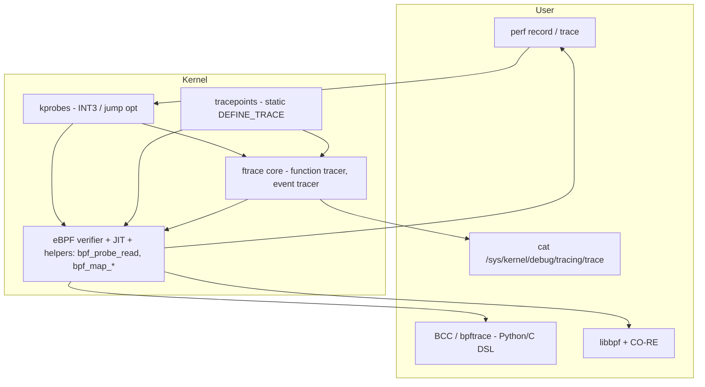
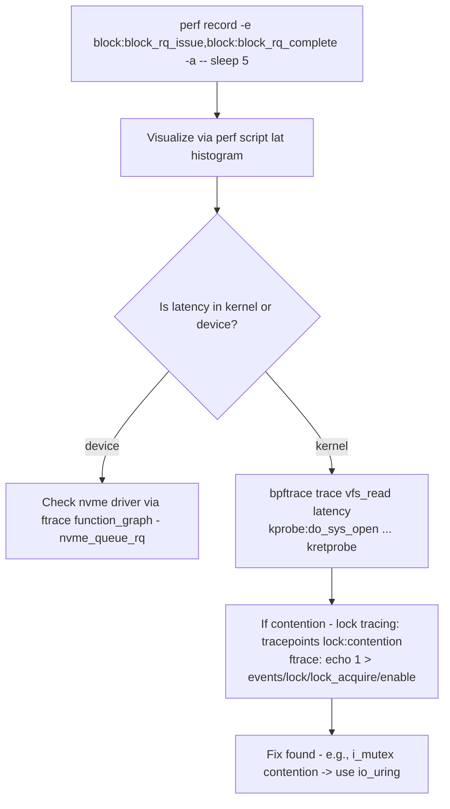

# Linux Kernel Tracing — ftrace, kprobes, kretprobes, tracepoints, perf, eBPF

## Overview

Observability inside the kernel is essential for performance engineering, debugging latency spikes, and security. Linux provides layered tracing:

- **ftrace** — official kernel tracer framework (in-kernel, low overhead, static files in `/sys/kernel/debug/tracing/`)
- **kprobes / kretprobes** — dynamic probes: break into almost any instruction, safe via INT3 / jump optimization
- **tracepoints** — static instrumentation inserted by kernel developers at logical points (`sched_switch`, `kmem_alloc`, `syscalls`)
- **kprobe events / uprobes** — dynamic events exposed via `kprobe_events` / `uprobe_events` files, usable from ftrace or perf
- **perf** — hardware counters + tracepoint collection + kprobes via `perf probe`
- **eBPF** — safe verifiable bytecode that can attach to kprobes, tracepoints, fentry/fexit for high-performance aggregation without copying data to userspace

This page focuses on the kernel-native mechanisms (ftrace, kprobes, tracepoints) and how they relate to eBPF (covered in [eBPF](./ebpf.md)) and [io_uring](./io-uring.md) for high-perf I/O observation.

> Prerequisites: [Kernel Modules](./modules.md) (how code gets into kernel), [Linux Kernel Internals](./README.md), [cgroups](../containers/cgroups.md) for filtering

## The Tracing Stack



Overhead ranking (from low to high):

- **tracepoint disabled**: ~0 (NOP or jump over)
- **tracepoint enabled via ftrace**: few 10s ns
- **ftrace function tracer**: ~0.5 µs per function entry (optimized via `CALL` patching)
- **kprobe (jump optimized)**: ~0.05 µs optimized, ~0.5 µs unoptimized INT3
- **kretprobe**: ~0.3-1.0 µs (needs trampoline)
- **eBPF program on kprobe**: verifier overhead but aggregation in kernel avoids copy to user, often cheaper end-to-end than ftrace copying trace buffer

## ftrace — The FileSystem Interface

ftrace is mounted at `/sys/kernel/debug/tracing/` (or `/sys/kernel/tracing` on newer). Key files:

| File | Purpose |
|------|---------|
| `available_tracers` | function, function_graph, blk, mmiotrace, nop |
| `current_tracer` | echo tracer name to enable |
| `available_events` | list of static tracepoints (`sched:*`, `kmem:*`, `syscalls:*`) |
| `events/` | per-event `enable`, `format`, `filter`, `trigger` |
| `kprobe_events` | dynamic kprobe creation |
| `uprobe_events` | userspace dynamic |
| `trace` | current trace buffer (live) |
| `trace_pipe` | blocking live stream |
| `trace_options` | e.g., `func_stack_trace`, `sym-addr` |
| `set_ftrace_filter` / `set_ftrace_notrace` | filter which functions to trace |
| `set_graph_function` | for function_graph tracer |

Example — trace `vfs_read` calls:

```bash
# Need root
echo 0 > /sys/kernel/debug/tracing/tracing_on
echo > /sys/kernel/debug/tracing/trace
echo function > /sys/kernel/debug/tracing/current_tracer
echo vfs_read > /sys/kernel/debug/tracing/set_ftrace_filter
echo 1 > /sys/kernel/debug/tracing/tracing_on
# run workload
cat /sys/kernel/debug/tracing/trace | head -n 20
echo 0 > /sys/kernel/debug/tracing/tracing_on
echo nop > /sys/kernel/debug/tracing/current_tracer
```

Function graph tracer shows duration + call graph:

```bash
echo function_graph > /sys/kernel/debug/tracing/current_tracer
echo vfs_read > /sys/kernel/debug/tracing/set_graph_function
echo 1 > /sys/kernel/debug/tracing/tracing_on
# cat trace shows:
# 0)  12.3 us |  vfs_read() {
# 0)  2.1 us |    rw_verify_area();
# 0)  8.2 us |    __vfs_read();
# ...
```

## kprobes / kretprobes — Dynamic Instrumentation

**kprobe**: dynamically insert breakpoint (INT3 on x86) at virtually any instruction. When hit:

1. CPU traps to kprobe handler
2. Pre-handler runs (can read regs via `struct pt_regs`)
3. Single-step the probed instruction out-of-line
4. Post-handler runs
5. Return to normal flow

Optimized path: if function starts with 5-byte CALL, kprobe replaces it with JMP to detour buffer (jump optimization) → 0.05 µs vs 0.5 µs.

Properties from kernel docs:

- Can probe almost anywhere except functions marked `__kprobes` / `nokprobe_inline` and exception handlers [kernel.org kprobes doc]
- `kretprobe` wraps return: trampoline replaces return address to capture return value; `maxactive` controls max concurrent instances (default 20× CPU). If exceeded, `nmissed` increments.

API (in kernel module — for eBPF you use helpers instead):

```c
#include <linux/kprobes.h>
static struct kprobe kp = { .symbol_name = "do_sys_open" };
static int handler_pre(struct kprobe *p, struct pt_regs *regs){
    pr_info("comm %s opening file arg1=%ld\n", current->comm, regs->di);
    return 0;
}
kp.pre_handler = handler_pre;
register_kprobe(&kp);
```

User-access via ftrace `kprobe_events`:

```bash
# Create kprobe event for do_sys_open with args
echo 'p:myprobe do_sys_open filename=%arg1:ustring' > /sys/kernel/debug/tracing/kprobe_events
echo 1 > /sys/kernel/debug/tracing/events/kprobes/myprobe/enable
cat /sys/kernel/debug/tracing/trace
# Format: myprobe: (do_sys_open+0/0x...) filename="/etc/passwd"
echo 0 > /sys/kernel/debug/tracing/events/kprobes/myprobe/enable
echo '-:myprobe' >> /sys/kernel/debug/tracing/kprobe_events
```

`$argN` fetchargs mapping relies on ABI (which register holds arg). On x86_64, first 6 args in `di, si, dx, cx, r8, r9`. `perf probe` auto-detects via debuginfo. [kernel.org kprobetrace]

## tracepoints — Static Low-Overhead Instrumentation

Inserted by kernel developers at logical places using `TRACE_EVENT` macros. Unlike kprobes, ABI stable, structured fields.

List:

```bash
ls /sys/kernel/debug/tracing/events/sched/ # sched_switch, sched_wakeup, ...
cat /sys/kernel/debug/tracing/events/sched/sched_switch/format
```

Fields include `prev_comm`, `prev_pid`, `next_comm`, etc. Filtering:

```bash
echo 'prev_pid == 1234' > /sys/kernel/debug/tracing/events/sched/sched_switch/filter
echo 1 > /sys/kernel/debug/tracing/events/sched/sched_switch/enable
```

Tracepoints are the basis for LTTng, perf, eBPF `tracepoint:syscalls:sys_enter_read`.

Comparison:

| Aspect | kprobe | tracepoint |
|--------|--------|------------|
| Placement | dynamic anywhere | static at developer-chosen spots |
| Stability | unstable (function may disappear) | stable (part of ABI) |
| Overhead off | 0 (not present) | NOP or static key (~0) |
| Overhead on | 0.05-0.5 µs | ~10s ns |
| Args | need manual fetch, ABI dependent | typed fields in format |
| Use | debugging unknown location | production monitoring |

## perf — Hardware + Tracepoints

`perf` uses tracepoints and kprobes via `perf probe`:

```bash
# Trace syscalls per process
perf trace -p 1234

# Record sched events
perf record -e sched:sched_switch -a -g -- sleep 1
perf script

# Dynamic kprobe via perf
perf probe 'do_sys_open filename:string'
perf record -e probe:do_sys_open -a
perf probe --del probe:do_sys_open
```

## eBPF — Modern Aggregator

eBPF programs can attach to `kprobe:`, `kretprobe:`, `tracepoint:`, `fentry/fexit` (BTF-based, faster than kprobe, no need for PT_REGS parse), and do aggregation in kernel maps, avoiding massive trace buffer copies.

One-liners via `bpftrace` (high-level DSL):

```bash
# Which files sshd opens
bpftrace -e 'kprobe:do_sys_open { printf("%s opening %s\n", comm, str(arg1)) }'

# Histogram of read bytes for vfs_read returns
bpftrace -e 'kretprobe:vfs_read { @bytes = hist(retval) }'

# Syscall count by comm
bpftrace -e 'tracepoint:raw_syscalls:sys_enter { @[comm] = count() }'

# Latency of do_sys_open
bpftrace -e 'kprobe:do_sys_open { @start[tid] = nsecs }
             kretprobe:do_sys_open /@start[tid]/ { @lat = hist(nsecs - @start[tid]); delete(@start[tid]) }'
```

BCC Python:

```python
from bcc import BPF
prog = """
int kprobe__do_sys_open(struct pt_regs *ctx, const char *filename){ bpf_trace_printk("opening %s\\n", filename); return 0; }
"""
BPF(text=prog).trace_print()
```

eBPF verifier ensures safety: no unbounded loops, valid memory access via helpers, max 1M instructions. JIT to x86_64/ARM64.

## Putting It Together — Performance Debugging Recipe

Goal: "Why is my NVMe read latency 95th percentile spiking?"



## Security & Production

- Need `CAP_SYS_ADMIN` or `CAP_PERFMON` (Linux 5.8+) for tracing. In lockdown mode, kprobes blocked.
- kprobe overhead additive: 1000 probes * 0.5 µs each → 500 µs per syscall → significant. Use tracepoints or eBPF fentry which are cheaper.
- BPF map size limits: `RLIMIT_MEMLOCK` (older) or BPF memory accounting (new). Avoid map leak via `delete`.
- Ftrace buffer: per-CPU `trace_buffers` in `tracefs`; if overflow, `overrun` counter. Increase via `buffer_size_kb`.

## Interview Questions

**Q: ftrace vs perf vs eBPF?**
ftrace — in-kernel tracer with file interface, function and function_graph tracers, event tracer. Lowest level, always available if `CONFIG_FTRACE`. perf — hardware counters + tracepoints + profiling, uses ftrace infrastructure. eBPF — programmable, safe aggregation in kernel, no data copy to user unless needed, modern choice for production observability.

**Q: kprobe vs tracepoint overhead?**
Tracepoint off is NOP; on is ~tens ns with structured fields. kprobe unoptimized is INT3 trap ~0.5 µs, optimized jump ~0.05 µs but still needs handler. For hot path (e.g., scheduler), use tracepoint or fentry/fexit eBPF (trampoline < kprobe).

**Q: How does kretprobe work?**
Replaces return address on stack with trampoline address. When function returns, trampoline runs, records return value, then jumps to original return address. `maxactive` limits concurrent probed instances; if function recurses or is heavily concurrent, need higher maxactive else `nmissed`.

**Q: What is fentry/fexit vs kprobe?**
fentry/fexit are BTF-based (BPF Type Format) trampolines attached at function entry/exit without breakpoint — directly call BPF program via `bpf_trampoline`. Faster, more stable than kprobe because arguments are typed via BTF, no `PT_REGS` parsing. Requires kernel built with `CONFIG_DEBUG_INFO_BTF`. Preferred over kprobe for new code.

**Q: Why does perf need debuginfo for kprobe args?**
Because mapping of function args to registers/stack depends on calling convention and optimization. `perf probe` parses DWARF debuginfo to find `DI` → first arg, etc. Without debuginfo, you manually specify register: `p:myprobe do_sys_open %di`.

## Cross-References

- [eBPF](./ebpf.md) — safe programmable tracing, XDP, CO-RE
- [io_uring](./io-uring.md) — async I/O that reduces need for blocking tracing
- [Kernel Modules](./modules.md) — how custom kprobe handlers loaded as modules (older approach)
- [cgroups](../containers/cgroups.md) — filtering BPF programs by cgroup
- [Observability](../../backend/observability/README.md) — observability overview

## References

- Kernel docs — Kprobes: Concepts, Return Probes, Jump Optimization, Probe Overhead (0.05-0.99 µs), debugfs interface [kernel.org][kernel.org docs]
- Kernel docs — Kprobe-based Event Tracing: Synopsis of `kprobe_events`, fetchargs `$argN`, `$retval`, `$comm`, `+OFFS(FETCHARG)` [docs.kernel.org]
- Linux Foundation Event — Kernel Tracing using eBPF: kprobes, uprobes, tracepoints, BCC/bpftrace examples `bpftrace -e 'kprobe:do_sys_open { printf(...)}'` [Linux Foundation Events]
- TLDP / man pages — ftrace, kprobes, perf
