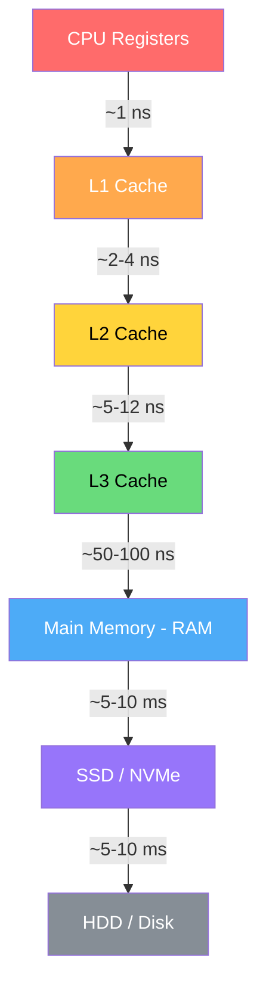
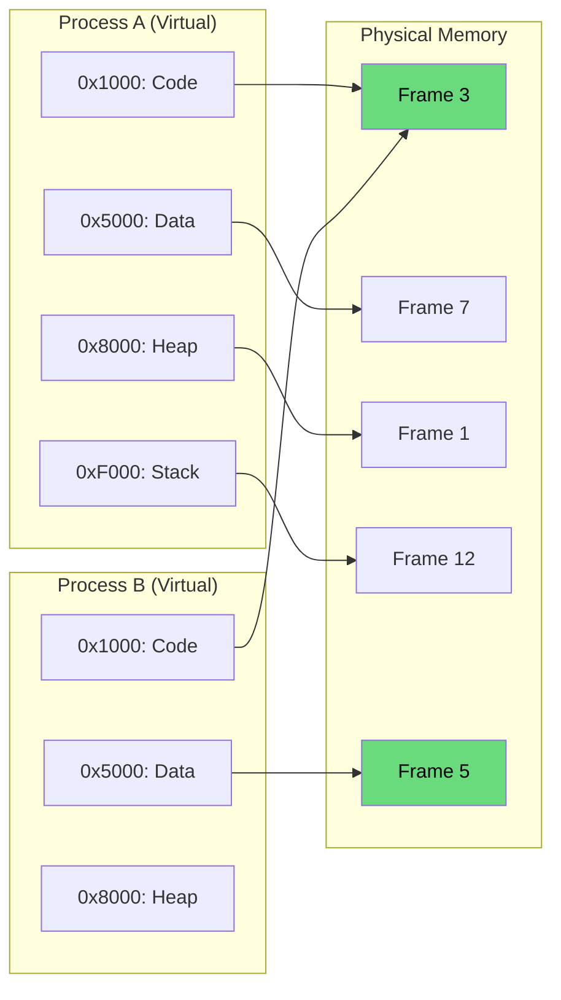
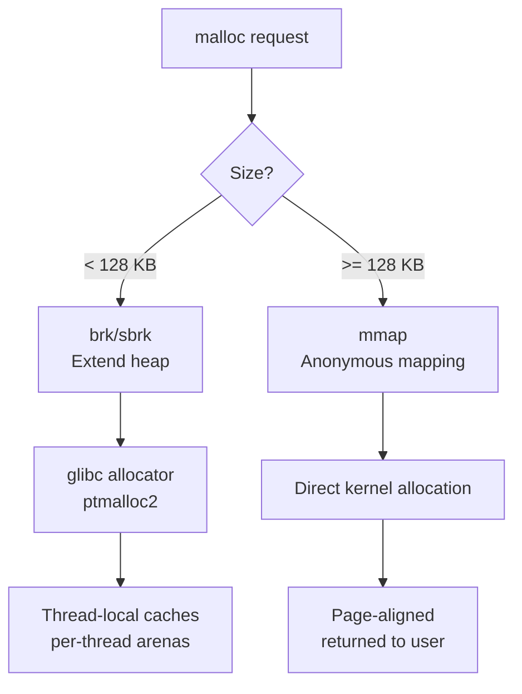
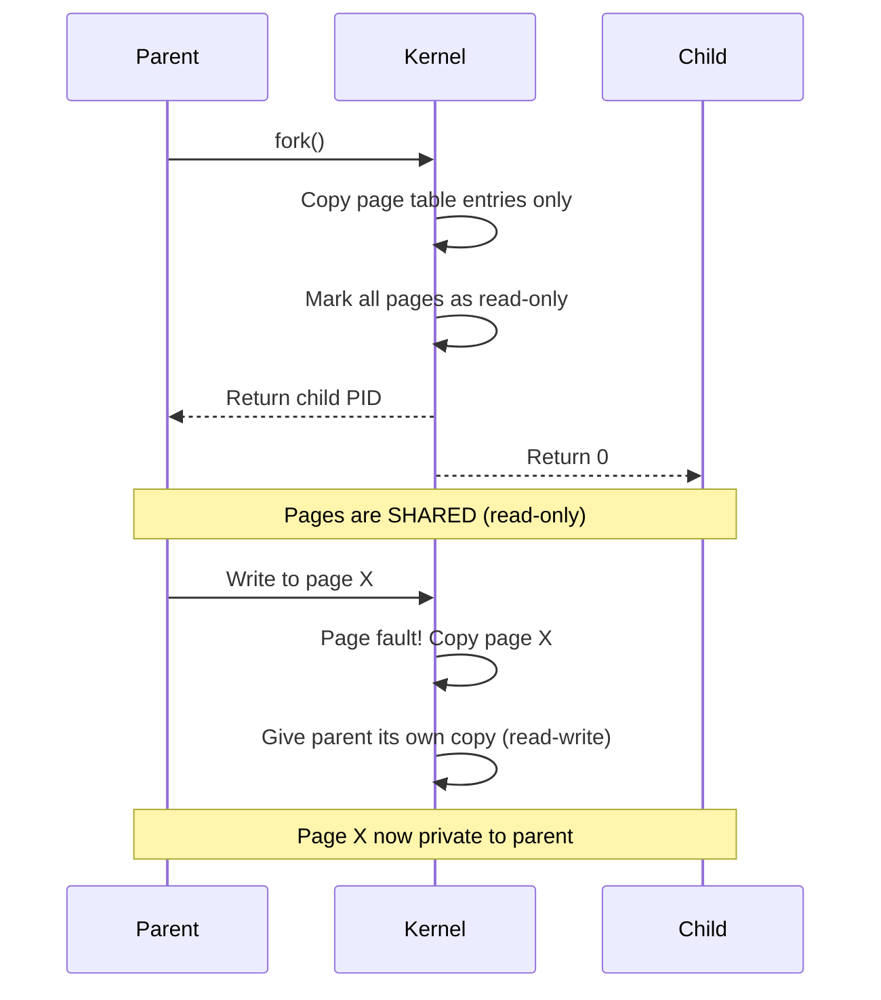
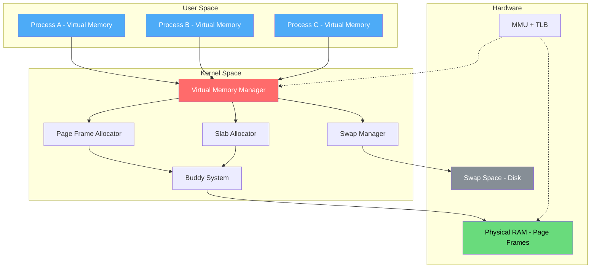
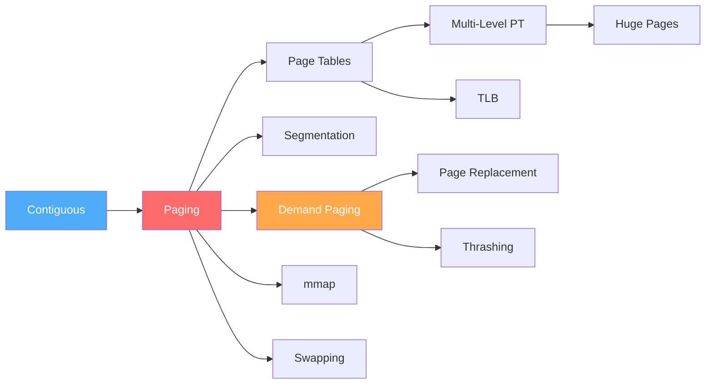

# Memory Management

Memory management is one of the most critical subsystems of an operating system. It handles the allocation, tracking, and reclamation of primary memory (RAM), ensuring efficient utilization while providing process isolation and protection.

## Why Memory Management Matters

Every program needs memory to store instructions, data, and stack frames. The OS must:

1. **Allocate** memory to processes when needed
2. **Protect** each process's memory from others
3. **Share** memory efficiently when appropriate
4. **Reclaim** memory when processes terminate
5. **Virtualize** limited physical memory across many processes

## Memory Hierarchy

The memory hierarchy is a fundamental concept: faster memory is smaller and more expensive, while slower memory is larger and cheaper. The OS exploits this by keeping frequently accessed data in faster levels.



| Level | Size | Latency | Bandwidth | Managed By | Volatile? |
|-------|------|---------|-----------|------------|-----------|
| Registers | ~1 KB | <1 ns | ~1 TB/s | Compiler/CPU | Yes |
| L1 Cache | 32-64 KB | ~1 ns | ~500 GB/s | Hardware | Yes |
| L2 Cache | 256 KB-1 MB | ~4 ns | ~200 GB/s | Hardware | Yes |
| L3 Cache | 4-64 MB | ~12 ns | ~100 GB/s | Hardware | Yes |
| RAM | 4-512 GB | ~100 ns | ~50 GB/s | OS + Hardware | Yes |
| SSD (NVMe) | 256 GB-4 TB | ~100 μs | ~7 GB/s | OS + Firmware | No |
| HDD | 1-20 TB | ~5-10 ms | ~200 MB/s | OS + Firmware | No |

**Key insight:** The ratio between adjacent levels is typically 10x in latency. The OS tries to keep the "working set" (actively used data) in the faster levels.

## Address Spaces

Every process has its own **virtual address space** — a logical view of memory that is independent of physical memory. The OS and hardware (MMU) translate virtual addresses to physical addresses.

### Physical vs Virtual Address Space



### Benefits of Virtual Address Spaces

| Benefit | Explanation |
|---------|-------------|
| **Isolation** | Process A cannot access Process B's memory (protection) |
| **Simplification** | Each process sees a contiguous address space (even if physical memory is fragmented) |
| **Sharing** | Shared libraries mapped once in physical memory, visible in multiple address spaces |
| **Overcommit** | Total virtual memory can exceed physical RAM (with swap) |
| **Relocation** | Processes don't need to know their physical location |

### Address Space Layout (64-bit Linux)

```
0x0000000000000000 ┌──────────────────┐
                   │  Unmapped (NULL)  │ (null pointer trap)
0x0000000000400000 ├──────────────────┤
                   │    Text Segment   │ (executable code, R-X)
                   ├──────────────────┤
                   │    Data Segment   │ (initialized globals, RW-)
                   ├──────────────────┤
                   │    BSS Segment    │ (uninitialized globals, RW-)
                   ├──────────────────┤
                   │      Heap         │ (malloc, grows upward)
                   │        ↑          │
                   │   (unmapped gap)  │
                   │        ↓          │
                   │     mmap region   │ (shared libs, mmap, grows downward)
                   ├──────────────────┤
                   │   Stack (8MB max) │ (local vars, grows downward)
0x00007FFFFFFFFFFF ├──────────────────┤
                   │   Kernel Space    │ (not accessible to user)
0xFFFFFFFFFFFFFFFF └──────────────────┘
```

## Memory Allocation Strategies Overview

The OS must decide how to allocate physical memory to processes. Three main approaches:

### 1. Contiguous Allocation

The simplest approach: each process gets a contiguous block of physical memory.

```
Physical Memory:
┌──────────┬──────────┬──────────┬──────────┬──────────┐
│ OS (100) │ P1 (200) │ P2 (150) │ P3 (300) │ Free(250)│
└──────────┴──────────┴──────────┴──────────┴──────────┘
```

**Allocation algorithms:**

| Algorithm | Strategy | Pros | Cons |
|-----------|----------|------|------|
| **First Fit** | First hole that fits | Fast | External fragmentation |
| **Best Fit** | Smallest hole that fits | Less waste | Slower, tiny fragments |
| **Worst Fit** | Largest hole | Larger remaining holes | Slower, still fragments |
| **Next Fit** | First fit from last position | Spreads allocation | Similar to first fit |

**Problems:**
- **External fragmentation:** Free memory is scattered in small holes
- **Internal fragmentation:** Allocated block larger than needed
- **Fixed partitioning:** Wastes memory if process is smaller than partition

### 2. Paging

Modern OSes use **paging**: divide both virtual and physical memory into fixed-size blocks.

| Concept | Size (typical) | Description |
|---------|---------------|-------------|
| **Page** | 4 KB | Fixed-size virtual memory block |
| **Frame** | 4 KB | Fixed-size physical memory block |
| **Page Table** | Per-process | Maps virtual pages → physical frames |
| **Offset** | 12 bits (4KB) | Position within page |

```
Virtual Address:  [Page Number (20 bits)] [Offset (12 bits)]
                        │
                        ▼
                  ┌─────────────┐
                  │  Page Table  │
                  │  Page 0 → F5│
                  │  Page 1 → F2│
                  │  Page 2 → F8│
                  └─────────────┘
                        │
                        ▼
Physical Address: [Frame Number (20 bits)] [Offset (12 bits)]
```

**Advantages:** No external fragmentation, easy allocation, process can use non-contiguous frames.

### 3. Segmentation

Memory divided into **variable-size segments** matching program structure (code, data, stack).

| Segment | Base | Limit | Description |
|---------|------|-------|-------------|
| Code | 0x4000 | 0x1000 | Executable instructions |
| Data | 0x8000 | 0x2000 | Global variables |
| Stack | 0xF000 | 0x1000 | Function frames |

**Advantages:** Natural for compilers, supports sharing (share code segment).
**Disadvantages:** External fragmentation, complex allocation.

### Modern Approach: Paging + Segmentation

Most modern systems use **paging** (eliminates external fragmentation) with segments only for protection (code=RX, data=RW, etc.).

## Memory Allocation: malloc() vs mmap()

### How malloc() Works

`malloc()` is a C library function that allocates heap memory. Its implementation depends on the size:



**Small allocations (< 128 KB):**
1. `malloc()` calls `brk()` to extend the heap segment
2. glibc maintains a free list (bins) for efficient reuse
3. Thread-local arenas reduce lock contention

**Large allocations (≥ 128 KB):**
1. `malloc()` calls `mmap()` for anonymous memory mapping
2. Memory is page-aligned and independently managed
3. Freed directly via `munmap()` (no fragmentation)

```c
#include <stdio.h>
#include <stdlib.h>
#include <sys/mman.h>

// Small allocation — uses heap (brk)
int *arr = malloc(100 * sizeof(int));  // 400 bytes

// Large allocation — uses mmap
int *big = malloc(1024 * 1024);  // 1 MB

// Direct mmap — full control
void *mem = mmap(NULL, 4096,
                 PROT_READ | PROT_WRITE,
                 MAP_PRIVATE | MAP_ANONYMOUS,
                 -1, 0);
// Use mem...
munmap(mem, 4096);

free(arr);
free(big);
```

### Viewing Memory in Linux

```bash
# Process memory map
cat /proc/<PID>/maps

# Detailed memory stats
cat /proc/<PID>/smaps

# System memory info
cat /proc/meminfo

# Memory usage summary
free -h

# Per-process memory usage
ps aux --sort=-%mem | head -20

# Detailed process memory
pmap -x <PID>

# Watch memory in real-time
vmstat 1

# Memory allocation trace
strace -e trace=mmap,brk,munmap ./my_program
```

## Copy-on-Write (COW)

Copy-on-Write is a crucial optimization used by `fork()` and other mechanisms:



**Benefits:**
- `fork()` is fast — only page table copied, not all pages
- If child immediately calls `exec()`, no pages are ever copied
- Memory savings when parent and child read the same data

## Linux Memory Architecture



### Linux Kernel Memory Allocators

| Allocator | Purpose | Level |
|-----------|---------|-------|
| **Buddy System** | Physical page frame allocation | Lowest level |
| **Slab Allocator** | Kernel object caching (task_struct, etc.) | Above buddy |
| **kmalloc** | Small kernel allocations (physically contiguous) | Uses slab |
| **vmalloc** | Large kernel allocations (virtually contiguous) | Uses page allocator |
| **CMA** | Contiguous Memory Allocator (for DMA devices) | Special purpose |

## Quick Reference: Key Terms

| Term | Definition |
|------|-----------|
| **Frame** | Fixed-size physical memory block |
| **Page** | Fixed-size virtual memory block |
| **Page Fault** | Accessing a page not in physical memory |
| **TLB** | Translation Lookaside Buffer (page table cache) |
| **MMU** | Memory Management Unit (hardware translator) |
| **Working Set** | Set of pages a process actively uses |
| **Thrashing** | Excessive page faults degrading performance |
| **COW** | Copy-on-Write — defer copying until modification |
| **NUMA** | Non-Uniform Memory Access architecture |
| **OOM** | Out of Memory — kernel kills processes |
| **Swapping** | Moving entire process to/from disk |
| **Paging** | Moving individual pages to/from disk |
| **Fragmentation** | Wasted memory (internal or external) |

## Interview Focus Areas

1. **Paging vs Segmentation** — trade-offs, why paging won
2. **Page fault handling** — step-by-step from trap to return
3. **TLB** — what happens on miss, TLB reach
4. **Thrashing** — causes, detection, solutions
5. **Virtual to physical translation** — walk through the hardware
6. **Linux `/proc/meminfo`** — understanding each field
7. **malloc vs mmap** — when the kernel uses each
8. **Copy-on-Write** — fork() optimization mechanics

## Study Path



Start with contiguous allocation (simplest), then paging (modern standard), then build up to advanced topics.

## Interview Questions

### Beginner

**Q1: What is the difference between physical and virtual memory?**  
A: Physical memory is the actual RAM hardware. Virtual memory is an abstraction provided by the OS that gives each process its own address space. The MMU translates virtual addresses to physical addresses. Virtual memory allows processes to use more memory than physically available (via swap) and provides isolation.

**Q2: What is a page fault?**  
A: A page fault occurs when a process accesses a virtual page that is not currently mapped to a physical frame. The OS must load the page from disk (or allocate a new frame). Not all page faults are errors — demand paging intentionally triggers page faults to load pages on demand.

**Q3: What is the difference between paging and swapping?**  
A: Paging moves individual pages (4KB) between RAM and disk. Swapping moves entire processes between RAM and disk. Modern Linux uses paging (not classic swapping), though swap space is still used for paging out anonymous memory.

### Intermediate

**Q4: How does malloc() decide whether to use brk() or mmap()?**  
A: Small allocations (< 128KB typically) use `brk()` which extends the heap segment. Large allocations (≥ 128KB) use `mmap()` which creates an anonymous memory mapping. `mmap()` allocations can be freed independently via `munmap()`, while `brk()` memory can only be shrunk from the top.

**Q5: What is external vs internal fragmentation?**  
A: External fragmentation: free memory is split into small non-contiguous holes — total free memory is sufficient but no single hole is large enough. Internal fragmentation: allocated block is larger than needed, wasting the extra space. Paging eliminates external fragmentation (fixed-size blocks) but may have internal fragmentation (last page partially used).

### FAANG-Level

**Q6: Explain how Copy-on-Write works in fork(). What are the edge cases?**  
A: `fork()` copies only the page table, marking all pages read-only and shared. When either process writes, a page fault triggers copying of that specific page. Edge cases: 1) If parent has large heap and child immediately calls `exec()`, the page table copy is wasted — use `posix_spawn()` instead. 2) If both processes write to most pages, COW causes many page faults — worse than eager copy. 3) DTLB (data TLB) entries must be flushed on COW fault. 4) Huge pages (2MB/1GB) complicate COW — entire huge page must be copied for a single byte write.

**Q7: Design a memory allocator for a multi-threaded server handling 10k connections.**  
A: Use per-thread arenas (like glibc's ptmalloc2): 1) Each thread has its own free list, avoiding lock contention. 2) Thread-local cache for small objects (< 64 bytes) using slab allocator. 3) Size classes: 8, 16, 32, 64, 128, 256, 512, 1024 bytes — reduce fragmentation. 4) Large allocations via `mmap()` with `MADV_HUGEPAGE` for TLB efficiency. 5) Memory pools for fixed-size objects (connection buffers, request structs). 6) Return memory to OS periodically via `madvise(MADV_DONTNEED)`. Alternative: use jemalloc or tcmalloc which are designed for this workload.

## Cross-References

- [Virtual Memory](../virtual-memory/README.md)
- [Cache Hierarchy](../../arch/memory-hierarchy/README.md)
- [Buffer Pool](../../dbms/caching/buffer-pool.md)
- [DRAM](../../arch/memory-tech/dram.md)

## References

- Silberschatz, A., Galvin, P.B., Gagne, G. *Operating System Concepts*, 10th Edition. Wiley, 2018. (Chapters 8-9: Memory Management)
- Love, R. *Linux Kernel Development*, 3rd Edition. Addison-Wesley, 2010. (Chapter 12: Memory Management)
- Bovet, D.P., Cesati, M. *Understanding the Linux Kernel*, 3rd Edition. O'Reilly, 2005. (Chapters 8-9: Memory Management)
- Kerrisk, M. *The Linux Programming Interface*. No Starch Press, 2010. (Chapter 47: Memory Mappings)
- `man 2 mmap`, `man 2 brk`, `man 3 malloc` — Linux manual pages
- Gorman, M. *Understanding the Linux Virtual Memory Manager*. Prentice Hall, 2004.
