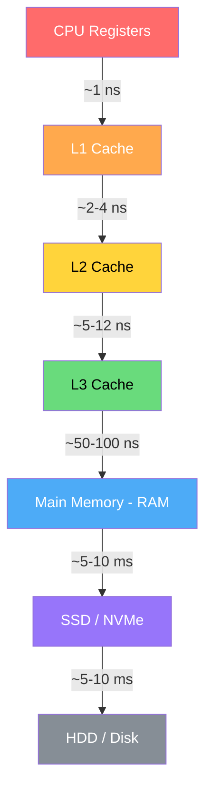
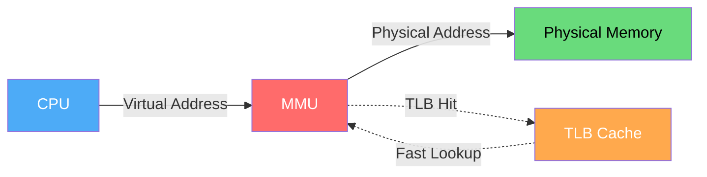
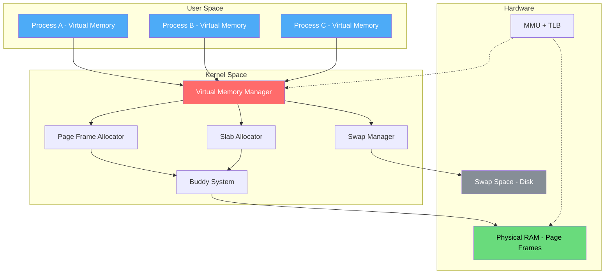
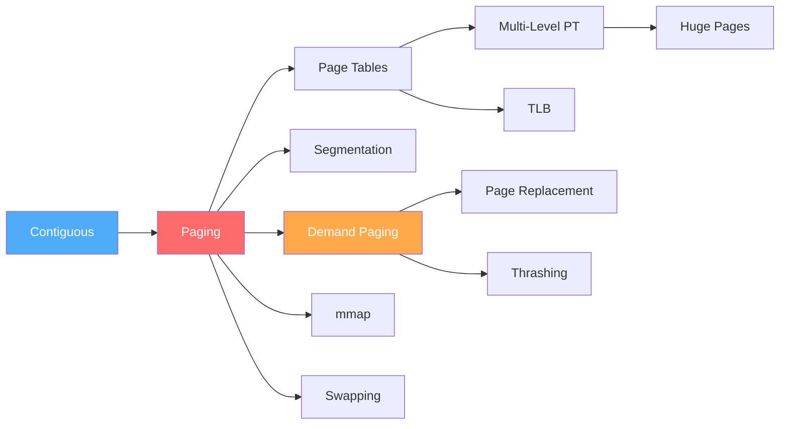

# Memory Management

Memory management is one of the most critical subsystems of an operating system. It handles the allocation, tracking, and回收 of primary memory (RAM), ensuring efficient utilization while providing process isolation and protection.

## Why Memory Management Matters

Every program needs memory to store instructions, data, and stack frames. The OS must:

1. **Allocate** memory to processes when needed
2. **Protect** each process's memory from others
3. **Share** memory efficiently when appropriate
4. **Reclaim** memory when processes terminate
5. **Virtualize** limited physical memory across many processes

## Memory Hierarchy

| Level | Size | Latency | Managed By |
|-------|------|---------|------------|
| Registers | ~1 KB | <1 ns | Compiler/CPU |
| L1 Cache | 32-64 KB | ~1 ns | Hardware |
| L2 Cache | 256 KB-1 MB | ~4 ns | Hardware |
| L3 Cache | 4-64 MB | ~12 ns | Hardware |
| RAM | 4-512 GB | ~100 ns | OS + Hardware |
| SSD | 256 GB-4 TB | ~100 μs | OS + Firmware |
| HDD | 1-20 TB | ~5-10 ms | OS + Firmware |

## Address Translation

The fundamental challenge: programs use **logical (virtual) addresses**, but hardware needs **physical addresses**. The Memory Management Unit (MMU) translates between them.

## Key Concepts Across This Section

### Allocation Strategies
- **[Contiguous Allocation](./contiguous.md)** — Simplest approach; processes get consecutive physical blocks
- **[Paging](./paging.md)** — Fixed-size blocks; eliminates external fragmentation
- **[Segmentation](./segmentation.md)** — Variable-size segments matching program structure

### Page Table Management
- **[Page Tables](./page-tables.md)** — Core data structures for address translation
- **[TLB](./tlb.md)** — Hardware cache for page table entries
- **[Multi-Level Page Tables](./multi-level-page-tables.md)** — Hierarchical tables to save space
- **[Inverted Page Tables](./inverted-page-tables.md)** — One entry per physical frame

### Advanced Techniques
- **[Huge Pages](./huge-pages.md)** — Larger page sizes for reduced TLB misses
- **[Swapping](./swapping.md)** — Moving pages to/from disk
- **[mmap](./mmap.md)** — Memory-mapped files and anonymous mappings
- **[NUMA](./numa.md)** — Non-Uniform Memory Access architectures

### Allocator Implementations
- **[Allocation Algorithms](./allocation-algorithms.md)** — First-fit, best-fit, worst-fit
- **[Buddy System](./buddy-system.md)** — Power-of-2 splitting/merging allocator
- **[Slab Allocator](./slab-allocator.md)** — Kernel object caching

## Linux Memory Architecture

## Quick Reference: Key Terms

| Term | Definition |
|------|-----------|
| **Frame** | Fixed-size physical memory block |
| **Page** | Fixed-size virtual memory block |
| **Page Fault** | Accessing a page not in physical memory |
| **TLB** | Translation Lookaside Buffer (page table cache) |
| **MMU** | Memory Management Unit (hardware translator) |
| **Working Set** | Set of pages a process actively uses |
| **Thrashing** | Excessive page faults degrading performance |
| **COW** | Copy-on-Write — defer copying until modification |
| **NUMA** | Non-Uniform Memory Access architecture |
| **OOM** | Out of Memory — kernel kills processes |

## Interview Focus Areas

1. **Paging vs Segmentation** — trade-offs, why paging won
2. **Page fault handling** — step-by-step from trap to return
3. **TLB** — what happens on miss, TLB reach
4. **Thrashing** — causes, detection, solutions
5. **Virtual to physical translation** — walk through the hardware
6. **Linux `/proc/meminfo`** — understanding each field
7. **malloc vs mmap** — when the kernel uses each
8. **Copy-on-Write** — fork() optimization mechanics

## Study Path

Start with contiguous allocation (simplest), then paging (modern standard), then build up to advanced topics.

## Cross References

- [Virtual Memory](../os/virtual-memory/README.md)
- [Cache Hierarchy](../arch/memory-hierarchy/README.md)
- [Buffer Pool](../dbms/caching/buffer-pool.md)
- [DRAM](../arch/memory-tech/dram.md)
