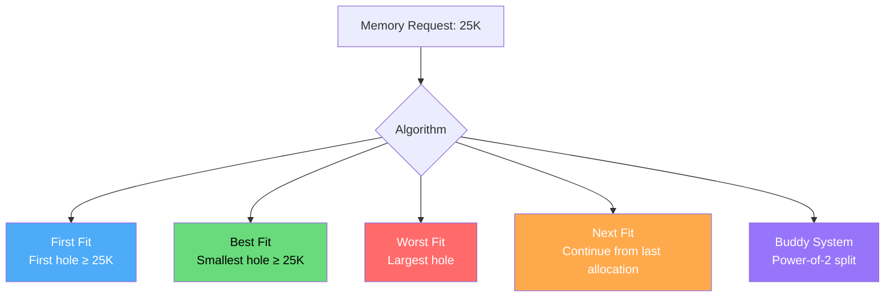
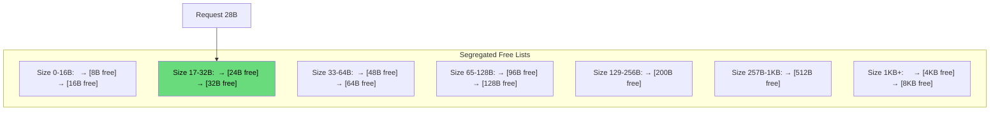

# Memory Allocation Algorithms

When multiple free blocks (holes) of different sizes exist, the OS must choose which block to allocate. These algorithms determine how the memory manager selects free blocks, directly impacting fragmentation and utilization.

## Overview



## The Problem

Given free memory holes and allocation requests, which hole should we pick?

```
Memory: [A:30K][Free:20K][B:15K][Free:50K][C:25K][Free:40K]

Request D: 15K
Options: 20K hole, 50K hole, 40K hole

Which one? → Depends on algorithm
```

## First Fit

Scans from the beginning and allocates the **first** hole that is large enough.

```mermaid
graph LR
    subgraph "Memory"
        A["A:30K"] B["Free:20K"] C["B:15K"] D["Free:50K"] E["C:25K"] F["Free:40K"]
    end
    
    B -->|"Request 15K\n20K ≥ 15K ✓\nALLOCATE HERE"| G["A:30K | D:15K | Free:5K | B:15K | Free:50K | C:25K | Free:40K"]
    
    style B fill:#69db7c,color:#000
    style G fill:#4dabf7,color:#fff
```

### Algorithm

```c
Block* first_fit(FreeList *list, size_t size) {
    Block *current = list->head;
    while (current != NULL) {
        if (current->size >= size) {
            return current;  // Found first fit
        }
        current = current->next;
    }
    return NULL;  // No suitable block
}
```

### Characteristics

| Aspect | Rating |
|--------|--------|
| Speed | Fast (stops at first match) |
| External Fragmentation | Moderate |
| Allocation Pattern | Tends to fill low addresses first |
| Search Time | O(n) worst, O(1) average |

## Best Fit

Scans the entire list and allocates the **smallest** hole that is large enough.

```mermaid
graph LR
    subgraph "Memory"
        A["A:30K"] B["Free:20K"] C["B:15K"] D["Free:50K"] E["C:25K"] F["Free:40K"]
    end
    
    B -->|"20K ≥ 15K"| H["Candidate"]
    D -->|"50K ≥ 15K"| H
    F -->|"40K ≥ 15K"| H
    H -->|"Smallest = 20K"| I["Allocate from 20K hole"]
    
    style B fill:#69db7c,color:#000
    style I fill:#4dabf7,color:#fff
```

### Algorithm

```c
Block* best_fit(FreeList *list, size_t size) {
    Block *best = NULL;
    Block *current = list->head;
    
    while (current != NULL) {
        if (current->size >= size) {
            if (best == NULL || current->size < best->size) {
                best = current;
            }
        }
        current = current->next;
    }
    return best;
}
```

### Characteristics

| Aspect | Rating |
|--------|--------|
| Speed | Slow (must check all blocks) |
| External Fragmentation | Many tiny unusable holes |
| Allocation Pattern | Minimizes wasted space per allocation |
| Search Time | O(n) always |

## Worst Fit

Scans the entire list and allocates the **largest** hole.

```mermaid
graph LR
    subgraph "Memory"
        A["A:30K"] B["Free:20K"] C["B:15K"] D["Free:50K"] E["C:25K"] F["Free:40K"]
    end
    
    D -->|"Largest = 50K\nAllocate 15K"| G["Remaining: 35K"]
    
    style D fill:#69db7c,color:#000
    style G fill:#4dabf7,color:#fff
```

### Algorithm

```c
Block* worst_fit(FreeList *list, size_t size) {
    Block *worst = NULL;
    Block *current = list->head;
    
    while (current != NULL) {
        if (current->size >= size) {
            if (worst == NULL || current->size > worst->size) {
                worst = current;
            }
        }
        current = current->next;
    }
    return worst;
}
```

### Characteristics

| Aspect | Rating |
|--------|--------|
| Speed | Slow (must check all blocks) |
| External Fragmentation | Large remaining holes (usable) |
| Allocation Pattern | Breaks large blocks into medium |
| Search Time | O(n) always |

## Next Fit

Like first fit, but continues scanning from where the last allocation ended.

```c
Block* next_fit(FreeList *list, size_t size, Block **last_pos) {
    Block *current = *last_pos ? (*last_pos)->next : list->head;
    Block *start = current;
    
    do {
        if (current == NULL) current = list->head;  // Wrap around
        if (current->size >= size) {
            *last_pos = current;
            return current;
        }
        current = current->next;
    } while (current != start);
    
    return NULL;
}
```

### Characteristics

| Aspect | Rating |
|--------|--------|
| Speed | Fast (average) |
| External Fragmentation | Distributed evenly |
| Allocation Pattern | Spreads allocations across memory |
| Search Time | O(n) worst, better average than first fit |

## Comparison Table

```python
def simulate_allocator(holes, requests, algorithm):
    """Simulate an allocation algorithm."""
    import copy
    holes = copy.deepcopy(holes)  # [(start, size), ...]
    allocations = []
    
    for req_size in requests:
        if algorithm == "first_fit":
            chosen = first_fit(holes, req_size)
        elif algorithm == "best_fit":
            chosen = best_fit(holes, req_size)
        elif algorithm == "worst_fit":
            chosen = worst_fit(holes, req_size)
        
        if chosen is not None:
            idx, (start, size) = chosen
            allocations.append((start, req_size))
            remaining = size - req_size
            if remaining > 0:
                holes[idx] = (start + req_size, remaining)
            else:
                holes.pop(idx)
        else:
            allocations.append(None)
    
    return allocations, holes

# Example
holes = [(0, 30), (50, 20), (80, 50), (140, 40)]
requests = [15, 25, 10, 20]

for algo in ["first_fit", "best_fit", "worst_fit"]:
    allocs, remaining = simulate_allocator(holes, requests, algo)
    total_free = sum(s for _, s in remaining)
    print(f"{algo}: allocations={allocs}, free={remaining}, total_free={total_free}")
```

## Segregated Free Lists

Modern allocators use **segregated free lists** — separate lists for different size classes:



Benefits:
- O(1) lookup for common sizes
- Reduces fragmentation within size classes
- Used by `malloc` (glibc, jemalloc, tcmalloc)

## Real-World: Linux Kernel Allocators

```bash
# Linux uses multiple allocators:
# 1. Buddy System: Page-level (4KB+) allocation
# 2. Slab Allocator: Kernel object caching
# 3. vmalloc: Virtual contiguous, physical may not be
# 4. kmalloc: Small kernel allocations (uses slab)

# View buddy allocator state
$ cat /proc/buddyinfo
Node 0, zone      DMA      1      0      0      1      1      1      0
Node 0, zone    DMA32      8      5      2      3      2      2      1
Node 0, zone   Normal    142     65     32     15      8      4      2

# View slab allocator state
$ sudo cat /proc/slabinfo | head -10
# name            <active_objs> <num_objs> <objsize> <objperslab> <pagesperslab>
inode_cache       12345  12800    608   13    2 : tunables    0    0    0
dentry            56789  57600    192   21    1 : tunables    0    0    0

# View overall memory allocation
$ sudo slabtop
  OBJS ACTIVE  USE OBJ SIZE  SLABS OBJ/SLAB CACHE SIZE NAME
56789  56000  98%    0.19K   2742       21     10968K dentry
12345  12000  97%    0.60K   1860       13      7440K inode_cache
```

## C Implementation: Complete Allocator

```c
#include <stdio.h>
#include <stdlib.h>
#include <string.h>

typedef struct Block {
    size_t size;
    int free;
    struct Block *next;
} Block;

#define BLOCK_SIZE sizeof(Block)

Block *head = NULL;

void init_allocator(size_t total_size) {
    head = (Block*)malloc(total_size);
    head->size = total_size - BLOCK_SIZE;
    head->free = 1;
    head->next = NULL;
}

Block *find_best_fit(size_t size) {
    Block *best = NULL;
    Block *curr = head;
    while (curr) {
        if (curr->free && curr->size >= size) {
            if (!best || curr->size < best->size)
                best = curr;
        }
        curr = curr->next;
    }
    return best;
}

Block *find_first_fit(size_t size) {
    Block *curr = head;
    while (curr) {
        if (curr->free && curr->size >= size)
            return curr;
        curr = curr->next;
    }
    return NULL;
}

Block *find_worst_fit(size_t size) {
    Block *worst = NULL;
    Block *curr = head;
    while (curr) {
        if (curr->free && curr->size >= size) {
            if (!worst || curr->size > worst->size)
                worst = curr;
        }
        curr = curr->next;
    }
    return worst;
}

void *my_malloc(size_t size, const char *algo) {
    Block *block;
    if (strcmp(algo, "best") == 0)
        block = find_best_fit(size);
    else if (strcmp(algo, "worst") == 0)
        block = find_worst_fit(size);
    else
        block = find_first_fit(size);
    
    if (!block) return NULL;
    
    // Split block if large enough
    if (block->size >= size + BLOCK_SIZE + 16) {
        Block *new_block = (Block*)((char*)block + BLOCK_SIZE + size);
        new_block->size = block->size - size - BLOCK_SIZE;
        new_block->free = 1;
        new_block->next = block->next;
        
        block->size = size;
        block->next = new_block;
    }
    
    block->free = 0;
    return (char*)block + BLOCK_SIZE;
}

void my_free(void *ptr) {
    if (!ptr) return;
    Block *block = (Block*)((char*)ptr - BLOCK_SIZE);
    block->free = 1;
    
    // Merge with next block if free
    if (block->next && block->next->free) {
        block->size += BLOCK_SIZE + block->next->size;
        block->next = block->next->next;
    }
}

void print_memory() {
    Block *curr = head;
    int i = 0;
    printf("\n=== Memory Map ===\n");
    while (curr) {
        printf("Block %d: size=%zu, %s\n", i, curr->size,
               curr->free ? "FREE" : "USED");
        curr = curr->next;
        i++;
    }
}

int main() {
    init_allocator(1024);
    
    void *a = my_malloc(100, "first");
    void *b = my_malloc(200, "first");
    void *c = my_malloc(150, "first");
    print_memory();
    
    my_free(b);
    print_memory();
    
    void *d = my_malloc(180, "best");
    print_memory();
    
    return 0;
}
```

## Interview Questions

### Beginner

**Q1: Compare first fit, best fit, and worst fit.**
A: 
- **First fit**: Fastest (stops at first match). May waste space but creates usable holes.
- **Best fit**: Finds smallest sufficient block. Minimal waste per allocation but creates tiny unusable fragments.
- **Worst fit**: Uses largest block. Leaves largest remainder (potentially usable). Tends to degrade large blocks.

**Q2: Which algorithm generally performs best in practice?**
A: First fit is generally comparable to best fit in terms of utilization and is faster. Research shows no algorithm is universally best — it depends on workload. Most real allocators use segregated free lists with best-fit within each size class.

**Q3: What is external fragmentation?**
A: When total free memory is sufficient for a request, but it's scattered in non-contiguous holes. All three algorithms can cause it, but best fit tends to create many tiny unusable holes.

### Intermediate

**Q4: How do real memory allocators (malloc) handle fragmentation?**
A: 
- **Segregated free lists**: Different size classes, each with its own free list
- **Size classes**: Round up allocation to next size class (e.g., 17B → 32B)
- **Slab allocation**: Pre-allocate pools for common object sizes
- **Buddy system**: Power-of-2 splitting/merging for page-level allocation
- **Compaction**: Some allocators can relocate objects to consolidate free space

**Q5: What is the difference between internal and external fragmentation?**
A: 
- **Internal**: Allocated block is larger than needed. Wasted space inside the allocation. Example: allocating 32 bytes for a 17-byte request.
- **External**: Free memory exists but is scattered in non-contiguous blocks. Example: 100 KB free in 10 separate 10 KB holes, can't satisfy a 50 KB request.

**Q6: Design an allocator that minimizes both types of fragmentation.**
A: Use segregated free lists with size classes (internal fragmentation bounded by class size). For each class, use first-fit (fast, good utilization). Add a "coalesce on free" mechanism to merge adjacent free blocks (reduces external fragmentation). For large allocations, use mmap (avoids fragmentation entirely). Periodically compact if supported.

### Advanced / FAANG-Level

**Q7: Design a concurrent memory allocator for a multi-threaded application.**
A: 
1. **Per-thread arenas**: Each thread has its own free list, avoiding lock contention (like tcmalloc).
2. **Central free list**: When a thread's arena is empty, fetch from central list (locked).
3. **Size classes**: 60+ size classes from 16B to 256KB. Each class has a free list.
4. **Span management**: Large allocations use "spans" (contiguous pages). Spans are cached per-thread.
5. **Lock-free fast path**: Use atomic operations for the common case (allocation from thread-local cache).
6. **Memory return**: Periodically return unused spans to OS via `madvise(MADV_DONTNEED)`.
7. **Implementation**: Similar to tcmalloc (Google) or jemalloc (Facebook).

**Q8: A system has 1 GB free but can't allocate 10 MB. The free memory consists of 100 × 10 MB holes. First fit should work but doesn't. Why?**
A: This is a **virtual address space** issue, not physical memory. The 100 holes exist in physical memory but the process's virtual address space may not have a contiguous 10 MB region. Possible causes:
1. VMA (Virtual Memory Area) limits: `/proc/sys/vm/max_map_count` reached
2. Address space layout randomization (ASLR) fragments the virtual space
3. Stack/heap/mmap regions fragment the virtual address space
4. Solution: Use mmap with MAP_NORESERVE, or redesign allocation to use smaller chunks

**Q9: Compare glibc malloc, jemalloc, and tcmalloc.**
A: 
- **glibc malloc (ptmalloc2)**: Per-thread arenas, bins for small objects, mmap for large. Good general purpose, but can have contention with many threads.
- **jemalloc (Facebook)**: Extensive size classes (40+), per-thread caches, arena-based. Better fragmentation control, good for long-running services. Used by Redis, Rust.
- **tcmalloc (Google)**: Per-thread caches, central free list, span-based large allocation. Excellent for multi-threaded, low contention. Used by Go runtime.
- **Key differences**: Thread scalability (tcmalloc > jemalloc > glibc), fragmentation (jemalloc best), memory overhead (glibc lowest), allocation speed (all similar for single-thread).

## Common Mistakes

1. **Assuming one algorithm is always best** — Performance depends on workload patterns
2. **Ignoring coalescing** — Free list without merging adjacent blocks → fragmentation explosion
3. **Not considering thread safety** — Real allocators need lock-free or per-thread designs
4. **Forgetting about alignment** — Allocations must be aligned (typically 8 or 16 bytes)
5. **Ignoring virtual vs physical** — Virtual address fragmentation is different from physical

## Summary

| Algorithm | Speed | Fragmentation | Best For |
|-----------|-------|--------------|----------|
| First Fit | Fast | Moderate | General purpose |
| Best Fit | Slow | Many tiny holes | Minimal waste per alloc |
| Worst Fit | Slow | Large holes | Preserving large blocks |
| Next Fit | Fast | Evenly spread | Distributed allocation |
| Segregated | O(1) | Bounded | Real-world allocators |

## Cross-References

- **Related**: [Contiguous Allocation](./contiguous.md) — where these algorithms are used
- **Related**: [Buddy System](./buddy-system.md) — power-of-2 splitting allocator
- **Related**: [Slab Allocator](./slab-allocator.md) — kernel object caching
- **Virtual Memory**: [Page Replacement](../virtual-memory/page-replacement.md) — similar selection problem


## Cross References

- [Buddy System](buddy-system.md)
- [Slab Allocator](slab-allocator.md)
- [Contiguous Allocation](contiguous.md)
- [File Organization](../../dbms/storage/file-organization.md)
