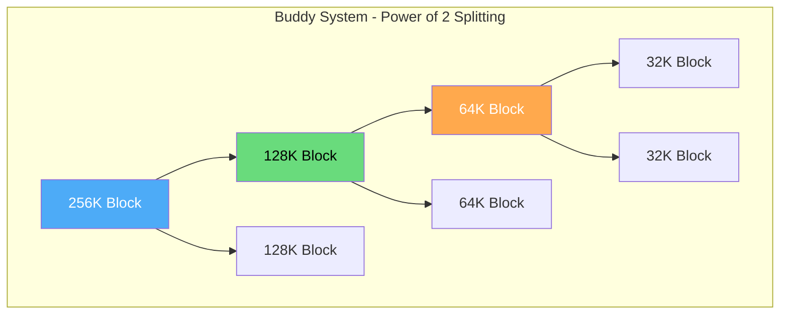
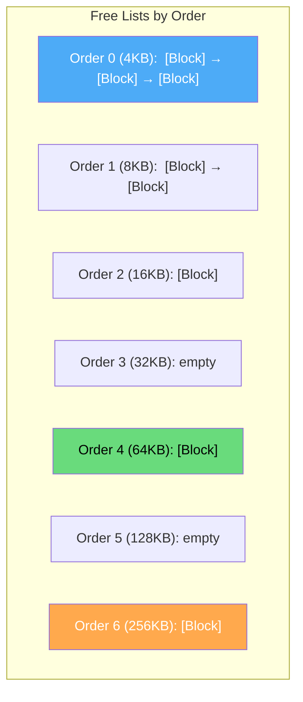
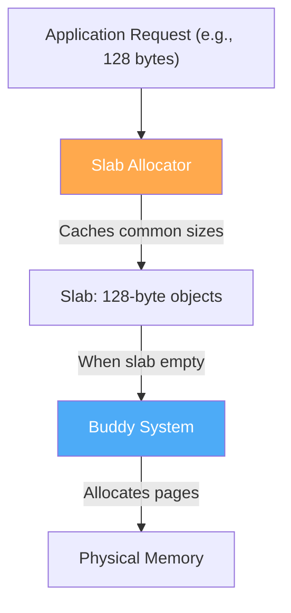

# Buddy System

The buddy system is a memory allocation algorithm that allocates memory in power-of-2 sized blocks. When a block is freed, it merges with its "buddy" (adjacent block of the same size) if the buddy is also free, creating larger blocks automatically.

## Overview



## How It Works

### Splitting

When a block of the requested size isn't available, split a larger block:

```
Request: 32K
Available: 256K block

Step 1: 256K → split into 2 × 128K (buddies)
Step 2: 128K → split into 2 × 64K (buddies)
Step 3: 64K → split into 2 × 32K (buddies)
Step 4: Allocate one 32K block

Result: [32K:USED][32K:FREE][64K:FREE][128K:FREE]
```

### Merging (Coalescing)

When a block is freed, check if its buddy is also free:

```
Free the 32K block at position 0:
  Buddy of block at [0, 32K] is block at [32K, 64K]
  Buddy is FREE → Merge into 64K block [0, 64K]
  
  Buddy of [0, 64K] is [64K, 128K]
  Buddy is FREE → Merge into 128K block [0, 128K]
  
  Buddy of [0, 128K] is [128K, 256K]
  Buddy is FREE → Merge into 256K block [0, 256K]

Result: [256K:FREE] — fully coalesced!
```

## Finding the Buddy

The buddy of a block at address `addr` with size `size`:

```python
def buddy_address(addr, size):
    """Buddy is the other half of the parent block."""
    return addr ^ size  # XOR with size

# Example: Block at 0, size 32K
# Buddy = 0 ^ 32768 = 32768 (at address 32K)

# Example: Block at 32K, size 32K
# Buddy = 32768 ^ 32768 = 0 (at address 0)

# Example: Block at 64K, size 32K
# Buddy = 65536 ^ 32768 = 98304 (at address 96K)
```

### Why XOR Works

```
Parent block: [0, 256K]
Split into buddies: [0, 128K] and [128K, 256K]

Address in binary (assuming 256K = 2^18):
  0    = 000000000000000000
  128K = 010000000000000000  (bit 17 differs)

XOR with size (128K = 2^17):
  0 ^ 128K = 128K  (toggles bit 17)
  128K ^ 128K = 0  (toggles bit 17 back)

The XOR toggles exactly the bit that distinguishes two buddies!
```

## Data Structure

```c
// Buddy system with free lists per order
#define MAX_ORDER 11  // 2^0 to 2^10 pages (4KB to 4MB)

typedef struct {
    struct list_head free_list[MAX_ORDER + 1];  // Free blocks per order
    unsigned long nr_free[MAX_ORDER + 1];       // Count per order
    unsigned long total_free;
} BuddyAllocator;

// Each free block has a list node at its start
typedef struct FreeBlock {
    struct list_head list;
} FreeBlock;
```



## Allocation Algorithm

```python
def allocate(size):
    order = ceil_log2(size / PAGE_SIZE)  # Find smallest order ≥ size
    
    # Find smallest available order
    for o in range(order, MAX_ORDER + 1):
        if free_list[o] is not empty:
            block = free_list[o].pop()
            
            # Split down to requested order
            while o > order:
                o -= 1
                buddy = block + (PAGE_SIZE << o)
                free_list[o].push(buddy)
            
            return block
    
    return None  # Out of memory
```

### Step-by-Step Example

```
Request: 16K (Order 2)
Free lists: Order 0: [], Order 1: [], Order 2: [], 
            Order 3: [], Order 4: [A@0], Order 5: [], 
            Order 6: [B@256K]

Step 1: Order 2 empty, try Order 3... empty
Step 2: Order 4 has block A@0
  Remove A@0 from Order 4

Step 3: Split A@0 (64K) into two 32K buddies:
  - Block at 0 (32K) → add to Order 3
  - Block at 32K (32K) → keep

Step 4: Split 32K into two 16K buddies:
  - Block at 0 (16K) → add to Order 2
  - Block at 16K (16K) → keep, return to caller

Result: Allocated 16K at address 16K
Free lists: Order 0: [], Order 1: [], Order 2: [0], 
            Order 3: [32K], Order 4: [], Order 5: [], 
            Order 6: [B@256K]
```

## Deallocation Algorithm

```python
def free(block, size):
    order = ceil_log2(size / PAGE_SIZE)
    
    while order < MAX_ORDER:
        buddy = block ^ (PAGE_SIZE << order)  # Find buddy
        
        # Check if buddy is free in this order
        if buddy not in free_list[order]:
            break  # Buddy not free, stop merging
        
        # Merge with buddy
        free_list[order].remove(buddy)
        block = min(block, buddy)  # Merged block is at lower address
        order += 1
    
    free_list[order].push(block)
```

### Step-by-Step Example

```
Free: 16K block at address 16K (Order 2)

Step 1: Order 2, find buddy
  Buddy = 16K ^ 16K = 0
  Check Order 2: 0 is in free list? YES

Step 2: Merge with buddy at 0
  Remove 0 from Order 2
  Merged block: 0 to 32K (Order 3)

Step 3: Order 3, find buddy
  Buddy = 0 ^ 32K = 32K
  Check Order 3: 32K is in free list? YES

Step 4: Merge with buddy at 32K
  Remove 32K from Order 3
  Merged block: 0 to 64K (Order 4)

Step 5: Order 4, find buddy
  Buddy = 0 ^ 64K = 64K
  Check Order 4: 64K is in free list? NO

Step 6: Add merged block (0, 64K) to Order 4

Result: Block coalesced back to 64K
```

## Linux Kernel Buddy System

The Linux kernel uses a buddy system for page frame allocation:

```c
// From mm/page_alloc.c (simplified)

// Allocate 'order' pages (2^order pages)
struct page *alloc_pages(gfp_t gfp_mask, unsigned int order) {
    struct page *page;
    
    // Try to find a free block of this order
    page = __alloc_pages_nodemask(gfp_mask, order, 
                                   preferred_nid, nodemask);
    
    return page;
}

// Free pages
void __free_pages(struct page *page, unsigned int order) {
    if (put_page_testzero(page))
        free_one_page(page_zone(page), page, order);
}

// The actual free function handles merging
static void free_one_page(struct zone *zone, struct page *page, 
                          int order) {
    unsigned long buddy_idx;
    struct page *buddy;
    
    // Try to merge with buddy
    while (order < MAX_ORDER) {
        buddy_idx = __find_buddy_pfn(page_to_pfn(page), order);
        buddy = page + (buddy_idx - page_to_pfn(page));
        
        if (!page_is_buddy(page, buddy, order))
            break;  // Buddy not free
        
        // Merge!
        list_del(&buddy->lru);
        zone->free_area[order].nr_free--;
        combined_idx = buddy_idx & page_to_pfn(page);
        page = page + (combined_idx - page_to_pfn(page));
        order++;
    }
    
    // Add merged block to free list
    list_add(&page->lru, &zone->free_area[order].free_list[mt]);
    zone->free_area[order].nr_free++;
}
```

```bash
# View buddy system state
$ cat /proc/buddyinfo
Node 0, zone      DMA      1      0      0      1      1      1      0      0      1      1      3
Node 0, zone    DMA32      8      5      2      3      2      2      1      0      0      1    146
Node 0, zone   Normal    142     65     32     15      8      4      2      1      0      0    512

# Columns: Order 0 (4KB), 1 (8KB), 2 (16KB), ..., 10 (4MB)

# Detailed per-zone info
$ cat /proc/zoneinfo | head -30
Node 0, zone      DMA
  pages free     3976
        managed  3834
        boost    0
  min      3
  low      3
  high     4
  spanned  4095
  present  3976

# Watch fragmentation in real-time
$ watch -n 1 cat /proc/buddyinfo

# Memory fragmentation index
$ cat /proc/pagetypeinfo | head -20
```

## Fragmentation Problem

The buddy system has **internal fragmentation** because blocks are always rounded up to the next power of 2:

```
Request: 5K → Allocates 8K (Order 1) → 3K wasted (37.5%)
Request: 33K → Allocates 64K (Order 4) → 31K wasted (48.4%)
Request: 129K → Allocates 256K (Order 6) → 127K wasted (49.6%)

Average internal fragmentation: ~25-33%
```

### Mitigation: Slab Allocator on Top

The Linux kernel uses a **slab allocator** on top of the buddy system to reduce internal fragmentation for small allocations:



## C Implementation: Complete Buddy System

```c
#include <stdio.h>
#include <stdlib.h>
#include <string.h>
#include <math.h>

#define PAGE_SIZE 4096
#define MAX_ORDER 10  // 2^10 = 1024 pages = 4MB
#define MEMORY_SIZE (PAGE_SIZE * (1 << MAX_ORDER))

typedef struct FreeBlock {
    struct FreeBlock *next;
} FreeBlock;

typedef struct {
    FreeBlock *free_list[MAX_ORDER + 1];
    unsigned long nr_free[MAX_ORDER + 1];
    char *memory;
    unsigned long total_allocated;
    unsigned long total_freed;
} BuddySystem;

void init_buddy(BuddySystem *bs) {
    bs->memory = (char*)malloc(MEMORY_SIZE);
    memset(bs->memory, 0, MEMORY_SIZE);
    
    for (int i = 0; i <= MAX_ORDER; i++) {
        bs->free_list[i] = NULL;
        bs->nr_free[i] = 0;
    }
    
    // Add entire memory as one big free block
    FreeBlock *block = (FreeBlock*)bs->memory;
    block->next = NULL;
    bs->free_list[MAX_ORDER] = block;
    bs->nr_free[MAX_ORDER] = 1;
    
    bs->total_allocated = 0;
    bs->total_freed = 0;
}

int ceil_order(size_t size) {
    size_t pages = (size + PAGE_SIZE - 1) / PAGE_SIZE;
    int order = 0;
    while ((1UL << order) < pages)
        order++;
    return order;
}

void *buddy_alloc(BuddySystem *bs, size_t size) {
    if (size == 0) return NULL;
    
    int order = ceil_order(size);
    if (order > MAX_ORDER) return NULL;
    
    // Find smallest available order
    int found_order = -1;
    for (int o = order; o <= MAX_ORDER; o++) {
        if (bs->free_list[o] != NULL) {
            found_order = o;
            break;
        }
    }
    
    if (found_order < 0) return NULL;  // Out of memory
    
    // Remove block from free list
    FreeBlock *block = bs->free_list[found_order];
    bs->free_list[found_order] = block->next;
    bs->nr_free[found_order]--;
    
    // Split down to requested order
    while (found_order > order) {
        found_order--;
        size_t block_size = PAGE_SIZE * (1 << found_order);
        char *addr = (char*)block + block_size;
        FreeBlock *buddy = (FreeBlock*)addr;
        buddy->next = bs->free_list[found_order];
        bs->free_list[found_order] = buddy;
        bs->nr_free[found_order]++;
    }
    
    bs->total_allocated += PAGE_SIZE * (1 << order);
    return (void*)block;
}

void buddy_free(BuddySystem *bs, void *ptr, size_t size) {
    if (!ptr) return;
    
    int order = ceil_order(size);
    char *block_addr = (char*)ptr;
    
    // Try to merge with buddy
    while (order < MAX_ORDER) {
        size_t block_size = PAGE_SIZE * (1 << order);
        size_t offset = block_addr - bs->memory;
        size_t buddy_offset = offset ^ block_size;
        char *buddy_addr = bs->memory + buddy_offset;
        
        // Check if buddy is in free list
        FreeBlock **pp = &bs->free_list[order];
        FreeBlock *buddy = NULL;
        FreeBlock **buddy_pp = NULL;
        
        while (*pp) {
            if ((char*)*pp == buddy_addr) {
                buddy = *pp;
                buddy_pp = pp;
                break;
            }
            pp = &(*pp)->next;
        }
        
        if (!buddy) break;  // Buddy not free
        
        // Remove buddy from free list
        *buddy_pp = buddy->next;
        bs->nr_free[order]--;
        
        // Merge: take lower address
        block_addr = (block_addr < buddy_addr) ? block_addr : buddy_addr;
        order++;
    }
    
    // Add merged block to free list
    FreeBlock *block = (FreeBlock*)block_addr;
    block->next = bs->free_list[order];
    bs->free_list[order] = block;
    bs->nr_free[order]++;
    
    bs->total_freed += PAGE_SIZE * (1 << order);
}

void print_buddy(BuddySystem *bs) {
    printf("\n=== Buddy System State ===\n");
    for (int o = 0; o <= MAX_ORDER; o++) {
        if (bs->nr_free[o] > 0) {
            printf("Order %2d (%6lu KB): %lu blocks\n",
                   o, (PAGE_SIZE * (1UL << o)) / 1024, bs->nr_free[o]);
        }
    }
    printf("Total allocated: %lu KB\n", bs->total_allocated / 1024);
    printf("Total freed: %lu KB\n", bs->total_freed / 1024);
}

int main() {
    BuddySystem bs;
    init_buddy(&bs);
    
    print_buddy(&bs);
    
    void *a = buddy_alloc(&bs, 4096);    // 1 page (Order 0)
    void *b = buddy_alloc(&bs, 8192);    // 2 pages (Order 1)
    void *c = buddy_alloc(&bs, 16384);   // 4 pages (Order 2)
    void *d = buddy_alloc(&bs, 65536);   // 16 pages (Order 4)
    
    print_buddy(&bs);
    
    buddy_free(&bs, b, 8192);
    buddy_free(&bs, c, 16384);
    
    print_buddy(&bs);
    
    // These should merge into Order 3
    buddy_free(&bs, a, 4096);
    
    print_buddy(&bs);
    
    free(bs.memory);
    return 0;
}
```

## Interview Questions

### Beginner

**Q1: What is the buddy system?**
A: A memory allocation algorithm that always allocates blocks in powers of 2. When a block is freed, it checks if its "buddy" (adjacent block of the same size) is also free, and merges them into a larger block. This automatic coalescing reduces external fragmentation.

**Q2: How do you find the buddy of a block?**
A: XOR the block's address with its size. If block A is at address 0 with size 32K, its buddy is at 0 XOR 32K = 32K. If block B is at 32K, its buddy is 32K XOR 32K = 0.

**Q3: What is the main disadvantage of the buddy system?**
A: Internal fragmentation. Since blocks must be powers of 2, a request for 5K allocates 8K (37.5% waste), and a request for 33K allocates 64K (48.4% waste).

### Intermediate

**Q4: How does the Linux kernel use the buddy system?**
A: The kernel uses it for page frame allocation (`alloc_pages`, `__free_pages`). Each order (0-10) has a free list. When order 0 (4KB) is needed but only higher orders are available, the kernel splits. When pages are freed, the kernel tries to merge with the buddy. The slab allocator sits on top to handle sub-page allocations efficiently.

**Q5: What is the buddy system's time complexity?**
A: Allocation: O(MAX_ORDER) for finding the right order and splitting. Deallocation: O(MAX_ORDER) for merging with buddies. Both are effectively O(1) since MAX_ORDER is typically 10-11.

**Q6: How does the buddy system handle NUMA?**
A: Each NUMA node has its own buddy allocator. The kernel first tries the local node's buddy system. If that fails, it falls back to other nodes. This ensures local allocation when possible.

### Advanced / FAANG-Level

**Q7: Design a modified buddy system that reduces internal fragmentation below 25%.**
A: Use a **Fibonacci buddy system** instead of power-of-2. Block sizes follow Fibonacci sequence: 1, 2, 3, 5, 8, 13, 21, 34, ... This gives ratios closer to 1.618 instead of 2, reducing worst-case waste from ~50% to ~38%. Trade-off: more complex merging rules and more free lists. Alternatively, use the **weighted buddy system** with sizes 2^k and 3×2^k, achieving ~25% worst-case waste.

**Q8: The buddy system shows heavy fragmentation. A 4MB allocation fails despite 4MB total free memory. Diagnose and fix.**
A: 
1. **Diagnose**: `cat /proc/buddyinfo` — if Order 10 (4MB) shows 0 but lower orders have many blocks, it's fragmentation.
2. **Cause**: Frequent alloc/free of different sizes prevents full coalescing. Memory is scattered in small blocks.
3. **Immediate fix**: `echo 1 > /proc/sys/vm/compact_memory` — triggers memory compaction to create contiguous regions.
4. **Prevention**: 
   - Use huge pages (pre-reserved, avoid fragmentation)
   - Set `vm.extfrag_threshold` to control compaction aggressiveness
   - Pin critical allocations early (before fragmentation occurs)
5. **Monitoring**: Watch `/proc/buddyinfo` over time. If Order 10 trends to 0, investigate allocation patterns.

**Q9: Compare the buddy system with a slab allocator for kernel memory management. Why use both?**
A: 
- **Buddy system**: Good for page-level (4KB+) allocation. Handles physical memory, coalescing, and NUMA. Bad for small allocations (high internal fragmentation for 128-byte objects).
- **Slab allocator**: Good for kernel objects (task_struct, inode, dentry). Pre-allocates pools of same-size objects. Minimal internal fragmentation. Bad for variable or large allocations.
- **Why both**: Slab allocator requests pages from buddy system, then manages those pages as object caches. Buddy handles the "big picture" (page allocation), slab handles "small picture" (object allocation). This layered approach is efficient at both scales.
- **Linux**: SLAB → SLUB (simplified slab) + buddy system underneath.

## Common Mistakes

1. **Forgetting about internal fragmentation** — Buddy wastes up to 50% per allocation
2. **Not considering coalescing** — Without merging, buddy degrades to simple power-of-2 allocation
3. **Confusing buddy with slab** — Buddy is for pages, slab is for objects
4. **Ignoring NUMA** — Each NUMA node needs its own buddy system
5. **Assuming buddy is optimal** — It's a practical compromise, not theoretically optimal

## Summary

| Aspect | Details |
|--------|---------|
| **Block Sizes** | Powers of 2 (4KB, 8KB, 16KB, ...) |
| **Buddy Finding** | XOR address with size |
| **Splitting** | Divide block into two equal buddies |
| **Merging** | Combine free buddies automatically |
| **Internal Frag** | Up to 50% per allocation |
| **External Frag** | Low (automatic coalescing) |
| **Time Complexity** | O(MAX_ORDER) ≈ O(1) |
| **Used In** | Linux kernel page allocator |

## Cross-References

- **Prerequisite**: [Allocation Algorithms](./allocation-algorithms.md) — general allocation strategies
- **Related**: [Slab Allocator](./slab-allocator.md) — sits on top of buddy system
- **Related**: [Paging](./paging.md) — buddy allocates page frames
- **Related**: [Huge Pages](./huge-pages.md) — buddy handles large contiguous blocks
- **Related**: [NUMA](./numa.md) — per-node buddy systems
