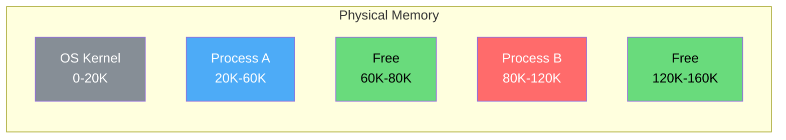
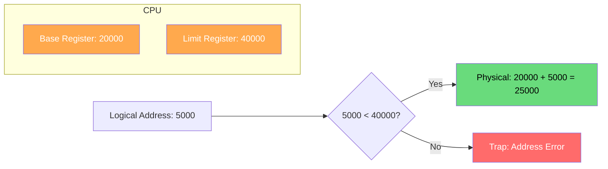
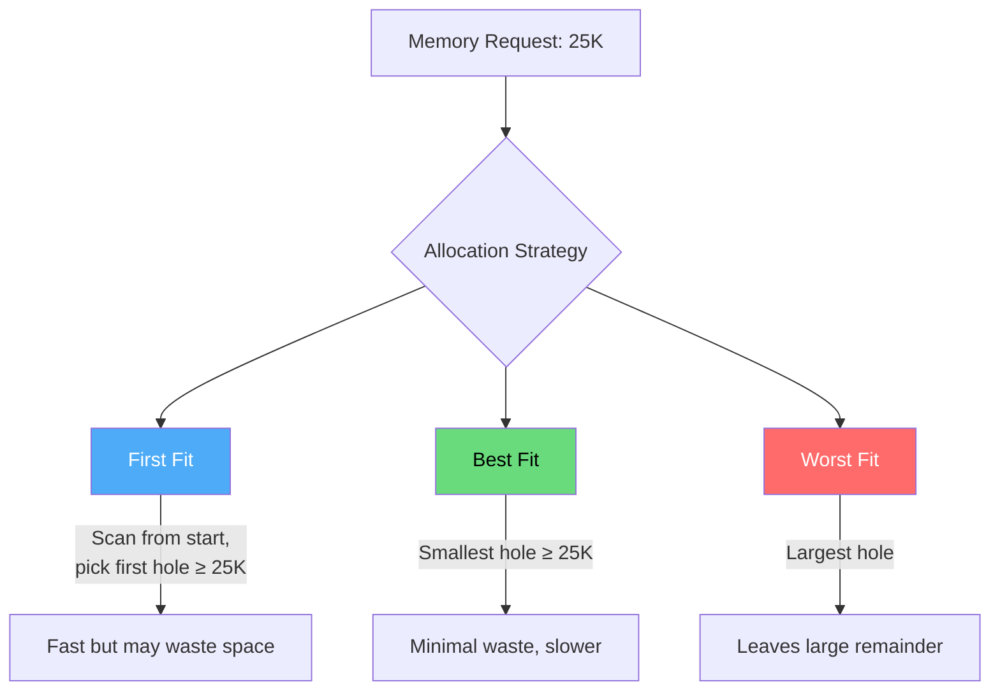

# Contiguous Memory Allocation

Contiguous memory allocation is the simplest memory management technique where each process is allocated a single contiguous block of memory. It was the dominant approach in early operating systems and remains foundational for understanding more advanced schemes.

## Overview

In contiguous allocation, a process of size *n* bytes gets *n* consecutive physical addresses. The OS maintains a list of allocated and free partitions, and assigns memory from available holes.



## Memory Protection

Contiguous allocation uses **base and limit registers** to protect memory:



Every memory access is checked: `if (logical_address >= limit) → trap to OS`

## Fixed vs Variable Partitioning

### Fixed Partitioning

Memory is divided into fixed-size partitions at boot time.

```
┌──────────────┐ 0K
│   OS (16K)   │
├──────────────┤ 16K
│ Partition 1  │ (32K)
│  Process A   │
├──────────────┤ 48K
│ Partition 2  │ (32K)
│    Empty     │
├──────────────┤ 80K
│ Partition 3  │ (32K)
│  Process B   │
├──────────────┤ 112K
│ Partition 4  │ (32K)
│    Empty     │
└──────────────┘ 144K
```

**Problems:**
- **Internal fragmentation**: Process of 10K in 32K partition wastes 22K
- **Limit on process size**: Nothing bigger than the largest partition
- **Degree of multiprogramming** limited by partition count

### Variable Partitioning

Partitions are created dynamically to match process sizes.

```
Time T1:                    Time T2 (after B finishes):
┌──────────────┐            ┌──────────────┐
│   OS (16K)   │            │   OS (16K)   │
├──────────────┤            ├──────────────┤
│ Process A    │ 24K        │ Process A    │ 24K
├──────────────┤ 40K        ├──────────────┤ 40K
│ Process B    │ 20K        │   Free (20K) │ ← Hole!
├──────────────┤ 60K        ├──────────────┤ 60K
│ Process C    │ 30K        │ Process C    │ 30K
├──────────────┤ 90K        ├──────────────┤ 90K
│   Free (54K) │            │   Free (54K) │
└──────────────┘ 144K       └──────────────┘ 144K
```

## Fragmentation Problem

### External Fragmentation

Even when enough total memory exists, it's scattered in non-contiguous holes.

```
Total Free: 74K (20K + 54K)
Process D needs: 60K
Result: CAN'T ALLOCATE (no single hole ≥ 60K)

┌────────┬────────┬────────┬────────┬────────┐
│  A(24) │Free(20)│  C(30) │Free(54)│        │
└────────┴────────┴────────┴────────┴────────┘
         ↑                  ↑
     Hole 1 (20K)      Hole 2 (54K)
     Too small!         Too small!
```

**Solution — Compaction**: Move processes to consolidate holes.

```
Before Compaction:          After Compaction:
┌────┬──────┬────┬──────┐  ┌────┬────┬──────┬──────┐
│ A  │ Free │ C  │ Free │  │ A  │ C  │Free  │      │
│24K │ 20K  │30K │ 54K  │  │24K │30K │ 74K  │      │
└────┴──────┴────┴──────┘  └────┴────┴──────┴──────┘
```

**Cost**: Compaction is expensive — requires copying all memory and updating all addresses.

### Internal Fragmentation

Allocated block is larger than needed; wasted space inside the partition.

```
Process needs: 11K
Partition size: 16K (fixed)
Wasted: 5K internal fragmentation

┌────────────────────┐
│ Process Data (11K) │
├────────────────────┤
│   Wasted (5K)      │  ← Internal Fragmentation
└────────────────────┘
```

## Allocation Algorithms

When variable partitions are used, the OS must choose which hole to allocate:



**Example:**

Free holes: 30K, 12K, 50K, 18K — Request: 15K

| Algorithm | Chooses | Remaining | Rationale |
|-----------|---------|-----------|-----------|
| First Fit | 30K | 15K | First hole ≥ 15K |
| Best Fit | 18K | 3K | Smallest hole ≥ 15K |
| Worst Fit | 50K | 35K | Largest hole |

## Real-World Linux Example

Early Linux (pre-2.0) used simple contiguous allocation for kernel memory:

```bash
# View current memory layout
$ cat /proc/meminfo | head -10
MemTotal:       16384000 kB
MemFree:         2048000 kB
MemAvailable:    8192000 kB

# See memory zones (contiguous regions)
$ cat /proc/zoneinfo | head -30
Node 0, zone      DMA
  pages free     3976
        managed  3834

# Physical memory map
$ sudo dmidecode -t memory | grep -i size
	Size: 8192 MB
	Size: 8192 MB
```

Modern Linux uses paging primarily, but contiguous allocation is still relevant for:
- **DMA buffers** (devices need contiguous physical memory)
- **Kernel boot-time allocations** (`memblock` allocator)
- **Embedded systems** with memory constraints

```bash
# Allocate contiguous memory (kernel module example)
#include <linux/vmalloc.h>
#include <linux/slab.h>

// For small allocations (usually < 128KB, may be contiguous)
char *buf = kmalloc(4096, GFP_KERNEL);

// For large allocations (virtually contiguous, physically may not be)
char *big_buf = vmalloc(1024 * 1024);

// Guaranteed contiguous (use sparingly!)
#include <linux/dma-mapping.h>
void *dma_buf = dma_alloc_coherent(dev, size, &dma_handle, GFP_KERNEL);
```

## C Implementation: Memory Allocation Simulator

```c
#include <stdio.h>
#include <stdlib.h>
#include <string.h>

#define MEMORY_SIZE 1024
#define MAX_PARTITIONS 16

typedef struct {
    int start;
    int size;
    int process_id;  // -1 = free
    char name[32];
} Partition;

typedef struct {
    Partition partitions[MAX_PARTITIONS];
    int count;
} MemoryManager;

void init_memory(MemoryManager *mm) {
    mm->count = 1;
    mm->partitions[0] = (Partition){0, MEMORY_SIZE, -1, "Free"};
}

int allocate_first_fit(MemoryManager *mm, int size, int pid, const char *name) {
    for (int i = 0; i < mm->count; i++) {
        if (mm->partitions[i].process_id == -1 && 
            mm->partitions[i].size >= size) {
            
            int remaining = mm->partitions[i].size - size;
            if (remaining > 0) {
                // Shift partitions to make room for split
                for (int j = mm->count; j > i + 1; j--)
                    mm->partitions[j] = mm->partitions[j - 1];
                mm->partitions[i + 1] = (Partition){
                    mm->partitions[i].start + size, remaining, -1, "Free"
                };
                mm->count++;
            }
            
            mm->partitions[i].size = size;
            mm->partitions[i].process_id = pid;
            strncpy(mm->partitions[i].name, name, 31);
            return mm->partitions[i].start;
        }
    }
    return -1; // No suitable hole
}

void deallocate(MemoryManager *mm, int pid) {
    for (int i = 0; i < mm->count; i++) {
        if (mm->partitions[i].process_id == pid) {
            mm->partitions[i].process_id = -1;
            strcpy(mm->partitions[i].name, "Free");
            
            // Merge with next free partition
            if (i + 1 < mm->count && mm->partitions[i + 1].process_id == -1) {
                mm->partitions[i].size += mm->partitions[i + 1].size;
                for (int j = i + 1; j < mm->count - 1; j++)
                    mm->partitions[j] = mm->partitions[j + 1];
                mm->count--;
            }
            // Merge with previous free partition
            if (i > 0 && mm->partitions[i - 1].process_id == -1) {
                mm->partitions[i - 1].size += mm->partitions[i].size;
                for (int j = i; j < mm->count - 1; j++)
                    mm->partitions[j] = mm->partitions[j + 1];
                mm->count--;
            }
            return;
        }
    }
}

void print_memory(MemoryManager *mm) {
    printf("\n=== Memory Map ===\n");
    for (int i = 0; i < mm->count; i++) {
        printf("[%4d - %4d] %3dK  %s (PID:%d)\n",
               mm->partitions[i].start,
               mm->partitions[i].start + mm->partitions[i].size - 1,
               mm->partitions[i].size,
               mm->partitions[i].name,
               mm->partitions[i].process_id);
    }
}

int main() {
    MemoryManager mm;
    init_memory(&mm);
    
    allocate_first_fit(&mm, 200, 1, "Process-A");
    allocate_first_fit(&mm, 150, 2, "Process-B");
    allocate_first_fit(&mm, 300, 3, "Process-C");
    print_memory(&mm);
    
    deallocate(&mm, 2);  // Free Process-B
    print_memory(&mm);
    
    allocate_first_fit(&mm, 100, 4, "Process-D");
    print_memory(&mm);
    
    return 0;
}
```

## Interview Questions

### Beginner

**Q1: What is contiguous memory allocation?**
A: A scheme where each process gets a single continuous block of physical memory. All addresses from base to base+size are available to the process without gaps.

**Q2: What is the difference between internal and external fragmentation?**
A: 
- **Internal**: Wasted space *inside* an allocated block (process gets more than it needs)
- **External**: Wasted space *between* allocated blocks (enough total free memory, but not contiguous)

**Q3: Why is compaction expensive?**
A: It requires copying all data from allocated partitions to new locations, updating all address references, and doing so while possibly suspending all processes. On a system with GB of RAM, this can take significant time.

### Intermediate

**Q4: Compare first-fit, best-fit, and worst-fit. Which is generally best?**
A: 
- **First-fit**: Fastest (stops at first match), but may create small unusable holes
- **Best-fit**: Minimizes wasted space but creates tiny fragments; requires full search
- **Worst-fit**: Leaves largest remainder (potentially usable), but degrades large blocks
- Research shows **first-fit** is generally comparable to best-fit in practice and faster

**Q5: How does the OS use base and limit registers for protection?**
A: The MMU adds the base register to every logical address. The limit register defines the maximum valid offset. If `logical_address >= limit`, a trap occurs. This prevents processes from accessing memory outside their partition.

**Q6: When is contiguous allocation still used in modern systems?**
A: DMA buffers for I/O devices (hardware requires contiguous physical addresses), kernel boot-time allocations (memblock), some embedded real-time systems, and as a building block within page frames.

### Advanced / FAANG-Level

**Q7: Design a memory allocator that minimizes both internal and external fragmentation for a real-time system.**
A: Key elements:
- Use segregated free lists (different size classes) for fast lookup
- Power-of-2 size classes (like buddy system) to bound internal fragmentation
- Maintain per-size-class free lists to minimize search time
- Pre-allocate pools for common sizes (slab-like)
- For real-time: guarantee O(1) allocation/deallocation
- Track fragmentation ratio; trigger compaction during idle periods
- Use memory pools for fixed-size objects to eliminate fragmentation entirely

**Q8: A system has physical memory: [OS: 20K][A: 30K][Free: 15K][B: 25K][Free: 50K][C: 20K][Free: 40K]. Process D (35K) arrives. Show allocation with each algorithm and discuss long-term effects.**
A: 
- **First-fit**: Allocates from 50K hole → remaining 15K. Good immediate choice.
- **Best-fit**: Allocates from 40K hole → remaining 5K. Best immediate utilization.
- **Worst-fit**: Allocates from 50K hole → remaining 15K. Same as first-fit here.
- Long-term: best-fit creates tiny 5K fragment; first-fit leaves 15K which is more usable. Over time, best-fit tends to create many small unusable holes (called "Swiss cheese"), while first-fit tends to create fewer, larger holes at the beginning of memory.

**Q9: How would you implement compaction without pausing all processes?**
A: 
- Use **paging support**: copy pages to free frames while processes run, update page tables atomically
- **Incremental compaction**: compact one process at a time during context switches
- **Hardware support**: some architectures support address remapping registers that can be updated atomically
- **Copy-on-write approach**: mark old pages COW, redirect to new locations, copy on next access
- Modern approach: avoid compaction entirely by using paging

## Common Mistakes

1. **Confusing internal/external fragmentation** — Internal = inside allocated block, external = between blocks
2. **Assuming compaction is free** — It has significant CPU and I/O cost
3. **Forgetting protection** — Contiguous allocation without base/limit = security hole
4. **Ignoring hardware requirements** — Some devices need physically contiguous DMA buffers
5. **Thinking contiguous allocation is obsolete** — It's still used for boot memory, DMA, and embedded systems

## Summary

| Aspect | Details |
|--------|---------|
| **Mechanism** | Single contiguous block per process |
| **Protection** | Base + limit registers |
| **Main Problem** | External fragmentation |
| **Solutions** | Compaction, paging (better) |
| **Still Used For** | DMA, boot-time, embedded systems |
| **Allocation Algorithms** | First-fit, best-fit, worst-fit |

## Cross-References

- **Next**: [Paging](./paging.md) — the solution to external fragmentation
- **See Also**: [Allocation Algorithms](./allocation-algorithms.md) — detailed comparison of fit strategies
- **Related**: [Buddy System](./buddy-system.md) — power-of-2 contiguous allocator
- **Virtual Memory**: [Demand Paging](../virtual-memory/demand-paging.md) — modern replacement for contiguous allocation


## Cross References

- [Allocation Algorithms](allocation-algorithms.md)
- [Segmentation](segmentation.md)
- [Disk Allocation](../filesystems/disk-allocation.md)
