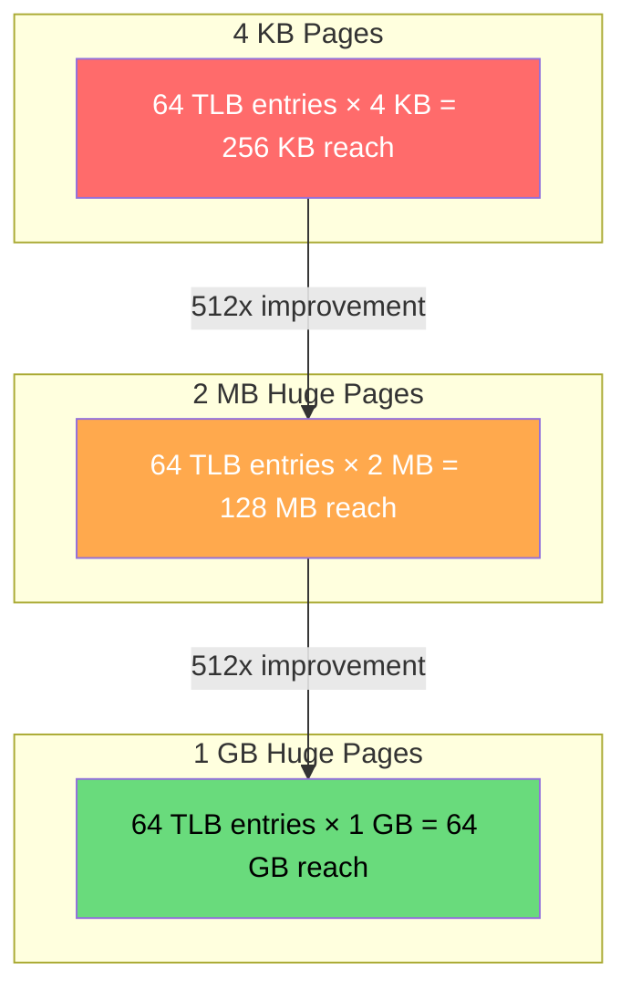
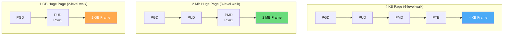

# Huge Pages

Huge pages are memory pages larger than the standard 4 KB size. On x86-64, they come in 2 MB and 1 GB sizes. They dramatically reduce TLB misses and page table overhead for workloads with large memory footprints.

## The Problem: TLB Reach with 4KB Pages

```
Standard 4KB pages:
  L1 dTLB: 64 entries × 4 KB = 256 KB reach
  L2 STLB: 1536 entries × 4 KB = 6 MB reach

A database using 100 GB of data:
  Working set: 100 GB
  TLB reach: 6 MB (L2)
  → 99.99% of memory is NOT covered by TLB!
  → Massive TLB miss rate → slow memory access
```

## Huge Page Sizes



| Page Size | TLB Entries (typical) | TLB Reach | Page Table Levels |
|-----------|----------------------|-----------|-------------------|
| 4 KB | 64 (L1 dTLB) | 256 KB | 4 levels |
| 2 MB | 32 (L1 dTLB) | 64 MB | 3 levels |
| 1 GB | 4 (L1 dTLB) | 4 GB | 2 levels |

## How Huge Pages Work

Huge pages skip the lowest level(s) of the page table by setting the **PS (Page Size)** bit at a higher level:



### x86-64 Page Table with Huge Pages

```
PMD Entry (for 2 MB page):
┌──────────────────────────────────┬────────────────────────────┐
│ Physical Frame Address (bits     │ Flags                      │
│ 51-21 for 2MB alignment)        │ [PS=1] [P] [R/W] [U/S]... │
└──────────────────────────────────┴────────────────────────────┘
  PS (Page Size) bit = 1 → This entry maps 2 MB directly
  No PTE level needed!

PUD Entry (for 1 GB page):
┌──────────────────────────────────┬────────────────────────────┐
│ Physical Frame Address (bits     │ Flags                      │
│ 51-30 for 1GB alignment)        │ [PS=1] [P] [R/W] [U/S]... │
└──────────────────────────────────┴────────────────────────────┘
  PS bit = 1 → This entry maps 1 GB directly
  No PMD or PTE levels needed!
```

## Using Huge Pages in Linux

### Method 1: hugetlbfs (Explicit Huge Pages)

```bash
# Check huge page support
$ cat /proc/meminfo | grep -i huge
HugePages_Total:       0
HugePages_Free:        0
HugePages_Rsvd:        0
HugePages_Surp:        0
Hugepagesize:       2048 kB

# Reserve huge pages at runtime
$ echo 1024 | sudo tee /proc/sys/vm/nr_hugepages
1024

# Verify
$ cat /proc/meminfo | grep -i huge
HugePages_Total:    1024
HugePages_Free:     1024
Hugepagesize:       2048 kB

# Reserve at boot time (GRUB)
# Add to /etc/default/grub:
# GRUB_CMDLINE_LINUX="hugepages=1024"
# Then: sudo update-grub && reboot

# Mount hugetlbfs
$ sudo mount -t hugetlbfs none /dev/hugepages

# Use in C program
$ cat hugepage_example.c
#include <sys/mman.h>
#include <stdio.h>
#include <string.h>

#define HUGEPAGE_SIZE (2 * 1024 * 1024)  // 2 MB

int main() {
    void *ptr = mmap(NULL, HUGEPAGE_SIZE,
                     PROT_READ | PROT_WRITE,
                     MAP_PRIVATE | MAP_ANONYMOUS | MAP_HUGETLB,
                     -1, 0);
    
    if (ptr == MAP_FAILED) {
        perror("mmap");
        return 1;
    }
    
    // Touch the memory to allocate it
    memset(ptr, 0, HUGEPAGE_SIZE);
    
    printf("Huge page allocated at %p\n", ptr);
    printf("Press enter to free...\n");
    getchar();
    
    munmap(ptr, HUGEPAGE_SIZE);
    return 0;
}

$ gcc hugepage_example.c -o hugepage_example
$ sudo ./hugepage_example
```

### Method 2: Transparent Huge Pages (THP)

```bash
# Check THP status
$ cat /sys/kernel/mm/transparent_hugepage/enabled
[always] madvise never

# THP modes:
# always: Automatically use huge pages for all allocations
# madvise: Only use when application calls madvise(MADV_HUGEPAGE)
# never: Disable THP

# Set THP mode
$ echo madvise | sudo tee /sys/kernel/mm/transparent_hugepage/enabled

# Enable THP for a specific memory region
#include <sys/mman.h>
void *ptr = malloc(2 * 1024 * 1024);
madvise(ptr, 2 * 1024 * 1024, MADV_HUGEPAGE);

# Monitor THP usage
$ grep -i thp /proc/vmstat
thp_fault_alloc 12345
thp_fault_fallback 67
thp_collapse_alloc 890
thp_split_page 12

# Per-process THP stats
$ grep -i "thp\|huge" /proc/<pid>/smaps | head -10
AnonHugePages:      4096 kB
ShmemPmdMapped:        0 kB
FileHugePages:         0 kB
```

### Method 3: 1 GB Huge Pages

```bash
# Reserve 1GB huge pages (must be at boot)
# Add to GRUB: hugepagesz=1G hugepages=4
$ cat /proc/meminfo | grep -i "Giga\|HugePage"
Hugepagesize:     262144 kB  # 256 MB? No, this is 1GB page count...

# Actually, check:
$ ls /sys/kernel/mm/hugepages/
hugepages-2048kB  hugepages-1048576kB

$ cat /sys/kernel/mm/hugepages/hugepages-1048576kB/nr_hugepages
4

# Use in C with mmap
#define GB (1ULL << 30)
void *ptr = mmap(NULL, GB, PROT_READ | PROT_WRITE,
                 MAP_PRIVATE | MAP_ANONYMOUS | MAP_HUGETLB |
                 (30 << MAP_HUGE_SHIFT),  // 1 GB = 2^30
                 -1, 0);
```

## Performance Impact

### Benchmark: Random Memory Access

```bash
# Benchmark with 4KB pages vs huge pages
$ cat benchmark.c
#include <stdio.h>
#include <stdlib.h>
#include <string.h>
#include <time.h>
#include <sys/mman.h>

#define SIZE (512UL * 1024 * 1024)  // 512 MB
#define NUM_ACCESSES 10000000

void benchmark(char *mem, const char *label) {
    // Random accesses
    srand(42);
    clock_t start = clock();
    volatile char sum = 0;
    for (int i = 0; i < NUM_ACCESSES; i++) {
        size_t idx = ((size_t)rand() << 32 | rand()) % SIZE;
        sum += mem[idx];
    }
    clock_t end = clock();
    double elapsed = (double)(end - start) / CLOCKS_PER_SEC;
    printf("%s: %.3f seconds\n", label, elapsed);
}

int main() {
    // Normal pages
    char *normal = mmap(NULL, SIZE, PROT_READ | PROT_WRITE,
                        MAP_PRIVATE | MAP_ANONYMOUS, -1, 0);
    memset(normal, 1, SIZE);
    benchmark(normal, "4KB pages   ");
    munmap(normal, SIZE);
    
    // Huge pages
    char *huge = mmap(NULL, SIZE, PROT_READ | PROT_WRITE,
                      MAP_PRIVATE | MAP_ANONYMOUS | MAP_HUGETLB, -1, 0);
    if (huge != MAP_FAILED) {
        memset(huge, 1, SIZE);
        benchmark(huge, "2MB pages   ");
        munmap(huge, SIZE);
    }
    
    return 0;
}

$ gcc -O2 benchmark.c -o benchmark
$ sudo ./benchmark
4KB pages   : 2.341 seconds
2MB pages   : 0.892 seconds   # ~2.6x faster!
```

### Real-World Performance Gains

| Workload | Improvement with Huge Pages |
|----------|---------------------------|
| Database (PostgreSQL, MySQL) | 10-30% throughput increase |
| JVM (Java) | 5-15% GC pause reduction |
| Redis | 15-25% latency reduction |
| DPDK (networking) | 20-40% packet processing |
| Scientific computing (HPC) | 10-50% for memory-intensive |

## Fragmentation and Huge Pages

The challenge: huge pages require **physically contiguous** memory. After the system runs for a while, memory becomes fragmented.

```bash
# Check huge page availability
$ cat /sys/kernel/mm/hugepages/hugepages-2048kB/free_hugepages
512

# Check fragmentation (how many contiguous blocks are available)
$ cat /proc/buddyinfo | head -5
Node 0, zone      DMA      1      0      0      1      1      1      0      0      1      1      3
Node 0, zone    DMA32      8      5      2      3      2      2      1      0      0      1    146
Node 0, zone   Normal    142     65     32     15      8      4      2      1      0      0    512

# Column 10 (index 9) = 2^9 = 512 pages = 2 MB contiguous blocks
# Column 11 (index 10) = 2^10 = 1024 pages = 4 MB contiguous blocks

# Defragment memory for huge pages
$ echo always | sudo tee /sys/kernel/mm/transparent_hugepage/defrag
$ echo 1 | sudo tee /proc/sys/vm/compact_memory
```

## Compaction for Huge Pages

The kernel runs a compaction daemon to create contiguous regions:

```mermaid
graph LR
    subgraph "Before Compaction"
        A1["Used"] A2["Free"] A3["Used"] A4["Free"]
        A5["Used"] A6["Free"] A7["Used"] A8["Free"]
    end
    
    subgraph "After Compaction"
        B1["Used"] B2["Used"] B3["Used"] B4["Used"]
        B5["Free"] B6["Free"] B7["Free"] B8["Free"]
    end
    
    A1 --> B1
    A3 --> B2
    A5 --> B3
    A7 --> B4
    A2 --> B5
    A4 --> B6
    A6 --> B7
    A8 --> B8
    
    style A2 fill:#69db7c,color:#000
    style A4 fill:#69db7c,color:#000
    style A6 fill:#69db7c,color:#000
    style A8 fill:#69db7c,color:#000
    style B5 fill:#69db7c,color:#000
    style B6 fill:#69db7c,color:#000
    style B7 fill:#69db7c,color:#000
    style B8 fill:#69db7c,color:#000
```

```bash
# Monitor compaction activity
$ grep compact /proc/vmstat
compact_stall 1234        # Direct compaction events
compact_success 1200
compact_fail 34
compact_migrate_scanned 567890
compact_free_scanned 123456

# Trigger manual compaction
$ echo 1 | sudo tee /proc/sys/vm/compact_memory
```

## Huge Pages and Databases

### PostgreSQL with Huge Pages

```bash
# Check if PostgreSQL can use huge pages
$ sudo -u postgres psql -c "SHOW shared_buffers;"
 shared_buffers
----------------
 8GB

# Check huge pages availability for 8 GB
$ cat /proc/meminfo | grep HugePages_Free
HugePages_Free:     4096  # 4096 × 2 MB = 8 GB ✓

# Enable huge pages in PostgreSQL
# /etc/postgresql/14/main/postgresql.conf
# huge_pages = try  # or 'on' for mandatory

# Restart PostgreSQL
$ sudo systemctl restart postgresql

# Verify in PostgreSQL logs
$ grep -i huge /var/log/postgresql/postgresql-14-main.log
LOG:  using huge pages for shared memory
```

### Redis with Huge Pages

```bash
# Redis uses copy-on-write for background saves
# Huge pages can actually hurt Redis due to COW overhead
# Each 2 MB page that's dirtied requires a full 2 MB copy

# Check if THP is causing issues
$ redis-cli info memory | grep -i huge
transparent_huge_pages: always

# Disable THP for Redis (recommended)
$ echo never | sudo tee /sys/kernel/mm/transparent_hugepage/enabled

# Or use madvise mode and let Redis opt out
$ echo madvise | sudo tee /sys/kernel/mm/transparent_hugepage/enabled
```

## Monitoring Huge Pages

```bash
# System-wide huge page stats
$ cat /proc/meminfo | grep -i huge
AnonHugePages:    2097152 kB
ShmemHugePages:        0 kB
ShmemPmdMapped:        0 kB
FileHugePages:         0 kB
HugePages_Total:    4096
HugePages_Free:     3072
HugePages_Rsvd:      512
HugePages_Surp:        0
Hugepagesize:       2048 kB

# Per-process huge page usage
$ grep -E "AnonHugePages|VmFlags" /proc/<pid>/smaps | head -20
AnonHugePages:      4096 kB
AnonHugePages:         0 kB

# VmFlags includes "ht" for huge page regions
$ grep -B5 "ht" /proc/<pid>/smaps

# Use smem for clearer view
$ smem -t -k -p | head -10

# Monitor THP events
$ perf stat -e thp:thp_fault_alloc,thp:thp_fault_fallback ./my_program
```

## Interview Questions

### Beginner

**Q1: What are huge pages and why use them?**
A: Huge pages are memory pages larger than 4 KB (typically 2 MB or 1 GB on x86-64). They reduce TLB misses because each TLB entry covers more memory, and they reduce page table overhead because fewer entries are needed. For memory-intensive workloads, this can provide 10-50% performance improvement.

**Q2: What is the difference between hugetlbfs and Transparent Huge Pages (THP)?**
A: 
- **hugetlbfs**: Application explicitly requests huge pages via `mmap()` with `MAP_HUGETLB`. Predictable but requires application changes.
- **THP**: Kernel automatically uses huge pages when possible. Transparent to applications but can cause latency spikes during compaction and may not always succeed.

**Q3: Why might huge pages hurt performance?**
A: Huge pages require physically contiguous memory, which can cause compaction stalls. Copy-on-write (e.g., after `fork()`) copies entire 2 MB pages instead of 4 KB. Memory waste: a 1-byte allocation using a 2 MB page wastes almost 2 MB (internal fragmentation).

### Intermediate

**Q4: How does the kernel create a 2 MB huge page mapping?**
A: 
1. Application requests memory with `MAP_HUGETLB` or THP kicks in
2. Kernel allocates a contiguous 2 MB physical region (from buddy allocator)
3. Sets the PMD entry directly (skipping PTE level) with PS bit = 1
4. The PMD entry points to the 2 MB aligned physical address
5. TLB caches this as a single entry covering 2 MB

**Q5: What is the PS bit in page table entries?**
A: The Page Size bit indicates whether a page directory entry maps a large page directly. In x86-64: if PMD.PS=1, the PMD entry maps a 2 MB page (no PTE level). If PUD.PS=1, it maps a 1 GB page (no PMD or PTE levels). If PS=0, continue to the next level.

**Q6: How does THP defragmentation work?**
A: When a huge page is requested but no contiguous 2 MB region exists, the kernel's compaction daemon migrates movable pages to create contiguous free regions. This runs in the background (kcompactd) or synchronously (causing latency). Control via `/sys/kernel/mm/transparent_hugepage/defrag`: `always` (synchronous), `madvise` (only for MADV_HUGEPAGE), `defer` (background only).

### Advanced / FAANG-Level

**Q7: A database server uses 256 GB of buffer pool. Current TLB miss rate is 8%. Design a huge page strategy.**
A: 
1. **Reserve 128K 2 MB huge pages** (256 GB): `echo 131072 > /proc/sys/vm/nr_hugepages`
2. **Use 1 GB pages for the buffer pool**: Need 256 × 1 GB pages. Reserve at boot: `hugepagesz=1G hugepages=256`
3. **Mmap the buffer pool**: `mmap(NULL, 256GB, PROT_READ|PROT_WRITE, MAP_PRIVATE|MAP_ANONYMOUS|MAP_HUGETLB|(30<<MAP_HUGE_SHIFT), -1, 0)`
4. **Expected improvement**: TLB reach goes from 6 MB to 64 GB (with 1 GB pages). Miss rate should drop from 8% to <0.1%.
5. **Monitor**: `perf stat -e dTLB-load-misses` before/after. Check `/proc/meminfo` for huge page usage.
6. **Fallback**: If 1 GB pages unavailable, use 2 MB pages. Still a 512x improvement over 4 KB.

**Q8: Explain the interaction between huge pages, NUMA, and memory policies.**
A: 
- **NUMA allocation**: Huge pages must be allocated on the correct NUMA node. Use `mbind()` or `numactl --membind` to specify.
- **Local allocation**: Default is to allocate on the node where the thread is running. For huge pages, this is critical because remote access is 2-3x slower.
- **Interleaving**: For some workloads, interleaving huge pages across NUMA nodes balances bandwidth: `numactl --interleave=all`
- **THP + NUMA**: THP may allocate on a remote node if local node is fragmented. Use `numactl --preferred=node` to hint.
- **Migration**: Moving huge pages between NUMA nodes is expensive (2 MB to copy). Pin processes to nodes to avoid migration.

**Q9: Design a memory allocator that optimally uses huge pages for a mixed workload.**
A: 
1. **Size classes**: Small (<4KB): 4KB pages. Medium (4KB-2MB): 4KB pages, group into contiguous 2MB for promotion. Large (>2MB): 2MB huge pages. Very large (>1GB): 1GB huge pages.
2. **Promotion/Demotion**: Monitor access patterns. If a 2MB region is accessed frequently, promote to huge page. If it has low utilization, demote to 4KB pages.
3. **NUMA awareness**: Allocate huge pages on the local NUMA node. Use `mbind()` with `MPOL_BIND` for explicit control.
4. **Fragmentation management**: Run background compaction during low-load periods. Reserve huge pages early (boot time) to avoid fragmentation.
5. **Fallback**: If huge page allocation fails, fall back to 4KB pages transparently. Log the fallback for monitoring.
6. **API**: `void *alloc_large(size_t size)` → tries huge pages first, falls back to regular pages.

## Common Mistakes

1. **Not reserving huge pages early** — Memory fragmentation makes it hard to get huge pages later. Reserve at boot.
2. **Using THP with databases that fork** — COW on 2 MB pages is expensive. Use hugetlbfs explicitly or disable THP.
3. **Ignoring NUMA** — Huge pages on remote NUMA nodes negate performance benefits.
4. **Assuming huge pages always help** — Small allocations waste memory. Latency-sensitive apps may prefer 4 KB pages to avoid compaction stalls.
5. **Forgetting to check actual usage** — An application may request huge pages but not use them. Monitor with `/proc/meminfo`.

## Summary

| Aspect | Details |
|--------|---------|
| **Sizes** | 2 MB, 1 GB (x86-64) |
| **TLB Reach** | 2 MB: 128 MB, 1 GB: 64 GB |
| **Page Table** | Fewer levels (3-level for 2MB, 2-level for 1GB) |
| **Methods** | hugetlbfs (explicit), THP (automatic) |
| **Best For** | Databases, JVM, HPC, DPDK |
| **Drawback** | Requires contiguous memory, compaction overhead |
| **PS Bit** | Set at PMD (2MB) or PUD (1GB) level |

## Cross-References

- **Prerequisite**: [Paging](./paging.md) — standard 4 KB pages
- **Prerequisite**: [Page Tables](./page-tables.md) — PTE structure
- **Related**: [TLB](./tlb.md) — huge pages reduce TLB misses
- **Related**: [Multi-Level Page Tables](./multi-level-page-tables.md) — skipping levels
- **Related**: [Buddy System](./buddy-system.md) — allocating contiguous memory
- **Related**: [NUMA](./numa.md) — huge pages and NUMA interaction


## Cross References

- [Paging](../os/memory/paging.md)
- [TLB](../os/memory/tlb.md)
- [NUMA](../os/memory/numa.md)
- [Cache Hierarchy](../arch/memory-hierarchy/cache-basics.md)
