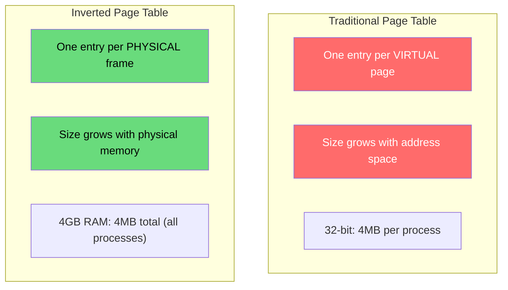
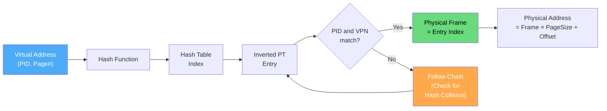
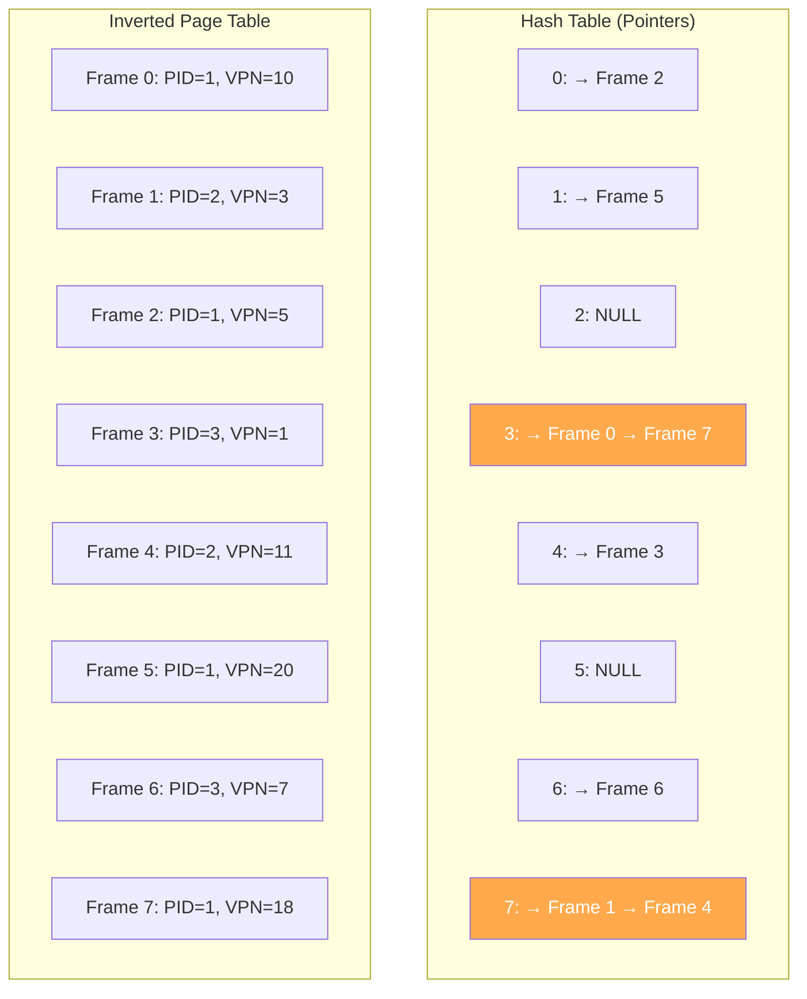
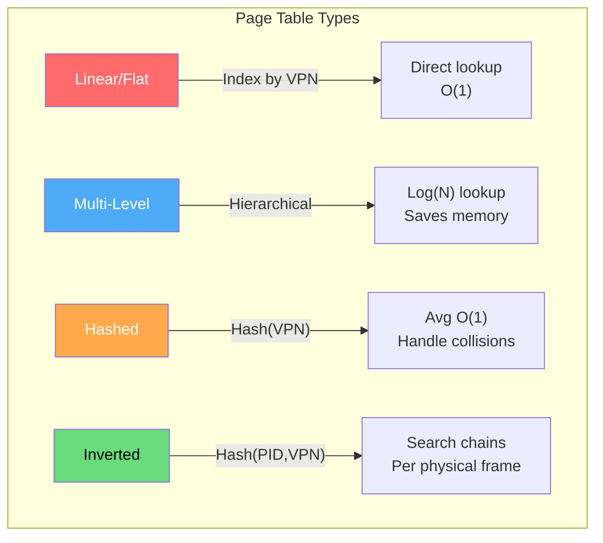

# Inverted Page Tables

Inverted page tables flip the traditional approach: instead of one entry per virtual page, they have one entry per **physical frame**. This dramatically reduces memory overhead for systems with large virtual address spaces but limited physical memory.

## Overview



| Aspect | Traditional | Inverted |
|--------|-----------|----------|
| Entries | Per virtual page | Per physical frame |
| Size depends on | Virtual address space | Physical memory |
| Per-process | Yes | No (shared globally) |
| Lookup | Direct index | Hash search |
| Shared pages | Multiple tables | Single entry |

## Structure

```
Physical Memory: 4 GB, Page Size: 4 KB
Number of frames: 4 GB / 4 KB = 1,048,576 frames

Inverted Page Table:
┌────────┬──────────┬──────────┬───────┬──────────┐
│ Entry  │  PID     │ Virtual  │  TLB  │  Flags   │
│ (Frame)│          │ Page #   │  Ref  │          │
├────────┼──────────┼──────────┼───────┼──────────┤
│   0    │  PID 1   │  Page 5  │   0   │ R/W/V    │
│   1    │  PID 2   │  Page 12 │   1   │ R/O/V    │
│   2    │  ------  │  ------  │   0   │ Invalid  │
│   3    │  PID 1   │  Page 8  │   0   │ R/W/V    │
│   ...  │  ...     │  ...     │  ...  │ ...      │
│ 1048575│  PID 3   │  Page 0  │   1   │ R/W/V    │
└────────┴──────────┴──────────┴───────┴──────────┘

Total: 1,048,576 entries × ~16 bytes = 16 MB
(vs 4 MB per process × N processes for traditional)
```

## Address Translation

Since we can't index by virtual page number directly, we need a **hash table**:



### Translation Algorithm

```
Given: (PID, Virtual Page Number, Offset)

1. hash_val = hash(PID, VPN)
2. index = hash_val % num_frames
3. entry = inverted_page_table[index]

4. while entry is valid:
     if entry.PID == PID and entry.VPN == VPN:
       → Found! Physical frame = index
       → Physical address = index × page_size + offset
       → Done
     else:
       → Hash collision, follow chain
       → index = (index + 1) % num_frames  (linear probing)
       → entry = inverted_page_table[index]

5. If not found → Page Fault
```

### Detailed Example

```
System: 8 physical frames, page size 4 KB
Translate: PID=3, Virtual Address=0x3500

Step 1: Extract VPN and offset
  VPN = 0x3500 >> 12 = 3
  Offset = 0x3500 & 0xFFF = 0x500

Step 2: Hash
  hash(3, 3) = (3 + 3) % 8 = 6

Step 3: Check entry 6
  Entry 6: PID=3, VPN=3, Valid=1
  → MATCH!

Step 4: Physical address = 6 × 4096 + 0x500 = 0x6500
```

With hash collision:
```
Step 3: Check entry 6
  Entry 6: PID=1, VPN=5, Valid=1
  → MISMATCH (hash collision)

Step 3b: Linear probe to entry 7
  Entry 7: PID=3, VPN=3, Valid=1
  → MATCH!

Step 4: Physical address = 7 × 4096 + 0x500 = 0x7500
```

## Hash Table with Chains

To handle collisions efficiently, use a chained hash table:



## IBM Power Architecture

IBM's PowerPC uses inverted page tables in hardware:

```c
// IBM Power ISA - Hash Page Table (HPT)

// The hardware has a hash function built into the MMU
// On TLB miss:
//   1. Hardware computes hash(VSID, VPN)
//   2. Reads primary PTE group (8 entries)
//   3. If not found, reads secondary PTE group
//   4. If found, loads into TLB
//   5. If not found, page fault (handled by OS)

// PTE format (Power ISA):
struct pte {
    uint64_t v:    1;  // Valid
    uint64_t vsid: 24; // Virtual Segment ID
    uint64_t h:    1;  // Hash function ID (primary/secondary)
    uint64_t api:  5;  // Abbreviated Page Index
    uint64_t rpn:  25; // Real (Physical) Page Number
    uint64_t r:    1;  // Referenced
    uint64_t c:    1;  // Changed (dirty)
    uint64_t w:    1;  // Write-through
    uint64_t i:    1;  // Cache inhibited
    uint64_t m:    1;  // Memory coherence
    uint64_t g:    1;  // Guarded
    uint64_t pp:   2;  // Page protection
};
```

```bash
# Linux on PowerPC - check page table type
$ dmesg | grep -i "hash\|radix"
[    0.000000] hash-mmu: Using hash page table for memory

# Power9+ supports Radix page tables (traditional) too
$ dmesg | grep radix
[    0.000000] radix-mmu: Using radix page table for memory
```

## Linux Implementation (Software Inverted PT)

Linux uses a hash table for the ELF core dump format and for some architectures:

```c
// Simplified inverted page table for demonstration
#include <stdio.h>
#include <stdlib.h>
#include <string.h>

#define NUM_FRAMES 1024
#define HASH_SIZE NUM_FRAMES

typedef struct ipt_entry {
    int pid;
    unsigned long vpn;
    int valid;
    int writable;
    int dirty;
    int accessed;
    struct ipt_entry *next;  // For chaining
} IPTEntry;

typedef struct {
    IPTEntry frames[NUM_FRAMES];
    IPTEntry *hash_table[HASH_SIZE];
} InvertedPageTable;

unsigned long hash_func(int pid, unsigned long vpn) {
    return (pid * 2654435761UL + vpn) % HASH_SIZE;
}

void init_ipt(InvertedPageTable *ipt) {
    memset(ipt->frames, 0, sizeof(ipt->frames));
    memset(ipt->hash_table, 0, sizeof(ipt->hash_table));
}

int allocate_frame(InvertedPageTable *ipt, int pid, 
                   unsigned long vpn, int writable) {
    // Find a free frame (simple linear search)
    for (int i = 0; i < NUM_FRAMES; i++) {
        if (!ipt->frames[i].valid) {
            ipt->frames[i].pid = pid;
            ipt->frames[i].vpn = vpn;
            ipt->frames[i].valid = 1;
            ipt->frames[i].writable = writable;
            ipt->frames[i].dirty = 0;
            ipt->frames[i].accessed = 0;
            
            // Add to hash chain
            unsigned long h = hash_func(pid, vpn);
            ipt->frames[i].next = ipt->hash_table[h];
            ipt->hash_table[h] = &ipt->frames[i];
            
            return i;  // Frame number
        }
    }
    return -1;  // No free frames
}

typedef struct {
    int fault;
    int frame;
    unsigned long paddr;
} TranslateResult;

TranslateResult translate(InvertedPageTable *ipt, int pid, 
                          unsigned long vaddr, int page_size) {
    unsigned long vpn = vaddr / page_size;
    unsigned long offset = vaddr % page_size;
    unsigned long h = hash_func(pid, vpn);
    
    TranslateResult result = {0};
    
    // Search hash chain
    IPTEntry *entry = ipt->hash_table[h];
    while (entry) {
        if (entry->pid == pid && entry->vpn == vpn && entry->valid) {
            entry->accessed = 1;
            result.fault = 0;
            result.frame = entry - ipt->frames;  // Index = frame number
            result.paddr = result.frame * page_size + offset;
            return result;
        }
        entry = entry->next;
    }
    
    result.fault = 1;
    return result;
}

void free_frame(InvertedPageTable *ipt, int frame) {
    IPTEntry *entry = &ipt->frames[frame];
    if (!entry->valid) return;
    
    // Remove from hash chain
    unsigned long h = hash_func(entry->pid, entry->vpn);
    IPTEntry **pp = &ipt->hash_table[h];
    while (*pp) {
        if (*pp == entry) {
            *pp = entry->next;
            break;
        }
        pp = &(*pp)->next;
    }
    
    entry->valid = 0;
    entry->next = NULL;
}

int main() {
    InvertedPageTable ipt;
    init_ipt(&ipt);
    
    // Allocate frames for PID 1
    int f1 = allocate_frame(&ipt, 1, 0, 1);  // Page 0
    int f2 = allocate_frame(&ipt, 1, 1, 1);  // Page 1
    int f3 = allocate_frame(&ipt, 1, 3, 1);  // Page 3
    
    printf("PID 1: Page 0 → Frame %d\n", f1);
    printf("PID 1: Page 1 → Frame %d\n", f2);
    printf("PID 1: Page 3 → Frame %d\n", f3);
    
    // Translate
    TranslateResult r = translate(&ipt, 1, 0x1500, 4096);
    printf("\nTranslate PID=1, VA=0x1500: %s\n", 
           r.fault ? "FAULT" : "OK");
    if (!r.fault) printf("  Frame=%d, PA=0x%lx\n", r.frame, r.paddr);
    
    r = translate(&ipt, 1, 0x8000, 4096);
    printf("Translate PID=1, VA=0x8000: %s\n", 
           r.fault ? "FAULT" : "OK");
    
    return 0;
}
```

## Comparison: All Page Table Types



| Type | Entries | Lookup | Memory | Best For |
|------|---------|--------|--------|----------|
| Linear | Per virtual page | O(1) index | Large | Small address spaces |
| Multi-Level | Per used page | O(L) walk | Small | General purpose |
| Hashed | Per virtual page | O(1) avg | Medium | Sparse address spaces |
| Inverted | Per physical frame | O(K) chain | Smallest | Large virtual, small physical |

## Advantages and Disadvantages

### Advantages of Inverted Page Tables

1. **Memory efficient**: Size depends on physical memory, not virtual
2. **Shared globally**: One table for all processes
3. **Large virtual spaces**: Can handle 64-bit+ virtual addresses cheaply
4. **Natural for shared memory**: Same frame → same entry

### Disadvantages

1. **Hash collisions**: Multiple lookups may be needed
2. **No direct indexing**: Must search (slower than array indexing)
3. **Difficult to implement shared pages**: Need special handling
4. **Complex page replacement**: Harder to find victim pages
5. **TLB miss cost**: Hash table search is slower than direct walk

## Interview Questions

### Beginner

**Q1: What is an inverted page table?**
A: Instead of having one entry per virtual page (traditional), an inverted page table has one entry per physical frame. Each entry stores which (PID, virtual page) is currently using that frame. This makes the table size proportional to physical memory, not virtual address space.

**Q2: How do you look up a translation in an inverted page table?**
A: You can't index directly by virtual page number. Instead, use a hash function on (PID, VPN) to find the likely entry, then compare. If it doesn't match (collision), follow the chain until found or determine it's a page fault.

**Q3: When are inverted page tables better than traditional page tables?**
A: When virtual address space is much larger than physical memory. For example, 64-bit virtual addresses with 4 GB physical RAM: traditional needs billions of entries; inverted needs only 1M entries (one per 4KB frame).

### Intermediate

**Q4: What is the main performance disadvantage of inverted page tables?**
A: Hash collisions require chaining, making worst-case lookup O(N) instead of O(1). With a good hash function and low load factor, average case is O(1), but pathological cases can degrade. Traditional page tables always have O(1) direct indexing.

**Q5: How does an inverted page table handle shared pages?**
A: When two processes share a physical frame, the inverted table has one entry for that frame. The entry can only store one (PID, VPN) pair, so sharing requires either: (1) a secondary structure mapping shared frames to multiple virtual addresses, or (2) the hardware checks all entries (expensive).

**Q6: How does page replacement work with inverted page tables?**
A: It's more complex. With traditional tables, the OS can scan a process's page table to find victim pages. With inverted tables, the OS must scan the entire inverted table or maintain per-process lists of frames. Some implementations keep a secondary "reverse mapping" structure.

### Advanced / FAANG-Level

**Q7: Design a page table for a system with 128-bit virtual addresses, 64-bit physical addresses, 4KB pages, and 64 GB of RAM.**
A: Multi-level would need ~2^100 entries (impossible). Inverted page table: 64 GB / 4 KB = 16M entries × ~32 bytes = 512 MB — feasible but large. Better approach: **hashed page table** with radix tree. Use a 3-level radix tree indexed by hash of (PID, VPN). Only allocate nodes for used virtual regions. Maintain a per-process radix tree for fast lookup + an inverted table for physical-to-virtual reverse mapping (needed for page replacement). This combines the best of both approaches.

**Q8: Compare the TLB miss handling cost for traditional, multi-level, and inverted page tables.**
A: 
- **Traditional (flat)**: 1 memory read (direct index). Fastest but memory-heavy.
- **Multi-level**: L memory reads (L = number of levels). For 4-level x86-64: 4 reads. Each level may be cached.
- **Inverted**: Hash computation + 1-N memory reads (depending on chain length). Average: 1-2 reads with good hash. Worst case: chain length × reads.
- **With TLB caching all types**: TLB hit is 1 cycle regardless. The difference only matters on TLB miss, which is <0.1% of accesses with good TLB reach.

**Q9: The Linux kernel on PowerPC switched from hash page tables to radix trees. Why?**
A: 
- **Hash page tables**: Hardware-dependent hash function, complex collision handling, hard to support huge pages, large memory overhead for the hash table itself.
- **Radix trees**: Software-managed, supports all page sizes naturally (4KB, 64KB, 2MB, 1GB), better TLB miss handling (hardware walker traverses the tree), more flexible for memory hotplug and virtualization.
- **Performance**: Radix trees have more predictable TLB miss latency (no collisions), better support for NUMA (page tables can be allocated on local node), and easier to implement features like memory protection keys.
- **Trade-off**: Radix uses more memory for sparse address spaces, but the flexibility and performance benefits outweigh this for modern workloads.

## Common Mistakes

1. **Confusing inverted with multi-level** — Both save memory, but differently. Multi-level: allocate for used virtual regions. Inverted: one entry per physical frame.
2. **Forgetting hash collisions** — Inverted tables need collision handling; it's not a simple array lookup.
3. **Assuming inverted is always better** — For small virtual spaces with lots of physical memory, traditional tables are faster.
4. **Not considering shared pages** — Inverted tables make sharing harder (one entry per frame).
5. **Ignoring reverse mapping needs** — Page replacement needs physical-to-virtual mapping, which inverted tables naturally provide.

## Summary

| Aspect | Details |
|--------|---------|
| **Structure** | One entry per physical frame |
| **Size** | Proportional to physical memory |
| **Lookup** | Hash-based search |
| **Memory** | Much smaller than flat PT for large VA spaces |
| **Sharing** | Complex (one entry per frame) |
| **Used In** | IBM Power (hash page table), some embedded systems |
| **Trade-off** | Less memory, but slower lookup |

## Cross-References

- **Compare With**: [Page Tables](./page-tables.md) — traditional approach
- **Compare With**: [Multi-Level Page Tables](./multi-level-page-tables.md) — hierarchical approach
- **Related**: [TLB](./tlb.md) — caching reduces lookup frequency
- **Related**: [Paging](./paging.md) — the underlying mechanism
- **Virtual Memory**: [Page Replacement](../virtual-memory/page-replacement.md) — needs reverse mapping


## Cross References

- [Page Tables](page-tables.md)
- [Paging](paging.md)
- [TLB](tlb.md)
- [Hash Index](../../dbms/indexing/hash-index.md)
