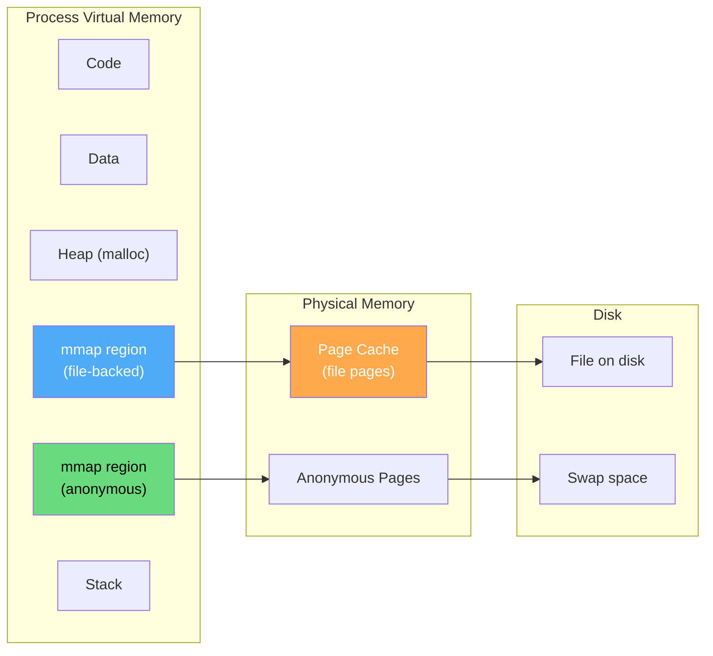
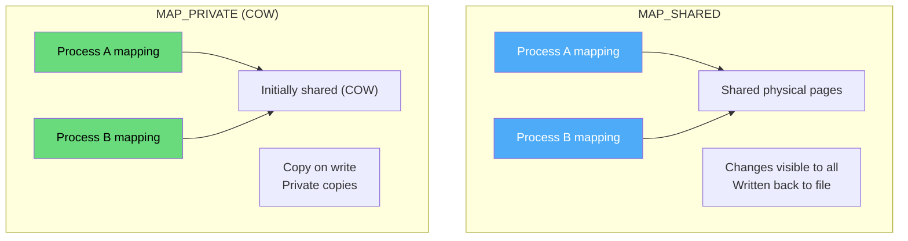
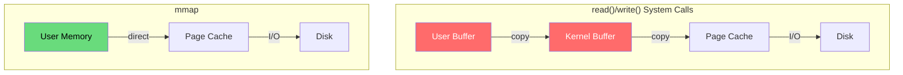
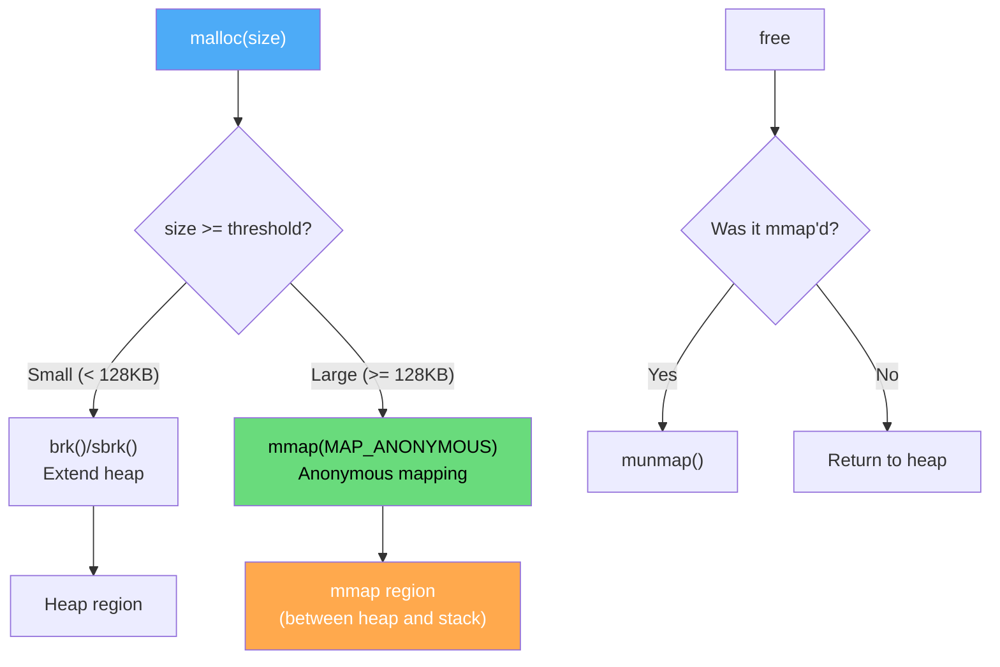

# mmap (Memory-Mapped Files)

`mmap` is a system call that maps files or devices into memory, allowing file I/O through normal memory access. It's also used for anonymous memory allocations and is the foundation of dynamic library loading in modern systems.

## Overview



## mmap System Call

```c
#include <sys/mman.h>

void *mmap(void *addr, size_t length, int prot, int flags,
           int fd, off_t offset);
```

| Parameter | Description |
|-----------|-------------|
| `addr` | Hint for starting address (NULL = kernel chooses) |
| `length` | Size of mapping in bytes |
| `prot` | Protection: `PROT_READ`, `PROT_WRITE`, `PROT_EXEC`, `PROT_NONE` |
| `flags` | `MAP_SHARED`, `MAP_PRIVATE`, `MAP_ANONYMOUS`, `MAP_FIXED`, etc. |
| `fd` | File descriptor (-1 for anonymous) |
| `offset` | Offset into file (must be page-aligned) |

### Return Values
- Success: pointer to mapped region
- Failure: `MAP_FAILED` (-1), errno is set

## Types of mmap

### 1. File-Backed Mapping

Maps a file into memory. Changes can be written back to the file.

```c
#include <stdio.h>
#include <sys/mman.h>
#include <sys/stat.h>
#include <fcntl.h>
#include <unistd.h>

int main() {
    int fd = open("data.txt", O_RDWR);
    struct stat sb;
    fstat(fd, &sb);
    
    // Map file into memory
    char *data = mmap(NULL, sb.st_size, 
                      PROT_READ | PROT_WRITE,
                      MAP_SHARED, fd, 0);
    
    // Read file like memory
    printf("First 100 bytes: %.100s\n", data);
    
    // Modify file through memory
    data[0] = 'H';
    
    // Ensure changes are written to file
    msync(data, sb.st_size, MS_SYNC);
    
    munmap(data, sb.st_size);
    close(fd);
    return 0;
}
```

### 2. Anonymous Mapping

No file backing. Used for large memory allocations.

```c
#include <sys/mman.h>
#include <string.h>
#include <stdio.h>

int main() {
    // Allocate 1 GB anonymously
    size_t size = 1ULL << 30;
    void *ptr = mmap(NULL, size,
                     PROT_READ | PROT_WRITE,
                     MAP_PRIVATE | MAP_ANONYMOUS,
                     -1, 0);
    
    if (ptr == MAP_FAILED) {
        perror("mmap");
        return 1;
    }
    
    // Memory is zero-filled on first access
    memset(ptr, 42, size);
    
    printf("Allocated %zu bytes at %p\n", size, ptr);
    
    munmap(ptr, size);
    return 0;
}
```

### 3. Shared vs Private Mapping



```bash
# View mmap regions for a process
$ cat /proc/$(pgrep -f firefox | head -1)/maps | head -20
55a8c0a00000-55a8c0a24000 r--p 00000000 08:01 131074  /usr/bin/cat
55a8c0a24000-55a8c0a6e000 r-xp 00024000 08:01 131074  /usr/bin/cat
7f8c10000000-7f8c10021000 r-xp 00000000 08:01 524300  /lib/libc.so.6
7f8c10221000-7f8c10421000 ---p 00021000 08:01 524300  /lib/libc.so.6
7ffd5e3a0000-7ffd5e3c1000 rw-p 00000000 00:00 0       [stack]

# Fields: addr range, perms, offset, dev, inode, pathname
# Perms: r=read, w=write, x=exec, p=private, s=shared
```

## mmap vs read/write



| Aspect | read/write | mmap |
|--------|-----------|------|
| Data copies | 2 (user↔kernel↔page cache) | 0 (direct page cache access) |
| System calls | Per read/write operation | Once for mapping |
| Memory usage | User buffer + kernel buffer | Only page cache |
| Random access | Seek + read | Direct pointer arithmetic |
| Large files | Multiple I/O ops | Single mapping |
| Small files | Often faster | Overhead not worth it |
| Page cache | Shared with kernel | Directly accessed |

## Dynamic Library Loading

Shared libraries (.so files) are loaded via mmap:

```bash
# See loaded libraries
$ cat /proc/$(pgrep -f bash | head -1)/maps | grep "\.so"
7f8c10000000-7f8c10021000 r-xp 00000000 08:01 524300  /lib/x86_64-linux-gnu/libc-2.31.so
7f8c10221000-7f8c10421000 ---p 00021000 08:01 524300  /lib/x86_64-linux-gnu/libc-2.31.so
7f8c10421000-7f8c10425000 r--p 00021000 08:01 524300  /lib/x86_64-linux-gnu/libc-2.31.so
7f8c10425000-7f8c10427000 rw-p 00025000 08:01 524300  /lib/x86_64-linux-gnu/libc-2.31.so

# Notice: same file mapped multiple times with different permissions
# r-xp: code (read-only, executable)
# r--p: read-only data
# rw-p: writable data (GOT, etc.)
```

```c
// Simplified dynamic linker (ld-linux.so) behavior:
// 1. Parse ELF program headers
// 2. For each LOAD segment:
//    mmap(segment_addr, segment_size, prot, MAP_PRIVATE|MAP_FIXED, fd, offset)
// 3. For shared libraries:
//    mmap(library_addr, library_size, prot, MAP_PRIVATE, lib_fd, 0)
// 4. Apply relocations
// 5. Call initialization functions

// dlopen() internally does:
void *handle = dlopen("libfoo.so", RTLD_LAZY);
// 1. Find and open libfoo.so
// 2. mmap its segments into process address space
// 3. Resolve dependencies (recursive)
// 4. Apply relocations (lazy with RTLD_LAZY)
```

## Advanced mmap Flags

```c
// MAP_FIXED: Use exact address (dangerous!)
void *p = mmap((void*)0x10000000, 4096, PROT_READ,
               MAP_PRIVATE | MAP_FIXED | MAP_ANONYMOUS, -1, 0);

// MAP_FIXED_NOREPLACE: Like MAP_FIXED but fails if address in use (Linux 4.17+)
void *p = mmap((void*)0x10000000, 4096, PROT_READ,
               MAP_PRIVATE | MAP_FIXED_NOREPLACE | MAP_ANONYMOUS, -1, 0);

// MAP_POPULATE: Pre-fault all pages (avoid future page faults)
void *p = mmap(NULL, size, PROT_READ | PROT_WRITE,
               MAP_PRIVATE | MAP_ANONYMOUS | MAP_POPULATE, -1, 0);

// MAP_HUGETLB: Use huge pages
void *p = mmap(NULL, 2*1024*1024, PROT_READ | PROT_WRITE,
               MAP_PRIVATE | MAP_ANONYMOUS | MAP_HUGETLB, -1, 0);

// MAP_NORESERVE: Don't reserve swap (overcommit)
void *p = mmap(NULL, size, PROT_READ | PROT_WRITE,
               MAP_PRIVATE | MAP_ANONYMOUS | MAP_NORESERVE, -1, 0);

// MAP_LOCKED: Lock pages in memory (mlock)
void *p = mmap(NULL, size, PROT_READ | PROT_WRITE,
               MAP_PRIVATE | MAP_ANONYMOUS | MAP_LOCKED, -1, 0);
```

## Related System Calls

### munmap — Unmap Memory

```c
int munmap(void *addr, size_t length);
// Unmaps the specified region
// Pages are written back if MAP_SHARED and dirty
// Subsequent access causes SIGSEGV
```

### mprotect — Change Permissions

```c
int mprotect(void *addr, size_t length, int prot);
// Example: make a region read-only after initialization
void *data = mmap(NULL, size, PROT_READ | PROT_WRITE, MAP_PRIVATE | MAP_ANONYMOUS, -1, 0);
// ... initialize data ...
mprotect(data, size, PROT_READ);  // Now read-only
```

### msync — Synchronize with Disk

```c
int msync(void *addr, size_t length, int flags);
// MS_SYNC: Synchronous write (blocks until complete)
// MS_ASYNC: Asynchronous write (returns immediately)
// MS_INVALIDATE: Invalidate cached data
```

### madvise — Memory Usage Hints

```c
int madvise(void *addr, size_t length, int advice);

// MADV_NORMAL: Default behavior
// MADV_RANDOM: Random access pattern (disable readahead)
// MADV_SEQUENTIAL: Sequential access (aggressive readahead)
// MADV_WILLNEED: Will need these pages soon (prefetch)
// MADV_DONTNEED: Don't need these pages (free them)
// MADV_HUGEPAGE: Use huge pages for this region
// MADV_NOHUGEPAGE: Don't use huge pages
// MADV_FREE: Mark pages as freeable (lazy free)
```

### mlock — Lock Pages in Memory

```c
int mlock(const void *addr, size_t length);
int mlockall(int flags);  // MCL_CURRENT, MCL_FUTURE

// Prevent pages from being swapped out
// Used for: real-time systems, security (prevent secrets on disk)
// Requires CAP_IPC_LOCK or appropriate rlimits
```

## Real-World: Database mmap Usage

```bash
# MongoDB uses mmap for storage engine (legacy)
# SQLite can use mmap for I/O
# Many databases offer mmap options

# Check mmap usage for a process
$ grep -c "^" /proc/$(pgrep -f postgres)/maps
247  # Number of memory mappings

# Total mmap'd memory
$ awk '{split($1,a,"-"); size=strtonum("0x"a[2])-strtonum("0x"a[1]); total+=size} END{print total/1024/1024 " MB"}' /proc/$(pgrep -f postgres)/maps

# Shared library memory usage
$ pmap -x $(pgrep -f bash | head -1) | tail -5
total kB  1234567  234567  123456
```

## malloc and mmap Relationship



```bash
# See heap vs mmap regions
$ cat /proc/$(pgrep -f stress | head -1)/maps | grep -E "heap|mmap|anon"
55a8c0a00000-55a8c0a21000 rw-p 00000000 00:00 0  [heap]
7f8c10000000-7f8c18000000 rw-p 00000000 00:00 0  [anon]

# malloc threshold (glibc)
$ cat /proc/sys/vm/mmap_min_addr
65536
$ MALLOC_MMAP_THRESHOLD_=131072 ./my_program
```

## C Implementation: Simple mmap Simulator

```python
import os
import mmap

def demonstrate_mmap():
    # Create a test file
    with open("test_mmap.txt", "wb") as f:
        f.write(b"Hello, mmap! This is a test file.\n" * 100)
    
    # File-backed mapping
    with open("test_mmap.txt", "r+b") as f:
        # Memory-map the file
        mm = mmap.mmap(f.fileno(), 0)
        
        # Read like a string
        print("First 30 bytes:", mm[:30])
        
        # Modify through mmap
        mm[0:5] = b"HELLO"
        
        # Seek and read
        mm.seek(0)
        print("After modification:", mm.readline())
        
        # Synchronize to disk
        mm.flush()
        mm.close()
    
    # Anonymous mapping (Python 3.x)
    # Note: Python's mmap doesn't directly support MAP_ANONYMOUS
    # Use ctypes for that:
    import ctypes
    libc = ctypes.CDLL("libc.so.6")
    
    PROT_READ = 1
    PROT_WRITE = 2
    MAP_PRIVATE = 0x02
    MAP_ANONYMOUS = 0x20
    
    libc.mmap.restype = ctypes.c_void_p
    libc.mmap.argtypes = [
        ctypes.c_void_p, ctypes.c_size_t,
        ctypes.c_int, ctypes.c_int,
        ctypes.c_int, ctypes.c_long
    ]
    
    size = 4096
    ptr = libc.mmap(None, size, PROT_READ | PROT_WRITE,
                    MAP_PRIVATE | MAP_ANONYMOUS, -1, 0)
    
    if ptr == -1:
        print("mmap failed!")
    else:
        # Write to anonymous mapping
        buf = (ctypes.c_char * size).from_address(ptr)
        buf[:5] = b"Hello"
        print("Anonymous mmap:", buf[:10])
        libc.munmap(ptr, size)
    
    os.unlink("test_mmap.txt")

demonstrate_mmap()
```

## Interview Questions

### Beginner

**Q1: What is mmap?**
A: `mmap` maps files or devices into memory, allowing file I/O through normal memory operations. It can also create anonymous memory regions (no file backing). It's more efficient than read/write for large files because it avoids copying data between user and kernel space.

**Q2: What is the difference between MAP_SHARED and MAP_PRIVATE?**
A: 
- **MAP_SHARED**: Changes are written back to the file and visible to other processes mapping the same file.
- **MAP_PRIVATE**: Uses copy-on-write. Changes are private and NOT written back to the file. Used for loading executables and libraries.

**Q3: How does mmap relate to malloc?**
A: `malloc` uses `mmap` (or `brk`) internally. For large allocations (typically ≥128 KB), glibc's malloc calls `mmap(MAP_ANONYMOUS)` instead of extending the heap with `brk()`. This avoids heap fragmentation and allows efficient deallocation via `munmap`.

### Intermediate

**Q4: Why is mmap faster than read() for large files?**
A: `read()` copies data: disk → page cache → user buffer (2 copies). `mmap()` maps the page cache directly into the process's address space (0 copies). For large sequential or random access, this eliminates significant CPU overhead. However, for small sequential reads, `read()` with kernel readahead may be comparable.

**Q5: What is copy-on-write (COW) in mmap?**
A: With `MAP_PRIVATE`, the kernel initially maps the same physical pages as the file. When a process writes to a page, the kernel creates a private copy (page fault handler). This saves memory when multiple processes map the same file (e.g., shared libraries) but mostly read.

**Q6: What happens when you munmap a region that's dirty?**
A: For `MAP_SHARED`: dirty pages are written back to the file (may be async). For `MAP_PRIVATE`: dirty pages are discarded (no file to write to). In both cases, the virtual address range becomes invalid and subsequent access causes SIGSEGV.

### Advanced / FAANG-Level

**Q7: Design a memory-mapped database that handles 100 GB of data on a 16 GB machine.**
A: 
1. **mmap the entire database file**: `mmap(NULL, 100GB, PROT_READ, MAP_SHARED, db_fd, 0)`. This doesn't load everything into memory — pages are loaded on demand.
2. **Page cache management**: Let the kernel manage which pages are in RAM. Use `madvise(MADV_SEQUENTIAL)` for scans, `MADV_RANDOM` for point lookups.
3. **Prefetching**: Use `madvise(MADV_WILLNEED)` to prefetch pages before access.
4. **Write path**: Use `MAP_SHARED` with `msync()` for durability, or use separate write buffers with `pwrite()`.
5. **NUMA**: Use `mbind()` to allocate pages on the local NUMA node.
6. **Huge pages**: Use `madvise(MADV_HUGEPAGE)` for large contiguous regions.

**Q8: Explain how the kernel handles a page fault on an mmap'd file.**
A: 
1. Process accesses mmap'd address → page fault
2. Kernel finds VMA for the address
3. VMA points to `struct file` and has the offset
4. `filemap_fault()` is called:
   a. Search page cache for the page
   b. If found → map it into the process's page table (minor fault)
   c. If not found → allocate page, read from disk (major fault)
5. For `MAP_PRIVATE` + write: copy-on-write after initial mapping
6. For `MAP_SHARED` + write: mark page dirty in page cache
7. Page remains in page cache for future access by any process

**Q9: A process mmaps a 10 GB file MAP_SHARED, then fork()s. What happens to the mapping?**
A: 
1. Child inherits the mmap region (same VMA with same file/offset)
2. Both parent and child share the same physical pages (page cache)
3. Both can read the file through the mapping
4. Writes by either process are visible to both (MAP_SHARED semantics)
5. The mapping is NOT copy-on-write (unlike MAP_PRIVATE anonymous pages)
6. `msync()` by either process writes changes to the file
7. If parent or child calls `munmap()`, only that process loses the mapping
8. The physical pages remain in page cache until both unmap or the file is deleted

## Common Mistakes

1. **Not checking MAP_FAILED** — mmap returns MAP_FAILED (-1) on error, not NULL
2. **Forgetting page alignment** — offset must be page-aligned; length is rounded up
3. **Using mmap for small files** — Overhead of page faults may exceed simple read()
4. **Not handling SIGBUS** — Accessing beyond file size in file-backed mapping causes SIGBUS (not SIGSEGV)
5. **Memory leaks with mmap** — Must call munmap; doesn't auto-free like heap

## Summary

| Aspect | Details |
|--------|---------|
| **Purpose** | Map files/devices into memory |
| **Types** | File-backed, Anonymous, Shared, Private |
| **Advantage** | Zero-copy I/O, efficient large files |
| **malloc** | Uses mmap for large allocations |
| **Libraries** | Loaded via mmap (MAP_PRIVATE) |
| **COW** | MAP_PRIVATE pages are copy-on-write |
| **Hints** | madvise() for access pattern optimization |

## Cross-References

- **Related**: [Paging](./paging.md) — mmap creates page mappings
- **Related**: [Swapping](./swapping.md) — anonymous mmap pages can be swapped
- **Related**: [Huge Pages](./huge-pages.md) — MAP_HUGETLB flag
- **Related**: [Copy-on-Write](../virtual-memory/cow.md) — MAP_PRIVATE COW mechanism
- **Related**: [Demand Paging](../virtual-memory/demand-paging.md) — pages loaded on first access
