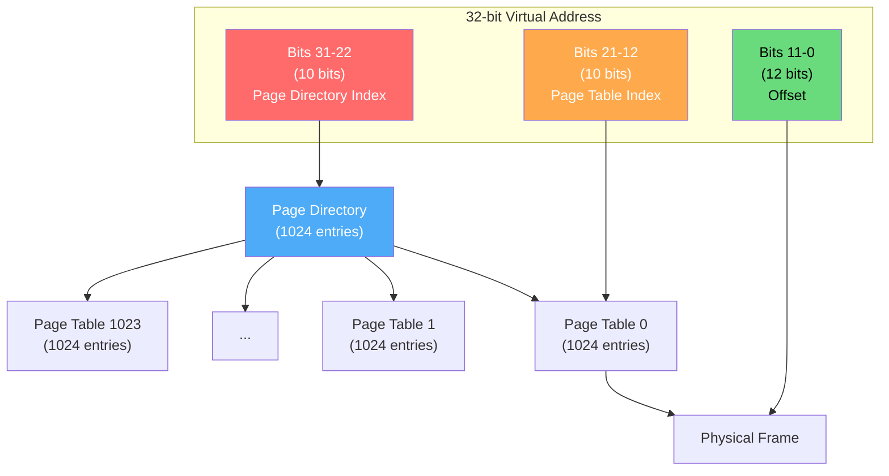
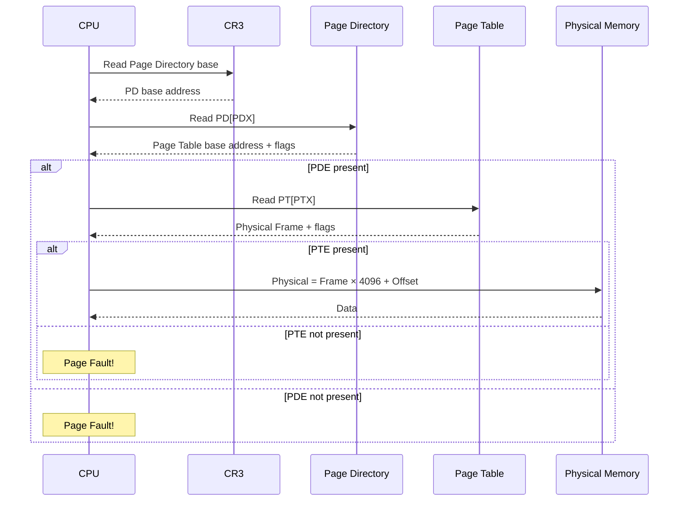
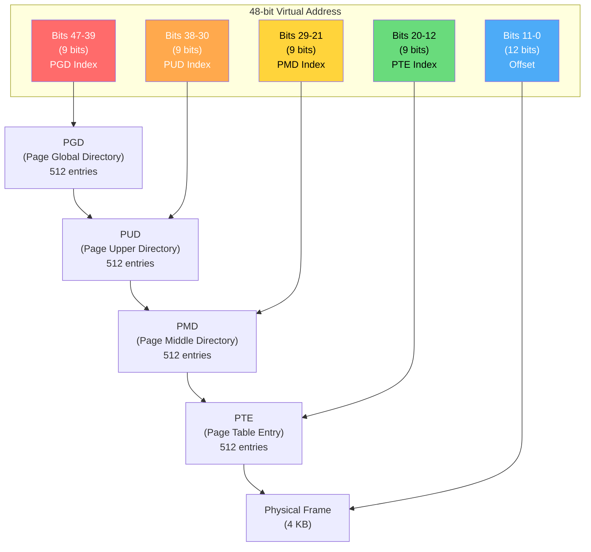
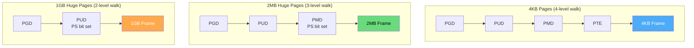

# Multi-Level Page Tables

Multi-level page tables solve the enormous memory overhead of flat (linear) page tables by organizing them hierarchically. Instead of allocating entries for the entire address space, only the portions actually in use have page table pages allocated.

## The Problem with Flat Page Tables

```
32-bit address space, 4KB pages:
  Number of pages = 2^32 / 2^12 = 2^20 = 1,048,576
  Each PTE = 4 bytes
  Page table size = 1,048,576 × 4 = 4 MB per process!

64-bit address space (48-bit effective), 4KB pages:
  Number of pages = 2^48 / 2^12 = 2^36 = 68 billion
  Each PTE = 8 bytes
  Page table size = 68 billion × 8 = 512 GB per process!

  → Completely impractical!
```

## Two-Level Page Table (32-bit)

Split the page number into two parts: **outer page (page directory)** and **inner page (page table)**.



### Address Split (32-bit, 4KB pages)

```
31        22 21        12 11          0
┌───────────┬───────────┬──────────────┐
│  PDX (10) │  PTX (10) │  Offset (12) │
└───────────┴───────────┴──────────────┘

PDX = Page Directory Index (top 10 bits)
PTX = Page Table Index (middle 10 bits)
Offset = Byte within page (bottom 12 bits)
```

### Translation Walk



### Memory Savings

```
Process using 10 MB of memory (typical small program):

Flat page table:
  2^20 entries × 4 bytes = 4 MB

Two-level page table:
  Page Directory: 1 page = 4 KB (always allocated)
  Page Tables: 10 MB / 4 KB = 2,560 pages needed
    → Need 2,560 PTEs → 3 page table pages (2,560 / 1,024 ≈ 2.5)
  Total: 4 KB + 12 KB = 16 KB

  Savings: 4 MB → 16 KB (256x reduction)
```

## Four-Level Page Table (x86-64)

x86-64 uses 4-level paging with 48-bit virtual addresses:



### x86-64 Address Split

```
47      39 38      30 29      21 20      12 11            0
┌─────────┬──────────┬──────────┬──────────┬───────────────┐
│ PGD (9) │ PUD (9)  │ PMD (9)  │ PTE (9)  │  Offset (12) │
└─────────┴──────────┴──────────┴──────────┴───────────────┘

Each level: 2^9 = 512 entries × 8 bytes = 4096 bytes = exactly 1 page!
```

### Each Table is Exactly One Page

This is by design — each page table level fits in a single 4KB page:
- 512 entries × 8 bytes = 4096 bytes = 1 page
- Page table pages can be managed by the same frame allocator

### Five-Level Page Table (57-bit)

Recent x86-64 CPUs support 5-level paging (LA57):

```
56      48 47      39 38      30 29      21 20      12 11            0
┌─────────┬──────────┬──────────┬──────────┬──────────┬───────────────┐
│ P4D (9) │ PGD (9)  │ PUD (9)  │ PMD (9)  │ PTE (9)  │  Offset (12) │
└─────────┴──────────┴──────────┴──────────┴──────────┴───────────────┘

Virtual address space: 2^57 = 128 PB
```

```bash
# Check if 5-level paging is supported
$ cat /proc/cpuinfo | grep la57
flags           : ... la57 ...

# Check if kernel uses 5-level paging
$ dmesg | grep -i "5-level"
[    0.000000] x86/mm: Paging is enabled with 5-level page tables
```

## Linux Kernel Implementation

### Page Table Manipulation Macros

```c
// arch/x86/include/asm/pgtable.h

// Page directory indices from virtual address
#define PGDIR_SHIFT     39
#define PUD_SHIFT       30
#define PMD_SHIFT       21
#define PAGE_SHIFT      12

#define PTRS_PER_PGD    512
#define PTRS_PER_PUD    512
#define PTRS_PER_PMD    512
#define PTRS_PER_PTE    512

// Extract index from virtual address
#define pgd_index(addr)  (((addr) >> PGDIR_SHIFT) & (PTRS_PER_PGD - 1))
#define pud_index(addr)  (((addr) >> PUD_SHIFT) & (PTRS_PER_PUD - 1))
#define pmd_index(addr)  (((addr) >> PMD_SHIFT) & (PTRS_PER_PMD - 1))
#define pte_index(addr)  (((addr) >> PAGE_SHIFT) & (PTRS_PER_PTE - 1))

// Get page directory entry
static inline pgd_t *pgd_offset(struct mm_struct *mm, unsigned long addr) {
    return mm->pgd + pgd_index(addr);
}

// Walk down one level
static inline pmd_t *pmd_offset(pud_t *pud, unsigned long addr) {
    return (pmd_t *)pud_page_vaddr(*pud) + pmd_index(addr);
}
```

### Complete Page Table Walk

```c
// Walk the page table for a virtual address
pte_t *walk_page_table(struct mm_struct *mm, unsigned long addr) {
    pgd_t *pgd;
    p4d_t *p4d;
    pud_t *pud;
    pmd_t *pmd;
    pte_t *pte;
    
    pgd = pgd_offset(mm, addr);
    if (pgd_none(*pgd) || pgd_bad(*pgd))
        return NULL;
    
    p4d = p4d_offset(pgd, addr);
    if (p4d_none(*p4d) || p4d_bad(*p4d))
        return NULL;
    
    pud = pud_offset(p4d, addr);
    if (pud_none(*pud) || pud_bad(*pud))
        return NULL;
    
    pmd = pmd_offset(pud, addr);
    if (pmd_none(*pmd) || pmd_bad(*pmd))
        return NULL;
    
    // Check for huge page at PMD level (2MB)
    if (pmd_large(*pmd))
        return (pte_t *)pmd;  // Treat PMD as PTE for huge page
    
    pte = pte_offset_map(pmd, addr);
    return pte;
}
```

```bash
# Dump page tables from kernel debug
$ sudo cat /proc/<pid>/smaps | head -30
55a8c0a00000-55a8c0a24000 r--p 00000000 08:01 131074  /usr/bin/cat
Size:                144 kB
KernelPageSize:        4 kB
MMUPageSize:           4 kB
Rss:                 144 kB
Pss:                 144 kB
```

## Page Table Entry Sizes

| Architecture | PTE Size | Entries/Table | Table Size |
|-------------|----------|---------------|------------|
| x86 (32-bit) | 4 bytes | 1024 | 4 KB |
| x86 PAE | 8 bytes | 512 | 4 KB |
| x86-64 | 8 bytes | 512 | 4 KB |
| ARM32 | 4 bytes | 256/1024 | 1-4 KB |
| ARM64 | 8 bytes | 512 | 4 KB |

## Huge Pages and Page Tables

Huge pages skip the lowest level(s) of the page table:



Benefits:
- Fewer page table levels to traverse (faster walk)
- Fewer page table pages to allocate
- Much larger TLB reach

## Memory Savings Calculation

```python
def calculate_page_table_size(virtual_addr_bits, page_size_bytes, 
                               pte_size_bytes, memory_used_bytes):
    """Calculate flat vs multi-level page table sizes."""
    
    page_bits = page_size_bytes.bit_length() - 1
    num_pages = 2 ** (virtual_addr_bits - page_bits)
    entries_per_table = page_size_bytes // pte_size_bytes
    levels = (virtual_addr_bits - page_bits + entries_per_table.bit_length() - 2) // \
             (entries_per_table.bit_length() - 1)
    
    # Flat page table
    flat_size = num_pages * pte_size_bytes
    
    # Multi-level (only allocate for used memory)
    pages_needed = (memory_used_bytes + page_size_bytes - 1) // page_size_bytes
    
    # Each level needs ceil(entries / entries_per_table) tables
    multi_size = 0
    remaining = pages_needed
    for level in range(levels):
        tables_needed = (remaining + entries_per_table - 1) // entries_per_table
        multi_size += tables_needed * page_size_bytes
        remaining = tables_needed
    
    return {
        'flat_size': flat_size,
        'multi_level_size': multi_size,
        'savings': flat_size / multi_size if multi_size > 0 else float('inf'),
        'levels': levels
    }


# 32-bit, 4KB pages, 4-byte PTE, 10MB used
r = calculate_page_table_size(32, 4096, 4, 10 * 1024 * 1024)
print(f"32-bit, 10MB used:")
print(f"  Flat: {r['flat_size'] / 1024:.0f} KB")
print(f"  Multi-level: {r['multi_level_size'] / 1024:.0f} KB")
print(f"  Savings: {r['savings']:.0f}x")

# 48-bit, 4KB pages, 8-byte PTE, 1GB used
r = calculate_page_table_size(48, 4096, 8, 1024 * 1024 * 1024)
print(f"\n48-bit, 1GB used:")
print(f"  Flat: {r['flat_size'] / (1024**3):.0f} GB")
print(f"  Multi-level: {r['multi_level_size'] / 1024:.0f} KB")
print(f"  Savings: {r['savings']:.0f}x")
```

Output:
```
32-bit, 10MB used:
  Flat: 4096 KB
  Multi-level: 16 KB
  Savings: 256x

48-bit, 1GB used:
  Flat: 512 GB
  Multi-level: 24 KB
  Savings: 22369621x
```

## Real-World: Linux Process Page Tables

```bash
# View page table size for a process
$ ps -o pid,vsz,rss,cmd -p $(pgrep -f firefox)
  PID    VSZ   RSS CMD
 1234 5234560 892340 /usr/lib/firefox/firefox

# VSZ includes page table overhead
# RSS is actual physical memory used

# Detailed page table stats
$ cat /proc/<pid>/status | grep -i "page\|table"
VmPTE:       128 kB    ← Page table size
VmPMD:         8 kB    ← PMD-level tables

# System-wide page table memory
$ grep -i "page_tables" /proc/meminfo
PageTables:        32768 kB

# Watch page table growth
$ watch -n 1 'grep PageTables /proc/meminfo'
```

## C Implementation: Two-Level Page Table

```python
class TwoLevelPageTable:
    def __init__(self, page_bits=12, dir_bits=10, table_bits=10):
        self.page_bits = page_bits
        self.dir_bits = dir_bits
        self.table_bits = table_bits
        self.page_size = 1 << page_bits
        self.dir_size = 1 << dir_bits
        self.table_size = 1 << table_bits
        
        # Page directory: array of page table pointers
        # None means the entire page table is not allocated
        self.page_directory = [None] * self.dir_size
        
        # Track allocated tables for memory stats
        self.allocated_tables = 0
    
    def _split_address(self, vaddr):
        """Split virtual address into directory, table, offset."""
        offset = vaddr & (self.page_size - 1)
        table_idx = (vaddr >> self.page_bits) & (self.table_size - 1)
        dir_idx = (vaddr >> (self.page_bits + self.table_bits)) & (self.dir_size - 1)
        return dir_idx, table_idx, offset
    
    def map_page(self, vaddr, frame, writable=True):
        """Map a virtual address to a physical frame."""
        dir_idx, table_idx, _ = self._split_address(vaddr & ~(self.page_size - 1))
        
        # Allocate page table if needed
        if self.page_directory[dir_idx] is None:
            self.page_directory[dir_idx] = [None] * self.table_size
            self.allocated_tables += 1
        
        self.page_directory[dir_idx][table_idx] = {
            'frame': frame,
            'present': True,
            'writable': writable,
            'accessed': False,
            'dirty': False
        }
    
    def translate(self, vaddr, write=False):
        """Translate virtual address to physical."""
        dir_idx, table_idx, offset = self._split_address(vaddr)
        
        # Check page directory
        if self.page_directory[dir_idx] is None:
            return {'fault': True, 'reason': f'Page directory {dir_idx} not allocated'}
        
        pte = self.page_directory[dir_idx][table_idx]
        
        if pte is None or not pte['present']:
            return {'fault': True, 'reason': f'Page not present'}
        
        if write and not pte['writable']:
            return {'fault': True, 'reason': 'Write to read-only page'}
        
        pte['accessed'] = True
        if write:
            pte['dirty'] = True
        
        paddr = pte['frame'] * self.page_size + offset
        return {
            'fault': False,
            'vaddr': vaddr,
            'paddr': paddr,
            'frame': pte['frame']
        }
    
    def memory_usage(self):
        """Calculate page table memory usage."""
        # Each PTE = 8 bytes, each table = table_size * 8 bytes
        # Plus page directory itself
        dir_size = self.dir_size * 8  # 8 bytes per pointer
        tables_size = self.allocated_tables * self.table_size * 8
        return {
            'page_directory': dir_size,
            'page_tables': tables_size,
            'total': dir_size + tables_size,
            'flat_equivalent': self.dir_size * self.table_size * 8
        }


# Simulation
pt = TwoLevelPageTable()

# Map some pages (process using ~1MB spread across address space)
pt.map_page(0x00000000, 5)       # Code at low address
pt.map_page(0x00001000, 6)
pt.map_page(0x08000000, 100)     # Data at different region
pt.map_page(0x08001000, 101)
pt.map_page(0x7FFE0000, 200)     # Stack near top
pt.map_page(0x7FFF0000, 201)

# Translate
print(pt.translate(0x00000500))  # Code access
print(pt.translate(0x08000100))  # Data access
print(pt.translate(0x7FFE0050))  # Stack access
print(pt.translate(0x10000000))  # Unmapped → fault

# Memory usage comparison
usage = pt.memory_usage()
print(f"\nMemory usage:")
print(f"  Page directory: {usage['page_directory']} bytes")
print(f"  Page tables ({pt.allocated_tables} allocated): {usage['page_tables']} bytes")
print(f"  Total: {usage['total']} bytes")
print(f"  Flat equivalent: {usage['flat_equivalent']} bytes")
print(f"  Savings: {usage['flat_equivalent'] / usage['total']:.1f}x")
```

## Interview Questions

### Beginner

**Q1: Why can't we use a flat page table for 64-bit systems?**
A: A 64-bit address space with 4KB pages would need 2^52 page table entries × 8 bytes = 32 PB per page table. That's more physical memory than exists. Multi-level page tables solve this by only allocating entries for used portions.

**Q2: How does a multi-level page table save memory?**
A: Unused portions of the address space don't need page table pages allocated. If a process uses only 10 MB out of 4 GB address space, a two-level table needs ~16 KB instead of 4 MB. The page directory entries for unused regions are simply marked "not present."

**Q3: How many levels does x86-64 use?**
A: 4 levels (PGD → PUD → PMD → PTE) for 48-bit virtual addresses. Each level has 512 entries × 8 bytes = 4096 bytes = exactly one page. With 5-level paging (LA57), it's 5 levels for 57-bit addresses.

### Intermediate

**Q4: Why is each page table level exactly one page in x86-64?**
A: It's an intentional design choice. With 9 bits per level (512 entries) and 8-byte PTEs: 512 × 8 = 4096 = 4KB = one page. This means page table pages can be managed by the same frame allocator as regular pages, simplifying the memory manager.

**Q5: What is the trade-off of more page table levels?**
A: More levels = smaller tables but longer page table walks. Each level adds one memory access to the walk. 4-level: 4 memory reads per TLB miss. 5-level: 5 reads. Mitigated by TLB caching and page table pages being cached in L1/L2.

**Q6: How does the kernel handle a page table page that needs to be allocated during a page fault?**
A: The page fault handler walks the page table top-down. At each level, if the entry is "not present," the kernel allocates a new page table page (using the buddy allocator), zeros it, and fills in the directory entry. This is done recursively until reaching the PTE level, where the actual data frame is mapped.

### Advanced / FAANG-Level

**Q7: A process maps a 4 GB file using mmap with MAP_NORESERVE. How much page table memory is consumed immediately? How much after touching every page?**
A: 
- **Immediately after mmap**: Only the PGD entry is created (pointing to a not-yet-allocated PUD). No actual page table pages are allocated for the mapping — maybe 0-4 KB total.
- **After touching all pages**: 4 GB / 4 KB = 1M pages. Need: 1 PGD entry, ~1 PUD entry, ~4 PMD entries, ~2048 PTE tables. Total: ~8 MB of page table pages.
- **With 2 MB huge pages**: Would need ~2048 PMD entries only → ~16 KB page table + 1 PGD entry.
- The key insight: page table pages are allocated on demand, just like the data pages.

**Q8: Design an optimization that reduces page table walk latency by 50%.**
A: Several approaches:
1. **Page walk cache (PWC)**: Cache intermediate page table entries (PUD, PMD) separately from full translations. Intel CPUs have this — PMD-level entries are cached in the L2 TLB.
2. **Huge pages**: Skip the lowest 1-2 levels entirely (2MB pages → 3-level walk, 1GB → 2-level).
3. **Page table page pinning**: Keep page table pages in L2 cache by marking them as non-evictable.
4. **Speculative parallel walks**: Start walking at all levels simultaneously (some ARM CPUs do this).
5. **Software optimization**: `madvise(MADV_HUGEPAGE)` to use huge pages where possible.

**Q9: Explain how the kernel creates page tables for a new process during exec().**
A: 
1. `exec()` → `load_elf_binary()` → `setup_new_exec()` → `arch_pick_mmap_layout()`
2. Create new `mm_struct` with empty page tables
3. For each ELF LOAD segment:
   - Create VMA with appropriate permissions
   - Page tables are NOT created yet — just the VMA
4. When process starts running and accesses code:
   - Page fault → `handle_mm_fault()`
   - Allocate page table pages top-down (PGD → PUD → PMD → PTE)
   - Allocate data frame (or read from file)
   - Fill PTE with frame + permissions
5. For stack: pre-allocate one page, grow on demand
6. For heap: `brk()` extends the VMA, page faults allocate frames
7. Result: page tables grow lazily as the process uses memory

## Common Mistakes

1. **Confusing levels with entries** — 4 levels with 512 entries each, not 4 entries total
2. **Forgetting page table page overhead** — Page table pages themselves consume memory
3. **Assuming all levels are always allocated** — Only levels for used address ranges exist
4. **Not understanding the PS bit** — The Page Size bit at PMD/PUD level creates huge pages
5. **Thinking page table walk is free** — Each level is a memory access; TLB miss is expensive

## Summary

| Aspect | Details |
|--------|---------|
| **Problem** | Flat page tables are too large |
| **Solution** | Hierarchical tables, allocate only for used regions |
| **x86-64** | 4 levels: PGD → PUD → PMD → PTE (each 512 entries) |
| **Each Level** | Exactly one 4KB page (512 × 8 bytes) |
| **Memory** | ~4 KB minimum, grows with address space usage |
| **Walk Cost** | 4 memory reads per TLB miss |
| **Huge Pages** | Skip lowest levels (2MB: 3-level, 1GB: 2-level) |

## Cross-References

- **Prerequisite**: [Page Tables](./page-tables.md) — flat page table concept
- **Related**: [TLB](./tlb.md) — caches translations to avoid walks
- **See Also**: [Huge Pages](./huge-pages.md) — skipping levels for larger pages
- **See Also**: [Inverted Page Tables](./inverted-page-tables.md) — alternative approach
- **Virtual Memory**: [Demand Paging](../virtual-memory/demand-paging.md) — page tables allocated on demand


## Cross References

- [Page Tables](page-tables.md)
- [Paging](paging.md)
- [Cache Mapping](../../arch/memory-hierarchy/cache-mapping.md)
- [Inverted Page Tables](inverted-page-tables.md)
