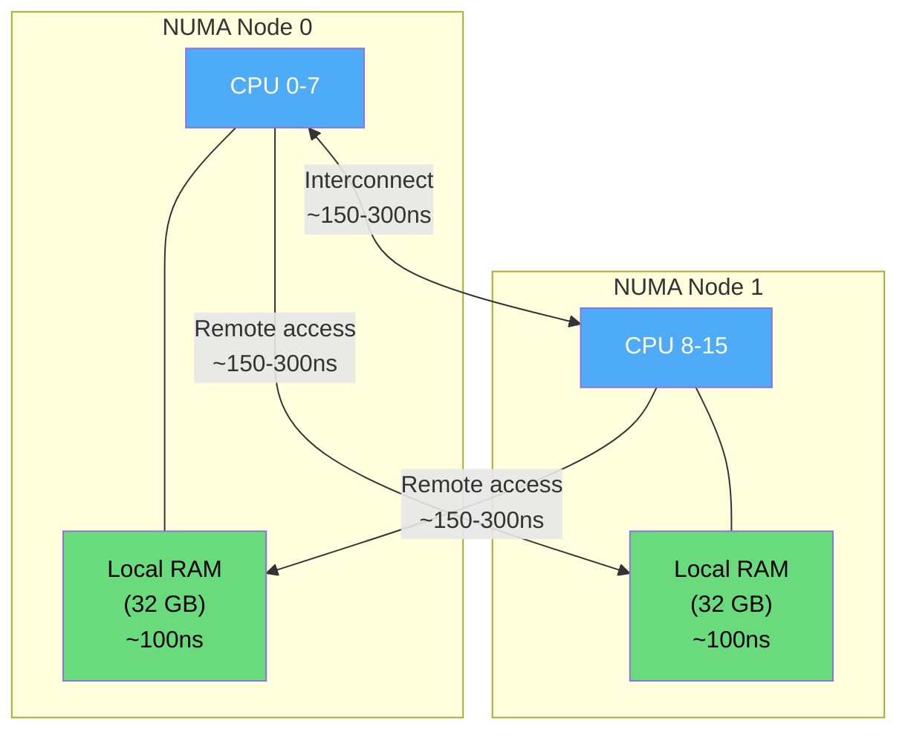
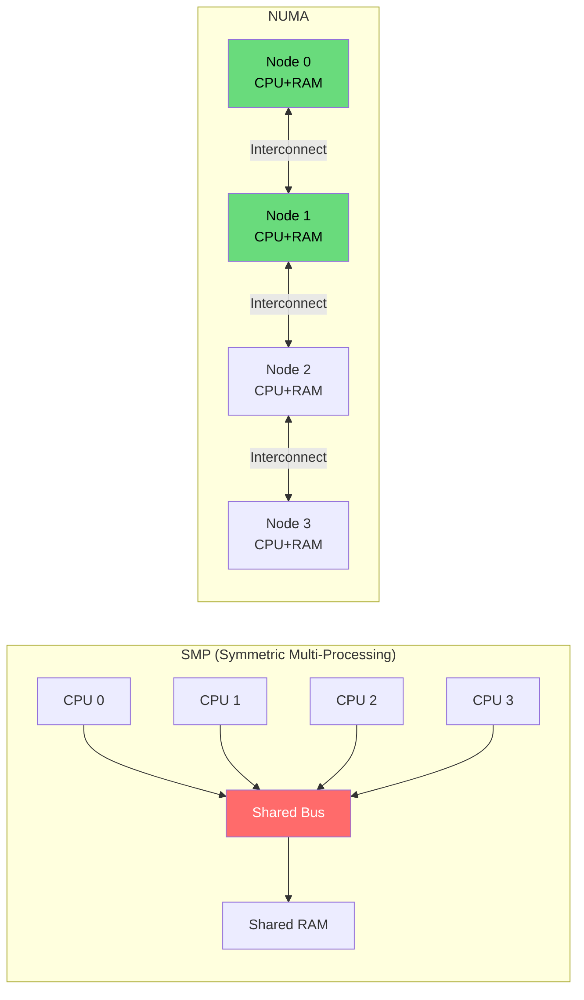
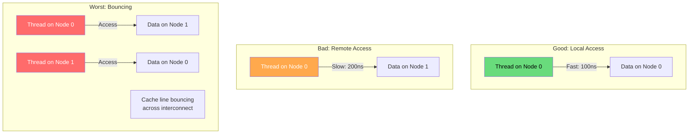

# NUMA (Non-Uniform Memory Access)

NUMA is a memory architecture where memory access time depends on the memory's location relative to the processor. Each CPU has "local" memory (fast) and can access "remote" memory attached to other CPUs (slower).

## Overview



## Why NUMA Exists

As CPU core counts increase, a single shared memory bus becomes a bottleneck:



## NUMA Characteristics

| Access Type | Latency | Bandwidth | Relative Cost |
|-------------|---------|-----------|---------------|
| Local (same node) | ~100 ns | ~50 GB/s | 1x |
| 1 hop (neighbor) | ~150-200 ns | ~30 GB/s | 1.5-2x |
| 2 hops | ~200-300 ns | ~20 GB/s | 2-3x |

## Checking NUMA Configuration

```bash
# Show NUMA topology
$ numactl --hardware
available: 2 nodes (0-1)
node 0 cpus: 0 1 2 3 4 5 6 7
node 0 size: 32768 MB
node 0 free: 16384 MB
node 1 cpus: 8 9 10 11 12 13 14 15
node 1 size: 32768 MB
node 1 free: 15000 MB
node distances:
node   0   1
  0:  10  21
  1:  21  10

# Detailed NUMA info
$ lscpu | grep -i numa
NUMA node(s):        2
NUMA node0 CPU(s):   0-7
NUMA node1 CPU(s):   8-15

# Per-node memory stats
$ numastat
                           node0           node1
numa_hit              123456789       987654321
numa_miss               1234567         2345678
numa_foreign            2345678         1234567
interleave_hit             1234            1234
local_node            98765432       876543210
other_node             1234567         2345678

# Per-process NUMA stats
$ numastat -p $(pgrep -f firefox | head -1)
Per-node process memory usage (in MBs)
PID             Node 0   Node 1    Total
1234 (firefox)    512      128      640

# NUMA distance matrix (relative latency)
$ cat /sys/devices/system/node/node0/distance
10 21
# 10 = local, 21 = remote (2.1x slower)
```

## NUMA Memory Policies

### Default Policy: Local Allocation

```bash
# Default: allocate on the node where the thread is running
$ numactl --show
policy: default
preferred node: current
physcpubind: 0 1 2 3 4 5 6 7
cpubind: 0
nodebind: 0
membind: 0 1
```

### Bind to Specific Node

```bash
# Run on CPUs 0-7, allocate memory only from node 0
$ numactl --cpunodebind=0 --membind=0 ./my_program

# Bind to node 1
$ numactl --cpunodebind=1 --membind=1 ./my_program

# Allow both nodes but prefer node 0
$ numactl --preferred=0 ./my_program
```

### Interleave Policy

```bash
# Round-robin allocation across all nodes
# Good for large data structures accessed by all CPUs
$ numactl --interleave=all ./my_program

# Check interleave effect
$ numastat -p $(pgrep -f my_program)
# Should show roughly equal memory on both nodes
```

## NUMA in Linux Kernel

### Node and Zone Structure

```c
// Linux NUMA data structures (simplified)

struct pglist_data {  // One per NUMA node
    struct zone node_zones[MAX_NR_ZONES];  // DMA, Normal, HighMem
    int node_id;
    unsigned long node_present_pages;
    unsigned long node_spanned_pages;
    struct zonelist node_zonelists[MAX_ZONELISTS];
    // ...
};

// Memory allocation falls back to other nodes if local is full
struct zonelist {
    struct zoneref _zonerefs[MAX_ZONES_PER_ZONELIST];
    // Ordered by preference: local node first, then remote
};
```

### Allocation with NUMA Awareness

```c
#include <numaif.h>
#include <numa.h>
#include <stdio.h>
#include <stdlib.h>

int main() {
    // Check NUMA availability
    if (numa_available() < 0) {
        printf("NUMA not available\n");
        return 1;
    }
    
    printf("Number of nodes: %d\n", numa_num_configured_nodes());
    printf("Current node: %d\n", numa_node_of_cpu(sched_getcpu()));
    
    // Allocate memory on specific node
    size_t size = 1024 * 1024;  // 1 MB
    void *ptr = numa_alloc_onnode(size, 0);  // Allocate on node 0
    if (!ptr) {
        perror("numa_alloc_onnode");
        return 1;
    }
    
    // Touch the memory (forces actual allocation)
    memset(ptr, 0, size);
    
    // Check which node the memory is on
    int node = -1;
    get_mempolicy(&node, NULL, 0, ptr, MPOL_F_NODE | MPOL_F_ADDR);
    printf("Memory allocated on node: %d\n", node);
    
    numa_free(ptr, size);
    
    // Set memory policy for current thread
    unsigned long nodemask = 1 << 0;  // Node 0
    set_mempolicy(MPOL_BIND, &nodemask, NUMA_NUM_NODES);
    
    // Now all allocations will be on node 0
    void *ptr2 = malloc(size);
    memset(ptr2, 0, size);
    free(ptr2);
    
    return 0;
}

// Compile: gcc -lnuma numa_example.c -o numa_example
```

## NUMA Effects on Performance

### Memory Access Patterns



### Benchmark: Local vs Remote Access

```c
#include <stdio.h>
#include <stdlib.h>
#include <string.h>
#include <time.h>
#include <numa.h>
#include <numaif.h>
#include <sched.h>

#define SIZE (64UL * 1024 * 1024)  // 64 MB
#define ITERATIONS 10000000

double benchmark_access(void *mem, size_t size) {
    struct timespec start, end;
    volatile long sum = 0;
    
    clock_gettime(CLOCK_MONOTONIC, &start);
    for (int i = 0; i < ITERATIONS; i++) {
        size_t idx = (i * 64) % size;  // Stride to avoid prefetch
        sum += ((volatile char*)mem)[idx];
    }
    clock_gettime(CLOCK_MONOTONIC, &end);
    
    double elapsed = (end.tv_sec - start.tv_sec) + 
                     (end.tv_nsec - start.tv_nsec) / 1e9;
    return elapsed;
}

int main() {
    int current_node = numa_node_of_cpu(sched_getcpu());
    int remote_node = (current_node + 1) % numa_num_configured_nodes();
    
    printf("Current node: %d, Remote node: %d\n", current_node, remote_node);
    
    // Allocate on local node
    void *local_mem = numa_alloc_onnode(SIZE, current_node);
    memset(local_mem, 1, SIZE);
    
    // Allocate on remote node
    void *remote_mem = numa_alloc_onnode(SIZE, remote_node);
    memset(remote_mem, 1, SIZE);
    
    double local_time = benchmark_access(local_mem, SIZE);
    double remote_time = benchmark_access(remote_mem, SIZE);
    
    printf("Local access:  %.3f seconds\n", local_time);
    printf("Remote access: %.3f seconds\n", remote_time);
    printf("Slowdown: %.1fx\n", remote_time / local_time);
    
    numa_free(local_mem, SIZE);
    numa_free(remote_mem, SIZE);
    return 0;
}

// Typical output:
// Local access:  1.234 seconds
// Remote access: 1.876 seconds
// Slowdown: 1.5x
```

## NUMA and Page Allocation

```bash
# View per-node page allocation stats
$ cat /proc/buddyinfo
Node 0, zone      DMA      1      0      0      1      1      1      0
Node 0, zone    DMA32      8      5      2      3      2      2      1
Node 0, zone   Normal    142     65     32     15      8      4      2
Node 1, zone   Normal    156     78     40     20     10      5      2

# Per-node memory info
$ cat /sys/devices/system/node/node0/meminfo
Node 0 MemTotal:   33554432 kB
Node 0 MemFree:    16777216 kB
Node 0 MemUsed:    16777216 kB

# Monitor NUMA migrations
$ perf stat -e numa:numa_migrate_mem ./my_program

# See NUMA balancing activity
$ grep -i numa /proc/vmstat
numa_hit 123456789
numa_miss 1234567
numa_foreign 2345678
numa_interleave 1234
numa_pte_updates 56789
numa_huge_pte_updates 123
numa_hint_faults 4567
numa_hint_faults_local 3456
numa_pages_migrated 2345
```

## Automatic NUMA Balancing

Linux can automatically migrate pages to the local node:

```bash
# Enable/disable automatic NUMA balancing
$ cat /proc/sys/kernel/numa_balancing
1  # Enabled by default

$ echo 0 | sudo tee /proc/sys/kernel/numa_balancing  # Disable

# NUMA balancing uses:
# 1. Page fault tracking (numa_hint_faults)
# 2. Task migration (move thread to node with most memory)
# 3. Page migration (move memory to node where thread runs)

# Tune NUMA balancing
$ cat /proc/sys/kernel/numa_balancing_scan_delay_ms
1000
$ cat /proc/sys/kernel/numa_balancing_scan_period_min_ms
1000
$ cat /proc/sys/kernel/numa_balancing_scan_period_max_ms
60000
$ cat /proc/sys/kernel/numa_balancing_scan_size_mb
256
```

## Database NUMA Optimization

### PostgreSQL NUMA Configuration

```bash
# Check PostgreSQL NUMA awareness
$ numastat -p $(pgrep -f postgres | head -1)

# PostgreSQL can use huge pages + NUMA
# postgresql.conf:
# huge_pages = try
# (No direct NUMA setting, but use numactl)

# Run PostgreSQL with NUMA binding
$ numactl --interleave=all postgres -D /data

# Or bind to specific node
$ numactl --cpunodebind=0 --membind=0 postgres -D /data
```

### Redis NUMA

```bash
# Redis is single-threaded, bind to one NUMA node
$ numactl --cpunodebind=0 --membind=0 redis-server

# For Redis Cluster, spread instances across nodes
$ numactl --cpunodebind=0 --membind=0 redis-server --port 7000
$ numactl --cpunodebind=1 --membind=1 redis-server --port 7001
```

## Multi-Socket vs NUMA

```bash
# Check if system is multi-socket
$ sudo dmidecode -t processor | grep -i "socket\|core"
Socket Designation: CPU1
Core Count: 16
Socket Designation: CPU2
Core Count: 16

# AMD EPYC NUMA modes (NPS)
# NPS1: All memory on one node (UMA-like)
# NPS2: Split into 2 NUMA nodes
# NPS4: Split into 4 NUMA nodes

# Intel Xeon NUMA modes (SNC - Sub NUMA Clustering)
# SNC disabled: 1 NUMA node per socket
# SNC2: 2 NUMA nodes per socket
# SNC4: 4 NUMA nodes per socket

# Check current mode
$ numactl --hardware
# Shows actual NUMA topology as configured
```

## Interview Questions

### Beginner

**Q1: What is NUMA?**
A: Non-Uniform Memory Access is a memory architecture where each CPU has local memory that's faster to access than memory attached to other CPUs. "Non-uniform" means access time varies depending on which node the data is on.

**Q2: Why does NUMA matter for performance?**
A: Accessing remote NUMA memory is 1.5-3x slower than local memory. For memory-intensive applications, having data on the wrong NUMA node can significantly degrade performance. Proper NUMA awareness can yield 20-50% improvement.

**Q3: How do you check NUMA topology on Linux?**
A: Use `numactl --hardware` to see nodes, CPUs, memory, and distance matrix. Use `lscpu | grep numa` for a quick overview. Use `numastat` to see per-node allocation statistics.

### Intermediate

**Q4: What is the difference between --membind and --interleave?**
A: 
- `--membind=node`: All memory allocated only on specified node. Fails if node is full.
- `--interleave=all`: Memory allocated round-robin across all nodes. Good for data accessed from all nodes (reduces hotspots).

**Q5: How does Linux automatic NUMA balancing work?**
A: The kernel monitors page faults to detect "remote" accesses. When a thread frequently accesses pages on a remote node, the kernel either: (1) migrates the pages to the local node, or (2) migrates the thread to the node where its pages are. Uses sampling (not every access) to minimize overhead.

**Q6: When should you disable automatic NUMA balancing?**
A: When: (1) you've already manually bound processes and memory, (2) the workload has intentional cross-node sharing (e.g., producer-consumer), (3) migration overhead exceeds the benefit, or (4) you're running latency-sensitive applications where migration pauses are unacceptable.

### Advanced / FAANG-Level

**Q7: Design a memory allocator for a multi-NUMA-node system running a database with 1 TB buffer pool.**
A: 
1. **Partition buffer pool by node**: Each NUMA node gets a proportional share (e.g., 2 nodes → 500 GB each).
2. **Thread-to-node binding**: Database worker threads bound to specific NUMA nodes via `pthread_attr_setaffinity_np`.
3. **Page allocation**: Use `mbind(MPOL_BIND)` to ensure each node's buffer pool pages are on that node.
4. **Hash partitioning**: Partition database pages by hash, so each node handles a subset of data. Threads only access local data.
5. **Cross-node access**: For queries spanning nodes, use a two-phase approach: each node processes local data, then merge results.
6. **Huge pages per node**: Reserve huge pages on each node (`echo N > /sys/devices/system/node/nodeX/hugepages/hugepages-2048kB/nr_hugepages`).
7. **Monitoring**: Per-node hit rates, cross-node traffic via `numastat`.

**Q8: A 4-NUMA-node system shows 30% of memory accesses going to remote nodes. Analyze and fix.**
A: 
1. **Diagnose**: `numastat -p <pid>` shows per-node allocation. `perf stat -e numa:numa_miss` quantifies misses.
2. **Root causes**:
   - Threads not pinned to nodes (wandering)
   - Memory allocated before thread affinity was set
   - Shared data structures accessed from all nodes
   - Automatic NUMA balancing migrating pages incorrectly
3. **Fixes**:
   - Pin threads: `numactl --cpunodebind=N` or `sched_setaffinity`
   - Set memory policy before allocation: `set_mempolicy(MPOL_BIND, &nodemask, ...)`
   - Interleave truly shared data: `mbind(shared_buf, size, MPOL_INTERLEAVE, ...)`
   - Disable auto-balancing if manual binding is done: `echo 0 > /proc/sys/kernel/numa_balancing`
4. **Verify**: `numastat` should show local_node >> other_node for each process.

**Q9: Explain how the Linux page allocator handles NUMA.**
A: 
1. Each NUMA node has its own free page lists (per-zone, per-order).
2. Default allocation: try local node first.
3. If local node is low: fall back to other nodes (zonelist ordering).
4. Zonelist order: local node zones → remote node zones (by distance).
5. `MPOL_BIND`: Only allocate from specified nodes (fail if unavailable).
6. `MPOL_INTERLEAVE`: Round-robin across specified nodes.
7. `MPOL_PREFERRED`: Try preferred node first, fall back to others.
8. Watermarks: each node has min/low/high watermarks. When below low, kswapd reclaims on that node.
9. Compaction: per-node compaction to create contiguous regions for huge pages.
10. NUMA balancing: kernel samples page accesses, migrates pages to local node.

## Common Mistakes

1. **Not binding threads and memory together** — Threads wander, memory stays put, remote access results.
2. **Allocating memory before setting affinity** — Default policy uses the allocating thread's node.
3. **Ignoring NUMA for single-threaded apps** — Even single-threaded apps benefit from local memory allocation.
4. **Over-binding** — Binding too strictly can cause OOM on one node while another has free memory.
5. **Not considering shared data** — Truly shared data should be interleaved, not bound to one node.

## Summary

| Aspect | Details |
|--------|---------|
| **Architecture** | Each CPU has local memory (fast) and remote access (slow) |
| **Latency** | Local: ~100ns, Remote: ~150-300ns |
| **Linux Tools** | numactl, numastat, /proc/zoneinfo |
| **Policies** | Default, bind, preferred, interleave |
| **Auto-balancing** | Kernel migrates pages to local node |
| **Best Practice** | Bind threads + memory to same node |
| **Shared Data** | Use interleave policy |

## Cross-References

- **Related**: [Huge Pages](./huge-pages.md) — huge pages per NUMA node
- **Related**: [Page Tables](./page-tables.md) — page allocation is NUMA-aware
- **Related**: [Buddy System](./buddy-system.md) — per-node buddy allocators
- **Related**: [Swapping](./swapping.md) — swap should prefer local node
- **Virtual Memory**: [Working Set](../virtual-memory/working-set.md) — keep working set local
