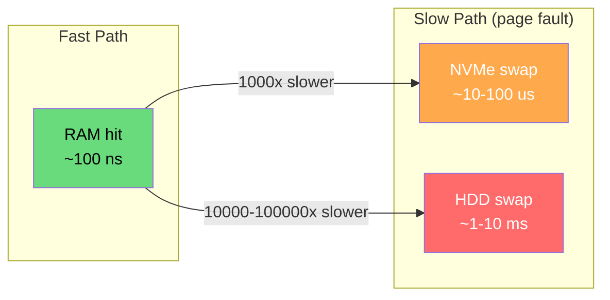
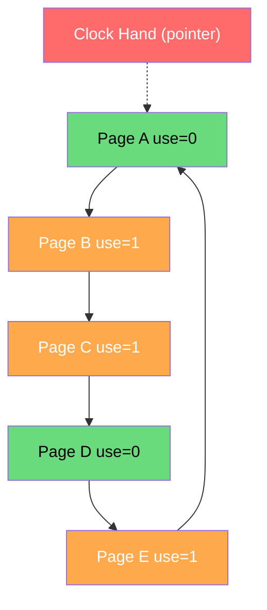
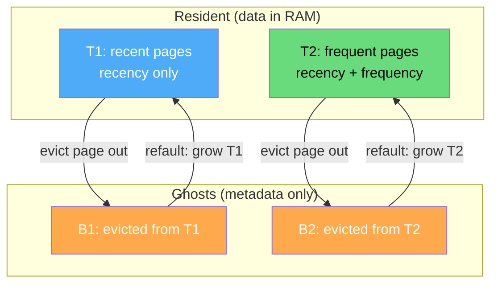
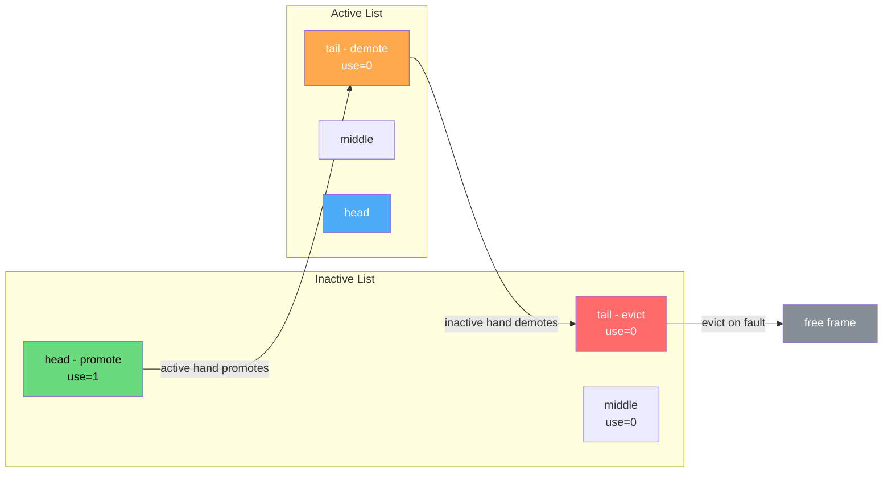

# Page Replacement Algorithms

When a running process touches a virtual address whose page is not currently mapped to a physical frame, the MMU raises a page fault. If memory has a free frame, the kernel simply loads the page from disk. If memory is full, however, the kernel must first evict some other page to make room. **Page replacement algorithms** decide which victim to evict, and that choice dominates the cost of virtual memory: a good algorithm keeps the working set resident and faults rarely, while a poor one thrashes, spending more time moving pages to and from swap than executing user code. This page is a deep dive into the algorithms that span sixty years of systems research — from Belády's 1966 theoretical optimum, through the practical clock/second-chance family that powers most production kernels, to the self-tuning hybrids (ARC, LIRS, CLOCK-Pro) used in modern databases and file caches.

## Motivation: Why Replacement Matters

Physical RAM is a tiny fraction of the addressable virtual space. A 64-bit process can theoretically address 16 exabytes, while a typical server has 64–256 GB of DRAM. Even with demand paging (only bringing in pages that are actually touched), the resident set of a busy database or browser routinely exceeds physical memory. When the kernel runs out of free frames, it must reclaim one — and the choice of *which* frame to reclaim determines whether the next instruction hits in memory (≈100 ns) or faults to disk (10–100 µs on NVMe-backed swap, 1–10 ms on HDD-backed swap). That gap of three to five orders of magnitude is why replacement policy is the single most performance-critical piece of a VM subsystem.

The saving grace is **locality of reference**. Real programs do not touch their address space uniformly: they execute loops over a small region (**temporal locality**), walk arrays sequentially (**spatial locality**), and concentrate their activity in a **working set** of perhaps a few hundred pages at any moment. Peter Denning's 1968 working-set model showed that if the kernel can identify and protect the working set, fault rates drop dramatically. Every replacement algorithm below is, at heart, a heuristic for guessing the working set from past behavior — because the only perfect predictor would require knowing the future.



The fault cost is not just the I/O. A major fault on a dirty page requires a write-back before the read-in; the faulting process is descheduled while waiting; the TLB must be flushed on the evicting CPU if the victim was mapped; and on multi-socket NUMA systems, the replacement may cross a node boundary, doubling the effective latency. Good replacement policy minimizes *both* the fault count and the dirty-page write-back count — which is why enhanced second-chance (below) treats the modified bit as a second-class signal.

## Theoretical Foundation: OPT/MIN (Belády's Optimal)

The **OPT** algorithm, also called **MIN** and published by László Belády in 1966, is the theoretical ceiling on replacement quality. OPT evicts the page that will not be used for the longest time in the *future*. If a page is never referenced again, it is evicted immediately; otherwise the victim is the one whose next reference is farthest away. OPT provably produces the minimum possible number of page faults for any reference string and frame count, which makes it the benchmark against which every implementable algorithm is measured — typically LRU comes within a few percent of OPT on real traces, while FIFO can be 30–50% worse.

OPT is not implementable in an online system because it requires knowledge of the future reference stream. It is occasionally used offline: profilers, trace-driven cache simulators, and compiler data prefetchers can know the future because they see the whole program. In online kernels, OPT is purely a yardstick — a paper introducing a new policy typically reports its hit ratio as "within X% of OPT" on standard traces such as the SPEC benchmarks or the UMass trace repository.

```text
OPT(reference_string, num_frames):
    frames = {}
    for i, page in enumerate(reference_string):
        if page in frames:
            record_hit(page)
            continue
        record_fault(page)
        if len(frames) < num_frames:
            frames.add(page)
        else:
            # find the page whose NEXT use is farthest in the future
            victim = page_with_max_next_use(frames, i)
            frames.remove(victim)
            frames.add(page)
```

The key insight from Belády's analysis is that *good* replacement is about predicting the future from the past — and the strongest predictors available are **recency** (LRU) and **frequency** (LFU), with hybrids like ARC and LIRS trying to combine both while remaining cheap enough to run on every fault.

## FIFO and the Belády Anomaly

**FIFO** (First-In, First-Out) is the simplest replacement policy: maintain a queue of resident pages in arrival order, and when eviction is needed, pop the head of the queue. FIFO needs no per-access bookkeeping — the queue is updated only on faults — so it is trivial to implement and was used by early OSes such as the CDC 6600 supervisor. Its fatal flaw is that it ignores whether a page is being used: a heavily-referenced page that arrived early will still be evicted just because it is old. FIFO is also blind to dirty pages, so it pays the write-back cost on every eviction of a modified page.

FIFO also exhibits **Belády's anomaly**: under certain reference strings, *increasing* the number of frames *increases* the number of faults. The classic demonstration uses the reference string `1,2,3,4,1,2,5,1,2,3,4,5`:

| Frames | FIFO Faults | OPT Faults | LRU Faults |
|--------|-------------|------------|------------|
| 3 | 9 | 7 | 10 |
| 4 | **10** (anomaly!) | 6 | 8 |

With 3 frames FIFO faults 9 times; with 4 frames it faults 10 times — one more, despite having *more* memory. The anomaly arises because FIFO does not satisfy the **stack property**: the set of pages resident with `n` frames is not necessarily a subset of those resident with `n+1` frames. LRU and OPT are *stack algorithms* and are therefore immune to the anomaly. This is more than a curiosity — it means FIFO cannot be safely used in systems where memory size is dynamically tuned, and it is the reason no modern general-purpose OS uses raw FIFO for page replacement.

## LRU: Recency-Based Eviction

**LRU** (Least Recently Used) evicts the page whose most recent access is the oldest. It rests on the assumption of temporal locality: a page touched recently is likely to be touched again soon, so the coldest page is the best eviction candidate. LRU is a *stack algorithm* — the resident set with `n` frames is always a subset of the set with `n+1` frames — which means it never exhibits Belády's anomaly and its fault count is monotonically non-increasing in frame count. On real traces, LRU typically lands within a few percent of OPT.

The hard part is implementation. True LRU requires updating a per-page timestamp or moving the page to the head of a list on **every** memory access, not just on faults. On a CPU issuing billions of memory references per second, this per-access cost is prohibitive. Three classic implementations trade off complexity, space, and per-access cost; none is cheap enough to run unmodified on every load and store in a modern kernel:

| Implementation | Per-Access Cost | Eviction Cost | Space | Notes |
|----------------|-----------------|---------------|-------|-------|
| Counter (timestamp) | O(1) write | O(n) scan | n counters | Needs a global monotonic clock |
| Stack (doubly-linked list + hash) | O(1) move-to-front | O(1) pop tail | 2 pointers/page | True LRU; expensive in hardware |
| Matrix (n×n bit matrix) | O(n) row/col update | O(n) find min row | n² bits | Only viable for tiny n |

```text
LRU-Stack on_access(page):
    if page in hash:
        node = hash[page]
        list.remove(node)
        list.push_front(node)
    else:
        node = new Node(page)
        hash[page] = node
        list.push_front(node)
        if len(list) > capacity:
            victim = list.pop_tail()       # coldest page
            del hash[victim.page]
            evict(victim)
```

Because true LRU is too expensive to implement in hardware for thousands of pages, every production OS uses an **LRU approximation** — the most important of which is the clock / second-chance family described next. The mathematical ideal remains useful as a design target: when an approximation is shown to match LRU's hit ratio on production traces, that is considered sufficient justification to ship it.

The expected fault rate under LRU is governed by the **stack distance** distribution. If `d(p)` is the number of distinct pages accessed between two consecutive references to page `p`, then `p` causes a fault iff `d(p) >= num_frames`. The per-reference fault probability is therefore

\\[
F_{\text{LRU}}(n) \;=\; \Pr\bigl[\, d(p) \geq n \,\bigr]
\\]

which is monotonically non-increasing in the frame count `n` — the formal proof that LRU is a stack algorithm and never suffers Belády's anomaly. OPT has the analogous formula with "next-use distance" replacing stack distance, which is why OPT is also a stack algorithm and lower-bounds LRU.

## LRU Approximations: Clock and Second Chance

The **clock algorithm** (also called **second chance**) is the workhorse LRU approximation. Each page has a single hardware **use bit** (also called the reference or accessed bit), which the MMU sets automatically on any read or write — no kernel intervention needed. The kernel maintains a circular list of resident pages and a single pointer, the **hand**. On a fault, the hand inspects the page it points at: if the use bit is 0, the page has not been touched since the last sweep and is evicted; if the use bit is 1, the kernel clears it and advances the hand, giving the page a "second chance." This costs O(1) amortized per eviction and needs no per-access kernel work — the hardware use bit does the tracking for free.



In the diagram, the hand points at Page A (use=0). The hand will evict A immediately because A was not referenced since the last sweep. Had A's bit been 1, the kernel would clear it and move on to B, then C — clearing their bits — until it finds D (use=0) and evicts it. The clock algorithm approximates LRU because pages accessed recently have their use bits set and survive one full sweep; only pages untouched for an entire revolution are evicted. The cost is one pass around the ring per eviction in the worst case, but amortized O(1) because each page's bit is cleared at most once per sweep.

**Enhanced second chance** adds the **modified** (dirty) bit as a second signal, producing four classes. Eviction prefers clean unused pages (no write-back needed) over dirty unused pages, because evicting a dirty page forces a synchronous write to swap before the frame can be reused:

| Class | Use | Modified | Cost to Evict | Priority |
|-------|-----|----------|---------------|----------|
| 0 | 0 | 0 | Cheap (no I/O) | Evict first |
| 1 | 0 | 1 | Must write back | Evict second |
| 2 | 1 | 0 | Cheap, but recently used | Skip, clear use |
| 3 | 1 | 1 | Expensive, recently used | Skip, clear use |

The hand sweeps looking for class 0 first; if none exists, it settles for class 1 (and schedules the dirty write-back asynchronously). This minimizes the synchronous I/O on the fault path, which is the latency-critical operation in a page-fault handler.

## Advanced Recency/Frequency Hybrids

### LRU-K

**LRU-K** (O'Neil et al., 1993) generalizes LRU from "last reference" to "K-th-most-recent reference." Each page records the timestamps of its last K accesses; the victim is the page whose K-th-back reference is oldest. With K=2 or K=3, LRU-K filters out one-shot scan traffic that pollutes plain LRU: a page read once during a sequential scan has only one recorded reference and is evicted before pages with established histories. LRU-K is the conceptual ancestor of the database buffer-pool policies used by DB2 and Informix, and it directly motivates the "frequency" axis that ARC and LIRS exploit. Its weakness is the storage cost — K timestamps per page — and the O(log n) heap maintenance on each access, which is why production systems usually reach for the cheaper clock-based variants (CLOCK-Pro) that achieve similar scan resistance.

### LFU and Aging

**LFU** (Least Frequently Used) keeps a per-page access counter and evicts the page with the smallest count. LFU captures long-term popularity better than LRU: a page accessed thousands of times is unlikely to be cold soon, regardless of how recently it was touched. LFU suffers from the **stale hot page** problem, however: a page that was accessed a million times yesterday and never again still has a high count and refuses to leave, even though it is now cold. The standard fix is **aging** — periodically halving every counter so that old popularity decays and new pages can compete:

```text
LFU with aging, every T seconds:
    for each page p in cache:
        p.count = p.count >> 1     # decay by half
    # newly inserted pages start with count = 1
```

Even with aging, pure LFU is rarely deployed alone; it is combined with recency (as in Redis's `allkeys-lfu` policy, which uses a Morris-style probabilistic counter with exponential decay) or wrapped in a hybrid like ARC.

### ARC: Adaptive Replacement Cache

**ARC** (Megiddo & Modha, FAST '03) is a self-tuning policy that dynamically balances recency and frequency. It maintains *four* lists: **T1** (recent pages, LRU-style), **T2** (frequent pages, recently used twice or more), **B1** (ghost entries recently evicted from T1 — the page data is gone but its metadata remains), and **B2** (ghost entries recently evicted from T2). When a fault hits a ghost entry in B1, ARC infers that the working set is larger than T1's target and grows T1 at T2's expense; a hit in B2 shrinks T1 and grows T2. This **adaptive** resizing means ARC automatically finds the right recency/frequency mix without operator tuning.



The genius of ARC is that the ghost lists cost almost nothing (just page IDs, no data) yet provide the feedback signal that lets the policy self-tune. ARC is widely deployed in ZFS's ARC (literally — the algorithm was named after the cache) and in IBM's storage controllers. The penalty is modest: four list heads and a per-page tag indicating which list the page belongs to.

### LIRS

**LIRS** (Jiang & Zhang, SIGMETRICS '02) distinguishes **LIR** (Low Inter-reference Recency — hot) pages from **HIR** (High Inter-reference Recency — cold) pages based on the **inter-reference recency** (IRR): the number of references between two consecutive accesses to the same page. Pages with low IRR are hot and stay resident; pages with high IRR are cold and become eviction candidates even if recently touched. The inter-reference recency is \\(\text{IRR}(p)\\), and a page is promoted to LIR status when its observed IRR drops below a threshold. The hit rate under LIRS is bounded above by OPT and typically within 5% of it on scan-heavy traces, versus 20–40% gaps for plain LRU on the same traces. LIRS uses a small resident HIR set plus a ghost HIR set for adaptation, and is more memory-efficient than ARC because the LIR set (the vast majority of resident pages) needs no per-access list manipulation — only the small HIR set is reordered on each access.

### CLOCK-Pro

**CLOCK-Pro** (Jiang et al., USENIX '05) brings LIRS's ideas into the clock-hand framework, using three logical lists — **hot**, **cold-resident**, and **non-resident** (ghost) — swept by a single clock hand. Pages survive multiple sweeps to earn hot status; cold-resident pages are eviction candidates; ghost entries remember recently evicted cold pages so a re-reference promotes them directly to hot. CLOCK-Pro matches LIRS's hit ratio while keeping the O(1)-per-eviction simplicity of the classic clock, and is the basis of Linux's experimental CLOCK-PRO patchset and of several flash-storage firmware implementations. Its key trick is the **test period**: a newly loaded page enters as cold-resident with a short test window, and only if it is re-referenced within that window does it graduate to hot — a cheap online approximation of IRR.

## Working Set Model (Denning 1968)

Peter Denning's **working set** model formalized locality: at any time `t`, a process has a working set \\(W(t, \tau)\\) consisting of the pages it touched in the last \\(\tau\\) time units (the **window size**). If the kernel can keep \\(W(t, \tau)\\) resident for every runnable process, fault rate stays low and throughput is bounded only by CPU; if memory cannot hold all working sets simultaneously, the system **thrashes** and throughput collapses. Replacement under the working set model is conceptually simple — evict pages not in the working set — but estimating \\(\tau\\) and detecting membership online is hard.

Modern kernels approximate this with **scanning**: the inactive list is scanned periodically, and pages whose use bit is set during a scan interval are presumed in the working set and promoted; pages untouched across multiple scans are evicted. The window size \\( \tau \\) is implicitly the scan period. The working set concept also drives **swappiness** tuning and the load-control policies that swap out entire processes under heavy memory pressure — if the sum of working sets exceeds memory, the kernel suspends processes until the remainder fits, rather than letting all of them thrash. This is the OS-level analogue of backpressure in a queueing system.

## Linux Kernel Implementation

Linux does not implement true LRU. Instead it maintains two lists per memory zone — **active** and **inactive** — swept by **two hands**: the **active hand** moves pages from inactive to active (promotion), and the **inactive hand** moves pages from active to inactive (demotion) and ultimately evicts from the tail of inactive. The MMU's accessed bit is the only per-access signal; the hands clear it during periodic scans, and pages whose bit was set since the last scan are presumed "recently used" and protected.



The crucial innovation in `mm/workingset.c` is **refault distance** — when an evicted page is referenced again (a refault), the kernel measures how many pages were evicted between the original eviction and the refault. A short refault distance means the page was evicted too soon (it was in the working set); the kernel then biases future evictions to protect similar pages and, on the second such refault, **promotes** the page directly to the active list. This is **workingset protection**: pages that survive multiple inactive-list scans earn residency, and pages that refault quickly get a second chance at the active list.

Linux also separates **file-backed** pages (page cache, mmap of files) from **anonymous** pages (heap, stack). The `vm.swappiness` sysctl (0–100) biases reclaim toward one or the other: low swappiness prefers evicting clean file pages (no I/O), high swappiness prefers swapping anonymous pages. Database servers typically run with swappiness=10 to keep anonymous (heap) pages resident. On NUMA systems, each node has its own zone lists and the reclaim hand runs per-node, so pages are reclaimed locally first to avoid cross-node traffic. The newer **MGLRU** (Multi-Generational LRU, merged in 6.1) replaces the two-list scheme with a generational ladder that is more efficient under working-set churn — pages are grouped into generations, and the youngest generation is evicted first, with promotion based on access-bit evidence collected during scans.

## Real-World Systems

Different workloads favor different policies, and production systems reflect that diversity. **Redis** offers both approximated LRU (sampling N keys and evicting the oldest) and approximated LFU (with a Morris-style probabilistic counter that decays over time), selectable via `maxmemory-policy`. Sampling avoids the per-access cost of maintaining a true LRU list across millions of keys. **Memcached** uses an LRU per slab class with a background thread that lazily evicts expired items, and maintains a "temporary" LRU for objects fetched only once. **PostgreSQL** uses a **clock-sweep** algorithm over its shared buffer pool: a hand sweeps the buffer ring, decrementing a usage count on each pass; buffers with count 0 are reused, and buffers that are touched get their count bumped back up — a frequency-biased clock variant that is cheap and works well for OLTP.

**ZFS** uses ARC (literally — the Adaptive Replacement Cache paper was written at IBM Research to improve ZFS). **Windows** uses a working-set-trim policy driven by per-process working set estimates, with the kernel trimming working sets under pressure and growing them on demand. The Linux kernel's page cache uses the two-list + workingset scheme described above (or MGLRU on 6.1+). The common thread across all of these: nobody runs textbook LRU in production — the winning policies are all approximations or hybrids tuned to the workload, and the self-tuning ones (ARC, CLOCK-Pro, workingset) are gaining ground because manual tuning does not survive workload changes.

### Global vs Local Replacement

A separate axis from *which* algorithm to use is *whose* pages the algorithm is allowed to evict. **Local replacement** restricts the victim set to pages belonging to the faulting process — each process has its own frame quota and its own LRU/clock list, and a fault in process A can only evict a page from A. Local replacement gives predictable per-process performance (a thrashing process cannot steal frames from its neighbors) but wastes memory: a process whose working set has temporarily shrunk keeps frames it no longer needs while a neighbor faults unnecessarily. **Global replacement** allows the kernel to evict any page in the system, which maximizes memory utilization but lets a scan-heavy process flush the hot sets of every other process on the machine. Most production kernels (Linux, Windows, FreeBSD) use global replacement with per-cgroup or per-job memory limits to recover the fairness properties of local replacement without its utilization penalty — cgroup `memory.max` effectively defines a local replacement domain within the global pool.

## Comparison of Algorithms

The tables below distill the design space along five axes: per-access cost (what the hardware or kernel pays on every load and store), eviction cost (what a fault pays to find a victim), susceptibility to Belády's anomaly (whether adding memory can ever hurt), the information each policy must maintain, and the workload class each policy is best suited for. The first table compares the classic and modern algorithms head to head; the second isolates the four hybrid policies (LFU, ARC, LIRS, CLOCK-Pro) on the axes that distinguish them; the third surveys what production systems actually run; and the fourth is a quick-reference summary of the whole page.

| Algorithm | Per-Access Cost | Eviction Cost | Belády Anomaly? | Info Needed | Best For |
|-----------|-----------------|---------------|-----------------|-------------|----------|
| OPT | N/A (offline) | O(n) scan future | No | Future trace | Theoretical bound |
| FIFO | O(1) | O(1) | **Yes** | None | Trivial teaching example |
| LRU | O(1) (true) | O(1) | No | Last access time | General-purpose (in theory) |
| Clock | 0 (hardware) | O(1) amortized | No | Use bit | OS page cache |
| Enhanced Clock | 0 (hardware) | O(1) amortized | No | Use + dirty bits | OS with dirty-page awareness |
| LFU | O(1) counter | O(log n) heap | No (but stale) | Access count | Stable popular set |
| ARC | O(1) | O(1) | No | 4 lists + ghosts | Self-tuning file cache |
| LIRS | O(1) | O(1) | No | IRR history | Scan-resistant workloads |
| CLOCK-Pro | 0 (hardware) | O(1) | No | 3 lists + ghosts | Modern scan-resistant OS |

| Aspect | LFU | ARC | LIRS | CLOCK-Pro |
|--------|-----|-----|------|-----------|
| Signal | Frequency | Recency + frequency | Inter-reference recency | IRR via clock |
| Stale hot pages? | **Yes** (without aging) | No (ghosts detect) | No (IRR decays) | No |
| Self-tuning? | No | **Yes** (ghost feedback) | Partial | **Yes** |
| Ghost lists? | No | B1, B2 | HIR ghost | Non-resident |
| Implementation cost | Low | Medium | Medium | Low (clock-based) |
| Used in | Redis (variant) | ZFS, IBM storage | Research | Linux patchsets |

| Real-World System | Algorithm | Tunable Knob | Notes |
|-------------------|-----------|--------------|-------|
| Linux (pre-6.1) | Active/inactive two-list + workingset | `vm.swappiness` | Refault distance in `mm/workingset.c` |
| Linux (6.1+) | MGLRU (generational) | `vm.workingset_protection` | Replaces two-list scheme |
| Redis | Approx LRU or LFU | `maxmemory-policy` | Samples N keys |
| Memcached | Per-slab LRU | `evictions` mode | Lazy eviction thread |
| PostgreSQL | Clock-sweep with usage count | `shared_buffers` | Frequency-biased clock |
| ZFS | ARC | `zfs_arc_max` | Direct from Megiddo-Modha paper |
| Windows | Working-set trimming | Per-process WS min/max | Trim on pressure |

| Concern | Takeaway |
|---------|----------|
| Theoretical bound | OPT (Belády 1966) — not implementable online |
| Simplest implementable | FIFO — but suffers Belády's anomaly |
| Best practical baseline | LRU — but too expensive in hardware |
| Workhorse approximation | Clock / second-chance with use bit |
| Self-tuning hybrid | ARC (T1/T2/B1/B2 with ghost feedback) |
| Scan-resistant | LIRS / CLOCK-Pro (IRR-based) |
| Linux implementation | Active/inactive two-list + workingset refault distance; MGLRU in 6.1+ |
| Multi-tier | File-backed vs anonymous, `vm.swappiness` tunable |

## Interview Questions

**Q1: Why does FIFO suffer Belády's anomaly but LRU does not?**
A: FIFO is not a *stack algorithm*: the set of pages resident with `n` frames is not a subset of those resident with `n+1` frames, so adding a frame can change which page gets evicted in a way that increases future faults. LRU is a stack algorithm — adding a frame never removes a page from the resident set — so its fault count is monotonically non-increasing in frame count. More precisely, for any reference string and any `n`, \\( S_{\text{LRU}}(n, t) \subseteq S_{\text{LRU}}(n+1, t) \\) at every time `t`, which forces the fault count to be non-increasing.

**Q2: Walk through FIFO on `1,2,3,4,1,2,5,1,2,3,4,5` with 3 and 4 frames and count the faults.**
A: With 3 frames, the queue grows to [1,2,3]; on 4 it evicts 1 → [2,3,4]; on 1 faults, evicts 2 → [3,4,1]; on 2 faults, evicts 3 → [4,1,2]; on 5 evicts 4 → [1,2,5]; on 1,2 hit; on 3 evicts 1 → [2,5,3]; on 4 evicts 2 → [5,3,4]; on 5 hit = 9 faults. With 4 frames the queue grows to [1,2,3,4]; on 1,2 hit; on 5 evicts 1 → [2,3,4,5]; on 1 faults, evicts 2 → [3,4,5,1]; on 2 faults, evicts 3 → [4,5,1,2]; on 3 faults, evicts 4 → [5,1,2,3]; on 4 faults, evicts 5 → [1,2,3,4]; on 5 faults = 10 faults. More frames, more faults — the anomaly.

**Q3: How does the clock algorithm approximate LRU without per-access overhead?**
A: The hardware MMU sets the use bit on every access for free — the kernel never touches the bit on the hot path. The kernel only acts on faults: it sweeps the clock hand, clearing use bits; pages whose bit is 0 have not been touched since the last sweep and are evicted. Pages touched recently survive one sweep, approximating "recently used" without any kernel work on the hot path. The approximation is coarse (it cannot distinguish pages touched once from pages touched a thousand times within one sweep) but the cost is so low that the tradeoff is universally favorable.

**Q4: What problem does ARC solve that neither LRU nor LFU alone solves?**
A: LRU is scan-vulnerable (a sequential scan flushes the hot set); LFU keeps stale hot pages. ARC dynamically balances recency (T1) and frequency (T2) using ghost lists B1 and B2 as feedback: a hit in B1 grows T1, a hit in B2 grows T2. This makes it self-tuning to workloads that shift between recency-dominated and frequency-dominated access patterns, without operator intervention. On a workload that suddenly switches from OLTP (frequency-dominated) to a backup scan (recency-hostile), ARC shifts its target automatically; LRU would lose the hot set, and LFU would refuse to evict the now-stale hot pages.

**Q5: What is "refault distance" in Linux's `mm/workingset.c`?**
A: When an evicted page is referenced again (a refault), the kernel computes how many pages were evicted between the original eviction and the refault. A short distance means the page was evicted too soon — it was in the working set — so the kernel biases future scans to protect similar pages and, on the second refault, promotes the page directly to the active list. This is the workingset protection heuristic. The distance is stored in the page's shadow entry (a tiny tag left in the radix tree when the page is evicted) so it survives the eviction and can be recovered on refault.

**Q6: Why does Linux separate file-backed from anonymous pages and offer `vm.swappiness`?**
A: File-backed pages can be evicted without I/O if they are clean (the data is still on disk); anonymous pages require a swap write to evict. Under memory pressure, evicting clean file pages is much cheaper. Swappiness biases the choice: low values (0–10) prefer file-page reclaim (good for databases that want their heap resident); high values (90–100) prefer anonymous-page swap (good for systems with zram where swap is compressed in RAM and cheap). The default of 60 is a compromise that works acceptably for general workloads.

**Q7: Design a page cache for a CDN edge node serving 10 TB of objects with 256 GB RAM.**
A: Use ARC or LIRS-style policy — CDN workloads are heavily scan-resistant (large objects streamed once) interleaved with hot popular objects. (1) Ghost lists to detect re-references and avoid flushing hot objects during a viral-content scan. (2) Per-content popularity tiering: T1 for newly-seen objects, T2 for repeated. (3) Pin very hot objects (top 0.1% by hit count) outside the LRU entirely, in a fixed-size pinned pool. (4) Use huge pages for the cache table to reduce TLB pressure on the metadata lookups. (5) Measure hit ratio against OPT on sampled traces to validate tuning, and alarm if hit ratio drops more than 2% below the OPT baseline. (6) On cache miss, fetch from origin asynchronously and serve the first byte while the object streams in, so the replacement decision does not stall the response.

**Q8: Why is CLOCK-Pro better than the classic clock algorithm for scan-heavy workloads?**
A: Classic clock is scan-vulnerable: a long sequential scan sets the use bit on every page, flushing the hot set in one revolution. CLOCK-Pro's hot/cold/non-resident distinction and IRR tracking cause scan pages (which have high IRR — long gaps between references) to stay in the cold list and be evicted after one pass, while genuinely hot pages (low IRR) earn residency in the hot list. The ghost list lets a re-referenced scan page be promoted directly to hot if it turns out to be popular, recovering quickly from misclassification. This gives CLOCK-Pro scan resistance comparable to LIRS at the implementation cost of the classic clock.

## Common Mistakes

Page replacement is one of the most-tested OS topics in interviews, and the same misconceptions recur year after year. The list below captures the mistakes that graders and interviewers see most often; if you can articulate why each is wrong, you have the conceptual model right.

1. **Confusing FIFO with LRU** — FIFO evicts by arrival order, LRU by last-access time. They produce identical eviction sequences only when accesses are strictly sequential, which they almost never are in real workloads.
2. **Claiming OPT is implementable online** — it requires the future trace; usable only offline in profilers, simulators, and compiler prefetchers.
3. **Forgetting that clock clears use bits** — the clock algorithm is not pure LRU; it gives pages a "second chance" by clearing the bit, which is why it is only an approximation and can evict a page that was touched once during the sweep.
4. **Assuming more frames always means fewer faults** — true for stack algorithms (LRU, OPT), false for FIFO. Always verify with the specific algorithm.
5. **Treating LFU as identical to LRU** — frequency ≠ recency; LFU suffers from stale hot pages without aging, and LRU suffers from scan pollution. They fail in opposite ways.
6. **Ignoring the dirty bit** — enhanced second-chance evicts clean pages first to avoid synchronous write-back on the fault path; raw clock throws this information away.
7. **Setting swappiness to 0 on database servers without measuring** — swappiness=0 still swaps under extreme pressure; it just biases toward file reclaim, which can evict hot file-cache pages and hurt read performance. Measure before tuning.
8. **Forgetting that the working set is time-varying** — a process's working set changes phase (compilation vs linking vs runtime), so a replacement policy that works well in one phase may thrash in the next. Self-tuning policies (ARC, CLOCK-Pro, workingset refault distance) survive phase changes; fixed policies like FIFO do not.

## References

- L. A. Belády, **"A Study of Replacement Algorithms for Virtual-Storage Computer,"** IBM Systems Journal 5(2), 1966 — introduced OPT and the anomaly that bears his name.
- P. J. Denning, **"The Working Set Model for Program Behavior,"** Communications of the ACM 11(5), 1968 — locality and the working set.
- R. A. Finkel, **"An Operating Systems Vade Mecum,"** Prentice-Hall, 1988 — early survey of clock and second-chance variants.
- A. Silberschatz, P. B. Galvin, G. Gagne, **"Operating System Concepts,"** 10th ed., Wiley — chapter on virtual memory, page replacement survey.
- A. S. Tanenbaum, **"Modern Operating Systems,"** 5th ed., Pearson — chapter 3 (memory management), FIFO/LRU/clock comparison.
- R. H. Arpaci-Dusseau & A. C. Arpaci-Dusseau, **"Operating Systems: Three Easy Pieces"** (ARPASI), VM chapter — accessible treatment of FIFO, LRU, clock, and the Belády anomaly.
- O'Neil, O'Neil, Weikum, **"The LRU-K Page Replacement Algorithm,"** SIGMOD '93 — generalizing LRU to K-th reference.
- N. Megiddo & D. Modha, **"ARC: Self-Tuning, Low Overhead Replacement Cache,"** FAST '03 — the ARC algorithm and proof of self-tuning.
- S. Jiang & X. Zhang, **"LIRS: An Efficient Low Inter-reference Recency Set Replacement Policy,"** SIGMETRICS '02 — IRR-based replacement.
- S. Jiang, X. Zhang, F. Chen, & K. Davis, **"CLOCK-Pro: An Effective Improvement of the CLOCK Replacement,"** USENIX ATC '05 — clock-based LIRS.
- Linux kernel source, **`mm/workingset.c`** — refault distance computation and shadow entry management.
- Linux kernel source, **`mm/vmscan.c`** and **`mm/mglru.c`** — active/inactive list scanning and the Multi-Generational LRU.

## Cross-References

- [Memory Management Overview](./README.md) — broader memory management context (allocation, paging, segmentation)
- [Virtual Memory Overview](../virtual-memory/README.md) — demand paging and virtual address translation
- [Working Set Model](../virtual-memory/working-set.md) — Denning's model in depth, thrashing, and load control
- [CPU Scheduling Overview](../scheduling/README.md) — working set size drives scheduling quantum and load control
- [Database Buffer Pool & Caching](../../dbms/caching/README.md) — ARC, LIRS, and clock-sweep as used in DBMS buffer pools
- [Memory Hierarchy](../../arch/memory-hierarchy/README.md) — caches and DRAM in the hardware stack
