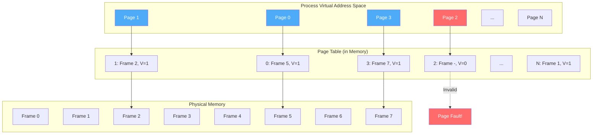
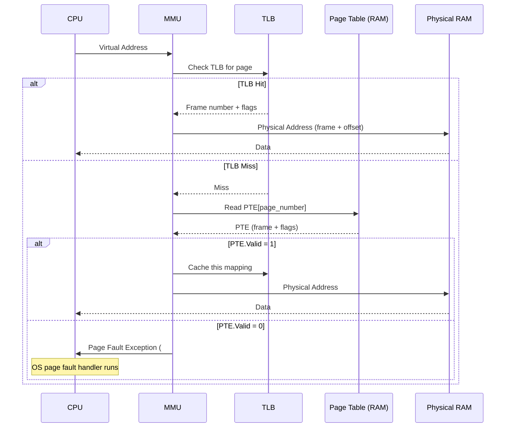
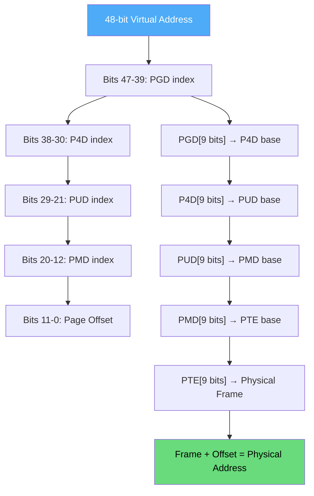
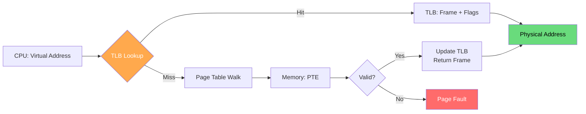
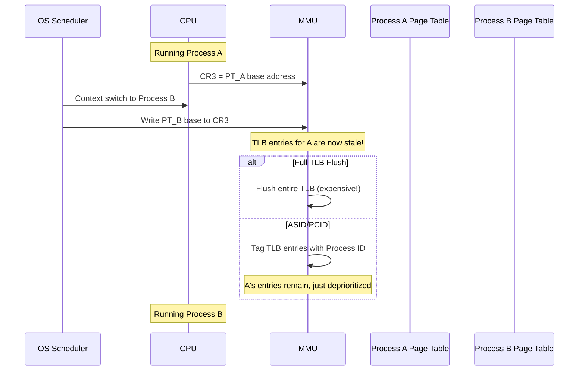

# Page Tables

Page tables are the core data structures that the OS and MMU use to translate virtual addresses to physical addresses. They are the backbone of virtual memory, enabling process isolation, memory protection, and efficient memory utilization.

## Overview

Every process has its own page table that maps its virtual pages to physical frames. The page table is stored in main memory, and the **Page Table Base Register (PTBR)** — or CR3 on x86 — points to the current process's page table.



## Page Table Entry (PTE) Format

Each entry stores the frame number plus control/protection bits:

### x86-64 PTE Format (64-bit)

```
Bit: 63                  12 11        9 8 7 6 5 4 3 2 1 0
    ┌──────────────────────┬──────────┬─┬─┬─┬─┬─┬─┬─┬─┬─┬─┐
    │   Physical Frame     │ Reserved │G│P│D│A│PCD│PWT│U/S│R/W│P│
    │   Address (40 bits)  │ / AVL    │ │ │ │ │   │   │   │   │ │
    └──────────────────────┴──────────┴┴─┴─┴─┴─┴───┴───┴───┴───┴─┘
```

| Bit | Name | Description |
|-----|------|-------------|
| 0 | **P** (Present) | 1 = page in physical memory; 0 = not present (fault) |
| 1 | **R/W** (Read/Write) | 0 = read-only; 1 = read-write |
| 2 | **U/S** (User/Supervisor) | 0 = kernel only; 1 = user accessible |
| 3 | **PWT** (Page-level Write-Through) | Cache write policy |
| 4 | **PCD** (Page-level Cache Disable) | 1 = disable caching |
| 5 | **A** (Accessed) | Set by CPU on any access (read or write) |
| 6 | **D** (Dirty) | Set by CPU on write |
| 7 | **PAT** (Page Attribute Table) | Cacheability hint |
| 8 | **G** (Global) | 1 = don't flush on CR3 switch (kernel pages) |
| 9-11 | **Available** | OS can use freely |
| 12-51 | **Physical Address** | Frame number (40 bits → 52-bit physical) |
| 52-62 | **Available** | OS can use freely |
| 63 | **NX** (No-Execute) | 1 = cannot execute (if supported) |

### Linux PTE Flags

```c
// From arch/x86/include/asm/pgtable_types.h
#define _PAGE_PRESENT   (1UL << 0)   // Page is in memory
#define _PAGE_RW        (1UL << 1)   // Read-write
#define _PAGE_USER      (1UL << 2)   // User accessible
#define _PAGE_PWT       (1UL << 3)   // Page write-through
#define _PAGE_PCD       (1UL << 4)   // Page cache disabled
#define _PAGE_ACCESSED  (1UL << 5)   // Accessed
#define _PAGE_DIRTY     (1UL << 6)   // Dirty
#define _PAGE_PSE       (1UL << 7)   // Page Size Extension (huge page)
#define _PAGE_GLOBAL    (1UL << 8)   // Global TLB entry
#define _PAGE_NX        (1UL << 63)  // No-execute
```

## Address Translation Process

### Step-by-Step Hardware Walk



### Detailed Walkthrough Example

```
System: 32-bit virtual address, 4KB pages, 32-bit physical
Virtual address: 0x00003A5F

Step 1: Split address
  Page number = 0x00003A5F >> 12 = 0x003 = 3
  Offset      = 0x00003A5F & 0xFFF = 0xA5F = 2655

Step 2: Index page table (PTBR points to base)
  PTE address = PTBR + (3 × 4) = PTBR + 12
  Read PTE from memory at that address

Step 3: Decode PTE
  PTE value = 0x00005021
  Frame number = 0x00005021 >> 12 = 0x00005 = 5
  Present bit = 0x00005021 & 0x01 = 1 (valid)
  R/W bit = 0x00005021 & 0x02 = 0 (read-only)
  User bit = 0x00005021 & 0x04 = 0 (kernel only)

Step 4: Form physical address
  Physical = (5 × 4096) + 2655 = 20480 + 2655 = 23135
  Physical = 0x00005A5F

Step 5: Access memory at 0x00005A5F
```

## Types of Page Tables

### 1. Linear (Flat) Page Table

The simplest structure — a single contiguous array indexed by page number.

```
Virtual Page #    Page Table Entry
      0      →    [Frame 5, V=1, R/W=1]
      1      →    [Frame 2, V=1, R/W=0]
      2      →    [Frame -, V=0]  ← not mapped
      3      →    [Frame 7, V=1, R/W=1]
      ...
    1048575  →    [Frame 1, V=1, R/W=1]
```

**Problem**: For 32-bit address space with 4KB pages:
- 2^20 entries × 4 bytes = **4 MB per page table**
- 100 processes = 400 MB just for page tables!

### 2. Multi-Level Page Tables

See [Multi-Level Page Tables](./multi-level-page-tables.md) for the full solution.

### 3. Hashed Page Tables

Used when virtual address space is larger than physical (sparse usage).

```
Virtual Page # → Hash Function → Bucket in hash table → Search chain
```

### 4. Inverted Page Tables

See [Inverted Page Tables](./inverted-page-tables.md) — one entry per physical frame.

## Page Table Management in Linux

### Kernel Data Structures

```c
// Per-process memory descriptor
struct mm_struct {
    struct pgd_t *pgd;              // Page Global Directory (top level)
    struct maple_tree mm_mt;        // VMAs stored in maple tree
    unsigned long start_code, end_code;
    unsigned long start_data, end_data;
    unsigned long start_brk, brk;   // Heap boundaries
    unsigned long start_stack;
    // ...
};

// Page table levels (x86-64, 4-level paging)
// PGD → P4D → PUD → PMD → PTE → Physical Frame
typedef struct { pgdval_t pgd; } pgd_t;    // Page Global Directory
typedef struct { p4dval_t p4d; } p4d_t;    // Page 4th-level Directory
typedef struct { pudval_t pud; } pud_t;    // Page Upper Directory
typedef struct { pmdval_t pmd; } pmd_t;    // Page Middle Directory
typedef struct { pteval_t pte; } pte_t;    // Page Table Entry
```

### x86-64 4-Level Page Table Walk



Each level uses 9 bits → 512 entries per table → 512 × 8 bytes = 4 KB per table (one page!).

### Linux Page Table Operations

```c
// Create a new page table
pgd_t *pgd = pgd_alloc(mm);

// Map a virtual address to a physical frame
int vm_insert_page(struct vm_area_struct *vma, 
                   unsigned long addr, struct page *page);

// Walk the page table (for kernel use)
pte_t *walk_page_table(struct mm_struct *mm, unsigned long addr) {
    pgd_t *pgd = pgd_offset(mm, addr);
    if (pgd_none(*pgd)) return NULL;
    
    p4d_t *p4d = p4d_offset(pgd, addr);
    if (p4d_none(*p4d)) return NULL;
    
    pud_t *pud = pud_offset(p4d, addr);
    if (pud_none(*pud)) return NULL;
    
    pmd_t *pmd = pmd_offset(pud, addr);
    if (pmd_none(*pmd)) return NULL;
    
    return pte_offset_map(pmd, addr);
}
```

```bash
# Dump page tables for a process (Linux)
$ sudo cat /proc/<pid>/pagemap | xxd | head -20

# Each 8-byte entry:
# Bit 0-54: physical page frame number (if present)
# Bit 55: pte is soft-dirty
# Bit 61: page is file-page or shared-anon
# Bit 62: page swapped
# Bit 63: page present

# Use page-types tool to analyze
$ sudo page-types -p <pid>
```

## TLB Interaction

The TLB caches recent page table translations:



See [TLB](./tlb.md) for detailed coverage.

## Context Switch and Page Tables

When the OS switches between processes:



### PCID (Process Context Identifier)

Modern x86-64 uses **PCID** to avoid full TLB flushes:

```bash
# Check if PCID is supported
$ cat /proc/cpuinfo | grep pcid
flags           : ... pcid ...

# Linux enables PCID by default on supported hardware
$ dmesg | grep -i pcid
[    0.000000] x86/mm: PCID enabled
```

## Real-World: Examining Page Tables

```bash
# Install page table examination tools
$ sudo apt install linux-tools-$(uname -r)

# View page table entries for a process
$ sudo showmap <pid>

# Detailed page table walk using /proc
$ python3 -c "
import struct
pid = 1  # init process
with open(f'/proc/{pid}/pagemap', 'rb') as f:
    for page in range(0, 0x100000, 0x1000):  # First few pages
        f.seek(page // 0x1000 * 8)
        data = f.read(8)
        entry = struct.unpack('Q', data)[0]
        present = entry & (1 << 63)
        frame = entry & ((1 << 55) - 1)
        if present:
            print(f'VA 0x{page:08x} -> PFN {frame}')
"

# Monitor page faults
$ perf stat -e page-faults,major-faults,minor-faults ls -la

# Per-process page fault counts
$ ps -o pid,minflt,majflt,cmd -p $(pgrep -f firefox)
```

## Page Table Size Analysis

| System | Address Bits | Page Size | Levels | Entries/Level | Total Size |
|--------|-------------|-----------|--------|---------------|------------|
| x86 (32-bit) | 32 | 4 KB | 2 | 1024 | 4 MB flat |
| x86 PAE | 36 | 4 KB | 3 | 512/512/512 | ~8 KB sparse |
| x86-64 | 48 | 4 KB | 4 | 512 each | ~4 KB sparse |
| x86-64 (5-level) | 57 | 4 KB | 5 | 512 each | ~4 KB sparse |
| ARM64 | 48 | 4 KB | 4 | 512 each | ~4 KB sparse |

## C Implementation: Page Table Simulator

```python
import ctypes

class PageTableEntry:
    def __init__(self):
        self.frame = 0
        self.present = False
        self.writable = True
        self.user = True
        self.accessed = False
        self.dirty = False
        self.nx = False  # No-execute
    
    def to_int(self):
        val = self.frame << 12
        if self.present: val |= 1 << 0
        if self.writable: val |= 1 << 1
        if self.user: val |= 1 << 2
        if self.accessed: val |= 1 << 5
        if self.dirty: val |= 1 << 6
        if self.nx: val |= 1 << 63
        return val
    
    def __repr__(self):
        flags = []
        if self.present: flags.append('P')
        if self.writable: flags.append('W')
        if self.user: flags.append('U')
        if self.accessed: flags.append('A')
        if self.dirty: flags.append('D')
        if self.nx: flags.append('NX')
        return f"PTE(frame={self.frame}, flags={''.join(flags)})"


class LinearPageTable:
    def __init__(self, page_bits=12, addr_bits=20):
        self.page_size = 1 << page_bits
        self.page_bits = page_bits
        self.num_pages = 1 << (addr_bits - page_bits)
        self.entries = [PageTableEntry() for _ in range(self.num_pages)]
    
    def map_page(self, vpage, frame, writable=True, user=True, nx=False):
        e = self.entries[vpage]
        e.frame = frame
        e.present = True
        e.writable = writable
        e.user = user
        e.nx = nx
    
    def unmap_page(self, vpage):
        self.entries[vpage].present = False
    
    def translate(self, vaddr, write=False, execute=False):
        page = vaddr >> self.page_bits
        offset = vaddr & (self.page_size - 1)
        
        if page >= self.num_pages:
            return {'fault': True, 'reason': 'Invalid page number'}
        
        e = self.entries[page]
        
        if not e.present:
            return {'fault': True, 'reason': f'Page {page} not present'}
        
        if write and not e.writable:
            return {'fault': True, 'reason': 'Write to read-only page'}
        
        if execute and e.nx:
            return {'fault': True, 'reason': 'Execute no-execute page'}
        
        if not e.user:
            return {'fault': True, 'reason': 'User access to kernel page'}
        
        e.accessed = True
        if write:
            e.dirty = True
        
        paddr = (e.frame << self.page_bits) + offset
        return {
            'fault': False,
            'vaddr': vaddr,
            'paddr': paddr,
            'page': page,
            'frame': e.frame,
            'offset': offset,
            'pte': e
        }
    
    def dump(self, only_mapped=True):
        print(f"Page Table ({self.num_pages} entries, {self.page_size}B pages):")
        for i, e in enumerate(self.entries):
            if only_mapped and not e.present:
                continue
            print(f"  Page {i:4d}: {e}")


# Simulation
pt = LinearPageTable(page_bits=12, addr_bits=20)

# Map some pages
pt.map_page(0, 5, writable=False, nx=False)   # Code: read-only, executable
pt.map_page(1, 2)                               # Data: read-write
pt.map_page(3, 7)                               # Heap: read-write
pt.map_page(100, 10)                            # Stack: read-write

pt.dump()

# Translate some addresses
r = pt.translate(0x0000)    # Page 0, offset 0 → Frame 5
print(f"\n0x0000: {r}")

r = pt.translate(0x1500)    # Page 1, offset 0x500 → Frame 2
print(f"0x1500: {r}")

r = pt.translate(0x2000)    # Page 2 → FAULT (not mapped)
print(f"0x2000: {r}")

r = pt.translate(0x0000, write=True)  # Write to code → FAULT
print(f"0x0000 write: {r}")
```

## Interview Questions

### Beginner

**Q1: What is a page table?**
A: A data structure that maps virtual page numbers to physical frame numbers. Each entry (PTE) contains the frame number and control bits (present, read/write, accessed, dirty, etc.). The MMU uses it to translate every virtual address a process uses.

**Q2: What happens when a process accesses a page marked "not present"?**
A: A page fault occurs. The CPU traps to the OS kernel, which must either: (1) load the page from disk (swap or file), (2) allocate a new zero-filled frame (first access), or (3) terminate the process with SIGSEGV if the access is invalid.

**Q3: Why does each process need its own page table?**
A: Process isolation. Each process has its own virtual address space, and its page table maps those virtual pages to the physical frames assigned to it. Process A's page 0 and Process B's page 0 can map to different physical frames, preventing one process from accessing another's memory.

### Intermediate

**Q4: What is the "accessed" bit used for?**
A: The CPU sets the accessed bit whenever the page is read or written. The OS can periodically clear it to determine which pages have been recently used. This is critical for page replacement algorithms (LRU approximation) — pages that haven't been accessed are good candidates for eviction.

**Q5: What is the "dirty" bit used for?**
A: The CPU sets the dirty bit on write operations. When evicting a page, the OS checks this bit: if dirty, the page must be written to disk (expensive); if clean, it can simply be discarded (the disk copy is already up-to-date). This optimization avoids unnecessary disk writes.

**Q6: How does the OS minimize TLB flushes during context switches?**
A: Using PCID (Process Context Identifier) or ASID (Address Space ID). Each TLB entry is tagged with the process ID, so entries from different processes can coexist. On context switch, the OS just changes the active PCID — no flush needed. The kernel uses the `INVPCID` instruction to selectively flush when necessary.

### Advanced / FAANG-Level

**Q7: Design a page table for a system with 64-bit virtual addresses, 48-bit physical addresses, and 4KB pages. A process uses only 3 small regions totaling 20 MB, spread across the address space. How much memory does the page table consume?**
A: With 4-level paging (like x86-64):
- Level 1 (PGD): 1 page (always allocated) = 4 KB
- Level 2 (P4D): 1 entry used → 1 page = 4 KB
- Level 3 (PUD): 3 entries used (one per region, assuming they span different 1GB ranges) → 3 pages = 12 KB
- Level 4 (PMD): 20 MB / 2 MB = 10 entries across 1-3 pages = 4-12 KB
- Level 5 (PTE): 20 MB / 4 KB = 5120 entries across 10-13 pages = 40-52 KB
- Total: ~60-84 KB (vs 512 GB for flat page table!)
- Plus 20 MB for actual data

**Q8: Explain how a kernel page table is shared between all processes.**
A: The upper half of the address space (kernel space) is identical in every process's page table. On x86-64, addresses 0xFFFF800000000000 and above are kernel space. The PGD entries for these are copied from the kernel's master page table (init_mm.pgd) to each new process's PGD during fork(). The kernel pages are marked as global (G bit) so they're not flushed on CR3 switch. This means the kernel is mapped in every process but only accessible from ring 0 (supervisor mode).

**Q9: How would you implement Copy-on-Write (COW) using page table bits?**
A: 
1. During `fork()`: copy parent's page table entries to child, but mark all writable pages as read-only in both tables. Set a "COW" flag in the OS's software bits.
2. When either process writes: MMU raises a fault (write to read-only page)
3. Page fault handler checks: if page is COW, allocate new frame, copy content, update PTE to writable, clear COW flag
4. If multiple processes share the same page (refcount > 1), each write fault creates a private copy
5. Pages that are never written are shared indefinitely, saving memory

## Common Mistakes

1. **Confusing page table with TLB** — Page table is in memory (slow); TLB is hardware cache (fast). The TLB caches page table entries.
2. **Forgetting page table overhead** — Page tables consume real memory. On 32-bit: 4 MB per process with flat tables.
3. **Not understanding the dirty bit** — It's set by hardware (MMU), not software. It's critical for knowing which pages need disk writes.
4. **Assuming page tables are always flat** — Modern systems use multi-level tables. Flat tables are only practical for small address spaces.
5. **Forgetting kernel page tables are shared** — All processes share the kernel's page table entries (upper half of address space).

## Summary

| Aspect | Details |
|--------|---------|
| **Purpose** | Map virtual pages → physical frames |
| **Location** | In main memory, pointed to by CR3/PTBR |
| **Entry Contains** | Frame number + flags (present, R/W, dirty, accessed) |
| **Hardware** | MMU walks page table on TLB miss |
| **Size (32-bit)** | 4 MB flat; much less with multi-level |
| **Size (64-bit)** | ~4 KB per process with 4-level paging |
| **Per Process** | Each process has its own page table |
| **Kernel Pages** | Shared across all processes |

## Cross-References

- **Prerequisite**: [Paging](./paging.md) — the concept that page tables implement
- **Next**: [TLB](./tlb.md) — hardware acceleration for page table lookups
- **See Also**: [Multi-Level Page Tables](./multi-level-page-tables.md) — reducing page table size
- **See Also**: [Inverted Page Tables](./inverted-page-tables.md) — alternative structure
- **Advanced**: [Huge Pages](./huge-pages.md) — fewer page table entries
- **Virtual Memory**: [Copy-on-Write](../virtual-memory/cow.md) — using PTE bits for COW
