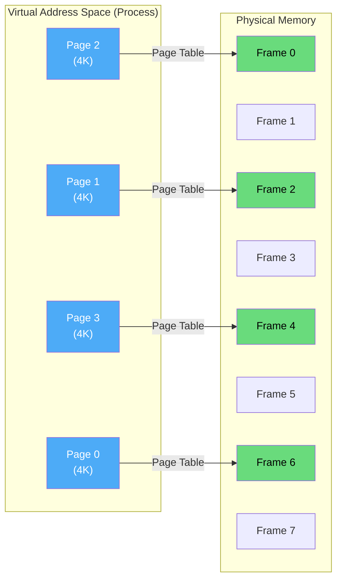
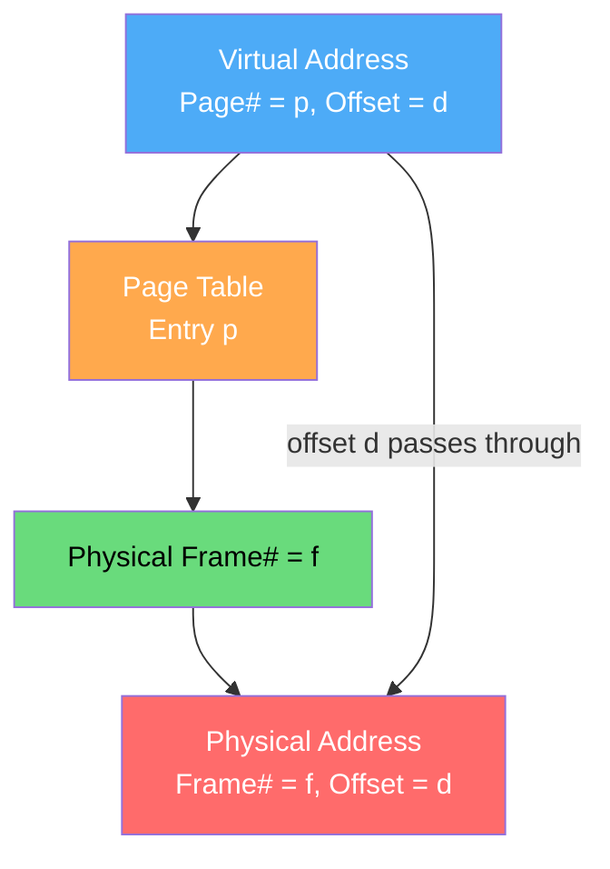
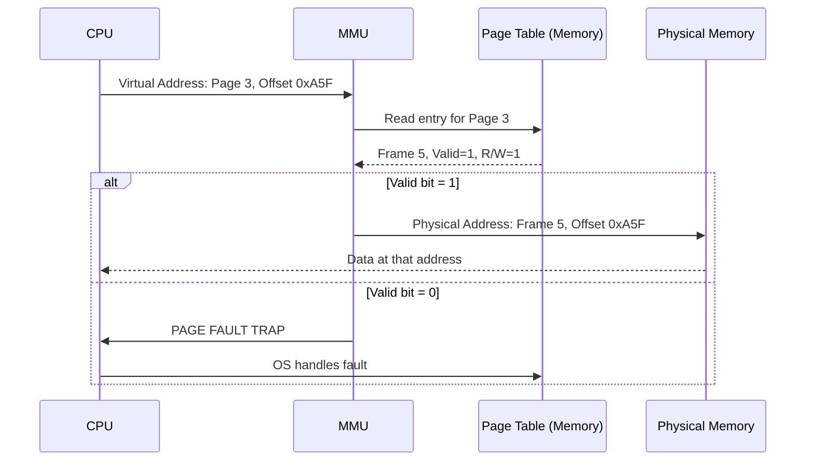

# Paging

Paging is the dominant memory management scheme in modern operating systems. It eliminates external fragmentation by dividing both physical memory and virtual address space into fixed-size blocks called **frames** and **pages** respectively.

## Overview

In paging:
- Physical memory is divided into **frames** (e.g., 4 KB each)
- Virtual address space is divided into **pages** (same size as frames)
- Pages can be placed in **any** available frame — no contiguous requirement
- A **page table** maps each virtual page to its physical frame



## Address Translation

A virtual address is split into two parts:

```
Virtual Address = | Page Number (p) | Page Offset (d) |
                  |<--- p bits --->|<--- d bits ---->|

Example: 32-bit address, 4KB pages (2^12 bytes)
- Offset: 12 bits (0-4095)
- Page number: 20 bits (0 to 2^20 - 1 = 1,048,575 pages)
```



**Translation formula:**
```
physical_address = (frame_number × page_size) + offset
```

### Detailed Example

```
Virtual address: 0x00003A5F (decimal: 14943)
Page size: 4 KB = 4096 bytes = 2^12 bytes

Page number: 0x00003A5F >> 12 = 0x3 = 3 (page 3)
Offset: 0x00003A5F & 0xFFF = 0xA5F = 2655

Page table says: Page 3 → Frame 5

Physical address: (5 × 4096) + 2655 = 20480 + 2655 = 23135 = 0x5A5F
```

## Page Table Entry (PTE)

Each entry in the page table contains:

```
┌──────────────────────────────────────────────────────┐
│ Frame Number (20 bits) │ Flags (12 bits)             │
├────────────────────────┼──┬──┬──┬──┬──┬──┬──┬──┬──┬──┤
│ Physical Frame #       │  │  │  │  │  │  │G│S│D│A│C│W│P│V│
│                        │  │  │  │  │  │  │ │ │ │ │ │ │ │
└────────────────────────┴──┴──┴──┴──┴──┴──┴┴─┴─┴─┴─┴─┴─┴─┘
```

| Flag | Name | Purpose |
|------|------|---------|
| V | Valid | Page is in physical memory |
| P | Protection | Read/Write/Execute permissions |
| W | Write-through | Cache write policy |
| C | Cache-disabled | Disable caching for this page |
| A | Accessed | Set by hardware on read/write |
| D | Dirty | Set by hardware on write |
| S | Size | 0=4KB, 1=2MB/4MB (huge page) |
| G | Global | Not flushed on TLB flush |

## Linux Page Table Walk

```bash
# Examine page tables for a process
$ cat /proc/self/maps | head -5
55a8c0a00000-55a8c0a24000 r--p 00000000 08:01 131074  /usr/bin/cat
55a8c0a24000-55a8c0a6e000 r-xp 00024000 08:01 131074  /usr/bin/cat
55a8c0a6e000-55a8c0a96000 r--p 0006e000 08:01 131074  /usr/bin/cat
55a8c0a97000-55a8c0a98000 rw-p 00096000 08:01 131074  /usr/bin/cat

# Use /proc/pid/pagemap to inspect page table entries
$ sudo cat /proc/1/pagemap | xxd | head -5

# Get page size
$ getconf PAGESIZE
4096

# Check number of page frames
$ cat /proc/vmstat | grep nr_free_pages
nr_free_pages 245760
```

## Address Translation with Paging — Full Example



## No External Fragmentation

The key advantage: any page can go in any free frame.

```
Process needs 10K:
- With contiguous: Need 10K contiguous block (may fail due to holes)
- With paging: Need 3 pages (12K total), can use ANY 3 free frames

Physical Memory:
Frame 0: [Process B, Page 0]
Frame 1: [FREE] ←────┐
Frame 2: [Process A, Page 1]
Frame 3: [FREE] ←────┼─── Process C's 3 pages go here
Frame 4: [FREE] ←────┘    (non-contiguous is fine!)
Frame 5: [Process A, Page 0]
Frame 6: [Process B, Page 1]
Frame 7: [FREE]
```

## Internal Fragmentation

The only fragmentation in paging is internal:
- Process of 10K needs 3 pages (12K) → 2K wasted in last page
- Average waste: **half a page per process** = 2KB for 4KB pages
- For large processes, this is negligible

## Page Table Size

For a 32-bit address space with 4KB pages:

```
Number of pages = 2^32 / 2^12 = 2^20 = 1,048,576 pages
Each PTE = 4 bytes
Page table size = 1,048,576 × 4 = 4 MB per process!

With 100 processes: 400 MB just for page tables!
→ Solution: Multi-level page tables (see multi-level-page-tables.md)
```

For 64-bit systems, single-level page tables are impossibly large:
```
2^64 / 2^12 = 2^52 pages × 8 bytes = 32 PB per page table!
→ Must use multi-level page tables
```

## Implementation: Simple Page Table Simulator

```python
class PageTable:
    def __init__(self, page_size=4096, num_pages=16):
        self.page_size = page_size
        self.num_pages = num_pages
        # Page table: page_num -> (frame_num, valid, dirty, accessed)
        self.table = {}
        for i in range(num_pages):
            self.table[i] = {'frame': -1, 'valid': False, 
                            'dirty': False, 'accessed': False}
    
    def map_page(self, page_num, frame_num):
        """Map a virtual page to a physical frame."""
        if page_num >= self.num_pages:
            raise ValueError(f"Page {page_num} out of range")
        self.table[page_num] = {
            'frame': frame_num, 'valid': True,
            'dirty': False, 'accessed': False
        }
    
    def translate(self, virtual_address):
        """Translate virtual address to physical address."""
        page_num = virtual_address // self.page_size
        offset = virtual_address % self.page_size
        
        if page_num >= self.num_pages:
            raise ValueError(f"Invalid page {page_num}")
        
        entry = self.table[page_num]
        
        if not entry['valid']:
            return {'fault': True, 'page': page_num}
        
        entry['accessed'] = True
        physical_address = entry['frame'] * self.page_size + offset
        
        return {
            'fault': False,
            'virtual': virtual_address,
            'physical': physical_address,
            'page': page_num,
            'frame': entry['frame'],
            'offset': offset
        }
    
    def read_memory(self, virtual_address):
        """Simulate reading memory (sets accessed bit)."""
        result = self.translate(virtual_address)
        if result['fault']:
            print(f"PAGE FAULT on page {result['page']}!")
            return None
        return result
    
    def write_memory(self, virtual_address):
        """Simulate writing memory (sets dirty + accessed bits)."""
        result = self.translate(virtual_address)
        if result['fault']:
            print(f"PAGE FAULT on page {result['page']}!")
            return None
        page_num = result['page']
        self.table[page_num]['dirty'] = True
        return result


# Simulation
pt = PageTable(page_size=4096, num_pages=8)

# Map some pages
pt.map_page(0, 5)   # Page 0 → Frame 5
pt.map_page(1, 2)   # Page 1 → Frame 2
pt.map_page(3, 7)   # Page 3 → Frame 7

# Translate addresses
print(pt.translate(0))       # Page 0, offset 0 → Frame 5, offset 0
print(pt.translate(4096))    # Page 1, offset 0 → Frame 2, offset 0
print(pt.translate(8192))    # Page 2 → FAULT (not mapped)
print(pt.translate(13000))   # Page 3, offset 712 → Frame 7, offset 712
print(pt.read_memory(12500)) # Page 3, offset 208
print(pt.write_memory(5000)) # Page 1, offset 904 → sets dirty bit
```

## Real-World: Linux Memory Pages

```bash
# Standard page size
$ getconf PAGESIZE
4096

# Huge pages (2MB typically)
$ cat /proc/meminfo | grep HugePages
HugePages_Total:       0
HugePages_Free:        0
HugePages_Rsvd:        0
Hugepagesize:       2048 kB

# Count resident pages of a process
$ ps -o pid,rss,minflt,majflt -p 1
  PID   RSS  MINFL  MAJFL
    1 16384  12345     67

# rss = resident set size in KB = pages × 4
# minflt = minor faults (page in memory, just need mapping)
# majflt = major faults (page must be read from disk)
```

## Comparison: Paging vs Contiguous

| Aspect | Contiguous | Paging |
|--------|-----------|--------|
| External Fragmentation | Yes (major problem) | None |
| Internal Fragmentation | Only in fixed partitions | Half page per process average |
| Allocation | Must find contiguous hole | Any free frame |
| Compaction | Needed periodically | Never needed |
| Address Translation | Simple (base + offset) | Page table lookup |
| Memory Overhead | None | Page table storage |
| Hardware Support | Base/Limit registers | MMU + TLB |

## Interview Questions

### Beginner

**Q1: What is the main advantage of paging over contiguous allocation?**
A: Paging eliminates external fragmentation. Since pages can be placed in any free frame (not necessarily contiguous), there's no need for compaction, and memory utilization is much better.

**Q2: How is a virtual address translated to a physical address in paging?**
A: The virtual address is split into page number (high bits) and offset (low bits). The page number indexes into the page table to get the frame number. The physical address = frame_number × page_size + offset. The offset passes through unchanged.

**Q3: What is a page fault?**
A: A page fault occurs when a process accesses a page that is marked as invalid in the page table (not currently in physical memory). The OS must handle it by loading the page from disk (or allocating a new frame if it's a first access).

### Intermediate

**Q4: Why is the page table so large for 32-bit systems? How is this addressed?**
A: With 4KB pages, a 32-bit address space has 2^20 pages. Each PTE is 4 bytes → 4 MB per page table. Solutions: multi-level page tables (only allocate entries for used regions), inverted page tables (one entry per physical frame), and TLB caching.

**Q5: What information is stored in a page table entry?**
A: Frame number (physical location), valid/invalid bit (is page in memory), protection bits (read/write/execute), dirty bit (has page been modified), accessed bit (for page replacement algorithms), and sometimes caching/mode bits.

**Q6: Can two processes share a physical frame?**
A: Yes! Two page table entries (from different processes) can point to the same physical frame. This is used for shared libraries (libc), shared memory (`shmget`), and the kernel's memory. The pages may have different virtual addresses in each process.

### Advanced / FAANG-Level

**Q7: You have a system with 48-bit virtual addresses, 4KB pages, and 8-byte PTEs. A process uses only 3 regions: code (0x00000000-0x00400000), heap (0x00600000-0x00800000), and stack (0x7FFF00000000-0x7FFFFFFFFFFF). How much memory does a single-level page table waste? Design a better solution.**
A: Single-level: 2^48 / 2^12 = 2^36 entries × 8 bytes = 512 GB per page table — absurd. The process only uses ~12 MB of address space. Solution: 4-level page table (like x86-64). Only allocate inner tables for used regions. Code region: 1024 pages → 1 top-level entry → 1 second-level → 1 third-level → 1 fourth-level with entries. Total page table overhead: ~16 KB instead of 512 GB.

**Q8: Design a page table structure for a system that needs to support both 4KB and 2MB pages simultaneously.**
A: Use a hierarchical page table where intermediate entries can be "huge page" entries. In x86-64's 4-level paging, if a PDE (Page Directory Entry) has the PS (Page Size) bit set, it directly maps 2 MB without traversing lower levels. The MMU checks the PS bit at each level. This allows a mix: most pages are 4KB, but large contiguous regions (databases, VMs) use 2MB pages for fewer TLB misses. The OS must ensure 2MB regions are 2MB-aligned in physical memory.

**Q9: How does the Linux kernel handle a page fault? Trace the complete path.**
A: 
1. CPU raises exception (#PF) → saves error code and faulting address in CR2
2. Entry via `exc_page_fault` (arch/x86/mm/fault.c)
3. Find the VMA (Virtual Memory Area) using `find_vma()` in the process's `mm_struct`
4. Check permissions: does VMA allow this access (read/write/execute)?
5. If no VMA or permission denied → SIGSEGV (segmentation fault)
6. If VMA exists → call `handle_mm_fault()` → `__handle_mm_fault()`
7. Traverse/create page table levels (P4D, PUD, PMD, PTE)
8. Call `handle_pte_fault()`:
   - **Minor fault**: Page in page cache but not mapped → just add PTE
   - **Major fault**: Page not in memory → call `vma->vm_ops->fault()` to read from disk
   - **COW fault**: Write to read-only page → copy page, update PTE
9. Update PTE with frame number and flags
10. Return to user space, re-execute the faulting instruction

## Common Mistakes

1. **Confusing page and frame** — Page = virtual block, Frame = physical block. They're the same size but different concepts.
2. **Assuming paging eliminates all fragmentation** — There's still internal fragmentation (average half a page per process).
3. **Forgetting page table overhead** — Page tables themselves consume memory; this is a real cost.
4. **Not understanding page faults** — A "fault" isn't always an error; it's a normal mechanism for demand paging.
5. **Confusing logical and physical addresses** — Programs always use logical (virtual) addresses; the MMU translates transparently.

## Summary

| Aspect | Details |
|--------|---------|
| **Mechanism** | Fixed-size pages mapped to physical frames |
| **Page Size** | Typically 4 KB (2 MB / 1 GB huge pages available) |
| **External Fragmentation** | Eliminated |
| **Internal Fragmentation** | Average half page per process |
| **Translation** | Page table lookup: VA → PTE → PA |
| **Overhead** | Page table storage (solved by multi-level) |
| **Key Hardware** | MMU, TLB |
| **Used In** | All modern OS (Linux, Windows, macOS) |

## Cross-References

- **Prerequisite**: [Contiguous Allocation](./contiguous.md) — understand what paging replaces
- **Next**: [Page Tables](./page-tables.md) — detailed page table structures
- **See Also**: [TLB](./tlb.md) — hardware acceleration for page table lookups
- **See Also**: [Multi-Level Page Tables](./multi-level-page-tables.md) — reducing page table size
- **Advanced**: [Huge Pages](./huge-pages.md) — using larger page sizes
- **Virtual Memory**: [Demand Paging](../virtual-memory/demand-paging.md) — loading pages on demand
