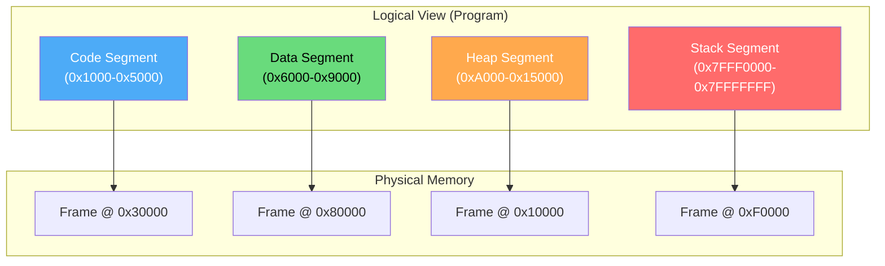
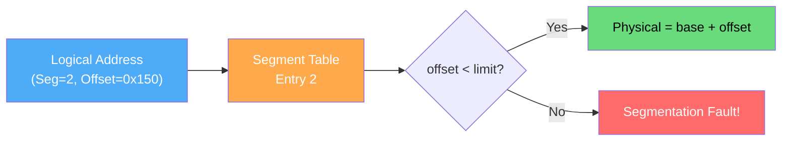
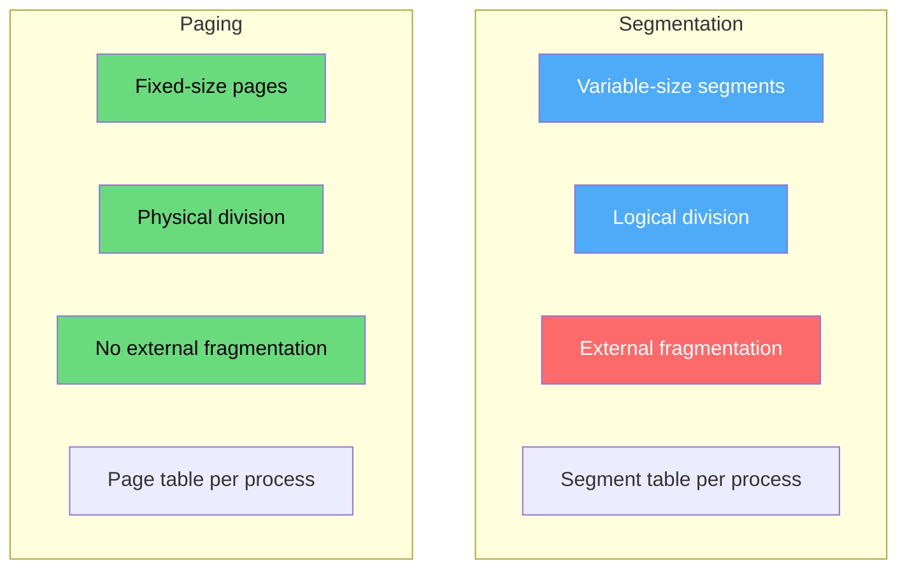
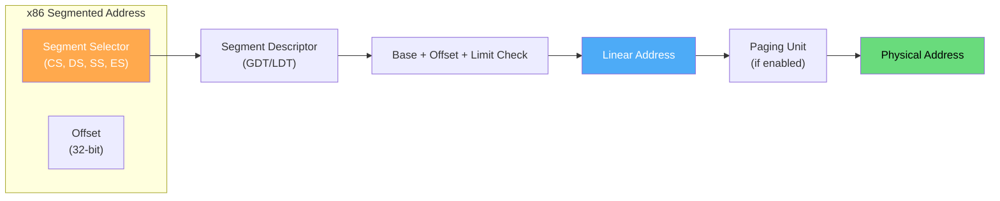
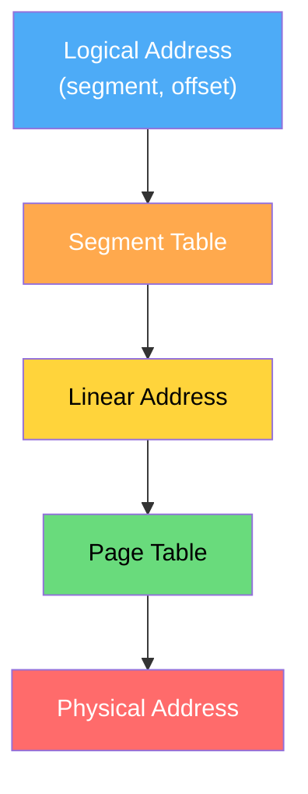

# Segmentation

Segmentation is a memory management scheme that divides a program's address space into logical segments corresponding to the program's natural structure: code, data, stack, heap, etc. Unlike paging (which uses fixed-size blocks), segments are **variable-size** and correspond to logical units.

## Overview

Each segment represents a logical unit of the program:
- **Code segment** — executable instructions (read-only)
- **Data segment** — global/static variables
- **Stack segment** — function call frames, local variables
- **Heap segment** — dynamically allocated memory
- **Extra segments** — libraries, shared memory



## Address Translation in Segmentation

A segmented address consists of **(segment number, offset)**:

```
Logical Address = (s, d)
where s = segment number, d = offset within segment

Segment Table Entry:
┌─────────────┬────────────┐
│   Base      │   Limit    │
│ (start addr)│ (length)   │
└─────────────┴────────────┘

Translation:
if (d >= limit) → trap (segmentation fault!)
else → physical_address = base + d
```



### Detailed Example

```
Segment Table:
┌────────┬──────────┬───────┐
│ Segment│ Base     │ Limit │
├────────┼──────────┼───────┤
│   0    │ 0x10000  │ 0x3000│  Code
│   1    │ 0x50000  │ 0x2000│  Data
│   2    │ 0x80000  │ 0x5000│  Heap
│   3    │ 0xF0000  │ 0x4000│  Stack
└────────┴──────────┴───────┘

Access (segment=2, offset=0x1000):
  offset (0x1000) < limit (0x5000) ✓
  Physical address = 0x80000 + 0x1000 = 0x81000

Access (segment=2, offset=0x6000):
  offset (0x6000) >= limit (0x5000) → SEGFAULT!
```

## Segmentation vs Paging



| Aspect | Segmentation | Paging |
|--------|-------------|--------|
| Block Size | Variable (per segment) | Fixed (e.g., 4 KB) |
| Division | Logical (code, data, stack) | Physical (arbitrary chunks) |
| External Fragmentation | Yes (major issue) | No |
| Internal Fragmentation | No | Yes (last page) |
| User Visible | Yes (programmer aware) | No (transparent) |
| Address | (segment, offset) | (page, offset) |
| Protection | Per-segment (natural) | Per-page |
| Sharing | Easy (share whole segment) | Possible (share pages) |

## Segmentation Fault (SIGSEGV)

The term "segmentation fault" comes directly from this architecture:

```c
// Classic segmentation fault examples
int *ptr = NULL;
*ptr = 42;  // Dereference NULL → SEGFAULT

char *str = "hello";
str[0] = 'H';  // Write to read-only segment → SEGFAULT

int arr[10];
arr[1000000] = 5;  // Access beyond stack segment → SEGFAULT
```

```bash
# See segmentation fault in action
$ cat segfault.c
#include <stdio.h>
int main() {
    int *p = (int*)0x12345678;
    *p = 10;  // Invalid address
    return 0;
}

$ gcc segfault.c -o segfault && ./segfault
Segmentation fault (core dumped)

# Debug with GDB
$ gdb ./segfault
(gdb) run
Program received signal SIGSEGV, Segmentation fault.
0x0000555555555139 in main () at segfault.c:4
4	    *p = 10;
```

## Intel x86 Segmentation

The x86 architecture has hardware segmentation support (mostly legacy now):



x86 registers:
- **CS** — Code Segment (instructions)
- **DS** — Data Segment (variables)
- **SS** — Stack Segment (stack operations)
- **ES, FS, GS** — Extra segments (general purpose)

```bash
# In modern x86-64 (long mode), segmentation is mostly flat:
# All segments have base=0 and limit=max
# Paging handles all memory management
# CS/DS/SS still exist but are effectively transparent

# Check segment registers in GDB
(gdb) info registers cs ds ss
cs             0x33    51
ds             0x2b    43
ss             0x2b    43
```

## Segmented Paging (Combined)

Modern systems often combine segmentation and paging:



Intel x86 uses this model (though in 64-bit mode, segmentation is flat):
1. Segment translation: logical → linear
2. Page translation: linear → physical

## Real-World: ELF Binary Segments

Linux ELF binaries use segments that map to the segmentation concept:

```bash
# View segments of a binary
$ readelf -l /usr/bin/ls

Elf file type is EXEC (Executable file)
Entry point 0x4049a0
There are 9 program headers, starting at offset 64

Program Headers:
  Type           Offset             VirtAddr           PhysAddr
                 FileSiz            MemSiz              Flags  Align
  LOAD           0x0000000000000000 0x0000000000400000 0x0000000000400000
                 0x0000000000001e64 0x0000000000001e64  R E    0x200000
  LOAD           0x0000000000002000 0x0000000000602000 0x0000000000602000
                 0x0000000000000480 0x0000000000000490  RW     0x200000
  NOTE           0x0000000000000200 0x0000000000400200 0x0000000000400200
  GNU_STACK      0x0000000000000000 0x0000000000000000 0x0000000000000000
                 0x0000000000000000 0x0000000000000000  RW     0x10

 Section to Segment mapping:
  Segment Sections...
   00     .init .plt .text .fini
   01     .data .bss
```

```bash
# View process memory map (segments)
$ cat /proc/self/maps
55a8c0a00000-55a8c0a24000 r--p 00000000 08:01 131074  /usr/bin/cat
55a8c0a24000-55a8c0a6e000 r-xp 00024000 08:01 131074  /usr/bin/cat  # Code
55a8c0a6e000-55a8c0a96000 r--p 0006e000 08:01 131074  /usr/bin/cat  # Data
55a8c0a97000-55a8c0a98000 rw-p 00096000 08:01 131074  /usr/bin/cat  # BSS
7f8c10000000-7f8c10021000 r-xp 00000000 08:01 524300  /lib/x86_64-linux-gnu/libc-2.31.so
7f8c10221000-7f8c10421000 ---p 00021000 08:01 524300  /lib/x86_64-linux-gnu/libc-2.31.so
7f8c10421000-7f8c10425000 r--p 00021000 08:01 524300  /lib/x86_64-linux-gnu/libc-2.31.so
7f8c10425000-7f8c10427000 rw-p 00025000 08:01 524300  /lib/x86_64-linux-gnu/libc-2.31.so
7ffd5e3a0000-7ffd5e3c1000 rw-p 00000000 00:00 0       [stack]
```

## Linux VMA (Virtual Memory Areas)

Modern Linux uses **VMAs** which are conceptually similar to segments:

```c
// From include/linux/mm_types.h
struct vm_area_struct {
    unsigned long vm_start;     // Start address
    unsigned long vm_end;       // End address
    pgprot_t vm_page_prot;      // Access permissions
    unsigned long vm_flags;     // Flags (read/write/exec/shared)
    struct rb_node vm_rb;       // Red-black tree node
    struct file *vm_file;       // Backing file (if file-mapped)
    // ...
};
```

```bash
# View VMAs for a process
$ cat /proc/<pid>/maps

# Use pmap for a cleaner view
$ pmap -x <pid>
```

## C Implementation: Segment Table

```c
#include <stdio.h>
#include <stdlib.h>
#include <string.h>

#define MAX_SEGMENTS 16

typedef struct {
    unsigned long base;
    unsigned long limit;
    int readable;
    int writable;
    int executable;
    char name[32];
} SegmentTableEntry;

typedef struct {
    SegmentTableEntry entries[MAX_SEGMENTS];
    int count;
} SegmentTable;

void init_segment_table(SegmentTable *st) {
    st->count = 0;
}

int add_segment(SegmentTable *st, unsigned long base, unsigned long limit,
                int r, int w, int x, const char *name) {
    if (st->count >= MAX_SEGMENTS) return -1;
    
    SegmentTableEntry *e = &st->entries[st->count];
    e->base = base;
    e->limit = limit;
    e->readable = r;
    e->writable = w;
    e->executable = x;
    strncpy(e->name, name, 31);
    
    return st->count++;
}

typedef struct {
    int fault;
    unsigned long physical_addr;
    char fault_reason[64];
} TranslateResult;

TranslateResult translate(SegmentTable *st, int seg_num, 
                          unsigned long offset, int write, int exec) {
    TranslateResult result = {0};
    
    if (seg_num >= st->count) {
        result.fault = 1;
        snprintf(result.fault_reason, 64, "Invalid segment %d", seg_num);
        return result;
    }
    
    SegmentTableEntry *e = &st->entries[seg_num];
    
    if (offset >= e->limit) {
        result.fault = 1;
        snprintf(result.fault_reason, 64, 
                 "Offset 0x%lx >= limit 0x%lx", offset, e->limit);
        return result;
    }
    
    if (write && !e->writable) {
        result.fault = 1;
        snprintf(result.fault_reason, 64, "Write to read-only segment '%s'", 
                 e->name);
        return result;
    }
    
    if (exec && !e->executable) {
        result.fault = 1;
        snprintf(result.fault_reason, 64, "Execute non-executable segment '%s'", 
                 e->name);
        return result;
    }
    
    result.fault = 0;
    result.physical_addr = e->base + offset;
    return result;
}

int main() {
    SegmentTable st;
    init_segment_table(&st);
    
    add_segment(&st, 0x10000, 0x3000, 1, 0, 1, "code");
    add_segment(&st, 0x50000, 0x2000, 1, 1, 0, "data");
    add_segment(&st, 0x80000, 0x5000, 1, 1, 0, "heap");
    add_segment(&st, 0xF0000, 0x4000, 1, 1, 0, "stack");
    
    // Valid access
    TranslateResult r = translate(&st, 2, 0x1000, 1, 0);
    printf("Access (seg=2, off=0x1000): %s, addr=0x%lx\n",
           r.fault ? "FAULT" : "OK", r.physical_addr);
    
    // Segment overflow
    r = translate(&st, 2, 0x6000, 0, 0);
    printf("Access (seg=2, off=0x6000): %s\n",
           r.fault ? r.fault_reason : "OK");
    
    // Write to code segment
    r = translate(&st, 0, 0x100, 1, 0);
    printf("Write to code segment: %s\n",
           r.fault ? r.fault_reason : "OK");
    
    return 0;
}
```

## Interview Questions

### Beginner

**Q1: What is segmentation?**
A: Segmentation divides a program's address space into logical segments (code, data, stack, heap) of variable size. Each segment has a base address and limit, and the segment table translates logical addresses to physical addresses.

**Q2: Why does segmentation cause external fragmentation?**
A: Since segments are variable-size, as segments are allocated and freed, memory gets divided into holes of different sizes. A new segment may not fit in any single hole even if total free memory is sufficient.

**Q3: What is a segmentation fault?**
A: A signal (SIGSEGV) sent when a program tries to access memory outside its valid segments — either an invalid segment number, offset beyond the segment limit, or violating protection (writing to read-only segment).

### Intermediate

**Q4: Compare segmentation and paging for memory protection.**
A: Segmentation provides natural protection boundaries (code is read-only+executable, data is read-write, stack is read-write). Paging provides per-page protection bits. Segmentation matches program semantics; paging is more flexible but doesn't align with program structure.

**Q5: How can segmentation support shared memory?**
A: Two processes can have segment table entries pointing to the same physical base address with appropriate permissions. For example, shared library code can be mapped as read-only+executable in multiple processes' segment tables, saving physical memory.

**Q6: Why did paging "win" over segmentation in modern systems?**
A: External fragmentation in segmentation requires expensive compaction. Paging has no external fragmentation, and the small internal fragmentation (half page average) is negligible. Also, paging works well with virtual memory (demand paging), while variable-size segments are harder to swap efficiently.

### Advanced / FAANG-Level

**Q7: Design a memory system that combines benefits of both segmentation and paging.**
A: Segmented paging: divide address space into segments, then page each segment independently. Benefits: logical protection per segment, no external fragmentation within segments, demand paging per segment. Implementation: logical address = (segment, page, offset). Segment table → page table → physical address. This is essentially what x86 does (segment → linear → physical), though modern x86-64 uses flat segmentation with paging.

**Q8: The x86-64 architecture effectively disabled segmentation in long mode. Why, and what replaced its functionality?**
A: In 64-bit long mode, CS/DS/SS/ES all have base=0 and limit=max, making segmentation transparent. Reasons: 64-bit virtual address space is huge (no need for segments to divide it), paging with protection bits handles all protection needs, flat model simplifies hardware and OS design. Replaced by: paging with per-page R/W/X bits, VMA-based logical grouping in the kernel, and ASLR for address randomization.

**Q9: How does Linux handle the ELF segment concept without hardware segmentation?**
A: Linux uses VMAs (Virtual Memory Areas) as software segments. Each VMA defines a contiguous region with permissions (r/w/x) and backing (file or anonymous). The kernel stores VMAs in a red-black tree for efficient lookup. When a page fault occurs, the kernel checks the VMA to verify the access is legal. ELF LOAD segments become VMAs via `mmap()` during `exec()`. This gives all the logical benefits of segmentation while using paging for actual memory management.

## Common Mistakes

1. **Confusing segment and page** — Segments are logical/variable-size; pages are physical/fixed-size
2. **Thinking segmentation is obsolete** — The concept lives on in VMAs and ELF segments
3. **Assuming all segfaults are bugs** — Some are legitimate (stack growth, COW)
4. **Forgetting segment protection** — Segments enforce permissions at a logical level
5. **Not understanding combined models** — Real systems often use both concepts together

## Summary

| Aspect | Details |
|--------|---------|
| **Mechanism** | Variable-size logical segments |
| **Address** | (segment_number, offset) |
| **Protection** | Per-segment (natural for code/data/stack) |
| **External Fragmentation** | Yes (main disadvantage) |
| **Internal Fragmentation** | No |
| **Modern Usage** | VMAs in Linux, ELF segments |
| **Hardware** | x86 has it (mostly unused in 64-bit mode) |
| **Replaced By** | Paging (but concept persists in software) |

## Cross-References

- **Compare With**: [Paging](./paging.md) — fixed-size alternative
- **Related**: [Page Tables](./page-tables.md) — paging's address translation
- **Modern Usage**: [mmap](./mmap.md) — creating memory segments in Linux
- **Virtual Memory**: [Demand Paging](../virtual-memory/demand-paging.md) — loading segments on demand


## Cross References

- [Paging](paging.md)
- [Virtual Memory](../virtual-memory/README.md)
- [Memory Hierarchy](../../arch/memory-hierarchy/README.md)
- [Buffer Management](../../dbms/storage/buffer-management.md)
