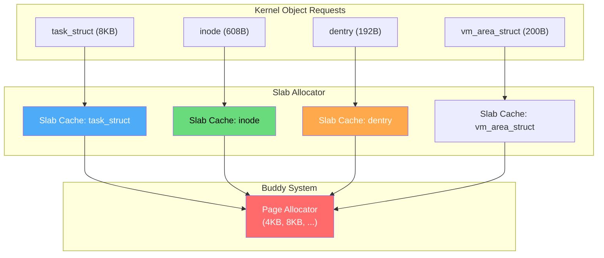
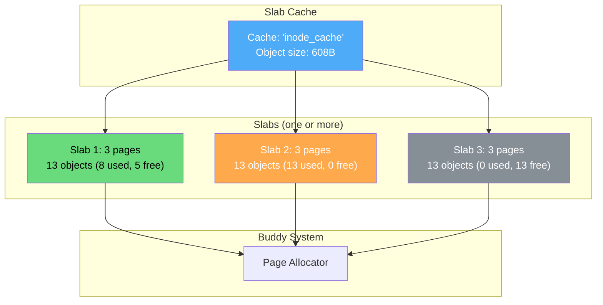
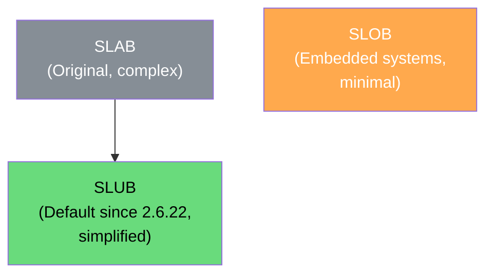
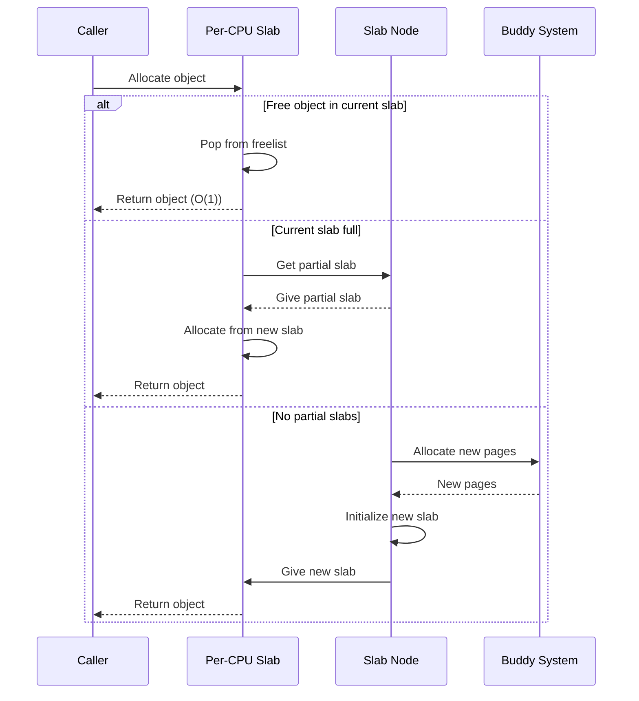
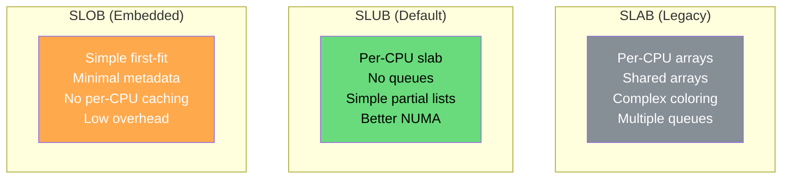

# Slab Allocator

The slab allocator is a memory management mechanism that caches frequently allocated kernel objects. It sits on top of the buddy system, managing pages as pools of same-sized objects to eliminate fragmentation and allocation overhead for kernel data structures.

## Overview



## The Problem Slab Solves

Without slab allocator:
```
Kernel needs to allocate task_struct (8KB):
1. Call buddy system for 2 pages (8KB)
2. Use the 8KB for task_struct
3. When done, free 2 pages back to buddy

Problems:
- Allocation overhead: buddy search + splitting
- Internal fragmentation: 8KB object in 8KB pages = 0%, but 
  600B object needs 1 page (4KB) = 85% waste!
- Repeated alloc/free of same objects is slow
- Cache lines polluted during allocation
```

With slab allocator:
```
Pre-allocate a "slab" of pages containing many task_structs:
- 1 page (4KB) can hold 0 task_structs (too big, need 2 pages)
- 2 pages (8KB) can hold 1 task_struct (still wasteful)
- Better: use multiple pages to hold many objects

Cache the slab: when task_struct is freed, don't return to buddy.
Next allocation comes from cached slab → O(1) allocation!
```

## Slab Allocator Structure

### Three Levels



### Slab States


## Linux Slab Implementations

Linux has three slab allocator implementations:



| Allocator | Design Goal | Best For |
|-----------|-------------|----------|
| **SLAB** | Full-featured, per-CPU caches | Historical (being removed) |
| **SLUB** | Simplified, better scalability | Modern Linux (default) |
| **SLOB** | Minimal memory footprint | Embedded systems |

## SLUB Allocator (Default)

SLUB (Simplified Linux Unqueued Allocator) is the default:

```c
// From include/linux/slub_def.h (simplified)

struct kmem_cache {
    struct kmem_cache_cpu __percpu *cpu_slab;  // Per-CPU slab
    slab_flags_t flags;
    unsigned long min_partial;    // Min partial slabs to keep
    int size;                     // Object size (including metadata)
    int object_size;              // Actual object size
    struct reciprocal_value reciprocal_size;
    unsigned int offset;          // Free pointer offset
    struct kmem_cache_order_objects oo;  // Order and object count
    struct kmem_cache_order_objects min;  // Minimum allocation
    gfp_t allocflags;
    int refcount;
    void (*ctor)(void *);         // Constructor function
    unsigned int inuse;           // Bytes used per object
    unsigned int align;           // Alignment requirement
    const char *name;             // Cache name
    struct list_head list;        // List of all caches
    struct kmem_cache_node *node[MAX_NUMNODES];  // Per-node
};

// Per-CPU slab (fast path)
struct kmem_cache_cpu {
    union {
        struct {
            struct slab *slab;    // Current slab
            void *freelist;       // Free object list
            unsigned long tid;    // Transaction ID
        };
    };
};
```

### SLUB Allocation Fast Path



## Creating a Slab Cache

```c
#include <linux/slab.h>
#include <linux/module.h>

// Define a kernel object
struct my_object {
    int id;
    char name[64];
    struct list_head list;
};

// Global slab cache
static struct kmem_cache *my_cache;

static int __init slab_example_init(void) {
    // Create a slab cache for my_object
    my_cache = kmem_cache_create(
        "my_object_cache",      // Name (visible in /proc/slabinfo)
        sizeof(struct my_object), // Object size
        0,                       // Alignment (0 = default)
        SLAB_HWCACHE_ALIGN,      // Flags: align to cache line
        NULL                     // Constructor
    );
    
    if (!my_cache) {
        printk(KERN_ERR "Failed to create slab cache\n");
        return -ENOMEM;
    }
    
    // Allocate an object from the cache
    struct my_object *obj = kmem_cache_alloc(my_cache, GFP_KERNEL);
    if (obj) {
        obj->id = 1;
        strcpy(obj->name, "test");
        printk(KERN_INFO "Allocated object: id=%d, name=%s\n", 
               obj->id, obj->name);
        
        // Free the object back to cache
        kmem_cache_free(my_cache, obj);
    }
    
    return 0;
}

static void __exit slab_example_exit(void) {
    // Destroy the cache (frees all slabs)
    kmem_cache_destroy(my_cache);
}

module_init(slab_example_init);
module_exit(slab_example_exit);
MODULE_LICENSE("GPL");
```

## Common Kernel Slab Caches

```bash
# View all slab caches
$ sudo cat /proc/slabinfo | head -20
# name            <active_objs> <num_objs> <objsize> <objperslab> <pagesperslab>
kmalloc-8k          123    140   8192    4    8 : tunables ...
kmalloc-4k          456    500   4096    8    8 : tunables ...
kmalloc-2k          789    800   2048   16    8 : tunables ...
kmalloc-1k         1234   1280   1024   16    4 : tunables ...
kmalloc-512        2345   2560    512   32    4 : tunables ...
kmalloc-256        3456   3584    256   64    4 : tunables ...
kmalloc-128        5678   5760    128   32    1 : tunables ...
kmalloc-64         8901   9024     64   64    1 : tunables ...
kmalloc-32        12345  12544     32  128    1 : tunables ...
kmalloc-16        15678  15872     16  256    1 : tunables ...
inode_cache        12345  12800    608   13    2 : tunables ...
dentry             56789  57600    192   21    1 : tunables ...
task_struct          234    250   5824    5    8 : tunables ...
signal_cache         234    250   1152   14    4 : tunables ...
files_cache          234    250    704   23    4 : tunables ...
vm_area_struct      5678   5880    208   19    1 : tunables ...

# Human-readable summary
$ sudo slabtop
  OBJS ACTIVE  USE OBJ SIZE  SLABS OBJ/SLAB CACHE SIZE NAME
56789  56000  98%    0.19K   2742       21     10968K dentry
12345  12000  97%    0.60K   1860       13      7440K inode_cache
  234    200  85%    5.69K     50        5      1600K task_struct
```

## kmalloc Family

```c
#include <linux/slab.h>

// Small allocations (use slab allocator internally)
void *kmalloc(size_t size, gfp_t flags);
void *kzalloc(size_t size, gfp_t flags);  // Zero-initialized
void kfree(const void *ptr);

// Size-specific (faster for known sizes)
void *kmalloc_array(size_t n, size_t size, gfp_t flags);
void *kcalloc(size_t n, size_t size, gfp_t flags);  // Zero-initialized array

// Flags
// GFP_KERNEL: May sleep, for process context
// GFP_ATOMIC: Cannot sleep, for interrupt context
// GFP_DMA: Allocate from DMA zone
// GFP_NOWAIT: Try without sleeping

// Example
struct my_data *data = kmalloc(sizeof(*data), GFP_KERNEL);
if (!data) return -ENOMEM;
data->value = 42;
kfree(data);
```

### kmalloc Size Classes

```bash
# kmalloc uses power-of-2 size classes
# Request 17 bytes → gets 32-byte slab
# Request 100 bytes → gets 128-byte slab
# Request 3000 bytes → gets 4096-byte slab (page-level)

# Available size classes
$ ls /sys/kernel/slab/ | grep kmalloc
kmalloc-8
kmalloc-16
kmalloc-32
kmalloc-64
kmalloc-96
kmalloc-128
kmalloc-192
kmalloc-256
kmalloc-512
kmalloc-1024
kmalloc-2048
kmalloc-4096
kmalloc-8192
```

## SLAB vs SLUB vs SLOB



| Feature | SLAB | SLUB | SLOB |
|---------|------|------|------|
| Per-CPU cache | Yes (arrays) | Yes (slab pointer) | No |
| Queues | Complex | None | None |
| NUMA support | Good | Better | Basic |
| Memory overhead | Medium | Low | Minimal |
| Scalability | Good | Excellent | Poor |
| Debug support | Good | Good | Limited |
| Use case | Legacy | General | Embedded |

## Slab Allocator Internals

### Object Layout in SLUB

```
┌─────────────────────────────────────────────────────┐
│                    SLUB Slab                         │
├─────────┬─────────┬─────────┬─────────┬─────────────┤
│ Object  │ Object  │ Object  │ Object  │  Free       │
│ (used)  │ (used)  │ (free)  │ (used)  │  (free)     │
│         │         │ →next   │         │  →next      │
└─────────┴─────────┴─────────┴─────────┴─────────────┘

Free objects form a linked list through the objects themselves
(no extra metadata needed — pointer stored in the object)
```

### Red-Black Tree for Partial Slabs

```c
// SLUB keeps partial slabs in a red-black tree per node
struct kmem_cache_node {
    spinlock_t list_lock;
    unsigned long nr_partial;        // Number of partial slabs
    struct list_head partial;        // List of partial slabs
    struct slab *full_slabs;         // List of full slabs (for stats)
    // ...
};
```

## Real-World: Monitoring Slab Usage

```bash
# Total slab memory
$ grep Slab /proc/meminfo
Slab:            234568 kB
SReclaimable:    189456 kB  # Can be freed under memory pressure
SUnreclaim:       45112 kB  # Cannot be freed

# Top slab caches by size
$ sudo slabtop -o | head -20
  OBJS ACTIVE  USE OBJ SIZE  SLABS OBJ/SLAB CACHE SIZE NAME
56789  56000  98%    0.19K   2742       21     10968K dentry
12345  12000  97%    0.60K   1860       13      7440K inode_cache

# Slab memory by node (NUMA)
$ sudo cat /sys/kernel/slab/dentry/node0/objects
56789

# Slab cache details
$ sudo cat /sys/kernel/slab/task_struct/object_size
5824

$ sudo cat /sys/kernel/slab/task_struct/objects_per_slab
5

$ sudo cat /sys/kernel/slab/task_struct/slab_size
40960

# Monitor slab growth
$ watch -n 1 'grep -E "Slab|SReclaimable|SUnreclaim" /proc/meminfo'

# Slab debugging (if enabled)
$ sudo cat /proc/slab_allocators | head -20
```

## Interview Questions

### Beginner

**Q1: What is a slab allocator?**
A: A memory management layer that caches frequently allocated kernel objects. Instead of going to the buddy system every time, it pre-allocates pools (slabs) of same-sized objects. This makes allocation/deallocation O(1) and eliminates fragmentation for kernel objects.

**Q2: Why not just use the buddy system for everything?**
A: The buddy system allocates in powers of 2 pages. A 600-byte inode would need 1 page (4KB), wasting 85%. The slab allocator puts many 600-byte objects in one page, reducing waste to ~4%. Also, slab caches objects for reuse, avoiding repeated buddy system overhead.

**Q3: What is the difference between SLAB, SLUB, and SLOB?**
A: 
- **SLAB**: Original, complex with per-CPU arrays and shared arrays. Being phased out.
- **SLUB**: Default since Linux 2.6.22. Simplified, better scalability, no queues.
- **SLOB**: For embedded systems. Minimal overhead, simple first-fit, no per-CPU caching.

### Intermediate

**Q4: How does SLUB handle per-CPU allocation?**
A: Each CPU has a pointer to its current slab. On allocation, the allocator pops an object from the per-CPU freelist (no locking needed). If the current slab is full, it gets a partial slab from the node's partial list (requires locking). If no partial slabs exist, allocate new pages from buddy.

**Q5: What are SReclaimable and SUnreclaim slab memory?**
A: 
- **SReclaimable**: Slab memory that can be freed under memory pressure (e.g., dentry cache, inode cache). These are caches that can be repopulated later.
- **SUnreclaim**: Slab memory that cannot be freed (e.g., active task_structs, critical kernel structures). Must stay allocated.

**Q6: How does kmalloc choose which slab cache to use?**
A: kmalloc maintains an array of slab caches for power-of-2 sizes (8, 16, 32, 64, 128, 192, 256, 512, 1024, 2048, 4096, 8192). For a request of N bytes, it selects the smallest cache ≥ N. For example, 17 bytes → 32-byte cache, 100 bytes → 128-byte cache.

### Advanced / FAANG-Level

**Q7: Design a slab allocator for a high-performance network stack processing 10 million packets/second.**
A: 
1. **Per-CPU caches**: Each CPU has its own slab for packet buffers (sk_buff). No cross-CPU contention.
2. **Bulk allocation**: Allocate/freed packets in batches (e.g., 32 at a time) to amortize overhead.
3. **Size classes**: Multiple slab caches for different packet sizes (64B, 128B, 256B, 512B, 1514B, 9000B jumbo).
4. **Lock-free freelist**: Use atomic compare-and-swap for the per-CPU freelist.
5. **NUMA awareness**: Allocate packet buffers on the NUMA node where the NIC is attached.
6. **Prefetching**: Prefetch next object during current allocation (hide memory latency).
7. **Memory pinning**: Lock slab pages in memory (mlock) to prevent swapping.
8. **Implementation**: Similar to Linux's SLUB with per-CPU freelists, but optimized for packet sizes.

**Q8: A kernel module is leaking memory. How do you find which slab cache is growing?**
A: 
1. **Baseline**: Record `sudo cat /proc/slabinfo` before workload.
2. **After workload**: Record again, diff the two.
3. **Identify growing caches**: Sort by object count increase.
4. **Trace allocations**: `echo 1 > /sys/kernel/slab/<cache>/sanity_checks` for debugging.
5. **Use kmemleak**: `echo scan > /sys/kernel/debug/kmemleak` then `cat /sys/kernel/debug/kmemleak` for actual leak locations.
6. **Ftrace**: `echo 1 > /sys/kernel/debug/tracing/events/kmem/kmalloc/enable` to trace allocations.
7. **Per-cache details**: `cat /sys/kernel/slab/<cache>/alloc_fastpath` shows allocation statistics.

**Q9: Explain how the slab allocator interacts with the page cache, page reclaim, and the OOM killer.**
A: 
1. **Page cache**: File data is cached in the page cache (separate from slab). Slab caches kernel objects (inodes, dentries) that reference page cache entries.
2. **Page reclaim**: Under memory pressure, the kernel can shrink reclaimable slab caches (dentry, inode caches) to free memory. `echo 2 > /proc/sys/vm/drop_caches` forces this.
3. **Slab shrinking**: Each cache has a `shrink()` callback. The kernel calls it with a count of objects to free. The cache frees its coldest objects first.
4. **OOM killer**: If slab memory (SUnreclaim) is too high and can't be shrunk, the OOM killer selects processes to kill. High slab usage can trigger OOM even if process RSS is low.
5. **Interaction**: When buddy system is low, kswapd tries to free pages. It first tries page cache, then reclaimable slab. If still low, direct reclaim, then OOM.

## Common Mistakes

1. **Confusing slab with page cache** — Slab caches kernel objects; page cache caches file data.
2. **Not understanding kmalloc size rounding** — 17 bytes → 32-byte slab (internal fragmentation).
3. **Forgetting GFP flags** — GFP_KERNEL in interrupt context causes sleeping → crash.
4. **Ignoring slab growth** — Leaked kernel objects fill slab caches, eventually causing OOM.
5. **Mixing slab and vmalloc** — kmalloc for small, physically contiguous; vmalloc for large, virtually contiguous.

## Summary

| Aspect | Details |
|--------|---------|
| **Purpose** | Cache kernel objects for fast allocation |
| **Sits On** | Buddy system (page allocator) |
| **Default** | SLUB (since Linux 2.6.22) |
| **Allocation** | O(1) from per-CPU freelist |
| **kmalloc** | Uses slab internally, power-of-2 sizes |
| **Monitoring** | /proc/slabinfo, slabtop |
| **Reclaimable** | dentry/inode caches can be shrunk |

## Cross-References

- **Prerequisite**: [Buddy System](./buddy-system.md) — page-level allocator beneath slab
- **Related**: [Allocation Algorithms](./allocation-algorithms.md) — general allocation strategies
- **Related**: [Paging](./paging.md) — slab manages page frames
- **Related**: [NUMA](./numa.md) — per-node slab caches
- **Virtual Memory**: [Page Replacement](../virtual-memory/page-replacement.md) — slab shrinking
