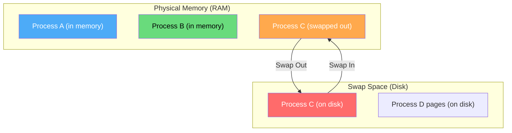
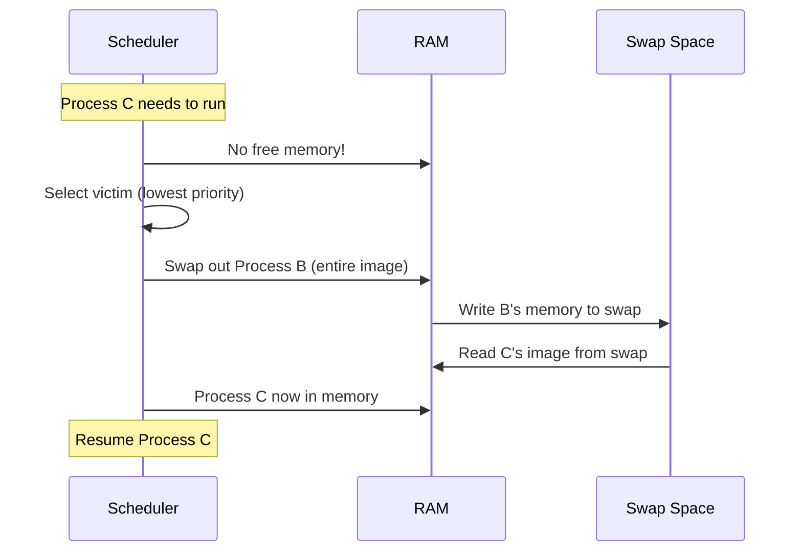
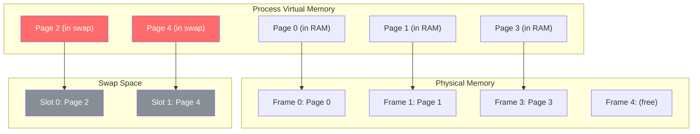
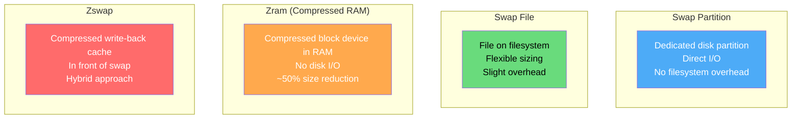
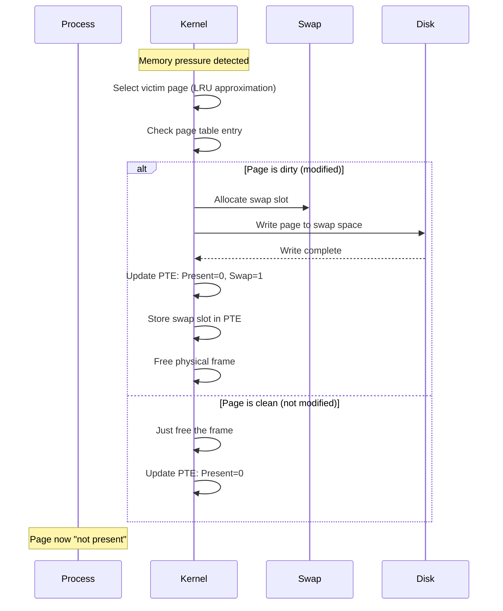
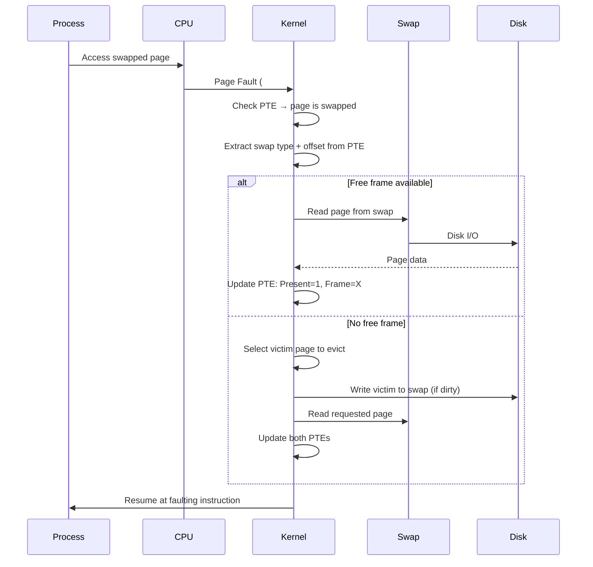
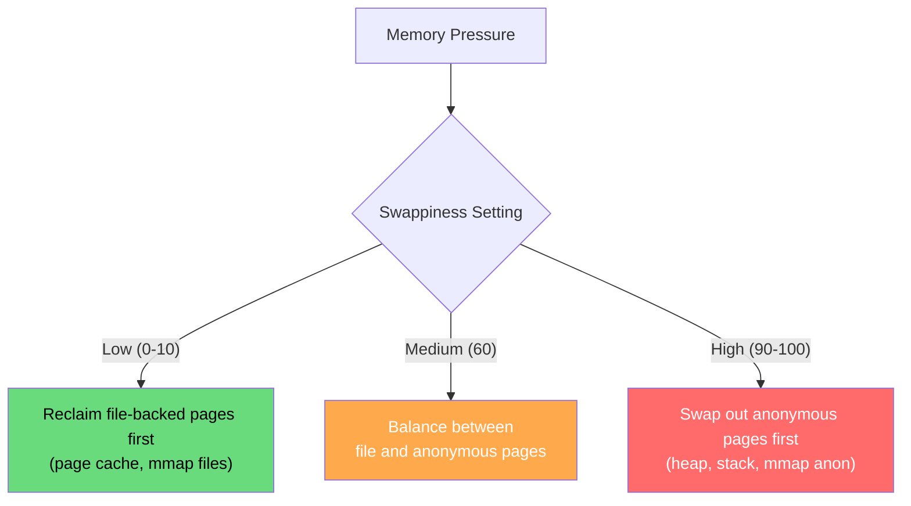

# Swapping

Swapping is the process of moving entire processes (or pages) between main memory and disk storage to free up physical memory. It allows the system to run more processes than can fit in RAM simultaneously.

## Overview

When physical memory is full, the OS must move some data to disk (swap space) to make room for new or existing processes.



## Whole-Process Swapping (Original Unix)

Early Unix swapped entire processes:



**Problems:**
- Transfer entire process image (slow, even if most pages aren't needed)
- Long latency for swap-in
- Wastes I/O bandwidth

## Modern: Paging (Page-Level Swapping)

Modern systems swap individual **pages**, not entire processes:



## Swap Space Management

### Linux Swap Space

```bash
# View swap usage
$ free -h
              total        used        free      shared  buff/cache   available
Mem:           15Gi       8.2Gi       2.1Gi       512Mi       5.2Gi       6.8Gi
Swap:          8.0Gi       1.2Gi       6.8Gi

# List swap areas
$ swapon --show
NAME      TYPE      SIZE   USED  PRIO
/dev/sda3 partition   8G   1.2G    -2
/swapfile file        2G   512M    -3

# Create a swap file
$ sudo fallocate -l 4G /swapfile
$ sudo chmod 600 /swapfile
$ sudo mkswap /swapfile
$ sudo swapon /swapfile

# Create a swap partition
$ sudo mkswap /dev/sdb1
$ sudo swapon /dev/sdb1

# Configure swappiness (how aggressively to swap)
$ cat /proc/sys/vm/swappiness
60  # Default: 0=never swap, 100=aggressive swap

# Set swappiness
$ echo 30 | sudo tee /proc/sys/vm/swappiness
```

### Swap Space Sizing

```bash
# Check current swap usage by process
$ for pid in /proc/[0-9]*; do
    if [ -f "$pid/smaps" ]; then
        swap=$(awk '/^Swap:/{s+=$2} END{print s}' "$pid/smaps" 2>/dev/null)
        if [ "$swap" -gt 0 ] 2>/dev/null; then
            name=$(cat "$pid/comm" 2>/dev/null)
            echo "$pid: $name - ${swap} kB swap"
        fi
    fi
done | sort -t'-' -k2 -n -r | head -10

# Use smem for better view
$ smem -t -k -s swap | tail -10
```

## Swap vs Swapfile vs Zram



### Zram (Compressed Swap in RAM)

```bash
# Enable zram
$ sudo modprobe zram num_devices=1

# Configure zram (4 GB compressed)
$ echo lz4 | sudo tee /sys/block/zram0/comp_algorithm
$ echo 4G | sudo tee /sys/block/zram0/disksize
$ sudo mkswap /dev/zram0
$ sudo swapon -p 100 /dev/zram0  # High priority

# Check zram stats
$ cat /sys/block/zram0/mm_stat
orig_data_size    compr_data_size  mem_used_total  ...
536870912         234567890        267386880       ...

# Compression ratio
$ awk '{printf "Compression: %.1f%%\n", $1/$2*100}' /sys/block/zram0/mm_stat
```

## Page-Out Process

When the kernel decides to swap out a page:



## Swap Slot in PTE

When a page is swapped out, the PTE stores the swap location:

```
PTE when page is in memory:
┌────────────────────────────────┬──────────────────────┐
│ Physical Frame Number          │ P=1, R/W, U/S, D, A │
└────────────────────────────────┴──────────────────────┘

PTE when page is swapped out:
┌────────────────────────────────┬──────────────────────┐
│ Swap Type + Swap Offset        │ P=0, Swap=1          │
└────────────────────────────────┴──────────────────────┘

Linux PTE format for swapped pages:
- Bit 0 (Present) = 0
- Bit 1 (Swap) = 1 (non-present but has swap info)
- Bits 2-7: swap type (which swap device)
- Bits 8-62: swap offset (location in swap space)
```

## Swap-In Process (Page Fault)



## Swappiness

Linux `swappiness` controls the balance between reclaiming file-backed pages and anonymous pages:

```bash
# Swappiness values:
# 0: Prefer to swap only when absolutely necessary
# 1-59: Increasingly prefer swapping
# 60: Default (balanced)
# 61-99: Prefer swapping over reclaiming file pages
# 100: Aggressive swapping

$ cat /proc/sys/vm/swappiness
60

# For database servers (prefer keeping data in RAM)
$ echo 10 | sudo tee /proc/sys/vm/swappiness

# For systems with zram (more swapping is OK)
$ echo 100 | sudo tee /proc/sys/vm/swappiness
```

### How Swappiness Affects Page Reclaim



## Swap Space on SSDs vs HDDs

```bash
# SSD swap is much faster than HDD
# But SSDs have write endurance limits

# Check if swap is on SSD
$ lsblk -d -o NAME,ROTA,SIZE,TYPE
NAME    ROTA   SIZE TYPE
sda        0  477G disk    # SSD (ROTA=0)
sdb        1    2T disk    # HDD (ROTA=1)

# Monitor swap I/O
$ iostat -x 1 | grep -E "Device|sd[ab]"
Device   r/s    w/s    rMB/s  wMB/s  await  svctm  %util
sda      123    456    1.2    4.5    0.5    0.1    5.6

# Check swap activity
$ vmstat 1
procs -----------memory---------- ---swap--
 r  b   swpd   free   buff  cache   si   so
 1  0  12345  204800  12345 45678   10   20
 0  0  12345  204700  12345 45678    0    0

# si = swap in (KB/s), so = swap out (KB/s)
```

## OOM Killer

When swap is exhausted, the kernel invokes the OOM (Out of Memory) killer:

```bash
# OOM killer selects process with highest oom_score
$ cat /proc/1/oom_score
0  # Kernel threads have low scores

$ cat /proc/$(pgrep firefox)/oom_score
678  # Memory-hungry processes have high scores

# View OOM events
$ dmesg | grep -i "oom\|killed"
[12345.678] Out of memory: Killed process 1234 (firefox) 
           total-vm:4567890kB, anon-rss:2345678kB

# Adjust OOM score (protect critical processes)
$ echo -1000 | sudo tee /proc/$(pgrep sshd)/oom_score_adj

# Make a process more likely to be killed
$ echo 1000 | sudo tee /proc/$(pgrep stress)/oom_score_adj
```

## Real-World: Monitoring Swap Activity

```bash
# Comprehensive swap monitoring
$ sar -W 1 5
Linux 5.15.0   08/02/2026   _x86_64_
16:00:01    pswpin/s pswpout/s
16:00:02      12.34     56.78
16:00:03       0.00      0.00

# Per-process swap usage
$ ps -eo pid,rss,vsz,comm --sort=-rss | head -10
  PID   RSS    VSZ COMMAND
 1234 2345678 4567890 firefox
 5678 1234567 3456789 chrome

# Detailed swap info
$ cat /proc/meminfo | grep -i swap
SwapTotal:       8388608 kB
SwapFree:        6291456 kB
SwapCached:       123456 kB
Zswap:            234567 kB
ZswapOrigDataSize: 345678 kB
ZswapCompressedSize: 234567 kB

# Watch swap in real-time
$ watch -n 1 'free -h | grep -E "Mem|Swap"'
```

## Interview Questions

### Beginner

**Q1: What is swapping?**
A: Moving processes or pages between main memory and disk storage. When RAM is full, the OS writes less-used pages to swap space on disk, freeing frames for active processes. When those pages are needed again, they're read back from swap.

**Q2: What is the difference between swap partition and swap file?**
A: 
- **Swap partition**: Dedicated disk partition, slightly faster (no filesystem overhead), fixed size
- **Swap file**: Regular file on any filesystem, flexible size, can be created/removed easily
- Both serve the same purpose; modern Linux performs nearly identically with either.

**Q3: What is swappiness?**
A: A Linux kernel parameter (0-100) that controls how aggressively the system swaps. Low values (0-10) mean "only swap when absolutely necessary"; high values (90-100) mean "prefer swapping over losing file cache." Default is 60.

### Intermediate

**Q4: Why is swapping to disk slow?**
A: Disk I/O is 100,000x slower than RAM access. A random 4 KB read from SSD takes ~100 μs vs ~100 ns from RAM. HDD is even worse at ~10 ms. Each swap-in/out involves disk I/O, page table updates, and potential TLB flushes.

**Q5: What is zram and when should you use it?**
A: zram creates a compressed block device in RAM. Swapped pages are compressed (~50% reduction) and stored in RAM instead of disk. Trade-off: uses CPU for compression but avoids slow disk I/O. Best for systems with limited disk (embedded, containers) or when disk swap would be too slow.

**Q6: How does the kernel know which pages to swap out?**
A: Using the **accessed bit** in PTEs and the **active/inactive lists**. The kernel periodically clears accessed bits. Pages not accessed become "inactive" and candidates for eviction. The LRU approximation (via two-list strategy) approximates Least Recently Used without the overhead of tracking every access.

### Advanced / FAANG-Level

**Q7: Design a swap system for a containerized environment with 100 containers sharing one host.**
A: 
1. **Per-container swap limits**: Use cgroups `memory.swap.max` to limit each container's swap usage
2. **Zram per container**: Each container gets its own zram device for fast compressed swap
3. **Priorities**: Critical containers get lower swappiness, batch jobs get higher
4. **Monitoring**: Per-container swap metrics via cgroups memory controller
5. **OOM handling**: Per-container OOM killer (`oom_score_adj` per cgroup)
6. **Swap accounting**: Track swap-in/swap-out per container for billing/alerting
7. **Implementation**: `echo 1G > /sys/fs/cgroup/memory/container1/memory.swap.max`

**Q8: A system shows high swap activity (so=5000 KB/s) but low memory pressure (available=2GB). What's wrong?**
A: Possible causes:
1. **Swappiness too high**: Check `/proc/sys/vm/swappiness`. If set to 100, kernel aggressively swaps even with free memory.
2. **NUMA imbalance**: Local node may be full while remote node has free memory. Check `numastat`.
3. **Memory fragmentation**: Free memory exists but not contiguous for huge pages. Check `/proc/buddyinfo`.
4. **cgroup limits**: Container's memory limit reached, forcing swap even though host has free memory.
5. **Huge page reservation**: Reserved huge pages reduce available memory for regular allocations.
6. **Investigation**: `vmstat 1`, `sar -W`, `cat /proc/zoneinfo`, `numastat -m`

**Q9: Explain the complete path of a swap-in page fault, from instruction to completion.**
A: 
1. CPU executes instruction that accesses swapped page
2. MMU translates: PTE has Present=0 → raises #PF exception
3. CPU saves state, jumps to page fault handler (`exc_page_fault`)
4. Kernel reads faulting address from CR2
5. `find_vma()` locates the VMA for this address
6. `handle_mm_fault()` → `__handle_mm_fault()` → `handle_pte_fault()`
7. PTE indicates swap: extract swap type and offset
8. `do_swap_page()` is called:
   a. Allocate a new physical frame (may trigger more page-outs)
   b. Find the swap device and sector
   c. Issue async I/O to read page from swap
   d. Wait for I/O completion
   e. Update PTE: set Present=1, Frame=allocated_frame, clear swap bits
   f. Add page to page cache (for potential sharing)
   g. Update swap map (decrement reference count)
9. If page was shared, may need to map it in other processes too
10. TLB is updated (or invalidated for refetch)
11. Return to user space, re-execute faulting instruction
12. Instruction completes successfully

## Common Mistakes

1. **Setting swappiness to 0 on all systems** — Some swapping is healthy; it keeps file cache warm.
2. **Not sizing swap properly** — Too small: OOM kills. Too large: wastes disk, encourages swapping.
3. **Ignoring NUMA with swap** — Swap pages should be swapped in on the node that needs them.
4. **Using swap for latency-sensitive workloads** — Database servers should have enough RAM, not rely on swap.
5. **Not monitoring swap activity** — High swap I/O degrades all disk operations.

## Summary

| Aspect | Details |
|--------|---------|
| **Purpose** | Extend effective memory beyond physical RAM |
| **Mechanism** | Move pages to/from disk swap space |
| **Speed** | 100,000x slower than RAM (SSD) |
| **Linux Default** | swappiness=60 |
| **Alternatives** | zram (compressed RAM), zswap (compressed cache) |
| **Modern Usage** | Safety net, not primary memory extension |
| **OOM Killer** | Last resort when all memory + swap exhausted |

## Cross-References

- **Prerequisite**: [Paging](./paging.md) — page-level memory management
- **Related**: [Page Replacement](../virtual-memory/page-replacement.md) — choosing which page to swap out
- **Related**: [Thrashing](../virtual-memory/thrashing.md) — excessive swapping
- **Related**: [Demand Paging](../virtual-memory/demand-paging.md) — loading pages on demand
- **Related**: [Working Set](../virtual-memory/working-set.md) — minimizing swap activity


## Cross References

- [Virtual Memory](../os/virtual-memory/README.md)
- [Page Replacement](../os/virtual-memory/page-replacement.md)
- [Thrashing](../os/virtual-memory/thrashing.md)
- [SSD](../storage/ssd.md)
- [Buffer Pool](../dbms/caching/buffer-pool.md)
