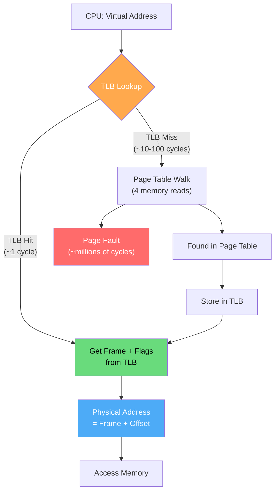
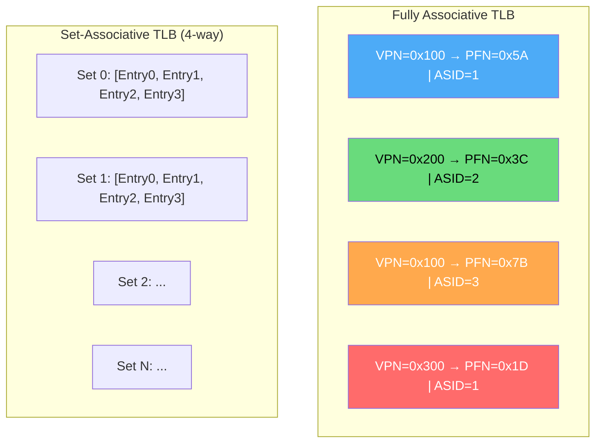
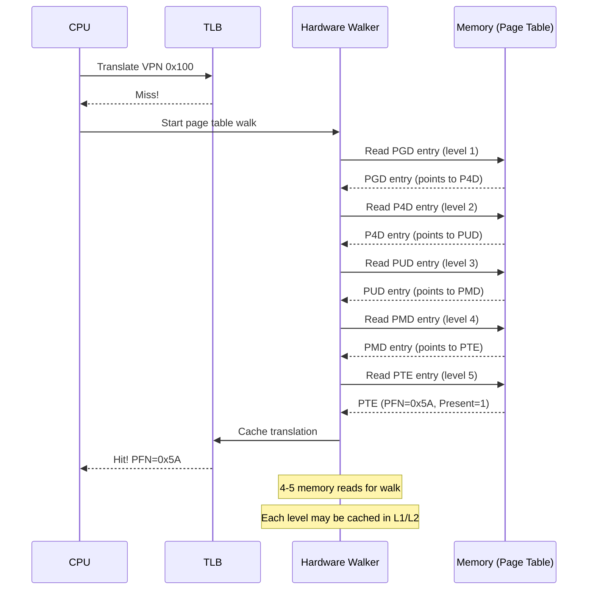
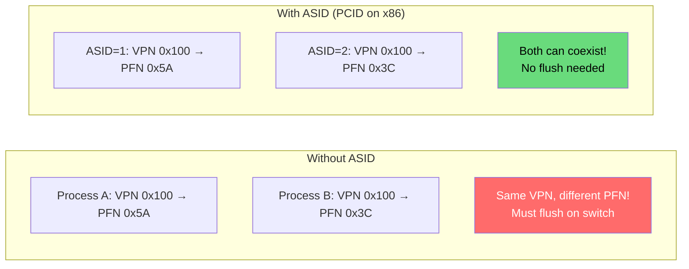
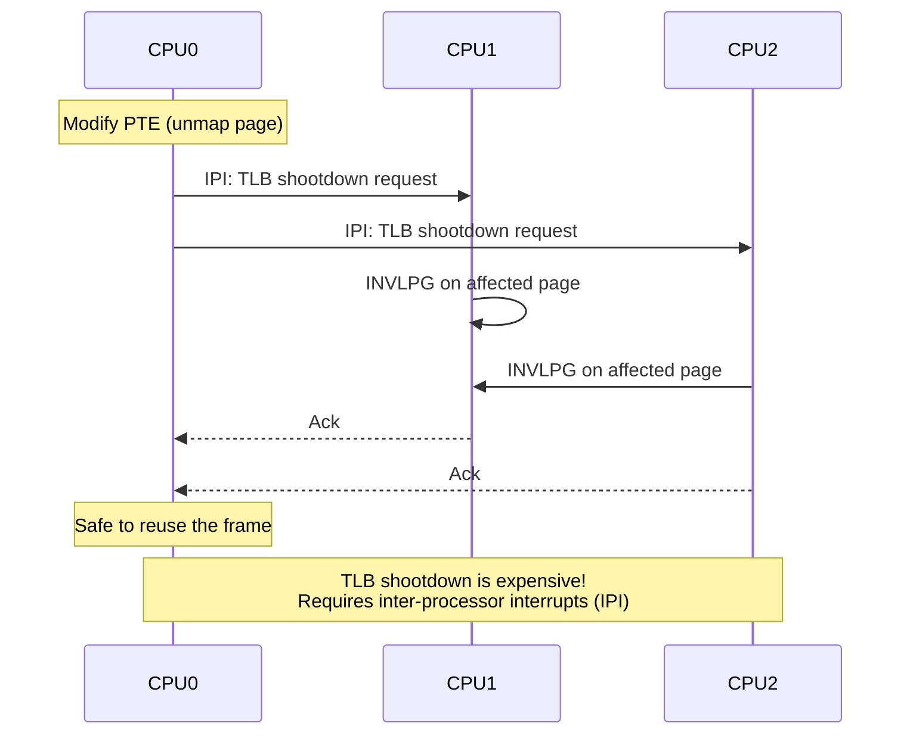

# Translation Lookaside Buffer (TLB)

The TLB is a specialized hardware cache inside the MMU that stores recent virtual-to-physical address translations. Without it, every memory access would require multiple memory reads just for address translation, making the system extremely slow.

## Overview

Accessing the page table in memory for every memory operation is expensive. With a 4-level page table, each translation requires **4 memory reads** before the actual data access — that's 5 memory operations per instruction! The TLB solves this by caching translations.



## TLB Architecture

### TLB Entry

Each TLB entry contains:

```
┌─────────────────────────────────────────────────────┐
│ Virtual Page Number (VPN) │ Physical Frame Number   │
├───────────────────────────┼─────────────────────────┤
│        ASID/PCID          │    Flags                │
├───────────────────────────┼─────────────────────────┤
│        Valid Bit          │    Permissions (R/W/X)  │
├───────────────────────────┼─────────────────────────┤
│        Dirty Bit          │    Global Bit           │
└───────────────────────────┴─────────────────────────┘
```

| Field | Purpose |
|-------|---------|
| **VPN** | Virtual page number (tag for lookup) |
| **PFN** | Physical frame number (result of translation) |
| **ASID/PCID** | Process ID (allow entries from multiple processes) |
| **Valid** | Entry is valid and in use |
| **R/W/X** | Permission bits |
| **Dirty** | Page has been written |
| **Global** | Don't flush on context switch (kernel pages) |

### TLB Organization



| Type | Description | Pros | Cons |
|------|-------------|------|------|
| **Fully Associative** | Entry can go anywhere | No conflict misses | Slow lookup (compare all) |
| **Direct Mapped** | Entry goes to one location | Fast lookup | High conflict misses |
| **Set Associative** | Entry goes to one of N locations | Balance of speed/hit rate | Moderate complexity |

Modern TLBs are typically **4-way to 16-way set-associative**.

## TLB Performance

### Hit Rate and Effective Access Time

```
Effective Access Time (EAT) = hit_rate × (TLB_time + memory_time)
                            + miss_rate × (TLB_time + page_walk_time + memory_time)

Example:
- TLB hit time: 1 cycle
- Memory access: 100 cycles  
- TLB hit rate: 99%
- Page table walk: 4 memory accesses = 400 cycles (4-level)

EAT = 0.99 × (1 + 100) + 0.01 × (1 + 400 + 100)
    = 0.99 × 101 + 0.01 × 501
    = 99.99 + 5.01
    = 105 cycles

Without TLB: 400 + 100 = 500 cycles per access
Speedup: 500 / 105 ≈ 4.8x
```

### TLB Reach

**TLB Reach** = Number of TLB entries × Page size

```
Typical modern x86-64:
- L1 dTLB: 64 entries × 4 KB = 256 KB reach
- L1 iTLB: 64 entries × 4 KB = 256 KB reach
- L2 STLB: 1536 entries × 4 KB = 6 MB reach

With 2 MB huge pages:
- L1 dTLB: 32 entries × 2 MB = 64 MB reach!
- L2 STLB: 1536 entries × 2 MB = 3 GB reach!

→ Huge pages dramatically increase TLB reach
```

```bash
# Check TLB sizes on your system
$ cpuid -1 | grep -i tlb
   cache/performance tlb: L1 data TLB: 4KB pages, 64 entries, 4-way
   cache/performance tlb: L1 data TLB: 2MB pages, 32 entries, 4-way
   cache/performance tlb: L1 instruction TLB: 4KB pages, 64 entries, 4-way
   cache/performance tlb: L2 unified TLB: 4KB pages, 1536 entries, 12-way

# Alternative
$ cat /proc/cpuinfo | grep -i tlb
```

## TLB Miss Handling

### Hardware Page Table Walk

Modern x86 and ARM processors have a **hardware page table walker** that automatically traverses the page table on TLB miss:



### Software TLB Miss Handling (MIPS-style)

Some architectures (older MIPS) handle TLB misses in software:

```c
// MIPS TLB miss handler (simplified)
void tlb_miss_handler() {
    unsigned long bad_vaddr = read_c0_badvaddr();
    unsigned long page_num = bad_vaddr >> PAGE_SHIFT;
    
    // Look up page table
    pte_t *pte = page_table_lookup(current->mm, page_num);
    
    if (pte && pte->present) {
        // Refill TLB
        write_tlb_entry(page_num, pte->frame, pte->flags);
    } else {
        // Page fault - call OS handler
        page_fault_handler(bad_vaddr);
    }
}
```

## ASID (Address Space Identifier)

Without ASID, every context switch requires a full TLB flush (expensive!). ASID tags each TLB entry with a process ID.



```bash
# Check PCID support (x86-64)
$ cat /proc/cpuinfo | grep pcid
flags           : ... pcid ...

# Linux PCID support
$ dmesg | grep -i pcid
[    0.000000] x86/mm: PCID enabled

# Linux uses 6-bit PCID (0-63) per CPU
# Kernel pages use a special "global" PCID that's never flushed
```

## TLB Flush Operations

```c
// x86 TLB flush instructions (from Linux kernel)

// Flush all non-global entries
static inline void flush_tlb_all(void) {
    // INVPCID type 2: flush all
    // or: write to CR3 (flushes all non-global)
}

// Flush one page (using INVLPG)
static inline void flush_tlb_page(struct vm_area_struct *vma, 
                                   unsigned long addr) {
    asm volatile("invlpg (%0)" ::"r" (addr) : "memory");
}

// Flush range (efficient for multiple pages)
static inline void flush_tlb_mm_range(struct mm_struct *mm,
                                       unsigned long start, 
                                       unsigned long end) {
    // Uses INVLPG for small ranges
    // Falls back to CR3 write for large ranges
}

// Switch to new page table (with PCID)
static inline void switch_mm(struct mm_struct *prev,
                              struct mm_struct *next,
                              struct task_struct *tsk) {
    // Write CR3 with new PGD and PCID
    // If PCID supported, don't flush global entries
}
```

## Modern TLB Hierarchy

Modern CPUs have a multi-level TLB hierarchy:

```
┌─────────────────────────────────────────────────┐
│                    CPU Core                       │
│  ┌──────────────────┐  ┌──────────────────┐     │
│  │   L1 iTLB        │  │   L1 dTLB        │     │
│  │  (Instructions)   │  │   (Data)         │     │
│  │  64 entries, 4W   │  │  64 entries, 4W  │     │
│  │  1 cycle          │  │  1 cycle         │     │
│  └────────┬─────────┘  └────────┬─────────┘     │
│           │                      │               │
│           └──────────┬───────────┘               │
│                      ▼                           │
│            ┌──────────────────┐                  │
│            │   L2 STLB        │                  │
│            │  (Shared)        │                  │
│            │  1536 entries    │                  │
│            │  6-7 cycles      │                  │
│            └────────┬─────────┘                  │
│                     ▼                            │
│            ┌──────────────────┐                  │
│            │  Hardware Walker │                  │
│            │  Page Table Walk │                  │
│            │  ~100 cycles     │                  │
│            └──────────────────┘                  │
└─────────────────────────────────────────────────┘
```

```bash
# Intel TLB characteristics (example: Skylake)
# L1 iTLB: 64 entries (4KB), 8 entries (2MB/4MB) - 4-way
# L1 dTLB: 64 entries (4KB), 32 entries (2MB), 4 entries (1GB) - 4-way
# L2 STLB: 1536 entries (4KB+2MB) - 12-way

# Measure TLB misses with perf
$ perf stat -e dTLB-load-misses,dTLB-loads,iTLB-load-misses,iTLB-loads ./my_program

# Example output:
# 1,234,567  dTLB-load-misses
# 987,654,321 dTLB-loads        (0.13% miss rate)
```

## TLB Shootdown

When one CPU modifies a page table entry that other CPUs may have cached in their TLBs, a **TLB shootdown** is required:



```bash
# Monitor TLB shootdowns
$ perf stat -e tlb:tlb_flush ./my_program

# See TLB shootdown overhead
$ sudo perf record -e tlb:tlb_flush -ag ./my_program
$ sudo perf report
```

## Real-World: TLB Performance Analysis

```bash
# Full TLB analysis with perf
$ perf stat -e \
    dTLB-loads,dTLB-load-misses,dTLB-stores,dTLB-store-misses,\
    iTLB-loads,iTLB-load-misses \
    ./my_program

# Analyze TLB misses by function
$ perf record -e dTLB-load-misses -g ./my_program
$ perf report

# Use perf mem for detailed analysis
$ perf mem record ./my_program
$ perf mem report --sort=mem,sym

# Check if huge pages would help
$ perf stat -e dTLB-load-misses ./my_program_hugepages
# Compare with:
$ perf stat -e dTLB-load-misses ./my_program_4k_pages
```

## C++ TLB-Friendly Code

```cpp
// BAD: Column-major traversal (cache + TLB unfriendly)
void bad_traversal(int matrix[N][N]) {
    for (int j = 0; j < N; j++)
        for (int i = 0; i < N; i++)
            matrix[i][j] = 0;  // Jumps across pages
}

// GOOD: Row-major traversal (cache + TLB friendly)
void good_traversal(int matrix[N][N]) {
    for (int i = 0; i < N; i++)
        for (int j = 0; j < N; j++)
            matrix[i][j] = 0;  // Sequential access, same pages
}

// GOOD: Use huge pages for large allocations
#include <sys/mman.h>
void *ptr = mmap(NULL, 2 * 1024 * 1024, 
                 PROT_READ | PROT_WRITE,
                 MAP_PRIVATE | MAP_ANONYMOUS | MAP_HUGETLB, 
                 -1, 0);

// GOOD: Align data structures to page boundaries
struct alignas(4096) PageAlignedData {
    char data[4096];
};
```

## Interview Questions

### Beginner

**Q1: What is the TLB and why is it needed?**
A: The TLB (Translation Lookaside Buffer) is a hardware cache that stores recent virtual-to-physical address translations. Without it, every memory access would require walking the page table (4+ memory reads), making the system ~5x slower. The TLB provides near-instant translation for recently used pages.

**Q2: What happens on a TLB miss?**
A: The hardware page table walker automatically traverses the page table levels in memory, finds the translation, and stores it in the TLB for future use. If the page isn't present in memory, a page fault occurs. Modern hardware does this transparently; older architectures (MIPS) used software TLB refill.

**Q3: How big is a typical TLB?**
A: Modern x86-64 CPUs have: L1 iTLB: ~64 entries for instructions, L1 dTLB: ~64 entries for data, L2 STLB: ~1536 entries shared. With 4KB pages, L1 TLB reach is only 256 KB — which is why huge pages (2MB) are important for large workloads.

### Intermediate

**Q4: What is TLB reach and why does it matter?**
A: TLB reach = TLB entries × page size. With 64 entries × 4KB = 256KB. If a program's working set exceeds TLB reach, it causes frequent TLB misses. Solutions: increase entries (limited by hardware), use huge pages (2MB pages → 128MB reach with same entries), or improve data locality.

**Q5: What is ASID/PCID and how does it help?**
A: Address Space ID (ASID) or Process Context ID (PCID on x86) tags each TLB entry with a process identifier. This allows TLB entries from multiple processes to coexist. Without it, every context switch requires flushing the entire TLB. With PCID, the kernel just changes the active PCID — no flush needed.

**Q6: What is a TLB shootdown?**
A: When one CPU modifies a page table entry (e.g., unmaps a page), other CPUs might have the old translation cached in their TLBs. TLB shootdown sends inter-processor interrupts (IPIs) to all CPUs, forcing them to flush the affected TLB entries. It's expensive and a major scalability concern in multi-core systems.

### Advanced / FAANG-Level

**Q7: A database server processes 100 GB of data with random access patterns. TLB miss rate is 5%. Design a solution to reduce TLB misses.**
A: 
1. **Use 2MB huge pages**: TLB reach goes from 256KB to 128MB (512x improvement). For 100GB data, need ~50K TLB entries instead of 25M.
2. **Use 1GB huge pages** for the database buffer pool: reach becomes 32GB with 32 entries.
3. **Implement a B+ tree with page-aligned nodes**: each node fits in one huge page, reducing TLB pressure.
4. **Consider huge page reservation**: `echo 50000 > /proc/sys/vm/nr_hugepages`
5. **Profile with `perf stat -e dTLB-load-misses`** to measure improvement.

**Q8: Design a software TLB for a custom RISC processor with no hardware page table walker.**
A: 
- **TLB Structure**: Fully associative, 64 entries, each with VPN, PFN, ASID, flags
- **Miss Handler**: 
  1. Read CR3 to get page table base
  2. Walk 4-level page table in software
  3. On each level, check if the table page is in a "page table cache" (separate from TLB)
  4. If found in cache, use cached value; else read from memory
  5. Store final translation in TLB (LRU eviction)
- **Optimizations**: 
  - Keep page table pages pinned in memory (never evict)
  - Use a small direct-mapped cache for upper page table levels
  - Prefetch adjacent TLB entries
  - Maintain a software TLB miss count for profiling

**Q9: Explain the interaction between TLB, cache, and page table during a memory access. What happens at each level?**
A: Complete flow:
1. CPU generates virtual address
2. **L1 cache**: Virtually indexed, physically tagged (VIPT). TLB lookup and cache index happen in parallel.
3. **TLB lookup**: If hit, get physical frame. If miss, start page table walk.
4. **Page table walk** (on TLB miss): Hardware walker reads page table from memory. Each level may hit in L2/L3 cache. Total: 4-5 memory accesses.
5. **Cache tag comparison**: Physical address from TLB is compared with cache tags. If match → cache hit.
6. **Cache miss**: Access main memory for the data.
7. **TLB + Cache interaction**: VIPT design allows TLB and cache lookup in parallel. If L1 is virtually indexed but physically tagged, the TLB only needs to provide the physical tag for comparison, not the index.

## Common Mistakes

1. **Confusing TLB with cache** — TLB caches *translations* (address mappings); data cache caches *data*. They're separate structures.
2. **Assuming TLB is part of the page table** — TLB is hardware; page table is in memory. TLB caches page table entries.
3. **Ignoring TLB misses in performance** — A 1% TLB miss rate can cause 5-10% slowdown due to page walk cost.
4. **Forgetting TLB flush on unmap** — If you unmap a page without flushing TLB, other CPUs might access stale translations → security bug.
5. **Not considering huge pages** — For large workloads, 4KB pages cause excessive TLB misses. Huge pages are a free performance win.

## Summary

| Aspect | Details |
|--------|---------|
| **Purpose** | Cache virtual-to-physical translations |
| **Location** | Inside MMU (hardware) |
| **Hit Time** | ~1 CPU cycle |
| **Miss Cost** | ~10-100 cycles (page walk) |
| **Typical Size** | L1: 64 entries, L2: 1536 entries |
| **Reach (4KB)** | L1: 256 KB, L2: 6 MB |
| **Reach (2MB)** | L1: 128 MB, L2: 3 GB |
| **ASID/PCID** | Avoid flush on context switch |
| **Shootdown** | IPI-based flush across cores |

## Cross-References

- **Prerequisite**: [Page Tables](./page-tables.md) — what the TLB caches
- **See Also**: [Huge Pages](./huge-pages.md) — increasing TLB reach
- **See Also**: [Multi-Level Page Tables](./multi-level-page-tables.md) — what happens on TLB miss
- **Related**: [Paging](./paging.md) — the translation mechanism
- **Performance**: [Thrashing](../virtual-memory/thrashing.md) — when TLB misses get extreme


## Cross References

- [Cache Hierarchy](../../arch/memory-hierarchy/cache-basics.md)
- [Paging](paging.md)
- [Page Tables](page-tables.md)
- [Cache Mapping](../../arch/memory-hierarchy/cache-mapping.md)
