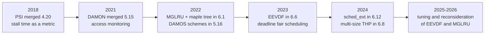
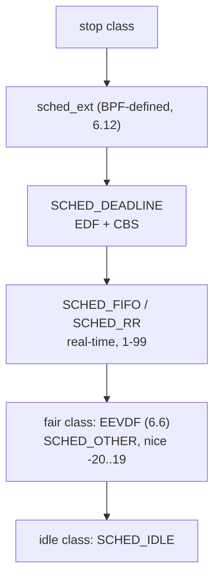

# Modern Linux Kernel Internals (2016–2026)

## Overview

Most OS textbooks stop at CFS, active/inactive LRU lists, and radix trees — but the kernels running on production machines look different. Between 2016 and 2026, Linux replaced its CPU scheduler core (EEVDF replacing CFS in 6.6), rewrote page reclaim around generations and access monitoring (MGLRU in 6.1, DAMON in 5.15), made resource pressure observable (PSI in 4.20), made scheduler policy loadable in BPF (sched_ext in 6.12), and swapped the VMA radix tree for the maple tree. This section maps those changes so you can answer the growing class of interview questions that assume a post-2022 kernel.

> **Interview one-liner:** "The modern-kernel themes are: latency guarantees instead of pure fairness (EEVDF), working-set-driven reclaim instead of list scanning (MGLRU + DAMON + PSI), and policy moving out of C code into BPF and userspace (sched_ext, pressure-driven OOM daemons)."

If your mental model of Linux comes from a 2015-era textbook, expect exactly three interview traps: quoting CFS internals as current (EEVDF replaced it in 6.6), describing active/inactive LRU as *the* reclaimer (MGLRU shipped in 6.1), and treating memory pressure as an OOM-killer event instead of a measurable, actionable signal (PSI, 4.20). This section exists to fix all three.

## The Decade in One Table

| Change | Kernel (year) | Replaces / improves | Why it exists |
|--------|---------------|--------------------|---------------|
| PSI — Pressure Stall Information | 4.20 (2018) | load average, vmpressure | Measures *lost work*: time tasks spend stalled on CPU, memory, or I/O; feeds userspace OOM daemons |
| io_uring | 5.1 (2019) | aio / syscall-based I/O | Async I/O without syscalls per operation (covered in [io_uring](../kernel/io-uring.md)) |
| pidfd | 5.3 (2019) | PID reuse races | File-descriptor handles to processes for race-free signaling and management |
| DAMON — Data Access MONitor | 5.15 (2021) | idle-page tracking, manual profiling | Access-frequency monitoring with adaptive regions at bounded overhead |
| DAMOS + DAMON_RECLAIM | 5.16 (2022) | reactive reclaim | Actionable schemes: page out cold regions proactively under quotas |
| MGLRU — Multi-Gen LRU | 6.1 (2022) | active/inactive lists | Generation/tier reclaim that tracks the working set at low kswapd cost |
| Maple tree | 6.1 (2022) | VMA radix tree | RCU-friendly B-tree-like range structure for scalable VMA lookup (see [maple tree](../../linux/kernel/memory/maple-tree-xarray.md)) |
| EEVDF scheduler | 6.6 (2023) | CFS | Deadline-based fair scheduling with real latency guarantees ([EEVDF](./eevdf-scheduler.md)) |
| Multi-size THP | 6.8 (2024) | 2 MiB-only THP | THP at 64 KiB–1 MiB sizes to cut TLB misses without overcommitting whole 2 MiB blocks |
| sched_ext | 6.12 (2024) | fixed scheduling classes | Custom CPU schedulers written in BPF, loadable and unloadable at runtime ([sched_ext](../../linux/kernel/processes/sched-ext.md)) |

## Three Themes Behind the Changes

### 1. From fairness to latency

CFS delivered *proportional-share fairness* through vruntime, but fairness says nothing about how long a task waits between runs. Latency was handled by heuristics — target latency, wakeup granularity, sleeper bonuses — that accumulated two decades of special cases. EEVDF keeps the fair-share math but adds an explicit **virtual deadline** per task, so a latency-sensitive task can request a short slice and get scheduled earlier by rule, not by heuristic. This is covered in [EEVDF Scheduler](./eevdf-scheduler.md).

The headline formula to remember: in EEVDF the virtual deadline is the task's virtual runtime plus its requested slice converted to virtual time, so *weight* still controls long-run bandwidth while *slice length* controls promptness. Two tasks with identical nice values can now have completely different latency behavior — an audio thread with short slices preempts a database scanner with long slices, with no interactivity detector involved.

### 2. From list scanning to working sets

Classic reclaim walks active/inactive lists and samples referenced bits; its decision quality and its CPU cost both degrade under real memory pressure. The modern stack measures access patterns (DAMON), reclaims by age and frequency (MGLRU), and reports the resulting harm as stall time (PSI). Userspace closes the loop with proactive knobs like `memory.reclaim` and pressure-triggered daemons. See [PSI and DAMON](./psi-and-damon.md) and [Multi-Gen LRU](./mglru.md).

The pattern inside this theme is *measurement before policy*. PSI asks "how much work is being lost?"; DAMON asks "which address ranges are actually cold?"; MGLRU asks "given that we must evict, which order is cheapest and least wrong?". Interviewers like this framing because it shows you can decompose a vague question like "the server feels slow under memory pressure" into signal, cause, and actuation layers.

### 3. From compiled-in policy to programmable policy

sched_ext lets an entire CPU scheduler be written in BPF, loaded like a module, and replaced by the default on fault. Combined with eBPF observability ([eBPF](../kernel/ebpf.md), [eBPF Deep Dive](../kernel-advanced/ebpf-deep.md)) and PSI triggers, the kernel increasingly exposes *mechanisms* while policy moves to userspace. The maple tree is the scalability enabler in this theme: VMA operations stop being a cache-hostile radix-tree walk and become an RCU-safe range query.

This theme also changed *who* tunes the kernel. Before: distributors and sysadmins tuned global sysctls (`sched_latency_ns`, `swappiness`). After: applications declare intent per task (`sched_setattr` slices), per cgroup (pressure files, `memory.reclaim`), or per fleet (oomd rule engines), and the kernel supplies the enforcement. In an interview, framing a tuning answer as "who owns the policy — the task, the container, or the kernel?" signals that you have operated post-2022 systems rather than only studied them.



## Check What Your Kernel Actually Runs

Every claim above is checkable on a running machine, and being able to do so live is itself an interview skill:

```bash
uname -r                                  # EEVDF needs >= 6.6; MGLRU/maple tree >= 6.1
ls /proc/pressure/                        # PSI exists? (cpu, memory, io)
cat /proc/pressure/memory                 # some/full stall percentages right now
ls /sys/kernel/mm/lru_gen/                # MGLRU knobs (enabled, min_ttl_ms)
cat /sys/kernel/mm/lru_gen/min_ttl_ms     # working-set protection in milliseconds
ls /sys/kernel/sched_ext                  # sched_ext present? (kernel >= 6.12)
head -3 /proc/pressure/io                 # io some avg10=... avg60=... avg300=... total=...
```

Reading these files in an interview answer — "first I would confirm PSI is enabled and check `memory full`, then look at whether MGLRU is active via `/sys/kernel/mm/lru_gen/enabled`" — demonstrates the modern debugging workflow: measure the symptom (PSI), identify the mechanism (kernel version), then apply the matching knob.



The class stack survived every change above: EEVDF replaced CFS *inside* the fair class, and sched_ext inserts a programmable class between stop and deadline. That is worth stating explicitly in interviews — the scheduler got new engines, not a new chassis, which is why policy ABIs (nice values, `cpu.weight`, `chrt`) kept working throughout.

## Key Numbers Worth Memorizing

Interviews reward version numbers that anchor claims:

- **4.20 (2018)** — PSI merged; cgroup pressure files and triggers follow in **5.2** (2019).
- **5.15 (2021)** — DAMON core; **5.16 (2022)** — DAMOS, DAMON_RECLAIM, debugfs; **6.0 (2022)** — DAMON_LRU_SORT.
- **6.1 (2022, December)** — MGLRU *and* the maple tree in the same release.
- **6.6 (2023)** — EEVDF replaces CFS for SCHED_OTHER.
- **6.8 (2024)** — multi-size THP.
- **6.12 (2024)** — sched_ext merged; EEVDF base slice default raised to 3 ms.

Pair the version with the *replaced mechanism* and you have a complete interview sentence: "6.6 replaced CFS's heuristic latency with per-task virtual deadlines" beats "the scheduler changed at some point."

## Page Map for This Directory

| Page | Topic | Read it when |
|------|-------|--------------|
| [EEVDF Scheduler](./eevdf-scheduler.md) | Eligibility, lag, virtual deadlines; CFS comparison | Asked "what replaced CFS and why" |
| [PSI and DAMON](./psi-and-damon.md) | Stall metrics, pressure triggers, OOM daemons, DAMOS schemes | Asked about memory pressure, proactive reclaim, or oomd |
| [Multi-Gen LRU](./mglru.md) | Generations, tiers, Bloom filters, working-set protection | Asked how modern Linux decides which pages to evict |

## Link Map to Existing Pages

The modern features build on mechanics documented elsewhere in this book:

| Topic | Existing page |
|-------|--------------|
| CFS mechanics, vruntime, nice weights | [Linux CFS](../scheduling/linux-cfs.md), [CFS internals](../../linux/kernel/processes/cfs.md), [Scheduler Internals](../advanced/scheduler-internals.md) |
| EEVDF implementation detail | [EEVDF](../../linux/kernel/processes/eevdf.md) (kernel-side companion to the theory page in this directory) |
| Scheduling classes, scheduler architecture | [Scheduler](../../linux/kernel/processes/scheduler.md), [Real-time Scheduling](../scheduling/realtime.md) |
| sched_ext guides | [sched_ext](../../linux/kernel/processes/sched-ext.md), [sched_ext guide](../../linux/kernel/processes/sched-ext-guide.md) |
| PSI deep dive (accounting pipeline, triggers) | [PSI: Pressure Stall Information](../advanced/psi-pressure-stall-information.md), [PSI operations](../../linux/kernel/processes/psi.md) |
| Reclaim, OOM killer, memcg | [Reclaim](../../linux/kernel/memory/reclaim.md), [OOM Killer](../../linux/kernel/memory/oom-killer.md), [Memcg Internals](../../linux/kernel/memory/memcg-internals.md) |
| DAMON and maple tree kernel pages | [DAMON](../../linux/kernel/memory/damon.md), [Maple Tree & XArray](../../linux/kernel/memory/maple-tree-xarray.md) |
| Classic LRU and page replacement | [LRU](../virtual-memory/lru.md), [Page Replacement](../memory/page-replacement.md), [Working Set](../virtual-memory/working-set.md) |
| cgroups and containers | [cgroups](../containers/cgroups.md), [Namespaces & Cgroups](../kernel-advanced/namespaces-cgroups.md) |
| Kernel history and versions | [Notable Versions](../../linux/history/notable-versions.md) |

## What Did *Not* Change

The decade's rewrites were surgical, and knowing the stable surface is as useful as knowing the new machinery. Nice values still map to the same weight table and cgroup `cpu.weight` keeps its meaning — EEVDF reused CFS's fairness substrate. Page tables, the buddy allocator, the slab allocator, and the VFS layer are structurally unchanged in this window; the maple tree changed the *index of VMAs*, not the VMA abstraction itself. And SCHED_FIFO/RR/DEADLINE sit above the fair class exactly as before, so real-time guarantees were never touched by the EEVDF transition.

This stability is the reason the community accepted three large rewrites in one decade: each preserved user-visible contracts (fair share, LRU API, scheduling-class ordering) while replacing the machinery underneath. When an interviewer asks "didn't that break everything?", the strong answer is the contract-vs-mechanism distinction, with the nice-weight ABI as your concrete example.

## Interview Questions

1. **Which kernel versions introduced PSI, MGLRU, and EEVDF, and what problem does each solve?** PSI landed in 4.20 (2018) and measures the wall-clock time tasks spend stalled on CPU, memory, and I/O, replacing load average as the honest saturation signal. MGLRU landed in 6.1 (2022) and restructures page reclaim into generations and tiers so reclaim cost stays proportional to the working set instead of list length. EEVDF landed in 6.6 (2023) and replaces CFS's vruntime-only ordering with eligibility plus earliest virtual deadline, giving latency-sensitive tasks a principled wait bound. Together they mark the shift from heuristic-heavy 2000s kernels to measured, guarantee-based resource management.
2. **Why did the kernel community accept these large rewrites after CFS served for 16 years?** Each change attacked a measurable failure: CFS's interactive heuristics produced unpredictable wake-up latency; the active/inactive lists made kswapd burn CPU scanning pages that were never going to be hot again; and load average could not distinguish a healthy saturated machine from a thrashing one. The rewrites also shipped with data — MGLRU's Android working-set numbers and PSI's 10x false-positive reduction versus vmpressure — and with compatibility paths (EEVDF keeps the nice-weight ABI; MGLRU keeps the same LRU API surface).
3. **What is sched_ext and when would you use it instead of tuning CFS/EEVDF?** sched_ext, merged in 6.12, is a scheduler class whose behavior is defined by BPF programs that you load and unload at runtime; tasks fall back to the default class if the BPF scheduler misbehaves. You use it for workloads whose policy does not fit a global fair scheduler — games, SMT-aware packers, research schedulers, or per-application CPU allocation — when the alternative would be patching and rebuilding the kernel for every experiment.
4. **What changed about VMA management in 6.1?** The mmap subsystem replaced its radix tree of VMAs with the maple tree, a B-tree-like range structure designed for RCU-safe concurrent reads and efficient range operations. This reduced mmap_lock contention pressure, made lookups and range queries cheaper for multi-threaded applications with many mappings, and set up later work such as per-VMA locks by giving VMAs a stable, scalable index.
5. **How do PSI, DAMON, and MGLRU work together on a memory-constrained system?** DAMON identifies *which* address ranges are cold with adaptive, bounded-overhead monitoring; DAMOS schemes and MGLRU act on that information by paging out or deprioritizing cold data before the OOM killer is relevant; and PSI measures *whether the action helped* by reporting the stall time users actually experienced. systemd-oomd and similar daemons read the PSI side to decide when reclaim is hopeless and a cgroup must be killed.
6. **What did the maple tree change, and why does it matter for applications rather than the kernel?** The maple tree is a B-tree-like range structure that replaced the VMA radix tree in 6.1, designed so readers run under RCU without locks and range operations (find, split, merge) are efficient. Multi-threaded applications with many mappings — JIT engines, allocators, emulators — hammer `mmap_lock`, and the radix tree forced cache-hostile walks plus write-side serialization there. With a scalable, RCU-friendly index, lookups contend less and follow-on work like per-VMA locks became practical, so the application-visible effect is lower mmap/munmap/fault latency under concurrency.

## Key Takeaways

- PSI (4.20, 2018) made "how much work is being lost" measurable; every modern OOM daemon is built on it.
- DAMON (5.15, 2021) made access-pattern monitoring affordable with adaptive regions; DAMOS (5.16) turned its output into actionable schemes.
- MGLRU (6.1, 2022) replaced active/inactive lists with generations and tiers, cutting kswapd cost and tracking true working sets.
- EEVDF (6.6, 2023) replaced CFS, keeping proportional fairness but adding explicit virtual deadlines for latency control.
- sched_ext (6.12, 2024) made CPU scheduling policy a BPF-loadable, crash-safe runtime choice.
- The maple tree (6.1) replaced the VMA radix tree, making mmap state RCU-scalable.
- Multi-size THP (6.8) extended transparent huge pages below 2 MiB, trading TLB savings against overcommit waste.
- Interviewers increasingly ask "how does that work *today*" — anchor answers to kernel versions and the measurement behind each change.
- The safe interview formula: name the kernel version, name the replaced mechanism, then name the measurement that motivated the change.

## How to Read This Section

- Read [Linux CFS](../scheduling/linux-cfs.md) and [LRU](../virtual-memory/lru.md) first if the textbook mechanics are fuzzy — the modern pages assume you know what vruntime and an LRU list are.
- Then read [EEVDF Scheduler](./eevdf-scheduler.md) and [Multi-Gen LRU](./mglru.md) for the two headline rewrites, each of which is self-contained with the math and diagrams interviewers probe.
- Finally read [PSI and DAMON](./psi-and-damon.md), which ties the memory-side features into the observability story that production systems (systemd-oomd, Android's lmkd, Meta's oomd) actually run.
- Skim [Scheduler Internals](../advanced/scheduler-internals.md) and [PSI: Pressure Stall Information](../advanced/psi-pressure-stall-information.md) when you need the deeper mechanics behind scheduling classes and PSI accounting.

## References

- Kernel documentation home — <https://docs.kernel.org/>
- EEVDF scheduler documentation — <https://docs.kernel.org/scheduler/sched-eevdf.html>
- Multi-Gen LRU admin guide — <https://docs.kernel.org/admin-guide/mm/multigen_lru.html>
- DAMON documentation — <https://docs.kernel.org/mm/damon/index.html>
- PSI — Pressure Stall Information — <https://docs.kernel.org/accounting/psi.html>
- sched_ext — Extensible Scheduler Class — <https://docs.kernel.org/scheduler/sched-ext.html>
- Maple tree — <https://docs.kernel.org/core-api/maple_tree.html>
- cgroup v2 (memory controller, pressure files) — <https://docs.kernel.org/admin-guide/cgroup-v2.html>
- LWN: *The multi-generational LRU* (Jonathan Corbet, 2022) — <https://lwn.net/Articles/851605/>
- LWN: *Completing the EEVDF scheduler* (Jonathan Corbet, 2024) — <https://lwn.net/Articles/969062/>

## Cross-References

- [Linux CFS](../scheduling/linux-cfs.md) — the scheduler EEVDF replaced; read first for vruntime context
- [PSI: Pressure Stall Information](../advanced/psi-pressure-stall-information.md) — deep dive on PSI accounting and triggers
- [Scheduler Internals](../advanced/scheduler-internals.md) — scheduling-class architecture shared by CFS and EEVDF
- [LRU](../virtual-memory/lru.md) — classic list-based replacement that MGLRU generalizes
- [cgroups](../containers/cgroups.md) — where per-cgroup pressure files and memory knobs live
- [io_uring](../kernel/io-uring.md) — the other headline 2019-era change, from the same measure-and-batch philosophy
- [Scheduler](../../linux/kernel/processes/scheduler.md) — scheduling-class architecture that hosts EEVDF and sched_ext
- [Reclaim](../../linux/kernel/memory/reclaim.md) — the reclaim pipeline MGLRU reorders
- [Notable Versions](../../linux/history/notable-versions.md) — release-by-release timeline of the changes above
