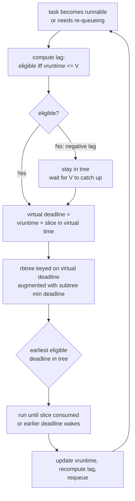

# EEVDF: Earliest Eligible Virtual Deadline First

## Overview

EEVDF is the CPU scheduling algorithm that replaced CFS for normal (SCHED_OTHER) tasks. It was merged into Linux 6.6 (October 2023) after a 2023 rewrite by Peter Zijlstra of a 1995 proportional-share algorithm by Ion Stoica and Hussein Abdel-Wahab. EEVDF keeps CFS's weight-based fairness but adds two concepts CFS never had: **eligibility** (a task that has already consumed its fair share must wait) and a **virtual deadline** (among eligible tasks, the one that will reach its fair allocation soonest runs first). The result is bounded, tunable latency for interactive workloads without the stack of heuristics CFS had accumulated.

> **Interview one-liner:** "EEVDF replaces CFS in kernel 6.6 — it keeps nice-weight fairness via virtual runtime, but picks the *eligible* task (lag ≥ 0) with the earliest virtual deadline, so latency becomes a first-class, per-task property instead of a heuristic."

This page covers the theory: why CFS was replaced, the eligibility/lag/deadline math, and the behavior changes. The kernel-side implementation walkthrough (data structures, code paths, `sched_setattr` usage) lives in the companion page [EEVDF Scheduler](../../linux/kernel/processes/eevdf.md).

## Why CFS Was Replaced

CFS (2007) schedules the runnable task with the lowest **virtual runtime** (vruntime), where vruntime accumulates CPU time normalized by weight: `vruntime += Δt × 1024/weight`. That delivers proportional-share fairness: over any window, each task receives CPU time proportional to its weight. But fairness alone cannot answer "when does my woken-up task run?" — and it was exactly this gap that forced CFS to grow heuristics:

| CFS heuristic | Purpose | Failure mode |
|---------------|---------|--------------|
| Target latency (`sched_latency_ns`) | Time for all runnable tasks to get one slice | Scales badly past ~8 runnable tasks; slices collapse to the 0.75 ms floor |
| `place_entity()` sleeper bonus | Waking tasks get vruntime = min_vruntime (slightly behind) | A task that sleeps briefly to reset vruntime gets a windfall — "cheating" via short sleeps |
| Wakeup preemption granularity | Prevent waking tasks from immediately preempting | Magic-number tuning; wrong values cause either sluggish wakeups or context-switch storms |
| Batch/idle class hints | Keep background work from hurting latency | Coarse: a task is interactive or not, with no per-task latency contract |

The structural problem is that **vruntime encodes only history, never intent**. CFS knows how much service a task has had but nothing about how promptly it needs more. Interviews frequently probe this: "CFS gives every task its fair share over time — why isn't that enough?" The answer is that fair share bounds *bandwidth*, not *delay*: a task can be perfectly fairly treated and still wait many milliseconds behind a batch workload, because nothing in vruntime distinguishes a 1 ms-latency interactive thread from a 50 ms-tolerant compiler.

EEVDF's design goal was to delete the heuristics and derive latency behavior from the algorithm itself, while keeping the fair-share property so the nice-value ABI and cgroup `cpu.weight` semantics stay unchanged.

## Weights: What Carried Over from CFS

EEVDF inherits CFS's weight model untouched, so the nice table you memorized still applies:

| Nice | Weight | Relative share vs nice 0 |
|------|--------|--------------------------|
| -20 | 88761 | ~87× |
| -10 | 9548 | ~9.3× |
| 0 | 1024 | 1× |
| 10 | 110 | ~0.107× |
| 19 | 15 | ~0.015× |

Each nice step multiplies weight by ~1.25, and long-run CPU share follows weight proportionally — group scheduling and cgroup `cpu.weight` included. What changed is *where* the weight acts in the decision. In CFS, weight only rescaled vruntime growth. In EEVDF, weight enters the deadline: from \\(VD_i = v_i + s_i \\times 1024 / w_i\\), a heavier task converts the same physical slice into a smaller virtual offset and therefore an earlier deadline. Weight now affects both *how much* CPU a task gets and *how soon* its next request is honored.

## The Math: Eligibility, Lag, Virtual Deadline

### Virtual time and lag

As in CFS, the runqueue maintains a **virtual time** \\(V\\) that advances as tasks consume weighted CPU. Each task \\(i\\) with weight \\(w_i\\) tracks its own virtual runtime \\(v_i\\), which grows at rate \\(\frac{1024}{w_i}\\) per unit of physical CPU time.

The central EEVDF quantity is **lag** — the difference between the service a task *should* have received and the service it *did* receive:

\\[
L_i(t) = S_i^{ideal}(t) - S_i^{actual}(t)
\\]

- \\(L_i > 0\\): the task is **owed** CPU time (it has been under-served relative to its weight).
- \\(L_i = 0\\): the task is exactly at its fair share.
- \\(L_i < 0\\): the task has **over-consumed** its fair share.

A task is **eligible** to run if and only if \\(L_i \ge 0\\), which in virtual-time terms is simply:

\\[
v_i \le V(t)
\\]

This single rule kills the worst CFS problem: a task that grabbed more than its share (negative lag) is *ineligible* — it cannot run no matter what, until virtual time catches up. Conversely, a task owed time is always eligible. CFS approximated this by ordering on vruntime; EEVDF makes it an explicit, enforced constraint.

### Virtual deadline

Each time a task becomes eligible it issues a **request**: a slice of CPU time \\(s_i\\) (the time it wants to run before re-queuing). The request is converted to virtual time and added to the task's current virtual runtime to produce the **virtual deadline**:

\\[
VD_i = v_i + \frac{s_i \times 1024}{w_i}
\\]

The scheduler then picks, among eligible tasks, the one with the **earliest virtual deadline**. Two consequences follow directly from the formula:

- **Weight still matters.** Holding the slice fixed, a heavier task (larger \\(w_i\\)) has a smaller virtual-deadline offset, so it wins deadline ties and runs sooner — proportional share is preserved.
- **Slice length is the latency knob.** Holding weight fixed, a task that requests a *short* slice has a deadline close behind its eligible time, so it wins the deadline race; a batch task requesting a *long* slice gets a far-off deadline and runs in long, cache-friendly bursts.

This is why EEVDF gives latency guarantees: because a task must be eligible and every eligible task's deadline is at most one request away from its eligible time, service is never delayed by more than roughly one slice beyond the fair point. The original EEVDF paper proves the stronger property that a job's received service always stays within one request quantum of its ideal.

### A worked weight-and-slice example

Three nice-0 tasks (weight 1024) share a CPU; virtual time is \\(V = 100\\) ms and the base slice is 1 ms unless requested otherwise:

- **A (batch, long request):** \\(v_A = 99\\), slice 10 ms → \\(VD_A = 99 + 10 = 109\\) ms.
- **B (batch, default request):** \\(v_B = 97\\), slice 1 ms → \\(VD_B = 97 + 1 = 98\\) ms.
- **C (interactive, short request):** \\(v_C = 99.5\\), slice 0.5 ms → \\(VD_C = 99.5 + 0.5 = 100\\) ms.

Pick order: B (98), then C (100), then A (109) — every pick is eligible, and C beats A despite A's lower vruntime because C's short request keeps its deadline near its eligible time. Now suppose A had \\(v_A = 103\\): lag \\(L_A = 100 - 103 < 0\\), so A is ineligible and is not even a candidate until virtual time reaches 103. That two-step filter — eligibility, then earliest deadline — is the whole algorithm.

### Task states across a lifetime

```mermaid
stateDiagram-v2
    [*] --> Eligible: becomes runnable with lag >= 0
    Eligible --> Running: earliest eligible deadline
    Running --> Eligible: slice consumed, still eligible
    Running --> Ineligible: consumed beyond fair share (lag < 0)
    Ineligible --> Eligible: virtual time catches up
    Running --> DeferredDequeue: sleeps; lag decays with virtual time
    DeferredDequeue --> Eligible: wake-up after decay
    Eligible --> [*]
```



The `DeferredDequeue` state is the EEVDF-specific addition: sleeping tasks may remain in the runqueue bookkeeping so their lag decays with virtual runtime instead of being forgiven instantly, which is what closes CFS's short-sleep exploit.

### Latency-nice vs weight

EEVDF therefore splits what "priority" meant in CFS into two orthogonal axes:

| Axis | Knob | Controls | Example |
|------|------|----------|---------|
| Bandwidth | weight (nice value, `cpu.weight`) | Long-run CPU share, 1.25× per nice step | `nice -10` → ~3× the CPU share of nice 0 |
| Latency | slice (request length) | How promptly the task is scheduled *between* fair allocations | Short slice → preempts and is preempted often; long slice → bursty but efficient |

The kernel exposes the slice axis via `sched_setattr()` — tasks can request specific time slices — and the scheduler documentation is explicit that this "facilitates the job of latency-sensitive applications." A media pipeline can now declare "short slices, prompt service" without being forced to lie about its weight, and a database buffer-pool scanner can declare long slices without starving anyone.

## Pick-Next Decision



On wakeup preemption, the rule is symmetric and heuristic-free: a waking task preempts the running one if its virtual deadline is **earlier** than the running task's deadline. CFS needed `sched_wakeup_granularity_ns` to decide "is it worth preempting?"; EEVDF just compares two deadlines.

## Data Structure: One Augmented rbtree, O(log n)

EEVDF reuses CFS's red-black tree, but re-keyed and augmented:

- Entities are ordered by **virtual deadline** (not vruntime).
- Each node caches the **minimum deadline in its subtree**, so pick-next can descend and skip whole subtrees that cannot contain the earliest eligible deadline.
- The tree also maintains augmented statistics (`avg_vruntime`) used to compute runqueue virtual time and lag for entities as they join and leave.

The augmentation deserves a moment, because it is the standard interview follow-up: "CFS cached the leftmost node for O(1) — why does EEVDF give that up?" CFS could cache the leftmost because its key *was* the selection criterion (minimum vruntime). EEVDF's selection criterion is a *filtered* minimum — minimum deadline among entities with lag ≥ 0 — and eligibility is not a static property of position in the tree. Caching a subtree-wide minimum deadline lets the picker prove, in O(1) per subtree, that a subtree cannot contain a better candidate, so the walk skips ineligible-heavy regions of the tree without visiting them. Insert and remove remain O(log n); pick-next is O(log n) with a near-straight descent in the common case where the leftmost-eligible is genuinely the global minimum deadline.

The result is O(log n) insertion/removal and O(log n) pick-next, with the common case a near-straight descent to the leftmost eligible deadline — same asymptotics as CFS's cached-leftmost path, plus the ability to prove the chosen task is eligible. CFS, by contrast, cached the leftmost (minimum-vruntime) node for O(1) picking but had no notion of eligibility to check.

## Sleeping Tasks: Lag Decay and Deferred Dequeue

Waking tasks need special handling in any fair scheduler. CFS placed them at `min_vruntime` — effectively a sleeper bonus — which both rewarded short-sleep cheaters and made latency depend on an implementation detail. EEVDF instead tracks lag honestly: a task that slept was not consuming service, so its lag grows while it sleeps, and it wakes up eligible and promptly scheduled.

The exploit to prevent is the reverse: a task that sleeps *briefly and often* to keep resetting its negative lag. The kernel documentation describes the current defense: when a task sleeps it may remain on the runqueue marked for **deferred dequeue**, and its lag **decays** with virtual runtime — so long-sleeping tasks eventually have lag reset, while short-sleep gaming does not pay. This "decaying lag" design was refined in follow-up series through the 6.7–6.12 cycle (see LWN, *Completing the EEVDF scheduler*), and it is a favorite senior-interview follow-up: "how does EEVDF stop short-sleeping tasks from cheating?"

## What Changed for Interactive Workloads

| Behavior | CFS | EEVDF |
|----------|-----|-------|
| Wake-up latency | Heuristic: sleeper bonus + wakeup granularity | A woken eligible task with an early deadline preempts by rule |
| Latency contract | Global target latency shared by all tasks | Per-task via requested slice |
| Over-served task running too long | Possible (vruntime catches up slowly) | Impossible: negative lag → ineligible |
| Preemption check | `wakeup_granularity_ns` comparison | Deadline comparison |
| Short-sleep gaming | Rewarded (vruntime reset at min_vruntime) | Penalized (lag decays; deferred dequeue) |
| Burst throughput | Good for all tasks equally | Batch tasks can request long slices for fewer switches |
| Tunable surface | `sched_latency_ns`, `min_granularity_ns`, `wakeup_granularity_ns`, ... | Base slice (`sysctl_sched_base_slice`) + per-task slice via `sched_setattr` |

Two practical notes for interviews. First, the base slice default started at 0.75 ms (inherited from CFS's min-granularity) and was raised to 3 ms during the 6.12-era tuning after EEVDF interaction effects showed excessive context-switching for some workloads. Second, removal of the old sysctls means scripts that "tuned CFS" (`sched_latency_ns` and friends) are obsolete — the modern answer is per-task slice requests, which is a better interview story anyway because it ties policy to the task that owns it.

## CFS vs EEVDF: Comparison Table

| Aspect | CFS | EEVDF |
|--------|-----|-------|
| First merged | 2.6.23 (2007) | 6.6 (2023) |
| Core ordering | Lowest vruntime | Earliest virtual deadline among eligible tasks |
| Fairness metric | vruntime (weighted service) | lag = ideal − actual service; eligible iff lag ≥ 0 |
| Latency control | Global heuristics (target latency, granularity, sleeper bonus) | Per-task virtual deadline = f(weight, requested slice) |
| Guarantee | Proportional share over a window | Share + service within ~one request of the fair point |
| Pick-next cost | O(1) via cached leftmost | O(log n) via min-deadline-augmented rbtree |
| Insert/remove | O(log n) | O(log n) |
| Sleeping tasks | Placed at min_vruntime (bonus) | Lag tracked and decayed; deferred dequeue |
| Preemption | Granularity heuristics | Earlier virtual deadline wins |
| User ABI | nice values, `cpu.weight` | Unchanged, plus slice requests via `sched_setattr()` |
| Pick correctness | leftmost node may be over-served | provably eligible by construction |
| Latency knob granularity | global sysctls | per task |
| Cheat surface | short-sleep vruntime reset | lag decay / deferred dequeue |

## Worked Example

Two CPU-bound tasks, both nice 0 (weight 1024), plus one interactive thread. Virtual time is \\(V = 100\\) ms.

- **A (batch):** \\(v_A = 99\\) ms, requested slice 10 ms → \\(VD_A = 99 + 10 = 109\\) ms. Eligible (99 ≤ 100).
- **B (batch):** \\(v_B = 97\\) ms, requested slice 10 ms → \\(VD_B = 97 + 10 = 107\\) ms. Eligible.
- **C (interactive):** \\(v_C = 99.5\\) ms, requested slice 1 ms → \\(VD_C = 99.5 + 1 = 100.5\\) ms. Eligible.

CFS (vruntime ordering) would run B first (lowest vruntime 97), and C would wait for A and B's slices to cycle. EEVDF runs **C first** (earliest deadline 100.5), then B, then A — without any "interactivity detector," purely because C requested a short slice and therefore carries an early deadline. Now suppose A had \\(v_A = 103\\): with lag \\(L_A = 100 - 103 < 0\\) it is ineligible entirely and does not compete, no matter how small its slice.

## Observing and Tuning EEVDF

```bash
# Base slice: 0.75 ms default in 6.6, raised to 3 ms in the 6.12-era tuning
cat /proc/sys/kernel/sched_base_slice

# Per-task scheduling fields (vruntime and lag-related accounting)
grep -E 'se.vruntime|se.slice|se.deadline' /proc/self/sched

# The old CFS knobs are gone from modern kernels:
sysctl kernel.sched_latency_ns 2>/dev/null || echo "removed with CFS"
```

Tuning guidance by goal:

| Goal | Action | Why it works |
|------|--------|--------------|
| Lower wake-up latency for one service | Request a short slice for its threads | Smaller deadline offset → wins deadline races |
| Better batch throughput | Request long slices for workers | Fewer context switches, better cache reuse |
| Give a service more CPU overall | Keep using nice / `cpu.weight` | Weight drives share and deadline offset |
| Reduce switch overhead system-wide | Raise base slice (or rely on the 3 ms default) | Longer default requests amortize switches |

The removal of `sched_latency_ns` and `sched_wakeup_granularity_ns` is itself an interview point: those sysctls tuned *heuristics*, and their deletion is the visible signature that the heuristics are gone. What replaced them is a per-task property (the requested slice) plus one global default (base slice).

One caution when telling this history: EEVDF's on-ramp was incremental by design. Peter Zijlstra's 2023 series reused CFS's scaffolding — the fair class, the cgroup hierarchy, the weight tables — so that flipping to EEVDF changed the *policy inside the class* rather than the class architecture. Later cycles (through 6.11/6.12) then cleaned up the details: per-task slice plumbing, delayed dequeue, and the base-slice retune. Interviewers who follow kernel development will respect a timeline that says "6.6 switched the algorithm; the following releases finished the migration" over one that pretends everything landed in a single merge.

## Common Mistakes

1. **Calling EEVDF a real-time scheduler.** It gives bounded *fair-share* latency, not admission-controlled deadlines; hard real-time still means SCHED_FIFO/RR or SCHED_DEADLINE, which sit above the fair class.
2. **Thinking eligibility means high priority.** Eligibility is a filter — an over-served task is *excluded* regardless of weight; among eligible tasks only, deadlines decide.
3. **Assuming nice values stopped mattering.** Weight still drives long-run share exactly as in CFS; the slice only adds a second, latency-oriented axis.
4. **Confusing slice with CFS time slice.** CFS computed slices from target latency and total weight; the EEVDF slice is the task's *request*, defaulting from the base slice and overridable per task.
5. **Quoting `sched_wakeup_granularity_ns` as current.** It does not exist on 6.6+; preemption is a deadline comparison now.

## Interview Questions

1. **What problem did CFS have that EEVDF fixes?** CFS orders runnable tasks purely by vruntime, which is a history of weighted service, so it has no explicit notion of how soon a task *needs* the CPU next. Latency was patched with heuristics — a global target latency, wakeup granularity, and a sleeper bonus in `place_entity()` — that interacted badly: short-sleeping tasks could reset vruntime and gain unfair advantage, while genuinely latency-sensitive tasks had no per-task contract. EEVDF adds eligibility (a task beyond its fair share cannot run) and per-task virtual deadlines (eligible + short-request tasks win the pick), replacing those heuristics with an algorithmic guarantee that service is delivered within about one request of the fair point.
2. **Define lag, eligibility, and virtual deadline in EEVDF.** Lag is the difference between the service a task should have received (per its weight) and what it actually received; positive lag means the task is owed CPU, negative means it over-consumed. A task is eligible when lag ≥ 0, equivalently when its virtual runtime is at or below the runqueue's virtual time. The virtual deadline is the task's virtual runtime plus its requested slice converted to virtual time — so a heavier weight or a shorter slice both push the deadline earlier. The scheduler always runs the eligible task with the earliest deadline.
3. **How do nice values and slice requests differ under EEVDF?** The nice value still maps to a weight and controls long-run proportional share exactly as before, so existing ABIs and cgroup `cpu.weight` semantics are unchanged. The slice request is the new dimension: it controls the deadline offset and therefore responsiveness between fair allocations. An audio thread can request short slices for prompt service while keeping a normal nice value, and a batch scanner can request long slices for better cache locality and fewer context switches — two workloads with identical weights can now have very different latency profiles.
4. **What data structure does EEVDF use and what is the complexity?** A red-black tree keyed on virtual deadline, augmented so every node caches the minimum deadline in its subtree. Pick-next descends from the root, skipping any subtree whose cached minimum cannot beat the best eligible deadline found so far, which makes picking O(log n); insertion and deletion are O(log n) as with CFS. The augmentation is the crucial difference from CFS's cached-leftmost O(1) pick: EEVDF must skip *ineligible* entities that would otherwise sit at the top of the ordering.
5. **How does EEVDF handle tasks that sleep briefly and often?** Sleeping tasks stop accumulating service, so their lag grows and they wake up eligible — that part is desirable and is what makes wakeups prompt. The abuse case is a task that sleeps often specifically to avoid ever going ineligible. The kernel handles this with deferred dequeue plus lag decay: a task that sleeps may stay on the runqueue marked for deferred dequeue, and its lag decays in virtual time, so brief sleeps no longer reset its accounting the way CFS's min_vruntime placement did. Long-sleeping tasks do eventually get their lag reset, which is the intended behavior for genuinely idle tasks.
6. **When would you still reach for something other than EEVDF?** For hard real-time you still use SCHED_FIFO/SCHED_RR or SCHED_DEADLINE, which sit above the fair class and give admission-controlled guarantees EEVDF deliberately does not. For policy that is workload-specific — game frame-pacing, SMT packing, research schedulers — sched_ext (6.12) lets you load a BPF scheduler without patching the kernel. And for per-cgroup bandwidth ceilings, cgroup `cpu.max` still applies on top of whatever fair scheduler is running.

## Key Takeaways

- EEVDF replaced CFS as the default fair scheduler in kernel 6.6 (2023), keeping the nice-weight ABI intact.
- Lag = ideal service − actual service; a task is eligible only when lag ≥ 0, which hard-blocks over-served tasks.
- Virtual deadline = vruntime + slice in virtual time; the eligible task with the earliest deadline runs next.
- Weight controls bandwidth share; the requested slice is the new per-task latency knob (via `sched_setattr`).
- Preemption is rule-based: an earlier virtual deadline preempts, replacing CFS's granularity heuristics.
- The rbtree is keyed on deadline and augmented with subtree min-deadline for O(log n) pick-next.
- Sleeping tasks are handled with lag decay and deferred dequeue, closing CFS's short-sleep exploit.
- Old CFS sysctls (`sched_latency_ns`, `sched_wakeup_granularity_ns`) are gone; the base slice was later tuned to 3 ms.

## References

- Kernel documentation: *EEVDF Scheduler* — <https://docs.kernel.org/scheduler/sched-eevdf.html>
- Ion Stoica and Hussein Abdel-Wahab, *Earliest Eligible Virtual Deadline First: A Flexible and Accurate Mechanism for Proportional-Share Resource Allocation*, Old Dominion University TR-95-54, 1995 — PDF via CiteSeerX (as cited by the kernel doc): <https://citeseerx.ist.psu.edu/document?repid=rep1&type=pdf&doi=805acf7726282721504c8f00575d91ebfd750564>
- LWN: *An EEVDF CPU scheduler for Linux* (Peter Zijlstra's patch series, 2023) — <https://lwn.net/Articles/925371/>
- LWN: *Completing the EEVDF scheduler* (Jonathan Corbet, 2024) — <https://lwn.net/Articles/969062/>
- Wikipedia: *Earliest eligible virtual deadline first scheduling* (algorithm summary and properties) — <https://en.wikipedia.org/wiki/Earliest_eligible_virtual_deadline_first_scheduling>
- Kernel source: <https://github.com/torvalds/linux> (`kernel/sched/fair.c`)

## Cross-References

- [Linux CFS](../scheduling/linux-cfs.md) — the algorithm EEVDF replaced; vruntime, weights, and time-slice math
- [EEVDF Scheduler (kernel side)](../../linux/kernel/processes/eevdf.md) — implementation walkthrough of the same algorithm
- [Scheduler Internals](../advanced/scheduler-internals.md) — scheduling classes and where the fair class sits
- [Scheduling Metrics](../scheduling/metrics.md) — how to measure whether the latency guarantees are being met
- [cgroups](../containers/cgroups.md) — `cpu.weight` and `cpu.max` interact with EEVDF's weight model
- [Modern Linux Internals](./README.md) — map of the 2016–2026 kernel changes
