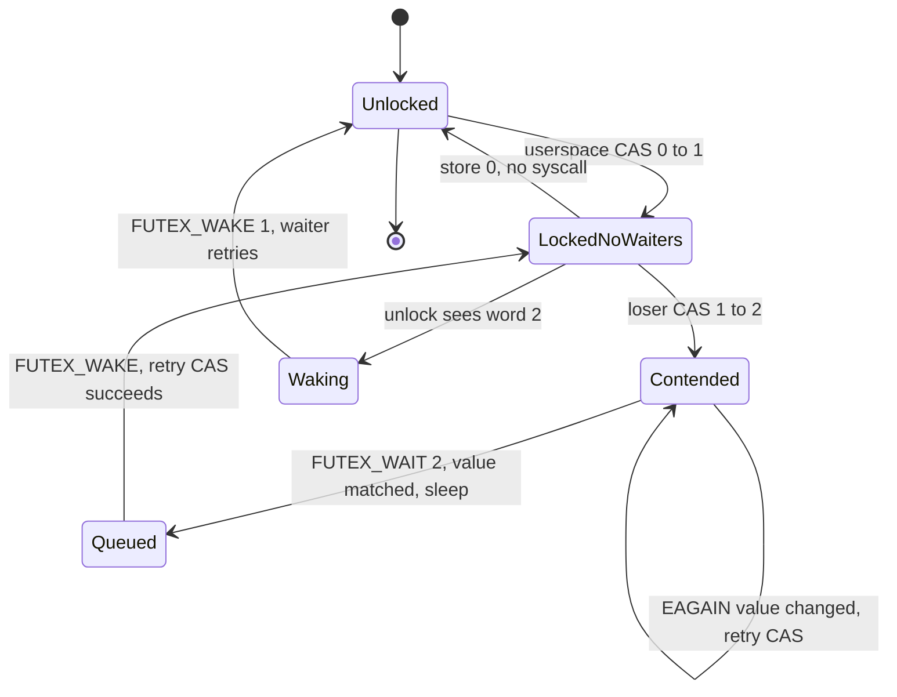

# Futex Deep Dive: the Syscall Behind Every Mutex

## Overview

A futex ("fast user-space mutex") is a 32-bit word in shared memory plus a small syscall family for sleeping until that word changes and for waking the sleepers. Introduced in the 2.5/2.6 era (2002–2003), it is the substrate under `pthread_mutex_t`, `pthread_cond_t`, `std::mutex`, Go's runtime, and every JIT that shares memory between threads: the uncontended path never enters the kernel, and the syscall is used only when a thread actually has to sleep. The design goal was to make the *common* case cost an atomic instruction (~10 ns) while keeping the *contended* case correct — which is why the kernel side is dominated by the subtle races between checking the word and going to sleep. The name survives from the original 2002 paper, and so does the design pattern: put the state machine in userspace memory, and make the kernel a dumb-but-safe sleeping-and-waking service over it.

> **Interview one-liner:** "A futex is an atomic CAS in userspace on the fast path and a `futex(FUTEX_WAIT, expected_value)` sleep on the slow path — the expected-value check under the hash-bucket lock is what closes the lost-wakeup race, and everything else (PI, robust, requeue, waitv) patches specific gaps in that contract."

This page is the syscall mechanics deep dive. The primitives built on top are covered in [Sync Primitives](../advanced/sync-primitives.md) (futex basics, mutex building blocks), [rt_mutex Internals](../../linux/kernel/sync/rtmutex-pi-futex.md) (PI chain walks and CVE-2014-3153), and [Lock Convoying](../advanced/lock-convoying.md) (wakeup pathology and requeue mitigation).

## The futex Word and the Syscall Contract

The entire protocol lives in one native-endian 32-bit integer, aligned naturally, in memory shared by the contending threads (same address space, or a `MAP_SHARED` region):

```c
long futex(uint32_t *uaddr, int futex_op,
           uint32_t val,                  /* expected value / wake count */
           const struct timespec *timeout, /* relative (WAIT) or absolute (WAIT_BITSET, PI) */
           uint32_t *uaddr2, uint32_t val3);
```

The kernel does not define what the word *means* — 0 = unlocked, 1 = locked, 2 = locked-with-waiters is purely a userspace (NPTL) convention. The kernel only guarantees: `FUTEX_WAIT(uaddr, val)` sleeps *if and only if* `*uaddr == val` at the moment of the check; `FUTEX_WAKE(uaddr, n)` wakes up to *n* waiters queued on that address. Return codes carry the diagnostic weight: `EAGAIN`/`EWOULDBLOCK` means the value did not match (race lost — just retry), `EINTR` means a signal arrived, `ETIMEDOUT` means the timeout expired. Alignment matters more than in most syscalls: the word must be natively aligned because the kernel reads it with plain loads on some architectures, and it must be genuinely shared — a word in thread-local or copy-on-write memory silently gives each thread its own private wait queue, which is a classic source of "my mutex sometimes never wakes" bugs.

Internally, each futex address is hashed into one of a boot-time-sized array of **hash buckets** (power-of-two table, scaled to machine size); the bucket has a spinlock and a wait queue. Two consequences follow: waiters on different addresses colliding in one bucket contend on bucket state (rare but real on huge processes), and *all* futex correctness — the value check, queueing, wake — happens while holding the bucket lock, which is what makes the contract atomic.

| Futex word (NPTL mutex convention) | Meaning | Unlock path behavior |
|-------------------------------------|---------|----------------------|
| `0` | unlocked, no waiters | store 0 from 1; no syscall |
| `1` | locked, no waiters | store 0; no syscall |
| `2` | locked, waiters are sleeping | store 0 **and** `FUTEX_WAKE(1)` — mandatory |

## Fast Path vs Slow Path (glibc/NPTL)

The whole point of the design is the three-state handshake that keeps the common case syscall-free:

```c
/* lock: fast path */
if (atomic_cmpxchg(&word, 0, 1) == 0)      /* 0 -> 1: acquired, no kernel entry */
    return;
if (atomic_cmpxchg(&word, 1, 2) != 0) {    /* register interest: 1 -> 2 */
    while (atomic_xchg(&word, 2) != 0)     /* mark waiters even if still locked */
        futex(&word, FUTEX_WAIT, 2, NULL, NULL, 0);
}
/* unlock */
if (atomic_fetch_sub(&word, 1) != 1) {     /* was 2 -> waiters exist */
    atomic_store(&word, 0);
    futex(&word, FUTEX_WAKE, 1, NULL, NULL, 0);
}
```

The ordering rules are the interview content. A thread that finds the lock taken (word 1) *must* transition the word to 2 *before* calling `FUTEX_WAIT(2)`; the unlocker sees word 2 only after that transition is published, so it knows to call `FUTEX_WAKE`. If the unlocker instead saw word 1, it stores 0 without a syscall — and the would-be waiter's `FUTEX_WAIT(2)` then fails its value check (`EAGAIN`) because the word is now 0, so it re-runs the CAS and acquires the lock. Either interleaving is safe; there is no window where a thread sleeps forever. glibc additionally implements *adaptive* mutexes (`PTHREAD_MUTEX_ADAPTIVE_NP`, `mutex.__data.__spins`): under detected short critical sections the slow path spins briefly before calling `FUTEX_WAIT`, trading a little CPU for fewer sleeps.



## FUTEX_WAIT Mechanics and Timeouts

`FUTEX_WAIT` takes a *relative* timeout (`NULL` = forever) and internally converts it to an hrtimer. The steps, in order: hash the address, take the bucket spinlock, re-read `*uaddr` and compare against the expected value (if the page faulted in or the value differs — return `EAGAIN`/`EFAULT` without sleeping), then queue the current task on the bucket's wait list and sleep. The value check *under the bucket lock* is the entire lost-wakeup defense: a concurrent `FUTEX_WAKE` on the same address holds the same lock, so it cannot miss a waiter that has not yet been queued — the waker either wakes the queued task or the waiter's value check fails and it never sleeps.

One trap worth knowing: because `FUTEX_WAIT` takes a *relative* timeout, glibc's `pthread_cond_timedwait` historically converted absolute deadlines using `CLOCK_REALTIME` with all its jump hazards, and `FUTEX_WAIT_BITSET` (2.6.25) was added precisely to support *absolute* timeouts with a `FUTEX_BITSET_MATCH_ANY`-style wakeup mask. `FUTEX_LOCK_PI2` (5.14) later fixed the same problem for PI mutexes by letting userspace select `CLOCK_MONOTONIC`. `FUTEX_WAIT` also cannot be used on a word in read-only or unmapped memory — the check either faults (`EFAULT`) or the queue would be unreachable.

The return-value contract doubles as a debugging checklist:

| Return | Meaning | What the caller should do |
|--------|---------|---------------------------|
| `0` | slept and was woken by `FUTEX_WAKE`/signal handling | re-run the CAS fast path |
| `EAGAIN` / `EWOULDBLOCK` | `*uaddr` no longer equals the expected value | not an error — the race was won by the waker; retry the fast path |
| `ETIMEDOUT` | relative timeout expired while queued | re-check state; typical for try-lock-with-deadline patterns |
| `EINTR` | a signal was delivered | retry; glibc restarts condvar waits with recomputed deadlines |
| `EFAULT` | the word's page is not accessible (unmapped, read-only) | the futex word vanished — this is the `munmap` race surfacing |
| `EINVAL` | invalid op/flag combination (e.g., bitset ops without a mask) | programming bug |

## Hash Buckets and Scalability

Every futex address maps into a global array of hash buckets via a hash of the key; the array is sized at boot as a power of two scaled to the machine's memory, and each bucket is a spinlock plus a doubly-linked wait queue. The design implications are rarely taught but interview-relevant for anyone building high-thread-count systems:

- **Collisions are contention.** Two unrelated futexes hashing to one bucket serialize on the bucket spinlock even when their words never interact. The probability is low for typical address layouts, but a pathological allocator placement (many hot futexes in one hash order) can create cross-object contention that looks inexplicable from the code — one reason the bucket count scales with machine size.
- **Private futexes skip the expensive key derivation.** Because `FUTEX_PRIVATE_FLAG` keys on `(mm, address)` without page/inode lookup, the private path both avoids a `get_user_pages`-style walk and stays cheap under the bucket lock; this is why the flag (2.6.22) measurably improved pthread performance.
- **The global table is process-agnostic.** Shared futexes from different processes hash into the same buckets, which is required for correctness (that is how they find each other's waiters) but means one noisy process's futex storms can tax another's. Newer kernels (the 6.16-era, 2025 cycle) added opt-in **per-process hash tables** for private futexes via `prctl`, eliminating cross-process bucket sharing for the common case; it is the most significant scalability change to the futex core in over a decade.
- **Bucket work is O(waiters-in-bucket)**, not O(waiters-on-futex): `FUTEX_WAKE` must scan the bucket's queue filtering by key. Most waiters per bucket stay tiny, but a broadcast on a futex whose bucket-mates exist makes wake cost depend on neighbors — another reason to wake one and requeue rather than wake-all.

For scale context, the futex path's costs: an uncontended CAS is single-digit nanoseconds; a `futex(WAKE)`/`futex(WAIT)` pair adds a syscall entry, bucket lock, and scheduler wakeup — hundreds of nanoseconds to microseconds with a context switch. Every layers-above optimization (glibc spinning, adaptive mutexes, `FUTEX_WAKE_OP` batching) exists to keep workloads on the left side of that gap.

## FUTEX_WAKE, Thundering Herd, and FUTEX_WAKE_OP

`FUTEX_WAKE(uaddr, n)` wakes up to *n* tasks queued on the address, in FIFO order of the bucket queue, and returns the number woken — which is also how userspace detects "there were no waiters" cheaply. Waking all waiters (`FUTEX_WAKE, INT_MAX`) is the broadcast case, and it creates the classic **thundering herd**: every woken thread re-enters userspace, re-runs its CAS, exactly one wins, and the rest must either re-sleep on the mutex or spin — a convoy-shaped pattern analyzed in [Lock Convoying](../advanced/lock-convoying.md).

`FUTEX_WAKE_OP` (2.6.16) is the syscall family's one composite primitive: it atomically performs a small operation (set/add/or/and with masks) on `*uaddr2` and then wakes `val` waiters on `uaddr` — conditionally also waking `val3`-specified waiters on `uaddr2` if the old value of `*uaddr2` satisfied a comparison. The `val3` argument packs a small RISC-like instruction encoding — operation, comparison, and masks for both the read and the write — so the kernel can execute "if old value of *uaddr2 < LIMIT then *uaddr2 += 1 and wake" without a round trip. This exists so `pthread_cond_signal` can do "increment the wake-sequence counter *and* wake one waiter" in a single syscall instead of a store plus `FUTEX_WAKE` — halving the syscalls on the hot signaling path and, more importantly, making the counter update and the wake atomic with respect to waiters.

The requeue operations are the herd's real mitigation and are covered next; the pattern to remember is *wake one, move the rest*:

- `pthread_cond_broadcast`: `FUTEX_CMP_REQUEUE(uaddr2=mutex_word, val=1, val2=N-1)` — wake one waiter, move the other *N−1* directly onto the mutex's futex queue. The herd never re-enters userspace; the mutex hands out the lock one holder at a time.
- The `CMP` variant (expected-value check on `*uaddr`) exists because the original `FUTEX_REQUEUE` raced with concurrent state changes; glibc uses `FUTEX_CMP_REQUEUE` everywhere `FUTEX_REQUEUE` would do.
- Cost asymmetry: requeue is *not* free of semantics — moved waiters are now mutex-waiters, so their wake order becomes mutex FIFO, which is why PI variants need their own careful requeue ops (`FUTEX_CMP_REQUEUE_PI`).

## The Ops Catalog

Every operation through the single `futex()` syscall, with the argument slot that carries its parameters (`val`, `timeout`, `uaddr2`, `val3`): the composite ops all reuse the same six arguments differently, which is why the syscall's signature looks shapeless until you read it per-op.

| Op | Added | Key arguments | Semantics | Primary user |
|----|-------|---------------|-----------|--------------|
| `FUTEX_WAIT` | 2.6.0 (2003) | `val` = expected; `timeout` = relative | sleep if `*uaddr == val` | mutex slow path |
| `FUTEX_WAKE` | 2.6.0 (2003) | `val` = max to wake | wake up to `val` waiters on `uaddr` | mutex/semaphore post |
| `FUTEX_FD` | removed (2.6.26) | — | bind fd to futex (racy by design) | nobody — cautionary tale |
| `FUTEX_REQUEUE` | 2.6-era | `val` = wake count, `val2` = move count, `uaddr2` | wake N, move rest to `uaddr2` | superseded by CMP variant |
| `FUTEX_CMP_REQUEUE` | 2.6-era | + `val3` = expected `*uaddr` | as above, guarded by value check | `pthread_cond_broadcast` |
| `FUTEX_WAKE_OP` | 2.6.16 | `val3` = packed op/compare | atomically modify `*uaddr2`, wake conditionally | `pthread_cond_signal` |
| `FUTEX_LOCK_PI` | 2.6.18 | `timeout` = absolute | acquire with kernel-side ownership + boost | `PTHREAD_PRIO_INHERIT` |
| `FUTEX_UNLOCK_PI` | 2.6.18 | — | release, hand off to top waiter | PI mutex unlock |
| `FUTEX_TRYLOCK_PI` | 2.6.18 | — | non-blocking PI acquire | try-lock paths |
| `FUTEX_WAIT_BITSET` | 2.6.25 | `timeout` = absolute, `val3` = bitset | sleep with absolute deadline + wake mask | `pthread_cond_timedwait` (MONOTONIC) |
| `FUTEX_WAKE_BITSET` | 2.6.25 | `val3` = bitset | wake only waiters whose mask matches | selective wakeups |
| `FUTEX_WAIT_REQUEUE_PI` | 2.6.18 | `uaddr2` = PI mutex word | wait on non-PI futex, requeue onto PI mutex | condvar + PI mutex |
| `FUTEX_CMP_REQUEUE_PI` | 2.6.18 | as CMP_REQUEUE | wake one PI waiter, move rest, boost-aware | condvar broadcast + PI |
| `FUTEX_LOCK_PI2` | 5.14 | `timeout` = absolute + clockid | `LOCK_PI` with selectable clock | RT mutexes on MONOTONIC |
| `FUTEX_WAITV` | 5.16 | `timeout`, `val3` = array pointer | sleep until any of ≤ 128 futexes changes | Wine/Proton multi-wait |

Related but not ops: robust futexes are configured via `set_robust_list(2)`/`get_robust_list(2)` and act at thread exit; the `FUTEX_PRIVATE_FLAG` (0x80) ORs into any op to select private keying. Note the family's history is visible in the table: two ops were added per problem (REQUEUE→CMP_REQUEUE, LOCK_PI→LOCK_PI2), and each generation fixed its predecessor's race rather than breaking the ABI — the constraint of a 20-year-old syscall interface.

`FUTEX_FD` deserves its paragraph as the family's cautionary tale: it attached a file descriptor to a futex so `poll()` could wait on it, but the fd-based readiness and the futex waiters were two different views of the same queue with no ordering between them — a wake could be consumed by whichever path saw it first, so it raced *by design* and was removed in 2.6.26. The lesson generalizes: a wait queue may have exactly one owner; every later multi-wait mechanism (epoll-style, `futex_waitv`) has to define which waiter the wake goes to, or it becomes another `FUTEX_FD`.

## PI Futexes: Priority Inheritance in the Kernel

Real-time threads break the plain futex contract: a SCHED_FIFO/deadline thread can block on a mutex held by a low-priority thread, and unbounded priority inversion follows (the Mars Pathfinder pattern). Fixing this *in userspace is impossible* — the holder's scheduling priority lives in the kernel's task struct, and no user memory write can change how the scheduler picks it — so PI futexes (2.6.18) move lock ownership into the kernel via the `rt_mutex` subsystem:

- The futex word holds the **owner's TID** (low 30 bits) plus status bits (`FUTEX_WAITERS` = bit 31, `FUTEX_OWNER_DIED` = bit 30). "Who owns this lock" is thus readable atomically by userspace and the kernel alike.
- `FUTEX_LOCK_PI`: if the word is 0, CAS in your TID — done, no kernel blocking. Otherwise set `FUTEX_WAITERS` and block; the kernel creates an `rt_mutex` waiter that **boosts the owner to the highest waiter priority** (`rt_mutex_setprio`), walking chains transitively (A boosts B who waits on C).
- `FUTEX_UNLOCK_PI`: hand off directly to the highest-priority waiter (no thundering herd — the queue is priority-sorted), drop the boost.
- `FUTEX_LOCK_PI2` (5.14) adds the clockid selection for absolute timeouts; `FUTEX_WAIT_REQUEUE_PI`/`FUTEX_CMP_REQUEUE_PI` let a condvar wait requeue onto a *PI* mutex while preserving the waiter/priority relationship.

For SCHED_DEADLINE tasks, the inherited boost is the *deadline* rather than a FIFO level — the owner temporarily runs with the blocked task's deadline. The PI chain walk is intricate enough that it produced one of Linux's most famous privilege-escalation bugs, CVE-2014-3153 (Towelroot), an improper requeue-PI handling chain leading to arbitrary kernel writes; the deep mechanics and the exploit walkthrough live in [rt_mutex Internals](../../linux/kernel/sync/rtmutex-pi-futex.md). The interview takeaway: PI paths are small, audited, and the reason `PTHREAD_PRIO_INHERIT` mutexes must be used by any RT thread touching shared locks.

## Robust Futexes

A thread that dies while holding a normal pthread mutex leaves it locked forever — every later locker sleeps on a futex nobody will wake. Robust futexes (2.6.17) solve this without any lock/unlock overhead: each thread registers a `struct robust_list_head` via `set_robust_list(2)`, every robust mutex it takes links itself into that user memory list, and the futex word continuously encodes the owner TID.

On thread exit, the kernel walks the dead thread's list in its address space. For each word still claiming the dead TID as owner: if `FUTEX_WAITERS` is set, wake one waiter; either way set `FUTEX_OWNER_DIED` (bit 30) so waiters can detect the situation. The woken waiter's lock call returns `EOWNERDEAD` instead of `EBUSY`, and the application must repair whatever the lock protected (via `pthread_mutex_consistent()`) before the mutex becomes usable again — or leave it permanently `ENOTRECOVERABLE`. The design's elegance is the cost model: zero syscalls on lock, zero on unlock, one bounded list walk per thread death. glibc maps `PTHREAD_MUTEX_ROBUST` onto this, and the same TID-in-word trick is what makes `FUTEX_LOCK_PI`'s owner detection work.

Robust and PI do not compose in glibc: a `PTHREAD_PRIO_INHERIT` mutex cannot also be marked robust there, because the kernel's exit-time list walk performs a plain wake with `FUTEX_OWNER_DIED` — it does not run the priority-aware handoff that `FUTEX_UNLOCK_PI` would. An RT application that wants both crash-safety and inversion protection must therefore implement recovery explicitly: catch the `EOWNERDEAD`-style state at a higher level (a supervisor thread, health checks) and rebuild the lock state, rather than expecting the futex layer to inherit priorities from a dead owner. This limitation is a favorite senior-level follow-up because it tests whether the candidate knows the exit walk is a *plain* futex wake, not a PI operation.

## mmap/munmap Races and futex Keys

The kernel identifies a futex by a **key** derived from the address, and the derivation depends on the mapping:

- **Private futexes** (`FUTEX_PRIVATE_FLAG`, added 2.6.22): key = `(mm_struct, uaddr)`. No page/inode lookup is needed, so wait/wake is faster, and threads of other processes can never (mis)match your queue. This flag is set by glibc for every intra-process primitive and is effectively always present in modern code.
- **Shared futexes**: key = `(page/inode backing the word, offset)`, so two processes mapping the same file (or a `MAP_SHARED` anon region via the same object) hash to the same queue. Deriving this key must pin the page — a `get_user_pages`-style lookup under VMA locks.

The race that shaped a decade of kernel comments: between the waiter deriving the key and queueing, the mapping can change — `munmap` can remove the page, a new file can be mapped at the same address, and a waker that arrives after teardown computes a *different* key and wakes nobody. The waiter sleeps forever on a queue whose address no longer exists. The kernel pins pages and revalidates under the bucket lock to shrink the window, but the *logical* contract remains: **you may not unmap (or destroy the backing of) a futex word while threads are blocked on it.** Hence the glibc/NPTL discipline: pthread objects live in memory that is never unmapped while their waiters exist, `pthread_mutex_destroy` on a locked-and-waited mutex is undefined behavior, and `futex_wait` returning `EFAULT` signals "your word vanished". Teardown code must join/notify waiters *before* `munmap` — a rule that bites JVMs, JIT allocators, and anyone pooling shared memory (see [IPC: Shared Memory](../processes/ipc-shared-memory.md)).

If you maintain hand-rolled futex code, the checklist that follows from the key mechanics:

1. Never `munmap` or `mremap` a region containing a futex word with possible waiters — join or signal first; treat `EFAULT` from `FUTEX_WAIT` as "mapping changed under us".
2. Use `FUTEX_PRIVATE_FLAG` for intra-process words — faster keys and no chance of cross-process key collision.
3. For cross-process words, ensure *all* users map the same object (`MAP_SHARED` file or same anonymous region) so keys match; mapping the same file with different offsets/flags can silently split the wait queues.
4. Keep the word 32-bit, naturally aligned, and in cache-line-shared memory; false-sharing the word with hot write data will dominate your latency profile (see [False Sharing](../advanced/false-sharing.md)).
5. On 32-bit architectures, note the `futex_time64` variant of the syscall (5.1-era y2038 work) — the semantics are identical but the timeout struct is 64-bit.

## futex_waitv: Batched Waiting (5.16)

`FUTEX_WAITV` (5.16, November 2021) generalizes `FUTEX_WAIT` to an array of futexes:

```c
struct futex_waitv {
    __u64 val;      /* expected value */
    __u64 uaddr;    /* futex word address */
    __u32 flags;    /* size (FUTEX2_32/64), private/shared */
    __u32 __reserved;
};
/* futex(NULL, FUTEX_WAITV, 0, timeout, NULL, (unsigned long)waitv_ptr) */
```

The caller passes up to `FUTEX_WAITV_MAX` (128) entries and sleeps until *any one* of them changes from its expected value (or the timeout expires); the return value is the index of the futex that woke. Per-entry flags allow mixing 32- and 64-bit words and private/shared futexes in one call. The motivating consumer is Wine/Proton: Windows' `WaitForMultipleObjects` semantics (wait on many handles at once) map naturally onto batched futex waits, and emulating them with N sequential `FUTEX_WAIT` calls was both slow and racy. The design point for interviews: multi-wait moves a *select-like* primitive into the kernel where it can sleep once on several buckets, instead of a userspace polling loop that reintroduces the lost-wakeup problem N times. It is also the first futex interface designed for *both* word widths from day one — an acknowledgment that 64-bit futex words had become real (filesystem sequences, userspace seqlocks) and the old 32-bit-only syscall could not express them.

## Relation to Mutex and Condvar Implementation

The mapping from POSIX primitives to futex ops is the synthesis question interviewers like:

| Primitive | Lock (slow path) | Unlock | Wait/signal mechanism |
|-----------|------------------|--------|----------------------|
| `pthread_mutex_t` (default) | CAS 0→1, else 1→2 + `FUTEX_WAIT` | store 0 (+ `FUTEX_WAKE 1` if was 2) | the word itself |
| `pthread_mutex_t` (PRIO_INHERIT) | `FUTEX_LOCK_PI` (TID in word) | `FUTEX_UNLOCK_PI` | rt_mutex boost queue |
| `pthread_mutex_t` (ROBUST) | as default + robust list link | as default | kernel exit walk |
| `pthread_cond_t` wait | release mutex, `FUTEX_WAIT` on cond futex | — | requeue-to-mutex on signal |
| `pthread_cond_signal` | — | — | `FUTEX_WAKE_OP` on cond futex (atomic counter bump + wake) |
| `pthread_cond_broadcast` | — | — | `FUTEX_CMP_REQUEUE`: wake 1, move N−1 to mutex queue |
| semaphore | decrement/CAS loop + `FUTEX_WAIT` | `FUTEX_WAKE` on count | the count word |

The condvar's requeue dance deserves the close reading: a waiter must atomically "release mutex and begin waiting", otherwise a signal between the two steps is lost. glibc's implementation holds the condvar's internal lock across the mutex release and the `FUTEX_WAIT`, and the *wake* side uses sequence counters so a stale signal cannot wake a thread from a *later* epoch of the same condvar. If you can narrate why the counter must be bumped under the condvar's lock *before* releasing the mutex, you understand lost wakeups better than most candidates.

### Semaphores and futexes

A counting semaphore is the same machinery with a signed count instead of a three-state word: `sem_wait` decrements with a CAS loop, `FUTEX_WAIT`ing only when the count would go negative; `sem_post` increments and issues `FUTEX_WAKE(1)` only when the count transitioned from negative to non-negative — the "was a waiter waiting?" information is encoded in the sign, exactly as the mutex's word 2 encodes it. glibc's `sem_t` adds its own sequence-count protocol on top so that concurrent `sem_post`/`sem_wait` cannot lose a wake, and `FUTEX_WAKE_OP`'s atomic "modify and wake" maps onto `sem_post`'s two-step requirement directly. The general lesson: any blocking primitive reduces to *one atomic word that encodes both the state and whether a wake is owed* — get that word's state machine right and the futex calls are trivial; get it wrong and you have either lost wakeups or thundering herds.

## Observing Futexes

```bash
# Which futex ops does a program actually issue?
strace -f -e trace=futex ./app 2>&1 | grep -oE 'FUTEX_[A-Z_2]+' | sort | uniq -c

# Live contention: kernel tracepoint for cross-CPU futex blocking
sudo perf trace -e futex -p <PID>
ls /sys/kernel/tracing/events/futex/        # futex_contention, futex_wait, ...

# System-wide futex syscall rate (is contention growing?)
sudo perf stat -e 'syscalls:sys_enter_futex' -a sleep 5

# Classic sanity checks
pthread_mutex locks stuck?  -> /proc/<pid>/task/<tid>/stack  (shows futex_wait_queue)
```

The operational signature of futex trouble: high `sys_call` counts in `perf` dominated by `futex`, `futex_contention` tracepoint hits clustering on one address, and threads parked in `futex_wait_queue`. Remedies follow the diagnosis: shorten the critical section, shard the lock, or (for herd patterns) replace wake-all with requeue-based signaling.

## Common Mistakes

1. **Treating `EAGAIN` from `FUTEX_WAIT` as an error.** It is the normal "value changed before we slept" outcome — the waker won the race and you should re-run the fast path. Code that treats it as fatal produces mysterious lock failures under contention.
2. **Calling `FUTEX_WAKE` unconditionally on unlock.** The whole point of word value 2 is to know whether a wake is owed; skipping the check costs a syscall on every unlock and floods `perf` with futex traffic. Conversely, forgetting the wake when the word *was* 2 is a lost wakeup.
3. **Assuming the futex word can be 64-bit or arbitrarily structured.** The protocol is a native-endian 32-bit integer; 64-bit words only work via `FUTEX_WAITV`'s size flags, and structures (pointers, IDs spanning two words) are not atomic with respect to the kernel's value check.
4. **Hand-rolling PI.** If an RT thread can block on your lock, plain futexes give unbounded priority inversion; you need `FUTEX_LOCK_PI` (or priority ceilings), not a clever userspace boost scheme — the owner's priority lives in the kernel's task struct and cannot be raised from user memory.
5. **Destroying or unmapping while waiters exist.** `pthread_mutex_destroy` on a waited mutex and `munmap` under queued sleepers are both lost-wakeup factories; teardown order is part of the futex contract, not a formality.
6. **Debugging futex storms with locks held in mind.** Most "futex storms" are wake-all herds or bucket collisions, not slow critical sections; check the *wakeup pattern* (`FUTEX_WAKE` counts, requeue usage) before profiling the critical section itself.

## Interview Questions

1. **What exactly is a futex and what problem does it solve?** A futex is a 32-bit word in shared memory plus a syscall family for sleeping until it changes. The fast path is a pure userspace CAS — no syscall, ~10 ns — and the kernel is entered only when a thread must actually sleep or wake someone. Before futexes, syscalls per lock/unlock made mutexes ~100× more expensive than necessary; after them, uncontended locking costs one atomic instruction and contention is the only thing that pays for the kernel. The kernel itself attaches no meaning to the word — 0/1/2 unlocked/locked/waiters is an NPTL convention.
2. **How does the protocol prevent a lost wakeup between reading the value and sleeping?** The waiter first registers interest by CASing the word from 1 to 2 ("locked with waiters") and then calls `FUTEX_WAIT` with expected value 2. Inside the kernel the value re-check happens under the hash-bucket spinlock — the same lock a concurrent waker holds — so either the waiter is queued before the waker looks, or its value check fails and it returns `EAGAIN` to retry the CAS. The unlocker's contract is symmetric: it must call `FUTEX_WAKE` exactly when it observed the word was 2. No interleaving of store, check, and sleep can strand a thread.
3. **Why does `pthread_cond_broadcast` use `FUTEX_CMP_REQUEUE` instead of `FUTEX_WAKE(N)`?** Waking all N waiters makes them all re-enter userspace and race on one CAS; N−1 lose and must re-sleep — the thundering herd, and under repeated signaling it becomes a lock convoy. `FUTEX_CMP_REQUEUE(uaddr2, 1, N−1)` wakes one waiter and moves the rest directly onto the mutex's futex queue, so the herd never materializes and the mutex serializes handoff. The `CMP` part re-validates the expected word value, closing the race that made the original `FUTEX_REQUEUE` unsafe.
4. **What do PI futexes add, and how does the futex word change?** PI futexes let the kernel know lock ownership so it can boost the owner: the word holds the owner's TID plus `FUTEX_WAITERS`/`FUTEX_OWNER_DIED` bits. `FUTEX_LOCK_PI` CASes in your TID when free, or blocks while `rt_mutex` raises the owner to the highest waiter's priority (or deadline for SCHED_DEADLINE waiters) along the whole chain. This is what `PTHREAD_PRIO_INHERIT` mutexes use, and the path is small and heavily audited because CVE-2014-3153 showed that a bug in requeue-PI handling is a route to kernel memory corruption.
5. **What are robust futexes and what is their runtime cost?** Each thread registers a robust list; every robust mutex it holds is linked there, and the futex word continuously encodes the owner TID. When the thread exits, the kernel walks the list, and for words still owned by the dead thread it sets `FUTEX_OWNER_DIED` and wakes a waiter if `FUTEX_WAITERS` is set. The woken locker gets `EOWNERDEAD` and must repair the protected state via `pthread_mutex_consistent()`. Cost: zero syscalls on the lock/unlock path and one bounded list walk at thread death — versus leaving the mutex permanently locked.
6. **Why can't you `munmap` a region with threads blocked on futexes inside it, and how does futex_waitv help Wine?** The kernel keys futexes by backing object: `(mm, address)` for private futexes, `(inode/page, offset)` for shared ones. After `munmap`, a waker computes a different key — or the waiter's word faults — so wakeups target a queue nobody re-finds, and the waiter sleeps forever. The contract is that teardown waits for (or notifies) all waiters before unmapping; the kernel shrinks but cannot eliminate the window. `FUTEX_WAITV` (5.16) is unrelated to that race but is Wine's fix for another multiwait problem: it atomically blocks on up to 128 futexes at once and returns which one woke, implementing `WaitForMultipleObjects` without racy polling.

## Key Takeaways

- A futex is a 32-bit shared-memory word plus wait/wake syscalls; the uncontended path is a userspace CAS and the kernel is contention-only insurance.
- The NPTL three-state word (0 unlocked / 1 locked / 2 locked-with-waiters) is what makes lock/unlock decide syscall-free whether a wake is owed — and `FUTEX_PRIVATE_FLAG` (2.6.22) keeps those words keyed privately so the fast path skips page/inode lookups entirely.
- `FUTEX_WAIT`'s expected-value re-check under the hash-bucket lock is the lost-wakeup defense; `EAGAIN` means "race lost, retry", not an error.
- `FUTEX_WAKE_OP` makes condvar signal a single atomic syscall; `FUTEX_CMP_REQUEUE` (wake 1, move N−1 to the mutex queue) is the thundering-herd fix.
- PI futexes put the owner TID in the word and route blocking through `rt_mutex` so priority (or deadline) inheritance crosses userspace locks; this is `PTHREAD_PRIO_INHERIT` and, historically, CVE-2014-3153.
- Robust futexes (2.6.17) give crash-safe mutexes at zero steady-state cost: TID in word + per-thread list walked at exit; waiters see `EOWNERDEAD`.
- You may not unmap a futex word with waiters pending — futex keys come from the backing mapping, so teardown races become lost wakeups; `EFAULT` from `FUTEX_WAIT` is that race surfacing.
- `FUTEX_WAITV` (5.16) blocks on up to 128 futexes with one sleep, built for Wine's `WaitForMultipleObjects`; per-entry flags mix 32/64-bit and private/shared words.

## References

- man page: `futex(2)` — the authoritative op-by-op contract — <https://man7.org/linux/man-pages/man2/futex.2.html>
- man page: `pthreads(7)` — mutex/condvar semantics futexes implement — <https://man7.org/linux/man-pages/man7/pthreads.7.html>
- Kernel documentation: *rt-mutex — RT-mutex subsystem with PI support* — <https://docs.kernel.org/locking/rt-mutex.html>
- Kernel documentation: *robust futexes ABI* — <https://docs.kernel.org/locking/robust-futex-ABI.html>
- Kernel documentation: *futex requeue PI* (design notes for the requeue-PI path) — <https://docs.kernel.org/locking/futex-requeue-pi.html>
- LWN: *A futex overview and update* (Jonathan Corbet, 2009) — <https://lwn.net/Articles/360699/>
- Hubertus Franke, Rusty Russell, Matthew Kirkwood, *Fuss, Futexes and Furwocks: Fast Userlevel Locking in Linux*, Ottawa Linux Symposium 2002.
- Ulrich Drepper, *Futexes Are Tricky* (white paper on the three-state protocol and races).
- Kernel source: <https://github.com/torvalds/linux> (`kernel/futex/`, `kernel/locking/rtmutex.c`)

## Cross-References

- [Sync Primitives](../advanced/sync-primitives.md) — futex basics and the mutex built on them (intro-level version of this page)
- [rt_mutex Internals](../../linux/kernel/sync/rtmutex-pi-futex.md) — PI chain walks, the user-space PI protocol details, CVE-2014-3153
- [Lock Convoying](../advanced/lock-convoying.md) — wake-one/wake-all pathology and why requeue exists
- [MCS Locks and qspinlock](../advanced/mcs-qspinlocks.md) — the in-kernel alternative when waiting must spin, not sleep
- [Mutex](../synchronization/mutex.md) — the textbook mutex model the futex word implements
- [Monitors](../synchronization/monitors.md) — condvar theory whose signal/broadcast is `FUTEX_WAKE_OP`/requeue here
- [IPC: Shared Memory](../processes/ipc-shared-memory.md) — hand-rolled futex use across processes and the shared-memory teardown rules
- [SCHED_DEADLINE](./sched-deadline.md) — how PI futexes propagate deadlines to lock owners
