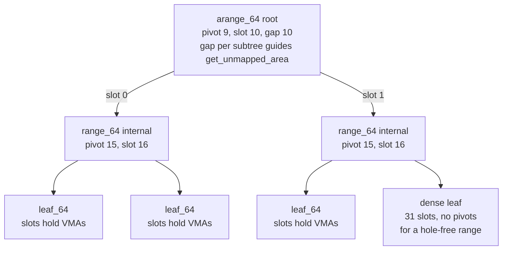
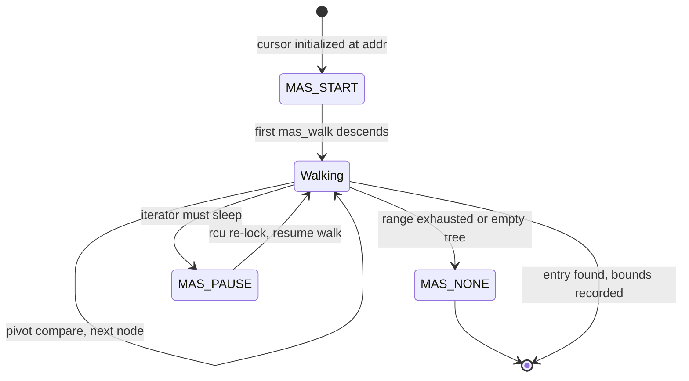
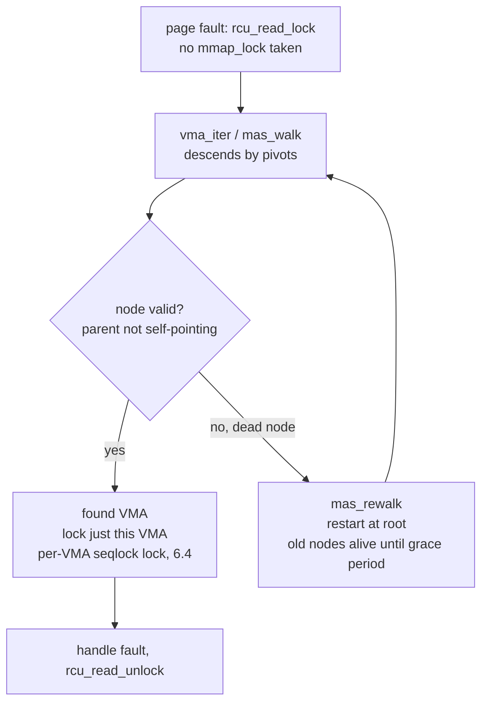

# Maple Tree: The VMA Index That Replaced the rbtree

## Overview

Linux 6.1 (December 2022) replaced the red-black tree that had indexed every process's virtual memory areas since 2.6 with the **maple tree**, an RCU-friendly B-tree-like range store developed by Liam Howlett at Oracle. The change was not cosmetic: it collapsed three parallel bookkeeping structures (a linked list, an rbtree, and a gap cache) into one `mm->mm_mt` tree, made VMA lookups walkable without any lock, and set up the per-VMA locking scheme that shipped in 6.4. Interviewers ask about it whenever the topic is `mmap_lock` contention, kernel scalability, or "what actually changed in 6.1 besides MGLRU."

> **Interview one-liner:** "The maple tree is a B-tree-like store over non-overlapping address ranges with 256-byte, 16-slot nodes; readers walk it under RCU with no locks and simply retry if a concurrent writer rewrote their path — which is what finally let page faults read VMAs without touching the process-wide `mmap_lock`."

This page tells the *mmap subsystem* story: why the rbtree had to go, what the maple state cursor looks like from a fault path, and how the locking stack evolved. The node-layout internals, the XArray comparison data structure, and the full cost-model script live in [Maple Tree & XArray](../../linux/kernel/memory/maple-tree-xarray.md); read that page after this one for the data-structure level.

## Vocabulary

| Term | Meaning |
|------|---------|
| VMA | virtual memory area: one contiguous mapping with start, end, protection, file/anonymous backing |
| `mm->mm_mt` | the per-`mm_struct` maple tree that stores VMAs keyed by their address ranges (since 6.1) |
| pivot | the boundary value in a maple node separating one child's address range from the next |
| slot | one entry position in a maple node: 16 in `range_64`/`leaf_64`, 10 in `arange_64`, 31 in `dense` |
| maple state (`mas`) | the stack cursor over the tree: current node, index range, walk offsets; wrapped as `vma_iterator` in mm code |
| `mmap_lock` | the per-`mm` read-write semaphore serializing structural address-space changes |
| per-VMA lock | per-`vma` seqcount-style lock (6.4) letting a fault lock one VMA instead of taking `mmap_lock` for read |
| dead node | a node removed by a concurrent writer; its `->parent` points to itself so readers detect and retry |

## The Address Space as of 2015: Three Structures and a Big Lock

Before 6.1, every `mm_struct` tracked its VMAs with three cooperating structures. The doubly linked list `mm->mmap` gave ordered iteration (needed for `/proc/pid/maps` and exit teardown). The red-black tree rooted at `mm->mm_rb`, with each VMA embedding its own `vm_rb` node, answered "which VMA covers address X?" in \\( O(\\log n) \\). The pair `mm->free_area_cache` and `mm->cached_hole_size` hinted `get_unmapped_area()` toward likely gaps without re-walking the whole tree. Every mutation — `mmap`, `munmap`, `mprotect`, `mremap`, stack expansion — had to keep all three views consistent under the `mmap_lock` rwsem, and the cache hints were famously brittle around the top-of-stack and `mmap_base` edge cases.

The lock itself was the scalability story. Any reader (a page fault, `find_vma()`, `/proc` walks) took `mmap_lock` for read, which is cheap only in the uncontended case: an rwsem is a single cacheline-heavy word per `mm`, so fault storms from hundreds of threads bounce it between sockets, and writers (`mmap`/`munmap`/`brk` from malloc arenas) starve behind continuous readers. Workloads with thread-per-core allocation — JVMs, Chrome, databases with per-thread arenas, eBPF-heavy hosts loading thousands of program maps — showed `mmap_lock` contention in profiles long before the maple tree was proposed, which is why Michal Hocko's separate scalability work and the VMA-index rewrite landed in the same 2019–2023 window.

Finally, the VMA count itself grew. `max_map_count` defaults to 65530 per process, and real applications now approach it: JIT runtimes map one region per compiled unit, eBPF tooling mmaps program and map files, emulators and debuggers create short-lived regions per operation, and address-space-layout defenses and sanitizers split mappings. A structure whose lookup cost is one dependent cache miss *per tree level*, and whose every insertion may rotate, was being stressed at `n` values its designers never imagined.

The consistency burden had a human cost too, visible in the bug history. Every `munmap` had to unlink the VMA from the list, delete it from the rbtree, and refresh the gap cache — and the interactions were subtle enough that corner cases (mappings at the very top of the address space, stack-guard expansion racing a concurrent `munmap`, `MAP_GROWSDOWN` oddities) repeatedly produced fixes that adjusted one view and missed another. Collapsing three views into one range tree is a complexity win no benchmark shows: fewer invariants, fewer edge-case code paths, and one place to audit. When someone argues the maple merge was "just a data structure change," this is the counterargument — the change deleted a whole class of bookkeeping bugs.

## Why the rbtree Lost

| rbtree property | Consequence under VMA workloads |
|-----------------|--------------------------------|
| fan-out 2 → height ~\\( \\log_2 n \\) (up to 16+ levels at 65k VMAs) | 16+ dependent cache misses per lookup; each level is a pointer chase the CPU cannot prefetch |
| individually `kmalloc`-ed nodes (`vm_rb` inside each VMA) | one slab allocation per VMA, nodes scattered across memory, no spatial locality between siblings |
| rotations and recoloring on insert/delete | a writer rewrites nodes a concurrent reader may be holding, so lockless RCU reads are impossible without per-node seqcount tricks |
| point-key structure | ranges must be emulated by comparing `vm_start`/`vm_end` at every step; gap search is a separate hand-rolled mechanism |
| three-structure consistency | every `munmap` edge case updates list + tree + gap cache, the historic source of subtle mm bugs |

The rebalancing point deserves the emphasis interviewers probe. RCU gives lockless reads a guarantee about *memory lifetime*, not about *structure*: a reader that has loaded a pointer to node A can safely keep dereferencing A only if A's contents stay valid until the grace period ends. A red-black tree insert can rotate A, B, and C so that A's children change under the reader's feet — the only safe response is to take a lock, which is exactly what `mmap_lock` reads did. The maple tree instead never mutates a node in place when readers might hold it: writers stage their changes and publish new nodes, old nodes stay frozen until an RCU grace period frees them, and readers that walked into a superseded node detect it and retry. Lock-free *reads* require a structure that is RCU-updatable — that, more than raw height, is what the rbtree could never offer.

The maple tree also fixed the cache geometry. Nodes are exactly 256 bytes — a quarter of a 4 KiB page, chosen so a hot subtree fits in a few cache lines and node memory comes from one dedicated slab cache (`maple_node_cache`) rather than thousands of individual allocations. With fan-out 16, the tree bottoms out at height 4 at the default 65,530-VMA cap: four dependent loads per lookup against a perfect binary tree's 16 and a real rbtree's potential worst case of roughly twice that, because red-black balance permits a path up to about \\( 2\\log_2(n+2) \\). The full arithmetic, including memory-footprint numbers (about 1.1 MiB of nodes for the worst-case process, versus roughly 4.2 MiB of scattered rbtree nodes), is worked in [Maple Tree & XArray](../../linux/kernel/memory/maple-tree-xarray.md).

## Node Layout: Dense, Range, and Arange

All node types share the 256-byte envelope; what differs is how they spend it. The mm-subsystem-relevant summary:

| Node type | Slots | Extra structure | Role for VMAs |
|-----------|-------|-----------------|---------------|
| `maple_dense` | 31 | no pivots — slot number *is* the key | small, hole-free ranges (e.g., dense low mappings); wasteful when gaps exist |
| `maple_leaf_64` | 16 | `pivot[15]` + 16 value slots | leaves: slot i holds the VMA covering the range ending at `pivot[i]` |
| `maple_range_64` | 16 | `pivot[15]` + 16 child pointers | internal nodes guiding descent by address range |
| `maple_arange_64` | 10 | `pivot[9]` + 10 children + `gap[10]` | upper levels (notably the root) tracking the largest free gap under each subtree |

The `gap[]` array in `arange_64` nodes is the structural answer to `get_unmapped_area()`. The old design approximated gap tracking with the `cached_hole_size` hint; the maple tree instead *indexes* it: each arange slot records the biggest hole in its subtree, so a top-down search for a free range of N bytes descends straight toward a subtree that can satisfy it, and the tree re-parents gap information as writes rebalance it. This is also why the tree can answer both "which VMA contains address X?" and "where is the first gap of at least N bytes?" with the same node vocabulary.



Descent is a comparison against pivots: at each internal node, the walk finds the first pivot greater than or equal to the address and follows the corresponding slot. Because a lookup reads at most one node per level and each node is one contiguous 256-byte object, the hardware prefetcher and TLB see a friendlier pattern than the rbtree's hopscotch across individually allocated nodes.

## The Maple State: mas_walk and the Cursor Model

Maple tree operations do not take an address and return an entry in one call; they advance a **maple state** — a stack-allocated cursor (`struct ma_state`) holding the current node, the query range, and per-level offsets. The mm code wraps it as `struct vma_iterator` and drives it through `vma_iter_*` helpers:

```c
/* mm_internal-style fault-path lookup, 6.1+ */
struct vma_iterator vmi;
struct vm_area_struct *vma;

vma_iter_init(&vmi, mm, addr);       /* cursor at addr */
vma = vma_find(&vmi, end);           /* walks mm->mm_mt via mas_walk() */
if (vma && vma->vm_start <= addr && vma->vm_end > addr) {
    /* fault belongs to this VMA */
}

/* writers preallocate so the mutation itself cannot fail: */
vma_iter_prealloc(&vmi, vma);        /* mas_preallocate(): reserve nodes */
vma_iter_store(&vmi, vma);           /* publish the new VMA */
```

Three cursor behaviors matter for interviews. First, `mas_walk()` finds the entry whose range contains `mas->index` and *rewrites the cursor* to that entry's bounds, so the caller can compare `vm_start`/`vm_end` without re-searching — the range semantics are native, not emulated. Second, the cursor has explicit liveness states (`MAS_START`, walking; `MAS_PAUSE`, suspended so `mas_pause()` can drop and resume RCU; `MAS_NONE`, exhausted), which is how `for_each_vma` iterators restart cheaply after sleepable segments. Third, `mas_preallocate()` exists because a fault path that has already allocated a page cannot tolerate a late `-ENOMEM` from the tree insert — nodes are reserved up front, then the store is guaranteed. The full `MA_STATE` API surface (`mas_find`, `mas_find_rev`, `mas_empty_area`, `mas_store_gfp`) is catalogued in [Maple Tree & XArray](../../linux/kernel/memory/maple-tree-xarray.md).

The pause semantics deserve a second look because they answer the question RCU always raises: what if the reader must sleep mid-walk? Holding `rcu_read_lock()` across a sleep is illegal — it would stall grace periods — so an iterator that needs to sleep, say to allocate memory between VMAs, pauses the cursor, unlocks, does its work, re-locks, and resumes. The cursor records enough per-level state that resuming skips completed subtrees, so an interrupted full-mm walk costs roughly one extra validation per pause rather than a restart from scratch.



## Lockless Reads: RCU Plus Validate-and-Retry

The read contract is: readers run under `rcu_read_lock()` with **no tree lock and no `mmap_lock`**, writers serialize against each other on the tree's `ma_lock` spinlock. The one thing RCU does not give is walk *consistency* if a writer rewrites the reader's path mid-walk, so the maple tree adds a validate-and-retry discipline that is functionally a seqlock's "check, else restart" pattern implemented with pointer metadata:

1. Every node's `->parent` pointer carries type bits (see the low-bit encoding in [Maple Tree & XArray](../../linux/kernel/memory/maple-tree-xarray.md)). A node taken out of the tree has its `->parent` set to point **at itself**.
2. A reader that descended into a node checks it against the parent it came from; a self-parented node is *dead*, meaning the subtree it belonged to was replaced while the reader was walking.
3. On detecting a dead node (or any inconsistency), the reader restarts the walk from the root — `mas_rewalk()` in the cursor model. The restart is bounded: the writer's changes are already published, so the second walk converges.
4. The old nodes cannot be freed until the reader's grace period ends, so the retry never dereferences freed memory. Readers never block writers and writers never block readers; the only cost is an occasional redundant walk, and that cost is bounded by writer frequency, not reader count.

This is the property the rbtree lacked, stated precisely: the rbtree's failure was not that it was slow but that its writers rewrote readers' nodes, forcing every read side into a lock. The maple tree's writers publish fresh nodes instead, so the read side needs only RCU plus a cheap dead-node check per level. The seqlock analogy has a limit worth stating in interviews: a seqlock retries on *any* concurrent write (writer-counter bump invalidates all readers), while the maple tree retries only when the reader's own path was invalidated — a walk in an untouched subtree is never retried.



The fault path shown here is the 6.4+ end state: RCU-walk the tree, then take the per-VMA lock rather than `mmap_lock` for read. Per-VMA locks are a separate patch set built *on top of* the maple merge — the tree is the prerequisite that made them practical, because a lockless VMA lookup is the only way a fault can find its VMA without already holding a global read lock.

## Store Strategies: How Writes Rebuild Ranges

The read side is simple; the write side is where the maple tree earns its complexity. Writers serialize on `ma_lock`, then choose among enumerated **store strategies** (`enum store_type`): `wr_exact_fit` when the new entry fills an empty slot, `wr_append` when it extends the node's boundary, `wr_slot_store` when an overwrite fits in place, `wr_split_store` when inserting inside an existing range must split it, `wr_rebalance` and `wr_spanning_store` when the change cascades across nodes, and `wr_new_root` when the tree grows a level. The transformation is staged in a scratch `maple_copy` structure — old nodes and new nodes side by side — and only the final state is published, which is precisely what makes the RCU read contract possible: readers see either the old tree or the new tree, never a half-built one.

For VMA workloads, three write shapes dominate. **VMA split**: writing one page into the middle of an existing mapping splits the entry — a leaf slot becomes two entries plus a new pivot, propagated upward only if the node overflows. **VMA merge**: `vma_merge()` detects that a new mapping is adjacent and compatible with its neighbors and coalesces up to three VMAs into one, a delete-plus-store the tree performs without global restructuring. **Gap updates**: any insert or delete changes free space, so `arange_64` gap arrays are refreshed along the write path — the bookkeeping the old design did by hand in three places now happens in one. A benchmark note worth making: these are the operations `will-it-scale`'s mmap1/page_fault3 tests hammer, and they are also where the rbtree's rotation costs concentrated, so the write-side wins are as structural as the read-side ones.

## Worked Example: One munmap Through the Tree

Make the mechanics concrete with `munmap(0x7f2a0002f000, 0x3000)` against three adjacent VMAs — a 4 KiB anonymous mapping, a 12 KiB file mapping, and a hole — where the munmap covers the file mapping's middle pages:

1. **Preallocate.** The munmap path reserves maple nodes via `mas_preallocate()` before taking locks, so the mutation cannot fail midway; worst case here is a handful of 256-byte nodes from `maple_node_cache`.
2. **Locate and split.** A `vma_iter` walk descends root → internal → leaf by pivots (3 or 4 levels for realistic process sizes), landing on the leaf slot holding the file VMA. The unwritten head and tail become two VMAs; the tree handles this as a `wr_split_store` — one leaf rewrite plus pivot propagation, no global rebalance.
3. **Unmap and publish.** Page tables are zapped for the range, and the tree stores the two remaining VMAs, refreshing gap entries along the descent path. The old leaf is retired, self-parents its `->parent`, and waits for a grace period.
4. **Concurrent readers feel nothing.** A faulting thread that descended into the old leaf before publication detects the dead node and restarts via `mas_rewalk()`; every other reader in untouched subtrees continues without a retry. Under the old design, this operation took the `mmap_lock` for write, stalling every faulting thread in the process.

The takeaways map directly to the structure: bounded height bounds the walk, preallocation bounds the failure modes, staged publication bounds reader disruption, and merge/split are first-class range operations rather than tree gymnastics around a point-key structure.

## Timeline: What Changed When

| Kernel | Change | What it meant for `mmap_lock` |
|--------|--------|-------------------------------|
| ≤ 6.0 | rbtree + linked list + gap hints under `mmap_lock` (rwsem) | every VMA read and write serialized on one rwsem |
| 6.1 (2022) | maple tree stores VMAs in `mm->mm_mt`; list and gap cache deleted | range lookups and gap searches native; readers can walk lockless under RCU; writers publish via `ma_lock` |
| 6.2–6.3 | mm code fully converted to `vma_iterator` interfaces | `find_vma` variants rewritten around the cursor; `mmap_lock` still taken for fault reads |
| 6.4 (2023) | per-VMA locks: fault path takes `rcu_read_lock` + one VMA lock | global read locking bypassed for the common fault; `mmap_lock` writers unaffected |
| later 6.x | per-VMA locks become unconditional in all builds | the scalability chapter the maple tree started is closed; `trylock` fallbacks remain for edge cases |

When asked "did the maple tree remove `mmap_lock`?", the precise answer is no — the rwsem remains, and structural changes still take it for write — but the *read* side of faults left the global lock in stages: first the tree became RCU-walkable (6.1), then faults stopped taking it at all (6.4). Contention between fault storms and `mmap`/`munmap` writers drops accordingly, which is the application-visible effect: lower tail latency for multithreaded allocators, JITs, and any process that maps and unmaps frequently on many threads.

## rbtree vs Maple Tree vs XArray

| Property | rbtree (old VMA store) | Maple tree (VMAs, 6.1+) | XArray (page cache indices) |
|----------|------------------------|--------------------------|------------------------------|
| Key model | point key; ranges emulated | **non-overlapping ranges**, native gap queries | single `unsigned long` index |
| Max fan-out | 2 | 16 (range/leaf), 31 (dense) | 64 per node (`XA_CHUNK_SIZE`) |
| Node size | embedded in value object (~48 B + links), scattered | 256 B fixed, one slab cache | inline root for small trees; nodes otherwise |
| Height at 65k entries | ~16 (perfect-tree lower bound; up to ~2× with rb balance) | 4 | n/a at that key scale (trie over 6-bit levels) |
| Lockless reads | no — rotations rewrite readers' nodes | **yes** — RCU + dead-node retry | **yes** — RCU + retry entries |
| Write cost | rotate + recolor, in-place | staged stores (`wr_*` strategies), new nodes published | spinlock-guarded, node split/join |
| Extra queries | gap search bolted on via hints | `gap[]` arrays answer "first gap ≥ N" | marks (dirty/writeback/error tags) |
| Natural consumers | anything pre-6.1 | `mm->mm_mt`, io_uring internals, Rust bindings | `address_space->i_pages`, IDR users |

The comparison's interview value is the *shape* of the answer: the maple tree was not chosen because B-trees are fashionable but because the VMA problem is a **range + gap + lockless-read** problem, and no point-key structure serves all three. The XArray remains the right tool for point-indexed stores like the page cache — that is why both structures coexist in 6.1+ kernels.

## Performance: What to Claim and How

Be precise about what is measured versus structural. Structural claims are safe arithmetic: fan-out 16 gives height 4 at 65,530 VMAs versus 16 levels for a perfect binary tree; nodes come from one slab cache instead of one allocation per VMA; a lookup touches at most height-many contiguous 256-byte nodes. The rbtree's height bound is worse than the textbook \\( \\log_2 n \\) because red-black balance permits paths up to about \\( 2\\log_2(n+2) \\), so the real-world gap between the structures exceeds the perfect-tree comparison.

Benchmark claims should be attributed, not invented. The maple tree patch series and follow-up mmap work reported consistent wins in fault and `mmap`/`munmap` microbenchmarks on multithreaded workloads, and the LWN merge coverage records the intent as "faster in nearly all cases" — but the honest interview answer is that single-digit percentage differences in `find_vma`-only benchmarks matter less than the structural unlocks: native gap search, RCU-readability, and the per-VMA locking stack that removed the global read lock from fault paths entirely. If asked for numbers, quote the structural table above and offer the measurement recipe (`will-it-scale` page_fault and mmap1 tests before/after 6.1, `perf` on `mmap_lock:0` contention) instead of reciting a percentage.

One more measurable effect: memory footprint. The worst-case 65,530-VMA process stores its index in about 4,400 fixed 256-byte nodes (~1.1 MiB) from `maple_node_cache`; the old design spent per-VMA rbtree-node bytes across scattered allocations, each its own slab object with poorer locality. For the vast majority of processes (tens to hundreds of VMAs), the tree is a single node or a root plus one leaf — the XArray-style inline/small-tree optimizations carry over conceptually.

## Observing the Tree on a Live System

```bash
# Ordered VMA listing is a maple-tree iteration since 6.1:
cat /proc/$$/maps | head -5

# Node population: the dedicated slab cache for 256-byte maple nodes
grep maple_node_cache /proc/slabinfo
# ^ active entries should scale ~ VMAs/16, not VMAs/1 as the rbtree did

# mmap_lock pressure: tracepoints exist for lock, contention, and hold time
ls /sys/kernel/tracing/events/mmap_lock/
perf record -e mmap_lock:mmap_lock_contended -a -- sleep 10
perf report --stdio | head

# The classic before/after benchmark for the 6.1 change:
git clone https://github.com/antonblanchard/will-it-scale
cd will-it-scale && make && ./page_fault1 -t $(nproc)   # faults per second
```

Three readings separate experts from tourists. `maple_node_cache`'s active count versus `/proc/PID/maps` line count demonstrates the fan-out math live: a 1,600-VMA process holds roughly 100 index nodes, not 1,600. The `mmap_lock_contended` tracepoint (with its accompanying lock-duration events) turns "mmap_lock contention" from folklore into a rate — and it is the metric that justified per-VMA locks after 6.1. And the will-it-scale fault tests are exactly how the maple-era patchsets demonstrated their wins, so quoting them shows you know how the claims were made, not just what they were.

## Common Mistakes

1. **Saying the maple tree is "a B-tree for VMAs" and stopping.** The interview-worthy part is *why*: ranges and gap queries are native, nodes are fixed-size slab-friendly objects, and the write path publishes rather than mutates — each property maps to a concrete rbtree pain point.
2. **Claiming it removed `mmap_lock`.** The rwsem survives; structural changes still serialize. What changed is that fault-path reads can bypass it (6.4 per-VMA locks), which required an RCU-walkable index first (6.1).
3. **Describing retries as a spin-wait.** A reader that hits a dead node restarts the walk immediately against the new tree; it never waits on the writer, and the retry probability tracks writer frequency, not reader count.
4. **Confusing dense and arange nodes.** Dense = 31 slots, no pivots, for hole-free small ranges; arange = 10 slots plus per-subtree gap arrays for free-space search. The 16-slot `leaf_64`/`range_64` are the everyday workhorses in between.
5. **Attributing only one benefit.** The rbtree was replaced simultaneously for cache behavior (height/fan-out), allocation behavior (one slab cache vs per-VMA nodes), correctness surface (three structures → one), and locking (RCU-readability). Picking a single reason understates the merge discussion.

## Interview Questions

1. **Why did Linux 6.1 replace the VMA rbtree with the maple tree?** The old design kept a linked list, an rbtree, and a gap cache in sync under `mmap_lock`, and the rbtree itself had three disqualifiers at scale: fan-out 2 means 16+ dependent cache misses per lookup at the 65,530-VMA default cap, individually allocated nodes scatter memory, and rotations rewrite nodes that concurrent readers may hold, making lockless RCU reads impossible. The maple tree answers ranges natively with pivots, indexes free gaps in `arange_64` nodes, keeps 256-byte nodes in one slab cache, and publishes writes so readers walk under RCU and retry only if their path was rewritten. That read-side property is what later let per-VMA locks (6.4) take page faults off the global `mmap_lock`.
2. **Explain the maple state and `mas_walk`.** A maple state is a stack cursor (`MA_STATE`/`vma_iterator`) holding the current node, the query range, and per-level walk offsets; operations advance it rather than returning a bare result. `mas_walk()` finds the entry whose range contains the cursor's index and rewrites the cursor to that entry's bounds, so callers get range semantics for free. The cursor has explicit pause/dead states, supports bidirectional iteration, and `mas_preallocate()` reserves nodes up front so a store in a fault path cannot fail late. mm code hides all of this behind `vma_iter_*` helpers.
3. **How do lockless maple tree reads stay correct?** Readers take only `rcu_read_lock()`; writers serialize on `ma_lock` and stage mutations, publishing new nodes instead of editing old ones in place. A removed node's `->parent` points to itself, so a reader that descends into a superseded node detects the self-parent at its next validation point and restarts the walk from the root — validate-and-retry, seqlock-like, but only for paths a writer actually touched. Old nodes persist until the reader's grace period ends, so no retry can dereference freed memory. Readers never block writers; the cost is an occasional redundant walk.
4. **What are dense and arange nodes, and why does the tree need three types?** A 16-slot `leaf_64`/`range_64` node spends bytes on pivots, which pay off when the covered address range is larger than the slot count. A `dense` node drops pivots entirely: 31 slots where the slot number is the implicit key, economical only when entries are packed hole-free, as in small dense ranges. An `arange_64` node spends two slots on a `gap[10]` array recording the largest free hole under each subtree, letting `get_unmapped_area()` descend directly toward a big-enough gap instead of bisecting pivot-by-pivot — the indexed replacement for the old `cached_hole_size` hack. One node vocabulary covers lookup, iteration, and allocation.
5. **Did the maple tree solve `mmap_lock` contention by itself?** No — it was step one of a two-step campaign. The maple tree made the VMA index RCU-walkable and range-native, but fault paths still took `mmap_lock` for read until per-VMA locks merged in 6.4: each VMA gained a seqcount-style lock, so a fault RCU-walks the tree, finds its VMA, and locks only that VMA, never touching the global rwsem. By the later 6.x series per-VMA locks became unconditional in all builds. The interview-safe claim: 6.1 fixed the *data structure*, 6.4 fixed the *locking*, and the two together are what multithreaded allocators and JITs feel.
6. **How do you choose between maple tree and XArray for a new kernel structure?** Ask two questions: are the keys points or ranges, and do you need gap queries? Point-indexed stores — page cache indices, ID allocations, small pointer arrays — want the XArray, which gives 64-way tries, marks for writeback-style tagging, and `xa_alloc()` free-index allocation. Non-overlapping ranges with "where is the first gap of at least N" questions — address spaces, VMAs — want the maple tree, whose pivots and gap arrays answer both natively. Both share the same design contract: RCU-safe lockless reads with internal-entry encodings and retry-on-invalidation.

## Key Takeaways

- 6.1 (December 2022) replaced the VMA rbtree — plus its linked list and gap cache — with a single per-`mm` maple tree, `mm->mm_mt`.
- The rbtree lost on four axes: fan-out/height (2 vs 16), per-VMA node allocations vs one 256-byte node slab, in-place rotations that forbid RCU reads, and hand-bolted gap search.
- Nodes are 256 bytes with 16 pivoted slots; dense nodes hold 31 pivot-free entries; `arange_64` trades two slots for per-subtree `gap[]` arrays that serve `get_unmapped_area()`.
- The maple state (`mas`, wrapped as `vma_iterator`) is a resumable cursor; `mas_walk()` returns the entry containing the queried range and preallocation makes fault-path stores cannot-fail.
- Reads run under RCU with no locks; a writer-invalidated path is detected via self-pointing `->parent` on dead nodes and restarted — validate-and-retry, never waiting.
- Per-VMA locks (6.4) built on the maple merge took page-fault reads off `mmap_lock` entirely; the rwsem remains for structural writes.
- Structural numbers beat memorized benchmarks: height 4 at 65,530 VMAs, ~1.1 MiB of index nodes in the worst case, one slab cache (`maple_node_cache`).
- The XArray coexists for point-keyed stores; maple tree owns the range-and-gap niche.

## References

- Kernel documentation: *Maple Tree* — <https://docs.kernel.org/core-api/maple_tree.html>
- Kernel documentation: *XArray* (the point-key sibling structure) — <https://docs.kernel.org/core-api/xarray.html>
- LWN: *Introducing the Maple Tree* (Liam Howlett walkthrough, 2022) — <https://lwn.net/Articles/901714/>
- LWN: *The 6.1 kernel is out* (MGLRU and the maple tree in one release) — <https://lwn.net/Articles/917504/>
- LWN: *mm: Make per-VMA locks available in all builds* (2025) — <https://lwn.net/Articles/1070499/>
- Kernel source: `lib/maple_tree.c` and `include/linux/maple_tree.h` — <https://elixir.bootlin.com/linux/latest/source/lib/maple_tree.c>
- Kernel source: mmap subsystem use, `mm/mmap.c` and `mm/memory.c` — <https://elixir.bootlin.com/linux/latest/source/mm/mmap.c>

## Cross-References

- [Maple Tree & XArray](../../linux/kernel/memory/maple-tree-xarray.md) — node internals, pointer encodings, and the full cost-model script behind the numbers here
- [mmap](../../linux/kernel/memory/mmap.md) — the `mmap_lock` rwsem and VMA lifecycle this index serves
- [Multi-Gen LRU](./mglru.md) — the other flagship 6.1 memory-management rewrite
- [PSI and DAMON](./psi-and-damon.md) — the measurement layer that observes whether these scalability changes helped
- [RCU](../../linux/kernel/sync/rcu.md) — grace-period machinery that keeps dead maple nodes safe to retry
- [Seqlocks](../../linux/kernel/sync/seqlocks.md) — the validate-and-retry pattern the maple read path parallels
- [Slab Allocator](../../linux/kernel/memory/slab-allocator.md) — why one dedicated node cache beats per-VMA allocations
