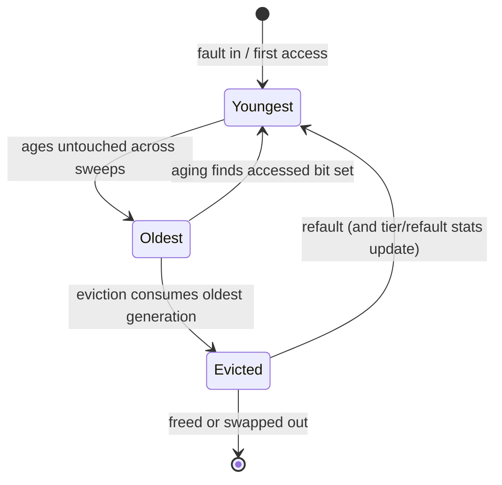
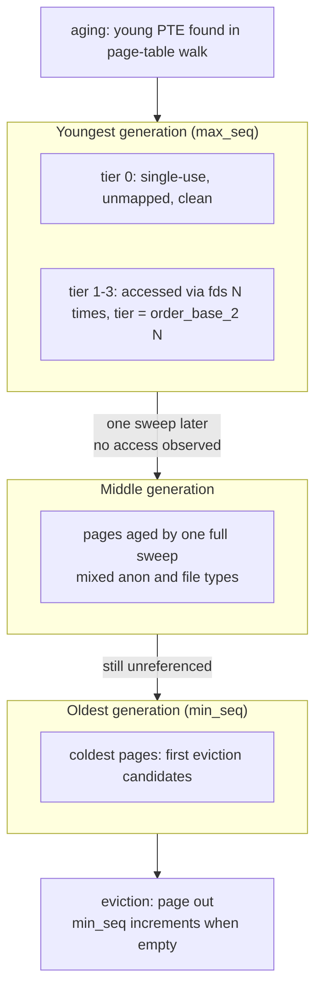

# Multi-Gen LRU (MGLRU)

## Overview

Multi-Gen LRU (MGLRU), developed by Yu Zhao at Google and merged into Linux 6.1 (December 2022), is a rewrite of page reclaim's core data structure. Instead of two per-node lists (active/inactive) with one history bit per page, each LRU vector is organized into **generations** — groups of pages with similar access *recency* — and each generation is subdivided into **tiers** ordered by access *frequency*. The goals: make reclaim decisions match the true working set, cut kswapd CPU overhead under memory pressure, and protect the working set with a time-based knob instead of tunable guesswork.

> **Interview one-liner:** "MGLRU replaces active/inactive lists with generations and tiers — generations bucket pages by access recency using page-table-driven aging, tiers refine by access frequency, and a Bloom filter lets the aging walk skip sparse page tables — which is why kernel 6.1+ reclaims closer to the real working set at a fraction of the kswapd cost."

Companion reading: the kernel-side reclaim pipeline is in [Reclaim](../../linux/kernel/memory/reclaim.md); the classic algorithm this replaces is [LRU](../virtual-memory/lru.md); and PSI/DAMON (the measurement layers feeding modern reclaim) are in [PSI and DAMON](./psi-and-damon.md).

## Vocabulary

| Term | Meaning |
|------|---------|
| lruvec | the LRU state for one node × memcg combination; MGLRU's unit of bookkeeping |
| generation | a recency bucket: pages whose access was observed in the same sweep window |
| tier | frequency sub-ranking within a generation: `order_base_2(N)` for N fd-accesses |
| type | anonymous vs file — each generation holds both types separately |
| `max_seq` | counter of the youngest generation; advanced by aging |
| `min_seq` | counter of the oldest generation still holding pages; advanced by eviction |
| folio | the kernel's variable-size page abstraction; `lrugen->folios[]` stores folios per gen × type × tier |
| refault | a page evicted and quickly faulted back — reclaim's mistake signal |

## What Was Wrong with Active/Inactive

The classic implementation keeps `anon` and `file` pages on active and inactive lists per node (and per memcg), promoting pages via the `PG_referenced`/`PG_active` bits and evicting from the inactive tail. Three structural problems show up under real pressure:

| Problem | Mechanism | Symptom |
|---------|-----------|---------|
| One bit of history | `PG_referenced`/`PG_active` toggle | "recently used once" and "hot" are indistinguishable; loop-heavy workloads thrash |
| Full-list scans | referenced-bit feedback sweeps over list length | kswapd burns CPU proportional to *total* pages, not to the working set |
| Weak working-set estimation | no time-ordered frame of reference | cannot compare recency across memcgs or pick "the coldest" set confidently |
| rmap-driven aging | per-page reverse-mapping lookups | cache-hostile: each page chases its own mappings |

The design goal stated in the kernel docs is blunt: page reclaim decides the kernel's caching policy and ability to overcommit memory, and it "directly impacts the kswapd CPU usage and RAM efficiency." MGLRU attacks both the decision quality and the scanning cost at once, which is why it originated on memory-constrained Android/ChromeOS devices where both dimensions hurt.

## Generations: Recency as the Primary Axis

Each `lruvec` (per node × memcg) replaces its lists with an array `lrugen->folios[]` indexed by generation counter and split by page type (anonymous vs file). Two sequence counters bookend the structure:

- `max_seq` — the youngest generation counter, incremented by **aging** when a sweep finds newly-used pages.
- `min_seq` — the oldest generation still holding pages; **eviction** consumes old generations and increments `min_seq` when `folios[min_seq % MAX_NR_GENS]` empties.

A generation is timestamped at birth; a page's generation counter records when its access was last observed. The two counters act like Yu Zhao's description of a **"clock with two hands"**: the *aging hand* scans for accessed pages and marks them to move to the youngest generation; the *eviction hand* moves pages into their correct generation and considers the coldest, oldest-generation pages for reclaim. Pages found accessed through page tables are promoted to the youngest generation, with the counter updated to `(max_seq % MAX_NR_GENS) + 1`.

The power of generations is the *time-based common frame of reference*: the kernel documentation notes it enables better choices "between different memcgs on a computer or different computers in a data center," because ages are comparable across containers and machines, not just within one list.

### A page's life through the generations



Every arrow in this diagram maps to a mechanism above: promotion on observed access, demotion by aging, consumption by eviction, and the refault loop that feeds the tier tie-break and the PID controller.



## Tiers: Frequency Within a Recency Bucket

Generations answer "how recently?"; tiers answer "how often?" Within a generation, pages accessed through file descriptors are ranked by frequency: a page accessed `N` times through fds sits in tier `order_base_2(N)`. Two implementation details matter for interviews:

- **Tiers are cheap to move between.** Moving a page across *generations* requires the LRU lock; moving across *tiers* only involves atomic operations — so frequency re-classification does not serialize against reclaim.
- **Tier 0 is a deliberate fast path.** The first tier holds single-use, unmapped, clean pages — the best eviction candidates (no TLB flush for unmapped pages, no writeback for clean pages).

Eviction uses the tier information concretely: it compares `min_seq[]` across the anonymous and file types to pick the older type, and when both are equally old, selects the type whose first tier has the **lower refault percentage** — reclaim learns from its own mistakes via measured refaults rather than a fixed anon-vs-file ratio heuristic.

## Aging Through Page Tables, with a Bloom Filter

The biggest mechanical change is *how* access is observed. Classic reclaim ages pages individually via rmap (find the mappings of one page). MGLRU's primary path walks **page tables**: one cacheline-efficient sweep can observe every young PTE in an address space, exploiting spatial locality that a per-page rmap walk cannot. The kernel docs are explicit that both methods are kept and combined — rmap for unmapped or sparse cases, page-table walks for mapped working sets — because "the key is to optimize both methods and use them in combination."

Page-table walks have a weakness: address spaces are sparse, and sweeping mostly-empty page tables buys nothing. MGLRU closes this with a **Bloom filter per lruvec**:

- After eviction scans a PTE table (the PMD-level page that holds PTEs) efficiently, it **adds the PMD entry to the Bloom filter**.
- The next aging pass consults the filter: a "definitely not in the set" answer means that page table was empty last cycle and can be skipped outright.
- Bloom filters answer set membership in one direction only — an element is *not* in the set, or *may be* in the set — so a false positive costs one unnecessary walk, and no page is ever wrongly skipped.

The asymmetry is the safety argument, and it is worth spelling out in interviews: a Bloom filter can say "maybe present" when the element is absent (false positive), but never "absent" when it is present (no false negatives). For the aging skip, the dangerous error would be *not visiting a page table that contains young PTEs* — that is the impossible direction. The kernel docs describe this filter as "a feedback loop between the eviction and the aging": eviction's observations make aging cheaper, and aging's promotions give eviction better-ordered material. Amortized across a generation, the per-page cost of aging collapses: the expensive walk touches page-table *pages* (512 PTEs each) rather than individual pages, and skips known-sparse tables entirely — this is the overhead reduction the LWN discussion highlighted as MGLRU's reason to exist.

## Overhead Reduction vs Classic Reclaim

| Aspect | Classic active/inactive | MGLRU |
|--------|------------------------|-------|
| History per page | 1 bit (referenced/active) | generation (recency) + tier (frequency) |
| Aging unit | per page via rmap | per PTE-table sweep via page tables + rmap fallback |
| Scan cost driver | total list length | mapped working set; sparse tables skipped via Bloom filter |
| Anon vs file policy | swappiness ratio heuristic | compare `min_seq[]`; tie-break on first-tier refault % |
| Cross-list moves | LRU lock per page | generations need the lock; tier moves are atomics |
| Working-set protection | none (tunable guesswork) | `min_ttl_ms` time-based guarantee |
| Learning signal | refault detection in shadow entries | refault-driven type/tier selection + PID controller |
| Cross-memcg comparability | per-memcg lists with local recency | generations timestamped, comparable across memcgs and hosts |
| Fast-path victims | tail of inactive list | tier 0: single-use, unmapped, clean pages |
| Tunable surface | `swappiness`, `/proc/sys/vm/*` ratios | `enabled`, `min_ttl_ms` — small and time-based |

The "learning signal" row comes from the LWN merge discussion: MGLRU "tries to learn from its mistakes by noticing when pages it reclaims are quickly brought back into memory," steering future scans with a proportional-integral-derivative (PID) controller. Reclaim becomes a closed-loop system rather than a fixed policy — the same philosophy as the PSI/DAMON loop, implemented inside the reclaimer.

## Results: Android, ChromeOS, and Desktop

MGLRU shipped in 6.1 (the same release that brought the maple tree) and was enabled on Android and ChromeOS kernels, where the author's reported results across test devices included double-digit percentage reductions in kswapd CPU usage and in workingset refaults, plus fewer low-memory kills and smoother behavior under overcommit. On desktops and laptops the benefit shows up as the `min_ttl_ms` protection doing its job: the interactive working set survives memory spikes instead of being churned.

The feature also stayed controversial in the best sense: reclaim reviewers kept probing its complexity, and LWN's 2025 piece *Reconsidering the multi-generational LRU* records renewed mainline discussion about how far to push it. For interviews, know both sides: MGLRU measurably improved memory-constrained and overcommitted systems, and its cost is a more intricate reclaimer whose behavior is harder to reason about than two linked lists.

How to talk about the numbers without over-claiming: the MGLRU patch series and LWN coverage report *directionally consistent* wins — less kswapd CPU per reclaimed byte, fewer workingset refaults, fewer low-memory-killer events on Android — but the exact percentages depend on device, workload, and kernel version. The strong interview answer names the metric class (kswapd CPU, workingset refault rate, low-memory kills), names the source (the MGLRU series and LSFMM/LWN discussions), and offers the measurement recipe from the section above rather than reciting a single figure as gospel.

## A Worked Generation Cycle

A concrete cycle makes the two counters and the tiers concrete. Suppose an lruvec has `max_seq = 10` and `min_seq = 8`, with three generations holding pages:

1. **Aging pass.** kswapd walks page tables, consulting the Bloom filter to skip empty PTE tables. It finds PTEs with the accessed bit set mapping pages in generations 8 and 9, clears the bits, and moves those pages to generation `(max_seq % MAX_NR_GENS) + 1` — the new youngest bucket. `max_seq` becomes 11.
2. **Eviction pass.** Reclaim needs memory, so it consumes the oldest generation (`min_seq = 8`, now mostly drained by aging). It compares `min_seq[]` for anon vs file types, picks the older type, tie-breaks on first-tier refault percentage, and evicts from the lowest tiers first. When `folios[min_seq % MAX_NR_GENS]` is empty, `min_seq` becomes 9.
3. **Feedback.** If many of the evicted file pages fault back within seconds, the refault counters for their tier rise; the next tie-break between anon and file moves toward anon. A PID controller scales how aggressively the scan targets the offending class.

The whole cycle touches only pages whose access state actually changed plus the metadata of a few hundred page tables — not every page in memory. That is the amortization story in one paragraph: classic reclaim re-asks "is this page referenced?" for the entire list; MGLRU asks it once per page per generation transition, in bulk, along cacheline-friendly page-table walks.

## Observing MGLRU on a Live System

```bash
# Feature state and working-set protection
ls /sys/kernel/mm/lru_gen/
cat /sys/kernel/mm/lru_gen/enabled
cat /sys/kernel/mm/lru_gen/min_ttl_ms

# Refault accounting (the signal MGLRU's tier selection uses)
grep -E 'workingset_refault|workingset_activate' /proc/vmstat

# Per-generation, per-tier sizes and refault stats (debug builds)
cat /sys/kernel/debug/lru_gen
```

The numbers that matter in practice are `workingset_refault` deltas from `/proc/vmstat` — the kernel's own measure of "evicted something the workload still needed" — together with kswapd CPU time (`ps -o time -p $(pgrep kswapd0)`) and PSI memory pressure. The admin-guide stats expose exactly the breakdown MGLRU optimizes: per-generation, per-type, per-tier page counts and refault percentages, so you can see whether reclaim is taking from the cold generations or fighting the working set. The debugfs file also accepts forced aging and eviction steps, which is how the MGLRU tests exercise specific sequences.

## Configuration Knobs

MGLRU exposes a small, time-based interface under `/sys/kernel/mm/lru_gen/`:

```bash
# Feature bitmap (multi-gen LRU + optional enhancements); 0 disables entirely
cat /sys/kernel/mm/lru_gen/enabled

# Working-set protection: prevent the working set of the last N ms from
# being evicted; if it cannot be kept in memory, the OOM killer fires.
# "An adjustable pressure relief valve" for laptops/desktops without oomd.
echo 1000 > /sys/kernel/mm/lru_gen/min_ttl_ms
```

| Knob | Meaning | Practical use |
|------|---------|---------------|
| `enabled` | runtime bitmap enabling MGLRU and its enhancements | A/B testing, debugging, quick rollback on regression |
| `min_ttl_ms` | protects an lruvec from eviction while its oldest generation is younger than N ms; OOM killer triggers if the protected working set cannot be kept | set to your SLA's latency budget — the reclaimer now respects time, not just list positions |

`min_ttl_ms` deserves emphasis: the docs describe an lruvec as protected "when its oldest generation was born within `lru_gen_min_ttl` milliseconds," which converts a generational timestamp directly into a working-set residency guarantee. That is only expressible because generations are *time-based* — the knob has no natural equivalent in the two-list design. Per-memcg visibility comes free since each memcg owns its lruvec, so container working sets can be protected and observed independently (see [cgroups](../containers/cgroups.md)).

## Common Mistakes

1. **Calling MGLRU a new page-replacement exam algorithm.** It is still an LRU *approximation* — the precise LRU of textbooks remains impractical; MGLRU makes the approximation principled (recency buckets + frequency tiers) instead of bit-based.
2. **Reading "multi-gen" as multi-*generational* GC.** This is kernel page reclaim, not a garbage collector; the "generations" are recency buckets, not allocation epochs.
3. **Assuming tiers span generations.** Tiers subdivide a single generation; a page's global rank is (generation, tier), and eviction walks generations from oldest, tiers from lowest.
4. **Setting `min_ttl_ms` too high.** The knob protects a working set *by design* — if that working set cannot fit in memory, the OOM killer fires rather than evicting it. It is a pressure-relief valve with a deliberate sharp edge, not a free lunch.
5. **Attributing Android's wins to MGLRU alone.** It landed alongside zram-heavy configs and DAMON-era monitoring; quote it as one measured component of a system, which is exactly how the merge discussion treated it.

## Interview Questions

1. **What problem does MGLRU solve compared to the classic active/inactive lists?** The classic design gives each page one bit of history, so "used once recently" and "genuinely hot" are indistinguishable, and aging works by sweeping lists whose length is independent of the working set — kswapd burns CPU proportional to total pages under pressure. MGLRU replaces the two lists with generations (recency buckets with timestamps) and tiers (frequency sub-ordering), ages pages through cacheline-efficient page-table walks, and protects working sets by time via `min_ttl_ms`. The reported result on Android/ChromeOS was large reductions in kswapd CPU usage and workingset refaults, which is what convinced the memory-management community to merge it in 6.1.
2. **Explain generations and tiers in MGLRU.** Generations are groups of pages with similar access recency: `max_seq` marks the youngest generation, aging promotes newly-accessed pages there, and eviction consumes the oldest generation, advancing `min_seq` when it empties — a "clock with two hands." Tiers subdivide a generation by access *frequency*: a page accessed N times through file descriptors sits in tier `order_base_2(N)`, with tier 0 reserved for single-use unmapped clean pages, the best eviction candidates. Movement between generations takes the LRU lock, but movement between tiers is atomic-only, so frequent re-classification is cheap.
3. **Why does MGLRU walk page tables, and what is the Bloom filter for?** A page-table walk observes all young PTEs of an address space in one spatially-local, cacheline-efficient pass, whereas an rmap walk chases the mappings of one page at a time. The weakness is sparse address spaces full of empty page tables, so MGLRU keeps a Bloom filter per lruvec: eviction records the PMD entries (PTE tables) it scanned, and aging consults the filter to skip tables that were empty last cycle. Bloom filters have no false negatives — a "not present" answer is always safe to act on — and a false positive merely costs one wasted walk, making the optimization risk-free.
4. **What is `min_ttl_ms` and why is it only possible with MGLRU?** Writing N to `/sys/kernel/mm/lru_gen/min_ttl_ms` protects an lruvec from eviction while its oldest generation was born within the last N milliseconds — in other words, the working set of the last N ms cannot be evicted, and if that working set cannot be kept in memory the OOM killer fires instead. It is described as an adjustable pressure relief valve for systems without oomd. The knob exists because generations are timestamped at birth, giving the reclaimer a time-based frame of reference; the two-list design has no comparable per-region age, so the classic kernel could only approximate this with tunables like swappiness.
5. **How does MGLRU decide between anonymous and file pages?** Instead of a global swappiness ratio, eviction compares the `min_seq[]` counters of the anonymous and file types and evicts from the older type first; if both are equally old, it picks the type whose first tier has the lower refault percentage. Refaults — pages evicted then quickly faulted back — are the feedback signal, and the LWN coverage of the merge notes MGLRU additionally uses a PID controller to redirect scanning when its evictions are being undone. The result is reclaim that adapts to the workload's measured behavior instead of a static ratio.
6. **MGLRU and DAMON both track "access" — how do they differ and compose?** DAMON is a *monitoring* subsystem: it discovers which address ranges are hot or cold using adaptive regions and reports or acts on them via DAMOS schemes, at a cost bounded by region adaptation. MGLRU is the *reclaim ordering*: it structures the LRU lists by recency and frequency so that when reclaim runs, the victims are chosen cheaply and well. They compose because both consume access information — DAMOS can proactively page out regions DAMON proves cold, and MGLRU orders whatever remains — and both feed on refault/pressure signals; PSI closes the loop by measuring whether any of it helped.

## Key Takeaways

- MGLRU merged in Linux 6.1 (2022) and reorganizes reclaim into generations (recency) and tiers (frequency) instead of active/inactive lists.
- `max_seq`/`min_seq` counters implement a two-handed clock: aging promotes to the youngest generation, eviction consumes the oldest.
- A page accessed N times through fds lands in tier `order_base_2(N)`; tier 0 = single-use unmapped clean pages; tier moves are atomic, no LRU lock.
- Aging walks page tables for spatial locality and uses a per-lruvec Bloom filter to skip PTE tables known to be sparse — no false negatives, cheap false positives.
- Eviction picks anon vs file by comparing `min_seq[]`, tie-broken by first-tier refault percentage, and learns via a PID controller.
- `min_ttl_ms` protects the last N ms of working set from eviction — a time-based guarantee impossible in the two-list design.
- Results reported on Android/ChromeOS: double-digit reductions in kswapd CPU and workingset refaults, fewer low-memory kills.
- The design philosophy matches PSI/DAMON: measure access, act in generations, learn from refaults — closed-loop reclaim.

## References

- Kernel documentation: *Multi-Gen LRU* (design: generations, tiers, Bloom filters) — <https://docs.kernel.org/mm/multigen_lru.html>
- Kernel documentation: *Multi-Gen LRU* (admin guide: `enabled`, `min_ttl_ms`) — <https://docs.kernel.org/admin-guide/mm/multigen_lru.html>
- LWN: *The multi-generational LRU* (Jonathan Corbet, 2022 — design walkthrough) — <https://lwn.net/Articles/851605/>
- LWN: *Merging the multi-generational LRU* (Jonathan Corbet, LSFMM 2022 — Bloom filter, PID controller, clock-with-two-hands) — <https://lwn.net/Articles/894859/>
- LWN: *Reconsidering the multi-generational LRU* (2025) — <https://lwn.net/Articles/1060967/>
- LWN: *The 6.1 kernel is out* (MGLRU and maple tree ship in 6.1) — <https://lwn.net/Articles/917504/>
- Kernel source: <https://github.com/torvalds/linux> (`mm/vmscan.c`, `include/linux/mmzone.h`)
- DAMON documentation (the monitoring counterpart) — <https://docs.kernel.org/mm/damon/index.html>

## Cross-References

- [LRU](../virtual-memory/lru.md) — the classic list-based algorithm MGLRU generalizes
- [Working Set Model](../virtual-memory/working-set.md) — the theory behind `min_ttl_ms` and working-set estimation
- [Thrashing](../virtual-memory/thrashing.md) — the failure mode MGLRU's refault learning targets
- [Page Replacement](../memory/page-replacement.md) — where reclaim sits in the virtual-memory pipeline
- [Reclaim](../../linux/kernel/memory/reclaim.md) — kernel-side reclaim pipeline (kswapd, direct reclaim, watermarks)
- [PSI and DAMON](./psi-and-damon.md) — the measurement and scheme layers that drive modern reclaim
- [Maple Tree & XArray](../../linux/kernel/memory/maple-tree-xarray.md) — the other flagship 6.1 data-structure rewrite
