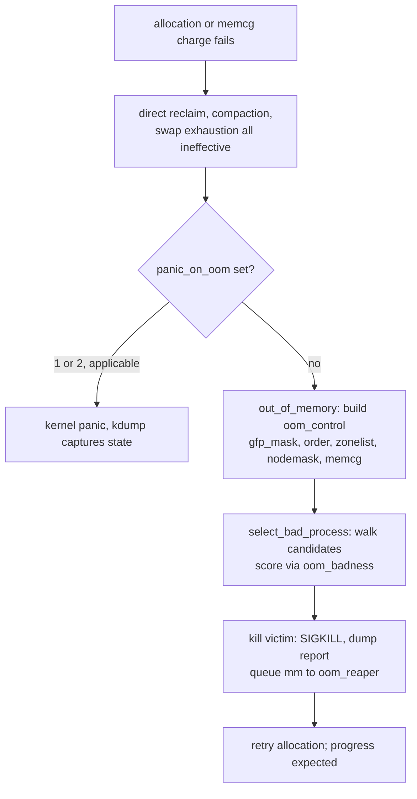
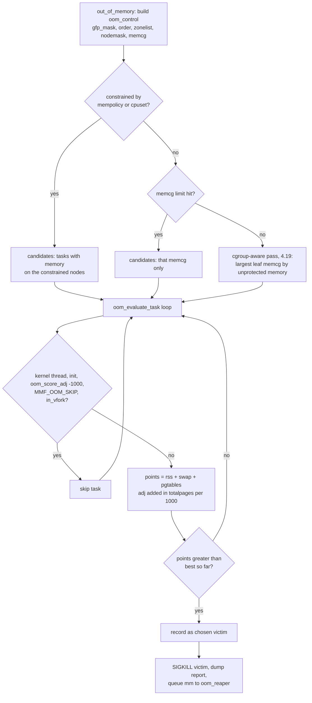

# The OOM Killer: Victim Selection and Postmortems

## Overview

When reclaim, compaction, and swap all fail to satisfy an allocation, the kernel's last resort is the OOM killer: a deliberate walk over candidate tasks that picks the process whose death frees the most memory at the lowest system cost, kills it, and reaps its memory asynchronously. Interviews increasingly test the mechanics beyond "it kills the biggest process" — the badness formula, the constraint system (per-node, per-memcg), `memory.oom.group`, the oom_reaper, and the userspace daemons (systemd-oomd, earlyoom) that preempt the kernel entirely.

> **Interview one-liner:** "The OOM killer scores each candidate as RSS + swap entries + page-table pages, adds `oom_score_adj` scaled into page units, and picks the max — but first it narrows the candidate set by constraint (mempolicy, cpuset, or memcg) and, since 4.19, by cgroup-aware selection that picks the largest unprotected memcg before picking a task inside it."

This page is the internals-and-operations companion to the kernel-level tour in [OOM Killer](../../linux/kernel/memory/oom-killer.md) (which covers overcommit accounting and hwpoison) and to the pressure-driven daemon layer in [PSI and DAMON](./psi-and-damon.md). The reclaim machinery that fails *before* the killer fires is dissected in [Page Reclaim](./page-reclaim.md).

## Vocabulary

| Term | Meaning |
|------|---------|
| badness (`points`) | the victim score: resident pages + swap entries + page-table pages, adjusted by `oom_score_adj` |
| `oom_control` (`oc`) | the request descriptor: gfp mask, order, zonelist, nodemask, memcg, constraint, chosen victim |
| constraint | the scope of the OOM: `CONSTRAINT_NONE` (system), `CONSTRAINT_MEMORY_POLICY`, `CONSTRAINT_CPUSET`, or memcg |
| `oom_score_adj` | per-task adjustment in −1000..1000; −1000 makes the task unkillable; inherited by children |
| oom_reaper | kernel thread that unmaps a victim's private anonymous memory while the victim is still dying |
| `memory.oom.group` | cgroup v2 flag (5.3): kill every task in the group instead of one process |
| cgroup-aware OOM | 4.19 behavior: system-wide OOM first picks the largest unprotected memcg, then a task inside it |
| oomd / systemd-oomd | userspace OOM daemons acting on PSI pressure before the kernel's killer is reached |

## When the Killer Fires

The killer is the terminal step of the allocation slowpath, reached only after documented failures: direct reclaim freed nothing useful, compaction could not build the order-N block, swap is exhausted (or `memory.swap.max`), and the watermark boost kick produced no progress. `out_of_memory()` guards this path carefully against false positives — if the OOM was already handled, if the killer is disabled (`oom_killer_disabled` via the sysrq path), or if `did_some_progress` suggests another reclaim round could help, it declines. A memcg limit hit produces a *scoped* invocation instead: the walk is constrained to that cgroup and its subtree, and the system as a whole may have plenty of free memory.

Two invocation flavors exist beyond allocation failure. A memcg charging path that exhausts `memory.max` enters memcg OOM directly (scoped, as above). And `SysRq+f` triggers a manual OOM event for debugging — useful to watch the selection walk and report format on a healthy system rather than learning it during an incident. The killer also coordinates with `panic_on_oom` before selecting anything: policy decides whether selection happens at all.



## The Badness Score

The modern score (reworked in the 4.17-era cleanup) is linear in pages and deliberately simple:

\\[ \\text{points} = \\text{rss} + \\text{swap\\_entries} + \\frac{\\text{pgtables\\_bytes}}{\\text{PAGE\\_SIZE}}, \\qquad \\text{points} \\mathrel{+}= \\text{oom\\_score\\_adj} \\times \\frac{\\text{totalpages}}{1000} \\]

Three design choices are interview-worthy. First, the score counts what killing the task *releases*: RSS plus swap entries (killing frees the swap slots too) plus page tables, so a task that already swapped most of itself out is still credited — the kernel kills memory *footprint*, not just RAM usage. Second, `oom_score_adj` is applied additively in normalized units: +1000 adds the whole machine's worth of pages, −1000 (via `OOM_SCORE_ADJ_MIN`) short-circuits the task to `LONG_MIN` — unkillable — before any arithmetic. Third, `/proc/PID/oom_score` exposes the normalized view (points scaled to 0–1000 against `totalpages`), which is what monitoring and `ps -o oom_score` read.

History matters because older material says otherwise: pre-4.17 kernels multiplied the score by \\( (1000 + adj)/1000 \\) and gave `CAP_SYS_ADMIN` processes a 3% discount; the rework removed the root bonus (privilege should not decide who dies) and made the adjustment additive so that `oom_score_adj` semantics became predictable for orchestration stacks. That predictability is why systemd, Kubernetes-adjacent runtimes, and every OOM daemon treat `oom_score_adj` as the standard priority interface — inherited across `fork()`, settable per unit via `OOMScoreAdjust=`, and honored identically by kernel and userspace killers.

## The Selection Walk

`select_bad_process()` builds the candidate set from the constraint in the `oom_control`, then `oom_evaluate_task()` scans `for_each_process`, scoring and skipping. The skips encode real kernel wisdom: kernel threads and `init` are never victims; tasks with `oom_score_adj = −1000` are immune; tasks already marked `MMF_OOM_SKIP` (killed in an ongoing OOM event) are not double-selected; and vfork parents are spared because killing them wedges the child. For constrained OOMs — a mempolicy or cpuset limited to specific nodes — only tasks holding memory on the offending nodes qualify, because killing an unrelated task would not free the right memory.



Since 4.19, the system-wide walk is **cgroup-aware**: instead of comparing raw per-task scores first, the killer compares *memcgs* by their used memory with `memory.min`/`memory.low`-protected amounts excluded, picks the largest leaf memcg, and only then runs the per-task scoring inside it. The rationale: with per-cgroup accounting, the biggest *task* is often the wrong victim when the pressure comes from an aggregate of small processes in one bloated container. `vm.oom_kill_allocating_task = 1` bypasses the walk entirely — the triggering task dies, chosen in O(1) — a trade-off for hosts with enormous task tables where the scan itself hurts.

## Killing, memory.oom.group, and the oom_reaper

Selection ends with `oom_kill_process()`: the report is dumped (see the anatomy section below), SIGKILL is delivered, and the victim's `mm` is queued to the **oom_reaper**. The reaper (merged in 4.7) exists because dying is not instant — a victim can be stuck in uninterruptible I/O, holding `mmap_lock` for write, or simply slow through exit teardown, and until its pages are actually freed, the OOM condition persists and other tasks keep failing. The reaper walks the victim's page tables independently and unmaps private anonymous memory, freeing those pages and dropping TLB entries *while the process is still alive on its way out*; file-backed and shared mappings are skipped deliberately, since other users or clean drop paths handle them. On success, dmesg gains the line `oom_reaper: reaped process NNN (name), now anon-rss:0kB ...` — the operational proof that memory recovered without waiting for exit.

`memory.oom.group` (5.3) answers a correctness problem of per-process kills: in a multi-process service — worker + supervisor + sidecars — killing only the best-scoring process leaves the rest running in a broken, inconsistent state. With the flag set, an OOM inside the memcg kills *all* tasks in the group, and the scope escalates outward: if any ancestor also has `memory.oom.group` enabled, the whole ancestor group dies instead, so a fleet can mark an entire "service = one unit" subtree and get atomic kills. The events land in `memory.events` (`oom`, `oom_kill`, and group-kill counters), which is what monitoring should alert on rather than parsing dmesg. The kernel-side alternative — setting `oom_score_adj` on the whole process group — achieves priority but not *atomicity*: the group flag is what guarantees no survivor of a killed service keeps serving broken state.

| Knob | Where | Default | Effect |
|------|-------|---------|--------|
| `vm.panic_on_oom` | sysctl | 0 | 0 = kill a victim; 1 = panic on any OOM; 2 = panic only for *constrained* OOM (memcg/cpuset/mempolicy) |
| `vm.oom_kill_allocating_task` | sysctl | 0 | 1 = kill the triggering task, skip the scoring walk (O(1)) |
| `vm.oom_dump_tasks` | sysctl | 1 | dump the per-task memory table into the OOM report |
| `/proc/PID/oom_score_adj` | procfs | 0 | −1000..1000; −1000 = immune; additive in the score; inherited on fork |
| `OOMScoreAdjust=` | systemd unit | unset | sets `oom_score_adj` for the whole service |
| `memory.oom.group` | cgroup v2 | 0 | kill the entire cgroup; scope escalates to the outermost enabled ancestor |
| `memory.max` / `memory.high` | cgroup v2 | max | trigger memcg-scoped OOM / throttle before failure |
| `ManagedOOMMemoryPressure=` | systemd | unset | systemd-oomd kills the cgroup on a PSI threshold, preempting the kernel killer |
| `vm.overcommit_memory` | sysctl | 0 | shapes *when* OOM happens: 0 heuristic, 1 always commit, 2 strict (commit ≤ swap + ratio·RAM) |

## Panic or Kill: Choosing the Failure Mode

`vm.panic_on_oom` inverts the default philosophy. The value `1` converts every OOM into a kernel panic — the right choice when a wrong kill costs more than a crash: primary database nodes with kdump configured, safety-critical controllers, or hosts where killing an arbitrary memory holder corrupts service state. The value `2` is narrower and widely misunderstood: it panics only for *constrained* OOMs (a memcg, cpuset, or mempolicy ran dry), while system-wide OOM still invokes the killer — the intended use is virtualization and container hosts where a guest or tenant exhausting its own allocation indicates a fault worth capturing immediately, without making every transient system-wide pressure spike fatal. Panic paths should be paired with `kernel.panic` and kdump so the postmortem artifact is a crash dump rather than a reboot.

`vm.oom_kill_allocating_task` is the other failure-mode dial. The scoring walk is O(tasks) with per-task locking; on hosts with hundreds of thousands of tasks, a full scan under OOM conditions adds seconds of stall. Killing the allocator is rarely the *fairest* victim (allocators are often innocent — they merely hit the wall last) but it is always a *live* culprit holding fresh memory, and retry-after-kill usually succeeds. The knob trades optimality for latency and determinism, which is also the argument userspace daemons make for acting earlier: better to shed load at 80% pressure than to run any selection walk at 100%.

## Userspace Alternatives

The kernel OOM killer fires at the *end* of a long degradation curve — reclaim thrash, swap churn, direct-reclaim stalls — by which point the system has been unhealthy for seconds or minutes. Userspace killers move the decision earlier and make it policy-driven:

- **systemd-oomd** (systemd v245+) consumes PSI (via `memory.pressure` on cgroups) and kills cgroups when `some`/`full` memory pressure exceeds configured limits (`ManagedOOMMemoryPressure=kill`, `ManagedOOMMemoryPressureLimit=`, plus swap-pressure rules). It is the default evolution path for distributions because it inherits systemd's unit/cgroup mapping and acts at the right granularity: the unit, not the task.
- **oomd** (Meta, `facebookincubator/oomd`) is the production-hardened predecessor: a plugin-based daemon reading PSI from cgroup v2 with configurable rules (kill on pressure, on swap exhaustion, on senpai-driven tuning). Meta's posts describe it replacing in-kernel kills fleet-wide precisely because PSI distinguishes real harm from low occupancy.
- **earlyoom** is the simple, occupancy-based option: it polls `MemAvailable`/`SwapFree` and SIGKILLs the worst `oom_score` process below thresholds (defaults around 10%, commonly configured `-m 5 -s 5`), with `--prefer`/`--avoid` regexes to bias victims. It reacts earlier than the kernel but on *occupancy*, so it trades false positives for early intervention — the deliberate opposite of PSI-based killing (this trade-off is dissected in [PSI and DAMON](./psi-and-damon.md)).
- **Android lmkd** performs the same role on phones, driven by PSI events and per-`oom_score_adj` kill slots — the reason Android ships `minfree`-style tuning in userspace rather than relying on the kernel killer.

The interview framing: the kernel killer is the *safety net*, not the policy. Production fleets configure so that daemons act first (pressure or occupancy thresholds), `oom_score_adj` encodes business priority, and `memory.oom.group` guarantees atomic kills — leaving the in-kernel walk for the genuinely unexpected.

## Death by a Thousand cgroups

The phrase describes the operational failure mode container fleets hit as cgroup adoption deepened: with hundreds of memcgs each carrying its own `memory.max`, the system experiences many *small* OOM events — one per mis-sized container — each killing a single process that is often load-bearing for a multi-process service, while `memory.events` fires alerts nobody correlated. Three kernel changes address the pattern. Cgroup-aware selection (4.19) made system-wide OOM choose the largest unprotected *memcg* first, so aggregate hogs are punished even when no single process looks big. `memory.oom.group` (5.3) made kills atomic at service granularity. And PSI-based daemons (systemd-oomd, oomd) moved the whole decision upstream of the kernel's terminal state, killing the offending subtree while the host is still healthy.

The failure mode also has a capacity-planning shape: per-cgroup limits fragment memory — ten containers each reserving headroom that one hot container cannot borrow — so the same physical host that would survive a global spike experiences repeated memcg OOMs. The mature answer layers the knobs: `memory.max` for hard isolation, `memory.high` slightly below it for graceful throttle, `memory.min`/`low` only where protection is real, `oom.group` for kill atomicity, and fleet-level alerting on `oom_kill` counters plus per-cgroup pressure rather than on dmesg greps. This is the container-era refinement of the OOM story and the part most interview candidates have never operated.

## Postmortem: Anatomy of the dmesg Report

Every OOM event dumps a structured report; reading it fluently is a differentiator. A representative (abridged) report with annotations:

```text
invoked oom-killer: gfp_mask=0x100dca(GFP_HIGHUSER_MOVABLE), order=0,
    oom_score_adj=0                       # who asked: mask+order tell you anon vs
CPU: 12 PID: 842 Comm: kswapd0            # file; here kswapd on behalf of the system
...
Mem-Info:
Node 0 DMA  free:...min:...low:...high:... # per-zone state: how deep below
Node 0 DMA32 free:15988MB min:16384kB ...  # watermarks the node was
active_anon:812341 inactive_anon:40122 isolated_anon:0
 active_file:12231 inactive_file:8902 ...  # list sizes: is this anon thrash?
unevictable:1204 slab_reclaimable:98211 slab_unreclaimable:43112
Free swap  = 0kB                            # 0 = swap exhausted: a key clue
Tasks state (memory values in pages):
[  pid  ]   uid  tgid total_vm      rss swapents oom_score_adj name
[    842 ]     0   842    10231      412        0             0 kswapd0
[  11904 ]  1000 11904  2048000  1048576   131072           500 java
Out of memory: Killed process 11904 (java) total-vm:8192000kB,
    anon-rss:4194304kB, file-rss:0kB, shmem-rss:0kB,
    UID:1000 pgtables:16448kB oom_score_adj:500
oom_reaper: reaped process 11904 (java), now anon-rss:0kB, file-rss:0kB,
    shmem-rss:0kB
```

Reading order for the postmortem: the `invoked oom-killer` line identifies the trigger (gfp mask and who was allocating); the zone lines show how far below watermarks the node fell; the list-size lines show *what* reclaim had available (huge inactive anon + zero free swap = swap death); the task table is the candidate set with the score inputs visible, so you can verify the chosen victim really was the max-badness task; the `Killed process` line records the final accounting including `pgtables` and the effective `oom_score_adj`; and the `oom_reaper` line confirms asynchronous recovery. If the report ends without a reaper line, the victim wedged — correlate with the oom_reaper's documented skip conditions. Persistent-fault analysis should start from `memory.events` and `workingset_refault` history instead: an OOM report is one frame, those counters are the film.

## Interview Questions

1. **How does the kernel choose an OOM victim?** First the candidate set is narrowed by constraint: a memcg OOM scans only that cgroup, a mempolicy/cpuset OOM only tasks holding memory on the offending nodes, and since 4.19 a system-wide OOM is cgroup-aware — it picks the largest leaf memcg by memory not protected by `memory.min`/`low`, then scores inside it. Each candidate is skipped if it is a kernel thread, `init`, vfork-blocked, already killed (`MMF_OOM_SKIP`), or has `oom_score_adj = −1000`. The score is RSS + swap entries + page-table pages plus `oom_score_adj × totalpages/1000`, and the maximum wins. `vm.oom_kill_allocating_task = 1` skips the whole walk and kills the allocator.
2. **Why does the badness score include swap entries and page tables, and what changed in 4.17?** Because the score approximates *what killing releases*: swap slots are freed along with RSS, and page-table pages are substantial (up to GiB-scale for huge address spaces) and otherwise unaccounted. The 4.17-era rework made the formula additive in page units — `points += oom_score_adj × totalpages/1000` — replacing the older multiplicative scaling, and removed the 3% `CAP_SYS_ADMIN` bonus so privilege no longer biases victim selection. The normalized `/proc/PID/oom_score` (0–1000) remains the interface monitoring reads.
3. **What is the oom_reaper and why does it exist?** Between SIGKILL and actual memory release lies process exit, which can take arbitrarily long if the victim is stuck in uninterruptible I/O or waiting on `mmap_lock`. The oom_reaper (4.7) is a kernel thread that takes the victim's `mm` and unmaps its private anonymous pages immediately — freeing the bulk of the memory while the process is still dying — skipping file/shared mappings that other paths handle. The `oom_reaper: reaped process ... anon-rss:0kB` dmesg line is the confirmation; without it, an OOM event's recovery depends on a victim that already demonstrated bad behavior by being the biggest memory holder.
4. **What does `memory.oom.group` change, and when is it essential?** It converts a per-process kill into an atomic group kill: an OOM inside the memcg kills all its tasks, and if an ancestor also has the flag, the ancestor's whole group dies instead. It is essential for multi-process services — a worker + supervisor + sidecars — where killing only the best-scoring process leaves survivors in inconsistent state, still accepting traffic. Combined with systemd's unit-to-cgroup mapping it gives "kill the service, not a thread of it," and the event is observable in `memory.events` rather than only in kernel logs.
5. **When would you set `vm.panic_on_oom`, and what does value 2 mean?** Value 1 converts any OOM into a panic — appropriate when a wrong kill is costlier than a crash: primary databases with kdump, safety-critical controllers. Value 2 panics only for *constrained* OOMs (memcg, cpuset, mempolicy ran dry) while system-wide OOM still kills a victim; the use case is virtualization or container hosts where a tenant exhausting its own limit signals a fault worth a crash dump. The related `vm.oom_kill_allocating_task` trades selection quality for O(1) latency on huge task tables by killing the allocator without a scan.
6. **Why run systemd-oomd or earlyoom at all if the kernel has an OOM killer?** Because the kernel fires at the terminal point of a degradation curve — after reclaim thrash, swap churn, and direct-reclaim stalls have already destroyed latency for seconds or minutes. systemd-oomd acts on PSI pressure (measured harm) at cgroup granularity and kills the offending unit while the host is still functional; earlyoom acts on occupancy thresholds earlier but with more false positives. The layered production answer: daemons handle the expected pressure events with policy, `oom_score_adj` and `memory.oom.group` encode priority and atomicity, and the kernel killer remains the safety net for the unexpected.

## Key Takeaways

- The killer fires only after reclaim, compaction, and swap all fail — or directly, scoped, when a memcg hits `memory.max`.
- Badness = RSS + swap entries + page-table pages, plus `oom_score_adj × totalpages/1000`; −1000 means unkillable; the 4.17 rework made it additive and removed the root privilege bonus.
- Candidate sets are constrained by mempolicy/cpuset/memcg before scoring; since 4.19 system-wide OOM is cgroup-aware (largest unprotected memcg first).
- `oom_score_adj` (−1000..1000, inherited on fork, settable via systemd `OOMScoreAdjust=`) is the standard priority interface for both kernel and userspace killers.
- The oom_reaper (4.7) frees a victim's private anonymous memory during exit, recovering even from victims wedged in uninterruptible sleep.
- `memory.oom.group` (5.3) makes kills atomic per cgroup, escalating to the outermost enabled ancestor — the fix for multi-process services.
- `panic_on_oom`: 1 = always panic (kdump-hosted criticals); 2 = panic only on constrained OOM (tenant/guest faults), still killing on system-wide events.
- systemd-oomd/oomd act on PSI before the kernel's terminal state; earlyoom trades false positives for earlier occupancy-based action.
- Postmortems read the dmesg report in order — trigger, zone state, list sizes, task table, kill line, reaper line — and correlate with `memory.events` and `workingset_refault`.

## References

- Kernel documentation: *OOM killer* (`Documentation/mm/oom.rst`) — <https://docs.kernel.org/mm/oom.html>
- Kernel documentation: *Overcommit Accounting* — <https://docs.kernel.org/mm/overcommit-accounting.html>
- Kernel documentation: *cgroup v2* (memory controller: `memory.oom.group`, `memory.events`, oom behavior) — <https://docs.kernel.org/admin-guide/cgroup-v2.html>
- Kernel documentation: *PSI — Pressure Stall Information* (the signal userspace killers consume) — <https://docs.kernel.org/accounting/psi.html>
- systemd: *systemd-oomd* man page — <https://www.freedesktop.org/software/systemd/man/latest/systemd-oomd.service.html>
- systemd: *resource control* (`ManagedOOM*` properties) — <https://www.freedesktop.org/software/systemd/man/latest/systemd.resource-control.html>
- oomd — Meta's PSI-based userspace OOM killer — <https://github.com/facebookincubator/oomd>
- earlyoom — early OOM daemon (occupancy thresholds) — <https://github.com/rfjakob/earlyoom>
- LWN: *Better OOM killing* (oom_reaper era, 2016) — <https://lwn.net/Articles/689898/>
- LWN: *Toward more-precise OOM killing* — <https://lwn.net/Articles/743680/>
- Kernel source: `mm/oom_kill.c` (oom_badness, select_bad_process, oom_reaper) — <https://elixir.bootlin.com/linux/latest/source/mm/oom_kill.c>

## Cross-References

- [OOM Killer](../../linux/kernel/memory/oom-killer.md) — the kernel-level companion: overcommit accounting, hwpoison, notifier API
- [PSI and DAMON](./psi-and-damon.md) — the pressure-signal layer systemd-oomd and oomd are built on
- [Page Reclaim](./page-reclaim.md) — the machinery that fails before the killer is invoked, plus memcg `memory.high`/`memory.max` behavior
- [cgroups](../containers/cgroups.md) — the cgroup v2 model behind memcg-scoped OOM and `oom.group`
- [Memcg Internals](../../linux/kernel/memory/memcg-internals.md) — per-cgroup accounting that feeds candidate-set selection
- [Thrashing](../virtual-memory/thrashing.md) — the pre-OOM degradation state daemons exist to preempt
- [Multi-Gen LRU](./mglru.md) — how `min_ttl_ms` deliberately escalates to the OOM killer instead of evicting
