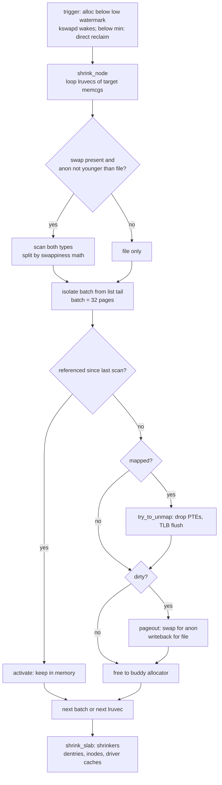
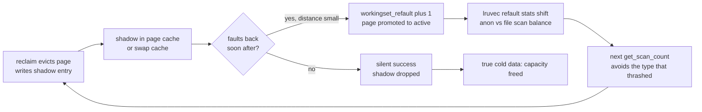
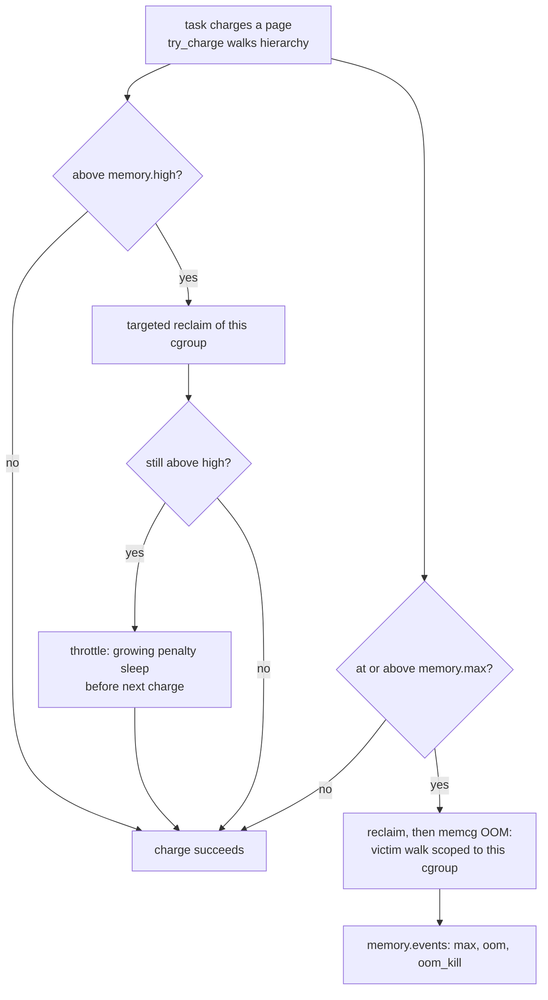

# Page Reclaim Internals: LRU Lists, Watermarks, and Refault Distance

## Overview

Page reclaim is the closed-loop control system that decides which pages leave memory when demand exceeds supply — and modern kernels made every layer of it measurable: watermarks trigger it, `lruvec`s order it, swappiness math splits it between anonymous and file memory, and refault distance tells the kernel when it guessed wrong. This page dissects those internals on the classic active/inactive machinery that most distros still run alongside MGLRU, because interview questions at the "explain kswapd" level assume you can do the watermark and swappiness arithmetic, not just name the lists.

> **Interview one-liner:** "Reclaim runs from two entry points — kswapd below the low watermark, direct reclaim below min — scans per-node-per-memcg `lruvec`s split by anon/file, sizes the scan as list size shifted by priority, splits anon-vs-file with the swappiness formula, and learns from mistakes through shadow-entry refault distances: if an evicted page comes back after fewer activations than memory size, reclaim was wrong and it says so via `workingset_refault`."

The MGLRU reorganization of the victim-ordering layer is covered in [Multi-Gen LRU](./mglru.md); the kernel-side command surface in [Reclaim](../../linux/kernel/memory/reclaim.md); and the pressure/monitoring loop that consumes reclaim's output in [PSI and DAMON](./psi-and-damon.md). Here we go one level deeper than either: the math inside `mm/vmscan.c` and `mm/workingset.c`.

## Vocabulary

| Term | Meaning |
|------|---------|
| lruvec | the set of LRU lists for one node × memcg combination — the unit all scan decisions are computed against |
| scan_control (`sc`) | the request descriptor: priority, `nr_to_reclaim`, `may_swap`, `may_writepage`, gfp mask, target memcg |
| priority | 0–12 scan aggressiveness; lists are scanned `size >> priority` per pass, so priority 0 means full scan |
| watermark | per-zone free-page thresholds: min (reserve), low (wake kswapd), high (kswapd stops) |
| shadow entry | one-pointer "ghost" of an evicted page left in the page cache tree, encoding its eviction-time LRU age |
| refault distance | activations observed between a page's eviction and its refault — how far in the past the mistake was |
| shrinker | registered callback pair (`count_objects`/`scan_objects`) by which slab caches donate objects to reclaim |
| folio | variable-size page unit; since 5.16+ reclaim operates on folios, so a THP is one reclaim unit || kcompactd | per-node compaction daemon; partner of kswapd for high-order demand |


## The Reclaim Stack

Two entry points feed one engine. **kswapd** — one per NUMA node — wakes when a zone's free pages cross the low watermark and reclaims until the high watermark, asynchronously, never blocking allocators. **Direct reclaim** runs synchronously inside `__alloc_pages_slowpath()` when an allocation cannot proceed above the min watermark: the allocating task itself scans, pays writeback latency, and only then retries the allocation. A third consumer, per-memcg charging, runs the same engine scoped to one cgroup when `memory.max` is hit. Everything funnels into `shrink_node()`, which iterates the target memcgs' `lruvec`s (page reclaim) and then calls `shrink_slab()` (shrinker-driven kernel object reclaim).



The engine is quota-driven: `sc->priority` starts at 12 and each reclaim round halving free progress increments aggressiveness, so the per-list target is `lru_size >> priority` — at priority 12 a 1-million-page list scans 244 pages per pass, and by priority 0 the entire list is eligible. Unsuccessful rounds also degrade behavior in documented steps: below priority 10 the scan may ignore swappiness protections, and writing pages out is enabled/disabled based on `may_writepage` and whether the zone's dirty balance is healthy. This "scan less, then harder" schedule is why a mild pressure event is cheap and a hopeless one burns the whole list repeatedly.

## kswapd in Detail: balance_pgdat

Each NUMA node runs one `kswapd` kernel thread with a simple control loop: sleep until woken (allocation crossing low, `wake_all_kswapds` from the slowpath, or compaction helpers), run `balance_pgdat()`, sleep again. `balance_pgdat` walks the node's zones from highest to lowest index, computes which zones sit below their high watermark, and scans at `DEF_PRIORITY = 12`, halving the shift only as rounds fail — the escalation ladder from the section above. Success is defined per zone: once every eligible zone is at or above high (including any watermark boost), kswapd stops scanning and returns to sleep.

Three refinements matter for real systems. kswapd *throttles itself* against PSI when memory pressure is already extreme — waiting for reclaim progress rather than burning CPU against a wall — which is why a truly hopeless machine shows kswapd in D state alongside the allocating tasks. kswapd also integrates compaction: for high-order demand it cooperates with `kcompactd` rather than freeing order-0 pages blindly, since one order-9 hole beats thousands of scattered order-0 ones. And kswapd's work is charged per lruvec, so on a containerized host its CPU time is spread across memcgs proportionally to scan pressure — `ps -o time -p $(pgrep kswapd0)` growing fast is a node-level symptom whose cause is usually attributable per-cgroup via `memory.pressure`.
The wakeup bookkeeping explains kswapd's granularity. Every allocation that crosses low ORs its zone index and allocation order into the pgdat's sleep bookkeeping and wakes the thread; `balance_pgdat` therefore knows both *which zones* hurt and *what order* was needed, letting it skip healthy zones and hand high-order work to compaction-aware paths. This is also why kswapd is per-node: NUMA locality means a socket's allocations pressure its own zones first, and one global reclaimer would either over-reclaim remote nodes or bounce cachelines across the mesh for every list operation.


## LRU Lists and the lruvec

Each `lruvec` — one per node × memcg — holds five lists: inactive anon, active anon, inactive file, active file, and unevictable (mlocked). New pages enter at the tail of the inactive list of their type; the PTE accessed bit (or mark_page_accessed for file reads) promotes to active; when the active list of a type exceeds roughly its inactive counterpart, the reclaimer deactivates from the active tail to keep the working approximation honest. Anonymous pages need swap space before eviction, so the anon path additionally acquires swap slots and performs writeback, while clean file pages can be freed immediately by dropping them — this asymmetry is the root of everything swappiness-related below.

The per-memcg split is the container-era upgrade: because each cgroup owns `lruvec`s on every node, reclaim can be *targeted* — a memcg hitting `memory.max` reclaims only its own pages, and global reclaim visits cgroups proportionally via `mem_cgroup_iter()` with per-cgroup progress tracking. All five lists spin under one `lru_lock` per lruvec, which is why list-move traffic (activation/deactivation storms) shows up as contention on hot nodes. MGLRU keeps the `lruvec` concept but replaces the five lists with generation buckets — see [Multi-Gen LRU](./mglru.md) — yet watermark triggering, scan sizing, and refault accounting described here apply to both engines.

| List | Contents | Reclaim posture |
|------|----------|-----------------|
| inactive anon | cold anonymous pages | swap-out candidates; need swap slots |
| active anon | recently used anonymous pages | protected; deactivated under pressure |
| inactive file | cold page-cache pages | free directly if clean; writeback if dirty |
| active file | recently used page cache | protected; deactivated under pressure |
| unevictable | mlocked / `VM_LOCKED` pages | never scanned; isolation risk |

### What Reclaim Never Touches

A complete model includes the exclusion list, because it bounds what reclaim *can* promise. `mlock()`ed pages (and `MADV_DONTNEED`-protected `VM_LOCKED` mappings) live on the unevictable list and are invisible to scans. Pages pinned by `pin_user_pages()` — GPU DMA buffers, RDMA memory windows, io_uring registered buffers — cannot be reclaimed until unpinned, which is why a leaking device driver behaves like a memory leak reclaim cannot solve. Pages inside cgroups protected by `memory.min` are excluded from scanning entirely. And unreclaimable slab (pinned kernel objects, many driver allocations) is beyond the shrinker contract. The operational consequence: a machine can show 30 GiB used, and have only 2 GiB actually reclaimable — which is exactly the state where watermarks look fine one minute and the OOM killer fires the next (see [GUP](../../linux/kernel/memory/gup.md) for the pinning machinery).

## Watermark Math

Every zone carries three thresholds. **min** is the reserve below which allocations must help themselves (direct reclaim, and eventually the OOM killer); it exists so that critical atomic and GFP_ATOMIC reserves never starve. **low** wakes kswapd; **high** puts it back to sleep. The min watermark is derived from `vm.min_free_kbytes`, whose *default* the kernel computes as \\( 4\\sqrt{\\text{lowmem\\_kbytes}} \\) clamped to [128 KiB, 64 MiB] — on a 16 GiB box that is \\( 4\\sqrt{16{,}777{,}216} \\approx 16{,}384 \\) KiB, i.e., 16 MiB, distributed across zones proportionally to their size. That value then propagates upward: `min_free_kbytes` is the single dial that moves the whole watermark ladder, which is why raising it is the standard fix for "kswapd engages too late."
Worked split: on the 16 GiB single-node example, suppose DMA32 manages 3 GiB and Normal 13 GiB; the 16 MiB min pool divides proportionally, roughly 3 MiB and 13 MiB. If the min watermark for Normal is 13 MiB and the scale-factor gap works out to 0.1% of 13 GiB (~13 MiB), low sits near 26 MiB free and high near 39 MiB — kswapd wakes at 26 MiB and must free ~13 MiB before sleeping. On a 1 TiB machine the same scale factor yields a ~1 GiB gap, which is exactly why the knob exists: fixed fractions left big servers waking kswapd far too late.


The gaps between watermarks used to be fixed fractions (low = min + min/4, high = min + min/2), which under-served big-memory machines: 0.25×min of headroom meant kswapd woke late and then reclaimed in frantic bursts. Since 4.6, `vm.watermark_scale_factor` (default 10, i.e., 0.1% of managed pages) sizes the kswapd gap proportional to zone size, with a floor relative to min for small zones; low and high sit one gap each above min. Raising it to 125 on a large-latency-sensitive host makes kswapd start earlier and free more per burst, trading background CPU for smoother allocation latency.

| Knob | Default | Effect |
|------|---------|--------|
| `vm.min_free_kbytes` | \\( 4\\sqrt{\\text{lowmem\\_kbytes}} \\), clamped [128 KiB, 64 MiB] | moves min, and thereby low/high, for all zones |
| `vm.watermark_scale_factor` | 10 (0.1% of managed pages) | kswapd wake-up gap: earlier wake = smoother latency, more kswapd CPU |
| `vm.watermark_boost_factor` | 15000 (150%) | temporary watermark boost after failed high-order compaction |
| `vm.zone_reclaim_mode` | 0 | NUMA: whether local-node reclaim precedes remote allocation |

`watermark_boost_factor` (5.0) addresses a compaction-era pathology: when an order-N allocation (typically THP) needs compaction and the zone cannot provide a contiguous block, the freshly freed pages get immediately re-scattered by concurrent allocators, and compaction retries in a loop. The kernel therefore *boosts* the zone's watermarks by up to the factor (150% of the watermark distance by default) for one kswapd cycle, forcing kswapd to free a burst of pages beyond high so compaction finds contiguous pageblocks; the boost clears afterwards. If you see THP allocation stalls with kswapd cycles that free "too much," this mechanism is the reason — and `watermark_boost_factor = 0` is the common tuning on machines that prefer THP disabled anyway.

## Swappiness Math

`get_scan_count()` converts `vm.swappiness` into a per-type scan split with one line of arithmetic. Let `anon` and `file` be the current page counts of both types in the lruvec, and `MAX_SWAPPINESS = 200` (the range was widened from 0–100 to 0–200 in 5.8):

\\[ ap = \\text{swappiness} \\times (anon + 1), \\qquad fp = (200 - \\text{swappiness}) \\times (file + 1) \\]

The fraction of scan pressure on anonymous pages is then \\( ap/(ap+fp) \\), scaled per pass by the `>> priority` sizing. At the default 60, file pages are weighted 140:60 — reclaim prefers file roughly 70/30 *by relative size*, not absolutely, so a memcg that is 95% anonymous still gets scanned mostly there. Special cases override the formula in order: no swap (or `may_swap` clear, e.g., `memory.swap.max` exhausted) means file-only; `swappiness == 0` means file-only unless the system is dangerously low; a nearly empty file list forces anon regardless. The lruvec's `anon_cost`/`file_cost` fields additionally inflate the effective size of a type whose pages are expensive to reclaim, damping oscillation.

Interview questions love the boundary values, and the arithmetic explains them: `swappiness = 0` does not mean "never swap" — it means "scan anon only under extreme force," and any system-wide pressure event will still swap. `swappiness = 100` is *not* "equal to file" post-5.8; it weights anon 100 vs file 100 plus the +1 terms — equal, yes, but the ceiling extends to 200 for aggressively pro-swap workloads (zram devices typically run 100–200). Per-memcg override (`memory.swappiness` on v1; `memory.swap.max` interplay on v2) lets mixed workloads coexist: databases pin to low swappiness while batch containers absorb pressure. The modern replacement — MGLRU comparing `min_seq[]` across types and refault percentages per tier — removes the constant entirely, but the interview answer must still be able to do the classic math.
Three worked scenarios pin the formula to numbers (page counts in thousands of 4 KiB pages):

| Scenario | anon | file | swappiness | ap = s·(anon+1) | fp = (200−s)·(file+1) | anon scan share |
|----------|------|------|------------|-----------------|------------------------|-----------------|
| balanced web host | 524k | 524k | 60 | 31.5M | 73.4M | 30% |
| file-cache-heavy DB | 524k | 1572k | 60 | 31.5M | 220.1M | 12.5% |
| zram box | 524k | 524k | 180 | 94.4M | 10.5M | 90% |

Note how scenario 2 does *not* mean "scan file 87.5% more" in absolute terms — the shares multiply the `>> priority` sized batches of each list, and the +1 terms only matter at near-empty list sizes where they prevent divide-by-zero pathologies. Scenario 3 is the standard zram profile: with compressed swap, anon pages are cheap to reclaim (no device I/O), so a high swappiness shifts pressure toward them deliberately.


## Refault Distance and Eviction Shadows

When a page is evicted, reclaim leaves a **shadow entry** in the page cache's XArray: one pointer-sized word encoding the page's age at eviction — not the page's data, just its "ghost." (Anonymous pages gained the same treatment later through the swap path, so modern kernels keep separate anon and file refault statistics per lruvec.) The age is recorded on a global counter of activations; on refault, `mm/workingset.c` computes the **refault distance** as the counter's advance between eviction and refault, i.e., the number of pages that were activated in the interim. The comparison that follows is the whole trick: if the refault distance is *smaller than the memory the page could have occupied* — the sum of active and inactive evictable pages — then under a perfect LRU the page would still have been resident. Evicting it was a mistake, so `workingset_refault` increments and the returning page is promoted to the active list (`workingset_activate`).

This gives reclaim a *ground-truth* error signal that no heuristic can fake. Heuristics (referenced bits, active/inactive ratios) describe what the reclaimer believed; refault distance measures what actually happened, at one word of metadata per evicted page and zero cost on the healthy path. The signal feeds back in three places: `get_scan_count()` reads per-lruvec refault statistics to shift the anon/file balance toward the type that is not thrashing; MGLRU uses per-tier refault percentages as its type tie-break and PID controller input; and userspace sees the same counter via `/proc/vmstat`, which is how capacity planners distinguish "cache miss" from "reclaim mistake" (see [Working Set Model](../virtual-memory/working-set.md) for the theory this implements).

| Counter | Meaning | Healthy reading |
|---------|---------|-----------------|
| `workingset_refault` | evicted pages that returned while still "hot" by distance | near-zero drift on well-sized systems |
| `workingset_activate` | refaulted pages promoted to active | follows refault; large values mean churn |
| `workingset_restore` | pages restored to their previous active position | spiky on workload phase changes |
| `pgscan_*` / `pgsteal_*` | pages scanned vs reclaimed, by kswapd/direct | `pgsteal/pgscan` ratio near 1 = efficient scans |

The loop closes as a control system, and drawing it is often the interview exercise itself:



Two properties make this loop trustworthy where heuristics fail. It is *self-limiting*: a page refaulted from far in the past (distance beyond memory size) counts as a genuine miss, not a reclaim mistake, so phase changes do not poison the signal. And it is *cheap where it matters*: the healthy path stores and drops one word, and only actual mistakes pay the accounting — the same measure-before-policy philosophy the PSI/DAMON layer implements at system scale.
Make the distance concrete with a four-line derivation. Say the global activation counter was at 100,000,000 when an index page was evicted, and the refault arrives when the counter reads 100,250,000: 250,000 activations happened in between. If the node held about 1,000,000 evictable pages, then 250,000 < 1,000,000 — a perfect LRU would have kept the page, so this is a workingset refault. If instead the counter had advanced by 3,000,000 activations, the page would have been gone under optimal LRU too, and the refault is an honest cache miss that should not alarm the scan balance.


## Worked Example: Refault-Driven Thrashing

Consider a container pinned with `memory.max = 4 GiB` running a service with a 3 GiB JVM heap (mostly hot anonymous pages) plus a 1.5 GiB on-disk index file re-scanned every 30 seconds. At steady state the cgroup holds ~3 GiB anon and ~1 GiB file cache; every allocation beyond that triggers targeted reclaim inside the cgroup. The scan balance with default swappiness 60 computes \\( ap = 60(3G+1) \\) against \\( fp = 140(1G+1) \\) — roughly 30% of pressure on anon — so kswapd swaps out cold heap pages *and* evicts index file pages, since the file list is the smaller, easier target.

Thirty seconds later the scan walks the index again and refaults its 1 GiB. Work the refault math: suppose 250,000 pages were activated between eviction and refault, while the cgroup held ~1,000,000 evictable pages. The distance (250,000) is far below the residency bound (1,000,000), so the kernel classifies the whole return as `workingset_refault` — reclaim evicted provably-live data. Worse, refaulting allocates those pages again, pushing the cgroup over `memory.max` again, which triggers reclaim that evicts *more* index pages and heap pages: a closed loop where each pass does ~1 GiB of storage I/O (at 2 GB/s device speed, half a second of pure I/O per cycle, before decompression and TLB effects) while PSI `memory full` climbs.

The instrumentation tells the story in order of escalation: `memory.events` `max` counter increments per limit hit; `/proc/vmstat` `workingset_refault` grows by ~260,000 per 30-second cycle; per-cgroup `memory.pressure` reports `full avg10` in the tens of percent; direct-reclaim tracepoints show the scanning task sleeping on swap I/O. Fixes map to the diagnosis: raising `memory.max` or dropping the JVM heap restores headroom; `memory.high = 3.5G` would have throttled allocations *before* the thrash regime; proactive `memory.reclaim` on a schedule sheds cold pages at a controlled time; and PSI triggers feeding systemd-oomd kill the cgroup if operators decide the working set simply does not fit (see [Thrashing](../virtual-memory/thrashing.md) for the general theory and [PSI and DAMON](./psi-and-damon.md) for the daemon layer)
Verifying a fix closes the loop. After raising `memory.max` to 6.5 GiB, the same four probes should show the causal chain unwind in order: `workingset_refault` deltas collapse toward zero first (reclaim stops evicting live data), then direct-reclaim tracepoint frequency drops (headroom returns), then `memory.events` `max` stops incrementing, and finally `memory.pressure` `full` decays as the queued work drains. If pressure falls but refaults stay high, the workload itself exceeds memory — a capacity problem, not a configuration problem, and the next conversation is about the working set, not the kernel.
.

## Shrinkers: Reclaiming Kernel Objects

Page reclaim is not the only donor. Kernel subsystems register **shrinkers** — callback pairs `count_objects()` and `scan_objects()` — and `shrink_slab()` consults them every reclaim round. The contract is precise: `scan_objects` receives a `shrink_control` (target memcg, nid, number of objects requested) and must free *up to* that many objects or return `SHRINK_STOP` if it cannot proceed; freeing must be non-sleeping-safe and restartable because shrinkers run under reclaim from arbitrary contexts. The amount each shrinker is asked for scales with the pages scanned that round: a shrinker whose cache holds `freeable` objects contributes roughly `freeable × (pages_scanned / lru_pages)`-shaped share, adjusted by the `seeks` field — a cost-of-recreation weighting where `DEFAULT_SEEKS` is 2, lower `seeks` means cheaper to rebuild and thus scanned more eagerly, and expensive-to-recreate caches declare higher values to claim protection.

The flags encode the scalability story: `SHRINKER_NUMA_AWARE` makes the scan per-node, and `SHRINKER_MEMCG_AWARE` (with the 5.4-era `shrinker_info` accounting) makes it per-memcg, so a targeted memcg reclaim can shrink only that cgroup's dentries, inodes, and driver caches instead of the global cache. `vm.vfs_cache_pressure` (default 100) is just a multiplier on the dentry/inode shrinkers' share: 50 halves metadata-cache pressure, 500 makes reclaim prefer discarding path and inode caches over page cache. When a "memory leak" turns out to be slab, the diagnosis path is `/proc/slabinfo` growth plus `slab_unreclaimable` in `/proc/meminfo` — shrinkers only return *reclaimable* objects, so unreferenced-but-pinned kernel memory evades this whole layer.
A concrete reading: a busy container host showing 8 GiB of `slab_reclaimable` is normal — that is the dentry/inode cache doing its job, and reclaim can take it back at any time — while the same host showing `slab_unreclaimable` growing under steady load points at a driver or kernel leak that no amount of swappiness tuning will touch.


## THP Interaction

Transparent huge pages change reclaim's unit size from 4 KiB pages to 2 MiB folios (order-9 on x86-64), with second-order effects in every section above. Allocation-side, THP faults need contiguous order-9 blocks, so they invoke compaction and, on failure, watermark boost — the direct cause of THP latency spikes on `always`-mode systems. Reclaim-side, a mapped THP that is only partially referenced cannot be evicted wholesale, so reclaim **splits** it — page-by-page unmapping goes through the *deferred split queue* so the expensive split happens in batches off the hot path — and khugepaged may later re-collapse the pieces, a collapse/split cycle that is pure waste under thrashing. Swap-side, whole-THP swap-out (with a matching swapfile cluster size) keeps one TLB-scale operation per 2 MiB, which is why zram-plus-THP works far better than the sum of its parts.

Since 6.8, multi-size THP (mTHP) offers 64 KiB–1 MiB folios, shrinking the blast radius: a partially-hot 256 KiB folio wastes less memory on split than a 2 MiB one, and the compaction requirement drops from order-9 to order-4..8. The reclaim-visible knobs follow the admin guide: `transparent_hugepage/enabled` (always/madvise/never), per-size `enabled` files under `/sys/kernel/mm/transparent_hugepage/hugepages-*kB/`, and `thp_*` counters in `/proc/vmstat` (`thp_fault_alloc`, `thp_split_page`, `thp_deferred_split_page`). The interview-grade summary: THP trades reclaim granularity for TLB efficiency; under memory pressure that trade flips negative unless the kernel can split cheaply and the workload accesses huge pages densely — which is exactly what mTHP re-balances.

## Per-Cgroup Pressure: memory.high and memory.max

The cgroup v2 memory controller turns reclaim into a *local* control loop. Charging a page walks `try_charge()` up the hierarchy; crossing `memory.high` triggers synchronous targeted reclaim of the charging cgroup plus a throttle: the allocating task accrues a delay penalty that grows with each successive over-high event (exponential-style backoff, on the order of milliseconds to seconds), enforced before its next charge. `memory.high` is therefore the "slow down" boundary — allocations still succeed but the cgroup's progress rate is clamped — and PSI's per-cgroup `memory.pressure` file reports exactly how much stall this throttling produced. Crossing `memory.max` is different: after reclaiming its own pages fails, the cgroup enters **memcg OOM**, where the victim walk is constrained to that cgroup (see [The OOM Killer](./oom-killer.md)), and `memory.events` counters (`max`, `oom`, `oom_kill`) record the escalation.




Two protection files bias the global loop. `memory.min` pages are never reclaimed (hard floor); `memory.low` pages are reclaimed only after everything unprotected — the walk excludes protected amounts when computing each cgroup's fair share of scan pressure. `memory.min` is a loaded weapon: over-committing min guarantees across cgroups can leave the kernel unable to reclaim anything, converting memory pressure straight into OOM kills. The full knob set (`memory.reclaim`, `memory.swap.max`, `memory.oom.group`) and their interactions with oomd are dissected in [Memcg Internals](../../linux/kernel/memory/memcg-internals.md) and [PSI and DAMON](./psi-and-damon.md); for this page the key fact is that every watermark, scan-balance, and refault mechanism described above runs *per lruvec*, so all of it composes per-cgroup with no separate implementation.


## Observing Reclaim on a Live System

```bash
# Watermark state per zone: how close is each zone to min/low/high?
grep -A14 'zone Normal' /proc/zoneinfo | grep -E 'pages free|min:|low:|high:'

# Reclaim throughput and efficiency: scans vs steals, kswapd vs direct
grep -E 'pgscan_|pgsteal_' /proc/vmstat
# pgsteal_kswapd / pgscan_kswapd near 1 = efficient; direct share high = latency

# The reclaim mistake counter: drift here means the working set does not fit
grep -E 'workingset_refault|workingset_activate' /proc/vmstat

# kswapd CPU: fast growth = chronic underprovisioning
ps -o pid,comm,time -C kswapd0

# The user-visible cost of all of the above:
cat /proc/pressure/memory

# Latency attribution: direct reclaim duration histogram via bpftrace
bpftrace -e 'tracepoint:vmscan:mm_vmscan_direct_reclaim_begin { @t[tid] = nsecs; }
             tracepoint:vmscan:mm_vmscan_direct_reclaim_end
             /@t[tid]/ { @us = hist((nsecs - @t[tid]) / 1000); delete(@t[tid]); }'
```

The reading order mirrors causality. First, watermarks: which zone, how far below low. Second, shares: `pgscan_direct` dominating `pgscan_kswapd` means applications are paying reclaim synchronously — the classic latency SLO killer. Third, efficiency: a low `pgsteal/pgscan` ratio means scans burn CPU on pages that cannot be freed (unevictable, pinned, referenced), pointing at the exclusion list rather than at tunables. Fourth, mistakes: `workingset_refault` drift is the budget line saying whether the fits and shoves above actually hurt the workload — zero drift under steady pressure is a healthy cache, rising drift is thrash in progress.

## Common Mistakes

1. **Reading `swappiness` as a swap probability.** It is one term in the \\( ap/(ap+fp) \\) scan-split formula; `swappiness = 0` still swaps under force, and post-5.8 the maximum is 200, not 100.
2. **Believing kswapd target is "free memory."** kswapd balances zones to the *high watermark*, and with `watermark_boost` it may deliberately overshoot to service compaction; observing "kswapd freed more than needed" is the boost working.
3. **Ignoring refault counters when tuning.** Any tuning that lowers `pgscan` but raises `workingset_refault` traded CPU for real mistakes — the working set no longer fits, and the latency bill arrives via PSI.
4. **Treating `memory.high` throttling as reclaim cost only.** The penalty sleep is *scheduler* delay charged to the allocating task; a badly set `memory.high` can starve a service that would have been fine reclaiming harder.
5. **Assuming THP always helps.** Under pressure, split/collapse cycles and order-9 compaction can dominate; the honest answer weighs TLB savings against reclaim-unit granularity, which is why mTHP (6.8) exists.
5. **Raising `min_free_kbytes` without a reason.** Every byte above min is a byte reserved away from the page cache and anon memory; raising it trades capacity for earlier kswapd wakeups. Raise it for latency evidence (direct reclaim stalls), verify with the watermark and tracepoint readings above, and revert when the symptom disappears.


## Interview Questions

1. **Walk through what happens when free memory crosses the low watermark.** The allocation that crossed it wakes the node's kswapd and proceeds; kswapd runs `balance_pgdat()`, scanning each zone's lruvecs at decreasing priority until the high watermark is restored, then sleeps. If demand outpaces kswapd and free drops below min, the allocating task enters direct reclaim — synchronous scanning, writeback, and compaction inside its own allocation path — which is where user-visible latency spikes come from. Below min with no progress, the slowpath escalates: boost watermarks, compact, retry, and ultimately invoke the OOM killer. The watermark ladder is the *scheduling* of these escalating costs.
2. **Derive what default swappiness 60 means for a lruvec with 2 GiB anon and 2 GiB file.** With `MAX_SWAPPINESS = 200`: \\( ap = 60(2G+1) \\), \\( fp = 140(2G+1) \\), so file pages get 140/200 ≈ 70% of scan pressure and anon 30% — equal-size lists are not scanned equally. If the file list were 0.5 GiB and anon 3.5 GiB, \\( ap = 60(3.5G) \\) vs \\( fp = 140(0.5G) \\) ≈ 3:1 against anon, so scan pressure still lands mostly on file despite its smaller size — until special cases kick in (no swap, swappiness 0, or a nearly empty file list force anon). Also note the 5.8 range change: 100 is now the midpoint, 200 the pro-swap ceiling.
3. **Explain refault distance and why one pointer per evicted page is worth it.** At eviction, reclaim leaves a shadow entry in the page cache XArray encoding the page's activation-epoch age; on refault, the distance is the epochs advanced since eviction — essentially the number of pages activated in between. If that distance is smaller than the resident evictable set, a perfect LRU would have kept the page, so the eviction was provably wrong: `workingset_refault` increments and the page is promoted. One word of metadata buys a ground-truth error signal per eviction, feeding the anon/file scan balance, MGLRU's tier tie-breaks, and userspace capacity analysis — the cheapest closed-loop feedback in the kernel.
4. **Why does a THP-heavy workload stall during reclaim, and what mitigates it?** THP faults need order-9 contiguous blocks, so they drive compaction; when compaction fails, watermark boost makes kswapd overshoot high, briefly freeing bursts — visible as latency spikes. On the eviction side, a partially hot THP cannot be freed whole, so reclaim splits it via the deferred split queue and khugepaged may re-collapse it later, wasting work under churn. Mitigations: `madvise` or `never` mode for latency-sensitive services, mTHP (6.8) to shrink the reclaim unit to 64 KiB–1 MiB, whole-folio swap-out with matching swap cluster size, and reading `thp_split_page`/`compact_stall` counters to confirm the diagnosis.
5. **What exactly does `memory.high` do that `memory.max` does not?** `memory.high` is a soft limit: crossing it triggers targeted reclaim of the charging cgroup *plus a throttle* — the allocating task accrues a backoff penalty (growing with repeated over-high events) before its next charge, so the cgroup's allocation rate is clamped rather than failed. `memory.max` is hard: beyond it, after self-reclaim fails, allocations charge-fail (`ENOMEM`) or the cgroup enters memcg OOM and the kernel kills a victim inside it. Production pattern: set `high` 10–20% below `max` so pressure throttles *before* failure, watch `memory.events` for `max`/`oom_kill`, and use per-cgroup `memory.pressure` to see the stall cost.
6. **How does direct reclaim differ from kswapd reclaim beyond "synchronous vs asynchronous"?** Direct reclaim runs in the allocator's context with its constraints: it inherits the gfp mask (no writing out pages if `__GFP_IO`/`__GFP_FS` are absent), it may not sleep on locks the caller holds, and it must make *forward progress* — the allocation depends on its success. kswapd has no such constraints: it can write back freely, sleep, and target the high watermark with no deadline. Direct reclaim also participates in the retry ladder (reclaim → compact → boost → OOM), while kswapd failures simply leave watermarks low and let demand escalate. This is why tracepoints split `pgscan_kswapd` and `pgscan_direct` — direct-reclaim dominance is the classic "latency under pressure" smoking gun.

## Key Takeaways

- Two triggers, one engine: kswapd (low→high watermark, background) and direct reclaim (min watermark, in-context, latency-critical) both funnel into `shrink_node()` over per-node-per-memcg lruvecs.
- Scan sizing is `lru_size >> priority` with priority sliding 12→0; escalating failure steps in documented, observable order.
- Watermarks: min from `min_free_kbytes` (\\( 4\\sqrt{\\text{lowmem}} \\) default, 16 MiB at 16 GiB), gaps scaled by `watermark_scale_factor` (0.1% default), plus `watermark_boost_factor` (150%) after failed high-order compaction.
- Swappiness is arithmetic: \\( ap = s(anon+1) \\), \\( fp = (200-s)(file+1) \\) since 5.8; default 60 favors file ~70/30 by relative size, with hard overrides for no-swap and empty-file cases.
- Shadow entries record eviction-time age; refault distance smaller than the resident set means reclaim evicted live data — `workingset_refault` is the kernel's ground-truth mistake counter.
- Shrinkers donate slab objects per scanned-page share weighted by `seeks`; `vfs_cache_pressure` scales the dentry/inode contributors.
- THP changes the reclaim unit to 2 MiB folios: compaction + boost on allocation, deferred split on eviction, collapse churn under pressure; mTHP (6.8) rebalances the trade.
- `memory.high` throttles with growing penalties; `memory.max` escalates to memcg-scoped OOM; `memory.min`/`low` bias global scan shares — all composed per lruvec with no separate code path.

## References

- Kernel documentation: *Page Reclaim* (`Documentation/mm/page_reclaim.rst`) — <https://docs.kernel.org/mm/page_reclaim.html>
- Kernel documentation: *sysctl /proc/sys/vm* (`min_free_kbytes`, `watermark_scale_factor`, `watermark_boost_factor`, `swappiness`) — <https://docs.kernel.org/admin-guide/sysctl/vm.rst>
- Kernel documentation: *Multi-Gen LRU admin guide* (the modern victim-ordering layer) — <https://docs.kernel.org/admin-guide/mm/multigen_lru.html>
- Kernel documentation: *Transparent Hugepages* admin guide — <https://docs.kernel.org/admin-guide/mm/transhuge.html>
- Kernel documentation: *cgroup v2* (memory controller: high/max/min/low, pressure files) — <https://docs.kernel.org/admin-guide/cgroup-v2.html>
- Kernel documentation: *PSI — Pressure Stall Information* — <https://docs.kernel.org/accounting/psi.html>
- LWN: *Better active/inactive list balancing* (2012, the split-LRU era this page's math comes from) — <https://lwn.net/Articles/495543/>
- Kernel source: `mm/vmscan.c` (get_scan_count, shrink_node, kswapd) — <https://elixir.bootlin.com/linux/latest/source/mm/vmscan.c>
- Kernel source: `mm/workingset.c` (shadow entries, refault distance) — <https://elixir.bootlin.com/linux/latest/source/mm/workingset.c>

## Cross-References

- [Multi-Gen LRU](./mglru.md) — the 6.1 reorganization of the victim-ordering layer this page's machinery feeds
- [PSI and DAMON](./psi-and-damon.md) — how stall metrics and access monitoring close the loop around reclaim
- [Reclaim](../../linux/kernel/memory/reclaim.md) — the kernel-side command surface: sysctls, tracepoints, zram/zswap
- [Working Set Model](../virtual-memory/working-set.md) — the theory behind refault distance and `min_ttl_ms`-style protection
- [Thrashing](../virtual-memory/thrashing.md) — the failure mode the worked example walks through
- [Memcg Internals](../../linux/kernel/memory/memcg-internals.md) — per-cgroup accounting behind `memory.high`/`memory.max`
- [Swap](../../linux/kernel/memory/swap.md) — the anonymous-page destination and its interaction with swappiness
- [THP](../../linux/kernel/memory/thp.md) — huge-page mechanics behind the THP interaction section
