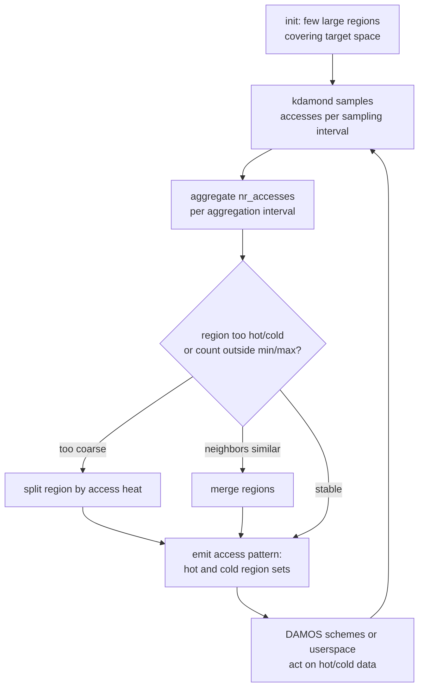
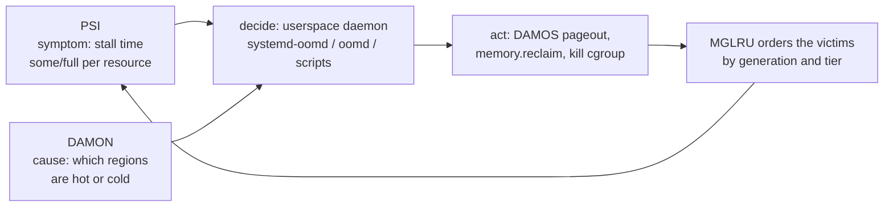

# PSI and DAMON: Monitoring-Driven Resource Management

## Overview

Modern Linux memory management is built on a feedback loop: measure the harm (PSI, kernel 4.20), locate the cause (DAMON, kernel 5.15), act before disaster (DAMOS schemes, `memory.reclaim`, userspace OOM daemons), and measure again. PSI — Pressure Stall Information — reports the wall-clock time tasks spend *stalled* on CPU, memory, or I/O; DAMON — Data Access MONitor — reports which address ranges are actually hot or cold, at bounded overhead. Together they replaced "watch MemAvailable and hope" with measured, closed-loop resource management.

> **Interview one-liner:** "PSI measures lost time — the fraction of time tasks were stalled per resource, with some/full granularity and push-based triggers; DAMON measures access patterns with adaptive regions so the kernel and userspace can act on cold data before the OOM killer becomes relevant."

This page focuses on the *management loop*: pressure files, userspace OOM daemons, proactive-reclaim knobs, and DAMON/DAMOS. The bit-level PSI accounting pipeline is dissected in the deep-dive page [PSI: Pressure Stall Information](../advanced/psi-pressure-stall-information.md), and the operations cookbook lives in [PSI operations](../../linux/kernel/processes/psi.md).

## PSI in One Screen

PSI distinguishes two severities of stall per resource, and this vocabulary appears in every modern tool:

| Resource | `some` = at least one task stalled | `full` = all non-idle tasks stalled | Note |
|----------|-----------------------------------|-------------------------------------|------|
| cpu | runnable but waiting for a CPU | undefined at system scope; reported as 0.00 since v5.13 | `cpu some` high on a packed batch box can be healthy |
| memory | blocked in reclaim or compaction | nothing useful can run — the kernel-doc definition of thrashing | the OOM-daemon signal |
| io | in iowait | every non-idle task waiting on I/O | correlates with, but is not identical to, vmstat `wa` |

The interface is three files — `/proc/pressure/cpu`, `/proc/pressure/memory`, `/proc/pressure/io` — each with two lines:

```text
some avg10=0.12 avg60=0.05 avg300=0.01 total=41234567
full avg10=0.00 avg60=0.00 avg300=0.00 total=0
```

`avg10/60/300` are the percentage of the last 10/60/300 seconds spent in the stall state; `total` is cumulative stall in microseconds since boot, which catches sub-window spikes the averages smooth away. A process can also register a **trigger** — write `"some 150000 1000000"` to the pressure file and `poll()` the descriptor — and get woken when stall accumulates past the threshold inside a window, rather than polling.

## How Stalls Are Tracked

PSI does not sample: it observes every scheduling decision. Each task carries state bits (`TSK_RUNNING`, `TSK_ONCPU`, `TSK_IOWAIT`, `TSK_MEMSTALL`) set and cleared at schedule-out/in and at reclaim entry/exit; from the combination of bits the kernel derives the six stall states (some/full × cpu/memory/io). At each context switch, the elapsed time is charged into the per-CPU, per-cgroup aggregation structure.

The aggregation runs on a **2-second tracking window divided into four 500 ms buckets**; at window boundaries the kernel recomputes stall fractions and feeds the rolling 10s/60s/300s averages. Two design consequences worth quoting in interviews:

- **Averages lag, totals do not.** A 300 ms stall vanishes into `avg10=3.00` but shows exactly in the `total=` delta — latency-sensitive services should alert on totals or triggers, not averages.
- **Triggers are rate-limited** to one wakeup per tracking window (with the growth rate checked ten times per window so fast ramps fire mid-window), and unprivileged windows are bounded below (2 s multiples) to stop trigger storms.

The overhead budget is the reason PSI could ship enabled by default: bit-stamping on context switch plus periodic bucket recompute, rather than per-page or per-syscall accounting.

### Trigger rules worth memorizing

| Rule | Value | Why it exists |
|------|-------|---------------|
| Minimum window | 500 ms (2 s multiples unprivileged) | bounds per-trigger kernel memory and wakeups |
| Maximum window | 10 s | keeps semantics aligned with the tracking window |
| One trigger per open fd | second `write()` fails with `EBUSY` | forces independent polling descriptors |
| Notification rate limit | one wakeup per tracking window | prevents wakeup storms while stalled |
| Minimum arming | one window after firing | avoids flapping at the threshold boundary |

```python
# Registering a PSI trigger: wake me if 150 ms of partial memory stall
# accumulates within any 1 s window, then block on poll().
import os, select
fd = os.open("/proc/pressure/memory", os.O_RDWR | os.O_NONBLOCK)
os.write(fd, b"some 150000 1000000")   # <some|full> <threshold_us> <window_us>
p = select.poll()
p.register(fd, select.POLLPRI)
while True:
    events = p.poll()                    # blocks until threshold crossing
    if events:
        print("memory pressure event -> shed load / snapshot / kill")
```

This is the epoll design pattern applied to resource pressure: the kernel watches, userspace sleeps. Android's `lmkd` registers triggers exactly like this, and oomd builds its rule engine on the same events.

## cgroup v2 Pressure Files

With cgroup v2, the same format is available *per control group*: `cpu.pressure`, `memory.pressure`, and `io.pressure` inside each group's directory. This is what turns a system-wide symptom into an attributable, actionable one — "the container serving traffic is at `memory full` 4%" beats "the host is slow."

Practical rules:

- Inside a container, `/proc/pressure/*` still shows **host-wide** numbers; use the cgroup's own pressure files for a scoped view.
- Pressure files are the input to policy: systemd units expose `ManagedOOMSwap=` and `ManagedOOMMemoryPressure=` (plus `ManagedOOMMemoryPressureLimit=`) so each service can opt into pressure-based killing with its own threshold — see the deep-dive page for the full unit properties.
- The `check-memory-pressure`-style alerting pattern (notify when `memory some` exceeds X% for Y seconds) maps directly onto PSI triggers, which is exactly how Android's `lmkd` consumes pressure events.

## Userspace OOM Daemons

The in-kernel OOM killer fires only after allocation has already failed — swap exhausted, reclaim hopeless — and then kills a heuristic victim under lock. Thrashing starts much earlier: the machine is alive but spending most of its cycles reclaiming. PSI covers precisely that gap, giving daemons seconds to minutes of warning. Three daemons matter:

| Daemon | Signal | Unit of action | Typical deployment |
|--------|--------|----------------|--------------------|
| Kernel OOM killer | allocation failure after reclaim | single process (oom_score heuristic) | last resort, always present |
| systemd-oomd | PSI (memory pressure / swap usage) per cgroup | kills a chosen descendant **cgroup** (SIGKILL) | systemd ≥ v245; opt-in per unit via `ManagedOOM*` |
| oomd (Meta) | PSI triggers, per-cgroup rules engine | cgroup, with configurable kill preferences | large fleets; the reference PSI-native design |
| earlyoom | `/proc/meminfo` MemAvailable + swap; optional PSI (`-p`) | single process, oom_score-based | simple hosts, desktops; no cgroup setup needed |

systemd-oomd was written by systemd developers building on Meta's oomd experience, so the ideas are shared: prefer killing the cgroup whose memory is reclaimable (workingset, swap usage) rather than the biggest RSS, and decide from *pressure over time* rather than a single snapshot. earlyoom is the opposite design point — a tiny daemon that keeps a login session responsive by polling `MemAvailable` (optionally PSI) and killing the worst-scoring process before the kernel OOM killer would; it exists because a wedged box often cannot even run the kernel OOM killer's userspace-visible cleanup.

```ini
# systemd unit opt-in for pressure-based killing (per service):
[Service]
ManagedOOMSwap=kill                      # act on swap exhaustion pressure
ManagedOOMMemoryPressure=kill            # act on memory.some pressure
ManagedOOMMemoryPressureLimit=50%        # override the oomd.conf default threshold
```

```bash
# earlyoom: prefer killing browsers/messengers, protect sshd, use PSI when available
earlyoom -p --prefer '^Web|^slack' --avoid '^sshd|^systemd'
```

A useful interview distinction: **pressure is a better trigger than occupancy.** `MemAvailable` low means "the machine may get slow soon"; `memory full` high means "the machine is losing work *now*." Daemons that act on occupancy (earlyoom by default) trade earlier reaction for more false positives; daemons that act on pressure (oomd, systemd-oomd) act late enough to be right but early enough to matter.

## Proactive Memory Knobs in cgroup v2

PSI tells you there is a problem; cgroup v2 gives you knobs to act *before* the OOM killer:

| File | Effect | When to use |
|------|--------|-------------|
| `memory.max` | hard limit; allocation fails beyond it | hard isolation between tenants |
| `memory.high` | soft limit; allocator throttles reclaim near it | the primary "slow down before failing" knob |
| `memory.reclaim` | write-only; triggers synchronous proactive reclaim (`echo 1G > memory.reclaim`) | shed memory on schedule (scale-down, off-peak) instead of under load |
| `memory.swap.max` | caps swap usage per group | pair with pressure daemons that kill on swap pressure |

Two details that separate senior answers from junior ones. First, `memory.reclaim` can over- or under-reclaim and returns `-EAGAIN` if it could not reclaim the requested amount, and — because proactive reclaim does not indicate pressure — socket-memory balancing is not exercised the way it is under real pressure. Second, there is no `memory.offline`-style knob for removing a cgroup's memory the way CPUs can be offlined; the supported "give memory back" paths are proactive reclaim (`memory.reclaim`), lowering `memory.high`/`memory.max`, and pageout via DAMOS (below). Hotplug memory offlining operates on physical memory blocks, not on cgroups.

## DAMON: Data Access MONitor

PSI says *that* the system hurts; DAMON says *where in memory* the pain comes from. DAMON, merged in 5.15 (work by SeongJae Park), monitors the **access frequency of address ranges** instead of individual pages. The naive approach — check the accessed bit of every page — is O(memory) and defeats itself through cache and TLB pollution. DAMON's core idea is adaptive granularity, governed by five monitoring attributes:

| Attribute | Role | Effect of tuning |
|-----------|------|------------------|
| sampling interval | how often each region's accesses are checked | smaller = finer resolution, more overhead |
| aggregation interval | how long samples accumulate into `nr_accesses` | the access-frequency "shutter speed" |
| update interval | how often scheme/monitoring accounting refreshes | bounds staleness of decisions |
| min number of regions | floor on adaptive-region split (must be ≥ 3) | guarantees resolution at the hot end |
| max number of regions | ceiling on split | the primary overhead cap |

- Monitoring starts from a few large regions covering the target address space.
- Each region's access count (`nr_accesses`) is accumulated over an **aggregation interval** by sampling at the **sampling interval** (the design doc describes the aggregation interval in the 100 ms range, with the sampling interval a small fraction — by default 1/20 — of it; an **update interval** refreshes the scheme's accounting).
- Regions with *uniform* access temperature are split; neighbors with similar temperature are merged, keeping the region count within configured `min`/`max` bounds.
- The result: regions fine-grained where access is interesting, coarse where it is not — monitoring cost tracks the *complexity of the access pattern*, not the size of memory.

A kernel thread (`kdamond`) executes each monitoring context; operation sets cover virtual address spaces (`vaddr`), fixed virtual mappings (`fvaddr`), and physical address ranges (`paddr`, used for whole-system or guest memory). Region adaptation is the overhead-control mechanism that makes DAMON cheap enough to leave on: the design doc notes noise from coarse regions is absorbed by the adaptive adjustment, so tracking every mapping is neither required nor wanted.



## DAMOS: Schemes That Act on What DAMON Sees

DAMON's output becomes policy through **DAMOS** (DAMON-based Operation Schemes, 5.16): a scheme is a *match* plus an *action* plus *quotas*. The match is an access pattern — region size, `nr_accesses` range, and age range; the action is applied to matching regions at the scheme's apply interval:

| DAMOS action | Meaning | Typical use |
|--------------|---------|-------------|
| `willneed` | mark matched regions for MADV_WILLNEED-style promotion | help the reclaimer find hot data |
| `cold` | mark matched regions cold | demote data you expect to reclaim |
| `pageout` | reclaim matched (cold) regions | **proactive reclaim** before pressure exists |
| `hugepage` / `nohugepage` | promote/split THP per region | right-size huge pages from measured behavior |
| `lpu_depriv` | deprivilege hot-page access tracking (later addition) | tune monitoring interaction with LRU |

Quotas bound the cost of a scheme — maximum time and bytes per window, with weights that steer toward older/larger/frequently-accessed victims — and quota **goals** let the scheme self-tune against feedback, including PSI itself: a scheme can target a system-wide `some` memory pressure measured in microseconds (`some_mem_psi_us`), so the amount of proactive paging scales with observed pressure rather than a fixed constant. That DAMOS consumes PSI as its feedback signal is the cleanest single illustration that these subsystems were designed as one loop.

Two in-kernel consumers shipped on top of this machinery: **DAMON_RECLAIM** (5.16) finds cold regions and pages them out under quotas, and **DAMON_LRU_SORT** (6.0) promotes hot regions and demotes cold ones on the LRU lists to make reclaim cheaper. Both are configured through the DAMON sysfs interface under `/sys/kernel/mm/damon/` (modules, contexts, kdamonds, intervals, schemes):

```text
/sys/kernel/mm/damon/admin/kdamonds/<k>/
  contexts/<c>/
    monitoring_intervals: sample_us aggr_us update_us   # adaptive-region loop timing
    schemes/<s>/
      access_pattern/sz/min,max ; nr_accesses/min,max ; age/min,max
      action: pageout
      quotas/metrics: ... some_mem_psi_us ...           # PSI-driven quota goal
```

A scheme like "page out regions with age ≥ 2 aggregation intervals, at most 1 GiB per second, while keeping `memory some` under 5 ms per quota window" is the modern replacement for hand-tuned swappiness — measurement plus bounded action instead of a global heuristic constant.

### Interfaces and a worked observation

DAMON is driven through the sysfs interface under `/sys/kernel/mm/damon/` (kdamonds → contexts → targets/schemes), with the older debugfs interface still available and the `damo` command-line tool wrapping both for ad-hoc use:

| Interface | Path / tool | Typical use |
|-----------|-------------|-------------|
| sysfs | `/sys/kernel/mm/damon/admin/...` | persistent configuration, DAMOS schemes |
| debugfs | `/sys/kernel/debug/damon/` | legacy scripts and quick experiments |
| `damo` CLI | `damo start/record/report/schemes` | profiling: heat maps, wss, scheme evaluation |

A concrete diagnostic that answers a classic interview question ("how do you find a memory leak or an over-sized cache?"): run `damo record` against the suspect process for a few minutes, then `damo report heats` produces a time × address heat map. A leak appears as a region whose *age* grows forever while its `nr_accesses` stays at zero — allocated, never touched, never reclaimable because it is still referenced. A useful cache looks the opposite: moderate `nr_accesses`, resetting age. Idle-page tracking could approximate this at page granularity and high cost; DAMON gives the same answer with a few hundred adaptive regions and kdamond overhead measured in microseconds per interval.

## The Monitoring-Driven Memory Management Loop

The pieces compose into a loop that interviews increasingly ask you to assemble:



| Layer | Question it answers | Consumer |
|-------|--------------------|----------|
| PSI | How much work is being lost, on which resource, in which cgroup? | daemons, triggers, capacity planning |
| DAMON | Which address ranges are actually accessed, how often, for how long? | DAMOS schemes, DAMON_RECLAIM/LRU_SORT, profilers |
| MGLRU | Given pressure, which pages to evict first, cheaply? | kswapd, direct reclaim |
| cgroup knobs | How much should this workload be allowed to keep? | `memory.high`, `memory.reclaim`, swap limits |

The division of labor is the point: PSI is *symptom*, DAMON is *cause*, MGLRU is *policy*, and the cgroup files are *bounds*. When asked "how would you stop a container from thrashing the host?", the strong answer walks all four layers — measure per-cgroup pressure, find the cold regions with DAMON, page them out or bound `memory.high`, and let MGLRU make the eviction order cheap — rather than "increase swappiness."

## Reading PSI on a Live System

```bash
cat /proc/pressure/memory
cat /proc/pressure/cpu
cat /proc/pressure/io
cat /sys/fs/cgroup/myapp/memory.pressure   # per-cgroup view (cgroup v2 mounted)
```

Interpreting combinations is the actual skill:

| Pattern | Reading | Likely next step |
|---------|---------|------------------|
| `cpu some` high, memory/io flat | CPU-saturated batch box; work is progressing | capacity decision, not an incident |
| `memory some` rising, `io some` following | reclaim is paging; thrash may be starting | check per-cgroup memory.pressure for the offender |
| `memory full` > 0 sustained | nothing useful runs; the system is losing work | OOM daemon should already be acting |
| `io some` high alone | storage-bound workload | device-level analysis, not memory |
| all flat, but latency SLOs missed | the stall is not resource-based | locks, scheduling, network — use tracing |

The last row is why PSI belongs in a *stack* of observability tools rather than replacing them: PSI proves resource starvation happened, and tells you which resource, but not why a healthy-looking system is slow.

## Common Mistakes

1. **Treating `cpu some` as an alarm.** On an intentionally packed batch server it is permanently high and healthy; baseline-then-anomaly-detect, and remember `cpu full` is always zero since v5.13.
2. **Alerting on `avg10` alone.** The 10 s average hides 300 ms spikes; use `total=` deltas or triggers for latency-sensitive services.
3. **Reading `/proc/pressure/*` inside a container and calling it the container's.** Those are host-wide numbers; the cgroup's own pressure files are the scoped view.
4. **Confusing proactive reclaim with pressure.** `memory.reclaim` deliberately does *not* signal pressure (no socket-memory balancing), so it is a scheduling tool, not a response to stalls.
5. **Expecting DAMON to replace profilers.** DAMON reports access *frequency of address ranges*; symbol-level CPU profiles and ftrace answer different questions.
6. **Assuming PSI is free.** It is cheap (bit-stamping + bucket recompute) but not zero, which is exactly why `CONFIG_PSI_DEFAULT_DISABLED=y` exists on some distros — check `psi=1` on the cmdline before blaming applications for missing pressure files.

## Interview Questions

1. **What do PSI's `some` and `full` mean, and why does CPU have no meaningful `full`?** `some` is the share of time when at least one non-idle task was stalled on the resource, so work still progresses elsewhere; `full` is when all non-idle tasks were stalled simultaneously, meaning CPU cycles went to waste. For memory and io both lines are meaningful; for cpu, "every non-idle task stalled waiting for a CPU" cannot actually occur at system scope — the accounting itself needs a running CPU — so since v5.13 the kernel reports `cpu full` as a constant 0.00 rather than a meaningless artifact. This distinction matters because `memory full` (not `some`) is the thrashing signal OOM daemons key on.
2. **Why is PSI a better OOM-early-warning signal than MemAvailable?** MemAvailable is an occupancy estimate — how much could be reclaimed under ideal assumptions — and says nothing about whether reclaim is *hurting*. A machine can have low MemAvailable and be perfectly healthy (working set fits), or moderate MemAvailable and be thrashing itself to death with 80% of CPU in reclaim. PSI's `memory full`/`memory some` directly measure lost time, are available per cgroup, and can be consumed as push-based triggers, which is why systemd-oomd and Meta's oomd act on pressure rather than fill level. earlyoom shows the trade-off: it defaults to MemAvailable for simplicity and earlier reaction, accepting more false positives, with PSI as an optional mode.
3. **How does DAMON keep monitoring overhead bounded?** Instead of per-page accessed-bit scans, DAMON monitors adaptive *regions*: it starts with a few large regions, samples accesses per region at the sampling interval, aggregates counts over the aggregation interval, then splits regions with heterogeneous access heat and merges similar neighbors to stay within a configured min/max region count. Monitoring cost therefore follows the complexity of the access pattern — fine-grained where it matters, coarse where nothing is happening — and is executed by a `kdamond` kernel thread using vaddr/fvaddr/paddr operation sets. This is the key design difference from idle-page tracking and from sampling profilers.
4. **What is a DAMOS scheme and how can PSI participate in it?** A DAMOS scheme pairs an access-pattern match (region size, nr_accesses range, age range) with an action — `willneed`, `cold`, `pageout`, `hugepage`, `nohugepage` — applied at the scheme's apply interval. Quotas bound the action's cost (max time/bytes per window, weighting toward old/large/frequent victims), and quota *goals* let the scheme self-tune: one supported goal is system-wide `some` memory PSI in microseconds, so a `pageout` scheme pages out more aggressively exactly when measured pressure rises, and backs off when it does not. DAMON_RECLAIM and DAMON_LRU_SORT are prebuilt in-kernel consumers of exactly this machinery.
5. **What does writing to `memory.reclaim` do, and how is it different from lowering `memory.max`?** `echo 1G > memory.reclaim` triggers synchronous proactive reclaim of up to 1 GiB from that cgroup — the kernel may over- or under-reclaim and returns `-EAGAIN` if it could not meet the request. Lowering `memory.max` changes a *limit*, causing future allocations to fail (or the OOM killer to fire) once reached; `memory.reclaim` changes *current occupancy* without changing the ceiling. Proactive reclaim also does not signal pressure, so socket-memory balancing is skipped — it is for scheduled scale-down and pre-pressure shedding, not a pressure-response tool. There is no per-cgroup "offline" for memory; reclaim plus `memory.high` are the supported paths.
6. **How would you design a memory-management policy for a mixed-criticality host using these pieces?** Partition workloads into cgroups with `memory.high` below `memory.max` so soft pressure throttles before hard failure; enable PSI triggers on the `memory.pressure` files of the latency-critical groups and run systemd-oomd (or oomd) to kill the offending descendant cgroup, not the biggest process; use a DAMOS `pageout` scheme with a PSI quota goal to proactively shed cold pages from batch workloads; and rely on MGLRU so that when reclaim does run, it is ordered by generations/tiers at low kswapd cost. Each layer measures or bounds something different — symptom, cause, victim order, ceiling — so no single knob is doing all the work.

## Key Takeaways

- PSI (4.20) reports per-resource stall time as `some`/`full` percentages over 10/60/300 s plus exact µs totals; cgroup v2 exposes the same per group.
- Internally PSI is bit-stamping at context switch plus a 2 s tracking window (4 × 500 ms buckets) — cheap enough to leave enabled.
- Pressure triggers convert PSI from polling to push: write a threshold+window, `poll()` the fd, get woken at most once per tracking window.
- systemd-oomd (v245+) and oomd kill *cgroups* based on PSI; earlyoom is the simple MemAvailable-based alternative with optional PSI.
- `memory.reclaim` provides synchronous proactive reclaim; `memory.high` throttles; there is no per-cgroup memory offline knob.
- DAMON (5.15) monitors access frequency with adaptive regions, so cost tracks access-pattern complexity, not memory size.
- DAMOS (5.16) turns monitoring into bounded actions (`pageout`, `cold`, `hugepage`, ...) with quotas — and quota goals can consume PSI as feedback.
- The modern loop is: PSI measures harm, DAMON finds the cause, MGLRU orders the victims, cgroup knobs and daemons act.

## References

- Kernel documentation: *PSI — Pressure Stall Information* — <https://docs.kernel.org/accounting/psi.html>
- Kernel documentation: *DAMON: Data Access MONitoring and Access-aware System Operations* — <https://docs.kernel.org/mm/damon/index.html>
- Kernel documentation: *DAMON Design* (adaptive regions, intervals, DAMOS) — <https://docs.kernel.org/mm/damon/design.html>
- Kernel documentation: *DAMON Detailed Usages* (sysfs interface) — <https://docs.kernel.org/admin-guide/mm/damon/usage.html>
- Kernel documentation: *DAMON-based Proactive Reclaim* — <https://docs.kernel.org/admin-guide/mm/damon/reclaim.html>
- Kernel documentation: *DAMON-based LRU-lists Sorting* — <https://docs.kernel.org/admin-guide/mm/damon/lru_sort.html>
- cgroup v2 documentation (memory controller, `memory.reclaim`) — <https://docs.kernel.org/admin-guide/cgroup-v2.html>
- systemd resource control (ManagedOOM* properties) — <https://www.freedesktop.org/software/systemd/man/latest/systemd.resource-control.html>
- oomd — Meta's userspace OOM killer built on PSI — <https://github.com/facebookincubator/oomd>
- earlyoom — early OOM daemon — <https://github.com/rfjakob/earlyoom>
- DAMON project pages — <https://damonitor.github.io/>
- LWN: *Tracking pressure-stall information* (Jonathan Corbet, 2018) — <https://lwn.net/Articles/759781/>

## Cross-References

- [PSI: Pressure Stall Information](../advanced/psi-pressure-stall-information.md) — the accounting-pipeline deep dive: state bits, triggers, worked model
- [PSI operations](../../linux/kernel/processes/psi.md) — commands and recipes for reading and triggering pressure
- [DAMON](../../linux/kernel/memory/damon.md) — kernel-side DAMON walkthrough
- [Memcg Internals](../../linux/kernel/memory/memcg-internals.md) — how per-cgroup accounting behind the pressure files works
- [Multi-Gen LRU](./mglru.md) — the reclaim-ordering policy this loop feeds
- [cgroups](../containers/cgroups.md) — cgroup v2 model the memory controller implements
