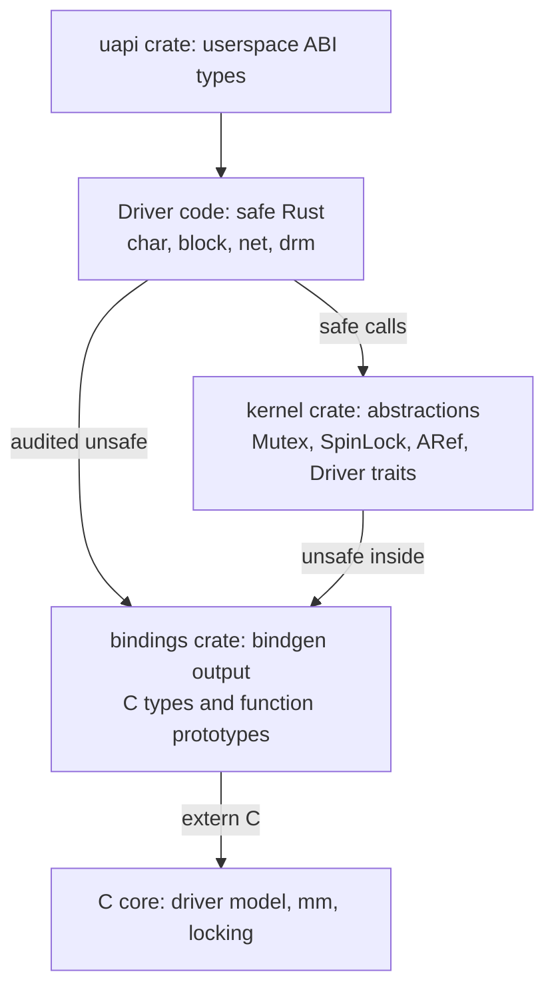
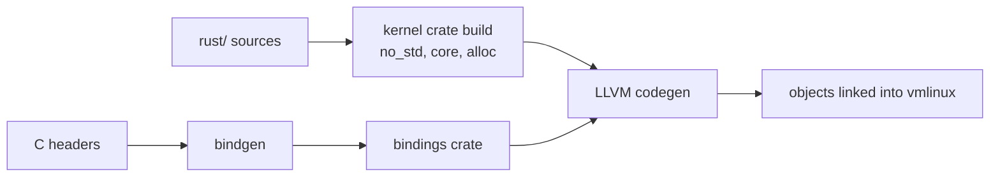
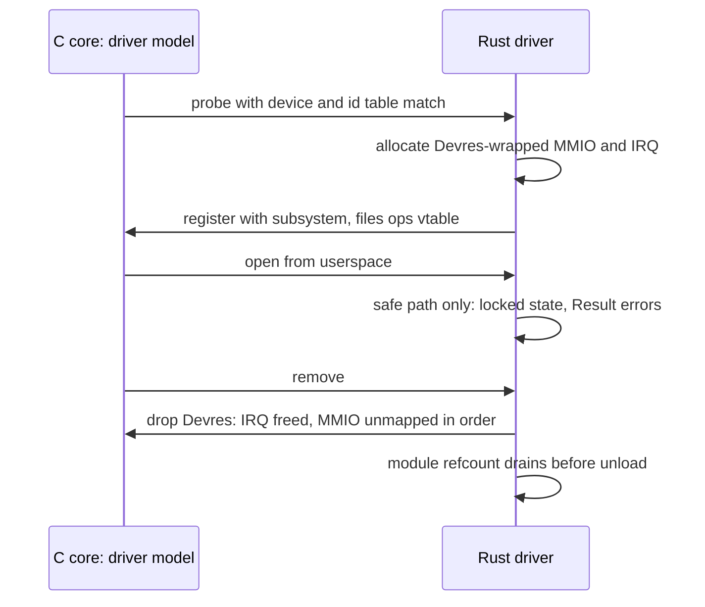

# Rust in the Linux Kernel: Modern Internals

## Overview

Rust support landed in the mainline kernel in 6.1 (December 2022) as an alternative implementation language for drivers and subsystems, and this page covers what that actually means mechanically: the layering from safe driver code down through the `kernel` abstractions crate to bindgen-generated C bindings, what the borrow checker does and does not buy inside a kernel that is still overwhelmingly C, and where adoption stands from Android to the Nova NVIDIA driver (6.15). The security argument is data-driven — memory-safety bugs have been 60–70% of serious CVEs in large C codebases for a decade — but the engineering argument is narrower and more interesting: Rust moves whole bug classes (use-after-free, double-free, data races) from runtime debugging to compile time, at the cost of a second language, a pinned toolchain, and an audited `unsafe` boundary. This is a modern-internals page: versioning, structure, and failure modes, not a Rust tutorial — the language mechanics live in [Ownership in Rust](../../languages/rust/ownership.md) and [Unsafe Rust](../../languages/rust/unsafe-rust.md).

> **Interview one-liner:** "Rust in the kernel is not a rewrite — it is a parallel leaf: safe Rust drivers compile against a hand-written abstractions crate that wraps C APIs behind one reviewed `unsafe` boundary, so use-after-free and data races become compile errors in the driver layer while the C core stays untouched."

## Why the Kernel Let Rust In

The motivating data has been consistent across every large C codebase that published numbers:

| Source | Finding | Era |
|---|---|---|
| Microsoft MSRC | ~70% of CVEs rooted in memory-safety issues | 2019 analysis |
| Chromium | ~70% of serious security bugs are memory safety | 2019 analysis |
| Google / Android | memory-safety share of Android vulns fell 76% → 35% as Rust adoption grew | 2019 → 2022 |
| Android team | zero memory-safety CVEs discovered in Rust code shipped in Android to date | reported annually since |

The Android trajectory is the argument that persuaded kernel maintainers: the decline tracks *new code* written in Rust, not C code being fixed — meaning the effect is prevention, not remediation. Two policy tailwinds accelerated the decision: CISA/NSA guidance naming memory-safe languages, and the 2024 ONCD report recommending memory safety in critical infrastructure. Inside the kernel the argument survived a multi-year review (the 2020–2022 RFC discussions) because the design kept Rust **additive**: no C code changes, no mixed-language linking inside subsystems, drivers opt in leaf-first.

The counter-data belongs in the same conversation, because interviewers probe for one-sidedness: Rust prevents memory-safety bugs, not logic bugs — and logic bugs (races *between* correct locks, wrong error propagation, off-by-one protocols) are still fully possible in safe code. The strongest honest framing is that Rust buys a large, well-measured reduction on the single biggest bug class, at a known adoption cost, in the part of the kernel where new code and attacker input actually meet.

## The Layering: Driver → Abstractions → Bindings → C



The load-bearing idea is the **single audited `unsafe` boundary**. The `kernel` crate (under `rust/kernel/`) reimplements *abstractions*, not algorithms: a `Mutex<T>` wraps the C `mutex` and — critically — couples it to the data it protects via generics, so the compiler enforces "locked before accessed" at the type level. The `bindings` crate is mostly generated by bindgen from C headers; driver authors are expected to write safe code against `kernel::`, and every direct touch of `bindings` is reviewable `unsafe` concentrated in one layer. A minimal char-device driver shows the shape (APIs drift between kernel versions — read this as structure, not a stable contract):

```rust
use kernel::prelude::*;
use kernel::{c_str, file};

struct RustChrdev;

#[vtable]
impl file::Operations for RustChrdev {
    fn open(_data: &(), _file: &file::File) -> Result {
        pr_info!("opened from Rust\n");
        Ok(())
    }
}

module! {
    type: RustChrdev,
    name: "rust_chrdev",
    author: "example",
    license: "GPL",
}
```

Compare with [Kernel Modules](../../linux/kernel/modules.md): same registration story, same licensing, same module lifecycle — but `struct` + `#[vtable]` + `module!` replaces `file_operations` structs and macro-driven boilerplate, and forgetting to set a callback is a compile error rather than an oops at first open.

### The C Side's Obligations

The layering contract runs both ways. C subsystems that accept Rust drivers must keep their APIs bindgen-friendly: stable headers, no macro-impossible-to-parse interfaces, documented locking expectations (because the Rust wrapper must *encode* them in types). Several C-side cleanups in 6.x — making `struct file_operations` tables addressable, fixing missing doc comments on register/unregister paths — exist specifically because Rust bindings forced the interface to be describable. This is the quiet benefit worth mentioning: the abstractions layer doubles as an API-hygiene audit.

## What the Borrow Checker Buys — and What It Doesn't

### The wins

- **Use-after-free and double-free become type errors**: lifetimes and ownership (`ARef<T>` for refcounted kernel objects like `struct device`) make it impossible to hold a raw pointer past its refcount drop without an explicit `unsafe`
- **Data races become compile errors**: safe Rust has no way to share mutable state across threads without a locking primitive — the kernel's `Mutex<T>`/`SpinLock<T>` tie the lock to the data, which is exactly the discipline C cannot express
- **Error paths force cleanup discipline**: `Result<T>` plus RAII (drop runs on every return path) replaces the goto-cleanup pattern from C drivers, and `?` makes the error propagation explicit in the type signature

A worked comparison makes the compile-time claim concrete. In C, this is a classic oops waiting for the wrong preemption timing; in Rust it is a compile error:

```text
C (compiles, sometimes crashes):
    spin_lock(&lock);
    if (error) { return err; }          // forgot spin_unlock — bug
    spin_unlock(&lock);

Rust (does not compile):
    let guard = lock.lock();
    if error { return Err(err); }       // guard still alive: borrow-checker
                                        // rejects the return? no — it DROPS the
                                        // guard here, which IS the unlock
    drop(guard);
```

Read the Rust half carefully — it is the instructive case: the RAII guard *makes* the early return correct by construction (drop runs on `?` and on every path), whereas the C version needs the goto-cleanup ladder and a reviewer's eye. The remaining risk concentrates in paths where the guard's scope and the hardware's expectation diverge (e.g., you must release a spinlock before an operation that can sleep) — and those constraints are exactly what the abstractions encode as types like `spinlock::Guard` that refuse `.sleep()` calls by construction.

### The costs and gaps

- **`unsafe` does not disappear — it moves**: pinning, C callbacks, and raw allocations live in the abstractions layer, and a bug there is still a kernel bug; the claim is *smaller audited surface*, not zero
- **The borrow checker does not understand the C object model**: objects whose address escapes into C callbacks need `Pin`, and structures the C side mutates need explicit interior-mutability wrappers — the two patterns below
- **Toolchain coupling is real**: the kernel pins specific rustc versions (each release declares a minimum and maximum), because kernel builds must not depend on unstable-language drift

### Pinning and self-referential state

Kernel objects are frequently registered by address: the C side stores a pointer and calls back into it from interrupt context, meaning the object cannot move. Rust's answer is [`Pin`](https://doc.rust-lang.org/std/pin/) — a type that guarantees "this value will not be moved again once pinned," with `pin-init` macros (6.8-era) making construction of pinned structures ergonomic. The interview-relevant phrasing: *C moves objects by accident (realloc, copy); Rust makes movement explicit, so the callback-registration pattern becomes a guarantee instead of a comment*.

### Interior mutability the kernel way

Where C uses global mutable state, kernel Rust uses `Mutex<T>`, `SpinLock<T>`, or lock-free `percpu`-style wrappers — always wrapping the data, never guarding around it. The abstractions integrate with lockdep, so Rust code gets the same lock-order validation as C, plus compile-time checking that the lock is held. The failure mode this eliminates is the classic [Sync Primitives](../advanced/sync-primitives.md) bug: accessing shared state on a path you *believed* was protected.

## The Abstraction Layer Component Map

The `kernel` crate is the project's real product — drivers are thin. Its components, each wrapping a specific C facility:

| Abstraction | Wraps (C side) | Compile-time guarantee added |
|---|---|---|
| `Mutex<T>` / `SpinLock<T>` | mutex/spinlock + lockdep | data access requires held lock |
| `ARef<T>` / `AlwaysRefCounted` | kref-style refcounts | cannot use object after last ref |
| `KBox<T>`, `KVec<T>`, `KString` | krealloc/kfree on slab | allocation failure is `Result`, not NULL |
| `Devres<T>` | managed device resources | resource freed with device, not manually |
| `Pin<T>` + `pin-init` | C address-registration model | registered objects cannot move |
| `platform::Driver`, `file::Operations` | driver model / fops | vtable completeness at compile time |
| `workqueue::Work` | C workqueues | work item outlives the queue entry |
| `dma::CoherentAllocation` | DMA API | lifetime + address space tied together |

Two patterns deserve emphasis. First, `Devres<T>` is the answer to the most common driver bug class — leaking or double-freeing MMIO/IRQ resources on error paths — because it binds resource lifetime to the `struct device` lifetime. Second, the `#[vtable]` macro generates both the C-compatible function-pointer table *and* the compile-time check that all mandatory entries exist, which is the same guarantee C can only get from a reviewer reading the struct initializer.

## The Build System and Toolchain Realities



Constraints worth reciting, because they are the practical objections in any design debate:

- **`CONFIG_RUST`** gates the whole feature; builds require a matching rustc/cargo pair, the `bindgen` CLI, and LLVM-linked tooling — the kernel does *not* use cargo's network or registry model (no crates.io in-tree; vendor your dependencies)
- **`#![no_std]` plus a kernel `alloc`**: Rust's heap allocator is backed by the kernel's own (SLUB via `krealloc`), so [Slab Allocator](../memory/slab-allocator.md) semantics are what Rust allocation gets
- **Pinned toolchains per release**: minimum/maximum rustc versions in `rust/` docs; the C toolchain requirement is far looser, and this asymmetry is the loudest recurring complaint from distro builders
- **gccrs (GCC's Rust front-end) is the escape hatch** being built for toolchain diversity, but LLVM/rustc is the only complete implementation today

## State of Adoption and the Version Timeline

### Driver lifecycle in the Rust model

Before the timeline, the driver lifecycle as the abstractions express it — because every stage maps to a type-level guarantee:



The probe/remove asymmetry is where Rust earns its keep: `Devres` and RAII make the *cleanup* path run the same reviewed code regardless of how many resources were acquired before the failure — the C version of this function is traditionally the buggiest in the file (see [Device Drivers](../io/device-drivers.md) for the C-side lifecycle this wraps).

### Milestones

| Milestone | Kernel | What landed |
|---|---|---|
| RFC discussions | 5.x era | design debate; "Rust will be additive" policy set |
| Core support | **6.1 (2022)** | `rust/` tree: abstractions, examples, docs (~33K lines, mostly abstractions + docs) |
| Driver-model progress | 6.2–6.7 | device/driver abstractions, net abstractions, KUnit integration for doctests |
| Pinned-init | 6.8 | ergonomic construction of pinned kernel objects |
| **Nova** (NVIDIA GPU driver) | **6.15 (2025)** | first major new driver family written in Rust (with the associated DRM/mm abstractions) |
| Android | out-of-tree → in-tree consumers | Binder Rust rewrite work; memory-safety stats above |

Reading the timeline honestly: five years in, Rust has crossed from "experiment" to "accepted for drivers," with one marquee driver (Nova) and heavy industrial users (Android, Asahi's GPU work out-of-tree) — but the C core (scheduler, mm, locking primitives themselves) remains C and will for the foreseeable future. The bottleneck is abstraction throughput: every new driver type needs its C-API wrapper reviewed by people fluent in both languages, and that reviewer pool is the scarcest resource in the project.

## Failure Modes to Cite in Interviews

- **A panicking Rust driver is still a kernel panic** — the abstractions map `panic!` to kernel oops handling; safety from memory bugs is not safety from logic bugs
- **FFI drift**: bindgen regenerates bindings per build; a C header change that alters struct layout compiles fine in Rust until the runtime behavior diverges — the bindings layer needs the same ABI discipline as any C consumer
- **The two-language review gap**: a C maintainer reviewing Rust abstractions is reviewing semantics in a language they may not write; several subsystems have stalled exactly here, which is why adoption is driver-first
- **Unsafe concentration risk**: as more drivers land, pressure mounts to widen the abstractions layer quickly; each added wrapper is new `unsafe` to audit — the security win decays if that layer grows without review depth
- **Toolchain supply chain**: pinned rustc versions mean every kernel release freezes a toolchain; distros shipping LTS kernels must track two toolchain policies, not one
- **Error-message onboarding cost**: borrow-checker diagnostics on kernel-scale generics are hard reads for driver engineers coming from C; the mitigation is the abstractions layer hiding lifetimes — but wrapper authors need real Rust depth, and that skill set is the actual onboarding bottleneck

## Rust, eBPF, and sched_ext: Three Extensibility Bets

The kernel now has three mechanisms for moving logic in without forked trees, and comparing them is a common interview follow-up:

| Mechanism | What runs in kernel | Safety model | Typical use |
|---|---|---|---|
| **Rust drivers** | first-class native code | compile-time (ownership) + reviewed `unsafe` boundary | new device drivers, protocol/file-system components |
| **eBPF** | JIT-compiled, verifier-checked programs | runtime verifier + JIT hardening | tracing, networking hooks, observability |
| **sched_ext** | BPF-loaded scheduler policies | verifier + fallback to EEVDF on misbehavior | experimental CPU scheduling policies |

The distinction worth articulating: eBPF and sched_ext sandbox *at load time* and can reject or preempt misbehaving programs; Rust guarantees safety *at compile time* but the resulting code is a full citizen — a logic bug in a Rust driver can still oops, while a verifier-approved BPF program by construction cannot corrupt kernel memory. Rust trades runtime flexibility for native performance and expressiveness; BPF trades expressiveness for zero-risk extensibility. Production systems routinely combine all three — e.g., a Rust NVMe driver, BPF-based tracing over it, and (experimentally) sched_ext policies tuned per fleet. See [eBPF](../kernel/ebpf.md), [BPF Verifier](../../linux/kernel/bpf-verifier.md), and [sched_ext](./sched-ext.md) for the other two bets.

## Interview Questions

1. **Where exactly does the memory-safety guarantee come from if the kernel is still C?** From the layering: safe Rust cannot express use-after-free or data races, and the *only* way safe driver code touches C is through the `kernel` abstractions crate, whose `unsafe` blocks form a single reviewed boundary. Bugs in the C core remain possible; bugs in the C core *reachable only through safe Rust drivers* are prevented at compile time, because the borrow checker rejects the aliasing/lifetime patterns that create them. The honest formulation: the trust boundary moved from "every driver" to "one abstractions layer plus the C core."
2. **Why does the kernel need `Pin` at all — isn't Rust about moves?** Kernel objects register their address with the C side (interrupt handlers, workqueues, DMA descriptors), so moving them after registration would leave dangling pointers in C-owned state. `Pin` is the type-level guarantee that a value will not move once pinned, letting a Rust object participate in the C callback model without losing ownership tracking. Without it, every struct-escapes-to-C case would be an `unsafe` audit by hand; with it, the invariant is checked per-type.
3. **What did Android's 76% → 35% memory-safety drop actually measure?** The *share of new vulnerabilities* attributed to memory safety across the whole Android codebase, as Rust-written components (Bluetooth stack, crypto modules, UWB, Binder work) shipped from Android 12 onward. The denominator grew while the memory-unsafe numerator grew slower — i.e., prevention at the new-code margin, not remediation of C. It is the strongest field data point for language-level prevention, and the reason kernel maintainers took the proposal seriously.
4. **Would you rewrite the scheduler or mm in Rust?** No — the cost model is wrong there: those subsystems are the most reviewed C in existence, the Rust abstractions required (per-cpu, RCU-heavy patterns) are the hardest to model, and regression risk touches every workload. Rust pays off leaf-first where new code meets attackers: drivers, protocol parsers, filesystems' new components. The interview point is the *marginal* argument — new code, attacker-reachable, historically 60–70% memory-bug-prone — not language loyalty.
5. **What are the real adoption blockers besides ideology?** In rough order: abstraction-layer throughput (each new driver class needs a reviewed C-API wrapper), the pinned-toolchain/build-system burden on distros and CI, the two-language review gap in maintainer communities, and immature edges (gccrs incomplete, some abstractions still evolving). None are permanent; all explain why five years in, the deliverables are one flagship driver and deep Android adoption rather than a mass migration.
6. **How do Rust kernel locks differ from C's?** Semantically they are the same primitives — Rust `Mutex<T>`/`SpinLock<T>` wrap the C implementations and participate in lockdep. The difference is arity: C separates "lock" from "the data it protects," so correctness lives in comments and lockdep's runtime checks; Rust's lock *contains* the data, so accessing it without holding the lock does not compile, and the guard's lifetime ends at scope exit. Runtime validation (deadlock detection) still applies — the compiler adds the static half.
7. **A C subsystem maintainer refuses to keep their header bindgen-compatible — what breaks?** Everything downstream: the bindings crate is generated from headers, so macro-heavy interfaces, function-like macros used as APIs, and undocumented locking contracts either fail generation or produce bindings too dangerous to wrap safely. The failure is *build-time and visible*, which is the point — it surfaces API debt that C-only consumers silently absorb. The productive answer is negotiating interface cleanups, which is why Rust adoption has already improved several C headers for everyone, C users included.

## Key Takeaways

- Rust in the kernel is additive leaf-first: safe drivers → `kernel` abstractions → bindgen `bindings` → untouched C core, with one audited `unsafe` boundary doing all the trust work
- The borrow checker converts use-after-free, double-free, and data races from runtime bugs into compile errors *in the driver layer*; it converts nothing in the C core, and `unsafe` there is still `unsafe`
- `Pin` plus pinned-init is the bridge to the C object model — registered-by-address objects get move-freedom as a type guarantee rather than a convention
- Kernel locks keep lockdep runtime validation and gain compile-time lock/data coupling; error paths get RAII and `Result` instead of goto-cleanup
- Field data drove adoption: Android's memory-safety vuln share fell 76% → 35% as Rust code shipped; MSRC and Chromium report ~70% memory-safety shares in pure-C codebases
- Status: 6.1 (2022) core support → 6.15 (2025) Nova as the first major Rust driver family; Android is the heavy industrial user; the C core stays C
- The binding constraints are human and operational: abstraction review throughput, pinned toolchains, two-language review — not the language's expressiveness
- Compare the three extensibility bets before recommending one: Rust = compile-time safety for native drivers, eBPF = load-time verification for sandboxed programs, sched_ext = verified scheduler policies with automatic fallback

## References

- Kernel documentation, *Rust* (index: general information, coding guidelines, quick-start): <https://docs.kernel.org/rust/>
- Kernel documentation, *Rust — general information* (policy, goals, non-goals): <https://docs.kernel.org/rust/general-information.html>
- The Rust Programming Language, *The Book* (ownership and borrowing fundamentals): <https://doc.rust-lang.org/book/>
- Rust for Linux project site (news, abstraction status, talks): <https://rust-for-linux.com>
- Rust-for-Linux kernel tree mirror (PR history and patch series): <https://github.com/Rust-for-Linux/linux>
- The Rust Standard Library, `std::pin` (pinning semantics behind kernel object registration): <https://doc.rust-lang.org/std/pin/>
- The Rustonomicon (unsafe Rust semantics — the mental model for the abstractions layer): <https://doc.rust-lang.org/nomicon/>
- Google Security Blog, *Memory Safe Languages in Android 13* (76% → 35% trajectory): <https://security.googleblog.com/2022/12/memory-safe-languages-in-android-13.html>
- Microsoft MSRC, *We need a safer systems programming language* (~70% memory-safety CVEs): <https://msrc.microsoft.com/blog/2019/07/we-need-a-safer-systems-programming-language/>
- ONCD (White House), *Back to the Building Blocks* (2024 memory-safety guidance): <https://www.whitehouse.gov/oncd/briefing-room/2024/02/26/technical-report-back-to-the-building-blocks/>
- Kernel documentation, *Kernel modules* (the C-side registration story Rust mirrors): <https://docs.kernel.org/admin-guide/modules.html>
- Kernel source tree (`rust/` layout, `rust/kernel/` abstractions, examples): <https://github.com/torvalds/linux>

## Cross-References

- [Ownership in Rust](../../languages/rust/ownership.md) — the language-level ownership/borrowing model these kernel abstractions rest on
- [Unsafe Rust](../../languages/rust/unsafe-rust.md) — what `unsafe` permits; the audit target inside the abstractions layer
- [Kernel Modules](../../linux/kernel/modules.md) — the C registration/build story the Rust `module!` machinery mirrors
- [Device Drivers](../io/device-drivers.md) — the driver model (probe, bind, file operations) both languages implement against
- [Kernel Architectures](../advanced/kernel-architectures.md) — where a second implementation language fits in monolith/microkernel trade-offs
- [Memory-Corruption Exploitation and Mitigations](../../security/advanced/exploit-mitigations.md) — the runtime mitigation arms race Rust prevents at the source
- [Slab Allocator](../memory/slab-allocator.md) — what backs Rust `alloc` via `krealloc`
- [Sync Primitives](../advanced/sync-primitives.md) — the deadlock/locking theory the Rust lock abstractions enforce statically
- [eBPF](../kernel/ebpf.md) — the verifier-based extensibility path compared against Rust in the three-bets table
- [sched_ext: BPF Schedulers](./sched-ext.md) — the third bet: BPF-loaded CPU policies with runtime fallback to EEVDF
- [Modern Linux Kernel Internals](./README.md) — places Rust, eBPF, and sched_ext in the 2016–2026 kernel-change map
