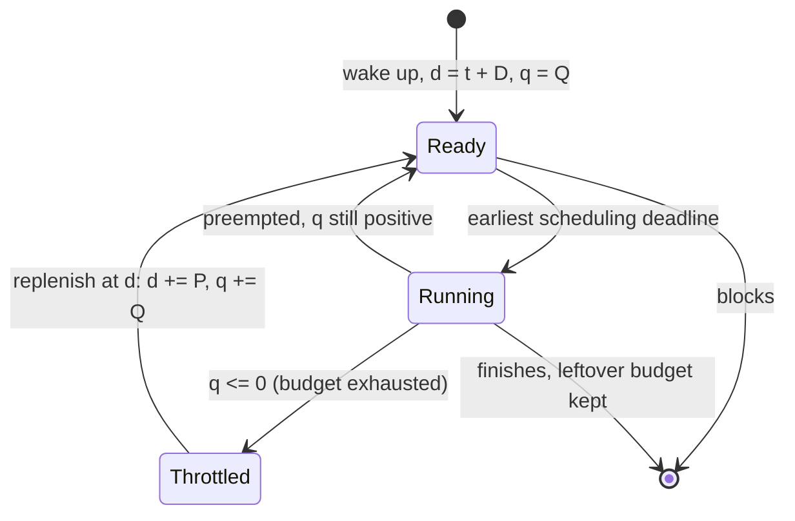
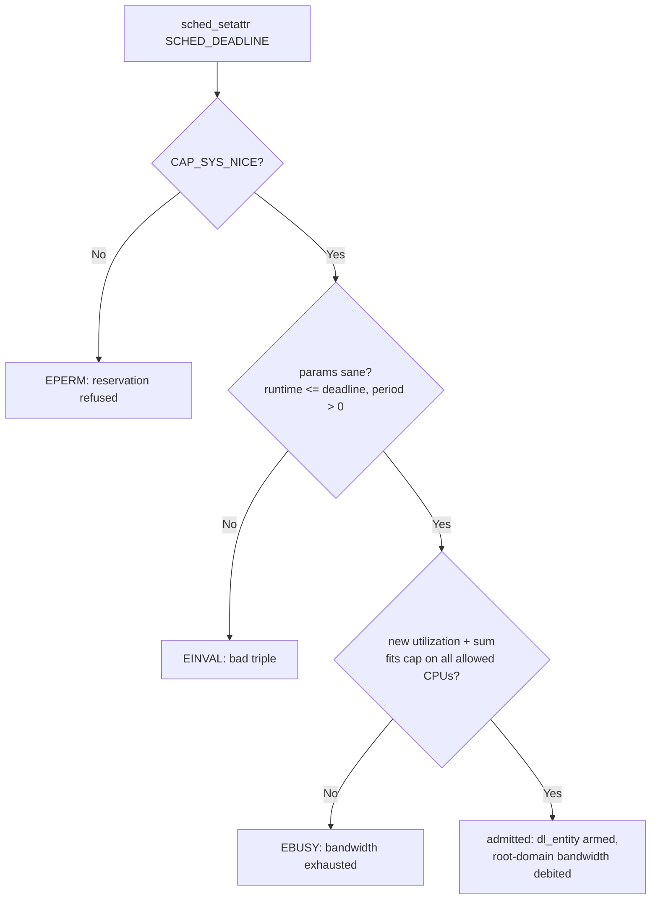

# SCHED_DEADLINE: EDF + CBS in the Linux Kernel

## Overview

SCHED_DEADLINE, merged in Linux 3.14 (2014), is the only Linux scheduling policy that offers *admission-controlled timing guarantees*: each task declares a **runtime / deadline / period** triple, the kernel admits it only if the claimed bandwidth fits, and the CBS (Constant Bandwidth Server) algorithm enforces that no task can consume more than its declared share. Inside the class, tasks are scheduled by EDF — earliest scheduling deadline first — which is optimal for preemptible single-CPU real-time scheduling. Unlike SCHED_FIFO/RR, a misbehaving deadline task is *throttled*, not allowed to monopolize a core. The policy targets periodic, well-modeled workloads — audio processing, control loops, robotics, media pipelines — where "we need this done within X microseconds, every time" is a literal specification rather than a wish.

> **Interview one-liner:** "SCHED_DEADLINE is EDF selection on top of CBS bandwidth reservations: you reserve `runtime` microseconds every `period`, usable within `deadline`; admission control checks the sum of utilizations ≤ 1 per CPU, and CBS throttles overruns instead of letting them hurt other tasks."

The theory behind EDF and rate-monotonic scheduling is covered in [Real-Time Scheduling](../scheduling/realtime.md); the kernel data structures (`struct sched_dl_entity`, `dl_rq`) are in [Deadline Scheduling](../../linux/kernel/processes/deadline-scheduling.md). This page focuses on the math and the guarantees: CBS rules, admission control, bandwidth reclaiming, and the interactions with cgroups, cpusets, and rt-throttling.

## The Task Model: runtime / deadline / period

A deadline task declares three parameters, in microseconds, via `sched_setattr()`:

| Parameter | Symbol | Meaning | Typical audio example |
|-----------|--------|---------|----------------------|
| `sched_runtime` | \\(Q\\) | CPU time consumed per period | 800 µs per buffer fill |
| `sched_deadline` | \\(D\\) | how soon after each release the runtime must be available (relative deadline) | 2,000 µs |
| `sched_period` | \\(P\\) | inter-arrival time between activations | 2,667 µs (128 frames at 48 kHz) |

The guarantee, when admission control passes: every period, the task receives \\(Q\\) microseconds of execution within \\(D\\) of the period's start. Note that \\(D \le P\\) is the common "constrained deadline" case, and the per-task utilization is \\(U_i = Q_i / P_i\\) — the fraction of one CPU the reservation claims.

```c
#include <sched.h>

struct sched_attr attr = {
    .size           = sizeof(attr),
    .sched_policy   = SCHED_DEADLINE,
    .sched_runtime  =   800000,   // 0.8 ms
    .sched_deadline =  2000000,   // 2 ms
    .sched_period   =  2666667,   // 2.667 ms
};
if (sched_setattr(0, &attr, 0) != 0) {
    /* EPERM: need CAP_SYS_NICE, or EBUSY/EXCESS: admission control failed */
}
```

Two details from the interface matter in interviews. First, `sched_setattr()` requires `CAP_SYS_NICE` — this is a privileged reservation, unlike nice values. Second, the optional flag `SCHED_FLAG_DL_OVERRUN` asks the kernel to deliver `SIGXCPU` when the task's runtime overruns, which is how a well-built real-time thread learns that its own budget model is wrong.

## EDF Selection

The deadline class sits above SCHED_FIFO/SCHED_RR in the class stack (stop → deadline → RT → fair → idle), so a runnable deadline task preempts even a priority-99 RT task. Within the class, selection is EDF on the **scheduling deadline**: the absolute time by which the current \\(Q\\) must be served. EDF is optimal for preemptible uniprocessor scheduling — if any algorithm can meet the deadlines of a task set, EDF can — which is why a proportional-share scheme (nice values) or static priorities (FIFO/RR) are not used here.

Practical consequences of EDF ordering: tasks with *shorter* periods (or tighter relative deadlines) naturally win contention, but only when their deadlines are actually near — between releases, a low-bandwidth task with a far deadline never blocks a high-bandwidth task with a near one. This makes the policy self-balancing across task sets in a way static priorities are not; swapping two FIFO priorities changes everything, while adding a deadline task only perturbs others by the admitted bandwidth.

## Inside the Deadline Class

A few implementation facts make the documented behavior concrete (the data structures get their own walkthrough in [Deadline Scheduling](../../linux/kernel/processes/deadline-scheduling.md)):

- Each deadline task carries a `struct sched_dl_entity` — remaining runtime, absolute scheduling deadline, period — and each CPU's `dl_rq` keeps its runnable entities in a red-black tree ordered by scheduling deadline, so pick-next is O(1) at the leftmost node, the same shape CFS used for vruntime.
- Replenishment is timer-driven: when a task is throttled, the kernel arms its `dl_task_timer` hrtimer for the replenishment time, so a throttled task wakes exactly when budget returns rather than on the next tick — sub-millisecond periods work because this is an hrtimer, not a jiffy counter.
- Bandwidth accounting lives on the **root domain** (the set of CPUs spanned by the task's affinity), not per cgroup: each root domain tracks the sum of admitted utilizations, and admission adds to it atomically. This is why affinity/cpuset changes re-run admission (see below) and why unpinning a task can *fail*.
- Utilizations are tracked in fixed-point scaled by \\(2^{20}\\) internally, so tiny reservations (a 10 µs budget in a 1 s period, \\(U \approx 10^{-5}\\)) are representable and round safely.
- The class is *not* an RT priority: a SCHED_DEADLINE task has no 1–99 level and `nice` is meaningless for it. Mixing classes on one core means the deadline task simply preempts everything below the stop class whenever it is runnable and has budget.
- Releasing the CPU intentionally is also modeled: `sched_yield()` discards the remaining budget immediately (the `dl_yielded` flag), so the task returns exactly at its next period instead of burning leftover reservation — a discipline audio engines use to hand slack back deterministically.

One consequence people miss: because the tree is ordered by absolute deadline, a task set's interleaving *changes as deadlines shift* — after a replenishment the task re-inserts with a new key. EDF's bookkeeping is dynamic in a way SCHED_FIFO's fixed priority array is not, which is also why class-wide debugging dumps show per-task deadline/budget state rather than a single priority number.

## The CBS Math

CBS is the *enforcement* half of the policy: it guarantees bandwidth isolation between tasks so that one task's overrun cannot steal another's guarantee. The kernel documents it as a per-task state machine over two values — **remaining runtime** \\(q\\) and **scheduling deadline** \\(d\\):

- **Wake-up / new reservation.** When the task wakes, CBS checks whether the available budget matches the expected instantaneous utilization:

\\[
\frac{q}{d - t} > \frac{Q}{P}
\\]

  If \\(d < t\\) (deadline already passed) or this inequality holds, the reservation is re-initialized: \\(d = t + D\\), \\(q = Q\\). Otherwise the existing reservation continues, so a task that sleeps mid-period keeps its leftover budget.
- **Accounting.** While running, \\(q\\) decreases by the time consumed (at ticks and at preemption points).
- **Throttling.** When \\(q \le 0\\), the task is *throttled* (depleted): it cannot be scheduled until \\(d\\), which becomes the replenishment time.
- **Replenishment.** At the replenishment time: \\(d = d + P\\), \\(q = q + Q\\) — one period's budget arrives, one period's deadline slides forward.

The two failure modes are handled asymmetrically, and that asymmetry is the heart of CBS. If the task exhausts its budget *before* its deadline passes, it simply waits — its own pacing problem, contained. If it has overrun so badly that its deadline has already passed when it asks for more CPU, the new reservation is computed from *now* (\\(d = t + D\\)), pushing the late task's deadlines into the future: it cannot convert past overrun into future priority. Either way, other tasks' reservations are untouched — CBS is why the guarantee is per-task rather than system-wide.



Because throttling is *per task*, a deadline task that computes an infinite loop degrades exactly like a reservation-holder that overspent a credit card: it loses its own service, not the machine. This is the property SCHED_FIFO fundamentally cannot offer — there, the priority-99 spinlock-holder-turned-infinite-loop wins until OOM or the operator intervenes.

## Admission Control

Admission control is what turns per-task reservations into a system guarantee. The necessary condition for a set of periodic tasks on \\(M\\) CPUs is that total utilization fits:

\\[
\sum_i U_i = \sum_i \frac{Q_i}{P_i} \le M
\\]

For the partitioned, per-CPU view that a single core gives you, this is the interview form:

\\[
\sum_i \frac{Q_i}{P_i} \le 1
\\]

The kernel rejects `sched_setattr()` with `EBUSY` (or `EAGAIN` on affinity changes that break the fit) when the check fails, so an over-subscribed deadline set cannot even exist — unlike RT priorities, where "admission control" is the operator's judgment call. The docs phrase the system-wide form as a cap on total deadline utilization (`Sum(runtime_i / period_i) < global_dl_utilization_cap` in current documentation), tunable rather than hard-coded to 1.0 per CPU.



The failure modes are worth a table because they encode the design:

| Result | Cause |
|--------|-------|
| `EPERM` | missing `CAP_SYS_NICE`; reservations are privileged by design |
| `EINVAL` | malformed triple (e.g., `runtime > deadline`, zero period, bad `size` field) |
| `EBUSY` | admission control: the utilization sum would exceed the cap on the allowed CPUs |
| `EAGAIN` | affinity/cpuset change moved the task to CPUs where its reservation no longer fits |
| `ENOTSUP`-style rejection on fork | children do not inherit the reservation (admission invariant) |

Three admission-control behaviors are worth memorizing:

- **The cap uses the RT bandwidth knobs.** Deadline admission is configured by `/proc/sys/kernel/sched_rt_period_us` and `sched_rt_runtime_us` — by default 1,000,000 / 950,000, i.e., 95% of each core (× number of CPUs in the root domain) is admissible for deadline tasks, leaving 5% for everything else. With `CONFIG_RT_GROUP_SCHED`, deadline runtime is additionally accounted against the root RT runtime.
- **Fork is not allowed to propagate reservations.** A SCHED_DEADLINE task cannot fork a child with the same reservation — the child does not inherit the policy — because silently doubling admitted bandwidth would break the invariant.
- **`sched_yield()` surrenders budget.** A deadline task that yields gives up its remaining runtime and is throttled until the next period (`dl_yielded` flag), so yielding wakes it exactly at the next period's start instead of letting it spin on leftover budget.

## Bandwidth Reclaiming (GRUB)

Static reservations waste bandwidth whenever a task finishes early: an admitted \\(U = 0.3\\) audio thread that needs only 0.1 this cycle idles with its budget unspent while a control loop misses nothing — but a non-claimant's *unused* admission can also block an otherwise-admissible new task. Bandwidth reclaiming, enabled with `SCHED_FLAG_RECLAIM`, is based on the GRUB algorithm (Greedy Reclamation of Unused Bandwidth) and lets a task use, conservatively, the runtime that other reclaim-enabled tasks left on the table in the current period, without ever breaking their guarantees.

The kernel models reclaiming tasks with three states, documented in the scheduler reference:

| GRUB state | Meaning |
|------------|---------|
| ActiveContending | task is ready or running; its bandwidth is in use |
| ActiveNonContending | task just blocked but has not yet passed its **0-lag time** — the instant when it has consumed exactly its fair share for this period |
| Inactive | blocked past the 0-lag time; its remaining bandwidth may be reclaimed by others |

The 0-lag rule is the subtle part: a task that blocks immediately after waking has *not* earned reclaimable credit yet, because granting its bandwidth away and then having it wake would double-spend. Only after the 0-lag instant does the reservation go inactive and its unused budget become reclaimable. In practice you enable `SCHED_FLAG_RECLAIM` on server-ish tasks (the ones that should soak up slack) rather than on the strictest guarantee-holders, and you measure the effect with the deadline stall/schedstat counters before trusting it.

A worked 0-lag computation makes the state machine concrete. Take the audio reservation from the example below — \\(Q = 800\\) µs, \\(D = 2000\\) µs, \\(P = 2667\\) µs — waking at \\(t = 0\\) with \\(d = 2000\\) and \\(q = 800\\). Suppose it finishes its buffer early and blocks at \\(t = 300\\) with \\(q = 500\\) remaining. The 0-lag time is the point where, having run at full rate, it would have consumed exactly its fair share: \\(d - q = 1500\\). So from \\(t = 300\\) to \\(t = 1500\\) it is ActiveNonContending — still owed service if it wakes, so its budget is not reclaimable — and after \\(t = 1500\\) it is Inactive and the remaining 500 µs of credit may flow to other `SCHED_FLAG_RECLAIM` tasks on the CPU. If it had instead blocked at \\(t = 1600\\) (already past 0-lag with \\(q = 200\\)), it goes Inactive almost immediately. The rule generalizes: blocking early is treated as a *loan request* against its own future, and only when the loan is provably unneeded does the bandwidth return to the pool.

## Worked Example: Audio + Control Loop

A pipeline on one core: a 48 kHz audio callback processing 128-frame buffers, and a 1 kHz motor-control loop. Choose parameters conservatively — runtime is a *worst case*, not an average:

| Task | Period \\(P\\) | Deadline \\(D\\) | Runtime \\(Q\\) | Utilization \\(U\\) |
|------|---------------|------------------|-----------------|---------------------|
| audio callback | 2,667 µs | 2,000 µs | 800 µs | 0.300 |
| control loop | 1,000 µs | 900 µs | 400 µs | 0.400 |
| **total** | | | | **0.700 ≤ 1** |

Admission passes. Now the behavior checks you should be able to narrate:

- The control loop releases every 1,000 µs with \\(d = t + 900\\) µs — it beats the audio thread whenever its deadline is nearer, which is roughly half the time; EDF interleaves them by urgency, not by priority guessing.
- If the audio callback takes 1.5 ms (an outlier buffer), it exhausts \\(Q\\) at 0.8 ms and is throttled until \\(d = t + 2{,}000\\) µs; the control loop is untouched, and the audio *deadline miss is reported* (through `SIGXCPU` with `SCHED_FLAG_DL_OVERRUN`, if enabled) rather than silently absorbed by lowering someone else's service.
- If the audio thread's thread actually blocks after 0.3 ms every cycle, `SCHED_FLAG_RECLAIM` on the control loop lets it borrow the slack — at 0.7 s of admitted load there is ample reclaimable bandwidth, and the control loop's own guarantee is still enforced by its own CBS reservation.

The equivalent `chrt` invocation (runtime, deadline, period, in microseconds) and the verification loop:

```bash
# launch: chrt -d <runtime> <deadline> <period> <cmd>
sudo chrt -d 800000 2000000 2666667 ./audio_callback
sudo chrt -d 400000  900000 1000000 ./control_loop

# inspect: policy and the three parameters
chrt -p $(pidof audio_callback)

# deadline bandwidth bookkeeping (dl_rq state per CPU)
sudo cat /proc/sched_debug | grep -A3 dl
```

And the negative test is just as instructive: try to admit a third task, say \\(Q = 300\\) µs, \\(P = 1000\\) µs (\\(U = 0.3\\)) — the sum would be 1.0, which already violates the 95% default cap, and the `sched_setattr()`/`chrt` call returns `EBUSY`. The kernel refused to over-subscribe rather than admitting a set it could only serve by breaking everyone's guarantee; the fix is either rebalancing (move one task to another core) or trimming the reserved runtimes to measured worst cases. That refusal-at-admission behavior is the single most distinctive property of the policy.

Compare with the SCHED_FIFO alternative: two `SCHED_FIFO` threads at priorities 80 and 60 would *work* in the common case, but nothing would bound the 80-priority thread's overrun except the 95% global rt-throttling timer — and rt-throttling punishes both tasks together. The deadline version localizes the failure and states it in microseconds, which is the whole argument for reservations in one paragraph.

## Interactions: rt-throttling, cgroups, cpusets, PI

**rt-throttling.** The knobs (`sched_rt_runtime_us`/`sched_rt_period_us`) do double duty: for SCHED_FIFO/RR they implement reactive throttling (once RT tasks burn 950 ms of every second, they are stopped until the next period, freeing the CPU for non-RT work), while for SCHED_DEADLINE the same numbers define the admission ceiling. Deadline tasks are not subject to rt-throttling *during* execution — they carry bandwidth of their own, so no higher-level enforcement is needed; the docs are explicit that the procfs interface is only consulted at `sched_setattr()` time.

```bash
# The two knobs deadline admission shares with RT throttling
cat /proc/sys/kernel/sched_rt_period_us   # 1000000 (1 s window)
cat /proc/sys/kernel/sched_rt_runtime_us  # 950000  (95% admissible for RT + DL)

# Raising the deadline admission ceiling (common on dedicated audio/robot cores)
echo -1 | sudo tee /proc/sys/kernel/sched_rt_runtime_us   # unlimited (RT throttling off!)
```

Note what `-1` buys and costs: it removes both the RT throttle *and* the deadline admission ceiling, so admission control alone no longer keeps 100% of a core for deadline work — on a dedicated core with only well-modeled deadline tasks that is exactly what you want, and anywhere else it is a footgun.

**cgroups.** There is no cgroup-v2 interface for per-group deadline bandwidth: the documentation states that per-group settings "are still not defined for -deadline tasks" pending design work. Deadline tasks therefore ignore `cpu.max` and friends; group-level CPU control for them remains the admission sum. With `CONFIG_RT_GROUP_SCHED` enabled, deadline runtime is accounted against the root RT group's runtime, coupling the two ceilings. Contrast with [cgroups](../containers/cgroups.md) `cpu.max` throttling for normal tasks, which is a quota mechanism, not a latency guarantee:

| Mechanism | What it bounds | Failure mode when exceeded | Applies to deadline tasks? |
|-----------|----------------|----------------------------|----------------------------|
| `cpu.max` (cgroup v2) | bandwidth per cgroup over a period | quota throttling — whole group stalls | no (ignored by the class) |
| `cpu.weight` (cgroup v2) | relative share under contention | softer share, no latency promise | no (weights are a fair-class concept) |
| rt-throttling (`sched_rt_runtime_us`) | reactive 95% cap on RT execution | RT tasks frozen until period end | only as the admission ceiling |
| SCHED_DEADLINE admission | admitted utilization sum per root domain | `sched_setattr()` refuses (`EBUSY`) | is the mechanism |

**cpusets and affinity.** Bandwidth is tracked per root domain / per CPU, so a deadline task pinned by a cpuset to one core must fit that core's remaining budget; changing affinity re-runs admission control and can fail if the target CPUs are already committed. A task with affinity spanning several CPUs makes the check pessimistic — its bandwidth counts against each allowed CPU — which is why the standard advice is one deadline task per core with `sched_setaffinity`-pinned placement, i.e., partitioned EDF rather than global EDF. Concretely: a task admitting \\(U = 0.6\\) on an 8-core box fits if pinned anywhere (each core reserves 0.6 of its 0.95 budget for it), but the *same* task allowed on all 8 CPUs is checked as if it needed bandwidth on each — the partitioned style is not just faster, it is the only configuration whose admission is straightforward to reason about.

**Priority inheritance.** A deadline task blocking on a futex held by a lower-priority task would miss its deadline waiting; `FUTEX_LOCK_PI` propagates the *deadline* (not just priority) to the owner through the rt_mutex machinery — the boost walks the PI chain and the owner inherits the earliest deadline until it releases. This is why deadline-aware user threads must use PI mutexes (`PTHREAD_PRIO_INHERIT`) rather than plain pthread mutexes; see [Futex Deep Dive](./futex-deep-dive.md) and [rt_mutex Internals](../../linux/kernel/sync/rtmutex-pi-futex.md).

A concrete walk-through: the 1 kHz control loop (admitted \\(U = 0.4\\)) takes a state-lock PI mutex; a batch analytics thread holds that lock when the control loop blocks on it. With a plain mutex the batch thread continues at its fair-class weight and the control loop's 900 µs deadline is lost to whoever the fair class schedules. With `FUTEX_LOCK_PI`, the kernel records the control loop's *deadline* as a waiter attribute on the rt_mutex, boosts the analytics thread to the deadline class for the duration of the critical section, and drops the boost at `FUTEX_UNLOCK_PI` — the lock hold time, not the holder's importance, determines the inversion cost, and that hold time is now the only number you must audit.

## Comparison: DEADLINE vs FIFO/RR vs Userspace RT

| Property | SCHED_FIFO / RR | SCHED_DEADLINE | deadline-aware userspace |
|----------|-----------------|----------------|--------------------------|
| Guarantee | "runs whenever runnable, by priority" | \\(Q\\) within \\(D\\) each \\(P\\), if admitted | best-effort (niced loops, timer slack) |
| Overrun behavior | unbounded — highest priority wins | throttled at own budget; `SIGXCPU` optional | whatever the app tolerates |
| Admission control | none | \\(\sum U_i \le 1\\) per CPU, kernel-enforced | none |
| Starvation of others | yes, by construction | no — bandwidth bounded at admission | no |
| Burst/batch background load | blocked while RT runnable | coexists; slack is usable (GRUB) | competes normally |
| Priority inheritance | PI mutex needed, boosts priority | PI futex boosts deadline | n/a |
| Tuning model | 99 opaque levels | 3 calibrated microseconds parameters | timers, affinity, poll loops |
| Subject to rt-throttling | yes (95% default) | only at admission (same knobs) | no |
| Typical users | drivers, legacy RT apps | audio (JACK/PipeWire-style), robotics control | games, soft-RT media |

The "deadline-aware userspace" column is the modern framing: systems like audio servers increasingly mix one or two SCHED_DEADLINE reservations for the hard paths with normal-priority worker pools for everything else, rather than raising whole threads to SCHED_FIFO "just in case". The strongest interview sentence: "FIFO answers *who runs*, DEADLINE answers *by when* — and only one of those questions has a measurable wrong answer." Hybrid designs follow directly: reserve for the narrow, provable hard path (the 800 µs callback), keep everything else fair-class, and let GRUB-style reclaim recycle the reservation's slack into the normal workload instead of letting a blanket SCHED_FIFO priority suppress it.

Two adjacent policies complete the picture and are fair game as follow-ups. `SCHED_BATCH` tags fair-class tasks as non-interactive so they get longer slices and weaker wakeup privileges — a heuristic hint, not a guarantee. `SCHED_IDLE` runs only when nothing else wants the CPU at all, which is how you deploy background garbage collection or indexing without touching real-time policies. Neither bounds latency from below the way a reservation does; they are the honest alternatives when you cannot get `CAP_SYS_NICE`.

## Common Mistakes

1. **Treating SCHED_DEADLINE as "SCHED_FIFO but higher".** It is a reservation, not a priority: there are no 1–99 levels, `nice` is meaningless, and the class preempts RT by order, not by number. The parameters are microseconds, not priorities.
2. **Setting `runtime` optimistically.** The reservation is a worst-case contract; setting `runtime` to the *average* case turns every slow iteration into a throttle cycle and a (possible) `SIGXCPU`. Reserve the tail, or use `SCHED_FLAG_RECLAIM` to let others use your slack.
3. **Setting `deadline = period` reflexively.** Legal and safe, but a tighter relative deadline (deadline before the next release) is what bounds end-to-end latency; deadline-after-period admits tasks whose service is useless by the time it arrives.
4. **Expecting cgroup group control.** `cpu.max` does not apply to deadline tasks and per-group deadline bandwidth does not exist in cgroup v2; the only group-ish ceiling is the root-domain admission sum shared with the RT knobs.
5. **Assuming admission means no misses.** Admission guarantees bandwidth, not schedulability of arbitrary sets: with \\(D < P\\), EDF's schedulability additionally depends on the utilization bound relative to \\(D/P\\) ratios, and blocking on non-PI locks (interrupts, non-inheritable kernel paths) still costs latency.

## Interview Questions

1. **What do the three SCHED_DEADLINE parameters mean, and what exactly is guaranteed?** `sched_runtime` \\(Q\\) is the CPU time the task consumes per period; `sched_period` \\(P\\) is the inter-activation time; `sched_deadline` \\(D\\) is how soon after each activation the runtime must be available. If `sched_setattr()` passes admission control, the kernel guarantees \\(Q\\) microseconds of service within \\(D\\) of each period's start. The guarantee is per-task and bandwidth-isolated: CBS throttles a task that exceeds its own \\(Q\\) so it cannot steal time from other reservations.
2. **State the admission-control condition and what the kernel does when it fails.** The utilization of task \\(i\\) is \\(U_i = Q_i/P_i\\), and the set fits only if \\(\sum_i U_i \le 1\\) per CPU (\\(\le M\\) over \\(M\\) CPUs, capped by the system-wide deadline utilization knob). If a `sched_setattr()` call would exceed the budget, it is rejected with `EBUSY` rather than admitted and degraded; affinity changes that break the fit fail the same way. Fork does not propagate reservations, and `sched_yield()` surrenders the remaining budget to the next period, both to protect the invariant.
3. **How does CBS handle a task that runs longer than its runtime?** While the task's deadline has not passed, exhausting \\(Q\\) simply throttles it until \\(d\\), which is the replenishment time; at \\(d\\), budget is refilled (\\(q += Q\\)) and the deadline slides one period (\\(d += P\\)). If the task has overrun so far that its deadline is already in the past, CBS computes the new reservation from the current time (\\(d = t + D\\)), pushing the late task's future deadlines back so past overrun cannot buy future priority. Either way the damage is confined to the offending task; with `SCHED_FLAG_DL_OVERRUN` the task also receives `SIGXCPU` so it can log or adapt.
4. **How does SCHED_DEADLINE differ from SCHED_FIFO under overload?** FIFO has no bandwidth notion: under overload the highest-priority runnable task runs, lower-priority tasks — even important ones — starve, and the only protection is global rt-throttling (95% by default) which punishes all RT tasks together. SCHED_DEADLINE refuses to admit an over-subscribed set in the first place, and admitted overruns are throttled per task, so other reservations keep their guarantees. The deadline task also preempts FIFO tasks by class order, which surprises people who model deadline as "just another priority".
5. **What is GRUB-based bandwidth reclaiming and why does blocking matter?** `SCHED_FLAG_RECLAIM` enables the GRUB algorithm, letting a task reuse runtime that other reclaim-enabled tasks left unused in their periods, while never breaking their guarantees. The subtlety is the 0-lag time: a task that blocks immediately after waking has not yet consumed its fair share, so its reservation stays ActiveNonContending and its bandwidth is not reclaimable; only after the 0-lag instant does it go Inactive and release slack. This prevents double-spending a blocked task's bandwidth if it wakes unexpectedly.
6. **How do cgroups, cpusets, and priority inheritance interact with deadline tasks?** There is no per-cgroup deadline bandwidth interface in cgroup v2 — `cpu.max` does not apply to SCHED_DEADLINE tasks, and with `CONFIG_RT_GROUP_SCHED` deadline runtime is accounted against the root RT runtime. Bandwidth is tracked per CPU/root domain, so cpuset pinning and affinity changes re-run admission control and can fail; the recommended layout is pinned, partitioned reservations. When a deadline task blocks on a futex, `FUTEX_LOCK_PI` inherits the deadline up the PI chain so the lock owner runs with the blocked task's urgency until it releases.

## Key Takeaways

- SCHED_DEADLINE (3.14, 2014) = EDF selection + CBS bandwidth reservations: declare \\(Q/D/P\\), get \\(Q\\) within \\(D\\) every \\(P\\) if admitted.
- Per-task utilization \\(U_i = Q_i/P_i\\); admission requires \\(\sum U_i \le 1\\) per CPU; failures are rejected at `sched_setattr()` with `EBUSY`, not degraded silently.
- CBS rules: new reservation \\(d = t + D\\), \\(q = Q\\) on wake (if overdue or over-utilized); \\(q \le 0\\) → throttled until \\(d\\); replenish \\(d += P\\), \\(q += Q\\); post-deadline overrun pushes \\(d = t + D\\) again.
- Overruns are per-task failures: throttling plus optional `SIGXCPU` (`SCHED_FLAG_DL_OVERRUN`), never collateral throttling of other tasks.
- `SCHED_FLAG_RECLAIM` enables GRUB reclaiming with three states (ActiveContending / ActiveNonContending / Inactive) and the 0-lag rule preventing double-spent bandwidth.
- The RT procfs knobs (95% default) cap *admissible* deadline bandwidth; deadline tasks bypass rt-throttling at runtime; no cgroup-v2 per-group deadline bandwidth exists.
- Deadline class sits above RT: admitted tasks preempt SCHED_FIFO/RR; PI futexes propagate deadlines through lock chains.
- Worked numbers to remember: 48 kHz/128-frame audio ≈ 2,667 µs period; reserving 0.3 + 0.4 utilization for audio + 1 kHz control leaves comfortable margin under 1.0.

## References

- Kernel documentation: *SCHED_DEADLINE* (CBS rules, bandwidth management, GRUB) — <https://docs.kernel.org/scheduler/sched-deadline.html>
- Kernel documentation: *Real-Time group scheduling* (rt-throttling mechanics) — <https://docs.kernel.org/scheduler/sched-rt-group.html>
- man page: `sched_setattr(2)` (parameters, flags: `SCHED_FLAG_RECLAIM`, `SCHED_FLAG_DL_OVERRUN`) — <https://man7.org/linux/man-pages/man2/sched_setattr.2.html>
- man page: `sched(7)` (scheduling policies overview) — <https://man7.org/linux/man-pages/man7/sched.7.html>
- LWN: *Deadline scheduling: coming soon?* (Jonathan Corbet, January 2014 — the 3.14 merge context) — <https://lwn.net/Articles/575497/>
- Luca Abeni and Giorgio Buttazzo, *Integrating Multimedia Applications in Hard Real-Time Systems*, RTSS 1998 (the Constant Bandwidth Server paper).
- Giuseppe Lipari and Sanjoy Baruah, *Greedy reclamation of unused bandwidth for constant-bandwidth servers*, ECRTS 2000 (the GRUB algorithm).
- Kernel source: <https://github.com/torvalds/linux> (`kernel/sched/deadline.c`)

## Cross-References

- [Real-Time Scheduling](../scheduling/realtime.md) — the theory this page implements: RMS, EDF optimality, priority inversion
- [Deadline Scheduling (SCHED_DEADLINE)](../../linux/kernel/processes/deadline-scheduling.md) — kernel data structures: `sched_dl_entity`, `dl_rq`, setup walkthrough
- [EEVDF Scheduler](./eevdf-scheduler.md) — the fair class below; why proportional share is not a timing guarantee
- [Scheduler Internals](../advanced/scheduler-internals.md) — class ordering and where the deadline class sits
- [cgroups](../containers/cgroups.md) — `cpu.max` quotas vs deadline reservations; why group deadline bandwidth is missing
- [Scheduling Metrics](../scheduling/metrics.md) — measuring whether the reserved deadlines are actually met
- [Futex Deep Dive](./futex-deep-dive.md) — PI futexes propagate deadline boosts across lock chains
- [Modern Linux Kernel Internals](./README.md) — the 2016–2026 context for scheduler-class changes
