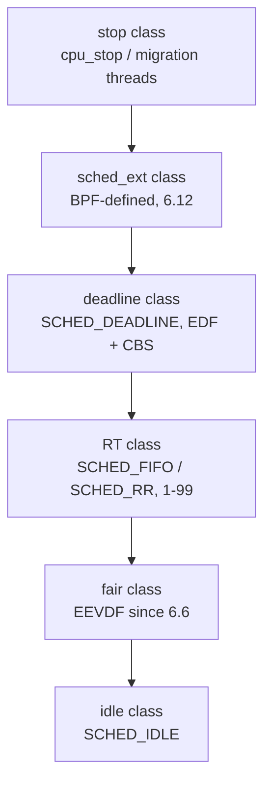
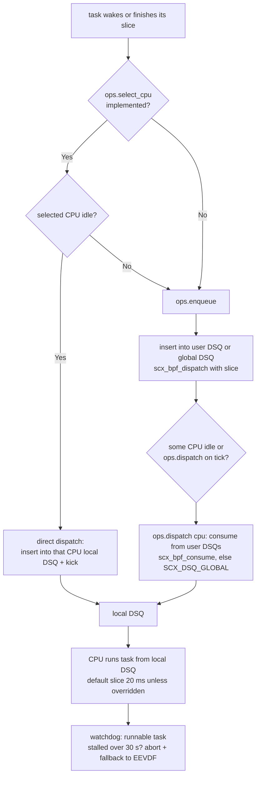

# sched_ext: Programmable CPU Scheduling in BPF

## Overview

sched_ext (SCX) is a kernel scheduling class, merged in Linux 6.12 (November 2024), whose entire scheduling policy is implemented as a set of BPF programs — the "BPF scheduler" — that can be loaded, swapped, and unloaded at runtime without patching or rebooting the kernel. Its defining property is that system integrity is preserved no matter what the BPF scheduler does: a watchdog aborts a stalled scheduler and every task transparently falls back to the default fair class (EEVDF). sched_ext exists because scheduling policy had been the last hard-to-experiment kernel subsystem: before it, testing a new scheduling idea meant patching, rebuilding, and rebooting.

> **Interview one-liner:** "sched_ext (6.12) makes the CPU scheduler a loadable BPF program: you implement `select_cpu`/`enqueue`/`dispatch` hooks over dispatch queues, the verifier guarantees memory safety, and a 30-second watchdog guarantees that a buggy scheduler cannot wedge the machine — tasks just fall back to the default class."

This page covers the motivation, the ops interface, dispatch queues, the safety and hotplug model, and the upstreaming story. The companion pages cover the mechanics from other angles: [sched_ext: Extensible Scheduler](../../linux/kernel/processes/sched-ext.md) is the kernel-side walkthrough, [sched_ext Practical Guide](../../linux/kernel/processes/sched-ext-guide.md) is a build-and-run developer guide, and [EEVDF Scheduler](./eevdf-scheduler.md) covers the default class that sched_ext replaces while it is loaded.

## Why sched_ext Exists

Before sched_ext, the only way to run a non-default CPU scheduling policy was to modify `kernel/sched/`, rebuild, and reboot — an iteration loop measured in hours, with a broken patch able to panic the machine. Policy changes that are reasonable for one workload (game frame pacing, SMT-aware packing, per-application CPU partitioning) are unacceptable as kernel defaults, so they never ship; meanwhile the default scheduler must satisfy everyone and therefore optimizes for no one in particular. sched_ext converts this all-or-nothing choice into a runtime decision: load a policy for the workload you care about, unload it when you are done, and iterate in seconds.

The safety argument is what made the design acceptable upstream. BPF programs are verifier-checked for memory safety and termination, so a scheduler hook cannot corrupt the kernel or spin forever inside the scheduler core. Misbehavior is confined to *policy* bugs — not dispatching a runnable task, wedging a DSQ — and those are caught by the watchdog, which aborts the BPF scheduler and restores the default class. This is the same contract as eBPF observability ([eBPF](../kernel/ebpf.md)): programmability with bounded blast radius.

The demand was demonstrated before the merge. Meta and ChromeOS ran sched_ext schedulers in production from the 2022 RFC onward, and the sched_ext ecosystem repository (scx) grew dozens of production-quality schedulers — gaming/VR (`scx_lavd`), datacenter NUMA balancing (`scx_rusty`), layered CPU partitioning (`scx_layered`). In an interview, the framing that lands is: "sched_ext did for CPU scheduling what eBPF did for tracing — it moved policy iteration out of kernel release cycles."

## Class Placement and Task Switching

sched_ext is not a userspace daemon *replacing* the scheduler; it is a new scheduling class inserted into the existing class stack between the stop class and the deadline class:



Placement matters for two guarantees. First, while sched_ext is active, its tasks preempt SCHED_DEADLINE and RT work — so a BPF scheduler that wants "everything except stop-class threads" can have it. Second, the fair class (EEVDF) remains fully functional underneath, which is exactly what the fallback path uses: when the BPF scheduler exits, tasks are re-enqueued into the fair class and the machine simply continues.

Task switching works as follows. Loading a BPF scheduler registers its ops and switches eligible tasks to policy `SCHED_EXT`; the flag `SCX_OPS_SWITCH_PARTIAL` restricts the switch to tasks that explicitly opted in via `sched_setscheduler(..., SCHED_EXT, ...)` instead of the whole system. Individual threads that must never be scheduled by BPF (some kthreads) stay with their own classes, and the BPF scheduler can inspect but not harm them. Unloading — or being aborted — reverses the switch atomically.

The class stack is also why sched_ext coexists with core scheduling (SCHED_CORE): the `scx_pair` in-tree example pairs sibling hyperthreads so they only ever run tasks sharing a cgroup cookie, showing that a BPF scheduler can *implement* core-scheduling-aware placement rather than fighting it.

## Dispatch Queues (DSQs)

sched_ext's central abstraction is the **dispatch queue (DSQ)** — a queue that can act as either a FIFO or a priority queue and decouples "which tasks are runnable" from "which CPU runs them". The core rules:

- A CPU only ever executes tasks sitting in its **local DSQ** (`SCX_DSQ_LOCAL`, one per CPU).
- `SCX_DSQ_GLOBAL` is a single built-in FIFO shared by all CPUs — the "dumbest useful" queue.
- The BPF scheduler can create an arbitrary number of **user DSQs** via `scx_bpf_create_dsq()` / `scx_bpf_destroy_dsq()`, keyed by u32 IDs, and queue tasks into any of them.
- A task in a non-local DSQ is *moved* into a local DSQ before it runs; a task inserted directly into a local DSQ is "direct dispatched".

| DSQ | Scope | Ordering | Typical use |
|-----|-------|----------|-------------|
| `SCX_DSQ_GLOBAL` | system-wide, built-in | FIFO | minimal schedulers, fallback target |
| `SCX_DSQ_LOCAL` | one per CPU, built-in | FIFO | the only queue a CPU consumes from |
| `SCX_DSQ_LOCAL_ON \| cpu` | addressed to a specific CPU's local DSQ | FIFO | direct dispatch from another CPU (kthreads, IPI-style kick) |
| user DSQ (`u32` id) | created by the BPF scheduler | FIFO or priority (by `dsq_id` + vtime key) | per-cgroup queues, per-NUMA-node queues, latency tiers |

The DSQ design is the impedance match between the kernel core and arbitrary policy: the core does not need to understand priorities, vtime, NUMA, or cgroups — it only needs to know that the local DSQ holds runnable tasks and that ops callbacks tell it where tasks go. Schedulers like `scx_rusty` build per-node DSQs and balance between them; `scx_flatcg` builds one DSQ per flattened cgroup layer.

## The Ops Interface

A sched_ext scheduler is a BPF program implementing callbacks from `struct sched_ext_ops`. The lifecycle and the hot hooks:

| Hook | When it runs | What you do in it |
|------|--------------|-------------------|
| `init()` / `exit()` | scheduler load / unload | create DSQs, start timers; release resources |
| `select_cpu(p, prev_cpu, wake_flags)` | task wakes up | pick a wake CPU; returning an idle CPU + `SCX_WAKE_SYNC`-style direct dispatch skips the queue entirely; `scx_bpf_select_cpu_dfl()` defers to the built-in wakeup heuristic |
| `enqueue(p, enq_flags)` | task becomes runnable | place the task: insert into local/global/user DSQ via `scx_bpf_dispatch()` with a slice length |
| `dispatch(cpu, prev)` | a CPU is about to go idle | move work into the CPU's local DSQ: `scx_bpf_consume(dsq_id)` pulls from user/global DSQs |
| `tick(cpu)` | periodic tick while a task runs | enforce time slices, trigger preemption/balancing |
| `running(p)` / `stopping(p, runnable)` | task starts / stops running | account per-task state (vtime, latency stats) |
| `runnable(p, enq_flags)` / `dequeue(p, deq_flags)` | task enters/leaves runqueue bookkeeping | maintain scheduler-side data (e.g., arena nodes) |
| `set_weight(p, weight)` / `set_cpumask(p, mask)` | nice/cgroup weight or affinity changes | translate `cpu.weight` and affinity into scheduler state |
| `cpu_online(cpu)` / `cpu_offline(cpu)` | CPU hotplug events | rebalance: migrate tasks off the going-down CPU |
| `cgroup_init()` / `cgroup_set_*()` | cgroup cpu controller changes | implement `cpu.weight` / `cpu.max` semantics (or consciously ignore them) |
| `init_task(p, task)` | task is enabled under the scheduler | initialize per-task storage (often a BPF arena/map node) |

Two details interviewers probe. First, `dispatch()` is invoked when a CPU is going idle — the BPF scheduler "refills" the local DSQ lazily, which is why even a FIFO scheduler needs one. Second, `select_cpu()` is the fast path: a successful selection of an idle CPU can put the task straight into that CPU's local DSQ and kick it, bypassing `enqueue()`/`dispatch()` entirely — that is how wakeup latency in a good BPF scheduler matches or beats the default class.

## The Dispatch Path



The default time slice is `SCX_SLICE_DFL` = 20 ms (`SCX_SLICE_INF` = "no slice limit"), passed per task in `scx_bpf_dispatch()`. A minimal three-function scheduler is genuinely tiny: `enqueue` dispatches to `SCX_DSQ_GLOBAL`, `dispatch` consumes into the local DSQ, and `init` does nothing — that is the in-tree `scx_simple` in its FIFO mode; enabling its weighted-vtime mode instead orders the global DSQ by weight-normalized runtime, which is a two-line change from "FIFO" to "CFS-like".

A compact flavor of that shape, with the one non-obvious line commented:

```c
void BPF_STRUCT_OPS(simple_enqueue, struct task_struct *p, u64 enq_flags)
{
    /* slice = 0 means "use the default 20 ms" */
    scx_bpf_dispatch(p, SCX_DSQ_GLOBAL, SCX_SLICE_DFL, enq_flags);
}

void BPF_STRUCT_OPS(simple_dispatch, s32 cpu, struct task_struct *prev)
{
    /* refill this CPU's local DSQ; returns false if the global DSQ was empty */
    scx_bpf_consume(SCX_DSQ_GLOBAL);
}

s32 BPF_STRUCT_OPS(simple_init)
{
    /* could scx_bpf_create_dsq() per-NUMA-node here for a real design */
    return 0;
}
```

Note what is *absent*: no vruntime tree, no load balancer, no affinity mask walk. sched_ext does none of that for you — the queue is FIFO because nothing orders it. Every property the default class has (weight ordering, wakeup heuristics, NUMA balancing, affinity) is something the BPF scheduler must either implement or consciously decline, which is why the real schedulers in the table below are thousands of lines while `scx_simple` is dozens.

## The Switch Lifecycle and Ops Flags

Loading is a handshake between the loader binary, the BPF subsystem, and the scheduler core, and a handful of flags tune its edges:

| Flag / mechanism | Effect |
|------------------|--------|
| `SCX_OPS_SWITCH_PARTIAL` | switch only tasks explicitly set to `SCHED_EXT`; without it, every applicable task is switched on load |
| `SCX_OPS_ENQ_LAST` | deliver `SCX_ENQ_LAST` in `enqueue()` when the task is the last runnable one — lets a scheduler detect going-idle transitions |
| `SCX_OPS_ENQ_EXITING` | also enqueue tasks that are exiting (default: never queued) |
| `SCX_OPS_KEEP_BUILTIN_IDLE` | keep the core's built-in idle-CPU tracking instead of letting the scheduler manage idle state via `update_idle()` |
| `SCX_KICK_IDLE` / `SCX_KICK_PREEMPT` | flags to `scx_bpf_kick_cpu()`: poke an idle CPU into `dispatch()`, or force-preempt a running one |
| `SCX_ENQ_WAKEUP` / `SCX_ENQ_PREEMPT` | `enq_flags` bits telling `enqueue()` why the task arrived (wakeup vs preemption vs requeue) |
| `ops.timeout_ms` | watchdog budget; 0 selects the 30 s default, and 30 s is also the cap |

The lifecycle in words: the loader opens the BPF verifier against `struct sched_ext_ops`, the core calls `init()` and creates DSQs, tasks are switched to `SCHED_EXT` (all or partial), the hooks run per event, and either the loader unloads cleanly (`exit()`, `SCX_EXIT_UNREG`) or the kernel force-exits (error/stall) with the dump. While loaded, the scheduler can be replaced by *another* BPF scheduler directly — sched_ext schedulers supersede each other, which is how A/B scheduling experiments are run on live machines.

One design decision worth citing in interviews: hooks are called synchronously in the wakeup/enqueue path, so their cost is charged to the waker, not a softirq — a slow `enqueue()` slows down the process that caused the wakeup. This is why hot hooks must be short and why heavier policies (like `scx_userland`'s ring-buffer round trips) accept measurable wakeup-latency costs.

## Semantics You Must Re-implement

| Property | EEVDF does automatically | Under sched_ext the BPF scheduler must... |
|----------|--------------------------|--------------------------------------------|
| Nice weights / `cpu.weight` | weight table drives vruntime rate | receive `set_weight()`/`cgroup_*` hooks and implement ordering or ignore them |
| Wakeup placement | wake-affine heuristics, idle search | implement in `select_cpu()` or defer via `scx_bpf_select_cpu_dfl()` |
| Time slices | base slice, preemption by deadline | pass a slice per `scx_bpf_dispatch()`; enforce in `tick()` if finer control is wanted |
| Affinity masks | respected by pick-next | honor `p->cpus_ptr` in `select_cpu()`/`dispatch()` — the core will reject illegal dispatches |
| NUMA balancing | driven by fair-class machinery | build per-node DSQs and migrate explicitly (see `scx_rusty`) |
| cgroup CPU throttling | `cpu.max` enforced by the fair class | implement via `cgroup_init()`/`cgroup_set_*()` or document that it is ignored |

This table is the honest cost of programmability and the best answer to "why not use sched_ext everywhere?" — because reproducing the fair class's semantics is a project, and the fair class is already good at being fair. sched_ext wins when the policy you want is *different*, not when it is a slightly tuned copy of the default.

## Performance Model

The performance argument is path-shaped rather than average-shaped. The direct-dispatch path — `select_cpu()` finds an idle CPU and drops the task into its local DSQ — costs one BPF call and an IPI-less kick, comparable to the default class's wakeup path. The queued path adds a DSQ insert plus, later, a `dispatch()` consume; schedulers that keep per-CPU or per-node DSQs keep that near-cache-local, while the single global DSQ (fine for low core counts) serializes and degrades as CPUs are added. Userspace-decision schedulers add a wakeup-to-decision round trip through a ring buffer, which is acceptable for throughput workloads and unacceptable for sub-millisecond frame budgets.

Measure rather than assume: wakeup latency distributions (`perf sched latency`, or BPF-based tracing), context-switch rates, and — for interactive workloads — frame-time or completion-time tail percentiles. The scx schedulers report their own stats (`scx_lavd`, `scx_layered` print per-interval summaries), and a scheduler switch is cheap enough to benchmark back-to-back on one machine, which was impossible in the patch-and-reboot era.

## Safety Model: Watchdog, Exit, Fallback

The safety story has several layers, and each maps to a specific failure:

- **Verifier.** Hooks are BPF programs: memory safety, bounded loops, no arbitrary pointer dereferences. A policy bug cannot corrupt scheduler data structures it does not own.
- **Watchdog.** If a runnable task has not run for longer than the configured timeout (`ops.timeout_ms`, capped at 30 s; the default is the 30 s maximum), the kernel concludes the scheduler is wedged, aborts it with exit reason `SCX_EXIT_ERROR_STALL`, and re-enqueues all tasks into the default class. The dmesg message pattern ("runnable task ... failed to run for ...") is the signature of a watchdog abort.
- **BPF errors and explicit exit.** A verifier rejection at load, an invalid kfunc call, or the scheduler calling `scx_bpf_error()` triggers exit `SCX_EXIT_ERROR`/`SCX_EXIT_ERROR_BPF`; unload requests produce `SCX_EXIT_UNREG`. On every exit, `ops.exit()` runs, the debug dump is printed (also available via the `sched_ext_dump` tracepoint), and tasks fall back.
- **Operator kill switches.** `SysRq-S` unloads the active BPF scheduler immediately; `SysRq-D` dumps debug state without unloading. `/sys/kernel/sched_ext/root/ops` shows the active scheduler name (empty = none).
- **Bypass mode.** Later kernels added a bypass mode: when the core detects persistent trouble, it temporarily schedules with a built-in minimal FIFO while keeping the BPF scheduler loaded, then returns control — turning "abort" into "degrade" for transient conditions.

One subtlety worth stating: cgroup CPU controller settings (`cpu.max`, `cpu.weight`, `cpu.idle`) are enforced by the fair class, but for sched_ext tasks they are only *reported* to the BPF scheduler via `ops.cgroup_init()` / `ops.cgroup_set_*()`; the BPF scheduler is responsible for implementing (or explicitly ignoring) them. A scheduler that ignores `cpu.max` is policy-wrong but memory-safe — the kernel just reports the discrepancy.

## CPU Hotplug

Because the BPF scheduler owns placement, CPU hotplug is a cooperative protocol rather than a kernel-internal detail. When a CPU goes offline, `ops.cpu_offline(cpu)` fires; the scheduler is expected to stop targeting that CPU and to treat tasks stranded on it as needing re-dispatch. Tasks from the going-down CPU's local DSQ are moved so they remain runnable, and a scheduler that mishandles the event — leaving a runnable task nowhere to run — is caught by the same watchdog as any other stall.

The hotplug path matters in practice because the people loading custom schedulers run elastic systems: VMs are resized, cores are parked for power, and cloud instances are drained. A scheduler that snapshots the CPU set at `init()` and never handles changes is fine in a lab and broken in production; the ops interface makes hotplug handling explicit (`cpu_online` symmetric with `cpu_offline`) instead of implicit. The idle-CPU bitmaps that schedulers query (`scx_bpf_pick_idle_cpu()`) are maintained by the core and updated across hotplug events, so idle-selection keeps working on the new topology.

The asymmetry between the two events is the trap: `cpu_online` usually just means "more capacity" and a scheduler can ignore it and limp on, but `cpu_offline` strands tasks and DSQs that point at the dying CPU. Well-behaved schedulers treat `cpu_offline` as a rebalancing trigger — drain anything targeted at that CPU, re-evaluate placement for its tasks — and `cpu_online` as an opportunity to kick idle CPUs into `dispatch()` sooner. Both events can arrive during scheduler load/unload, so the hooks must be written to tolerate racing with `init()`/`exit()`; the core serializes the hard cases, but policy data structures are the BPF scheduler's own problem.

For interviews: the strongest one-sentence summary is "hotplug in sched_ext is just another events-driven hook set, and the watchdog is the backstop that converts any missed event into a fallback rather than a hang."

## Shipping Schedulers

| Scheduler | Where | Design in one line |
|-----------|-------|--------------------|
| `scx_simple` | in-tree (`tools/sched_ext`) | FIFO or weighted-vtime over the global DSQ; the "hello world" |
| `scx_qmap` | in-tree | five FIFO priority levels via user DSQs; the ops/DSQ tutorial |
| `scx_central` | in-tree | all decisions on one central CPU; demonstrates `SCX_DSQ_LOCAL_ON` direct dispatch and tickless operation |
| `scx_flatcg` | in-tree | flattened cgroup hierarchy: hierarchical `cpu.weight` in one scheduling layer |
| `scx_pair` | in-tree | core-scheduling example: sibling CPUs run same-cgroup tasks |
| `scx_userland` | in-tree | scheduling decisions made in userspace over BPF rings — minimal `scx_rustland`-style design |
| `scx_rusty` | scx repo (Rust) | NUMA-aware load balancing, per-node DSQs, cgroup weight support |
| `scx_layered` | scx repo (Meta) | CPU "layers" with task-matching policies (confined, grouped, open) for datacenter partitioning |
| `scx_lavd` | scx repo | latency-criticality-aware virtual deadline scheduling; gaming/VR/interactive focus |
| `scx_rustland` / `scx_bpfland` | scx repo (Rust) | userspace scheduler over BPF ring buffers; later renamed/evolved into `scx_bpfland` with vdeadline ordering |

The in-tree set is deliberately pedagogical (FIFO, priorities, central, cgroup, core-sched, userspace); the scx repository set is where production designs live. Notable pattern: `scx_userland`/`scx_rustland` push policy fully to userspace and accept the round-trip latency, while everything else keeps policy in BPF and uses userspace only for loading and monitoring. That tradeoff — decision latency versus decision richness — is the main architecture question for anyone writing a new scheduler.

## Upstreaming Story: RFC (2022) to 6.12 (2024)

| When | What happened |
|------|---------------|
| October 2022 | Tejun Heo (Meta) posts the RFC series "sched: BPF support for custom schedulers"; schedulers run in production at Meta and are adopted in ChromeOS trees |
| 2023 | Repeated reworks in response to scheduler-maintainer review: ops surface slimmed, scheduler-managed idle bits introduced, watchdog and exit-dump machinery added; extended debate at the LPC scheduling summit |
| March 2024 | LWN publishes *The extensible scheduler class*, crystallizing the review consensus: programmability is acceptable because every failure path ends in fallback to the default class |
| 6.12 (November 2024) | Merged as `CONFIG_SCHED_CLASS_EXT` with `tools/sched_ext` examples; kfuncs include `scx_bpf_dispatch()`, `scx_bpf_consume()`, `scx_bpf_create_dsq()` |
| 2025+ | Post-merge hardening: bypass mode, per-event statistics (`SCX_EV_*` counters), kfunc renames toward `scx_bpf_dsq_insert()`-style naming, sub-scheduler experiments |

The review history is itself an interview asset: the objection was never "BPF can't do scheduling" — it was "what happens when it does it badly," and the merged design answers that with the verifier, the watchdog, and fallback rather than with restrictions on what policies may exist. That is the classic mechanism-vs-policy split, enforced by code.

The aftermath also set a template for future "loadable kernel policy" proposals: ship with in-tree examples that double as test coverage, keep the privileged-operation surface as named kfuncs the verifier can audit, and make every abnormal exit observable (dump, tracepoint, counters). Schedulers written against the 6.12 API needed small ports for the later kfunc renames — worth mentioning if an interviewer asks about API stability, because the answer is that the *contract* (hooks, DSQs, fallback) has been stable while the *plumbing* names were cleaned up.

## Observing and Operating

```bash
# Is sched_ext available (kernel >= 6.12, CONFIG_SCHED_CLASS_EXT)?
ls /sys/kernel/sched_ext/
uname -r

# Which scheduler is active? (empty = default class)
cat /sys/kernel/sched_ext/root/ops

# Load one (example schedulers ship in the kernel tree and scx repo)
sudo scx_simple            # then re-check root/ops

# Tasks under sched_ext report it in their policy
chrt -p $$                 # policy: SCHED_EXT when switched

# Dump/monitor: exit reasons, stalls, bypass events
sudo dmesg | grep -i sched_ext          # watchdog / exit dumps
ls /sys/kernel/tracing/events/sched_ext/   # sched_ext_dump tracepoint

# Manually abort the BPF scheduler
echo s > /proc/sysrq-trigger              # SysRq-S: unload, fall back
```

The operational loop that distinguishes someone who has actually used sched_ext: check `root/ops` to see *whose* policy is running, load the scheduler with its loader binary (not raw `bpftool`), and when behavior degrades, read the exit dump first — exit reasons (`SCX_EXIT_ERROR_STALL` vs `SCX_EXIT_UNREG`) tell you whether you hit a policy bug or someone unloaded it.

## Common Mistakes

1. **Calling sched_ext a userspace scheduler.** The policy hooks run in BPF inside the kernel; only loading, monitoring, and (in `scx_userland`'s case) some decisions happen in userspace. Tasks run in the kernel's context-switch machinery as always.
2. **Assuming cgroup `cpu.max` still throttles.** For switched tasks the fair-class enforcement is bypassed; the BPF scheduler receives the settings via hooks and may ignore them. Check the scheduler's documentation before promising quota semantics.
3. **Believing a hung scheduler hangs the machine.** The watchdog's 30-second stall detection plus fallback exists precisely so that a wedged BPF scheduler costs you one stall event, not a reboot — and `SysRq-S` aborts it immediately.
4. **Loading schedulers with raw `bpftool`.** The loader binary does the switch dance, monitor setup, and exit-dump handling; loading just the program leaves the system half-configured.
5. **Ignoring hotplug in a custom scheduler.** Snapshotting the CPU set in `init()` breaks on VM resize or core parking; the `cpu_online`/`cpu_offline` hooks and the watchdog are the contract you must honor.

## Interview Questions

1. **What is sched_ext and why did it take until 6.12 (2024) to land?** sched_ext is a scheduling class whose policy is implemented in verifier-checked BPF programs, loadable and unloadable at runtime. It was proposed as an RFC by Tejun Heo (Meta) in 2022 and needed two years of review to converge on a safety story acceptable for mainline: a watchdog that aborts a scheduler leaving a task unrunnable for more than 30 seconds, explicit exit reasons and debug dumps, and transparent fallback to the default class. The production usage at Meta and ChromeOS during that period supplied the operational evidence. It merged in 6.12 with a stripped-down ops interface and the in-tree example schedulers.
2. **Walk through the dispatch path of a waking task under a sched_ext scheduler.** On wakeup, `select_cpu()` runs first; if it picks an idle CPU the task can be direct-dispatched into that CPU's local DSQ and kicked, never touching a shared queue. Otherwise `enqueue()` runs and the scheduler inserts the task into a user DSQ, the global DSQ, or a local DSQ via `scx_bpf_dispatch()` with a slice. When a CPU is about to idle, `dispatch()` refills its local DSQ — consuming from user DSQs by ID and falling back to the global DSQ. A CPU only ever runs tasks from its local DSQ, and the default slice is 20 ms unless the scheduler passes another value. The path matters because the fast case (idle CPU found in `select_cpu`) is the one that determines wakeup latency, which is why serious schedulers invest most of their code there.
3. **How does the kernel guarantee that a buggy BPF scheduler cannot hang the machine?** Three layers: the BPF verifier makes the hooks memory-safe and terminating, so corruption and infinite loops inside the scheduler are excluded; the watchdog detects a runnable task that has not run for the timeout (default and cap 30 s) and aborts with `SCX_EXIT_ERROR_STALL`; and every exit path re-enqueues all sched_ext tasks into the fair class, so the system returns to EEVDF without a reboot. Operators also get `SysRq-S` as an immediate kill switch and the `sched_ext_dump` tracepoint for post-mortems.
4. **What are DSQs and why does the design need them?** Dispatch queues are FIFO-or-priority queues that decouple runnable tasks from CPUs: the kernel core only commits to "a CPU runs its local DSQ", while all policy lives in where tasks get inserted. There is a built-in global FIFO, a per-CPU local DSQ, and an unlimited number of user DSQs created by the scheduler. This is what lets one core support arbitrary policies — per-NUMA queues, cgroup layers, priority tiers — without the core understanding any of those concepts, and it is why even trivial schedulers need `enqueue` plus `dispatch`.
5. **How do cgroup controls and CPU hotplug interact with a BPF scheduler?** cgroup `cpu.weight`/`cpu.max`/`cpu.idle` are not enforced by the core for sched_ext tasks; they are surfaced through `ops.cgroup_init()` and `ops.cgroup_set_*()`, and each scheduler documents whether it honors them — a scheduler that ignores `cpu.max` is wrong policy-wise but safe. Hotplug is explicit: `cpu_online()`/`cpu_offline()` hooks fire on topology changes, tasks stranded on an offline CPU are moved back into schedulable queues, and unhandled events surface as watchdog stalls rather than silent hangs.
6. **When would you actually choose sched_ext over tuning EEVDF or using SCHED_DEADLINE?** Use EEVDF tuning (weights, per-task slices) when the workload is latency-sensitive within fair-share semantics, and SCHED_DEADLINE when you have a periodic task model needing admission-controlled guarantees. Reach for sched_ext when the policy itself is unusual — SMT-aware packing, game frame pacing, per-application CPU partitioning, or research algorithms — and you need to iterate on it without shipping kernels. It is also the only option that gives per-workload *policy* rather than per-task or per-cgroup *parameters* within fixed policies.

## Key Takeaways

- sched_ext (6.12, November 2024) is a scheduling class implemented in BPF: hooks like `select_cpu`, `enqueue`, `dispatch`, and `tick` define the policy, loadable and unloadable at runtime.
- Class order is stop → ext → deadline → RT → fair → idle; on any abort, tasks fall back to the fair class (EEVDF) transparently.
- Dispatch queues (global, per-CPU local, user-created) are the core abstraction: a CPU only runs its local DSQ; all placement policy is expressed as inserts and moves.
- The default slice is 20 ms (`SCX_SLICE_DFL`); `dispatch()` refills a CPU's local DSQ lazily when it is about to go idle.
- Safety is layered: BPF verifier + 30-second watchdog (`SCX_EXIT_ERROR_STALL`) + explicit exits + `SysRq-S`, with debug dumps via the `sched_ext_dump` tracepoint.
- cgroup CPU controls are advisory for BPF schedulers (reported via `cgroup_*` hooks); hotplug is explicit via `cpu_online`/`cpu_offline` hooks with watchdog backstop.
- In-tree examples (`scx_simple`, `scx_qmap`, `scx_central`, `scx_flatcg`, `scx_pair`) teach the mechanics; `scx_rusty`, `scx_layered`, `scx_lavd`, `scx_bpfland` are the production-grade designs.
- Interview framing: "eBPF did for tracing what sched_ext did for scheduling — policy iteration without kernel releases, with bounded blast radius."

## References

- Kernel documentation: *sched_ext — Extensible Scheduler Class* — <https://docs.kernel.org/scheduler/sched-ext.html>
- LWN: *The extensible scheduler class* (Jonathan Corbet, March 2024) — <https://lwn.net/Articles/922405/>
- sched_ext scheduler repository (scx) — <https://github.com/sched-ext/scx>
- Kernel documentation: *BPF documentation index* — <https://docs.kernel.org/bpf/index.html>
- Kernel documentation: *EEVDF scheduler* (the default class sched_ext replaces/falls back to) — <https://docs.kernel.org/scheduler/sched-eevdf.html>
- Kernel source: <https://github.com/torvalds/linux> (`kernel/sched/ext.c`, `include/linux/sched/ext.h`, `tools/sched_ext/`)

## Cross-References

- [EEVDF Scheduler](./eevdf-scheduler.md) — the default class sched_ext temporarily replaces and falls back to
- [Modern Linux Kernel Internals](./README.md) — places sched_ext in the 2016–2026 programmable-policy theme
- [sched_ext: Extensible Scheduler](../../linux/kernel/processes/sched-ext.md) — kernel-side companion page with callbacks and examples
- [sched_ext Practical Guide](../../linux/kernel/processes/sched-ext-guide.md) — build, load, and deploy workflow for BPF schedulers
- [eBPF](../kernel/ebpf.md) — the verifier and program model that make sched_ext safe
- [Scheduler Internals](../advanced/scheduler-internals.md) — scheduling-class architecture that hosts the ext class
- [cgroups](../containers/cgroups.md) — `cpu.weight`/`cpu.max` semantics that BPF schedulers receive via hooks
- [SCHED_DEADLINE](./sched-deadline.md) — the deadline class sitting just below the ext class in the stack
