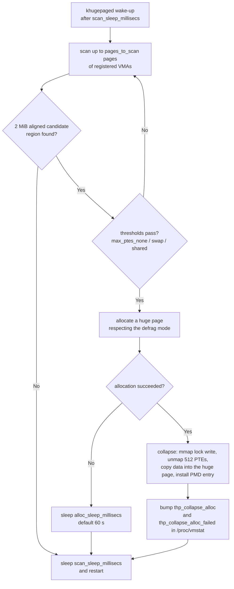
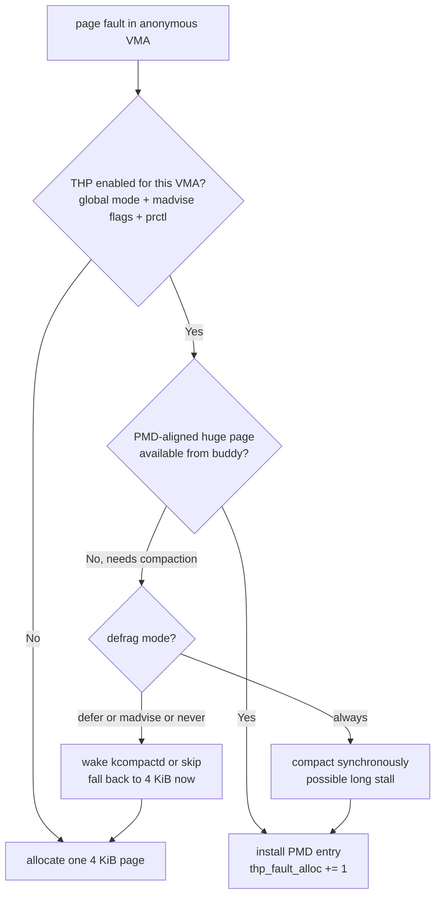

# THP & khugepaged: Modern Internals

## Overview

Transparent Huge Pages (THP, merged in 2.6.38, 2011) lets the kernel back anonymous and shmem/page-cache memory with 2 MiB pages — no application changes, no hugetlbfs reservations — and **khugepaged** is the background kernel thread that collapses 4 KiB page tables into huge ones after the fact. This page covers the modern-internals angle: the full THP control surface (global sysfs, per-VMA `madvise`, per-process `prctl`), khugepaged's scan-and-collapse loop and its sysfs tunables, the defragmentation modes, the memory-bloat mechanics, tmpfs THP, and **mTHP** (multi-size THP, 6.8+), which is how the 2011-era 2-MiB-only design is being reworked on top of folios.

> **Interview one-liner:** "THP is transparent 2 MiB paging: faults try huge pages directly, and khugepaged collapses 4 KiB ranges in the background — the whole debate is about the failure modes: direct-compaction stalls in the fault path, RSS bloat from collapsing sparse ranges, and reclaim amplification. mTHP (6.8) makes the size a tunable instead of a philosophy."

Scope split: the textbook treatment (TLB reach, page-table anatomy, hugetlbfs) lives in [Huge Pages](../memory/huge-pages.md), and the kernel-side walkthrough with a worked TLB-miss demo lives in [THP: Reach, Collapse, and the Cost of Ambition](../../linux/kernel/memory/thp.md). This page is the operator/internals view — tunables, thresholds, failure modes, and the 2024+ mTHP redesign — so the three pages share almost no duplicated material.

## The Control Surface: Global, Per-VMA, Per-Process

### Global mode: `/sys/kernel/mm/transparent_hugepage/enabled`

Three values, with the active one shown in brackets:

| Value | Fault-time behavior | khugepaged |
|-------|--------------------|------------|
| `always` | Try a PMD-size huge page for every eligible anonymous fault | Runs over all eligible VMAs |
| `madvise` | Huge pages only inside `MADV_HUGEPAGE` regions | Collapses only `MADV_HUGEPAGE` VMAs |
| `never` | No anonymous THP | Stopped (the kernel doc is explicit that khugepaged auto-starts for `always`/`madvise` and shuts down on `never`) |

The mode is checked at fault time in `do_huge_pmd_anonymous_page()` (via `transparent_hugepage_enabled()`), and a THP that cannot be allocated silently falls back to a 4 KiB page — THP is best-effort by contract, never a guarantee. `never` here disables *transparent* THP only; hugetlbfs pre-reserved pages ([Huge Pages](../memory/huge-pages.md)) are unaffected. Most server distributions shipped `madvise` or `never` defaults after the vendor runbook wars (see the tuning table later), while generic desktops often run `always`.

### Per-VMA: `madvise()` and per-file overrides

`madvise(addr, len, MADV_HUGEPAGE)` marks a VMA with `VM_HUGEPAGE`; `MADV_NOHUGEPAGE` sets `VM_NOHUGEPAGE` and wins over the global mode, giving an application an opt-out that survives even `always`. These flags apply to anonymous and shmem VMAs alike, and `madvise(..., MADV_COLLAPSE)` (new in 6.1) inverts the model entirely: the *application* requests an immediate synchronous collapse of a range instead of waiting for khugepaged — the mechanism behind userspace-driven THP for malloc implementations and runtime post-startup promotion. A child VMA inherits the flags across `fork()`, and `mmap()` calls can carry them from the start via `mmap2`-style `MAP_HUGETLB`-adjacent flags only for hugetlbfs — for THP the flag must be advised after mapping (or via the `thp=` tmpfs mount option for shmem).

### Per-process: `prctl(PR_SET_THP_DISABLE, 1)`

`PR_SET_THP_DISABLE` (prctl option 41, added in 3.15) sets a process-wide flag that disables THP for *all* mappings of that process, including future ones, and the flag is inherited across `fork()`. This is the knob of choice for language runtimes that cannot audit every `mmap` site: an allocator can call it once at startup and be immune to a host-level `always` setting, with no per-VMA bookkeeping. The inverse (`PR_SET_THP_ENABLE`-style opt-in) does not exist as of 6.x — opting in globally remains the sysadmin's decision, and the per-process primitive is opt-out only.

```bash
cat /sys/kernel/mm/transparent_hugepage/enabled      # always [madvise] never
cat /sys/kernel/mm/transparent_hugepage/hpage_pmd_size   # 2097152 on x86-64
prctl --help | grep -i thp                           # prctl(PR_SET_THP_DISABLE)
grep -i thp /proc/self/smaps | head                  # per-VMA AnonHugePages
```

## The TLB Reach Math, Compressed

The full arithmetic is in the textbook and kernel-side pages; the one formula to internalize for khugepaged questions is that a 2 MiB mapping replaces 512 PTEs with one PMD entry, so TLB reach per entry rises 512× and the walk loses a level (PMD points at the frame directly):

\\[
\\text{reach} = N_{\\text{entries}} \\times \\text{page size}, \\qquad
\\frac{1536 \\times 2\\ \\text{MiB}}{1536 \\times 4\\ \\text{KiB}} = 512
\\]

With the usual 1,536-entry L2 dTLB model the shared-book pages use, that is 6 MiB of coverage at 4 KiB versus 3 GiB at 2 MiB — one decode-heavy loop over a 64 MiB heap exhausts the 4 KiB case but barely warms the 2 MiB case. Two caveats keep this honest in interviews: real CPUs partition TLB entries by page size (a chip may carry far fewer 2 MiB entries than 4 KiB ones), and the win is second-order for streaming workloads but first-order for pointer-chasing over large working sets. khugepaged exists precisely because the *allocation pattern* that benefits (dense, long-lived, 2 MiB-aligned) is often only visible *after* the heap has been touched 4 KiB at a time.

## khugepaged: The Background Collapser

### The scan loop and its tunables

khugepaged is a kernel thread (one instance, scanning mm's registered from a list; per-VMA candidate selection walks the rmap) that wakes on a timer and walks page tables looking for 2 MiB-aligned regions worth promoting. Everything about its aggressiveness is sysfs-tunable under `/sys/kernel/mm/transparent_hugepage/khugepaged/`:

| Tunable | Default | Meaning |
|---------|--------:|---------|
| `pages_to_scan` | 4096 | Base pages examined per scan pass |
| `scan_sleep_millisecs` | 10000 | Sleep between passes (the pace limiter) |
| `alloc_sleep_millisecs` | 60000 | Cool-down after a failed huge-page allocation |
| `max_ptes_none` | 511 | Max empty PTEs tolerated in a 512-PTE range to still collapse |
| `max_ptes_swap` | 64 | Max swapped-out PTEs khugepaged will swap back in to collapse |
| `max_ptes_shared` | 8 | Max PTEs shared with other processes (KSM/cow sharing) |

The defaults define a deliberately lazy thread: at `pages_to_scan=4096` every 10 seconds it inspects ~410 pages/s, or fewer than one full 512-PTE candidate region per second — khugepaged is designed to be invisible on the CPU account and to take minutes-hours to convert a freshly built heap, not milliseconds. Raising `pages_to_scan` 10× or cutting `scan_sleep_millisecs` to 1000 converts an idle 0.1%-CPU thread into a measurable one, which is the first thing to check when "we enabled khugepaged and latency jitter appeared."

### Collapse eligibility: the thresholds decide everything

A 2 MiB-aligned region is a collapse candidate only if its 512 PTEs satisfy all three thresholds: ≤ `max_ptes_none` empty, ≤ `max_ptes_swap` swapped-out, ≤ `max_ptes_shared` shared. With defaults 511/64/8 this is extremely permissive — a range containing a *single* live 4 KiB page qualifies — and that permissiveness is simultaneously khugepaged's power (heaps that grew organically do get promoted) and its most criticized behavior (the bloat mechanics two sections down). `max_ptes_swap=64` means collapse can pull up to 64 pages back in from swap to rebuild a huge page, trading swap-in I/O for TLB reach on ranges that are mostly-but-not-entirely resident. `max_ptes_shared` protects against undoing KSM's work ([KSM Page Merging](../advanced/ksm-page-merging.md)): collapsing a range whose pages are shared would copy them into a private huge page and multiply RSS.

### The collapse flow



Three implementation costs are worth naming in an interview. First, the collapse takes the **mmap lock in write mode** for the replace step, so it is mutually exclusive with all faulting on that mm while it runs — a collapse storm is an mmap-lock storm. Second, it locks every involved page and flushes TLBs for the unmapped range, so a collapse is hundreds of times more expensive than the 4 KiB fault it replaces. Third, an application thread that races the collapse (e.g., `mprotect` or `munmap` in the same region) forces retry-or-abort logic, which is why khugepaged aborts candidates rather than waiting on busy regions.

## THP Defragmentation: When the Buddy Can't Deliver

A 2 MiB allocation needs one physically contiguous order-9 buddy block; after hours of uptime, memory is fragmented into order-0 pages, so the interesting question is what the *faulting task* is asked to pay. `/sys/kernel/mm/transparent_hugepage/defrag` selects the policy, per mode:

| Mode | Fault path (application pays) | khugepaged pays |
|------|-------------------------------|-----------------|
| `always` | Synchronous compaction inside the fault — the source of the infamous 100 ms+ stalls | Direct compaction allowed |
| `defer` | Wake `kcompactd`, fall back to 4 KiB now; compaction happens async | Direct compaction allowed |
| `defer+madvise` | `defer` for ordinary VMAs; synchronous compaction for `MADV_HUGEPAGE` | Direct compaction allowed |
| `madvise` | Synchronous compaction only in `MADV_HUGEPAGE` VMAs | Direct compaction allowed |
| `never` | Never compact; allocate only from what exists | No direct compaction |

The `always` mode is what gave THP its reputation: a `mprotect` or first-touch fault that triggers direct compaction can block the *application thread* for tens to hundreds of milliseconds while scanners migrate pages — an eternity for a p99 and the core reason MongoDB's runbook mandates `never`. The `defer` family moves the compaction bill to kcompactd (async, background) or to khugepaged's own context, where a stall costs no application latency; and the compaction machinery itself — migration scanners, fragmentation index, proactive compaction in 5.9 — is covered in [Memory Compaction Internals](../../linux/kernel/memory/compaction.md). khugepaged allocations are structurally safer: the thread sleeps in the kernel on its own budget, and a failed attempt simply triggers the `alloc_sleep_millisecs` 60-second cool-down before retrying, which is why `always`-THP with `defer`-defrag plus a patient khugepaged is a common middle-ground config.



The second diagram is the fault-time mirror of khugepaged's loop: every THP page in the system entered through one of these two gates (fault-time `thp_fault_alloc`, or khugepaged/`MADV_COLLAPSE` `thp_collapse_alloc`), and `/proc/vmstat` counts both paths plus their failure counters — reading those counters is how you tell an allocation problem (fallbacks) from a collapse problem (khugepaged churn).

## The Bloat Problem: 2 MiB Pages, 4 KiB Granularity

A huge page is allocated whole and billed whole to RSS. The eligibility thresholds above permit khugepaged to collapse a range holding a single live page, and the arithmetic of what that does to accounting is the interview set-piece:

\\[
\\text{amplification} = \\frac{2\\ \\text{MiB}}{4\\ \\text{KiB} \\times \\text{live pages}}
\\]

Collapse a range with one live 4 KiB page and RSS for that data grows ~512× (2 MiB resident, mostly zero-filled to back the missing PTEs); a sparse 100 MiB heap whose live density is ~30% can report ~300 MiB after `always`+khugepaged runs — the mechanism behind the "THP doubled our memory footprint" war stories and the reason browsers and mallocs historically fought it. The knob that contains this is `max_ptes_none`: dropping it from 511 to ~100 means "only collapse ranges that are already ≥80% populated," which cuts fabrication of dead memory at the cost of slower promotion. Bloat also compounds with reclaim: a partially-used huge page that goes cold must be *split* before individual 4 KiB pages can be swapped or reclaimed, and the split costs the very TLB/page-table work the huge page was meant to save — under pressure, THP can therefore alternate between collapse (CPU) and split (CPU), a churn visible as elevated `thp_split_page` plus `thp_collapse_alloc` counters in `/proc/vmstat`.

Two secondary bloat vectors matter in fleet environments. NUMA balancing hint-faults on a 2 MiB page migrate 2 MiB at a time, so misplaced THP pages move 512× more bytes than the data actually touched — one reason `always` THP on NUMA boxes needs care. And per-container accounting (memcg) bills the whole huge page to whichever cgroup faults it in, so a shared library region collapsed into THP distorts per-tenant memory charge; this is the same class of problem that [PSI and DAMON](./psi-and-damon.md) tools surface as pressure without an obvious allocator culprit.

## shmem/tmpfs THP

Anonymous memory is only half the surface: shmem (tmpfs, SysV/POSIX shared memory) has had THP support since 4.8, controlled by `/sys/kernel/mm/transparent_hugepage/shmem_enabled` with more values than the anon file: `always`, `within_size` (huge pages only when they do not over-allocate the file's size), `advise` (only `MADV_HUGEPAGE`/`thp=`-mounted regions), `never`, plus two interposition values `deny` and `force` that override per-mount settings. Per-mount, a tmpfs can be mounted with `huge=always|within_size|advise|never` to override the global policy, and `MADV_COLLAPSE` (6.1) also works on shmem ranges. The economics differ from anon in one important way: shmem files are persistent and sparse-friendly, so a hole-riddled file can force splitting or refuse huge pages entirely, and `within_size` exists because a 6 MiB file under `always` would round up to 8 MiB of resident huge pages.

File-backed *page-cache* THP (regular filesystems, not shmem) is a separate, more recent path: it works only for filesystems converted to large-folio-capable readahead and fault handling, and per-size controls arrived with the mTHP work in the 6.12-era. For interviews the load-bearing distinction is: tmpfs THP = mature (4.8+), anon THP = the 2011 original, file THP = the new frontier riding on folios — the same layering order in which the features actually merged.

## mTHP: Multi-Size THP (6.8+)

mTHP, merged for anonymous memory in 6.8 (Ryan Roberts' series, March 2024), dissolves THP's all-or-nothing 2 MiB assumption: the kernel can now fault, account, and collapse **large folios** at any supported order between 2 and the PMD order — on 4 KiB-base x86-64 that is 16 KiB, 32 KiB, 64 KiB, 128 KiB, 256 KiB, 512 KiB, 1 MiB, and 2 MiB (1 GiB PUD-size anon pages remain a proposal, not a merge; sizes are architecture-dependent). Each size gets its own sysfs directory with independent policy:

```bash
ls /sys/kernel/mm/transparent_hugepage/          # hugepages-16kB ... hugepages-2048kB
cat /sys/kernel/mm/transparent_hugepage/hugepages-64kB/enabled    # inherit|always|madvise|never
cat /sys/kernel/mm/transparent_hugepage/hugepages-64kB/defrag    # per-size defrag, incl. inherit
```

`inherit` follows the global `enabled` file; everything else overrides per size, and per-size `defrag` files follow the same mode vocabulary as the global one. The trade-off math is the reason mTHP reframes the whole THP debate: a 64 KiB folio multiplies TLB reach by 16 at a worst-case waste of 16×, versus 512×/512× for 2 MiB — most of the TLB win for a small fraction of the bloat, which is exactly the trade a sparse general-purpose heap wants. mTHP also slots into the kernel's folio migration: pages are increasingly managed as `struct folio` objects of variable size rather than fixed `struct page`s, so large-folio support for the page cache, swap-out of large folios without splitting, and per-size stats (`hugepages-<n>kB/stats/`, `anon_fault_alloc`, `anon_fault_fallback`, collapse counters — kernels from the 6.10-era on) all build on the same substrate. khugepaged initially only collapsed to PMD size; collapse into smaller mTHP sizes landed in the follow-up 6.12-era series, closing the gap between "fault-time large folios" and "background promotion at every size."

The practical mTHP recipe that interviewers like: leave `hugepages-2048kB/enabled` at `never` or `madvise`, set `hugepages-64kB/enabled` to `inherit` under a global `always`/`madvise`, and get large-folio TLB benefits for the general heap with bounded waste — then reserve 2 MiB decisions for genuinely dense regions via `MADV_HUGEPAGE`. It converts a religious argument ("THP on or off") into an engineering knob ("which sizes, for which mappings, at which cost"), and that reframe is itself the modern-interview answer to "is THP good or bad?"

## Production Tuning and Observability

| Workload | Recommended setting | Why |
|----------|--------------------|-----|
| Databases (MongoDB, Redis-class) | `never` (vendor runbooks) or `madvise` + `defer` | Fork+COW amplification (a post-`fork()` write copies 2 MiB, not 4 KiB), direct-compaction stalls, bloat on sparse heaps |
| JVM services | `madvise` + `-XX:+UseTransparentHugePages` (+ `-XX:+AlwaysPreTouch`), or `never` if untested | Java heaps are dense and huge-page friendly *if* pretouched; unpinned THP interacts badly with GC heap resizing |
| malloc-heavy general services | Global `madvise`, `defer`/`defer+madvise` defrag; mTHP 64 KiB `inherit` where available | Opt-in per allocator, no fault-path stalls, bounded bloat |
| HPC / ML arenas / dense hash tables | `always` + `defer` or explicit `MADV_HUGEPAGE` + `MADV_COLLAPSE` | Dense large working sets capture the 5–30% throughput wins measured for huge pages |
| Fork-heavy batch (Redis bgsave-style) | `never` for the data process regardless of host policy | COW cost scales with page size; THP multiplies post-fault-copy memory by up to 512× per written page |

Observability is a three-file read, and being able to do it live is the difference between a memorized answer and an operated one:

```bash
# How much is actually huge?
grep AnonHugePages /proc/*/smaps_rollup | grep -v ': 0' | head

# Which path produced it, and what failed?
grep -E 'thp_|compact_(stall|fail|success)' /proc/vmstat

# What is the policy stack right now?
cat /sys/kernel/mm/transparent_hugepage/enabled \
    /sys/kernel/mm/transparent_hugepage/defrag \
    /sys/kernel/mm/transparent_hugepage/shmem_enabled

# Per-size mTHP counters (6.10-era+)
cat /sys/kernel/mm/transparent_hugepage/hugepages-2048kB/stats/* 2>/dev/null
```

Interpretation patterns: rising `thp_fault_alloc` with flat `thp_collapse_alloc` means the fault path is feeding you huge pages and khugepaged is idle (good for latency-sensitive builds); rising `thp_split_page` alongside `thp_collapse_alloc` means collapse/split churn under reclaim pressure (raise `max_ptes_none` discipline or step down sizes); `compact_stall` climbing means synchronous compaction is still enabled somewhere in the defrag policy and is biting the fault path. These counters pair naturally with the pressure signals in [PSI and DAMON](./psi-and-damon.md) (memory stalls rising while `thp_*` churns = THP as the pressure source) and with MGLRU-era reclaim behavior in [Multi-Gen LRU](./mglru.md), which changes how costly the split-under-pressure half of the cycle is.

## Interview Questions

1. **Why does khugepaged exist at all — why can't the fault path handle everything?** A huge page requires a fully populated, 2 MiB-aligned region, but most heaps are built by many small allocations faulted 4 KiB at a time over seconds or minutes, so at first-touch time the region is sparse and the fault path correctly installs base pages. khugepaged revisits those regions later, after the allocator has filled them in, and collapses them in the background where its mmap-lock write section, page locking, and TLB flushes cost no application latency. It runs when the global mode is `always` or `madvise`, is throttled by `scan_sleep_millisecs` (default 10 s) and `pages_to_scan` (default 4096/pass), and sleeps 60 s after any failed allocation via `alloc_sleep_millisecs`.
2. **Explain `max_ptes_none` and the RSS-bloat mechanism.** `max_ptes_none` (default 511 of 512) is how many PTEs in a candidate range may be empty and still allow collapse — meaning a range with a single live 4 KiB page qualifies. Collapsing it allocates a full 2 MiB page and zero-fills the missing part, so accounted memory grows up to 512× for that region's data; fleet-wide, `always`+khugepaged on sparse heaps has produced double-digit-percent RSS inflation. Lowering `max_ptes_none` to ~100 requires the range to be ≥80% populated before collapsing, trading slower promotion for far less fabricated memory — the standard first knob when THP bloat shows up in a container fleet.
3. **What exactly is the "THP defrag stall" and which settings remove it?** With `defrag=always`, a fault that cannot get an order-9 buddy block runs synchronous memory compaction in the *application thread's* context, which can block for tens to over a hundred milliseconds while scanners migrate pages — fatal for p99 latency and the reason database vendors mandate `never`. `defer` and `defer+madvise` replace the synchronous compact with a kcompactd wake plus an immediate 4 KiB fallback (direct compaction reserved for `MADV_HUGEPAGE` regions under `defer+madvise`), and `never` forbids compaction at fault entirely. khugepaged is the safe context for aggressive allocation because stalls land in a kernel thread with its own 60 s cool-down budget.
4. **How does mTHP change the THP trade-off, numerically?** mTHP (6.8, anonymous memory; per-size file controls later) lets the kernel use large folios at any order from 2 to the PMD order — 16 KiB through 2 MiB on x86-64 — each with its own `enabled`/`defrag` sysfs under `hugepages-<n>kB/`. A 64 KiB folio multiplies TLB reach 16× with worst-case waste of 16×, versus 512×/512× for 2 MiB, so a general sparse heap can capture most of the TLB benefit at a small fraction of the bloat. Policy becomes per-size rather than global: keep `hugepages-2048kB` at `madvise`/`never` and let 64 KiB folios ride `inherit`, which turns "is THP good or bad" into a sizing question.
5. **Why do Redis- and MongoDB-class runbooks say "disable THP," and what would you check before obeying?** Two mechanisms dominate: fork-based persistence (bgsave/RDB) inherits THP mappings, so any post-fork write copies a 2 MiB COW page instead of 4 KiB — memory and copy cost explode during snapshots — and `always` defrag adds direct-compaction stalls to the fault path. But the runbook predates mTHP and `defer` modes, so before obeying it I would measure: RSS delta under the real working set with `always` vs `madvise`, fault-latency histograms versus `/proc/vmstat` `compact_stall`, and post-fork COW behavior. On a modern kernel, `madvise` + `defer` + mTHP at 64 KiB often gets the benefit with none of the documented failure modes.
6. **How does THP interact with swap and reclaim?** Historically THP had to split before any 4 KiB page could be swapped or reclaimed; modern kernels swap THP out without splitting (the swap-cache rework) and can even swap whole huge pages back in, with khugepaged's `max_ptes_swap=64` letting collapse pull up to 64 swapped-out pages in to complete a promotion. Under memory pressure the pathological cycle is collapse-then-split: khugepaged builds 2 MiB pages from sparse ranges, reclaim immediately splits the cold ones, and the churn shows up as paired `thp_collapse_alloc`/`thp_split_page` counters. The bloat mechanism makes it worse — a partially-used huge page forces reclaim to split before it can evict just the dead 4 KiB pieces.

## Key Takeaways

- THP (2.6.38) = transparent 2 MiB pages for anon (and shmem since 4.8); khugepaged is the background collapser; mTHP (6.8) generalizes both to per-size large folios.
- Control surface is three-layered: global `enabled` (always/madvise/never), per-VMA `MADV_HUGEPAGE`/`MADV_NOHUGEPAGE`/`MADV_COLLAPSE` (6.1), per-process `prctl(PR_SET_THP_DISABLE)` (3.15, inherited on fork).
- khugepaged defaults: 4096 pages/pass every 10 s, 60 s sleep after failed allocation, thresholds 511/64/8 for none/swap/shared PTEs — deliberately lazy by design.
- Collapse takes the mmap lock in write mode and locks every page in the range: a collapse storm is an mmap-lock storm; a failed allocation is a cheap 60 s cool-down.
- `defrag=always` runs compaction in the faulting thread (100 ms+ stalls); `defer`/`defer+madvise` push compaction to kcompactd — the single most impactful latency setting.
- The bloat formula: collapse of a range with one live 4 KiB page grows RSS up to 512×; `max_ptes_none` is the containment knob.
- mTHP math: 64 KiB folios give 16× TLB reach for 16× worst-case waste (vs 512×/512×), per-size sysfs (`hugepages-<n>kB/{enabled,defrag}`), riding on the folio substrate.
- Diagnose from `/proc/vmstat`: `thp_fault_alloc` vs `thp_collapse_alloc` vs `thp_split_page` and `compact_stall` tell you which gate produced your huge pages and what it cost.

## References

- Kernel admin guide, *Transparent Hugepages* (modes, defrag, khugepaged sysfs, mTHP controls): <https://docs.kernel.org/admin-guide/mm/transhuge.html>
- Kernel admin guide, *hugetlbpage* (the explicit-huge-page counterpart): <https://docs.kernel.org/admin-guide/mm/hugetlbpage.html>
- Kernel admin guide, *Memory Management Guide* index (mm tunables context): <https://docs.kernel.org/admin-guide/mm/overview.html>
- Kernel documentation, *tmpfs* (`huge=` mount option, shmem THP): <https://docs.kernel.org/filesystems/tmpfs.html>
- LWN: Corbet, J., *Multi-size THP* (mTHP merge coverage, 2024): <https://lwn.net/Articles/937959/>
- LWN: Corbet, J., *Huge pages part 1: Introduction* (background series, 2011): <https://lwn.net/Articles/374424/>
- LWN: *Memory compaction* (compaction design overview): <https://lwn.net/Articles/368869/>
- LWN: *Proactive compaction* (5.9 feature): <https://lwn.net/Articles/816890/>
- man-pages: `prctl(2)` — `PR_SET_THP_DISABLE`: <https://man7.org/linux/man-pages/man2/prctl.2.html>
- man-pages: `madvise(2)` — `MADV_HUGEPAGE`, `MADV_NOHUGEPAGE`, `MADV_COLLAPSE`: <https://man7.org/linux/man-pages/man2/madvise.2.html>
- MongoDB, *Disable Transparent Huge Pages* (the canonical vendor runbook): <https://www.mongodb.com/docs/manual/tutorial/transparent-huge-pages/>

## Cross-References

- [Huge Pages](../memory/huge-pages.md) — textbook treatment: TLB reach, page-table anatomy, hugetlbfs reservations
- [THP: Reach, Collapse, and the Cost of Ambition](../../linux/kernel/memory/thp.md) — kernel-side companion with the worked TLB-miss cost model
- [Memory Compaction Internals](../../linux/kernel/memory/compaction.md) — the machinery behind every THP allocation failure and `defrag` policy
- [TLB](../memory/tlb.md) — why page size changes miss cost, not just reach
- [KSM Page Merging](../advanced/ksm-page-merging.md) — `max_ptes_shared` exists to keep khugepaged from undoing KSM's sharing
- [Multi-Gen LRU](./mglru.md) — the modern reclaimer that decides whether a collapsed huge page survives pressure
- [PSI and DAMON](./psi-and-damon.md) — pressure signals that point back at THP collapse/split churn
- [Modern Linux Kernel Internals](./README.md) — places THP/mTHP in the 2016–2026 kernel-change map
