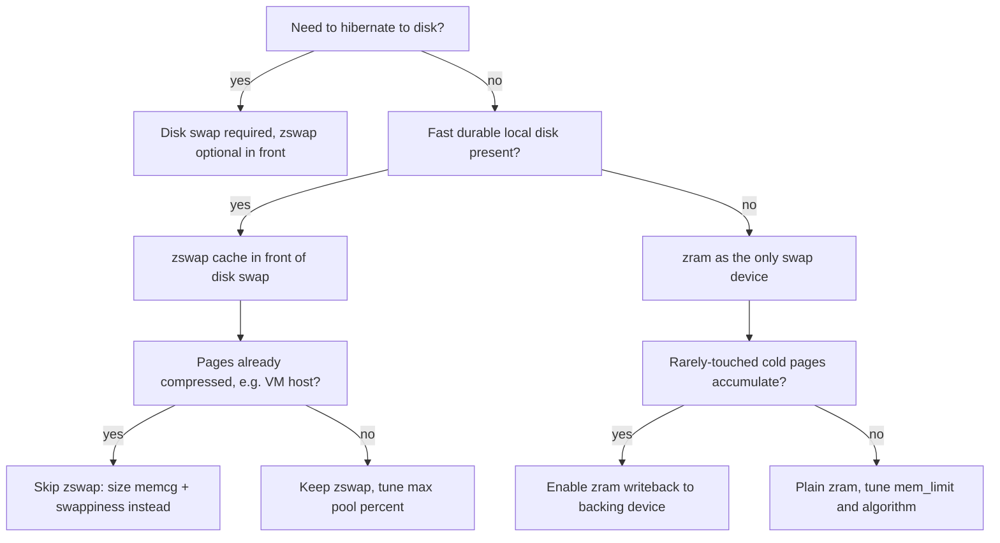
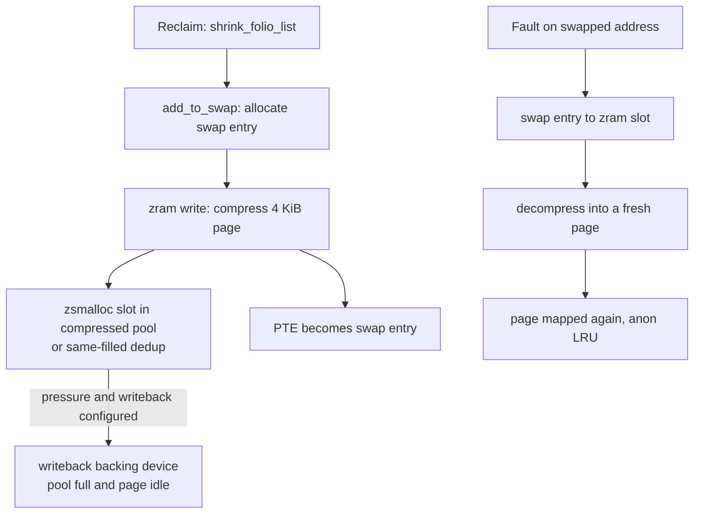

# zram & the Modern Swap Stack

## Overview

Swap went out of fashion just as memory got big — and then came back everywhere that matters. zram (a compressed RAM block device used *as* swap) is the default swap mechanism on Fedora (since 33, 2020), the only swap on most Android and ChromeOS devices, and the standard answer for diskless edge and VM hosts. This page covers the modern architecture view: the three-strategy decision space (disk swap, zswap-in-front-of-disk, zram-as-primary), the page-out/page-in paths through compression, sizing and tuning with real defaults, observability, and the constraints that surprise people (hibernation, double compression, cgroup boundaries). The byte-level internals — zsmalloc slot layout, per-algorithm behavior, the device lifecycle — live in [zram internals](../../linux/kernel/memory/zram.md), [zswap](../../linux/kernel/memory/zswap.md), and [zpool](../../linux/kernel/memory/zpool.md); this page is the operator/design angle and deliberately avoids re-explaining them.

> **Interview one-liner:** "zram swaps to compressed RAM instead of disk: reclaim compresses a 4 KiB anonymous page to ~1–1.5 KiB into a zsmalloc pool, so 2–4 GB of swap capacity costs ~1 GB of RAM — trading CPU for memory, which is exactly the right trade on a phone and usually the right one on a workstation."

## Why Swap Came Back

The textbook claim "with enough RAM you don't need swap" fails for a structural reason: **the kernel needs swap-on-able memory to reclaim at all**. Anonymous pages (heap, stacks — the majority of a phone or container workload) are not reclaimable without a swap device; without one, reclaim can only evict clean page cache, and under real memory pressure the OOM killer fires while gigabytes of compressible, rarely-touched heap sit in RAM. zram turns that math around by changing the cost of reclaiming anonymous pages from "write to slow disk" to "CPU-side compress into RAM."

Three deployment facts worth reciting:

- **Android**: zram is the swap backend on effectively all devices, paired with `lmkd` (the PSI-driven low-memory killer daemon) — a phone with 8 GB of RAM typically carries a multi-GB zram device
- **ChromeOS**: same pattern, tuned for tab-heavy workloads — compressed swap made multi-tab browsing viable on 4 GB hardware
- **Fedora 33 (2020)**: first mainstream distro to default to swap-on-zram via `zram-generator`, abandoning the default disk swapfile for desktops with sufficient RAM

### The Compression Economics

| Content of a 4 KiB page | Typical compressed size | Ratio |
|---|---|---|
| Zeroed or same-filled page | ~80 bytes metadata only | ~50× |
| Common anonymous page (heap/stack) | ~1.0–1.5 KiB with zstd | ~2.7–4× |
| LZO-friendly page (older default) | ~1.6–2 KiB | ~2–2.5× |
| Incompressible (already-compressed data) | ~4 KiB + overhead | <1× — the failure case |

The workable summary: a well-tuned zram device yields roughly **2–3× effective memory** on typical anonymous-page workloads, degrading to negative value on incompressible data — which is why `mem_limit` caps and fallback logic exist rather than blind compression. The CPU bill is real but asymmetric: compression happens at reclaim time (spare-ish cycles, often kswapd context), decompression happens at fault time (on the critical path of the waking process), so algorithm choice trades a little reclaim cost for a lot of fault latency.

## Three Strategies: Disk Swap, zswap, zram

| | Disk swap only | zswap + disk swap | zram (± writeback) |
|---|---|---|---|
| Medium | block device / swapfile | RAM pool in front of block device | compressed RAM device |
| Reclaim cost | high (I/O latency) | compress + maybe I/O | compress only |
| Capacity | as large as the disk | disk-sized, cache bounded by pool % | bounded by RAM × ratio |
| Survives reboot | yes (and hibernate) | yes | no — contents vanish |
| Double-compression risk | none | yes if pages already compressed | yes if it feeds zram writeback with compressed data |
| Best for | hibernation, low-RAM servers | servers with fast disks, DB-adjacent hosts | diskless devices, desktops, VM hosts |

The mental model that keeps the three straight: **zswap is a write-back cache for a disk swap device; zram *is* the swap device.** zswap sits in the reclaim path, compresses evicted pages into a RAM pool, and only writes through to the real swap device when the pool hits its max — so hot swapped pages come back at memory speed and cold ones age to disk. zram has no backing store at all (unless you enable its optional writeback), which is why it is simultaneously faster to reclaim to, impossible to hibernate with, and wiped on reboot.

They also combine by priority rather than by stacking: multiple swap devices are tried in `priority` order, so a host can run zram at priority 100 for the hot tier and a zswap-fronted disk device below it for overflow — each device absorbing what its economics justify. What you never combine is compression *on top of* compression in the same path (zswap in front of zram, or zram writeback receiving already-compressed zswap pages): two passes through the compressor cost more CPU than they save RAM, and the second layer's ratio collapses toward 1×.



## Anatomy of the Page-Out and Page-In Paths



What to narrate, step by step:

- **Reclaim chooses the page** (see [Multi-Gen LRU](./mglru.md) for how modern generations choose), then `add_to_swap` reserves a `swap_entry` — the swap subsystem machinery from [Swap Subsystem](../../linux/kernel/memory/swap.md), unchanged by what backs it
- **The write is synchronous compression at reclaim time**: the page's bytes go into a zsmalloc slot sized to the compressed payload (see [zpool](../../linux/kernel/memory/zpool.md) for why zsmalloc exists — conventional allocators waste too much on sub-page objects), and only the PTE's swap-entry stamp remains in the page table
- **Same-filled detection** short-circuits storage entirely: a page whose 4096 bytes are all identical (zeroed pages are everywhere) stores one element descriptor — a measurable fraction on Android-class workloads
- **Read is a minor-fault-shaped path**: fault → swap entry lookup → locate slot → decompress into a fresh page → map. No disk seek, tens of microseconds — which is why zram-topped systems show aggressive swap-in without the wall-clock penalty that made "swap" a dirty word
- **Writeback (optional)**: with a backing device configured, zram's recompression/writeback machinery migrates *idle* compressed pages out to disk, freeing pool slots — the hybrid that gives zram disk-scale capacity without giving up the fast tier

The cost model to carry forward: on disk swap, every reclaim carries I/O latency and every swap-in stalls the faulting task for milliseconds; on zram, reclaim carries CPU-bound compression (kswapd context, off the interactive path) and swap-in costs microseconds. That asymmetry is the root of every tuning recommendation below — the system should *prefer* zram write-out over almost any alternative, which is precisely what the swappiness change encodes.

## Sizing and Tuning

The canonical deployment path is `zram-generator` (systemd's tool, what Fedora ships):

```ini
# /etc/systemd/zram-generator.conf
[zram0]
zram-size = min(ram / 2, 4096)     # half of RAM, capped at 4 GiB
compression-algorithm = zstd
swap-priority = 100
# fs-type = swap                   # default: use as swap
```

The sysfs surface that actually matters (full reference in [zram internals](../../linux/kernel/memory/zram.md)):

| Tunable | Typical value | Effect |
|---|---|---|
| `/sys/block/zram0/disksize` | set once at setup | logical device size — swap capacity, not RAM used |
| `comp_algorithm` | `zstd` (desktop), `lz4` (latency-first) | reclaim CPU vs compressed size vs fault latency |
| `mem_limit` | fraction of RAM | hard cap on the compressed pool; writes fail when hit |
| `swappiness` | 100–180 on zram-first systems | zram's cheapness justifies (much) higher than the disk-era 60 |
| cgroup `memory.swap.max` | per-workload | bounds how much each cgroup can swap at all |

Tuning guidance that survives contact with production:

- **Raise swappiness on zram-only hosts**: the classic 60 default encodes "swap is slow"; when swap costs microseconds of CPU instead of milliseconds of disk, reclaiming anonymous pages *before* dropping useful page cache is often correct. This is the single most-misconfigured knob in zram deployments
- **Size `disksize` by worst-case compression, not hope**: with zstd at ~3×, a `disksize` of 2× RAM is generally unreachable-but-safe; oversized `disksize` costs nothing (sparse), undersized `mem_limit` turns writes into failures that surface as OOM-like stalls
- **Algorithm choice by device class**: `lz4` for latency-critical interactive devices (bigger pool, faster faults), `zstd` for servers and desktops (smaller pool, more capacity); `deflate` survives only in nostalgia benchmarks
- **Keep a disk swapfile *below* zram priority** on hybrids: swap devices are tried by priority, so zram absorbs the working set while the disk device catches overflow — and provides the hibernation target zram never can

### Watermarks and the Reclaim Order

Swap tuning only makes sense against the watermark machinery that triggers it. When free memory crosses `page-low`, kswapd wakes and reclaims toward `page-high`: clean page cache first (free without I/O), then anonymous pages through swap. On zram-only systems the anonymous leg is cheap, so the interesting question is the *ratio* — and `watermark_scale_factor` (how far ahead of pressure kswapd plans) matters as much as swappiness. Hosts that stall in bursts usually have kswapd waking too late and then over-reclaiming; raise `watermark_scale_factor` (default 10 → 125–250) before touching algorithm choices. The watermark numbers live in [sysctl vm docs](https://docs.kernel.org/admin-guide/sysctl/vm.html); the reclaim-order theory lives in [Swapping](../memory/swapping.md).

### Worked Example: Sizing a 16 GB Workstation

Work the numbers the way an interviewer expects:

```text
RAM: 16 GiB. Typical anon working set: 10 GiB, of which cold/idle ~4 GiB.

zram device:  disksize = 16 GiB            (sparse, logical capacity)
              mem_limit = 4 GiB            (pool ceiling)
algorithm:    zstd, observed ratio 3.0x on anon pages

Worst case:   4 GiB pool holds ~12 GiB of compressed anon pages
cost:         ~4 GiB RAM + reclaim CPU;  zero disk I/O for swap
gain:         OOM postponed until 16 + ~12 = 28 GiB of addressable
              pressure — provided the workload's ratio holds

Check:        mm_stat shows orig/compressed ratio per device in real time;
              if the ratio trends toward 1.5x, drop mem_limit or add disk swap
```

The instructive step is the last one: sizing is *empirical* — the ratio is a property of the workload (JVM heaps compress beautifully; video editors' buffers do not), so the config is a hypothesis the first week of telemetry validates or falsifies.

## How Android Composes the Stack

Android is the reference deployment because every layer is visible and the failure modes are daily-driver real:

- **zram as the only swap device**, sized as a fraction of RAM (multi-GB on modern devices), typically lz4-era defaults trending to zstd as CPUs got faster
- **lmkd** — the low-memory killer daemon — watches PSI memory pressure and per-app oom_score_adj, killing the coldest foreground-irrelevant apps *before* the kernel OOM killer runs; the swap device gives it room to work (see the [OOM Killer](./oom-killer.md) page for the kernel-side threshold machinery lmkd coexists with)
- **Per-app cgroups** bound each application's swap share, so one leaking app cannot consume the whole compressed pool
- **The observable behavior** users describe as "apps reload when I return to them": lmkd killed the background app; its cold pages *not* in zram anymore are simply gone — zram changed the cost of keeping apps warm, not the policy of which apps get kept

The generalizable lesson for server design: compression, pressure signals, and policy-killers compose into a *layered* memory hierarchy — and each layer has its own knob and its own failure signature. Android just runs the full stack where users can feel every misconfiguration.

## Observability and Failure Modes

Where to look, in the order a debugging session actually goes:

```text
# Compression ratio you are actually getting
$ cat /sys/block/zram0/mm_stat
17825792 5704268 4194304 0 1088 0    orig  compressed  mem_limit ...

# Swap volume over time (monotonic counters)
$ grep -E 'pswpin|pswpout' /proc/vmstat
pswpin  40912
pswpout 189332

# Is the system stalling on memory, or just swapping quietly?
$ cat /proc/pressure/memory
some avg10=12.40 avg60=8.11 avg300=2.02 total=...
full avg10=4.20  avg60=1.03 avg300=0.11 total=...
```

- zram device stats: `/sys/block/zram0/mm_stat` (orig/compressed sizes, mem_used_total, same-filled count — the compression ratio *you actually get*), `bd_stat` (writeback activity), `debug_stat` (failed reads/writes)
- `/proc/vmstat`: `pswpin`/`pswpout` for swap traffic volume; `/proc/swaps` for device priority and usage; per-cgroup `memory.stat` (anon, file, swap) to attribute pressure
- **PSI** (`/proc/pressure/memory`, see [PSI and DAMON](./psi-and-damon.md)): distinguishes "swapping a lot and fine" from "stalled on reclaim" — the `some`/`full` stall percentages are the health signal, not swap throughput
- cgroup `memory.events`: `oom` and `oom_kill` counters tell you whether swap exhaustion (not RAM exhaustion) is killing workloads — the zram failure mode is subtle because the device reports "full" only via its own counters

| Failure mode | Symptom | Fix |
|---|---|---|
| Incompressible workload | `mm_stat` ratio near 1×, pool fills fast | raise `mem_limit` headroom, add disk swap at lower priority, or accept more OOM pressure |
| `mem_limit` reached | failed zram writes, reclaim stalls, PSI `full` spikes | raise limit or lower disksize; enable writeback |
| Thrash loop | high `pswpin/out` + high PSI, low progress | identify the leaking/thrashing cgroup; bound with `memory.swap.max` (see [Thrashing](../virtual-memory/thrashing.md)) |
| Post-reboot amnesia | "where did my swap contents go" | expected: zram is volatile — anything needing persistence uses disk swap |
| Huge-page fragmentation of pool | uneven pool usage after THP churn | split-on-reclaim keeps slots page-sized; watch [THP & khugepaged](./thp-khugepaged.md) interactions |
| CPU regressions after enabling zram | reclaim-time compression steals cycles from latency-critical work | switch zstd → lz4, cap with `max_comp_streams`, or move to zswap + disk on compute-bound hosts |

## cgroups, Writeback, and Hibernation

- **cgroup v2 swap accounting**: `memory.swap.max` caps a cgroup's total swap usage (zram counts), `memory.swap.high` throttles before the cap — the primitive that lets a container runtime say "you may compress into shared RAM, but only 512 MiB of it." Reclaim behavior per-cgroup is detailed in [cgroup v2 internals](../../linux/kernel/memory/cgroup-v2-internals.md)
- **Writeback changes the calculus for servers**: a zram device with a backing NVMe device gives you the memory-speed tier *and* disk-scale capacity — idle compressed pages migrate out, hot pages stay. The cost is complexity: two layers of metadata and the return of "which copy is current" questions the pure-zram model never had
- **Hibernation is the hard requirement zram cannot meet**: suspend-to-disk writes a RAM image *to persistent swap*, and zram's contents are definitionally volatile. The standard hybrid answer: zram at high priority for runtime pressure, a real disk partition/file at lower priority exclusively for hibernation — and the resume path needs the matching `resume=` kernel command-line parameter pointing at that device, or the image is written but never restored
- **VM hosts beware double compression**: if guest kernels compress (zswap/zram inside guests) and the host swaps guest memory into zram, you pay two compression passes for one page — usually the wrong trade; prefer host-side zswap or plain disk swap with memcg limits
- **The OOM-killer interaction**: zram extends the cliff, it does not remove it — watch for workloads that treat swap capacity as license to leak; the endgame is still [OOM Killer](./oom-killer.md), just later and with more CPU spent on the way

## Interview Questions

1. **Why give a machine with 32 GB of RAM any swap at all?** Because without swap the kernel cannot reclaim anonymous pages — only clean page cache — so memory pressure ends at the OOM killer while compressible, idle heap sits uncompressed in RAM. zram makes reclaiming those pages cost CPU instead of disk I/O, effectively adding ~2–3× usable memory for rarely-touched data. The 32 GB machine rarely *swaps in* the classic sense; it uses swap as a pressure-release valve that changes OOM timing from "immediate" to "after the compressible cold set is absorbed."
2. **zswap vs zram — when does each win?** zswap needs a real swap device and acts as its compressed cache: it wins where durable, large swap exists (servers, anything with hibernation) and where you want hot swapped pages served from RAM. zram *is* the device: it wins where there is no acceptable disk swap (phones, ChromeOS, diskless VMs) or where desktop simplicity wins (Fedora's default). The trap answer is running zswap in front of zram — compressing data that zram will compress again — and the trap's cousin is forgetting zswap requires a disk swap target at all.
3. **Walk through what happens when a process faults on a page that was reclaimed to zram.** The PTE holds a swap entry; the fault path resolves it to the swap device, sees zram backing it, looks up the zsmalloc slot, decompresses into a freshly allocated page, maps it, and drops the slot. Total cost is CPU decompression plus one allocation — tens of microseconds — versus milliseconds-plus-queueing for a disk read. The follow-up worth volunteering: the page re-enters the LRU as an anonymous page, so a pathological loop of fault/reclaim shows up as `pswpin/out` growth and PSI stalls, not as disk I/O wait.
4. **How do you size the zram device, and what breaks if you get it wrong?** Size `disksize` generously (2× RAM is common and free — it is sparse) and constrain reality with `mem_limit`, sized by *achievable* compression (`mm_stat` ratio from real workloads, typically ~3× with zstd). Undersized `mem_limit` makes zram writes fail under pressure, which surfaces as reclaim stalls and PSI `full` spikes rather than clean errors; oversized `mem_limit` lets compression CPU burn under a workload that will never fit, delaying the OOM kill without preventing it. Both failure modes are observable, neither is fatal by design — the fatal mistake is treating swap capacity as RAM capacity.
5. **Why did Fedora raise swappiness for zram-only systems, and what is the failure mode of the old default?** The legacy 60 default encodes "swapping is slower than reading page cache from disk"; with zram, anonymous-page reclaim costs CPU-only compression, so preferring to evict page cache first is backwards on memory-constrained hosts. The old default's failure mode: page cache (including mmap'd executables) gets evicted while compressible cold heap stays resident, producing executable-refault thrashing despite free capacity in the compressed pool. High swappiness (100+) on zram-first hosts inverts the preference correctly.
6. **Can you hibernate to zram? What is the actual production pattern?** No — hibernation serializes RAM to *persistent* swap, and zram's pool is volatile by construction. Production hybrids run zram at high swap priority for runtime reclaim plus a disk partition or file at lower priority that serves as the hibernation target; suspend-to-disk writes there, and resume restores from it. The interview point is knowing hibernation is a persistence requirement, not a performance one — no amount of compression cleverness substitutes for non-volatile storage.

## Key Takeaways

- Swap exists to make anonymous pages reclaimable; zram changes its cost from disk-I/O to CPU compression, which is why it returned everywhere RAM is precious and disks are absent or slow
- Three strategies, one decision each way: disk swap for persistence/hibernation, zswap as a compressed *cache in front of* disk swap, zram as the compressed swap *device itself* — never stack compression on compression
- Economics: same-filled pages cost ~nothing, typical anonymous pages compress ~2.7–4× with zstd, incompressible pages are the failure case — measure your ratio with `mm_stat`, never assume it
- The page-out path is synchronous compression at reclaim time; the page-in path is decompress-on-fault in tens of microseconds — this latency change is what justifies raising swappiness far above disk-era defaults
- Size with `disksize` sparse and `mem_limit` real; cap workloads with cgroup v2 `memory.swap.max`/`high`; watch PSI (stalls) and `memory.events` (OOM), not swap throughput
- Hibernation requires persistent swap — the standard hybrid is zram at high priority plus a real disk swap target at lower priority
- zram extends the OOM cliff, it does not remove it: leaky workloads convert RAM pressure into CPU pressure first, OOM later — capacity planning still ends at the OOM killer
- Debug by ratio and stalls, not by throughput: `mm_stat` gives the compression ratio you actually get, PSI tells you whether swapping is hurting anyone — swap volume alone is not a problem signal

## References

- Kernel admin guide, *zram* (device setup, algorithms, mem_limit, writeback, stats): <https://docs.kernel.org/admin-guide/blockdev/zram.html>
- Kernel admin guide, *zswap* (pool behavior, max_pool_percent, same-filled pages, writeback): <https://docs.kernel.org/admin-guide/mm/zswap.html>
- Kernel admin guide, *sysctl vm* (swappiness semantics, watermark tuning): <https://docs.kernel.org/admin-guide/sysctl/vm.html>
- Kernel admin guide, *cgroup v2* (memory.swap.max, memory.swap.high, memory.events): <https://docs.kernel.org/admin-guide/cgroup-v2.html>
- Kernel admin guide, *Multi-Gen LRU* (the reclaim policy that chooses what zram receives): <https://docs.kernel.org/admin-guide/mm/multigen_lru.html>
- Kernel admin guide, *Memory Management Guide* overview (where swap sits among mm tunables): <https://docs.kernel.org/admin-guide/mm/overview.html>
- Kernel documentation, *Pressure Stall Information* (the health signal for swap-heavy hosts): <https://docs.kernel.org/accounting/psi.html>
- Fedora project, *Changes/SwapOnZram* (the F33 default-swap proposal and rationale): <https://fedoraproject.org/wiki/Changes/SwapOnZram>
- zram-generator (systemd's zram setup tool — config format used above): <https://github.com/systemd/zram-generator>
- Android Open Source Project, *lmkd* documentation (PSI-driven low-memory killing alongside zram; referenced by title — stable deep URL varies by release)
- LWN, *zswap coverage* and *zram-related memory-compression articles* (Corbet; referenced by title — article IDs omitted where not certain)

## Cross-References

- [zram internals](../../linux/kernel/memory/zram.md) — device lifecycle, compression algorithms, zsmalloc slot layout, statistics
- [zswap: Compressed Swap Cache](../../linux/kernel/memory/zswap.md) — the cache-in-front-of-disk strategy this page compares against
- [Swap Subsystem](../../linux/kernel/memory/swap.md) — swap entries, the swap cache, and allocation that sit under both zram and zswap
- [zpool: Compressed Memory Pool](../../linux/kernel/memory/zpool.md) — zsmalloc/zbud/z3fold allocator trade-offs behind the pools
- [Swapping](../memory/swapping.md) — the textbook treatment: whole-process swapping to paging
- [Multi-Gen LRU](./mglru.md) — how modern reclaim decides which pages get compressed
- [PSI and DAMON](./psi-and-damon.md) — the stall signals and access-pattern sampling that tune swap-heavy hosts
- [OOM Killer](./oom-killer.md) — the endpoint zram postpones but does not remove
- [THP & khugepaged](./thp-khugepaged.md) — huge-page splitting on reclaim and its effect on zram slots
- [Thrashing](../virtual-memory/thrashing.md) — the fault/reclaim loop this page's failure-mode table references
- [Page Reclaim](./page-reclaim.md) — the shrink-path machinery feeding pages into the swap layer
- [KSM Page Merging](../advanced/ksm-page-merging.md) — the other memory-de-duplication strategy: same-value elimination before pages ever reach reclaim
- [Buddy System](../memory/buddy-system.md) — where the pool's backing pages come from, and what fragmentation pressure zram adds back
- [Memory Compaction Internals](../../linux/kernel/memory/compaction.md) — the defragmentation machinery that keeps pool pages physically available
- [cgroup v2 Internals](../../linux/kernel/memory/cgroup-v2-internals.md) — per-cgroup swap accounting and limiting
- [Modern Linux Kernel Internals](./README.md) — places zram/MGLRU/PSI in the 2016–2026 kernel-change map
