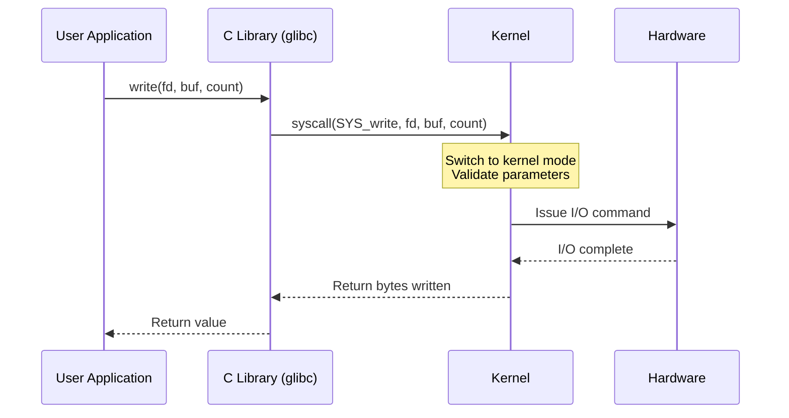
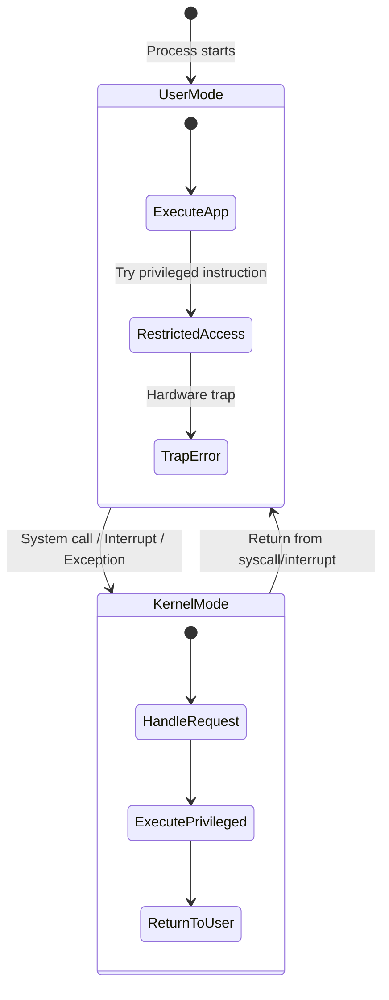
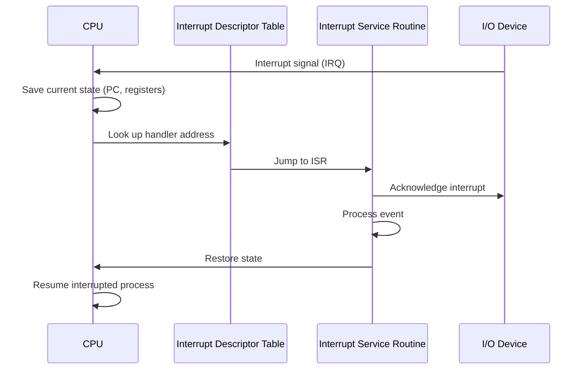

# Operating Systems Overview

## What is an Operating System?

An **Operating System (OS)** is system software that acts as an intermediary between computer hardware and user applications. It manages hardware resources, provides common services, and ensures the system is secure, efficient, and usable.

> **One-liner for interviews:** "An OS is a resource manager and an abstraction layer that provides a convenient, secure, and efficient environment for executing programs."

## Why Do We Need an OS?

Without an OS, every program would need to:
- Directly manage CPU scheduling, memory allocation, disk I/O, and network access
- Handle hardware-specific details (different drivers for every device)
- Implement its own security and access control
- Coordinate with other programs sharing the same hardware

The OS eliminates this by providing **abstraction**, **resource management**, and **protection**.

## Core Functions of an OS

```mermaid
graph TD
    A[Operating System] --> B[Process Management]
    A --> C[Memory Management]
    A --> D[File System Management]
    A --> E[I/O Management]
    A --> F[Security & Protection]
    A --> G[Networking]
    A --> H[User Interface]
    
    B --> B1[Process creation/scheduling]
    B --> B2[Thread management]
    B --> B3[IPC mechanisms]
    B --> B4[Deadlock handling]
    
    C --> C1[Allocation & deallocation]
    C --> C2[Virtual memory]
    C --> C3[Paging & segmentation]
    C --> C4[Swapping]
    
    D --> D1[File organization]
    D --> D2[Directory structure]
    D --> D3[Disk scheduling]
    D --> D4[Access control]
    
    E --> E1[Device drivers]
    E --> E2[Interrupt handling]
    E --> E3[DMA]
    E --> E4[Buffering & caching]
```



### 1. Process Management
- Creating, scheduling, and terminating processes
- Process synchronization and inter-process communication (IPC)
- Deadlock detection, prevention, and recovery

### 2. Memory Management
- Tracking which parts of memory are in use
- Allocating and deallocating memory as needed
- Virtual memory: using disk as extension of RAM
- Paging, segmentation, and page replacement algorithms

### 3. File System Management
- Organizing files into directories
- Managing free space on storage devices
- Providing access control and permissions
- Supporting multiple file system types (ext4, NTFS, XFS, etc.)

### 4. I/O Management
- Managing device drivers for hardware communication
- Interrupt handling and DMA transfers
- Buffering, caching, and spooling

### 5. Security & Protection
- User authentication and authorization
- Access control lists (ACLs) and capabilities
- Process isolation and sandboxing

## Types of Operating Systems

| Type | Description | Examples |
|------|-------------|----------|
| **Batch OS** | Executes jobs in batches without user interaction | Early IBM mainframes |
| **Time-Sharing OS** | Multiple users share the system via rapid context switching | Unix, Multics |
| **Real-Time OS (RTOS)** | Guarantees response within strict time constraints | VxWorks, FreeRTOS, QNX |
| **Distributed OS** | Manages a network of computers as a single system | Amoeba, Plan 9 |
| **Embedded OS** | Designed for embedded systems with limited resources | Embedded Linux, Zephyr |
| **Mobile OS** | Optimized for smartphones and tablets | Android, iOS |
| **Cluster OS** | Manages a cluster of machines as one | Google Borg, Kubernetes |

## OS Architecture

### Monolithic Kernel
All OS services run in **kernel space** with full hardware access.

```
┌─────────────────────────────────┐
│          User Space             │
│  ┌───────┐  ┌───────┐  ┌────┐ │
│  │ App 1 │  │ App 2 │  │ ...│ │
│  └───┬───┘  └───┬───┘  └──┬─┘ │
├──────┼──────────┼─────────┼────┤
│      ▼          ▼         ▼    │
│  ┌──────────────────────────┐  │
│  │      Kernel Space        │  │
│  │  ┌─────┐ ┌────┐ ┌─────┐ │  │
│  │  │ FS  │ │ MM │ │ Net │  │  │
│  │  ├─────┤ ├────┤ ├─────┤  │  │
│  │  │IPC  │ │Sched│ │Driver│ │  │
│  │  └─────┘ └────┘ └─────┘  │  │
│  └──────────────────────────┘  │
│           Hardware             │
└─────────────────────────────────┘
```

**Pros:** Fast (no mode switches for syscalls), direct hardware access  
**Cons:** A bug in any module can crash the entire kernel  
**Examples:** Linux, traditional Unix

### Microkernel
Only essential services (IPC, basic scheduling, memory management) run in kernel space. Everything else runs in **user space**.

```
┌───────────────────────────────────┐
│           User Space              │
│  ┌──────┐ ┌──────┐ ┌──────────┐  │
│  │ App  │ │  FS  │ │  Driver  │  │
│  └──┬───┘ └──┬───┘ └────┬─────┘  │
│     │        │          │         │
│  ┌──┴────────┴──────────┴──────┐  │
│  │    Message Passing (IPC)    │  │
│  └────────────┬────────────────┘  │
├───────────────┼───────────────────┤
│    Microkernel│                   │
│  ┌────────────┴────────────────┐  │
│  │ Scheduling │ IPC │ MM       │  │
│  └────────────────────────────┘  │
│           Hardware               │
└───────────────────────────────────┘
```

**Pros:** Modular, fault isolation, easier to maintain  
**Cons:** Performance overhead from message passing  
**Examples:** QNX, MINIX, L4, Mach

### Hybrid Kernel
Combines monolithic and microkernel approaches.

**Examples:** Windows NT, macOS (XNU kernel)

### Exokernel
Minimal kernel that exports hardware resources directly to applications.

**Examples:** MIT Exokernel (research)

## System Calls

System calls are the **interface between user space and kernel space**. When a program needs a privileged operation (file I/O, process creation, memory allocation), it makes a system call.



### Categories of System Calls

| Category | Examples |
|----------|---------|
| **Process Control** | `fork()`, `exec()`, `exit()`, `wait()`, `kill()` |
| **File Management** | `open()`, `read()`, `write()`, `close()`, `stat()` |
| **Device Management** | `ioctl()`, `read()`, `write()` |
| **Information Maintenance** | `getpid()`, `alarm()`, `sleep()`, `time()` |
| **Communication** | `pipe()`, `shmget()`, `mmap()`, `socket()` |
| **Protection** | `chmod()`, `chown()`, `umask()` |

### Example: How `fork()` Works

```c
#include <stdio.h>
#include <unistd.h>
#include <sys/wait.h>

int main() {
    pid_t pid = fork();
    
    if (pid < 0) {
        perror("fork failed");
        return 1;
    } else if (pid == 0) {
        // Child process
        printf("Child: PID=%d, Parent PID=%d\n", getpid(), getppid());
        _exit(0);
    } else {
        // Parent process
        printf("Parent: PID=%d, Child PID=%d\n", getpid(), pid);
        wait(NULL);  // Wait for child to finish
    }
    return 0;
}
```

## Dual-Mode Operation

Modern CPUs support at least two modes:

- **User Mode (mode bit = 1):** Restricted access. Cannot execute privileged instructions.
- **Kernel Mode (mode bit = 0):** Full access to hardware and all instructions.



**Transition mechanism:**
1. User program issues a system call (e.g., `int 0x80` on x86, `syscall` on x86-64)
2. CPU switches to kernel mode, jumps to interrupt handler
3. Kernel validates the request, executes it
4. Kernel returns result and switches back to user mode

## Interrupts

**Interrupts** are signals that cause the CPU to stop current execution and handle an event.

| Type | Source | Examples |
|------|--------|---------|
| **Hardware Interrupt** | External devices | Keyboard press, disk I/O complete, timer |
| **Software Interrupt** | Program instruction | System calls (`int 0x80`, `syscall`) |
| **Exception** | CPU internal | Division by zero, page fault, segmentation fault |

### Interrupt Handling Flow



## The Linux Kernel

Linux is the most widely deployed OS kernel, running on everything from smartphones to supercomputers.

### Key Facts
- **Type:** Monolithic (with loadable kernel modules)
- **First release:** 1991 by Linus Torvalds
- **License:** GPLv2
- **Lines of code:** ~30+ million (as of 2024)
- **Architecture support:** x86, ARM, RISC-V, MIPS, PowerPC, etc.

### Linux Kernel Architecture

```
┌──────────────────────────────────────────┐
│              User Space                  │
│  ┌──────┐ ┌──────┐ ┌──────┐ ┌────────┐  │
│  │Shell │ │ Web  │ │ DB   │ │ System │  │
│  │      │ │Server│ │      │ │  D     │  │
│  └──┬───┘ └──┬───┘ └──┬───┘ └───┬────┘  │
├─────┼────────┼────────┼─────────┼────────┤
│     ▼        ▼        ▼         ▼        │
│  ┌─────────────────────────────────────┐ │
│  │     System Call Interface (SCI)     │ │
│  ├─────────────────────────────────────┤ │
│  │  Process   │  Memory  │   VFS      │ │
│  │  Manager   │  Manager │            │ │
│  ├────────────┼──────────┼────────────┤ │
│  │  Network   │  IPC     │  Security  │ │
│  │  Stack     │          │  (LSM)     │ │
│  ├─────────────────────────────────────┤ │
│  │    Architecture-Dependent Code      │ │
│  └─────────────────────────────────────┘ │
│              Kernel Space                │
├──────────────────────────────────────────┤
│              Hardware                    │
└──────────────────────────────────────────┘
```

## Real-World OS Examples

| OS | Kernel Type | Use Case | Notable Feature |
|----|-------------|----------|-----------------|
| **Linux** | Monolithic | Servers, embedded, Android | Open source, massive ecosystem |
| **Windows NT** | Hybrid | Desktop, server | Largest desktop market share |
| **macOS (XNU)** | Hybrid | Apple desktops/laptops | Mach microkernel + BSD monolithic |
| **FreeBSD** | Monolithic | Servers, networking | ZFS, Jails |
| **QNX** | Microkernel | Automotive, medical | Real-time, fault-tolerant |
| **Android** | Modified Linux | Mobile devices | Binder IPC, ART runtime |
| **Fuchsia** | Microkernel (Zircon) | Google IoT/embedded | Capability-based security |

## Interview Questions

### Beginner

**Q1: What is the main purpose of an operating system?**  
A: The OS manages hardware resources, provides abstractions (files, processes, virtual memory), ensures security and isolation between programs, and provides a convenient interface for users and applications.

**Q2: What is the difference between kernel mode and user mode?**  
A: Kernel mode has unrestricted access to hardware and can execute privileged instructions. User mode is restricted — programs cannot directly access hardware or execute privileged instructions. Transitions happen via system calls, interrupts, or exceptions.

**Q3: What is a system call?**  
A: A system call is a programmatic way for a user-space application to request a service from the kernel (e.g., file I/O, process creation). It triggers a mode switch from user to kernel mode.

### Intermediate

**Q4: Compare monolithic and microkernel architectures.**  
A: Monolithic kernels run all OS services in kernel space (fast but fragile). Microkernels run only essential services in kernel space, with other services in user space communicating via message passing (modular but slower due to IPC overhead). Hybrid kernels combine both approaches.

**Q5: What happens when you type `ls` in a terminal?**  
A: 1) Shell reads input → 2) Parses command → 3) `fork()` creates child process → 4) `execve("/bin/ls", ...)` replaces child's memory with `ls` program → 5) Kernel schedules the process → 6) `ls` makes `openat()`, `getdents()`, `write()` syscalls → 7) `ls` exits → 8) Shell calls `wait()` and reaps child.

**Q6: Explain the role of interrupts in an OS.**  
A: Interrupts are signals from hardware or software that cause the CPU to pause current execution, save state, and jump to an interrupt handler. They enable the OS to respond to events (I/O completion, timer ticks, errors) without busy-waiting. Timer interrupts are essential for preemptive scheduling.

### FAANG-Level

**Q7: How would you design an OS for a spacecraft?**  
A: Key requirements: real-time guarantees (hard RTOS), fault tolerance (redundancy, error-correcting code), minimal footprint, deterministic scheduling (rate-monotonic or deadline-monotonic), formal verification of critical paths, graceful degradation. Use a microkernel for isolation. Watchdog timers for recovery. No virtual memory (deterministic memory allocation). See: VxWorks (used in Mars rovers).

**Q8: Why is Linux considered monolithic despite having loadable kernel modules?**  
A: Loadable kernel modules (LKMs) run in kernel space with full privileges — they're dynamically loaded monolithic code, not user-space services. The key distinction from a microkernel is that modules share the same address space and have no isolation from each other. A bug in a module can crash the entire kernel. The debate (Torvalds vs. Tanenbaum) centered on this: Linux chose performance over modularity.

**Q9: Explain the trade-offs between synchronous and asynchronous I/O from an OS perspective.**  
A: Synchronous I/O blocks the calling process until completion (simple but wastes CPU during waits). Asynchronous I/O returns immediately; the OS notifies completion via signals, callbacks, or completion ports (complex but efficient). Linux provides both: `read()`/`write()` (sync), `io_submit()`/`io_uring` (async). The epoll/io_uring evolution shows the industry moving toward async for high-performance servers.

## Common Mistakes

1. **Confusing processes with programs:** A program is static code on disk; a process is a running instance with its own memory, state, and resources.
2. **Thinking the OS is the kernel:** The OS includes the kernel plus system libraries, daemons, and utilities. The kernel is just the core.
3. **Assuming system calls are function calls:** System calls involve a mode switch (user→kernel→user), which has significant overhead compared to regular function calls.
4. **Overlooking the role of interrupts:** Many students forget that preemptive scheduling depends on timer interrupts. Without them, a CPU-bound process could monopolize the CPU forever.

## Summary & Revision Notes

| Concept | Key Point |
|---------|-----------|
| OS Purpose | Resource management + abstraction + protection |
| Kernel vs User Mode | Kernel = unrestricted; User = restricted; transitions via syscalls/interrupts |
| System Calls | Interface between user space and kernel; involves mode switch |
| Monolithic Kernel | All services in kernel space (Linux, Unix) |
| Microkernel | Minimal kernel; services in user space (QNX, MINIX) |
| Hybrid Kernel | Combination (Windows NT, macOS XNU) |
| Interrupts | Hardware/software signals that trigger kernel handlers |
| Dual-mode | mode bit: 0 = kernel, 1 = user |

## Cross-References

- [Processes](./processes/README.md) - Process creation, management, and IPC
- [Threads](./threads/README.md) - Lightweight execution units
- [CPU Scheduling](./scheduling/README.md) - How the CPU is allocated
- [Memory Management](./memory/README.md) - RAM allocation and virtual memory
- [I/O Systems](./io/README.md) - Hardware interaction and device drivers
- [Synchronization](./synchronization/README.md) - Coordination between concurrent entities
- [Boot Process](./boot/README.md) - How the OS starts up


## Cross References

- [CPU Architecture](../arch/cpu/README.md)
- [Cache Hierarchy](../arch/memory-hierarchy/README.md)
- [Networks Overview](../networks/overview.md)
- [DBMS Overview](../dbms/overview.md)
- [Concurrency Overview](../concurrency/overview.md)
