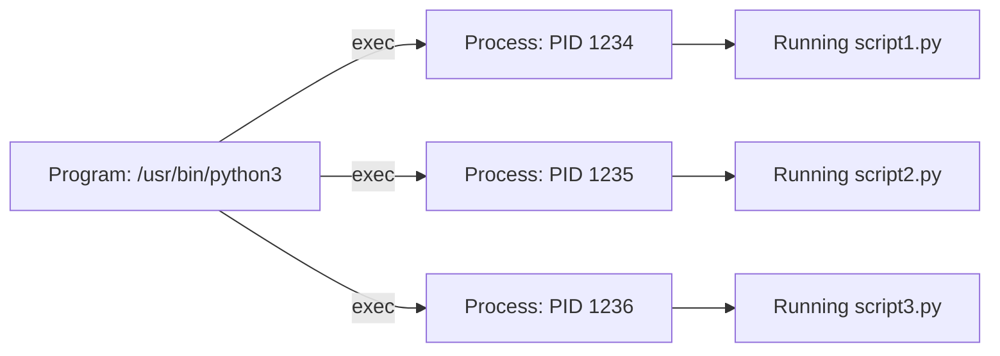
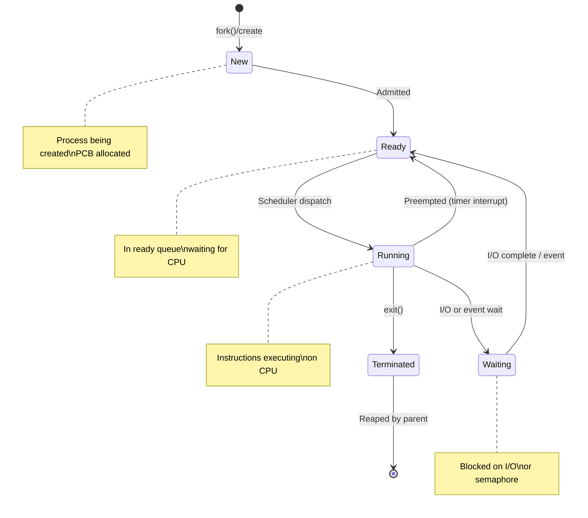
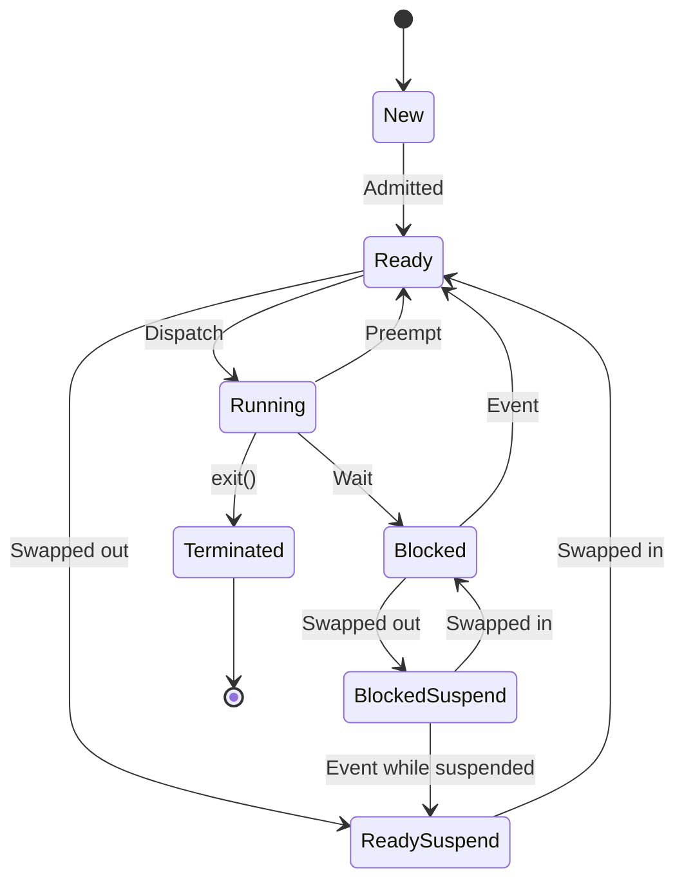
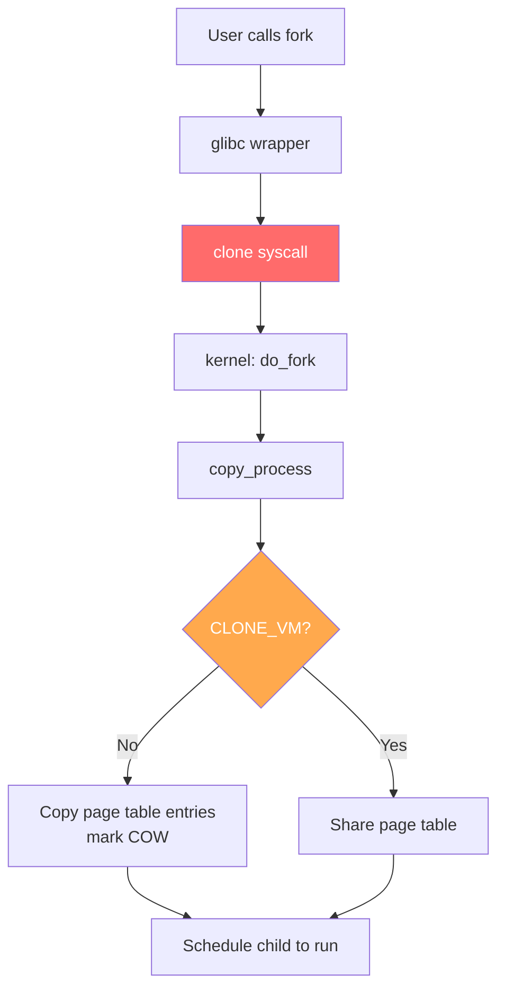
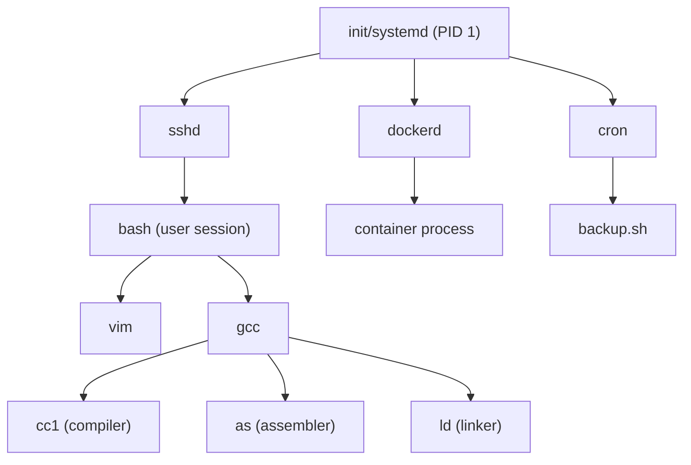
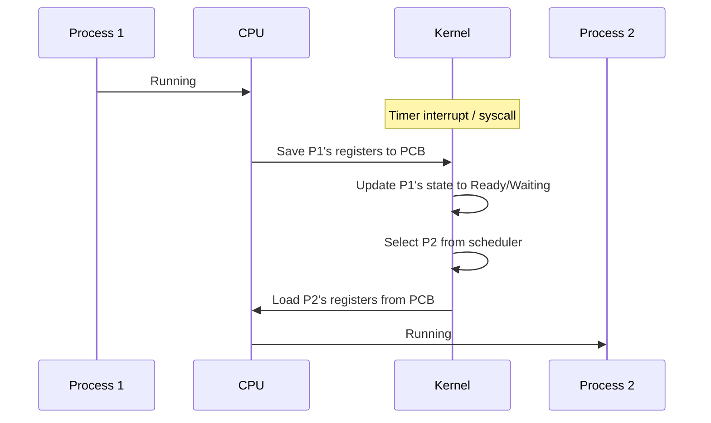

# Processes

## What is a Process?

A **process** is a program in execution. It is the fundamental unit of work in an operating system. When you double-click an application or run a command in the terminal, the OS creates a process to manage its execution.

> **Interview one-liner:** "A process is a program in execution — it includes the program code, current activity (program counter, registers), stack, heap, and associated OS resources."

## Process vs Program

| Aspect | Program | Process |
|--------|---------|---------|
| **Nature** | Static, passive entity (code on disk) | Dynamic, active entity (in memory) |
| **Lifetime** | Exists permanently until deleted | Created, runs, terminates |
| **Resources** | No allocated resources | Has memory, file descriptors, CPU time |
| **Multiplicity** | One program can create many processes | Each process is unique |
| **Location** | Stored on secondary storage (disk) | Resides in main memory (RAM) |
| **State** | Stateless | Has state (registers, PC, stack) |



## Process Lifecycle

A process transitions through several states during its lifetime. The exact states vary by OS, but the classic five-state model is widely used:



### State Descriptions

| State | Description | Entry Condition | Exit Condition |
|-------|-------------|----------------|----------------|
| **New** | Process is being created | `fork()`, `clone()`, system boot | OS finishes initialization |
| **Ready** | Waiting to be assigned to CPU | Admitted, I/O complete, preempted | Scheduler selects it |
| **Running** | Instructions being executed | Dispatched by scheduler | Preempted, blocks, or terminates |
| **Waiting (Blocked)** | Waiting for some event | I/O request, `wait()`, semaphore | Event occurs / signal received |
| **Terminated** | Finished execution | `exit()`, signal, error | Reaped by parent (`wait()`) |

### Two-State Model (Simplified)

In some embedded or simple systems, only two states are used:
- **Running** — currently executing
- **Not-running** — everything else (ready + waiting combined)

### Extended Seven-State Model

Modern OSes add suspended states for processes swapped out of memory:



## Process Components (Memory Layout)

Every process has its own virtual address space, typically organized as:

```
High Address ┌──────────────────┐ 0xFFFFFFFF (4GB on 32-bit)
             │   Kernel Space   │ (OS reserved - not accessible to user)
             ├──────────────────┤
             │      Stack       │ ↓ Grows downward
             │   (local vars,   │   (function calls, return addresses)
             │    return addr)  │
             │        ↓         │
             │                  │
             │    (unused/free) │
             │                  │
             │        ↑         │
             │      Heap        │ ↑ Grows upward
             │   (malloc/new)   │   (dynamically allocated memory)
             ├──────────────────┤
             │   BSS Segment    │ (uninitialized global/static vars)
             ├──────────────────┤
             │   Data Segment   │ (initialized global/static vars)
             ├──────────────────┤
             │   Text Segment   │ (executable code, read-only)
Low Address  └──────────────────┘ 0x00000000
```

### Segment Details

| Segment | Contents | Permissions | Notes |
|---------|----------|-------------|-------|
| **Text** | Executable code | Read + Execute | Shared across processes running same program |
| **Data** | Initialized global/static variables | Read + Write | `int x = 42;` |
| **BSS** | Uninitialized global/static variables | Read + Write | `int y;` — zero-initialized by OS |
| **Heap** | Dynamically allocated memory | Read + Write | Managed by `malloc()`/`free()` |
| **Stack** | Local variables, function frames, return addresses | Read + Write | LIFO structure, managed automatically |

## Process Creation: fork(), vfork(), and clone()

### fork() — The Standard Process Creator

`fork()` creates a child process that is an almost exact copy of the parent. The child gets a copy of the parent's address space (via Copy-on-Write), same open file descriptors, and same environment.

```c
#include <stdio.h>
#include <unistd.h>
#include <sys/wait.h>

int main() {
    pid_t pid = fork();
    
    if (pid < 0) {
        // Fork failed
        perror("fork");
        return 1;
    } else if (pid == 0) {
        // Child process
        printf("Child: PID=%d, PPID=%d\n", getpid(), getppid());
        // Replace with a different program
        execlp("ls", "ls", "-la", NULL);
        perror("execlp");  // Only reached if exec fails
    } else {
        // Parent process
        printf("Parent: PID=%d, child PID=%d\n", getpid(), pid);
        int status;
        waitpid(pid, &status, 0);  // Wait for child
        if (WIFEXITED(status)) {
            printf("Child exited with status %d\n", WEXITSTATUS(status));
        }
    }
    return 0;
}
```

**Key properties of `fork()`:**
- Returns **twice**: 0 in the child, child's PID in the parent, -1 on failure
- Uses **Copy-on-Write (COW)**: pages are shared until one process writes
- Child inherits: open file descriptors, signal handlers, working directory, environment
- Child differs: PID, PPID, pending signals cleared, file locks not inherited

### vfork() — Optimized for Immediate exec()

`vfork()` creates a child that shares the parent's address space **without** copying. The parent is **suspended** until the child calls `exec()` or `_exit()`.

```c
pid_t pid = vfork();
if (pid == 0) {
    // Child: MUST NOT modify parent's memory (undefined behavior!)
    // MUST call exec() or _exit() — nothing else is safe
    execlp("ls", "ls", NULL);
    _exit(1);  // Use _exit(), not exit() (exit flushes parent's buffers)
}
// Parent resumes after child calls exec() or _exit()
```

| Property | fork() | vfork() |
|----------|--------|---------|
| Address space | Copy-on-Write (lazy copy) | **Shared** (no copy at all) |
| Parent behavior | Continues immediately | **Blocked** until child exec/exit |
| Safety | Safe to modify memory | **Must not** modify memory before exec |
| Performance | Fast with COW | Faster (no page table copy) |
| Use case | General process creation | Child will immediately exec |
| Risk | Low | Parent's stack corrupted if child modifies it |

### clone() — Fine-Grained Sharing

`clone()` is the Linux-specific system call that gives fine-grained control over what is shared between parent and child. Both `fork()` and `pthread_create()` are implemented using `clone()` internally.

```c
#define _GNU_SOURCE
#include <sched.h>
#include <stdio.h>
#include <stdlib.h>

#define STACK_SIZE (1024 * 1024)  // 1 MB

int child_func(void *arg) {
    printf("Child: PID=%d, says hello!\n", getpid());
    return 0;
}

int main() {
    char *stack = malloc(STACK_SIZE);
    // Clone with shared memory, file system, files; separate signal handlers
    int flags = CLONE_VM | CLONE_FS | CLONE_FILES | SIGCHLD;
    
    pid_t pid = clone(child_func, stack + STACK_SIZE, flags, NULL);
    
    if (pid == -1) {
        perror("clone");
        return 1;
    }
    
    waitpid(pid, NULL, 0);
    printf("Parent: child finished\n");
    free(stack);
    return 0;
}
```

**Key clone() flags:**

| Flag | What's Shared | Without flag (fork-like) |
|------|--------------|-------------------------|
| `CLONE_VM` | Same address space | Separate (COW) |
| `CLONE_FS` | Same filesystem info (umask, root) | Copy |
| `CLONE_FILES` | Same file descriptor table | Copy |
| `CLONE_SIGHAND` | Same signal handlers | Copy |
| `CLONE_THREAD` | Same thread group (same PID to user) | Separate PID |
| `CLONE_PARENT` | Same parent process | Child's parent is caller |

### System Call Chain in Linux



### Real-World fork() Patterns

**Pattern 1: Fork-exec (most common)**
```c
pid_t pid = fork();
if (pid == 0) {
    // Child: redirect I/O, then exec
    dup2(fd, STDIN_FILENO);
    close(fd);
    execvp(args[0], args);
    perror("execvp");
    _exit(127);
}
```

**Pattern 2: Daemon creation (double fork)**
```c
// First fork: create child, parent exits
if (fork() > 0) exit(0);

// Child becomes session leader
setsid();

// Second fork: prevent acquiring controlling terminal
if (fork() > 0) exit(0);

// Now running as daemon
chdir("/");
close(STDIN_FILENO);
close(STDOUT_FILENO);
close(STDERR_FILENO);
```

**Pattern 3: Pre-forked server**
```c
// Create N worker processes upfront
for (int i = 0; i < NUM_WORKERS; i++) {
    if (fork() == 0) {
        // Worker loop: accept connections on shared socket
        while (1) {
            int conn = accept(server_fd, ...);
            handle_request(conn);
        }
    }
}
// Parent: monitor workers, restart if needed
```

## Process Control Block (PCB)

The **PCB** (called `task_struct` in Linux) is the kernel's data structure for each process:

```c
// Simplified version of Linux's task_struct
struct task_struct {
    // Identity
    pid_t pid;                    // Process ID
    pid_t tgid;                   // Thread group ID (= PID of group leader)
    pid_t ppid;                   // Parent PID
    uid_t uid, euid;              // Real and effective user ID
    gid_t gid, egid;              // Real and effective group ID
    
    // State
    volatile long state;          // TASK_RUNNING, TASK_INTERRUPTIBLE, etc.
    int exit_code;                // Exit status
    int exit_state;               // EXIT_ZOMBIE, EXIT_DEAD
    
    // Scheduling
    int prio, static_prio;       // Priority values
    unsigned int policy;          // SCHED_NORMAL, SCHED_FIFO, etc.
    unsigned long long vruntime;  // CFS virtual runtime
    struct sched_entity se;       // CFS scheduling entity
    
    // Memory
    struct mm_struct *mm;         // Memory descriptor (page tables, VMAs)
    struct mm_struct *active_mm;  // For kernel threads
    
    // Files
    struct fs_struct *fs;         // Filesystem info (cwd, root)
    struct files_struct *files;   // Open file descriptor table
    struct signal_struct *signal; // Signal handlers
    
    // Relationships
    struct task_struct *parent;
    struct list_head children;    // Linked list of children
    struct list_head sibling;     // Linkage in parent's children list
};
```

## Process Attributes

| Attribute | Description |
|-----------|-------------|
| **PID** | Unique process identifier |
| **PPID** | Parent process identifier |
| **UID/GID** | User and group who own the process |
| **State** | Current state (running, waiting, stopped, etc.) |
| **Priority** | Scheduling priority |
| **Program Counter** | Address of next instruction |
| **Registers** | CPU register values |
| **Memory pointers** | Base and limit registers, page table |
| **Open files** | List of file descriptors |
| **Signal handlers** | How signals are handled |

## Viewing Processes in Linux

```bash
# List all processes
ps aux

# Process tree showing parent-child relationships
pstree -p

# Detailed process info
cat /proc/<PID>/status

# Open files of a process
ls -l /proc/<PID>/fd

# Environment variables
cat /proc/<PID>/environ | tr '\0' '\n'

# Current working directory
ls -l /proc/<PID>/cwd

# Memory maps
cat /proc/<PID>/maps

# Real-time process monitoring
top
htop

# View process limits
cat /proc/<PID>/limits

# View process resource usage
cat /proc/<PID>/stat
cat /proc/<PID>/io

# Count processes
ps aux | wc -l

# Find process by name
pgrep -a nginx

# Trace system calls
strace -p <PID>

# View process tree with dependencies
ps -ejH
```

## Process Relationships



## Process Termination

A process can terminate in several ways:

1. **Normal exit** — `exit(0)` or `return` from `main()`
2. **Error exit** — `exit(1)` or non-zero status
3. **Fatal signal** — killed by signal (SIGKILL, SIGSEGV, etc.)
4. **Parent termination** — orphaned, adopted by init

**Exit sequence:**
1. Process calls `exit()` → C library flushes I/O buffers, calls `atexit()` handlers
2. Kernel releases resources: memory, file descriptors, IPC resources
3. Process state becomes `EXIT_ZOMBIE` (zombie) — PCB retained for parent to read exit status
4. Parent calls `wait()`/`waitpid()` → reads status, kernel frees PCB
5. If parent doesn't call `wait()`, zombie persists (resource leak)

```c
// Proper child reaping
int status;
pid_t pid = waitpid(-1, &status, WNOHANG);  // Non-blocking
if (WIFEXITED(status)) {
    printf("Exited with %d\n", WEXITSTATUS(status));
} else if (WIFSIGNALED(status)) {
    printf("Killed by signal %d\n", WTERMSIG(status));
}

// Alternative: avoid zombies with signal handler
signal(SIGCHLD, SIG_IGN);  // Auto-reap children (Linux-specific)
```

## Context Switching

When the OS switches from one process to another, it performs a **context switch**:



**Context switch cost:** ~1-10 μs on modern hardware. Includes:
- Saving/restoring registers (program counter, stack pointer, general registers)
- Switching page tables (flushing TLB — expensive!)
- Pipeline flush
- Cache pollution (working set lost)

## Interview Questions

### Beginner

**Q1: What is the difference between a process and a thread?**  
A: A process is an independent program with its own memory space, while threads are lightweight execution units within a process that share the same memory space. Processes don't share memory (need IPC); threads share code, data, and heap but have their own stack and registers.

**Q2: What is a PID?**  
A: A Process IDentifier is a unique non-negative integer assigned by the OS to each process. PID 1 is the init process (systemd on modern Linux). PIDs are reused after processes terminate (after the PID wraps around).

**Q3: Can two processes share memory?**  
A: Not by default — each process has its own virtual address space. However, processes can explicitly share memory using mechanisms like shared memory (`shmget`/`shmat`), memory-mapped files (`mmap`), or POSIX shared memory (`shm_open`).

### Intermediate

**Q4: What is the difference between a zombie and an orphan process?**  
A: A zombie is a terminated process whose exit status hasn't been collected by its parent (still has an entry in the process table). An orphan is a running process whose parent has terminated — it's adopted by init/systemd (PID 1). See [Zombie and Orphan Processes](./zombie-orphan.md).

**Q5: What information is stored in the process control block (PCB)?**  
A: The PCB stores: process state, program counter, CPU registers, CPU scheduling info (priority, queue pointers), memory management info (page table, base/limit registers), accounting info (CPU time, time limits), I/O status (open files, allocated devices), and signal handlers. See [Process Control Block](./pcb.md).

**Q6: When would you use `vfork()` instead of `fork()`?**  
A: Use `vfork()` when the child process will immediately call `exec()` (e.g., launching a shell command). `vfork()` avoids copying the parent's page table entirely, making it faster. However, it's dangerous — the child must not modify any memory before `exec()`. In practice, modern `fork()` with COW is fast enough that `vfork()` is rarely needed.

### FAANG-Level

**Q7: How does `fork()` work internally in Linux?**  
A: Linux uses **copy-on-write (COW)**. `fork()` creates a new process by duplicating the parent's page table entries, but marks all pages as read-only and shared. When either process writes to a page, a page fault occurs, and the kernel copies that specific page (COW). This makes `fork()` very fast — no actual memory copying until necessary. Linux also uses `clone()` internally, which allows fine-grained sharing between parent and child.

**Q8: How would you detect and handle a fork bomb?**  
A: A fork bomb is a process that recursively forks to exhaust system resources. Detection: monitor process count growth (`ps aux | wc -l`). Prevention: use `ulimit -u` (max user processes), cgroups (`pids.max`), or seccomp to restrict `fork()`. Recovery: if not already locked out, kill the bomb process tree (`kill -9 -1` for your user, or use cgroup freezer). Modern Linux has `/proc/sys/kernel/threads-max` and PID limits.

**Q9: Explain the tradeoffs of COW in `fork()`. When does it help, and when can it hurt?**  
A: **Helps:** When child calls `exec()` immediately (most common case) — no pages are ever copied, only the page table. When child reads parent's data without modification — shared pages save memory. **Hurts:** When parent and child both write to most pages — page faults for every write, each triggering a copy. This is worse than eager copying if nearly all pages will be modified. Modern Linux has `MADV_FREE` / `MADV_DONTNEED` hints and `posix_spawn()` to avoid unnecessary COW overhead.

## Common Mistakes

1. **Confusing PID with TID:** PID identifies a process; TID identifies a thread. In Linux, `getpid()` returns the same value for all threads in a process; `gettid()` returns unique values.
2. **Assuming processes run in parallel:** On a single-core CPU, processes are interleaved (concurrent) but not truly parallel. Only multi-core systems achieve true parallelism.
3. **Forgetting that `fork()` returns twice:** Once in the parent (child's PID), once in the child (0). A common bug is not checking the return value.
4. **Memory leak in fork:** If parent has large heap, `fork()` duplicates the page table. If the child immediately calls `exec()`, the COW pages are wasted. Use `posix_spawn()` or `vfork()` for efficiency.
5. **Using `exit()` in child after `vfork()`:** Must use `_exit()` — `exit()` flushes stdio buffers that belong to the parent.

## Summary

| Concept | Key Point |
|---------|-----------|
| Process | Program in execution with own memory space |
| PID | Unique identifier for each process |
| Memory Layout | Text → Data → BSS → Heap ↓ ... ↑ Stack |
| PCB | OS data structure tracking all process info |
| Process States | New → Ready → Running → Waiting → Terminated |
| Parent-child | `fork()` creates child; `exec()` replaces code; `wait()` reaps |
| fork() | COW copy of parent; returns twice |
| vfork() | Shared address space; parent blocked; child must exec() |
| clone() | Fine-grained sharing; basis for fork() and pthread_create() |

## Cross-References

- [Process Creation](./creation.md) - How processes are created
- [Process Control Block](./pcb.md) - OS data structure for processes
- [Process States](./states.md) - Process lifecycle
- [Context Switching](./context-switching.md) - How the CPU switches between processes
- [IPC](./ipc.md) - How processes communicate
- [Zombie & Orphan](./zombie-orphan.md) - Abnormal process states
- [Daemons](./daemons.md) - Background processes
- [Threads](../threads/README.md) - Lightweight process alternatives
- [Scheduling](../scheduling/README.md) - How processes get CPU time

## References

- Silberschatz, A., Galvin, P.B., Gagne, G. *Operating System Concepts*, 10th Edition. Wiley, 2018. (Chapters 3-4: Processes & Threads)
- Love, R. *Linux Kernel Development*, 3rd Edition. Addison-Wesley, 2010. (Chapter 3: Process Management)
- Bovet, D.P., Cesati, M. *Understanding the Linux Kernel*, 3rd Edition. O'Reilly, 2005. (Chapter 3: Processes)
- Kerrisk, M. *The Linux Programming Interface*. No Starch Press, 2010. (Chapters 24-27: Process Creation, etc.)
- `man 2 fork`, `man 2 clone`, `man 2 vfork` — Linux manual pages
- Linux kernel source: `kernel/fork.c` — implementation of fork, vfork, clone
