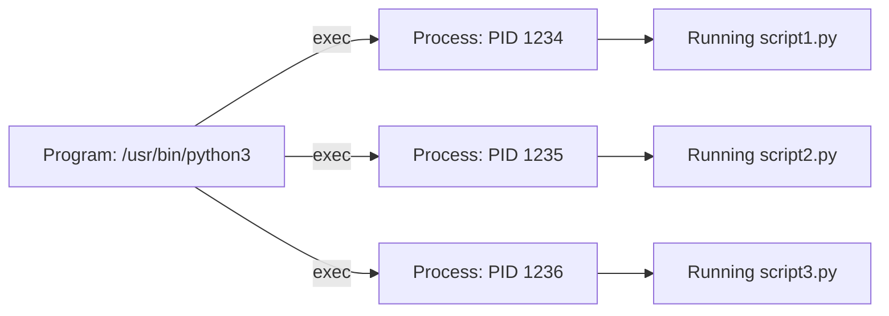
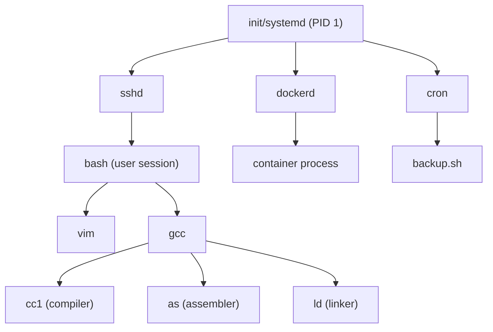

# Processes

## What is a Process?

A **process** is a program in execution. It is the fundamental unit of work in an operating system. When you double-click an application or run a command in the terminal, the OS creates a process to manage its execution.

> **Interview one-liner:** "A process is a program in execution — it includes the program code, current activity (program counter, registers), stack, heap, and associated OS resources."

## Process vs Program

| Aspect | Program | Process |
|--------|---------|---------|
| **Nature** | Static, passive entity (code on disk) | Dynamic, active entity (in memory) |
| **Lifetime** | Exists permanently until deleted | Created, runs, terminates |
| **Resources** | No allocated resources | Has memory, file descriptors, CPU time |
| **Multiplicity** | One program can create many processes | Each process is unique |
| **Location** | Stored on secondary storage (disk) | Resides in main memory (RAM) |



## Process Components (Memory Layout)

Every process has its own virtual address space, typically organized as:

```
High Address ┌──────────────────┐ 0xFFFFFFFF (4GB on 32-bit)
             │   Kernel Space   │ (OS reserved - not accessible to user)
             ├──────────────────┤
             │      Stack       │ ↓ Grows downward
             │   (local vars,   │   (function calls, return addresses)
             │    return addr)  │
             │        ↓         │
             │                  │
             │    (unused/free) │
             │                  │
             │        ↑         │
             │      Heap        │ ↑ Grows upward
             │   (malloc/new)   │   (dynamically allocated memory)
             ├──────────────────┤
             │   BSS Segment    │ (uninitialized global/static vars)
             ├──────────────────┤
             │   Data Segment   │ (initialized global/static vars)
             ├──────────────────┤
             │   Text Segment   │ (executable code, read-only)
Low Address  └──────────────────┘ 0x00000000
```

### Segment Details

| Segment | Contents | Permissions | Notes |
|---------|----------|-------------|-------|
| **Text** | Executable code | Read + Execute | Shared across processes running same program |
| **Data** | Initialized global/static variables | Read + Write | `int x = 42;` |
| **BSS** | Uninitialized global/static variables | Read + Write | `int y;` — zero-initialized by OS |
| **Heap** | Dynamically allocated memory | Read + Write | Managed by `malloc()`/`free()` |
| **Stack** | Local variables, function frames, return addresses | Read + Write | LIFO structure, managed automatically |

## Process Attributes

Every process has associated attributes tracked by the OS:

| Attribute | Description |
|-----------|-------------|
| **PID** | Unique process identifier |
| **PPID** | Parent process identifier |
| **UID/GID** | User and group who own the process |
| **State** | Current state (running, waiting, stopped, etc.) |
| **Priority** | Scheduling priority |
| **Program Counter** | Address of next instruction |
| **Registers** | CPU register values |
| **Memory pointers** | Base and limit registers, page table |
| **Open files** | List of file descriptors |
| **Signal handlers** | How signals are handled |

## Viewing Processes in Linux

```bash
# List all processes
ps aux

# Process tree showing parent-child relationships
pstree

# Detailed process info
cat /proc/<PID>/status

# Open files of a process
ls -l /proc/<PID>/fd

# Environment variables
cat /proc/<PID>/environ

# Current working directory
ls -l /proc/<PID>/cwd

# Memory maps
cat /proc/<PID>/maps

# Real-time process monitoring
top
htop
```

## Process Relationships



## Interview Questions

### Beginner

**Q1: What is the difference between a process and a thread?**  
A: A process is an independent program with its own memory space, while threads are lightweight execution units within a process that share the same memory space. Processes don't share memory (need IPC); threads share code, data, and heap but have their own stack and registers.

**Q2: What is a PID?**  
A: A Process IDentifier is a unique non-negative integer assigned by the OS to each process. PID 1 is the init process (systemd on modern Linux). PIDs are reused after processes terminate (after the PID wraps around).

**Q3: Can two processes share memory?**  
A: Not by default — each process has its own virtual address space. However, processes can explicitly share memory using mechanisms like shared memory (`shmget`/`shmat`), memory-mapped files (`mmap`), or POSIX shared memory (`shm_open`).

### Intermediate

**Q4: What is the difference between a zombie and an orphan process?**  
A: A zombie is a terminated process whose exit status hasn't been collected by its parent (still has an entry in the process table). An orphan is a running process whose parent has terminated — it's adopted by init/systemd (PID 1). See [Zombie and Orphan Processes](./zombie-orphan.md).

**Q5: What information is stored in the process control block (PCB)?**  
A: The PCB stores: process state, program counter, CPU registers, CPU scheduling info (priority, queue pointers), memory management info (page table, base/limit registers), accounting info (CPU time, time limits), I/O status (open files, allocated devices), and signal handlers. See [Process Control Block](./pcb.md).

### FAANG-Level

**Q6: How does `fork()` work internally in Linux?**  
A: Linux uses **copy-on-write (COW)**. `fork()` creates a new process by duplicating the parent's page table entries, but marks all pages as read-only and shared. When either process writes to a page, a page fault occurs, and the kernel copies that specific page (COW). This makes `fork()` very fast — no actual memory copying until necessary. Linux also uses `clone()` internally, which allows fine-grained sharing between parent and child.

**Q7: How would you detect and handle a fork bomb?**  
A: A fork bomb is a process that recursively forks to exhaust system resources. Detection: monitor process count growth (`ps aux | wc -l`). Prevention: use `ulimit -u` (max user processes), cgroups (`pids.max`), or seccomp to restrict `fork()`. Recovery: if not already locked out, kill the bomb process tree (`kill -9 -1` for your user, or use cgroup freezer). Modern Linux has `/proc/sys/kernel/threads-max` and PID limits.

## Common Mistakes

1. **Confusing PID with TID:** PID identifies a process; TID identifies a thread. In Linux, `getpid()` returns the same value for all threads in a process; `gettid()` returns unique values.
2. **Assuming processes run in parallel:** On a single-core CPU, processes are interleaved (concurrent) but not truly parallel. Only multi-core systems achieve true parallelism.
3. **Forgetting that `fork()` returns twice:** Once in the parent (child's PID), once in the child (0). A common bug is not checking the return value.
4. **Memory leak in fork:** If parent has large heap, `fork()` duplicates the page table. If the child immediately calls `exec()`, the COW pages are wasted. Use `posix_spawn()` or `vfork()` for efficiency.

## Summary

| Concept | Key Point |
|---------|-----------|
| Process | Program in execution with own memory space |
| PID | Unique identifier for each process |
| Memory Layout | Text → Data → BSS → Heap ↓ ... ↑ Stack |
| PCB | OS data structure tracking all process info |
| Process States | New → Ready → Running → Waiting → Terminated |
| Parent-child | `fork()` creates child; `exec()` replaces code; `wait()` reaps |

## Cross-References

- [Process Creation](./creation.md) - How processes are created
- [Process Control Block](./pcb.md) - OS data structure for processes
- [Process States](./states.md) - Process lifecycle
- [Context Switching](./context-switching.md) - How the CPU switches between processes
- [IPC](./ipc.md) - How processes communicate
- [Zombie & Orphan](./zombie-orphan.md) - Abnormal process states
- [Daemons](./daemons.md) - Background processes
- [Threads](../threads/README.md) - Lightweight process alternatives
- [Scheduling](../scheduling/README.md) - How processes get CPU time


## Cross References

- [Threads](../os/threads/README.md)
- [CPU Scheduling](../os/scheduling/README.md)
- [IPC](../os/processes/ipc.md)
- [Context Switching](../os/processes/context-switching.md)
