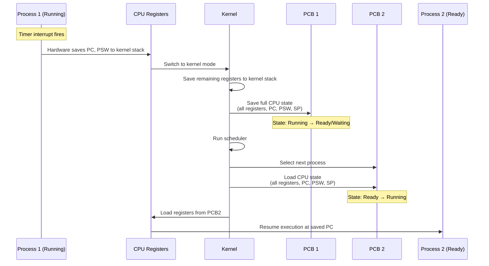
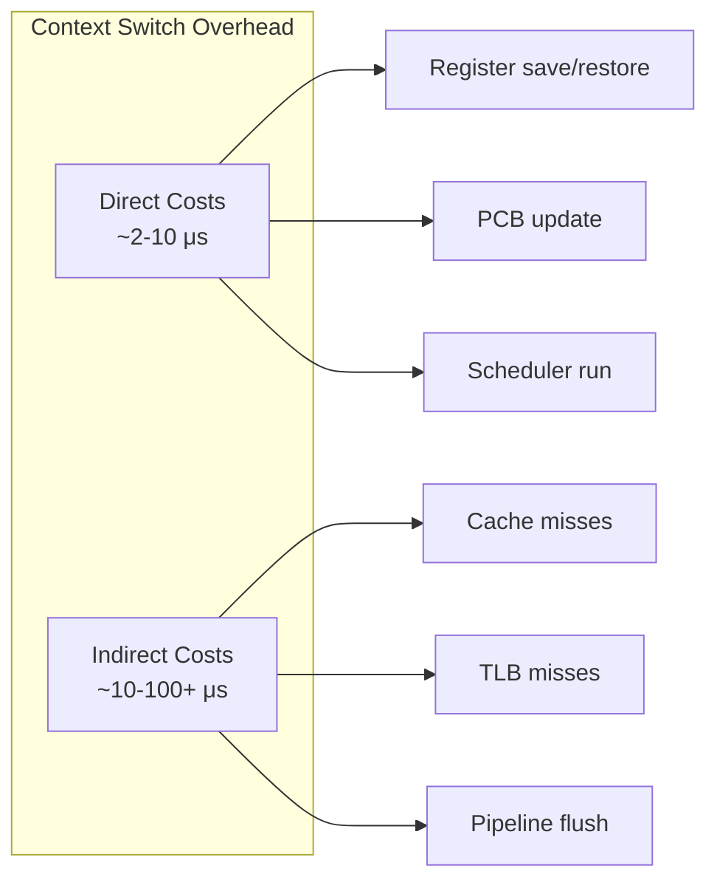

# Context Switching

## Overview

A **context switch** is the process of saving the state of the currently running process and loading the state of the next process to be executed. It's the mechanism that allows a single CPU to run multiple processes concurrently (time-multiplexing).

> **Interview one-liner:** "A context switch is the kernel's mechanism to pause one process and resume another — it saves the CPU state of the current process into its PCB and loads the next process's state from its PCB."

## When Do Context Switches Occur?

| Trigger | Type | Example |
|---------|------|---------|
| **Timer interrupt** | Preemptive | Time quantum expires in Round Robin |
| **I/O request** | Voluntary | Process calls `read()` on disk |
| **System call** | Voluntary/Involuntary | Process calls `sleep()`, `wait()` |
| **Higher-priority process** | Preemptive | Real-time process becomes ready |
| **Process termination** | Voluntary | `exit()` called |
| **Hardware interrupt** | Involuntary | Network packet arrives |

## Context Switch Steps



### Detailed Steps

1. **Interrupt or syscall occurs** — CPU traps into kernel mode
2. **Save user context** — CPU automatically saves PC and PSW (processor status word). Kernel saves remaining registers to the kernel stack.
3. **Update PCB** — Save all register values to the current process's PCB. Update process state (Running → Ready or Waiting).
4. **Run scheduler** — The scheduler selects the next process to run (may use FCFS, SJF, Round Robin, Priority, etc.).
5. **Update memory management** — Load the new process's page table base register (e.g., CR3 on x86). TLB may need flushing (or use ASIDs to avoid this).
6. **Load new context** — Load register values from the new process's PCB. Update process state (Ready → Running).
7. **Return to user mode** — Restore PC and PSW. CPU resumes execution of the new process.

## Cost of Context Switching

Context switches are **not free** — they have significant costs:

### Direct Costs
| Cost | Time | Notes |
|------|------|-------|
| Save/restore registers | ~1-5 μs | Depends on architecture |
| PCB read/write | ~1-2 μs | Cache-dependent |
| TLB flush/reload | ~1-10 μs | Depends on ASID support |
| Cache pollution | Variable | L1/L2/L3 cache misses after switch |
| Scheduler overhead | ~1-5 μs | Depends on scheduler complexity |

### Indirect Costs (Often Dominant)
- **Cache colding:** The new process's data is not in CPU cache. First accesses will be cache misses (potentially hundreds of nanoseconds each).
- **TLB misses:** Virtual-to-physical translations must be reloaded.
- **Pipeline stalls:** CPU instruction pipeline is flushed.
- **Branch predictor pollution:** Branch prediction tables are tuned to the old process.



### Measuring Context Switches

```bash
# Count context switches for a process
cat /proc/<PID>/status | grep voluntary

# System-wide context switch count
vmstat 1
# procs -----------memory---------- ---swap-- -----io---- -system-- ------cpu-----
#  r  b   swpd   free   buff  cache   si   so    bi    bo   in   cs us sy id wa
#  1  0      0 512000  64000 1024000   0    0     0     0  100  500  5  2 93  0
# cs = context switches per second

# Per-process context switch count
cat /proc/<PID>/status | grep ctxt
# voluntary_ctxt_switches: 1500
# nonvoluntary_ctxt_switches: 42

# Using perf for detailed analysis
perf stat -e context-switches,cache-misses,tlb-load-misses ./my_program
```

### Typical Numbers

| System | Context Switches/Second |
|--------|------------------------|
| Idle Linux system | 100-1,000 |
| Light workload | 1,000-10,000 |
| Heavy server | 10,000-100,000 |
| Extreme (1000+ processes) | 100,000+ |

## Voluntary vs Involuntary Context Switches

| Type | Trigger | Example | Control |
|------|---------|---------|---------|
| **Voluntary** | Process blocks on I/O/event | `read()`, `sleep()`, `wait()` | Process chooses to yield |
| **Involuntary** | Preemption by OS | Timer interrupt, higher-priority process | OS forces switch |

```bash
# In /proc/<PID>/status:
# voluntary_ctxt_switches:     1500    (process gave up CPU willingly)
# nonvoluntary_ctxt_switches:  42      (OS took CPU away)
```

High `nonvoluntary_ctxt_switches` indicates the process is CPU-bound and being preempted frequently.

## Context Switch vs Mode Switch

| Aspect | Mode Switch | Context Switch |
|--------|-------------|----------------|
| **What changes** | User mode ↔ Kernel mode | One process → Another |
| **Trigger** | System call, interrupt, exception | Scheduler decision |
| **Register save** | Partial (to kernel stack) | Full (to PCB) |
| **Address space** | Same process | Different process |
| **Cost** | ~1-2 μs | ~2-100+ μs |
| **Involves scheduler?** | No | Yes |

A context switch always includes at least two mode switches (into kernel, then back to user mode).

## Minimizing Context Switch Overhead

### Hardware Support
- **ASID (Address Space Identifier):** Tag TLB entries with process ID. Avoids TLB flush on context switch. Used in ARM and modern x86.
- **Large TLB:** More entries = fewer TLB misses after switch.
- **Multiple register sets:** Some architectures have banked registers for fast switching.

### OS Techniques
- **Lightweight processes (threads):** Share address space, no TLB flush needed.
- **Processor affinity:** Pin processes to CPUs to reduce cache misses.
- **Tickless kernels:** Avoid unnecessary timer interrupts when CPU is idle.
- **Preemption control:** Disable preemption in critical kernel sections.

### Application Techniques
- **Use threads over processes:** Threads share memory, cheaper context switches.
- **Reduce thread count:** Too many threads = too many context switches.
- **Use async I/O:** Avoid blocking (and thus voluntary context switches).
- **CPU affinity:** `sched_setaffinity()` to pin to specific cores.

## Linux Kernel Implementation

In Linux, the context switch is handled by `context_switch()` in `kernel/sched/core.c`:

```c
// Simplified Linux context switch
static __always_inline struct rq *
context_switch(struct rq *rq, struct task_struct *prev,
               struct task_struct *next, struct rq_flags *rf)
{
    // Prepare memory management switch
    struct mm_struct *mm, *oldmm;
    mm = next->mm;
    oldmm = prev->active_mm;
    
    if (!mm) {
        // Kernel thread — use previous process's address space
        next->active_mm = oldmm;
        mmgrab(oldmm);
    } else {
        // Switch address space (page tables)
        switch_mm(oldmm, mm, next);
    }
    
    if (!prev->mm) {
        prev->active_mm = NULL;
        rq->prev_mm = oldmm;
    }
    
    // Switch CPU registers (architecture-specific)
    switch_to(prev, next, prev);
    
    return finish_task_switch(prev);
}
```

Key points:
- `switch_mm()` changes the page table base register (CR3 on x86)
- `switch_to()` saves/restores registers and switches the kernel stack
- Uses **per-CPU run queues** for scalability

## Interview Questions

### Beginner

**Q1: What is a context switch?**  
A: A context switch is the process of saving the state of the currently running process (registers, PC, etc.) into its PCB and loading the state of another process so it can run on the CPU.

**Q2: What triggers a context switch?**  
A: Timer interrupts (time quantum expires), I/O requests, system calls that block, process termination, or a higher-priority process becoming ready.

**Q3: What is the difference between a context switch and a mode switch?**  
A: A mode switch changes between user mode and kernel mode (for syscalls/interrupts) within the same process. A context switch changes from one process to another, which involves saving/loading the full CPU state.

### Intermediate

**Q4: Why are context switches expensive?**  
A: Direct costs: saving/restoring registers, running the scheduler, updating memory management (page tables, TLB). Indirect (often larger) costs: cache pollution (new process's data not in cache), TLB misses (address translations need reloading), pipeline flushes. The indirect costs can be 10-100x the direct costs.

**Q5: What is the difference between voluntary and involuntary context switches?**  
A: Voluntary switches happen when a process blocks (I/O, `sleep()`, `wait()`) — the process gives up the CPU willingly. Involuntary switches happen when the OS preempts the process (timer interrupt, higher-priority process). High involuntary switches suggest CPU contention.

**Q6: How does the OS minimize context switch overhead?**  
A: 1) ASIDs to avoid TLB flushes, 2) Threads instead of processes (shared address space), 3) Processor affinity (keep processes on same CPU), 4) Per-CPU run queues (reduce lock contention), 5) Lightweight context switch for kernel threads (no address space switch).

### FAANG-Level

**Q7: How would you reduce context switches in a high-performance server?**  
A: 1) Use epoll/io_uring instead of thread-per-connection, 2) Use a fixed thread pool with worker threads, 3) Pin threads to CPUs with `sched_setaffinity()`, 4) Use `SCHED_FIFO` or `SCHED_DEADLINE` for real-time threads, 5) Reduce timer interrupt frequency (`CONFIG_NO_HZ`), 6) Use huge pages to reduce TLB misses, 7) Profile with `perf` to identify excessive switches.

**Q8: Explain how context switching works in a virtualized environment.**  
A: Virtualization adds a layer of complexity: 1) **Guest context switch:** Normal OS context switch within the VM, 2) **VM exit/entry:** When the guest OS does something that traps to the hypervisor (e.g., accessing a privileged register), causing a VM exit (expensive, ~1-10 μs), 3) **vCPU context switch:** Hypervisor switches between vCPUs on a physical CPU, 4) **Nested page tables:** Context switch requires updating both guest and host page tables (EPT/NPT), making it even more expensive. Mitigations: hardware virtualization extensions (VT-x), posted interrupts, virtual APIC.

**Q9: Design a system to measure context switch latency accurately.**  
A: 1) Use `rdtsc` (x86 timestamp counter) for nanosecond precision, 2) Create two processes/threads communicating via a pipe or shared memory with a futex, 3) Measure round-trip time: process A signals → context switch to B → B signals → context switch to A, 4) Divide by 2 for one-way context switch time, 5) Use `perf stat` for hardware counter validation (cache misses, TLB misses during switch), 6) Run thousands of iterations for statistical significance, 7) Vary process sizes to measure cache effects.

## Common Mistakes

1. **Confusing context switch with interrupt handling:** An interrupt triggers a mode switch (into kernel). A context switch may or may not follow (the interrupt handler might just return to the same process).
2. **Assuming context switches are always bad:** They're necessary for multitasking. The goal is to minimize *unnecessary* context switches, not eliminate them.
3. **Ignoring indirect costs:** The register save/restore is fast (~2 μs). The cache/TLB pollution is much slower (~10-100 μs). Always consider both.
4. **Not distinguishing voluntary from involuntary:** High voluntary switches = I/O-bound (normal). High involuntary switches = CPU-bound and being preempted (may need more CPUs or better scheduling).
5. **Thinking threads avoid context switches entirely:** Threads within the same process still require context switches (saving registers, switching stacks), but they avoid the expensive address space switch (TLB flush, page table change).

## Summary

| Aspect | Key Point |
|--------|-----------|
| Definition | Saving current process state and loading next process state |
| Direct Cost | ~2-10 μs (registers, PCB, scheduler) |
| Indirect Cost | ~10-100+ μs (cache, TLB, pipeline) |
| Triggers | Timer interrupt, I/O, syscall, preemption, termination |
| Voluntary | Process blocks (I/O, sleep) |
| Involuntary | OS preempts (timer, higher priority) |
| Minimization | Threads, ASIDs, affinity, async I/O, fewer threads |

## Cross-References

- [Process Control Block](./pcb.md) - Where process state is saved
- [Process States](./states.md) - State transitions during context switch
- [Scheduling](../scheduling/README.md) - Which process runs next
- [Threads](../threads/README.md) - Lighter context switches
- [Virtual Memory](../virtual-memory/README.md) - Page table switching
- [I/O Systems](../io/README.md) - I/O-triggered context switches


## Cross References

- [CPU Scheduling](../scheduling/README.md)
- [PCB](pcb.md)
- [Process States](states.md)
- [Pipelining](../../arch/pipelining/README.md)
- [Thread Pools](../../concurrency/thread-pools.md)
