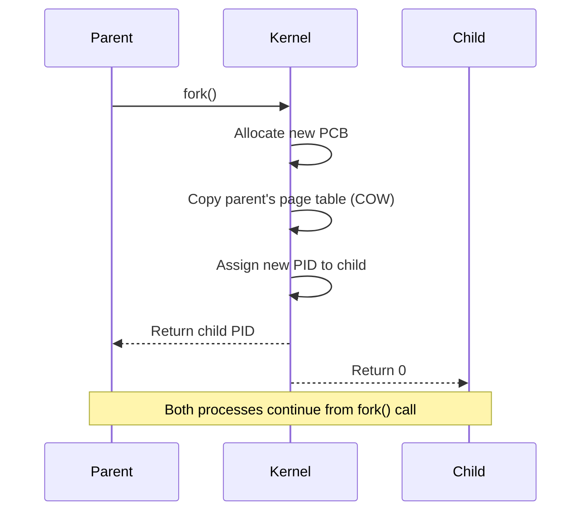
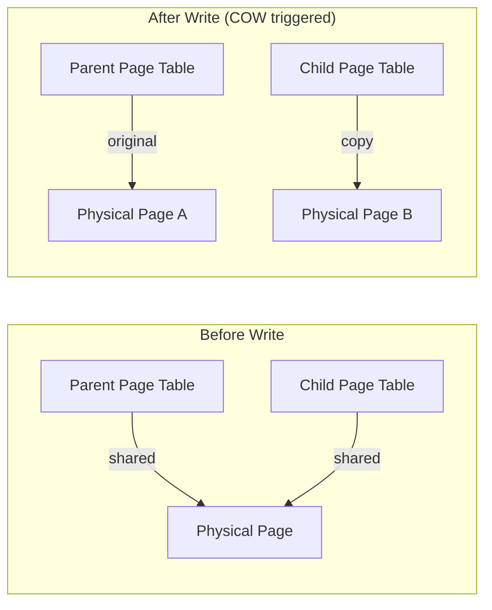
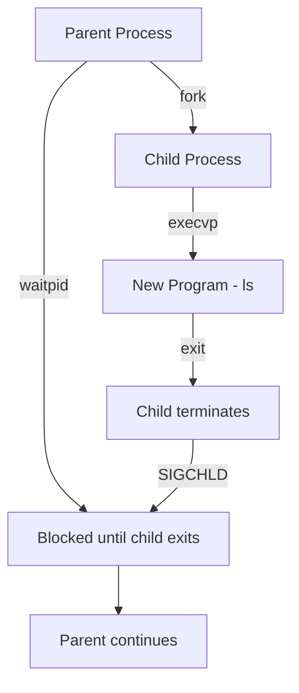

# Process Creation

## Overview

Process creation is one of the most fundamental OS operations. When a new process is needed, the OS creates a new address space, loads a program into it, and initializes the process control block. Understanding how processes are created is essential for system programming and interviews.

## The `fork()` System Call

`fork()` is the primary mechanism for creating processes on Unix/Linux systems. It creates an **exact copy** of the calling process.

### Key Properties

- Returns **twice**: once in the parent (child's PID), once in the child (0)
- Child inherits: open file descriptors, signal handlers, environment, working directory, memory layout
- Child does **not** inherit: PID, parent PID, pending signals, file locks



### Example

```c
#include <stdio.h>
#include <stdlib.h>
#include <unistd.h>
#include <sys/wait.h>

int main() {
    printf("Before fork: PID=%d\n", getpid());
    
    pid_t pid = fork();
    
    if (pid < 0) {
        perror("fork failed");
        exit(1);
    } else if (pid == 0) {
        // CHILD
        printf("Child:  PID=%d, PPID=%d\n", getpid(), getppid());
        sleep(1);
        printf("Child:  Done\n");
        exit(42);  // Exit with status 42
    } else {
        // PARENT
        printf("Parent: PID=%d, Child PID=%d\n", getpid(), pid);
        
        int status;
        waitpid(pid, &status, 0);
        
        if (WIFEXITED(status)) {
            printf("Parent: Child exited with status %d\n", WEXITSTATUS(status));
        }
    }
    
    return 0;
}
```

Output:
```
Before fork: PID=1000
Parent: PID=1000, Child PID=1001
Child:  PID=1001, PPID=1000
Child:  Done
Parent: Child exited with status 42
```

## Copy-on-Write (COW)

Modern kernels don't actually copy all memory on `fork()`. Instead:



1. `fork()` duplicates only the **page table** (not actual memory pages)
2. All pages are marked **read-only** and shared
3. When either process writes → **page fault** → kernel copies the page → marks writable
4. This makes `fork()` very efficient (microseconds instead of milliseconds)

## `exec()` Family

`fork()` creates a copy. To run a **different program**, use `exec()`:

```c
// After fork(), in the child:
execlp("ls", "ls", "-la", "/home", NULL);
// This REPLACES the current process image with /bin/ls
// If exec succeeds, it NEVER returns
perror("exec failed");  // Only reached on error
```

### `exec()` Variants

| Function | Path Search | Args Format | Environment |
|----------|-------------|-------------|-------------|
| `execl(path, arg, ...)` | Full path | Variadic list | Inherited |
| `execlp(file, arg, ...)` | `$PATH` search | Variadic list | Inherited |
| `execle(path, arg, ..., envp)` | Full path | Variadic list | Explicit |
| `execv(path, argv)` | Full path | Array | Inherited |
| `execvp(file, argv)` | `$PATH` search | Array | Inherited |
| `execve(path, argv, envp)` | Full path | Array | Explicit |

> **Note:** `execve()` is the actual system call. All others are library wrappers.

## `fork()` + `exec()` Pattern

The standard pattern for running a new program:

```c
pid_t pid = fork();

if (pid == 0) {
    // Child: exec into new program
    char *args[] = {"ls", "-la", NULL};
    execvp("ls", args);
    perror("execvp failed");
    exit(1);
} else if (pid > 0) {
    // Parent: wait for child
    int status;
    waitpid(pid, &status, 0);
} else {
    perror("fork failed");
}
```



## `posix_spawn()` — Efficient Alternative

When the child immediately calls `exec()`, `fork()` + `exec()` wastes effort (duplicating page table just to discard it). `posix_spawn()` combines both:

```c
#include <spawn.h>

pid_t pid;
char *args[] = {"ls", "-la", NULL};
char *env[] = {NULL};

posix_spawn(&pid, "/bin/ls", NULL, NULL, args, env);
```

## `vfork()` — Legacy Optimization

`vfork()` creates a child that **shares** the parent's address space (no COW). The child **must** call `exec()` or `_exit()` immediately, and the parent is **blocked** until it does. Modern `fork()` with COW makes `vfork()` mostly unnecessary.

## Process Termination

### Normal Termination
```c
exit(0);      // Library call: flushes stdio buffers, calls atexit handlers
_exit(0);     // System call: immediate termination, no cleanup
return 0;     // From main(): equivalent to exit(0)
```

### Abnormal Termination
- Calling `abort()`
- Receiving an unhandled signal (SIGSEGV, SIGKILL, etc.)
- Last thread exits

### `wait()` and `waitpid()`

```c
// Block until any child exits
int status;
pid_t child_pid = wait(&status);

// Block until specific child exits
pid_t child_pid = waitpid(specific_pid, &status, 0);

// Non-blocking check
pid_t child_pid = waitpid(specific_pid, &status, WNOHANG);

// Status macros
WIFEXITED(status)      // Did child exit normally?
WEXITSTATUS(status)    // Exit code (if WIFEXITED)
WIFSIGNALED(status)    // Killed by signal?
WTERMSIG(status)       // Signal number (if WIFSIGNALED)
```

## Process Tree in Linux

```bash
# View process tree
pstree -p

# Example output:
# systemd(1)─┬─sshd(1000)───sshd(1050)───bash(1051)───vim(1200)
#             ├─cron(800)
#             ├─dockerd(900)───containerd(901)
#             └─systemd-journal(500)
```

## The `clone()` System Call

`clone()` is the low-level system call that both `fork()` and `pthread_create()` use. It allows fine-grained control over what is shared:

```c
// clone() flags
CLONE_VM       // Share memory space (used by threads)
CLONE_FS       // Share filesystem info
CLONE_FILES    // Share file descriptor table
CLONE_SIGHAND  // Share signal handlers
CLONE_THREAD   // Same thread group (for threads)
CLONE_PARENT   // Share parent (don't become child of caller)
```

| Operation | `clone()` flags |
|-----------|----------------|
| `fork()` | No sharing flags |
| `pthread_create()` | `CLONE_VM | CLONE_FS | CLONE_FILES | CLONE_SIGHAND | CLONE_THREAD` |
| `vfork()` | `CLONE_VM | VFORK` |

## Interview Questions

### Beginner

**Q1: What does `fork()` return?**  
A: `fork()` returns the child's PID to the parent, and 0 to the child. On failure, it returns -1 in the parent (no child is created).

**Q2: What happens if a parent process terminates before its child?**  
A: The child becomes an **orphan** and is adopted by init/systemd (PID 1). The child continues running normally. Init will eventually call `wait()` when the child terminates.

**Q3: What does `exec()` do?**  
A: `exec()` replaces the current process image with a new program. It loads the new program's code, data, and stack, but keeps the same PID, open file descriptors (unless close-on-exec), and process attributes.

### Intermediate

**Q4: Why does `fork()` sometimes fail?**  
A: Common reasons: 1) System limit on processes reached (`/proc/sys/kernel/threads-max`), 2) Per-user process limit (`ulimit -u`), 3) Insufficient memory for new PCB and page tables, 4) `EPERM` — process doesn't have permission.

**Q5: What is the difference between `exit()` and `_exit()`?**  
A: `exit()` is a library function that: 1) calls `atexit()` handlers, 2) flushes stdio buffers, 3) calls `_exit()`. `_exit()` is a system call that immediately terminates without cleanup. Use `_exit()` after `fork()` in the child if you've already flushed buffers, to avoid double-flushing.

**Q6: Explain COW in `fork()`. Why is it important?**  
A: Copy-on-Write avoids copying all memory on `fork()`. Instead, parent and child share pages marked read-only. When either writes, a page fault triggers a copy of that page only. This is crucial because `fork()` is often followed by `exec()`, which replaces the entire address space — copying all memory would be wasted work.

### FAANG-Level

**Q7: How would you implement a process pool (pre-forked server)?**  
A: A process pool pre-creates N child processes that all block on `accept()` (or a shared socket). When a connection arrives, one child wakes up and handles it. This avoids the overhead of `fork()` per request. Implementation: 1) Parent calls `fork()` N times, 2) Each child loops on `accept()` + handle, 3) Parent monitors children and restarts dead ones. Used by Apache's prefork MPM.

**Q8: What happens during `fork()` in a multi-threaded process?**  
A: Only the **calling thread** is duplicated in the child. All other threads vanish. This can leave resources locked (mutexes held by vanished threads) and in an inconsistent state. Best practice: call `fork()` only before creating threads, or use `pthread_atfork()` handlers to acquire locks in the parent before `fork()` and release them in parent and child after.

**Q9: Design a system that needs to create 10,000 processes per second.**  
A: Key considerations: 1) Use `posix_spawn()` or `clone()` instead of `fork()+exec()` to avoid COW overhead, 2) Pre-allocate PID pools, 3) Use a process pool instead of creating/destroying per request, 4) Tune `/proc/sys/kernel/pid_max`, 5) Consider using threads instead if processes don't need isolation, 6) Use `io_uring` or epoll for async I/O to reduce process count needs.

## Common Mistakes

1. **Forgetting `fork()` returns twice:** Code after `fork()` runs in both parent and child. Always check the return value.
2. **Not checking return value:** `fork()` can fail — always handle `-1`.
3. **Using `exit()` instead of `_exit()` in child:** Can cause double-flushing of stdio buffers (duplicate output).
4. **Race condition after `fork()`:** Parent and child execution order is non-deterministic. Don't assume which runs first.
5. **Memory leak with `fork()`:** If parent has allocated heap memory, `fork()` duplicates the page table. The child should `exec()` or carefully manage inherited resources.

## Summary

| Operation | Purpose | Key Behavior |
|-----------|---------|--------------|
| `fork()` | Create child process | Returns twice; COW; child is copy of parent |
| `exec()` | Replace process image | Loads new program; same PID; no return on success |
| `wait()` | Parent waits for child | Blocks until child exits; reaps zombie |
| `exit()` | Terminate process | Calls atexit handlers, flushes buffers |
| `_exit()` | Immediate termination | No cleanup; system call |
| `clone()` | Low-level process/thread creation | Fine-grained sharing control |
| `posix_spawn()` | Create + exec in one call | Efficient alternative to fork+exec |

## Cross-References

- [Process Control Block](./pcb.md) - What the OS tracks for each process
- [Process States](./states.md) - Lifecycle of a process
- [Context Switching](./context-switching.md) - How the OS switches between processes
- [Zombie & Orphan](./zombie-orphan.md) - What happens when parent-child coordination fails
- [Threads](../threads/README.md) - Lighter alternative to processes
- [IPC](./ipc.md) - How created processes communicate


## Cross References

- [Process States](states.md)
- [Zombie/Orphan](zombie-orphan.md)
- [Copy-on-Write](../virtual-memory/cow.md)
- [IPC](ipc.md)
