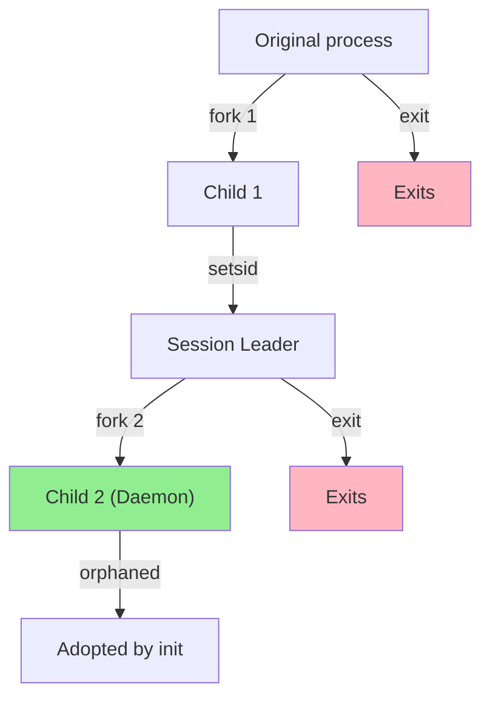

# Daemon Processes

## Overview

A **daemon** is a background process that runs without a controlling terminal, typically performing system services or waiting for events. The name comes from Maxwell's demon (a thought experiment), not the biblical demon.

> **Interview one-liner:** "A daemon is a long-running background process detached from any terminal — it runs continuously, handles system tasks, and is typically managed by init/systemd."

## Characteristics of Daemons

| Property | Value |
|----------|-------|
| Terminal | No controlling terminal |
| Session | Runs in its own session |
| Parent | init/systemd (PID 1) or service manager |
| Lifetime | Long-running (months or years) |
| I/O | No stdin/stdout/stderr to terminal |
| Working directory | Typically `/` |

## Common Linux Daemons

| Daemon | Purpose |
|--------|---------|
| `sshd` | SSH server — handles remote login |
| `httpd` / `nginx` | Web servers |
| `mysqld` / `postgres` | Database servers |
| `crond` | Scheduled task execution |
| `systemd-journald` | System logging |
| `dockerd` | Container runtime |
| `NetworkManager` | Network configuration |
| `ntpd` / `chronyd` | Time synchronization |
| `syslogd` | System log collection |

## Creating a Daemon: The Classic 13-Step Process

The traditional method (W. Richard Stevens, "Advanced Programming in the Unix Environment"):

```c
#include <stdio.h>
#include <stdlib.h>
#include <unistd.h>
#include <signal.h>
#include <sys/stat.h>
#include <sys/file.h>
#include <fcntl.h>
#include <syslog.h>

#define LOCK_FILE "/var/run/mydaemon.pid"

int daemonize() {
    pid_t pid;
    
    // Step 1: Fork — parent exits, child continues
    pid = fork();
    if (pid < 0) return -1;
    if (pid > 0) exit(0);  // Parent exits
    
    // Step 2: Create new session
    if (setsid() < 0) return -1;  // Become session leader
    
    // Step 3: Fork again — prevent terminal reattachment
    pid = fork();
    if (pid < 0) return -1;
    if (pid > 0) exit(0);  // First child exits
    
    // Step 4: Change working directory
    chdir("/");
    
    // Step 5: Set file permissions mask
    umask(0);
    
    // Step 6: Close all open file descriptors
    for (int fd = sysconf(_SC_OPEN_MAX); fd >= 0; fd--) {
        close(fd);
    }
    
    // Step 7: Redirect stdin/stdout/stderr to /dev/null
    open("/dev/null", O_RDONLY);  // stdin (fd 0)
    open("/dev/null", O_WRONLY);  // stdout (fd 1)
    open("/dev/null", O_WRONLY);  // stderr (fd 2)
    
    // Step 8: Open syslog for logging
    openlog("mydaemon", LOG_PID, LOG_DAEMON);
    
    // Step 9: Write PID file
    int lock_fd = open(LOCK_FILE, O_RDWR | O_CREAT, 0644);
    if (lock_fd < 0) {
        syslog(LOG_ERR, "Cannot open PID file");
        exit(1);
    }
    
    // Step 10: Lock PID file (prevent multiple instances)
    if (flock(lock_fd, LOCK_EX | LOCK_NB) < 0) {
        syslog(LOG_ERR, "Daemon already running");
        exit(1);
    }
    
    // Step 11: Write PID to file
    char pid_str[16];
    snprintf(pid_str, sizeof(pid_str), "%d\n", getpid());
    write(lock_fd, pid_str, strlen(pid_str));
    
    // Step 12: Set up signal handlers
    signal(SIGTERM, handle_sigterm);
    signal(SIGHUP, handle_sighup);
    signal(SIGCHLD, SIG_IGN);  // Auto-reap children
    
    // Step 13: Log startup
    syslog(LOG_INFO, "Daemon started (PID %d)", getpid());
    
    return 0;
}

void handle_sigterm(int sig) {
    syslog(LOG_INFO, "Received SIGTERM, shutting down");
    cleanup();
    closelog();
    exit(0);
}

void handle_sighup(int sig) {
    syslog(LOG_INFO, "Received SIGHUP, reloading config");
    reload_config();
}

int main() {
    if (daemonize() < 0) {
        perror("daemonize");
        return 1;
    }
    
    // Main daemon loop
    while (1) {
        // Do work
        syslog(LOG_DEBUG, "Daemon heartbeat");
        sleep(60);
    }
    
    return 0;
}
```

## Why the Double Fork?



**First fork:** Child detaches from parent. Parent exits. Child is not a session leader (can't acquire terminal).

**`setsid()`:** Creates a new session and process group. Child becomes session leader.

**Second fork:** Grandchild is NOT a session leader, so it cannot reacquire a controlling terminal (only session leaders can `open()` a terminal device that becomes controlling).

## Using `daemon()` Function

Some systems provide a convenience function:

```c
#include <unistd.h>

// Simplest way to daemonize
if (daemon(0, 0) < 0) {  // nochdir=0, noclose=0
    perror("daemon");
    exit(1);
}
// Equivalent to: fork + setsid + chdir + redirect fds
```

## Modern Alternative: systemd

Modern Linux uses **systemd** for daemon management. Instead of daemonizing yourself, write a service file:

### `/etc/systemd/system/mydaemon.service`

```ini
[Unit]
Description=My Custom Daemon
After=network.target

[Service]
Type=simple
ExecStart=/usr/local/bin/mydaemon
Restart=always
RestartSec=5
User=myuser
Group=mygroup
WorkingDirectory=/var/lib/mydaemon
StandardOutput=journal
StandardError=journal

[Install]
WantedBy=multi-user.target
```

### Application Code (No Self-Daemonizing)

```c
#include <stdio.h>
#include <signal.h>
#include <unistd.h>

volatile sig_atomic_t running = 1;

void handle_sigterm(int sig) {
    running = 0;
}

int main() {
    signal(SIGTERM, handle_sigterm);
    
    // Don't fork, don't redirect — systemd handles it
    fprintf(stderr, "Daemon starting\n");
    
    while (running) {
        // Do work
        sleep(10);
    }
    
    fprintf(stderr, "Daemon stopping\n");
    return 0;
}
```

### Managing with systemd

```bash
# Enable and start
sudo systemctl enable mydaemon
sudo systemctl start mydaemon

# Check status
sudo systemctl status mydaemon

# View logs
journalctl -u mydaemon -f

# Stop/restart
sudo systemctl stop mydaemon
sudo systemctl restart mydaemon
```

## Daemon vs Background Process

| Aspect | Daemon | Background Process |
|--------|--------|-------------------|
| Terminal | Detached (no controlling terminal) | Attached to terminal |
| Session | Own session | Parent's session |
| Parent | init/systemd | Shell |
| Terminal close | Continues running | May receive SIGHUP |
| I/O | syslog/file | Terminal (redirected) |
| Lifecycle | Managed by service manager | Manual management |

## Logging: syslog API

```c
#include <syslog.h>

// Open syslog connection
openlog("mydaemon", LOG_PID | LOG_CONS, LOG_DAEMON);

// Log messages (priority from high to low):
syslog(LOG_EMERG,   "System is unusable");
syslog(LOG_ALERT,   "Immediate action required");
syslog(LOG_CRIT,    "Critical conditions");
syslog(LOG_ERR,     "Error conditions");
syslog(LOG_WARNING, "Warning conditions");
syslog(LOG_NOTICE,  "Normal but significant");
syslog(LOG_INFO,    "Informational");
syslog(LOG_DEBUG,   "Debug-level messages");

// Close
closelog();
```

### Log configuration

```bash
# /etc/rsyslog.conf or /etc/syslog.conf
# Route daemon messages to a file
daemon.*    /var/log/daemon.log

# View daemon logs
tail -f /var/log/daemon.log
journalctl -t mydaemon
```

## PID Files and Locking

```c
#include <sys/file.h>
#include <fcntl.h>
#include <unistd.h>
#include <stdio.h>

int create_pidfile(const char *path) {
    int fd = open(path, O_RDWR | O_CREAT, 0644);
    if (fd < 0) return -1;
    
    // Try to acquire exclusive lock (non-blocking)
    if (flock(fd, LOCK_EX | LOCK_NB) < 0) {
        close(fd);
        return -1;  // Another instance is running
    }
    
    // Truncate and write PID
    ftruncate(fd, 0);
    char pid[16];
    snprintf(pid, sizeof(pid), "%d\n", getpid());
    write(fd, pid, strlen(pid));
    
    // Keep fd open (lock persists until close or process exit)
    return fd;
}
```

## Interview Questions

### Beginner

**Q1: What is a daemon process?**  
A: A daemon is a background process that runs without a controlling terminal. It typically performs system services (web servers, databases, schedulers) and runs continuously. Examples: sshd, nginx, crond.

**Q2: Why do we fork twice when creating a daemon?**  
A: First fork: detach from parent and create a new session (setsid). Second fork: ensure the daemon is not a session leader, so it can never reacquire a controlling terminal.

### Intermediate

**Q3: What is the difference between a daemon and a background process?**  
A: A background process (e.g., `command &`) is still attached to the terminal and receives SIGHUP when the terminal closes. A daemon is fully detached — no controlling terminal, runs in its own session, managed by init/systemd.

**Q4: How do modern Linux systems handle daemons?**  
A: Modern systems use systemd (or similar init systems). The daemon doesn't need to self-daemonize — systemd starts it, monitors it, restarts on failure, and manages logging. The application just runs as a regular process (Type=simple) or forks once (Type=forking).

**Q5: What signals should a daemon handle?**  
A: SIGTERM (graceful shutdown), SIGHUP (reload configuration), SIGCHLD (reap child processes), SIGPIPE (broken pipe — usually ignore). SIGKILL and SIGSTOP cannot be handled.

### FAANG-Level

**Q6: Design a daemon that handles millions of connections with graceful restart.**  
A: 1) Use epoll/io_uring for async I/O, 2) On SIGHUP: fork new process, pass listening socket via Unix domain socket (SCM_RIGHTS), new process starts accepting, old process drains existing connections, 3) Use SO_REUSEPORT for zero-downtime restart, 4) PID file with flock for singleton, 5) systemd watchdog (sd_notify) for health monitoring, 6) Structured logging (JSON) to journald, 7) Graceful shutdown: stop accepting, drain connections, flush buffers, exit.

**Q7: How would you implement a daemon that survives machine reboots?**  
A: 1) systemd service file with `Restart=always` and `RestartSec=5`, 2) Enable with `systemctl enable`, 3) State persistence: write state to disk periodically, recover on startup, 4) PID file: check on startup if already running, 5) Health checks: systemd watchdog or external monitoring, 6) For critical services: use socket activation (systemd passes socket, daemon starts on first connection).

**Q8: Compare the classic daemon pattern with systemd's approach.**  
A: Classic (self-daemonizing): daemon forks, creates PID file, redirects I/O, manages its own lifecycle. Pros: portable, works without systemd. Cons: complex code, PID file race conditions, no watchdog, manual restart on failure. systemd: no daemonizing code, service file declares behavior. Pros: automatic restart, logging, dependency management, resource limits (cgroups). Cons: Linux-specific, systemd dependency. Modern best practice: use systemd, don't self-daemonize.

## Common Mistakes

1. **Forgetting to close file descriptors:** Inherits open fds from parent — can cause resource leaks and security issues.
2. **Not redirecting stdin/stdout/stderr:** Can cause errors when terminal closes.
3. **Not handling SIGTERM:** Daemon can't be stopped gracefully.
4. **PID file race conditions:** Two instances starting simultaneously. Use `flock()` for atomic locking.
5. **Running as root unnecessarily:** Daemons should drop privileges after binding to privileged ports.

## Summary

| Step | Purpose |
|------|---------|
| `fork()` + parent `exit()` | Detach from terminal |
| `setsid()` | Create new session, become leader |
| `fork()` again | Prevent terminal reattachment |
| `chdir("/")` | Avoid holding mount points |
| `umask(0)` | Control file creation permissions |
| Close fds | Release inherited resources |
| Redirect to `/dev/null` | Prevent I/O errors |
| `openlog()` | Enable logging |
| PID file + `flock()` | Singleton enforcement |
| Signal handlers | Graceful shutdown, config reload |

## Cross-References

- [Process Creation](./creation.md) - `fork()`, `setsid()`, `exit()`
- [Zombie & Orphan](./zombie-orphan.md) - Daemon is an intentional orphan
- [Signals](./ipc-signals.md) - Signal handling for daemons
- [Boot Process](../boot/README.md) - How daemons are started at boot
