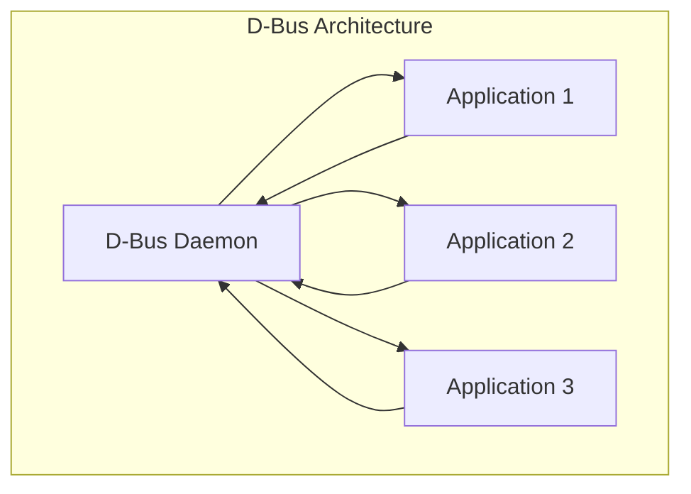

# Advanced IPC Mechanisms

## Overview

Beyond basic IPC (pipes, message queues, shared memory), modern systems use sophisticated IPC mechanisms for high performance, security, and complex communication patterns.

## Unix Domain Sockets

### Overview

Unix domain sockets are like network sockets but use the filesystem namespace instead of IP addresses. They're faster than TCP sockets (no network overhead) and support both stream and datagram semantics.

```c
#include <sys/socket.h>
#include <sys/un.h>

// Server
int server_fd = socket(AF_UNIX, SOCK_STREAM, 0);
struct sockaddr_un addr;
addr.sun_family = AF_UNIX;
strcpy(addr.sun_path, "/tmp/mysocket");
bind(server_fd, (struct sockaddr*)&addr, sizeof(addr));
listen(server_fd, 5);

// Client
int client_fd = socket(AF_UNIX, SOCK_STREAM, 0);
struct sockaddr_un addr;
addr.sun_family = AF_UNIX;
strcpy(addr.sun_path, "/tmp/mysocket");
connect(client_fd, (struct sockaddr*)&addr, sizeof(addr));
```

### Unix Domain Sockets vs TCP

| Feature | Unix Domain Socket | TCP Socket |
|---------|-------------------|------------|
| **Speed** | Faster (no network stack) | Slower (protocol overhead) |
| **Scope** | Same machine only | Network-wide |
| **Security** | File permissions | Firewall/auth |
| **Addressing** | Filesystem path | IP:port |
| **Data format** | Bytes or datagrams | Bytes |

### Passing File Descriptors

Unix domain sockets can pass open file descriptors between processes:

```c
// Send fd over socket
struct msghdr msg;
struct cmsghdr *cmsg;
char buf[CMSG_SPACE(sizeof(int))];
msg.msg_control = buf;
msg.msg_controllen = sizeof(buf);
cmsg = CMSG_FIRSTHDR(&msg);
cmsg->cmsg_level = SOL_SOCKET;
cmsg->cmsg_type = SCM_RIGHTS;
cmsg->cmsg_len = CMSG_LEN(sizeof(int));
*(int*)CMSG_DATA(cmsg) = fd_to_pass;
sendmsg(sock_fd, &msg, 0);
```

## D-Bus

### Overview

D-Bus is a message bus system for IPC on Linux. It provides:
- **System bus**: For system-level services (hardware, network)
- **Session bus**: For user applications



### D-Bus Communication

| Method | Description | Use Case |
|--------|-------------|----------|
| **Signals** | Broadcast events | Notifications |
| **Method calls** | Request-response | RPC |
| **Properties** | Get/set attributes | Configuration |

## Memory-Mapped IPC

### Shared Memory with mmap

```c
// Create shared memory object
int fd = shm_open("/myshm", O_CREAT | O_RDWR, 0666);
ftruncate(fd, SIZE);

// Map into process memory
void *ptr = mmap(NULL, SIZE, PROT_READ | PROT_WRITE, MAP_SHARED, fd, 0);

// Use as regular memory
*(int*)ptr = 42;

// Cleanup
munmap(ptr, SIZE);
close(fd);
shm_unlink("/myshm");
```

### Anonymous mmap (parent-child)

```c
// Parent-child shared memory (fork)
void *ptr = mmap(NULL, SIZE, PROT_READ | PROT_WRITE, 
                 MAP_SHARED | MAP_ANONYMOUS, -1, 0);
*(int*)ptr = 0;

if (fork() == 0) {
    // Child
    *(int*)ptr = 42;
    exit(0);
}
wait(NULL);
printf("%d\n", *(int*)ptr); // 42
```

## POSIX Message Queues

```c
#include <mqueue.h>

// Create/open queue
mqd_t mq = mq_open("/myqueue", O_CREAT | O_WRONLY, 0644, NULL);

// Send message
char *msg = "hello";
mq_send(mq, msg, strlen(msg), 0);

// Receive message
char buf[256];
unsigned int prio;
mq_receive(mq, buf, sizeof(buf), &prio);

// Cleanup
mq_close(mq);
mq_unlink("/myqueue");
```

### Message Queue Features

| Feature | POSIX MQ | System V MQ |
|---------|----------|-------------|
| **Interface** | mq_open/mq_send | msgget/msgsnd |
| **Priority** | Yes (0-31) | No |
| **Notification** | Signal/thread | None |
| **Max size** | Configurable | System limit |

## Semaphores

### POSIX Semaphores

```c
#include <semaphore.h>

// Named semaphore
sem_t *sem = sem_open("/mysem", O_CREAT, 0644, 1);
sem_wait(sem);    // P operation (decrement)
// Critical section
sem_post(sem);    // V operation (increment)
sem_close(sem);
sem_unlink("/mysem");

// Unnamed semaphore (shared memory)
sem_t sem;
sem_init(&sem, 1, 1);  // pshared=1, value=1
sem_wait(&sem);
sem_post(&sem);
sem_destroy(&sem);
```

## Signals

### Advanced Signal Handling

```c
#include <signal.h>

// Signal handler with sigaction (reliable)
struct sigaction sa;
sa.sa_handler = handler;
sigemptyset(&sa.sa_mask);
sa.sa_flags = SA_RESTART;  // Restart interrupted syscalls
sigaction(SIGUSR1, &sa, NULL);

// Signal-safe functions only!
// Async-signal-safe: write(), _exit(), signal-safe list
// NOT safe: printf(), malloc(), mutex operations

void handler(int sig) {
    const char msg[] = "Signal received\n";
    write(STDERR_FILENO, msg, sizeof(msg) - 1);
}
```

### Real-time Signals

```c
// Real-time signals (SIGRTMIN to SIGRTMAX)
// - Queued (multiple pending)
// - Can carry data (sigval)
// - Delivered in order

union sigval value;
value.sival_int = 42;
sigqueue(pid, SIGRTMIN, value);

// Receive with sigwaitinfo
siginfo_t info;
sigwaitinfo(&set, &info);
printf("Signal %d, value %d\n", info.si_signo, info.si_value.sival_int);
```

## Comparison of IPC Mechanisms

| Mechanism | Speed | Complexity | Persistence | Cross-machine |
|-----------|-------|-----------|-------------|---------------|
| **Pipe** | Fast | Low | No | No |
| **Unix socket** | Fast | Medium | No | No |
| **Shared memory** | Fastest | High | No | No |
| **Message queue** | Medium | Medium | Optional | No |
| **TCP socket** | Slower | Medium | No | Yes |
| **D-Bus** | Medium | Low | No | No |
| **Signal** | Fast | Low | No | No |

## Interview Questions

### Q1: When to use shared memory vs message passing?

**Shared memory**: High-throughput, latency-sensitive applications. Requires synchronization (semaphores, mutexes). More complex but fastest IPC.

**Message passing**: Simpler programming model, built-in synchronization. Better for loosely coupled processes. Lower throughput but easier to use correctly.

### Q2: How to pass file descriptors between processes?

Use Unix domain sockets with `sendmsg()`/`recvmsg()` and `SCM_RIGHTS`. The kernel duplicates the fd in the receiving process's fd table. This is how `fork()` and `exec` chains share files.

### Q3: What is the Thundering Herd problem?

When multiple processes/threads are waiting on a resource and it becomes available, all wake up but only one can proceed. Solutions:
- `EPOLLEXCLUSIVE` (Linux 4.5+)
- Accept mutex (nginx approach)
- Wake-one patterns

### Q4: System V vs POSIX IPC?

| System V | POSIX |
|----------|-------|
| Older standard | Modern standard |
| msgget/shmget/semget | mq_open/shm_open/sem_open |
| Key-based naming | Path-based naming |
| Less flexible | More features (notifications, priorities) |

## Related Topics

- [Process Creation](./creation.md) — fork/exec
- [Pipes](./ipc-pipes.md) — Basic pipe IPC
- [Shared Memory](./ipc-shared-memory.md) — Shared memory basics
- [Sockets](./ipc-sockets.md) — Network sockets
- [Synchronization](../synchronization/) — Mutexes, semaphores
