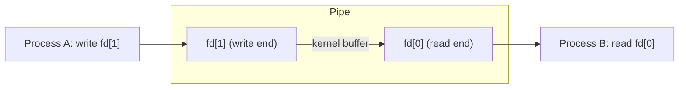

# Pipes

## Overview

A **pipe** is the simplest form of IPC in Unix/Linux. It's a unidirectional byte stream that connects the output of one process to the input of another. Pipes are the foundation of shell command composition (`ls | grep foo`).

> **Interview one-liner:** "A pipe is a unidirectional, in-kernel byte buffer that connects a writer to a reader — the basis of Unix shell pipelines."

## Types of Pipes

| Type | Created By | Scope | Named? |
|------|-----------|-------|--------|
| **Unnamed pipe** | `pipe()` syscall | Parent-child only | No |
| **Named pipe (FIFO)** | `mkfifo()` or `mknod()` | Any processes | Yes (filesystem entry) |

## Unnamed Pipes

### Creation

```c
#include <unistd.h>

int fd[2];
pipe(fd);  // fd[0] = read end, fd[1] = write end
```



### Example: Parent-Child Communication

```c
#include <stdio.h>
#include <stdlib.h>
#include <unistd.h>
#include <string.h>
#include <sys/wait.h>

int main() {
    int fd[2];
    pid_t pid;
    char buffer[100];
    
    if (pipe(fd) == -1) {
        perror("pipe");
        exit(1);
    }
    
    pid = fork();
    
    if (pid == 0) {
        // Child: reads from pipe
        close(fd[1]);  // Close write end
        int n = read(fd[0], buffer, sizeof(buffer) - 1);
        buffer[n] = '\0';
        printf("Child received: %s\n", buffer);
        close(fd[0]);
    } else {
        // Parent: writes to pipe
        close(fd[0]);  // Close read end
        const char *msg = "Hello from parent!";
        write(fd[1], msg, strlen(msg));
        close(fd[1]);
        wait(NULL);
    }
    
    return 0;
}
```

### Shell Pipeline

```bash
# The shell creates pipes between commands
ls -la | grep ".txt" | wc -l

# Equivalent to:
pipe(fd1);  fork(); exec("ls", "-la");     // ls writes to fd1[1]
pipe(fd2);  fork(); exec("grep", ".txt");  // grep reads fd1[0], writes fd2[1]
fork(); exec("wc", "-l");                  // wc reads fd2[0]
```


## Named Pipes (FIFOs)

Named pipes exist in the filesystem and can be used by **unrelated** processes.

### Creation

```bash
# Command line
mkfifo /tmp/myfifo

# In C
#include <sys/stat.h>
mkfifo("/tmp/myfifo", 0666);
```

### Example: Two Independent Processes

**Writer (writer.c):**
```c
#include <fcntl.h>
#include <unistd.h>
#include <string.h>

int main() {
    int fd = open("/tmp/myfifo", O_WRONLY);
    const char *msg = "Hello via FIFO!\n";
    write(fd, msg, strlen(msg));
    close(fd);
    return 0;
}
```

**Reader (reader.c):**
```c
#include <fcntl.h>
#include <unistd.h>
#include <stdio.h>

int main() {
    int fd = open("/tmp/myfifo", O_RDONLY);
    char buffer[100];
    int n;
    while ((n = read(fd, buffer, sizeof(buffer))) > 0) {
        write(STDOUT_FILENO, buffer, n);
    }
    close(fd);
    return 0;
}
```

## Pipe Internals

### Kernel Buffer

```
┌─────────────────────────────────────────┐
│            Kernel Buffer (64KB)          │
│  ┌─────┬─────┬─────┬─────┬─────────┐    │
│  │ B1  │ B2  │ B3  │ ... │ Empty   │    │
│  └─────┴─────┴─────┴─────┴─────────┘    │
│    ↑     ↑                              │
│  read   write                           │
│  pos     pos                            │
└─────────────────────────────────────────┘
```

- Default size: **65,536 bytes** (64KB) on Linux
- Adjustable: `/proc/sys/fs/pipe-max-size` (up to 1MB by default)
- `fcntl(fd, F_SETPIPE_SZ, size)` to resize per-pipe

### Pipe Behavior

| Condition | `read()` Behavior | `write()` Behavior |
|-----------|-------------------|-------------------|
| Buffer empty | Blocks until data available | — |
| Buffer has data | Returns available bytes (up to count) | — |
| Buffer full | — | Blocks until space available |
| Write end closed | Returns 0 (EOF) | — |
| Read end closed | — | Generates `SIGPIPE`, `write()` returns `EPIPE` |

### `O_NONBLOCK` Mode

```c
// Set non-blocking mode
int flags = fcntl(fd[0], F_GETFL);
fcntl(fd[0], F_SETFL, flags | O_NONBLOCK);

// Non-blocking behavior:
// read() on empty pipe → returns -1 with errno = EAGAIN
// write() on full pipe → returns -1 with errno = EAGAIN
```

## `popen()` — Simplified Pipe Interface

```c
#include <stdio.h>

// Run a command and read its output
FILE *fp = popen("ls -la", "r");
char line[256];
while (fgets(line, sizeof(line), fp)) {
    printf("%s", line);
}
pclose(fp);

// Write to a command's stdin
FILE *fp = popen("grep pattern", "w");
fprintf(fp, "search this text\n");
pclose(fp);
```

## `pipe2()` — Modern Pipe Creation

```c
#include <unistd.h>

// Atomic creation with flags
int fd[2];
pipe2(fd, O_CLOEXEC | O_NONBLOCK);

// O_CLOEXEC: Close pipe in child exec() — prevents fd leaks
// O_NONBLOCK: Both ends non-blocking from creation
```

## Advanced: `splice()` and `tee()` — Zero-Copy Pipes

```c
#include <fcntl.h>

// Move data between pipe and file without copying to user space
splice(fd_in, NULL, pipe_fd, NULL, len, SPLICE_F_MOVE);

// Copy data between two pipes (for tee-like behavior)
tee(pipe_fd1, pipe_fd2, len, 0);
```

These are used by high-performance tools like `sendfile()` and userspace utilities.

## Interview Questions

### Beginner

**Q1: What is a pipe?**  
A: A pipe is a unidirectional communication channel between processes. Data written to one end can be read from the other end. It operates as a FIFO byte stream with a kernel buffer.

**Q2: What is the difference between named and unnamed pipes?**  
A: Unnamed pipes (`pipe()`) are created for related processes (parent-child) and don't exist in the filesystem. Named pipes (FIFOs, `mkfifo()`) exist as filesystem entries and can be used by any processes.

**Q3: Why do we close unused pipe ends?**  
A: 1) **Prevent resource leaks** — file descriptors are limited, 2) **EOF detection** — `read()` returns 0 only when all write ends are closed, 3) **Signal generation** — writing to a pipe with no readers generates SIGPIPE.

### Intermediate

**Q4: What happens when you write to a pipe with no readers?**  
A: The `write()` call generates a `SIGPIPE` signal (which kills the process by default unless handled) and returns -1 with `errno = EPIPE`. This commonly happens in shell pipelines when a downstream command exits early (e.g., `yes | head -1`).

**Q5: How does the shell implement `ls | grep foo | wc -l`?**  
A: The shell: 1) Creates two pipes (`pipe1`, `pipe2`), 2) `fork()`s three children, 3) In child 1: redirects stdout to `pipe1` write end, `exec("ls")`, 4) In child 2: redirects stdin from `pipe1` read end, stdout to `pipe2` write end, `exec("grep", "foo")`, 5) In child 3: redirects stdin from `pipe2` read end, `exec("wc", "-l")`, 6) Parent closes all pipe ends and `wait()`s.

**Q6: Can a pipe be used for bidirectional communication?**  
A: No — a pipe is strictly unidirectional. For bidirectional communication, create two pipes (one for each direction) or use a Unix domain socket. Using a single pipe for bidirectional communication leads to race conditions and undefined behavior.

### FAANG-Level

**Q7: How would you implement a high-throughput data pipeline using pipes?**  
A: 1) Increase pipe buffer size with `fcntl(F_SETPIPE_SZ)` up to `/proc/sys/fs/pipe-max-size`, 2) Use `splice()` for zero-copy data movement between file and pipe, 3) Use `O_NONBLOCK` with epoll for async I/O, 4) Use `vmsplice()` to splice user pages directly into a pipe, 5) Consider `io_uring` for batched I/O operations. For multi-GB/s throughput, shared memory with lock-free ring buffers is better than pipes.

**Q8: Explain how `tee` command works internally using pipes.**  
A: `tee` reads from stdin and writes to both stdout and a file. Internally: 1) It uses `read()` in a loop on stdin, 2) For each chunk, calls `write(STDOUT)` and `write(file_fd)`, 3) At the kernel level, `tee()` system call can duplicate pipe buffer contents to another pipe without removing data from the first pipe (zero-copy). Modern `tee` uses this for pipe-to-pipe duplication.

**Q9: Design a process communication system that needs to handle 100MB/s data transfer between two processes on the same machine.**  
A: Pipes can handle ~100-500 MB/s on modern Linux with optimizations: 1) `fcntl(F_SETPIPE_SZ, 1MB)` for larger buffer, 2) `splice()` for zero-copy file-to-pipe transfers, 3) `vmsplice()` for user-buffer-to-pipe without copying, 4) Multiple pipe pairs for parallel streams. For higher throughput, use shared memory with a lock-free SPSC ring buffer — can achieve 5+ GB/s. Key: avoid kernel copies, minimize syscalls (batch with `io_uring`), pin processes to separate cores, use huge pages.

## Common Mistakes

1. **Not closing unused ends:** Forgetting to close the write end in the reader or read end in the writer. This causes: 1) `read()` never returns 0 (EOF), 2) Resource leaks.
2. **Writing to a closed pipe:** Generates SIGPIPE which kills the process. Always handle or ignore SIGPIPE: `signal(SIGPIPE, SIG_IGN)`.
3. **Assuming atomic writes:** Pipe writes are atomic only up to `PIPE_BUF` (4096 bytes on Linux). Larger writes may be interleaved.
4. **Forgetting to redirect in child:** After `fork()`, the child must close the original fd and use `dup2()` to redirect stdin/stdout.
5. **Using pipes for high-throughput IPC:** Pipes involve kernel copies. For high throughput, use shared memory.

## Summary

| Property | Unnamed Pipe | Named Pipe (FIFO) |
|----------|-------------|-------------------|
| Creation | `pipe()` | `mkfifo()` |
| Scope | Related processes | Any processes |
| Filesystem | No entry | Has filesystem entry |
| Direction | Unidirectional | Unidirectional |
| Buffer | 64KB (default, adjustable) | 64KB (default, adjustable) |
| Atomic write | Up to `PIPE_BUF` (4KB) | Up to `PIPE_BUF` (4KB) |
| Blocking | `read()` blocks on empty; `write()` blocks on full | Same |

## Cross-References

- [IPC Overview](./ipc.md) - All IPC mechanisms
- [Message Queues](./ipc-message-queues.md) - Structured message alternative
- [Sockets](./ipc-sockets.md) - Bidirectional alternative
- [I/O Systems](../io/README.md) - Buffering and I/O mechanics
