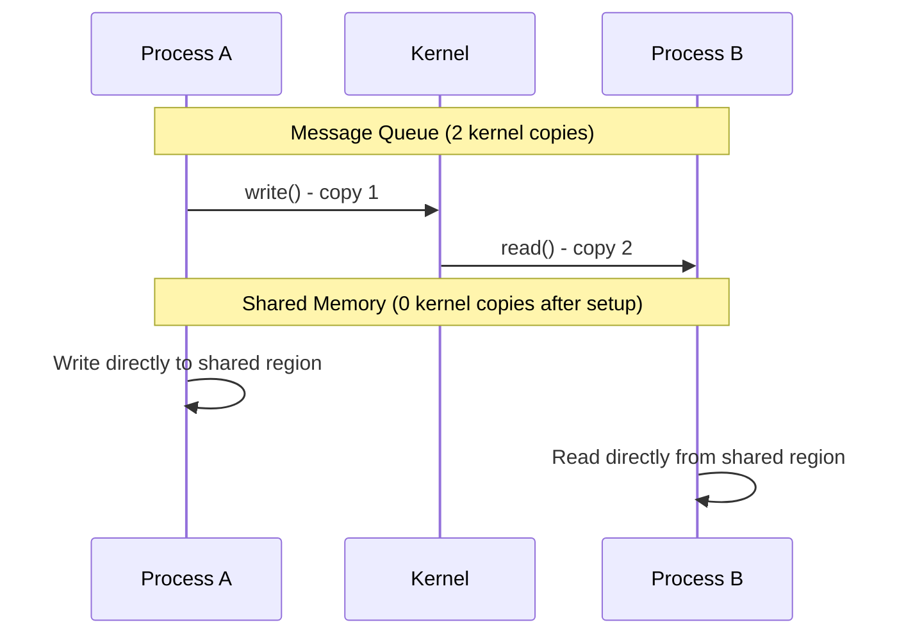
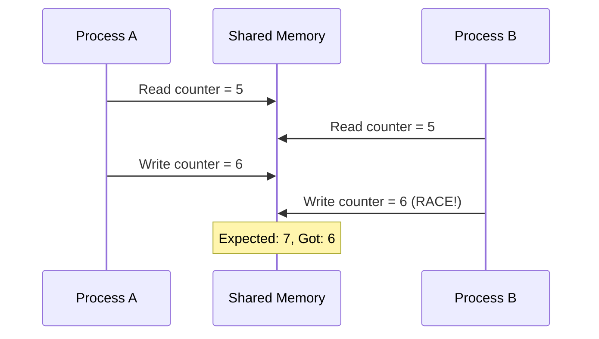
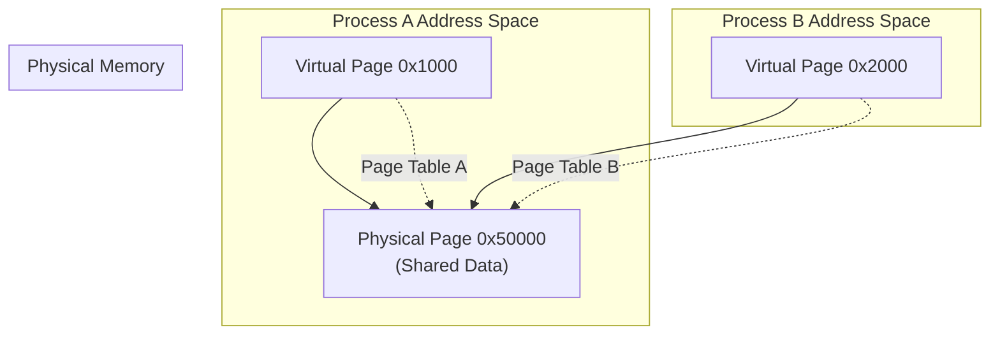

# Shared Memory

## Overview

**Shared memory** is the fastest IPC mechanism available. It allows multiple processes to map the same physical memory region into their address spaces. Once set up, data transfer requires no kernel involvement — processes read and write directly.

> **Interview one-liner:** "Shared memory lets processes map the same physical pages into their address spaces — it's the fastest IPC because data transfer happens in user space with no kernel copies."

## Why is Shared Memory the Fastest?



| Mechanism | Data Copies | Typical Latency |
|-----------|-------------|-----------------|
| Pipe | 2 (user→kernel, kernel→user) | 1-5 μs |
| Message Queue | 2 | 2-10 μs |
| Shared Memory | 0 (after mmap) | 0.1-1 μs |

## POSIX Shared Memory API

### Creating and Mapping

```c
#include <sys/mman.h>
#include <sys/stat.h>
#include <fcntl.h>
#include <unistd.h>

// 1. Create shared memory object
int fd = shm_open("/myshm", O_CREAT | O_RDWR, 0644);
ftruncate(fd, 4096);  // Set size

// 2. Map into process address space
void *ptr = mmap(NULL, 4096, PROT_READ | PROT_WRITE, MAP_SHARED, fd, 0);

// 3. Use the memory
int *data = (int *)ptr;
*data = 42;

// 4. Cleanup
munmap(ptr, 4096);
close(fd);
shm_unlink("/myshm");  // Removes the name
```

### Example: Two Processes Sharing Data

**Writer (writer.c):**
```c
#include <sys/mman.h>
#include <fcntl.h>
#include <unistd.h>
#include <string.h>
#include <stdio.h>

struct shared_data {
    int counter;
    char message[256];
    int ready;  // Flag
};

int main() {
    int fd = shm_open("/example_shm", O_CREAT | O_RDWR, 0644);
    ftruncate(fd, sizeof(struct shared_data));
    
    struct shared_data *shared = mmap(NULL, sizeof(struct shared_data),
                                       PROT_READ | PROT_WRITE, MAP_SHARED, fd, 0);
    
    shared->counter = 0;
    for (int i = 0; i < 100; i++) {
        snprintf(shared->message, sizeof(shared->message),
                 "Message %d from writer (PID %d)", i, getpid());
        shared->counter = i;
        shared->ready = 1;
        usleep(50000);  // 50ms
    }
    
    munmap(shared, sizeof(struct shared_data));
    close(fd);
    shm_unlink("/example_shm");
    return 0;
}
```

**Reader (reader.c):**
```c
#include <sys/mman.h>
#include <fcntl.h>
#include <stdio.h>
#include <unistd.h>

struct shared_data {
    int counter;
    char message[256];
    int ready;
};

int main() {
    int fd = shm_open("/example_shm", O_RDWR, 0);
    struct shared_data *shared = mmap(NULL, sizeof(struct shared_data),
                                       PROT_READ | PROT_WRITE, MAP_SHARED, fd, 0);
    
    int last_counter = -1;
    while (1) {
        if (shared->ready && shared->counter != last_counter) {
            printf("Received [%d]: %s\n", shared->counter, shared->message);
            last_counter = shared->counter;
            if (shared->counter >= 99) break;
        }
        usleep(10000);  // 10ms polling
    }
    
    munmap(shared, sizeof(struct shared_data));
    close(fd);
    return 0;
}
```

## System V Shared Memory API

```c
#include <sys/ipc.h>
#include <sys/shm.h>

// 1. Create shared memory segment
key_t key = ftok("/tmp/shmfile", 'A');
int shmid = shmget(key, 4096, IPC_CREAT | 0644);

// 2. Attach to process address space
void *ptr = shmat(shmid, NULL, 0);

// 3. Use the memory
int *data = (int *)ptr;
*data = 42;

// 4. Detach
shmdt(ptr);

// 5. Remove (when no longer needed)
shmctl(shmid, IPC_RMID, NULL);
```

## Synchronization: The Critical Challenge

Shared memory provides **no built-in synchronization**. Without proper coordination, data races occur:



### Synchronization Primitives for Shared Memory

#### 1. POSIX Named Semaphores

```c
#include <semaphore.h>

// Named semaphore (works across processes)
sem_t *sem = sem_open("/mysem", O_CREAT, 0644, 1);

// Process A: write
sem_wait(sem);
shared->counter++;
sem_post(sem);

// Process B: read
sem_wait(sem);
int val = shared->counter;
sem_post(sem);
```

#### 2. Process-Shared Mutexes

```c
#include <pthread.h>

// Initialize mutex for process sharing
pthread_mutex_t *mutex = (pthread_mutex_t *)shared_region;
pthread_mutexattr_t attr;
pthread_mutexattr_init(&attr);
pthread_mutexattr_setpshared(&attr, PTHREAD_PROCESS_SHARED);
pthread_mutex_init(mutex, &attr);

// Use it
pthread_mutex_lock(mutex);
// Critical section
pthread_mutex_unlock(mutex);
```

#### 3. Futexes (Lightweight)

```c
#include <linux/futex.h>
#include <sys/syscall.h>

// Futex is a kernel-assisted userspace lock
// Fast path: atomic operation in user space (no syscall)
// Slow path: kernel blocks/wakes processes

int *futex_word = (int *)shared_region;

// Lock (simplified)
while (atomic_compare_exchange(futex_word, 0, 1) != 0) {
    syscall(SYS_futex, futex_word, FUTEX_WAIT, 1, NULL, NULL, 0);
}

// Unlock
atomic_store(futex_word, 0);
syscall(SYS_futex, futex_word, FUTEX_WAKE, 1, NULL, NULL, 0);
```

## Lock-Free Data Structures

For maximum performance, use lock-free structures in shared memory:

### Single-Producer Single-Consumer (SPSC) Ring Buffer

```c
#define BUFFER_SIZE 1024

struct ring_buffer {
    int buffer[BUFFER_SIZE];
    atomic_int head;  // Written by producer
    atomic_int tail;  // Written by consumer
};

// Producer
void produce(struct ring_buffer *rb, int value) {
    while (atomic_load(&rb->tail) == 
           (atomic_load(&rb->head) + 1) % BUFFER_SIZE) {
        // Buffer full, spin
    }
    rb->buffer[atomic_load(&rb->head)] = value;
    atomic_store(&rb->head, (atomic_load(&rb->head) + 1) % BUFFER_SIZE);
}

// Consumer
int consume(struct ring_buffer *rb) {
    while (atomic_load(&rb->head) == atomic_load(&rb->tail)) {
        // Buffer empty, spin
    }
    int value = rb->buffer[atomic_load(&rb->tail)];
    atomic_store(&rb->tail, (atomic_load(&rb->tail) + 1) % BUFFER_SIZE);
    return value;
}
```

## Memory-Mapped Files as Shared Memory

```c
#include <sys/mman.h>
#include <fcntl.h>

// Map a file into memory (shared between processes)
int fd = open("shared.dat", O_RDWR | O_CREAT, 0644);
ftruncate(fd, 4096);

void *ptr = mmap(NULL, 4096, PROT_READ | PROT_WRITE, MAP_SHARED, fd, 0);

// Changes are written back to the file
// Another process can mmap the same file
```

## Shared Memory Internals



The kernel maps the same physical page into both processes' page tables. Virtual addresses can differ; the physical address is the same.

## Linux Commands

```bash
# List shared memory segments
ipcs -m

# Detailed info
ipcs -m -i <shmid>

# Remove a segment
ipcrm -m <shmid>

# POSIX shared memory
ls -la /dev/shm/    # POSIX shm objects appear here

# Check shared memory limits
cat /proc/sys/kernel/shmmax    # Max segment size
cat /proc/sys/kernel/shmall    # Total shared memory pages
cat /proc/sys/kernel/shmmni    # Max number of segments
```

## Interview Questions

### Beginner

**Q1: Why is shared memory the fastest IPC mechanism?**  
A: After setup, data transfer happens directly in user space — processes read/write to the same physical memory with no kernel involvement. Pipes and message queues require copying data through kernel buffers.

**Q2: What is the main challenge with shared memory?**  
A: Synchronization. Since multiple processes access the same memory, you need semaphores, mutexes, or lock-free algorithms to prevent data races.

### Intermediate

**Q3: How does `mmap` with `MAP_SHARED` work?**  
A: `mmap(MAP_SHARED)` maps a file (or anonymous memory) into the process's address space. With `MAP_SHARED`, modifications are visible to other processes that map the same file/region. The kernel maps the same physical pages into multiple page tables. Changes are written back to the file (for file-backed mappings).

**Q4: What is the difference between `MAP_SHARED` and `MAP_PRIVATE`?**  
A: `MAP_SHARED`: Changes are visible to other processes and written to the file. `MAP_PRIVATE`: Copy-on-Write — changes are private to the process and NOT written to the file. Use `MAP_SHARED` for IPC, `MAP_PRIVATE` for loading files without modification.

**Q5: How do you clean up shared memory in Linux?**  
A: POSIX: `shm_unlink("/name")` removes the name; memory stays until all processes `munmap()`. System V: `shmctl(shmid, IPC_RMID, NULL)` marks for deletion; memory is freed when last process detaches. Orphaned segments: check with `ipcs -m`, remove with `ipcrm -m`.

### FAANG-Level

**Q6: Design a shared memory-based IPC system for a real-time audio processing pipeline.**  
A: Requirements: <1ms latency, no drops. Design: 1) Lock-free SPSC ring buffer per stage, 2) `mlock()` to prevent pages from being swapped, 3) Huge pages (2MB) to reduce TLB misses, 4) CPU affinity to pin producer/consumer to specific cores, 5) Memory barriers (`atomic_thread_fence`) instead of mutexes, 6) Triple buffering for continuous processing, 7) `sched_setscheduler(SCHED_FIFO)` for real-time priority.

**Q7: How would you handle shared memory in a multi-process application that may crash?**  
A: 1) Use POSIX shared memory (`shm_open`) — persists across crashes, 2) Implement heartbeat/watchdog: each process writes a timestamp; others detect stale timestamps, 3) Use advisory locks (`fcntl`) to detect stale holders, 4) Design crash-safe data structures (e.g., write-ahead log, atomic pointers), 5) Use `MAP_SHARED` with a backing file for persistence, 6) Implement recovery: on startup, check for stale segments and clean up.

**Q8: Compare shared memory synchronization options for performance.**  
A: **Spinlock** (fastest for <1μs critical sections, wastes CPU), **Mutex** (kernel-assisted, good for longer waits, ~0.5μs overhead), **Semaphore** (for signaling, ~0.5μs), **Futex** (best of both: fast path in user space, slow path in kernel), **Lock-free** (no synchronization overhead, but complex to implement correctly). For HFT: lock-free SPSC queue. For general: futex-based mutex. For simplicity: named semaphore.

## Common Mistakes

1. **No synchronization:** Shared memory without locking = data races. Always use semaphores, mutexes, or atomics.
2. **Forgetting cleanup:** Shared memory persists until explicitly removed. Orphaned segments waste memory.
3. **Not handling crashes:** If a process crashes while holding a lock, other processes deadlock. Use robust mutexes (`PTHREAD_MUTEX_ROBUST`).
4. **Alignment issues:** Shared data structures must be properly aligned. Use `__attribute__((aligned))` or `alignas`.
5. **Assuming atomicity:** Even simple operations like `counter++` are not atomic. Use `atomic_int` or explicit locks.

## Summary

| Feature | POSIX SHM | System V SHM |
|---------|-----------|--------------|
| Creation | `shm_open()` | `shmget()` |
| Mapping | `mmap()` | `shmat()` |
| Naming | String (`/name`) | Key (`ftok()`) |
| Cleanup | `shm_unlink()` | `shmctl(IPC_RMID)` |
| Location | `/dev/shm` | Kernel managed |
| Speed | Fastest IPC | Fastest IPC |

## Cross-References

- [IPC Overview](./ipc.md) - All IPC mechanisms
- [Semaphores](../synchronization/semaphores.md) - Synchronization for shared memory
- [Mutexes](../synchronization/mutex.md) - Mutual exclusion primitives
- [Spinlocks](../synchronization/spinlocks.md) - Low-latency locking
- [Virtual Memory](../virtual-memory/README.md) - How mmap works
