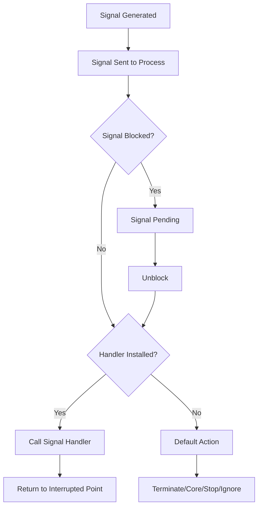

# Signals

## Overview

**Signals** are asynchronous notifications sent to a process to notify it of events. They are the oldest and simplest form of IPC — a process can receive a signal at any time, interrupting its current execution.

> **Interview one-liner:** "Signals are asynchronous, kernel-mediated notifications that interrupt a process to handle events — they're lightweight but carry no data beyond the signal number."

## Common Signals

| Signal | Number | Default Action | Description |
|--------|--------|---------------|-------------|
| `SIGHUP` | 1 | Terminate | Terminal hangup; often used to reload config |
| `SIGINT` | 2 | Terminate | Interrupt (Ctrl+C) |
| `SIGQUIT` | 3 | Core dump | Quit (Ctrl+backslash) |
| `SIGKILL` | 9 | Terminate | **Cannot be caught or ignored** |
| `SIGSEGV` | 11 | Core dump | Segmentation fault (invalid memory access) |
| `SIGPIPE` | 13 | Terminate | Write to pipe with no readers |
| `SIGALRM` | 14 | Terminate | Timer expired (`alarm()`) |
| `SIGTERM` | 15 | Terminate | Graceful termination request |
| `SIGCHLD` | 17 | Ignore | Child process terminated/stopped |
| `SIGSTOP` | 19 | Stop | **Cannot be caught or ignored** |
| `SIGCONT` | 18 | Continue | Continue if stopped |
| `SIGUSR1` | 10 | Terminate | User-defined signal 1 |
| `SIGUSR2` | 12 | Terminate | User-defined signal 2 |

## Signal Lifecycle



## Sending Signals

```c
#include <signal.h>
#include <sys/types.h>

// From command line:
// kill -SIGTERM <pid>
// kill -9 <pid>      (SIGKILL)

// From C code:
kill(pid, SIGTERM);        // Send to process
kill(pid, 0);              // Check if process exists (no signal sent)
kill(-pgrp, SIGTERM);      // Send to process group
raise(SIGUSR1);            // Send to self
killpg(pgrp, SIGTERM);     // Send to process group
```

## Handling Signals

### Using `signal()` (Simple)

```c
#include <signal.h>
#include <stdio.h>
#include <unistd.h>

void handler(int sig) {
    printf("Caught signal %d\n", sig);
}

int main() {
    signal(SIGINT, handler);   // Handle Ctrl+C
    signal(SIGTERM, handler);  // Handle kill
    
    while (1) {
        sleep(1);
    }
    return 0;
}
```

### Using `sigaction()` (Recommended)

```c
#include <signal.h>
#include <stdio.h>
#include <string.h>
#include <unistd.h>

volatile sig_atomic_t got_signal = 0;

void handler(int sig) {
    got_signal = 1;  // Safe: sig_atomic_t is async-signal-safe
}

int main() {
    struct sigaction sa;
    memset(&sa, 0, sizeof(sa));
    sa.sa_handler = handler;
    sigemptyset(&sa.sa_mask);
    sa.sa_flags = SA_RESTART;  // Restart interrupted syscalls
    
    sigaction(SIGINT, &sa, NULL);
    sigaction(SIGTERM, &sa, NULL);
    
    while (!got_signal) {
        pause();  // Wait for signal
    }
    
    printf("Graceful shutdown...\n");
    return 0;
}
```

### Signal Mask (Blocking Signals)

```c
#include <signal.h>

sigset_t mask, oldmask;

// Block SIGINT
sigemptyset(&mask);
sigaddset(&mask, SIGINT);
sigprocmask(SIG_BLOCK, &mask, &oldmask);

// Critical section — SIGINT is blocked here
do_critical_work();

// Unblock SIGINT
sigprocmask(SIG_SETMASK, &oldmask, NULL);

// Check for pending signals
sigset_t pending;
sigpending(&pending);
if (sigismember(&pending, SIGINT)) {
    printf("SIGINT is pending\n");
}
```

## Async-Signal-Safe Functions

Only a limited set of functions are safe to call from signal handlers:

```c
// SAFE (async-signal-safe):
write()          // Use write(), not printf()
_exit()
signal()         // Re-registering the handler
sig_atomic_t     // Atomic variable access

// UNSAFE (may cause deadlocks/corruption):
printf()         // Uses internal locks
malloc()         // Uses internal locks
fprintf()        // Uses internal locks
```

```c
// Correct signal handler pattern:
void handler(int sig) {
    // Only set a flag (async-signal-safe)
    volatile sig_atomic_t flag = 1;
    // ... use write() if you must output
    const char msg[] = "Signal caught\n";
    write(STDOUT_FILENO, msg, sizeof(msg) - 1);
}
```

## Signals vs Other IPC

| Feature | Signals | Pipes | Shared Memory |
|---------|---------|-------|---------------|
| Data capacity | Signal number only | Unlimited bytes | Unlimited bytes |
| Direction | One-way (to process) | One-way | Bidirectional |
| Asynchronous | Yes | No (blocking) | No (needs sync) |
| Kernel copy | No | Yes | No (after setup) |
| Use case | Event notification | Data streaming | High-throughput data |

## Real-World Signal Usage

### Graceful Server Shutdown
```c
volatile sig_atomic_t running = 1;

void shutdown_handler(int sig) {
    running = 0;
}

int main() {
    signal(SIGTERM, shutdown_handler);
    signal(SIGINT, shutdown_handler);
    
    while (running) {
        // Accept connections, handle requests
    }
    
    // Cleanup: close sockets, flush buffers, save state
    cleanup();
    return 0;
}
```

### Configuration Reload (SIGHUP)
```c
volatile sig_atomic_t reload_config = 0;

void hup_handler(int sig) {
    reload_config = 1;
}

signal(SIGHUP, hup_handler);

while (1) {
    if (reload_config) {
        load_config();
        reload_config = 0;
    }
    handle_requests();
}
```

## Interview Questions

### Beginner

**Q1: What is a signal?**  
A: A signal is an asynchronous notification sent to a process by the kernel, another process, or itself. It interrupts the process's normal execution to handle an event (e.g., SIGINT for Ctrl+C, SIGKILL to force termination).

**Q2: What is the difference between SIGKILL and SIGTERM?**  
A: SIGTERM (15) is a polite request to terminate — the process can catch it and clean up gracefully. SIGKILL (9) is a forced termination — the process cannot catch, block, or ignore it. The kernel terminates it immediately.

**Q3: Can all signals be caught or ignored?**  
A: No. SIGKILL and SIGSTOP cannot be caught, blocked, or ignored. This ensures the system administrator can always terminate or stop a misbehaving process.

### Intermediate

**Q4: What is the difference between `signal()` and `sigaction()`?**  
A: `signal()` is simpler but has portability issues (behavior varies across Unix systems — some reset the handler after each signal). `sigaction()` is POSIX-standard, provides more control (signal masks, flags like SA_RESTART, SA_SIGINFO for extended info), and has consistent behavior. Always prefer `sigaction()` in production code.

**Q5: What is `sig_atomic_t` and why is it important?**  
A: `sig_atomic_t` is a type that can be read/written atomically, even in the presence of asynchronous signals. In a signal handler, you can only safely modify `volatile sig_atomic_t` variables. Using non-atomic types can lead to torn reads/writes.

**Q6: What is a pending signal?**  
A: A signal that has been generated but not yet delivered because it's currently blocked. When the signal is unblocked, pending signals are delivered. You can check pending signals with `sigpending()`.

### FAANG-Level

**Q7: How would you implement a reliable signal-based IPC system?**  
A: Signals are unreliable by design (multiple signals of the same type may be merged). For reliable notification: 1) Use `sigaction()` with `SA_SIGINFO` to get sender PID and data, 2) Use `sigqueue()` to send signals with an integer payload, 3) Use signalfd (Linux) to convert signals to file descriptor events (integrates with epoll), 4) Use POSIX timers with `SIGEV_SIGNAL` for timer-based events, 5) For data transfer: signals are too limited — use them only for notification, pair with shared memory or pipes for data.

**Q8: Explain signal handling in multi-threaded programs.**  
A: 1) Signal handlers are shared across all threads in a process, 2) A signal is delivered to exactly one thread (implementation-defined, or to a specific thread with `pthread_kill()`), 3) Use `pthread_sigmask()` to block signals in specific threads, 4) Common pattern: dedicate one thread to handle all signals (block in all others, `sigwait()` in the handler thread), 5) SIGKILL/SIGSTOP affect the entire process.

**Q9: How does `signalfd` work and when would you use it?**  
A: `signalfd()` creates a file descriptor that can be read to receive signals. This converts signals into file descriptor events, allowing integration with `epoll`/`poll`/`select`. Use case: event-driven servers that use epoll for I/O — instead of having signal handlers interrupt the event loop, signals become readable events on the signalfd. This avoids async-signal-safety restrictions and integrates cleanly with the event loop.

## Common Mistakes

1. **Using `printf()` in signal handlers:** `printf()` is not async-signal-safe. Use `write()` instead.
2. **Not re-registering handlers with `signal()`:** On some systems, `signal()` resets the handler to SIG_DFL after each signal. Use `sigaction()` with `SA_RESETHAND` if you want this behavior, or omit it for persistent handlers.
3. **Assuming signal delivery order:** If multiple signals are pending, the order of delivery is unspecified.
4. **Forgetting to handle SIGPIPE:** Writing to a broken pipe kills the process. Handle it or use `MSG_NOSIGNAL`.
5. **Relying on signals for data transfer:** Signals only carry a number (and optionally an integer with `sigqueue`). Use pipes or shared memory for actual data.

## Summary

| Aspect | Key Point |
|--------|-----------|
| Purpose | Asynchronous event notification |
| Data capacity | Signal number + optional integer |
| Catchable | All except SIGKILL, SIGSTOP |
| Handler safety | Only async-signal-safe functions (write, _exit) |
| Preferred API | `sigaction()` over `signal()` |
| Multi-threading | Use dedicated signal-handling thread |

## Cross-References

- [IPC Overview](./ipc.md) - All IPC mechanisms
- [Zombie & Orphan](./zombie-orphan.md) - SIGCHLD signal
- [Process States](./states.md) - Signals that change states (SIGSTOP, SIGCONT)
- [Synchronization](../synchronization/README.md) - Alternatives to signal-based coordination
