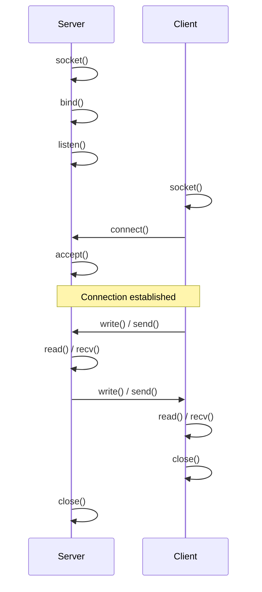

# Sockets

## Overview

**Sockets** are the most versatile IPC mechanism — they work across **different machines** over a network, as well as between processes on the same machine. Sockets provide a bidirectional, reliable (TCP) or unreliable (UDP) communication channel.

> **Interview one-liner:** "Sockets are network-capable IPC endpoints that support bidirectional communication — they work both locally (Unix domain) and across networks (TCP/UDP)."

## Socket Types

| Type | Protocol | Reliability | Connection | Use Case |
|------|----------|-------------|------------|----------|
| **Stream (SOCK_STREAM)** | TCP | Reliable, ordered | Connection-oriented | Web, SSH, databases |
| **Datagram (SOCK_DGRAM)** | UDP | Unreliable, unordered | Connectionless | DNS, gaming, video |
| **Raw (SOCK_RAW)** | IP | Manual | Manual | Packet crafting, ping |
| **Unix Domain (SOCK_STREAM/_DGRAM)** | None | Reliable | Local | Local IPC |

## TCP Socket Example

### Server

```c
#include <stdio.h>
#include <stdlib.h>
#include <string.h>
#include <unistd.h>
#include <sys/socket.h>
#include <netinet/in.h>
#include <arpa/inet.h>

int main() {
    int server_fd, client_fd;
    struct sockaddr_in addr;
    char buffer[1024];
    
    // 1. Create socket
    server_fd = socket(AF_INET, SOCK_STREAM, 0);
    
    // 2. Set SO_REUSEADDR
    int opt = 1;
    setsockopt(server_fd, SOL_SOCKET, SO_REUSEADDR, &opt, sizeof(opt));
    
    // 3. Bind
    addr.sin_family = AF_INET;
    addr.sin_addr.s_addr = INADDR_ANY;
    addr.sin_port = htons(8080);
    bind(server_fd, (struct sockaddr *)&addr, sizeof(addr));
    
    // 4. Listen
    listen(server_fd, 5);
    printf("Server listening on port 8080\n");
    
    // 5. Accept
    socklen_t addr_len = sizeof(addr);
    client_fd = accept(server_fd, (struct sockaddr *)&addr, &addr_len);
    printf("Client connected: %s:%d\n", 
           inet_ntoa(addr.sin_addr), ntohs(addr.sin_port));
    
    // 6. Read/Write
    int n = read(client_fd, buffer, sizeof(buffer));
    write(client_fd, "Hello from server!", 18);
    
    // 7. Cleanup
    close(client_fd);
    close(server_fd);
    return 0;
}
```

### Client

```c
#include <stdio.h>
#include <stdlib.h>
#include <string.h>
#include <unistd.h>
#include <sys/socket.h>
#include <netinet/in.h>
#include <arpa/inet.h>

int main() {
    int sockfd;
    struct sockaddr_in addr;
    char buffer[1024];
    
    // 1. Create socket
    sockfd = socket(AF_INET, SOCK_STREAM, 0);
    
    // 2. Connect
    addr.sin_family = AF_INET;
    addr.sin_port = htons(8080);
    inet_pton(AF_INET, "127.0.0.1", &addr.sin_addr);
    connect(sockfd, (struct sockaddr *)&addr, sizeof(addr));
    
    // 3. Send/Receive
    write(sockfd, "Hello from client!", 18);
    int n = read(sockfd, buffer, sizeof(buffer));
    buffer[n] = '\0';
    printf("Server says: %s\n", buffer);
    
    // 4. Cleanup
    close(sockfd);
    return 0;
}
```

## Unix Domain Sockets

For local IPC (same machine), Unix domain sockets are faster than TCP (no network stack overhead):

```c
#include <sys/un.h>

// Server
int server_fd = socket(AF_UNIX, SOCK_STREAM, 0);
struct sockaddr_un addr;
addr.sun_family = AF_UNIX;
strcpy(addr.sun_path, "/tmp/mysocket");
unlink("/tmp/mysocket");
bind(server_fd, (struct sockaddr *)&addr, sizeof(addr));
listen(server_fd, 5);

// Client
int client_fd = socket(AF_UNIX, SOCK_STREAM, 0);
struct sockaddr_un addr;
addr.sun_family = AF_UNIX;
strcpy(addr.sun_path, "/tmp/mysocket");
connect(client_fd, (struct sockaddr *)&addr, sizeof(addr));
```

## Socket System Calls Flow



## UDP Socket Example

```c
// Sender (UDP)
int sockfd = socket(AF_INET, SOCK_DGRAM, 0);
struct sockaddr_in dest;
dest.sin_family = AF_INET;
dest.sin_port = htons(8080);
inet_pton(AF_INET, "127.0.0.1", &dest.sin_addr);

sendto(sockfd, "Hello UDP", 9, 0, 
       (struct sockaddr *)&dest, sizeof(dest));

// Receiver (UDP)
int sockfd = socket(AF_INET, SOCK_DGRAM, 0);
struct sockaddr_in addr;
addr.sin_family = AF_INET;
addr.sin_addr.s_addr = INADDR_ANY;
addr.sin_port = htons(8080);
bind(sockfd, (struct sockaddr *)&addr, sizeof(addr));

char buffer[1024];
struct sockaddr_in sender;
socklen_t sender_len = sizeof(sender);
int n = recvfrom(sockfd, buffer, sizeof(buffer), 0,
                 (struct sockaddr *)&sender, &sender_len);
```

## Performance Comparison

| Socket Type | Latency | Throughput | Kernel Overhead |
|-------------|---------|------------|-----------------|
| Unix Domain | ~2-5 μs | ~5-10 GB/s | Minimal (no network stack) |
| TCP Loopback | ~10-30 μs | ~10-50 Gbps | Full TCP stack |
| UDP Loopback | ~5-15 μs | ~10-50 Gbps | UDP stack |
| TCP over LAN | ~50-200 μs | ~1-10 Gbps | Full network stack |

## Interview Questions

### Beginner

**Q1: What is a socket?**  
A: A socket is an endpoint for communication. It's an abstraction that allows processes to send and receive data, either locally (Unix domain) or over a network (TCP/UDP).

**Q2: What is the difference between TCP and UDP sockets?**  
A: TCP (SOCK_STREAM): reliable, ordered, connection-oriented, error-checked. UDP (SOCK_DGRAM): unreliable, unordered, connectionless, lightweight. TCP for accuracy (web, email); UDP for speed (gaming, video streaming).

### Intermediate

**Q3: What is `SO_REUSEADDR` and why is it needed?**  
A: Without `SO_REUSEADDR`, a recently closed socket's address enters TIME_WAIT state (~60s), preventing immediate rebinding. This is problematic for servers that restart. Setting `SO_REUSEADDR` allows binding to an address in TIME_WAIT.

**Q4: How do Unix domain sockets compare to TCP sockets for local IPC?**  
A: Unix domain sockets: no network stack overhead, file-system based addressing, can pass file descriptors and credentials (`SCM_RIGHTS`), ~2-5μs latency. TCP loopback: full TCP stack overhead, IP-based addressing, ~10-30μs latency. Unix sockets are 3-5x faster for local IPC.

**Q5: Explain the `listen()` backlog parameter.**  
A: `listen(sockfd, backlog)` sets the maximum length of the pending connection queue. When the server hasn't called `accept()` fast enough, new connections queue here. If the queue is full, new connections receive ECONNREFUSED (TCP) or are silently dropped (implementation-dependent). Modern Linux: `backlog` is capped by `/proc/sys/net/core/somaxconn` (default 4096).

### FAANG-Level

**Q6: Design a TCP server handling 1 million concurrent connections.**  
A: 1) Use epoll (Linux) or io_uring for async I/O — avoid thread-per-connection, 2) SO_REUSEPORT for multiple listener sockets across CPUs, 3) Non-blocking sockets with edge-triggered epoll, 4) Per-CPU event loops with CPU affinity, 5) Minimize per-connection state (use connection pools), 6) Tune kernel: `net.core.somaxconn`, `net.ipv4.tcp_max_syn_backlog`, `fs.file-max`, 7) Memory: use slab allocators for connection objects, 8) Consider eBPF/XDP for packet filtering in kernel.

**Q7: How does `sendfile()` work and why is it faster than read()+write()?**  
A: `sendfile()` transfers data from a file descriptor to a socket directly in kernel space, avoiding the copy to user space. Normal: `read(file, user_buf)` → copy 1, `write(socket, user_buf)` → copy 2. `sendfile()`: kernel copies directly from page cache to socket buffer — zero-copy from user perspective. Used by Nginx, Apache for static file serving. Modern Linux also supports `splice()` for pipe-based zero-copy.

**Q8: Explain TCP connection establishment and teardown at the socket API level.**  
A: **Establishment (3-way handshake):** Client calls `connect()` → SYN sent → SYN-ACK received → ACK sent → `connect()` returns. Server: `listen()` → `accept()` blocks → SYN received → SYN-ACK sent → ACK received → `accept()` returns new fd. **Teardown (4-way):** Active close: `close()` → FIN sent → ACK received → wait for remote FIN → ACK sent → TIME_WAIT (2*MSL). Passive close: FIN received → `read()` returns 0 → ACK sent → `close()` → FIN sent → ACK received.

## Common Mistakes

1. **Not handling partial reads/writes:** TCP is a byte stream — `read()` may return less than requested. Always loop until all data is received.
2. **Forgetting `SO_REUSEADDR`:** Server restart fails with "Address already in use".
3. **Using TCP for simple request-response:** If you don't need reliability, UDP is simpler and faster.
4. **Not closing sockets:** Leads to file descriptor leaks and port exhaustion.
5. **Ignoring SIGPIPE:** Writing to a closed connection generates SIGPIPE. Use `send()` with `MSG_NOSIGNAL` or handle the signal.

## Summary

| Socket Type | Use Case | Connection | Reliability | Speed |
|-------------|----------|------------|-------------|-------|
| TCP | Web, databases, file transfer | Connection-oriented | Reliable, ordered | Medium |
| UDP | Gaming, video, DNS | Connectionless | Unreliable | Fast |
| Unix Domain | Local IPC | Both | Reliable | Fastest |

## Cross-References

- [IPC Overview](./ipc.md) - All IPC mechanisms
- [Networks](../../networks/osi/transport.md) - TCP/UDP details
- [I/O Multiplexing](../io/README.md) - epoll, select, poll
